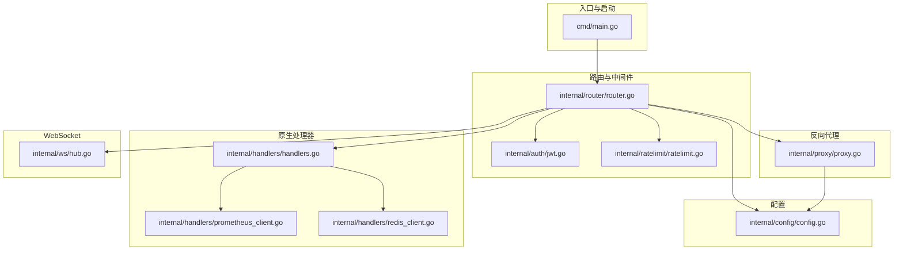
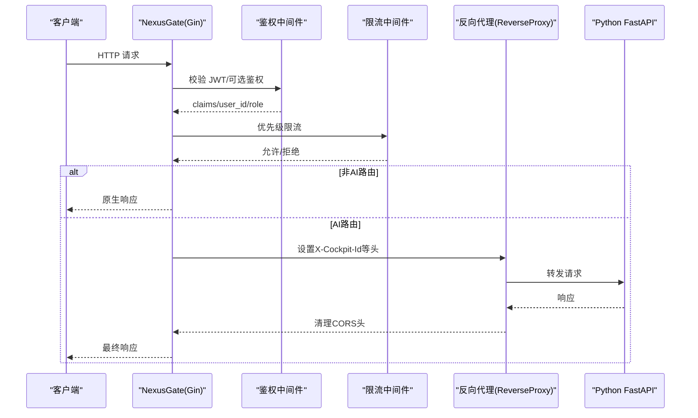
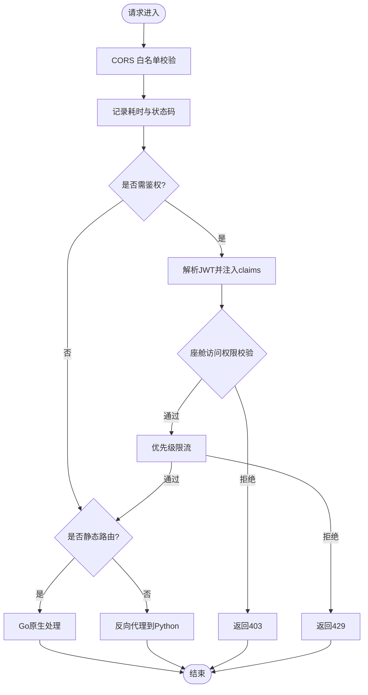
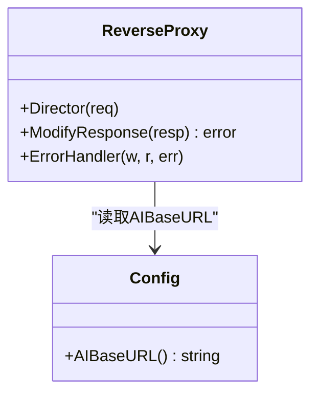
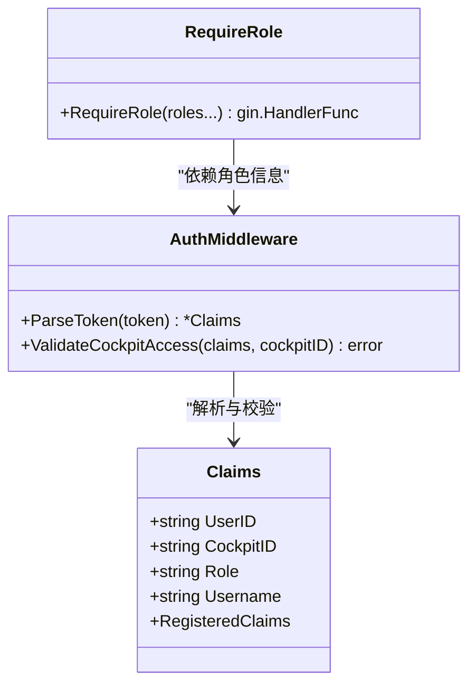
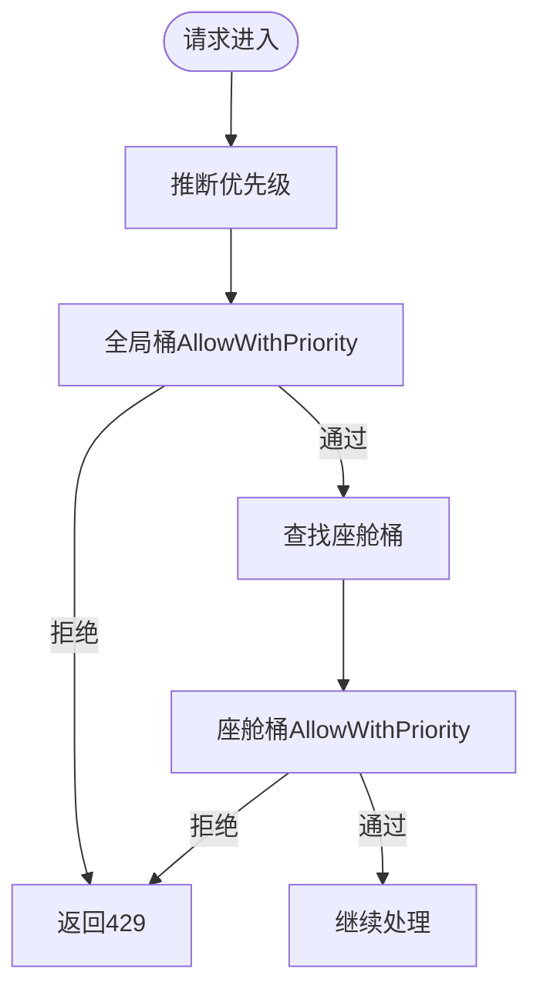
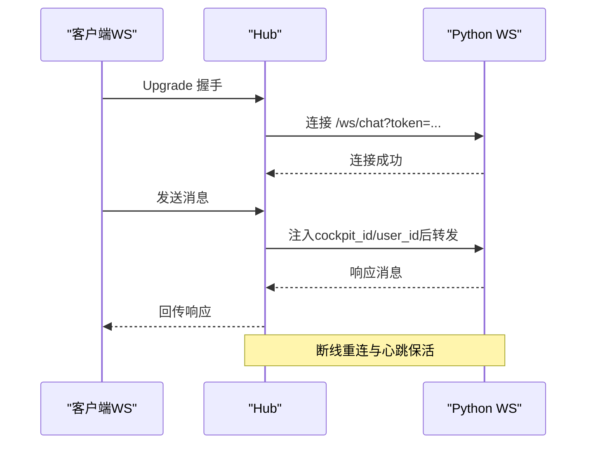
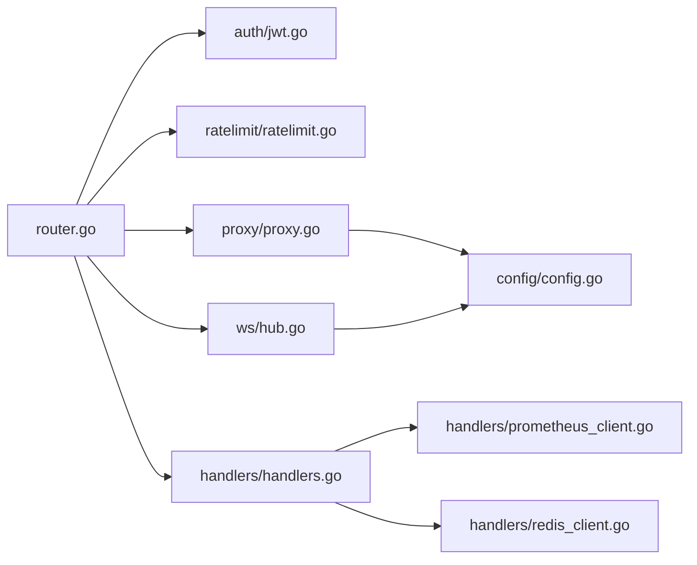

# 反向代理与路由

<cite>
**本文引用的文件**   
- [main.go](file://backend_design/nexus_gate/cmd/main.go)
- [router.go](file://backend_design/nexus_gate/internal/router/router.go)
- [proxy.go](file://backend_design/nexus_gate/internal/proxy/proxy.go)
- [jwt.go](file://backend_design/nexus_gate/internal/auth/jwt.go)
- [ratelimit.go](file://backend_design/nexus_gate/internal/ratelimit/ratelimit.go)
- [config.go](file://backend_design/nexus_gate/internal/config/config.go)
- [handlers.go](file://backend_design/nexus_gate/internal/handlers/handlers.go)
- [hub.go](file://backend_design/nexus_gate/internal/ws/hub.go)
- [prometheus_client.go](file://backend_design/nexus_gate/internal/handlers/prometheus_client.go)
- [redis_client.go](file://backend_design/nexus_gate/internal/handlers/redis_client.go)
- [go.mod](file://backend_design/nexus_gate/go.mod)
</cite>

## 目录
1. [简介](#简介)
2. [项目结构](#项目结构)
3. [核心组件](#核心组件)
4. [架构总览](#架构总览)
5. [详细组件分析](#详细组件分析)
6. [依赖关系分析](#依赖关系分析)
7. [性能考量](#性能考量)
8. [故障排查指南](#故障排查指南)
9. [结论](#结论)
10. [附录](#附录)

## 简介
本技术文档聚焦 NexusCockpit Go 网关（NexusGate）的反向代理与路由系统，系统性阐述请求路由策略、反向代理实现原理、非 AI 请求的快速路径处理、上下文传递、超时控制与重试策略，以及高性能网络编程最佳实践。同时提供配置优化建议、监控指标说明与故障诊断方法，并给出扩展新路由规则与处理逻辑的实践指引。

## 项目结构
NexusGate 采用模块化设计：入口启动、路由分发、鉴权限流、反向代理、WebSocket Hub、配置加载与原生处理器等模块职责清晰。

图表来源
- [main.go:1-202](file://backend_design/nexus_gate/cmd/main.go#L1-L202)
- [router.go:1-508](file://backend_design/nexus_gate/internal/router/router.go#L1-L508)
- [proxy.go:1-90](file://backend_design/nexus_gate/internal/proxy/proxy.go#L1-L90)
- [jwt.go:1-128](file://backend_design/nexus_gate/internal/auth/jwt.go#L1-L128)
- [ratelimit.go:1-178](file://backend_design/nexus_gate/internal/ratelimit/ratelimit.go#L1-L178)
- [config.go:1-218](file://backend_design/nexus_gate/internal/config/config.go#L1-L218)
- [handlers.go:1-431](file://backend_design/nexus_gate/internal/handlers/handlers.go#L1-L431)
- [hub.go:1-353](file://backend_design/nexus_gate/internal/ws/hub.go#L1-L353)
- [prometheus_client.go:1-100](file://backend_design/nexus_gate/internal/handlers/prometheus_client.go#L1-L100)
- [redis_client.go:1-185](file://backend_design/nexus_gate/internal/handlers/redis_client.go#L1-L185)

章节来源
- [main.go:1-202](file://backend_design/nexus_gate/cmd/main.go#L1-L202)
- [go.mod:1-44](file://backend_design/nexus_gate/go.mod#L1-L44)

## 核心组件
- 入口与生命周期管理：解析参数、加载 .env、初始化日志、启动服务、优雅关闭。
- 路由与中间件：Gin 路由注册、CORS、Prometheus 指标、JWT 鉴权、可选鉴权、角色校验、优先级限流。
- 反向代理：基于标准库 httputil.ReverseProxy，注入上游头、统一错误处理、剥离重复 CORS 头。
- 原生处理器：健康检查、中间件连通性检测、数据中台统计（Redis/Prometheus）、座舱列表。
- WebSocket Hub：连接管理、消息转发、后端重连、心跳保活。
- 配置中心：环境变量加载、生产环境安全检查、AIBaseURL 生成。

章节来源
- [main.go:34-153](file://backend_design/nexus_gate/cmd/main.go#L34-L153)
- [router.go:58-251](file://backend_design/nexus_gate/internal/router/router.go#L58-L251)
- [proxy.go:23-90](file://backend_design/nexus_gate/internal/proxy/proxy.go#L23-L90)
- [handlers.go:377-414](file://backend_design/nexus_gate/internal/handlers/handlers.go#L377-L414)
- [hub.go:150-190](file://backend_design/nexus_gate/internal/ws/hub.go#L150-L190)
- [config.go:80-118](file://backend_design/nexus_gate/internal/config/config.go#L80-L118)

## 架构总览
NexusGate 作为统一接入网关，承担以下职责：
- 静态路由匹配：对 /health、/auth/token、/dataplatform/*、/middleware/*、/settings/* 等直接由 Go 原生处理或选择性转发。
- 动态路由生成：/cockpit/:cockpit_id 下的对话、车控、ASR/TTS 等需要 AI 的请求，经鉴权与限流后统一转发到 Python FastAPI。
- 负载均衡算法：当前为单目标反向代理（SingleHost），未内置多后端轮询；可通过扩展 Director 实现简单权重/一致性哈希。
- 非 AI 快速路径：无需进入 AI 流程的接口在 Go 层直接返回，降低延迟与负载。
- 上下文传递：通过 JWT claims 和请求头 X-Cockpit-Id/X-User-Id/X-User-Role 贯穿全链路。
- 超时与错误处理：客户端断开静默处理、AI 不可用返回 502、自定义 Recovery 避免误捕获标准库 panic。

图表来源
- [router.go:143-249](file://backend_design/nexus_gate/internal/router/router.go#L143-L249)
- [proxy.go:33-77](file://backend_design/nexus_gate/internal/proxy/proxy.go#L33-L77)

## 详细组件分析

### 路由与中间件
- 静态路由：/metrics、/health、/auth/token、/dataplatform/*、/middleware/*、/settings/* 等。
- 动态路由：/cockpit/:cockpit_id/* 下所有 AI 相关接口。
- 兜底反代：NoRoute 将未注册路由统一转发至 Python，保证前端只需指向网关。
- 中间件链：Logger → Recovery（特殊处理 http.ErrAbortHandler）→ CORS → Prometheus 指标 → 鉴权 → 限流 → Handler。

图表来源
- [router.go:58-251](file://backend_design/nexus_gate/internal/router/router.go#L58-L251)
- [router.go:361-457](file://backend_design/nexus_gate/internal/router/router.go#L361-L457)

章节来源
- [router.go:58-251](file://backend_design/nexus_gate/internal/router/router.go#L58-L251)
- [router.go:361-457](file://backend_design/nexus_gate/internal/router/router.go#L361-L457)

### 反向代理实现
- 使用 httputil.NewSingleHostReverseProxy 指向 Python AI Base URL。
- Director 注入 X-Forwarded-* 与真实客户端 IP（X-Forwarded-For）。
- ModifyResponse 删除上游 CORS 头，避免浏览器收到重复值。
- ErrorHandler 区分客户端主动断开与后端不可用，分别静默处理与返回 502。

图表来源
- [proxy.go:23-90](file://backend_design/nexus_gate/internal/proxy/proxy.go#L23-L90)
- [config.go:174-177](file://backend_design/nexus_gate/internal/config/config.go#L174-L177)

章节来源
- [proxy.go:23-90](file://backend_design/nexus_gate/internal/proxy/proxy.go#L23-L90)

### 认证与授权（JWT + RBAC）
- Claims 包含 user_id、cockpit_id、role、username 及标准 RegisteredClaims。
- GenerateToken 签发 HS256 Token，Subject 必须设置以兼容 Python 侧鉴权。
- ParseToken 支持 Bearer 前缀与空串处理，失败返回错误。
- ValidateCockpitAccess 限制非 super_admin 仅能访问绑定座舱。
- RequireRole 中间件按角色放行。

图表来源
- [jwt.go:19-88](file://backend_design/nexus_gate/internal/auth/jwt.go#L19-L88)
- [router.go:361-457](file://backend_design/nexus_gate/internal/router/router.go#L361-L457)

章节来源
- [jwt.go:19-88](file://backend_design/nexus_gate/internal/auth/jwt.go#L19-L88)
- [router.go:361-457](file://backend_design/nexus_gate/internal/router/router.go#L361-L457)

### 限流器（优先级令牌桶）
- 三级优先级：高（车控/ASR/TTS）、普通（对话）、低（状态查询）。
- 每个座舱独立令牌桶，全局桶容量为座舱上限×3。
- 不同优先级可用令牌比例：高=100%，普通=80%，低=50%。
- AllowWithPriority 先检查全局桶，再检查座舱桶。

图表来源
- [ratelimit.go:26-157](file://backend_design/nexus_gate/internal/ratelimit/ratelimit.go#L26-L157)
- [router.go:459-495](file://backend_design/nexus_gate/internal/router/router.go#L459-L495)

章节来源
- [ratelimit.go:26-157](file://backend_design/nexus_gate/internal/ratelimit/ratelimit.go#L26-L157)
- [router.go:459-495](file://backend_design/nexus_gate/internal/router/router.go#L459-L495)

### WebSocket Hub（实时通道）
- Upgrader 按 CORS_ORIGINS 校验来源，防止跨站劫持。
- Hub 维护 cockpit_id → clients 映射，支持广播与注销。
- Client 封装读写泵：writePump 定时 Ping，readPump 转发消息到 Python 后端。
- 后端断线自动重连，发送缓冲满时关闭连接保护。

图表来源
- [hub.go:150-190](file://backend_design/nexus_gate/internal/ws/hub.go#L150-L190)
- [hub.go:221-248](file://backend_design/nexus_gate/internal/ws/hub.go#L221-L248)
- [hub.go:276-326](file://backend_design/nexus_gate/internal/ws/hub.go#L276-L326)

章节来源
- [hub.go:150-190](file://backend_design/nexus_gate/internal/ws/hub.go#L150-L190)
- [hub.go:221-248](file://backend_design/nexus_gate/internal/ws/hub.go#L221-L248)
- [hub.go:276-326](file://backend_design/nexus_gate/internal/ws/hub.go#L276-L326)

### 原生处理器（非AI快速路径）
- HealthCheck：TCP 探测 Redis 与 Python AI，返回整体健康状态。
- MiddlewareStatus：循环检查 Redis/MySQL/Milvus/Neo4j/Python AI 连通性。
- DataPlatformOverview：聚合各座舱 Redis 统计，计算命中率与平均延迟。
- DataPlatformConcurrency：通过 Prometheus API 查询并发/QPS/峰值。
- ListCockpits：从配置生成座舱列表（主题色与名称可配置）。

章节来源
- [handlers.go:377-414](file://backend_design/nexus_gate/internal/handlers/handlers.go#L377-L414)
- [handlers.go:101-146](file://backend_design/nexus_gate/internal/handlers/handlers.go#L101-L146)
- [handlers.go:205-273](file://backend_design/nexus_gate/internal/handlers/handlers.go#L205-L273)
- [handlers.go:275-296](file://backend_design/nexus_gate/internal/handlers/handlers.go#L275-L296)
- [handlers.go:338-371](file://backend_design/nexus_gate/internal/handlers/handlers.go#L338-L371)

### 配置与安全
- 环境变量加载：支持 NEXUS_GATE_*、JWT_SECRET/JWT_SECRET_KEY、RBAC_*、CORS_ORIGINS、RATE_LIMIT_QPS、COCKPIT_* 等。
- 生产环境安全检查：默认弱密钥/弱口令/CORS 通配符将拒绝启动。
- AIBaseURL：根据 AIHost/AIPort 生成，供反向代理使用。

章节来源
- [config.go:80-118](file://backend_design/nexus_gate/internal/config/config.go#L80-L118)
- [config.go:120-142](file://backend_design/nexus_gate/internal/config/config.go#L120-L142)
- [config.go:174-177](file://backend_design/nexus_gate/internal/config/config.go#L174-L177)

## 依赖关系分析
- Gin 路由框架承载中间件链与路由注册。
- JWT 鉴权依赖 golang-jwt 库。
- Prometheus 指标采集依赖 prometheus/client_golang。
- WebSocket 通信依赖 gorilla/websocket。
- 反向代理依赖 net/http/httputil。
- 简易 Redis 客户端通过 RESP 协议直连，避免引入 go-redis。

图表来源
- [go.mod:1-44](file://backend_design/nexus_gate/go.mod#L1-L44)
- [router.go:1-508](file://backend_design/nexus_gate/internal/router/router.go#L1-L508)

章节来源
- [go.mod:1-44](file://backend_design/nexus_gate/go.mod#L1-L44)

## 性能考量
- 连接复用：反向代理使用标准库单主机代理，默认启用 HTTP Keep-Alive；WebSocket 长连接复用后端连接。
- 缓冲优化：WebSocket writePump 使用带缓冲 channel，读限制 64KB 支持语音数据；Prometheus 指标标签截断 path 避免基数爆炸。
- 内存管理：Hub 按座舱隔离 client map，写操作加锁，读操作使用 RWMutex；错误路径及时关闭连接释放资源。
- 超时控制：WebSocket 写超时 10s，读超时 60s；Prometheus 查询 3s 超时；健康检查 TCP 拨号 3s。
- 降级策略：Redis 不可用时统计数据降级返回；AI 不可用返回 502；可选鉴权接口无 Token 仍可查看。

[本节为通用指导，不直接分析具体文件]

## 故障排查指南
- 健康检查：调用 /health 查看 Redis 与 Python AI 状态；/middleware/* 检查各中间件连通性与延迟。
- 指标观测：/metrics 暴露 Prometheus 指标；DataPlatformConcurrency 通过 Prometheus API 获取并发/QPS。
- 常见问题：
  - 客户端断开导致 502：ErrorHandler 已区分 context.Canceled 与“forcibly closed”，静默处理。
  - CORS 重复头：ModifyResponse 已删除上游 CORS 头，确保仅网关一层控制。
  - JWT 鉴权失败：检查 JWT_SECRET/JWT_SECRET_KEY 对齐、Subject 字段设置、Bearer 前缀。
  - 限流触发：检查优先级判断与 QPS 配置，必要时调整 RATE_LIMIT_QPS。
- 日志定位：启动日志输出到 logs/go_logs/gateway_*.log，包含关键配置脱敏打印。

章节来源
- [handlers.go:377-414](file://backend_design/nexus_gate/internal/handlers/handlers.go#L377-L414)
- [handlers.go:101-146](file://backend_design/nexus_gate/internal/handlers/handlers.go#L101-L146)
- [prometheus_client.go:42-79](file://backend_design/nexus_gate/internal/handlers/prometheus_client.go#L42-L79)
- [proxy.go:79-89](file://backend_design/nexus_gate/internal/proxy/proxy.go#L79-L89)
- [main.go:95-112](file://backend_design/nexus_gate/cmd/main.go#L95-L112)

## 结论
NexusGate 通过清晰的分层与模块化设计，实现了高效、安全、可扩展的反向代理与路由系统。静态路由快速路径与动态 AI 路由分离，结合 JWT 鉴权、优先级限流与 Prometheus 监控，满足高并发与多租户场景需求。未来可在 Director 中扩展负载均衡策略，增强连接池与重试机制，进一步提升稳定性与吞吐。

[本节为总结性内容，不直接分析具体文件]

## 附录

### 添加新路由规则与处理逻辑（实践指引）
- 新增 Go 原生路由：
  - 在 SetupRouter 中定义路由组与 Handler，参考 /dataplatform 或 /settings 分组方式。
  - 如需鉴权，使用 AuthMiddleware 或 OptionalAuthMiddleware；如需角色校验，组合 RequireRole。
  - 示例路径参考：[router.go:154-201](file://backend_design/nexus_gate/internal/router/router.go#L154-L201)
- 新增 AI 转发路由：
  - 在 /cockpit/:cockpit_id 组内添加 proxyToPython 路由，自动继承鉴权与限流。
  - 示例路径参考：[router.go:206-222](file://backend_design/nexus_gate/internal/router/router.go#L206-L222)
- 新增 NoRoute 兜底：
  - 未注册路由将自动转发至 Python，确保前端统一接入网关。
  - 示例路径参考：[router.go:244-249](file://backend_design/nexus_gate/internal/router/router.go#L244-L249)

章节来源
- [router.go:143-249](file://backend_design/nexus_gate/internal/router/router.go#L143-L249)

### 代理配置优化建议
- 反向代理：
  - 若需多后端负载均衡，扩展 Director 实现轮询/一致性哈希。
  - 增加连接池与超时配置，提升高并发稳定性。
- 限流：
  - 根据业务调整优先级阈值与 QPS，观察 /metrics 与 DataPlatformConcurrency。
- 监控：
  - 完善 Prometheus 指标维度，避免高基数；定期导出与告警。
- 安全：
  - 生产环境强制强密钥、非通配 CORS、用户密码校验。

[本节为通用指导，不直接分析具体文件]