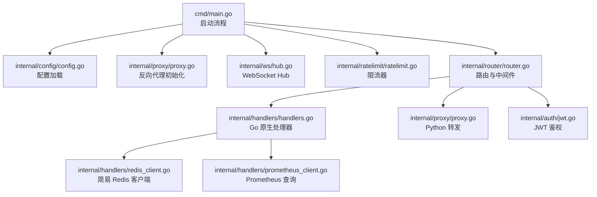
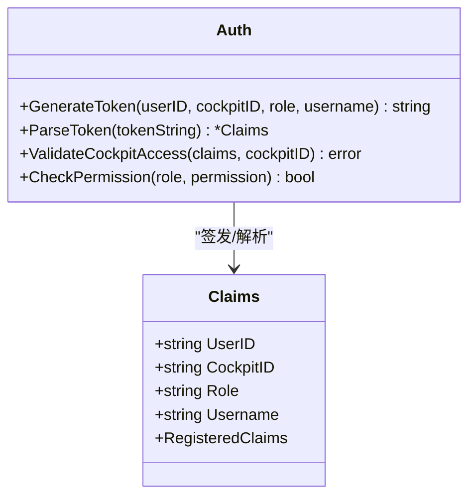
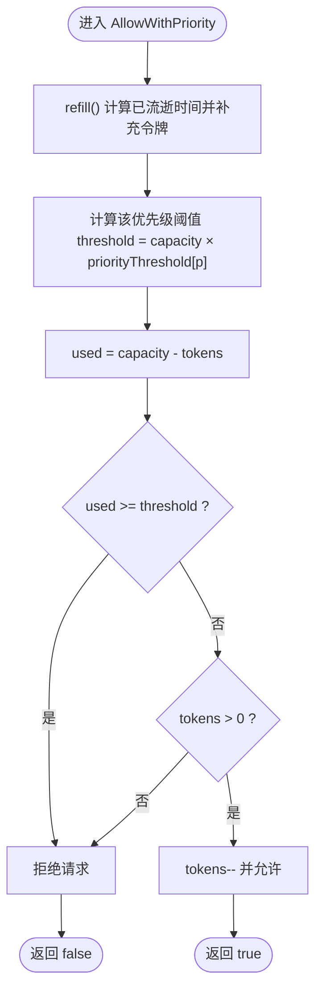
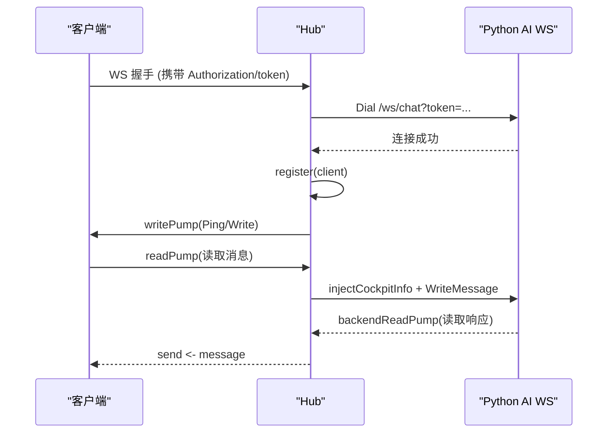
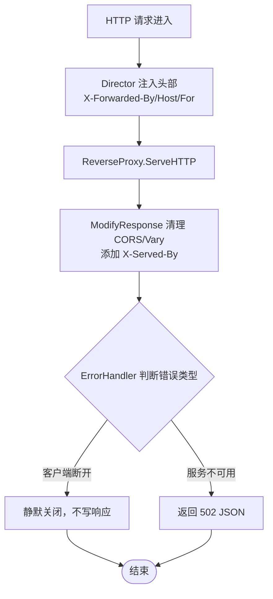
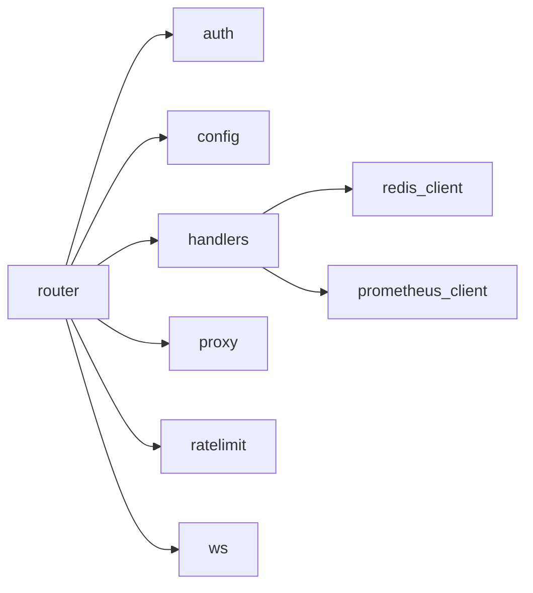

# 并发网关

<cite>
**本文引用的文件**   
- [backend_design/nexus_gate/cmd/main.go](file://backend_design/nexus_gate/cmd/main.go)
- [backend_design/nexus_gate/internal/config/config.go](file://backend_design/nexus_gate/internal/config/config.go)
- [backend_design/nexus_gate/internal/auth/jwt.go](file://backend_design/nexus_gate/internal/auth/jwt.go)
- [backend_design/nexus_gate/internal/ratelimit/ratelimit.go](file://backend_design/nexus_gate/internal/ratelimit/ratelimit.go)
- [backend_design/nexus_gate/internal/ws/hub.go](file://backend_design/nexus_gate/internal/ws/hub.go)
- [backend_design/nexus_gate/internal/proxy/proxy.go](file://backend_design/nexus_gate/internal/proxy/proxy.go)
- [backend_design/nexus_gate/internal/router/router.go](file://backend_design/nexus_gate/internal/router/router.go)
- [backend_design/nexus_gate/internal/handlers/handlers.go](file://backend_design/nexus_gate/internal/handlers/handlers.go)
- [backend_design/nexus_gate/internal/handlers/redis_client.go](file://backend_design/nexus_gate/internal/handlers/redis_client.go)
- [backend_design/nexus_gate/internal/handlers/prometheus_client.go](file://backend_design/nexus_gate/internal/handlers/prometheus_client.go)
- [backend_design/nexus_gate/go.mod](file://backend_design/nexus_gate/go.mod)
</cite>

## 目录
1. [简介](#简介)
2. [项目结构](#项目结构)
3. [核心组件](#核心组件)
4. [架构总览](#架构总览)
5. [详细组件分析](#详细组件分析)
6. [依赖关系分析](#依赖关系分析)
7. [性能与高并发优化](#性能与高并发优化)
8. [故障排查指南](#故障排查指南)
9. [结论](#结论)
10. [附录：扩展与最佳实践](#附录扩展与最佳实践)

## 简介
NexusCockpit Go 并发网关（NexusGate）是一个高性能、可扩展的 HTTP/WebSocket 网关，负责统一鉴权、限流、反向代理与实时消息转发。其核心职责包括：
- JWT 鉴权与座舱级 RBAC 权限控制
- 优先级令牌桶限流（按座舱隔离 + 全局上限）
- 非 AI 请求 Go 原生处理，AI 请求反向代理到 Python FastAPI
- WebSocket Hub 管理千级连接，桥接客户端与 Python AI 后端
- Prometheus 指标采集与数据中台查询

本技术文档面向 Go 开发者，深入解析各模块实现原理、安全考量、数据结构与算法、错误处理策略以及高并发场景下的性能优化与内存管理最佳实践，并提供扩展中间件与处理器的实操指引。

## 项目结构
NexusGate 采用模块化分层设计，入口为 cmd/main.go，内部包按功能划分：
- internal/config：配置加载与环境校验
- internal/auth：JWT 签发/解析与 RBAC 权限
- internal/ratelimit：优先级令牌桶限流器
- internal/ws：WebSocket Hub 与连接管理
- internal/proxy：反向代理到 Python AI
- internal/router：Gin 路由、中间件与指标
- internal/handlers：Go 原生处理器（健康检查、数据中台、Redis/Prometheus 查询）



**图示来源** 
- [backend_design/nexus_gate/cmd/main.go:34-153](file://backend_design/nexus_gate/cmd/main.go#L34-L153)
- [backend_design/nexus_gate/internal/config/config.go:80-118](file://backend_design/nexus_gate/internal/config/config.go#L80-L118)
- [backend_design/nexus_gate/internal/proxy/proxy.go:26-90](file://backend_design/nexus_gate/internal/proxy/proxy.go#L26-L90)
- [backend_design/nexus_gate/internal/ws/hub.go:68-121](file://backend_design/nexus_gate/internal/ws/hub.go#L68-L121)
- [backend_design/nexus_gate/internal/ratelimit/ratelimit.go:120-157](file://backend_design/nexus_gate/internal/ratelimit/ratelimit.go#L120-L157)
- [backend_design/nexus_gate/internal/router/router.go:58-251](file://backend_design/nexus_gate/internal/router/router.go#L58-L251)
- [backend_design/nexus_gate/internal/handlers/handlers.go:104-146](file://backend_design/nexus_gate/internal/handlers/handlers.go#L104-L146)
- [backend_design/nexus_gate/internal/handlers/redis_client.go:29-78](file://backend_design/nexus_gate/internal/handlers/redis_client.go#L29-L78)
- [backend_design/nexus_gate/internal/handlers/prometheus_client.go:42-79](file://backend_design/nexus_gate/internal/handlers/prometheus_client.go#L42-L79)

**章节来源**
- [backend_design/nexus_gate/cmd/main.go:34-153](file://backend_design/nexus_gate/cmd/main.go#L34-L153)
- [backend_design/nexus_gate/go.mod:1-44](file://backend_design/nexus_gate/go.mod#L1-L44)

## 核心组件
- 配置中心（config）：从环境变量与 .env 文件加载配置，生产环境强制安全校验（JWT 密钥、CORS、口令等）。
- 鉴权（auth）：基于 HS256 的 JWT 签发与解析，支持 Bearer 前缀、角色权限与座舱访问校验。
- 限流（ratelimit）：三级优先级令牌桶，按座舱独立限流 + 全局限流上限，保障实时性高的车控指令优先通过。
- WebSocket Hub（ws）：Hub 集中管理连接，广播消息，桥接客户端与 Python AI WebSocket，具备自动重连与心跳保活。
- 反向代理（proxy）：注入租户上下文头、剥离上游 CORS 头、统一错误处理（502），避免重复响应头导致浏览器拒绝。
- 路由与中间件（router）：Gin 路由分发，CORS、Recovery、Prometheus 指标、可选/必选鉴权、角色校验、优先级限流。
- 处理器（handlers）：Go 原生健康检查、中间件状态探测、数据中台概览/并发/告警、Redis/Prometheus 查询。

**章节来源**
- [backend_design/nexus_gate/internal/config/config.go:80-142](file://backend_design/nexus_gate/internal/config/config.go#L80-L142)
- [backend_design/nexus_gate/internal/auth/jwt.go:28-88](file://backend_design/nexus_gate/internal/auth/jwt.go#L28-L88)
- [backend_design/nexus_gate/internal/ratelimit/ratelimit.go:26-101](file://backend_design/nexus_gate/internal/ratelimit/ratelimit.go#L26-L101)
- [backend_design/nexus_gate/internal/ws/hub.go:52-121](file://backend_design/nexus_gate/internal/ws/hub.go#L52-L121)
- [backend_design/nexus_gate/internal/proxy/proxy.go:26-90](file://backend_design/nexus_gate/internal/proxy/proxy.go#L26-L90)
- [backend_design/nexus_gate/internal/router/router.go:58-251](file://backend_design/nexus_gate/internal/router/router.go#L58-L251)
- [backend_design/nexus_gate/internal/handlers/handlers.go:104-146](file://backend_design/nexus_gate/internal/handlers/handlers.go#L104-L146)

## 架构总览
网关整体架构如下：
- 客户端请求进入 Gin 路由，依次经过 CORS、Recovery、Prometheus 指标、鉴权与限流中间件。
- 非 AI 请求由 Go 原生处理器直接响应；AI 相关请求经反向代理转发至 Python FastAPI。
- WebSocket 连接由 Hub 管理，客户端与 Python AI 之间双向透传，并注入座舱与用户信息。
- 指标通过 Prometheus 暴露 /metrics，数据中台接口可查询 Redis/Prometheus 聚合结果。

```mermaid
sequenceDiagram
participant Client as "客户端"
participant Gateway as "NexusGate(Gin)"
participant Auth as "鉴权中间件"
participant RL as "限流中间件"
participant Proxy as "反向代理"
participant Python as "Python FastAPI"
participant WS as "WebSocket Hub"
Client->>Gateway : HTTP 请求
Gateway->>Auth : 校验 JWT
Auth-->>Gateway : claims/user_id/role
Gateway->>RL : 优先级限流
RL-->>Gateway : 允许/拒绝
alt 非 AI 请求
Gateway-->>Client : Go 原生响应
else AI 请求
Gateway->>Proxy : 注入 X-Cockpit-Id/X-User-*
Proxy->>Python : 转发请求
Python-->>Proxy : 响应
Proxy-->>Gateway : 清理 CORS 头
Gateway-->>Client : 最终响应
end
Note over Client,WS : WebSocket 流程
Client->>Gateway : WS 握手
Gateway->>WS : HandleWebSocket
WS->>Python : 建立后端 WS 连接
Client<->WS : 消息透传
WS->>Python : 注入 cockpit_id/user_id
Python-->>WS : AI 响应
WS-->>Client : 回传响应
```

**图示来源** 
- [backend_design/nexus_gate/internal/router/router.go:58-251](file://backend_design/nexus_gate/internal/router/router.go#L58-L251)
- [backend_design/nexus_gate/internal/proxy/proxy.go:26-90](file://backend_design/nexus_gate/internal/proxy/proxy.go#L26-L90)
- [backend_design/nexus_gate/internal/ws/hub.go:150-190](file://backend_design/nexus_gate/internal/ws/hub.go#L150-L190)

## 详细组件分析

### JWT 鉴权机制与安全考虑
- 签发与解析：使用 HS256，Claims 包含 user_id、cockpit_id、role、username，并设置 Issuer、Subject、ExpiresAt、IssuedAt。
- Bearer 前缀处理：ParseToken 自动去除 Authorization 头的 "Bearer " 前缀。
- 座舱访问校验：ValidateCockpitAccess 确保普通用户只能访问绑定的座舱，super_admin 可访问任意座舱。
- 权限矩阵：CheckPermission 根据角色返回权限列表，用于细粒度授权。
- 安全建议：生产环境必须设置强随机 JWT_SECRET，禁止默认弱口令；CORS_ORIGINS 需精确白名单；RBAC_USER_PASSWORD 在开发外必须设置。



**图示来源** 
- [backend_design/nexus_gate/internal/auth/jwt.go:19-88](file://backend_design/nexus_gate/internal/auth/jwt.go#L19-L88)

**章节来源**
- [backend_design/nexus_gate/internal/auth/jwt.go:28-88](file://backend_design/nexus_gate/internal/auth/jwt.go#L28-L88)
- [backend_design/nexus_gate/internal/config/config.go:120-142](file://backend_design/nexus_gate/internal/config/config.go#L120-L142)

### 优先级限流算法与令牌桶实现
- 优先级定义：PriorityLow（状态查询）、PriorityNormal（对话默认）、PriorityHigh（车控/ASR/TTS）。
- 令牌桶：每个座舱独立 TokenBucket，容量 capacity，按 ratePerSecond 补充令牌；高优先级可用全部令牌，普通最多 80%，低最多 50%。
- 全局限流：全局桶容量 = 座舱容量 × 3，速率 = 座舱速率 × 3，先过全局再入座舱桶。
- 并发安全：互斥锁保护 refill 与 tokens 操作，GetStats 提供监控统计。



**图示来源** 
- [backend_design/nexus_gate/internal/ratelimit/ratelimit.go:61-101](file://backend_design/nexus_gate/internal/ratelimit/ratelimit.go#L61-L101)

**章节来源**
- [backend_design/nexus_gate/internal/ratelimit/ratelimit.go:26-101](file://backend_design/nexus_gate/internal/ratelimit/ratelimit.go#L26-L101)
- [backend_design/nexus_gate/internal/ratelimit/ratelimit.go:120-178](file://backend_design/nexus_gate/internal/ratelimit/ratelimit.go#L120-L178)

### WebSocket Hub 的连接管理与消息广播
- Hub 结构：维护 cockpit_id → clients 映射，broadcast/register/unregister 通道，读写分离 RWMutex。
- 连接生命周期：HandleWebSocket 升级连接、提取 JWT token、尝试连接 Python AI WS、注册到 Hub、启动 readPump/writePump/backendReadPump。
- 消息转发：客户端消息注入 cockpit_id/user_id 后转发至 Python；Python 响应回传客户端；后端断开自动重连。
- 心跳保活：writePump 定时 Ping，readPump 设置 ReadDeadline 与 PongHandler 刷新超时。
- 背压处理：send 缓冲区满时关闭连接，防止内存泄漏。



**图示来源** 
- [backend_design/nexus_gate/internal/ws/hub.go:150-190](file://backend_design/nexus_gate/internal/ws/hub.go#L150-L190)
- [backend_design/nexus_gate/internal/ws/hub.go:221-274](file://backend_design/nexus_gate/internal/ws/hub.go#L221-L274)
- [backend_design/nexus_gate/internal/ws/hub.go:276-326](file://backend_design/nexus_gate/internal/ws/hub.go#L276-L326)

**章节来源**
- [backend_design/nexus_gate/internal/ws/hub.go:52-121](file://backend_design/nexus_gate/internal/ws/hub.go#L52-L121)
- [backend_design/nexus_gate/internal/ws/hub.go:150-190](file://backend_design/nexus_gate/internal/ws/hub.go#L150-L190)
- [backend_design/nexus_gate/internal/ws/hub.go:221-274](file://backend_design/nexus_gate/internal/ws/hub.go#L221-L274)
- [backend_design/nexus_gate/internal/ws/hub.go:276-326](file://backend_design/nexus_gate/internal/ws/hub.go#L276-L326)

### 反向代理的路由转发与负载均衡策略
- Director 自定义：注入 X-Forwarded-By、X-Forwarded-Host、X-Forwarded-For（从 RemoteAddr 提取并追加），便于后端定位真实 IP。
- ModifyResponse：删除上游 CORS/Vary 头，避免重复响应头导致浏览器拒绝；添加 X-Served-By 标识。
- ErrorHandler：区分客户端主动断开（context.Canceled/forcibly closed）静默处理，其他错误返回 502 JSON。
- 路由策略：座舱级路由优先使用 JWT claims 中的 cockpit_id，非座舱路由优先使用 X-Cockpit-Id 请求头，回退到 JWT；确保前端切换座舱时正确隔离。



**图示来源** 
- [backend_design/nexus_gate/internal/proxy/proxy.go:34-89](file://backend_design/nexus_gate/internal/proxy/proxy.go#L34-L89)
- [backend_design/nexus_gate/internal/router/router.go:253-302](file://backend_design/nexus_gate/internal/router/router.go#L253-L302)

**章节来源**
- [backend_design/nexus_gate/internal/proxy/proxy.go:26-90](file://backend_design/nexus_gate/internal/proxy/proxy.go#L26-L90)
- [backend_design/nexus_gate/internal/router/router.go:253-302](file://backend_design/nexus_gate/internal/router/router.go#L253-L302)

### Go 原生处理器与数据中台
- 健康检查：TCP 拨号检测 Redis、MySQL、Milvus、Neo4j、Python AI 连通性与延迟。
- 数据中台概览：遍历座舱统计 key 聚合 chat_count、vehicle_cmd_count、cache_hits/misses、latency、alert_count_24h，计算命中率与平均延迟。
- 并发指标：通过 Prometheus HTTP API 查询当前并发、QPS、峰值并发，并按座舱分项展示。
- 告警历史：从 Redis 拉取最近告警列表（Demo 简化处理）。

**章节来源**
- [backend_design/nexus_gate/internal/handlers/handlers.go:104-146](file://backend_design/nexus_gate/internal/handlers/handlers.go#L104-L146)
- [backend_design/nexus_gate/internal/handlers/handlers.go:205-273](file://backend_design/nexus_gate/internal/handlers/handlers.go#L205-L273)
- [backend_design/nexus_gate/internal/handlers/handlers.go:275-296](file://backend_design/nexus_gate/internal/handlers/handlers.go#L275-L296)
- [backend_design/nexus_gate/internal/handlers/handlers.go:298-327](file://backend_design/nexus_gate/internal/handlers/handlers.go#L298-L327)

## 依赖关系分析
- 外部依赖：gin-gonic/gin（HTTP 框架）、golang-jwt/jwt/v5（JWT）、gorilla/websocket（WS）、prometheus/client_golang（指标）。
- 内部依赖：router 依赖 auth、config、handlers、proxy、ratelimit、ws；handlers 依赖 config、redis_client、prometheus_client。
- 无循环依赖：各包职责清晰，单向依赖。



**图示来源** 
- [backend_design/nexus_gate/internal/router/router.go:12-30](file://backend_design/nexus_gate/internal/router/router.go#L12-L30)
- [backend_design/nexus_gate/internal/handlers/handlers.go:20-30](file://backend_design/nexus_gate/internal/handlers/handlers.go#L20-L30)
- [backend_design/nexus_gate/go.mod:5-10](file://backend_design/nexus_gate/go.mod#L5-L10)

**章节来源**
- [backend_design/nexus_gate/go.mod:5-10](file://backend_design/nexus_gate/go.mod#L5-L10)

## 性能与高并发优化
- Goroutine 管理：
  - ws.readPump/writePump/backendReadPump 各自独立 goroutine，避免阻塞；Hub.Run 使用 select 多路复用通道。
  - 优雅关闭：main 监听 SIGINT/SIGTERM，停止服务并释放资源。
- 内存管理：
  - WS send 缓冲 256，满则关闭连接，防止内存泄漏。
  - Redis 客户端按需连接，Close 显式释放；Prometheus 查询短超时 3s，避免长连接占用。
- 限流与背压：
  - 令牌桶 O(1) 操作，互斥锁粒度小；优先级阈值避免低优先级耗尽资源。
  - 反向代理 ErrorHandler 区分客户端断开与服务不可用，减少无效写入。
- 指标与观测：
  - Prometheus 指标按 method/path/status/cockpit_id 维度记录，path 截断避免高基数。
  - 数据中台通过 PromQL 查询实时并发/QPS，替代硬编码占位。
- 最佳实践：
  - 使用 gin.New() 自定义 Recovery，避免捕获 http.ErrAbortHandler 导致连接异常。
  - CORS 仅由网关一层控制，剥离上游 CORS 头，避免重复值。
  - 生产环境强制安全校验（JWT_SECRET、CORS_ORIGINS、RBAC_USER_PASSWORD）。

[本节为通用指导，不直接分析具体文件，故无“章节来源”]

## 故障排查指南
- JWT 鉴权失败：
  - 检查 Authorization 头是否包含 "Bearer "，确认 JWT_SECRET 一致，验证 Subject 与 ExpiresAt。
  - 参考路径：[jwt.go:52-76](file://backend_design/nexus_gate/internal/auth/jwt.go#L52-L76)
- 限流触发：
  - 查看优先级与配额，确认 seat 桶与全局桶限制；使用 GetStats 监控可用令牌。
  - 参考路径：[ratelimit.go:159-178](file://backend_design/nexus_gate/internal/ratelimit/ratelimit.go#L159-L178)
- WebSocket 连接问题：
  - 检查 Origin 白名单、Token 传递（Header/Query）、后端连接超时；观察日志中的 "WS backend connect failed"。
  - 参考路径：[hub.go:221-248](file://backend_design/nexus_gate/internal/ws/hub.go#L221-L248)
- 反向代理错误：
  - 502 错误通常来自 Python 服务不可用；客户端断开会静默处理；检查 X-Forwarded-For 是否正确注入。
  - 参考路径：[proxy.go:79-89](file://backend_design/nexus_gate/internal/proxy/proxy.go#L79-L89)
- 指标缺失：
  - 确认 /metrics 端点可达，Prometheus 抓取正常；检查 path 截断与标签维度。
  - 参考路径：[router.go:122-141](file://backend_design/nexus_gate/internal/router/router.go#L122-L141)

**章节来源**
- [backend_design/nexus_gate/internal/auth/jwt.go:52-76](file://backend_design/nexus_gate/internal/auth/jwt.go#L52-L76)
- [backend_design/nexus_gate/internal/ratelimit/ratelimit.go:159-178](file://backend_design/nexus_gate/internal/ratelimit/ratelimit.go#L159-L178)
- [backend_design/nexus_gate/internal/ws/hub.go:221-248](file://backend_design/nexus_gate/internal/ws/hub.go#L221-L248)
- [backend_design/nexus_gate/internal/proxy/proxy.go:79-89](file://backend_design/nexus_gate/internal/proxy/proxy.go#L79-L89)
- [backend_design/nexus_gate/internal/router/router.go:122-141](file://backend_design/nexus_gate/internal/router/router.go#L122-L141)

## 结论
NexusGate 以清晰的模块化设计与高效的并发模型，实现了统一的鉴权、限流、代理与实时通信能力。通过优先级令牌桶、WebSocket Hub 与反向代理的协同，系统在千级连接与高 QPS 场景下保持稳定与低延迟。结合 Prometheus 指标与数据中台查询，运维可实时监控与诊断。遵循本文的最佳实践与故障排查指南，开发者可快速扩展中间件与处理器，构建更强大的网关能力。

[本节为总结，不直接分析具体文件，故无“章节来源”]

## 附录：扩展与最佳实践
- 自定义中间件示例：
  - 鉴权中间件：解析 Authorization 头，调用 ParseToken，设置 claims/user_id/role 到 context。
  - 限流中间件：根据路径推断优先级，调用 AllowWithPriority，拒绝时返回 429。
  - 参考路径：[router.go:361-428](file://backend_design/nexus_gate/internal/router/router.go#L361-L428)、[router.go:459-495](file://backend_design/nexus_gate/internal/router/router.go#L459-L495)
- 自定义处理器示例：
  - 健康检查：TCP 拨号检测中间件状态，返回 online/offline 与延迟。
  - 数据中台：聚合 Redis/Prometheus 指标，返回概览与并发。
  - 参考路径：[handlers.go:104-146](file://backend_design/nexus_gate/internal/handlers/handlers.go#L104-L146)、[handlers.go:205-273](file://backend_design/nexus_gate/internal/handlers/handlers.go#L205-L273)
- Go 语言最佳实践：
  - 使用 defer 释放资源（conn.Close、ticker.Stop）。
  - 使用 sync.RWMutex 读多写少场景提升并发。
  - 错误处理区分业务错误与系统错误，避免 panic 传播。
  - 参考路径：[hub.go:192-219](file://backend_design/nexus_gate/internal/ws/hub.go#L192-L219)、[handlers.go:82-92](file://backend_design/nexus_gate/internal/handlers/handlers.go#L82-L92)

**章节来源**
- [backend_design/nexus_gate/internal/router/router.go:361-428](file://backend_design/nexus_gate/internal/router/router.go#L361-L428)
- [backend_design/nexus_gate/internal/router/router.go:459-495](file://backend_design/nexus_gate/internal/router/router.go#L459-L495)
- [backend_design/nexus_gate/internal/handlers/handlers.go:104-146](file://backend_design/nexus_gate/internal/handlers/handlers.go#L104-L146)
- [backend_design/nexus_gate/internal/handlers/handlers.go:205-273](file://backend_design/nexus_gate/internal/handlers/handlers.go#L205-L273)
- [backend_design/nexus_gate/internal/ws/hub.go:192-219](file://backend_design/nexus_gate/internal/ws/hub.go#L192-L219)
- [backend_design/nexus_gate/internal/handlers/handlers.go:82-92](file://backend_design/nexus_gate/internal/handlers/handlers.go#L82-L92)