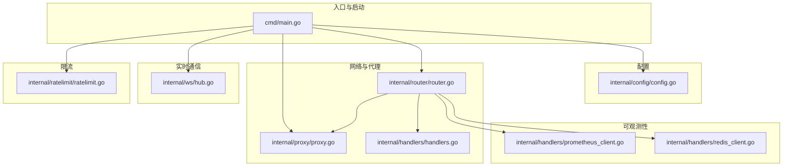
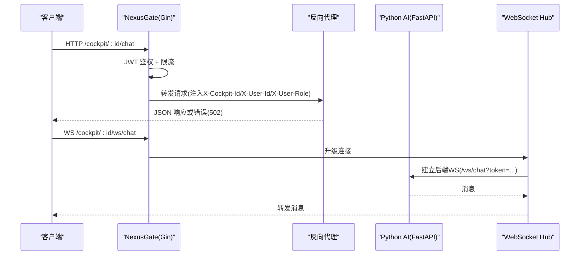
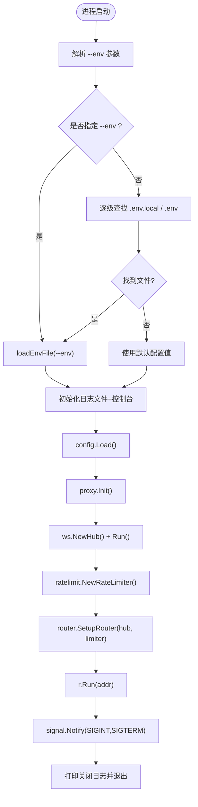
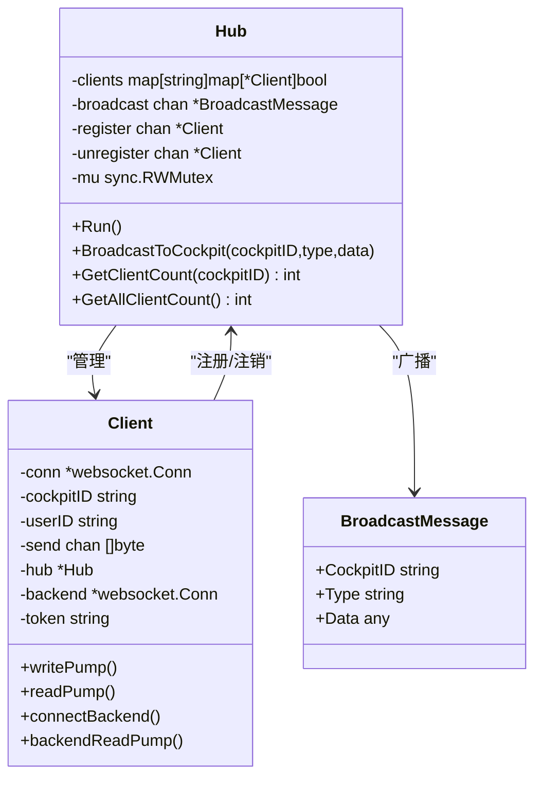
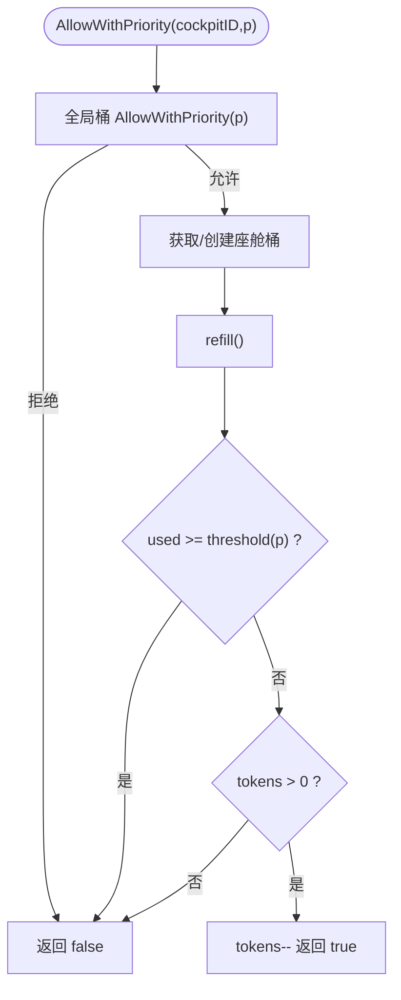
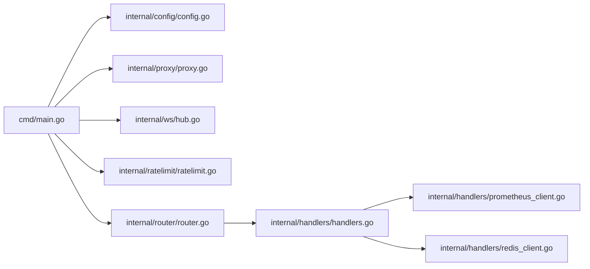

# 网关核心架构

<cite>
**本文引用的文件**   
- [main.go](file://backend_design/nexus_gate/cmd/main.go)
- [config.go](file://backend_design/nexus_gate/internal/config/config.go)
- [proxy.go](file://backend_design/nexus_gate/internal/proxy/proxy.go)
- [hub.go](file://backend_design/nexus_gate/internal/ws/hub.go)
- [ratelimit.go](file://backend_design/nexus_gate/internal/ratelimit/ratelimit.go)
- [router.go](file://backend_design/nexus_gate/internal/router/router.go)
- [handlers.go](file://backend_design/nexus_gate/internal/handlers/handlers.go)
- [prometheus_client.go](file://backend_design/nexus_gate/internal/handlers/prometheus_client.go)
- [redis_client.go](file://backend_design/nexus_gate/internal/handlers/redis_client.go)
- [go.mod](file://backend_design/nexus_gate/go.mod)
</cite>

## 目录
1. [简介](#简介)
2. [项目结构](#项目结构)
3. [核心组件](#核心组件)
4. [架构总览](#架构总览)
5. [详细组件分析](#详细组件分析)
6. [依赖关系分析](#依赖关系分析)
7. [性能考量](#性能考量)
8. [故障排查指南](#故障排查指南)
9. [结论](#结论)
10. [附录：扩展实践](#附录扩展实践)

## 简介
本技术文档聚焦 NexusCockpit Go 网关（NexusGate）的核心架构与实现，覆盖主程序启动流程、命令行参数解析、.env 加载机制与优先级、配置系统初始化；日志系统（文件输出、控制台输出、轮转策略与脱敏处理）；反向代理初始化、WebSocket Hub 启动、限流器创建与路由设置的全生命周期管理；以及优雅关闭机制（信号处理与资源清理）。同时提供扩展配置项与新增中间件的实际路径指引，并总结 Go 语言最佳实践、错误处理模式与性能优化技巧。

## 项目结构
Go 网关位于 backend_design/nexus_gate，采用分层模块化组织：
- cmd/main.go：入口与启动编排
- internal/config：配置加载与环境变量映射
- internal/proxy：反向代理到 Python AI 服务
- internal/ws：WebSocket Hub 与连接管理
- internal/ratelimit：令牌桶限流（按座舱与优先级）
- internal/router：Gin 路由、鉴权、限流中间件与指标采集
- internal/handlers：Go 原生处理器（健康检查、数据中台、Redis/Prometheus 查询等）

图表来源
- [main.go:43-153](file://backend_design/nexus_gate/cmd/main.go#L43-L153)
- [config.go:80-118](file://backend_design/nexus_gate/internal/config/config.go#L80-L118)
- [proxy.go:26-89](file://backend_design/nexus_gate/internal/proxy/proxy.go#L26-L89)
- [hub.go:67-121](file://backend_design/nexus_gate/internal/ws/hub.go#L67-L121)
- [ratelimit.go:120-157](file://backend_design/nexus_gate/internal/ratelimit/ratelimit.go#L120-L157)
- [router.go:58-251](file://backend_design/nexus_gate/internal/router/router.go#L58-L251)
- [handlers.go:101-146](file://backend_design/nexus_gate/internal/handlers/handlers.go#L101-L146)
- [prometheus_client.go:42-79](file://backend_design/nexus_gate/internal/handlers/prometheus_client.go#L42-L79)
- [redis_client.go:29-78](file://backend_design/nexus_gate/internal/handlers/redis_client.go#L29-L78)

章节来源
- [main.go:43-153](file://backend_design/nexus_gate/cmd/main.go#L43-L153)
- [go.mod:1-44](file://backend_design/nexus_gate/go.mod#L1-L44)

## 核心组件
- 配置系统：从环境变量加载，支持生产环境安全检查与默认值回退
- 反向代理：统一转发 AI 请求，注入上下文头，剥离上游 CORS 头避免重复
- WebSocket Hub：多租户（座舱）隔离的广播与消息转发，自动重连后端
- 限流器：令牌桶 + 优先级阈值，全局限流与每座舱独立限流
- 路由与中间件：JWT 鉴权、可选鉴权、角色校验、CORS、Prometheus 指标
- 处理器：健康检查、中间件状态探测、数据中台聚合（Redis/Prometheus）

章节来源
- [config.go:80-118](file://backend_design/nexus_gate/internal/config/config.go#L80-L118)
- [proxy.go:26-89](file://backend_design/nexus_gate/internal/proxy/proxy.go#L26-L89)
- [hub.go:67-121](file://backend_design/nexus_gate/internal/ws/hub.go#L67-L121)
- [ratelimit.go:120-157](file://backend_design/nexus_gate/internal/ratelimit/ratelimit.go#L120-L157)
- [router.go:58-251](file://backend_design/nexus_gate/internal/router/router.go#L58-L251)
- [handlers.go:101-146](file://backend_design/nexus_gate/internal/handlers/handlers.go#L101-L146)

## 架构总览
NexusGate 作为统一入口，承担鉴权、限流、CORS、指标采集与反向代理职责。AI 相关请求通过 httputil.ReverseProxy 转发至 Python FastAPI；非 AI 请求由 Go 原生处理器直接响应。WebSocket 通道用于实时对话与数据推送，Hub 负责连接管理与消息转发。

图表来源
- [router.go:205-248](file://backend_design/nexus_gate/internal/router/router.go#L205-L248)
- [proxy.go:26-89](file://backend_design/nexus_gate/internal/proxy/proxy.go#L26-L89)
- [hub.go:150-190](file://backend_design/nexus_gate/internal/ws/hub.go#L150-L190)

## 详细组件分析

### 主程序启动流程与 .env 加载机制
- 命令行参数：--env 指定 .env 文件路径
- .env 加载优先级：--env 指定路径 > 自动查找 .env.local > .env（从当前工作目录向上最多 5 级）
- 日志输出：写入 logs/go_logs/gateway_YYYYMMDD_HHMMSS.log，同时输出到控制台；若文件不可写则仅控制台输出
- 配置加载：调用 config.Load()，从环境变量填充 Config，并进行生产环境安全检查
- 组件初始化：反向代理 Init、WebSocket Hub 启动（后台协程）、限流器创建、路由 SetupRouter
- 服务启动与优雅关闭：监听 SIGINT/SIGTERM，打印关闭日志

图表来源
- [main.go:43-153](file://backend_design/nexus_gate/cmd/main.go#L43-L153)
- [config.go:80-118](file://backend_design/nexus_gate/internal/config/config.go#L80-L118)

章节来源
- [main.go:43-153](file://backend_design/nexus_gate/cmd/main.go#L43-L153)
- [config.go:80-118](file://backend_design/nexus_gate/internal/config/config.go#L80-L118)

### 配置系统初始化与安全校验
- 字段覆盖：所有配置项均从环境变量读取，具备默认值
- 安全校验：APP_ENV=prod 时强制强密钥、非弱口令、非通配 CORS、必须设置用户口令
- 便捷方法：AllowedOrigins、CockpitThemeList、CockpitNameList、AIBaseURL
- 全局访问：Get() 返回单例配置

章节来源
- [config.go:80-118](file://backend_design/nexus_gate/internal/config/config.go#L80-L118)
- [config.go:120-142](file://backend_design/nexus_gate/internal/config/config.go#L120-L142)
- [config.go:144-177](file://backend_design/nexus_gate/internal/config/config.go#L144-L177)

### 日志系统：文件输出、控制台输出、轮转与脱敏
- 文件输出：按日期生成 gateway_YYYYMMDD_HHMMSS.log，写入 logs/go_logs（可通过 LOG_DIR 覆盖）
- 控制台输出：MultiWriter 同时输出到文件与 stdout
- 轮转策略：当前实现按天滚动命名，未实现主动轮转（可按需引入包进行大小/时间切分）
- 脱敏处理：maskSecret 对密钥前4后4保留，中间以 * 替代，便于双端密钥一致性排查

章节来源
- [main.go:95-112](file://backend_design/nexus_gate/cmd/main.go#L95-L112)
- [main.go:155-167](file://backend_design/nexus_gate/cmd/main.go#L155-L167)

### 反向代理初始化与错误处理
- 目标地址：基于 AIBaseURL 构建
- Director：注入 X-Forwarded-By、X-Forwarded-Host、X-Forwarded-For（从 RemoteAddr 提取）
- ModifyResponse：删除上游 CORS 相关头，避免浏览器收到重复头导致拒绝
- ErrorHandler：区分客户端断开（context.Canceled/forcibly closed）静默处理；其他错误返回 502 JSON

章节来源
- [proxy.go:26-89](file://backend_design/nexus_gate/internal/proxy/proxy.go#L26-L89)

### WebSocket Hub 启动与消息流转
- Upgrader：CheckOrigin 按 CORS_ORIGINS 白名单校验，防止跨站劫持
- Hub：维护 cockpit_id → clients 映射，支持注册/注销与广播
- 连接生命周期：HandleWebSocket 升级连接、尝试连接 Python 后端、启动读写泵
- 消息转发：客户端→后端（注入 cockpit_id/user_id），后端→客户端（带超时与缓冲满保护）
- 监控：活跃连接数通过 Prometheus Gauge 记录

图表来源
- [hub.go:51-75](file://backend_design/nexus_gate/internal/ws/hub.go#L51-L75)
- [hub.go:150-190](file://backend_design/nexus_gate/internal/ws/hub.go#L150-L190)
- [hub.go:221-248](file://backend_design/nexus_gate/internal/ws/hub.go#L221-L248)
- [hub.go:250-274](file://backend_design/nexus_gate/internal/ws/hub.go#L250-L274)
- [hub.go:276-326](file://backend_design/nexus_gate/internal/ws/hub.go#L276-L326)

章节来源
- [hub.go:67-121](file://backend_design/nexus_gate/internal/ws/hub.go#L67-L121)
- [hub.go:150-190](file://backend_design/nexus_gate/internal/ws/hub.go#L150-L190)
- [hub.go:221-248](file://backend_design/nexus_gate/internal/ws/hub.go#L221-L248)
- [hub.go:250-274](file://backend_design/nexus_gate/internal/ws/hub.go#L250-L274)
- [hub.go:276-326](file://backend_design/nexus_gate/internal/ws/hub.go#L276-L326)

### 限流器创建与优先级策略
- 令牌桶：容量 capacity、每秒 ratePerSecond，按时间增量 refill
- 优先级阈值：高 100%、普通 80%、低 50%，保证关键路径优先
- 全局限流：globalBucket = capacity*3, ratePerSecond*3
- 每座舱限流：按 cockpit_id 分配独立桶，互不影响
- 统计接口：GetStats 暴露可用令牌与容量

图表来源
- [ratelimit.go:61-101](file://backend_design/nexus_gate/internal/ratelimit/ratelimit.go#L61-L101)
- [ratelimit.go:120-157](file://backend_design/nexus_gate/internal/ratelimit/ratelimit.go#L120-L157)

章节来源
- [ratelimit.go:120-157](file://backend_design/nexus_gate/internal/ratelimit/ratelimit.go#L120-L157)

### 路由设置与中间件链
- 模式切换：根据 GateMode 设置 Gin 模式（release/debug）
- 自定义 Recovery：放行 http.ErrAbortHandler panic，避免已关闭连接上写响应
- CORS：按白名单回显具体 Origin，OPTIONS 预检直接 204
- Prometheus 指标：请求总数、耗时直方图、活跃 WS 连接数
- 鉴权中间件：AuthMiddleware（必需）、OptionalAuthMiddleware（可选）、RequireRole（角色校验）
- 限流中间件：RateLimitMiddleware 根据路径推断优先级
- 路由分组：/dataplatform、/middleware、/settings、/cockpit/*、/metrics、/health、NoRoute 兜底反代

章节来源
- [router.go:58-251](file://backend_design/nexus_gate/internal/router/router.go#L58-L251)
- [router.go:253-302](file://backend_design/nexus_gate/internal/router/router.go#L253-L302)
- [router.go:361-428](file://backend_design/nexus_gate/internal/router/router.go#L361-L428)
- [router.go:459-495](file://backend_design/nexus_gate/internal/router/router.go#L459-L495)

### 健康检查与中间件状态探测
- HealthCheck：检测 Redis 与 Python AI 连通性，返回整体状态
- 中间件状态：TCP 拨号检测 Redis/MySQL/Milvus/Neo4j/Python AI，返回延迟与状态
- 数据中台：从 Redis 聚合统计，从 Prometheus 查询并发/QPS

章节来源
- [handlers.go:377-414](file://backend_design/nexus_gate/internal/handlers/handlers.go#L377-L414)
- [handlers.go:101-146](file://backend_design/nexus_gate/internal/handlers/handlers.go#L101-L146)
- [handlers.go:205-273](file://backend_design/nexus_gate/internal/handlers/handlers.go#L205-L273)
- [prometheus_client.go:42-79](file://backend_design/nexus_gate/internal/handlers/prometheus_client.go#L42-L79)

### 优雅关闭机制
- 信号监听：syscall.SIGINT、SIGTERM
- 行为：打印关闭日志并退出（当前未显式停止 HTTP Server/Hub，建议结合 context 与 Shutdown API）

章节来源
- [main.go:140-153](file://backend_design/nexus_gate/cmd/main.go#L140-L153)

## 依赖关系分析
- Gin 路由与中间件生态
- Gorilla WebSocket 用于长连接
- Prometheus 客户端用于指标采集
- JWT v5 用于鉴权
- 标准库 httputil.ReverseProxy 用于反向代理

图表来源
- [go.mod:1-44](file://backend_design/nexus_gate/go.mod#L1-L44)
- [main.go:27-32](file://backend_design/nexus_gate/cmd/main.go#L27-L32)
- [router.go:12-30](file://backend_design/nexus_gate/internal/router/router.go#L12-L30)

章节来源
- [go.mod:1-44](file://backend_design/nexus_gate/go.mod#L1-L44)

## 性能考量
- 反向代理：避免重复 CORS 头，减少浏览器校验开销；合理设置超时与错误分支
- WebSocket：读/写超时与缓冲满保护，避免内存泄漏；Ping 保活维持连接活性
- 限流器：无锁读 + 细粒度锁写，按座舱隔离降低竞争；优先级阈值保障关键路径
- 指标采集：Prometheus 直方图与计数器，避免高基数标签（截断 path）
- 配置加载：单例配置，避免重复 IO；生产环境安全检查在启动阶段完成

[本节为通用指导，不直接分析具体文件]

## 故障排查指南
- 反向代理 502：检查 Python AI 服务可达性与端口；查看 ReverseProxy.ErrorHandler 分支
- WebSocket 连接失败：确认 CORS 白名单与 Token 传递；检查后端 /ws/chat 可达性
- 限流触发：查看 RateLimitMiddleware 优先级判断与令牌剩余；必要时调整 QPS 与容量
- 健康检查异常：检查 Redis/MySQL/Milvus/Neo4j/Python AI 端口连通性
- 指标缺失：确认 /metrics 端点与 Prometheus 抓取配置

章节来源
- [proxy.go:80-89](file://backend_design/nexus_gate/internal/proxy/proxy.go#L80-L89)
- [hub.go:150-190](file://backend_design/nexus_gate/internal/ws/hub.go#L150-L190)
- [router.go:459-495](file://backend_design/nexus_gate/internal/router/router.go#L459-L495)
- [handlers.go:377-414](file://backend_design/nexus_gate/internal/handlers/handlers.go#L377-L414)

## 结论
NexusGate 通过清晰的启动编排、严格的配置校验、健壮的反向代理与 WebSocket Hub、精细化的限流策略以及完善的中间件链，实现了高性能、可扩展且可观测的统一网关。其设计遵循 Go 语言最佳实践，兼顾开发体验与生产安全。

[本节为总结，不直接分析具体文件]

## 附录：扩展实践

### 如何扩展配置项
- 在 Config 结构体中添加新字段（例如 NewFeatureEnabled bool）
- 在 Load() 中增加 getEnv/getEnvInt/getEnvFloat 的读取逻辑，并提供默认值
- 如需生产安全检查，在 validateProdSecurity 中追加校验
- 在 handlers/router 中使用 config.Get().NewFeatureEnabled 进行分支控制

章节来源
- [config.go:19-76](file://backend_design/nexus_gate/internal/config/config.go#L19-L76)
- [config.go:80-118](file://backend_design/nexus_gate/internal/config/config.go#L80-L118)
- [config.go:120-142](file://backend_design/nexus_gate/internal/config/config.go#L120-L142)

### 如何添加新的中间件
- 在 router.go 中定义新的 gin.HandlerFunc（如 Auth/RateLimit/CORS 类似风格）
- 在对应路由组中挂载中间件（例如 r.Use(NewMiddleware())）
- 若涉及外部依赖（如 Redis/Prometheus），参考 handlers.go 中的简单客户端封装模式

章节来源
- [router.go:58-121](file://backend_design/nexus_gate/internal/router/router.go#L58-L121)
- [handlers.go:101-146](file://backend_design/nexus_gate/internal/handlers/handlers.go#L101-L146)

### 实际代码示例路径（不含代码内容）
- 主程序启动与 .env 加载：[main.go:43-153](file://backend_design/nexus_gate/cmd/main.go#L43-L153)
- 配置加载与安全校验：[config.go:80-142](file://backend_design/nexus_gate/internal/config/config.go#L80-L142)
- 反向代理初始化与错误处理：[proxy.go:26-89](file://backend_design/nexus_gate/internal/proxy/proxy.go#L26-L89)
- WebSocket Hub 启动与消息转发：[hub.go:67-190](file://backend_design/nexus_gate/internal/ws/hub.go#L67-L190)
- 限流器创建与优先级策略：[ratelimit.go:120-157](file://backend_design/nexus_gate/internal/ratelimit/ratelimit.go#L120-L157)
- 路由与中间件链：[router.go:58-251](file://backend_design/nexus_gate/internal/router/router.go#L58-L251)
- 健康检查与中间件状态探测：[handlers.go:377-414](file://backend_design/nexus_gate/internal/handlers/handlers.go#L377-L414)
- Prometheus 查询客户端：[prometheus_client.go:42-79](file://backend_design/nexus_gate/internal/handlers/prometheus_client.go#L42-L79)
- Redis 简易客户端：[redis_client.go:29-78](file://backend_design/nexus_gate/internal/handlers/redis_client.go#L29-L78)