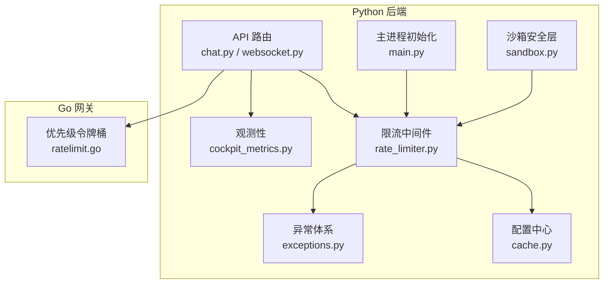
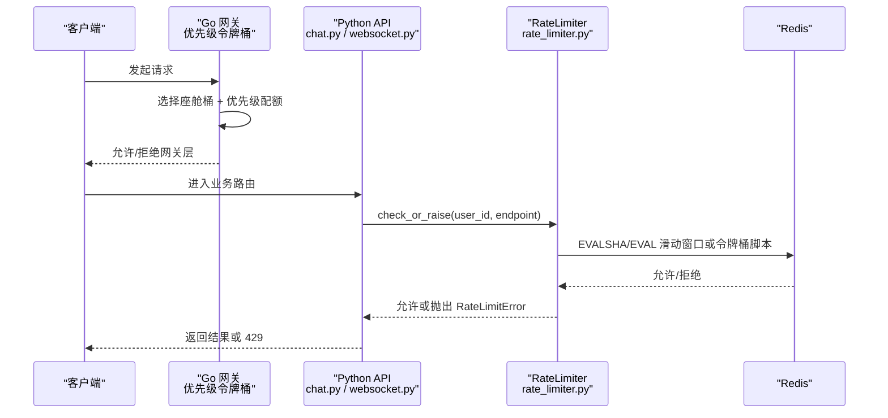
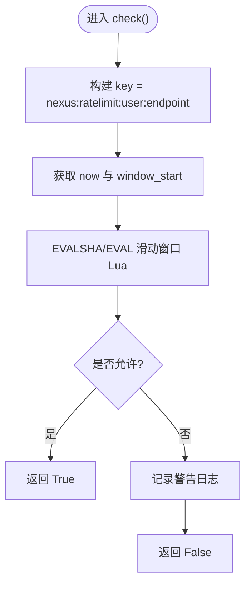
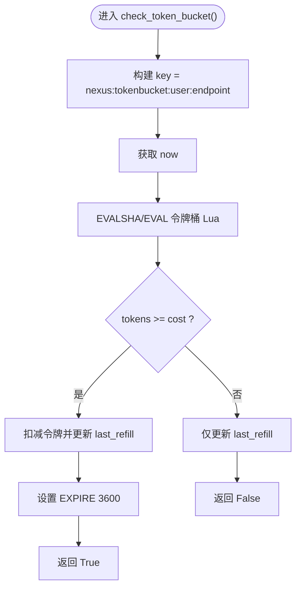
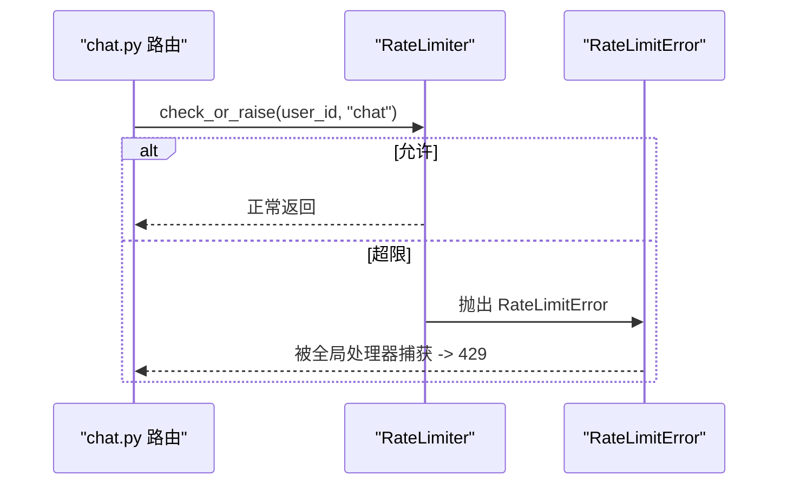
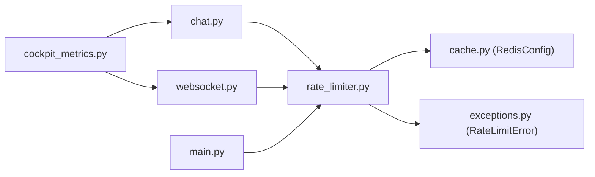

# 限流算法实现

<cite>
**本文引用的文件**   
- [rate_limiter.py](file://backend_design/nexus/middleware/rate_limiter.py)
- [ratelimit.go](file://backend_design/nexus_gate/internal/ratelimit/ratelimit.go)
- [exceptions.py](file://backend_design/nexus/core/exceptions.py)
- [cache.py](file://backend_design/nexus/config/cache.py)
- [cockpit_metrics.py](file://backend_design/nexus/observability/cockpit_metrics.py)
- [main.py](file://backend_design/nexus/main.py)
- [chat.py](file://backend_design/nexus/api/routes/chat.py)
- [websocket.py](file://backend_design/nexus/api/websocket.py)
- [sandbox.py](file://backend_design/nexus/core/sandbox.py)
</cite>

## 目录
1. [引言](#引言)
2. [项目结构](#项目结构)
3. [核心组件](#核心组件)
4. [架构总览](#架构总览)
5. [详细组件分析](#详细组件分析)
6. [依赖关系分析](#依赖关系分析)
7. [性能与高并发优化](#性能与高并发优化)
8. [故障恢复与降级策略](#故障恢复与降级策略)
9. [监控与告警](#监控与告警)
10. [配置与动态调整](#配置与动态调整)
11. [自定义限流规则与扩展](#自定义限流规则与扩展)
12. [结论](#结论)

## 引言
本技术文档聚焦 NexusCockpit 的限流算法实现，涵盖：
- 令牌桶算法设计原理与滑动窗口机制
- Redis 分布式限流的原子操作、内存管理与数据一致性保证
- 座舱级限流策略的配置方法与动态调整
- 限流统计信息的采集与监控指标
- 高并发场景下的性能优化技巧（连接池、批量操作、缓存策略）
- 自定义限流规则与扩展实践
- 调优经验、故障恢复机制与监控告警配置

## 项目结构
限流相关代码主要分布在以下模块：
- Python 后端中间件：基于 Redis Lua 的滑动窗口与令牌桶限流器
- Go 网关层：优先级令牌桶限流（按座舱维度）
- API 路由集成：在聊天与 WebSocket 入口调用限流检查
- 异常体系：限流错误统一抛出与处理
- 配置中心：Redis 连接参数与语义缓存开关
- 观测性：座舱级指标采集（含限流相关的统计）



图表来源 
- [rate_limiter.py:1-297](file://backend_design/nexus/middleware/rate_limiter.py#L1-L297)
- [ratelimit.go:1-178](file://backend_design/nexus_gate/internal/ratelimit/ratelimit.go#L1-L178)
- [exceptions.py:112-117](file://backend_design/nexus/core/exceptions.py#L112-L117)
- [cache.py:15-41](file://backend_design/nexus/config/cache.py#L15-L41)
- [cockpit_metrics.py:24-180](file://backend_design/nexus/observability/cockpit_metrics.py#L24-L180)
- [main.py:157-159](file://backend_design/nexus/main.py#L157-L159)
- [chat.py:348-350](file://backend_design/nexus/api/routes/chat.py#L348-L350)
- [websocket.py:141-144](file://backend_design/nexus/api/websocket.py#L141-L144)
- [sandbox.py:235-251](file://backend_design/nexus/core/sandbox.py#L235-L251)

章节来源
- [rate_limiter.py:1-297](file://backend_design/nexus/middleware/rate_limiter.py#L1-L297)
- [ratelimit.go:1-178](file://backend_design/nexus_gate/internal/ratelimit/ratelimit.go#L1-L178)
- [exceptions.py:112-117](file://backend_design/nexus/core/exceptions.py#L112-L117)
- [cache.py:15-41](file://backend_design/nexus/config/cache.py#L15-L41)
- [cockpit_metrics.py:24-180](file://backend_design/nexus/observability/cockpit_metrics.py#L24-L180)
- [main.py:157-159](file://backend_design/nexus/main.py#L157-L159)
- [chat.py:348-350](file://backend_design/nexus/api/routes/chat.py#L348-L350)
- [websocket.py:141-144](file://backend_design/nexus/api/websocket.py#L141-L144)
- [sandbox.py:235-251](file://backend_design/nexus/core/sandbox.py#L235-L251)

## 核心组件
- 滑动窗口限流器（Redis Lua）：使用有序集合记录时间戳，原子清理旧条目、计数并写入新请求，超限不污染计数器。
- 令牌桶限流器（Redis Lua）：维护剩余令牌与上次补充时间，按速率补充令牌，支持突发流量控制。
- Go 网关优先级令牌桶：为每个座舱独立令牌桶，全局桶容量为座舱上限的三倍；按优先级限制可用令牌比例。
- 异常与错误码：限流错误统一为 RateLimitError，便于全局处理器映射为 HTTP 429。
- 配置与连接：Redis 连接 URL、数据库号、密码等由配置模块提供。
- 观测性：座舱级指标采集器记录对话、车控指令、错误等统计，供数据中台查询。

章节来源
- [rate_limiter.py:28-114](file://backend_design/nexus/middleware/rate_limiter.py#L28-L114)
- [ratelimit.go:26-178](file://backend_design/nexus_gate/internal/ratelimit/ratelimit.go#L26-L178)
- [exceptions.py:112-117](file://backend_design/nexus/core/exceptions.py#L112-L117)
- [cache.py:15-41](file://backend_design/nexus/config/cache.py#L15-L41)
- [cockpit_metrics.py:24-180](file://backend_design/nexus/observability/cockpit_metrics.py#L24-L180)

## 架构总览
整体限流架构分为两层：
- 网关层（Go）：优先级令牌桶限流，按座舱隔离，保障实时性高的请求优先通过。
- 应用层（Python）：Redis Lua 实现的滑动窗口与令牌桶限流，确保多实例分布式一致性与原子性。



图表来源 
- [ratelimit.go:120-157](file://backend_design/nexus_gate/internal/ratelimit/ratelimit.go#L120-L157)
- [chat.py:348-350](file://backend_design/nexus/api/routes/chat.py#L348-L350)
- [websocket.py:141-144](file://backend_design/nexus/api/websocket.py#L141-L144)
- [rate_limiter.py:156-211](file://backend_design/nexus/middleware/rate_limiter.py#L156-L211)

## 详细组件分析

### 滑动窗口限流（Redis Lua）
- 数据结构：ZSET（有序集合），成员与分数均为时间戳。
- 原子性：Lua 脚本内完成 ZREMRANGEBYSCORE、ZCARD、ZADD、EXPIRE，避免竞态条件。
- 防污染：超限直接返回 0，不执行 ZADD，防止非法请求污染计数。
- Key 命名：nexus:ratelimit:{user_id}:{endpoint}
- 过期策略：窗口大小的两倍 TTL，确保旧条目被清理。



图表来源 
- [rate_limiter.py:156-203](file://backend_design/nexus/middleware/rate_limiter.py#L156-L203)

章节来源
- [rate_limiter.py:28-59](file://backend_design/nexus/middleware/rate_limiter.py#L28-L59)
- [rate_limiter.py:156-203](file://backend_design/nexus/middleware/rate_limiter.py#L156-L203)

### 令牌桶限流（Redis Lua）
- 数据结构：HASH，字段 tokens（剩余令牌数）、last_refill（上次补充时间）。
- 补充逻辑：根据 elapsed * rate 计算补充量，不超过 capacity。
- 消耗逻辑：若 tokens >= cost，则扣减并更新 last_refill，设置 TTL=3600s。
- Key 命名：nexus:tokenbucket:{user_id}:{endpoint}
- 适用场景：LLM API 调用限流，允许突发但长期受平均速率约束。



图表来源 
- [rate_limiter.py:212-277](file://backend_design/nexus/middleware/rate_limiter.py#L212-L277)

章节来源
- [rate_limiter.py:62-114](file://backend_design/nexus/middleware/rate_limiter.py#L62-L114)
- [rate_limiter.py:212-277](file://backend_design/nexus/middleware/rate_limiter.py#L212-L277)

### Go 网关优先级令牌桶
- 优先级定义：低（状态查询）、普通（对话）、高（车控、ASR/TTS）。
- 配额比例：低 50%、普通 80%、高 100%。
- 全局桶容量：座舱上限 × 3，防止单座舱占用过多资源。
- 每座舱独立桶：按 cockpitID 管理，懒加载创建。

```mermaid
classDiagram
class TokenBucket {
-int capacity
-int tokens
-time.Duration rate
-time.Time lastRefill
+Allow() bool
+AllowWithPriority(p) bool
+AvailableTokens() int
-refill() void
}
class RateLimiter {
-map[string]*TokenBucket buckets
-TokenBucket globalBucket
-int capacity
-int rate
+Allow(cockpitID) bool
+AllowWithPriority(cockpitID, p) bool
+GetStats() map[string]interface{}
}
RateLimiter --> TokenBucket : "管理多个座舱桶"
RateLimiter --> TokenBucket : "全局桶"
```

图表来源 
- [ratelimit.go:42-109](file://backend_design/nexus_gate/internal/ratelimit/ratelimit.go#L42-L109)
- [ratelimit.go:111-178](file://backend_design/nexus_gate/internal/ratelimit/ratelimit.go#L111-L178)

章节来源
- [ratelimit.go:26-178](file://backend_design/nexus_gate/internal/ratelimit/ratelimit.go#L26-L178)

### API 集成与异常处理
- chat.py：在聊天接口入口处调用 rate_limiter.check_or_raise(user_id, "chat")。
- websocket.py：在 WebSocket 握手后对 ws_chat 端点做限流检查。
- exceptions.py：RateLimitError 携带 code="RATE_LIMIT_ERROR"，便于全局处理器映射为 429。
- main.py：启动时初始化 RateLimiter 并注入 app.state.rate_limiter。



图表来源 
- [chat.py:348-350](file://backend_design/nexus/api/routes/chat.py#L348-L350)
- [websocket.py:141-144](file://backend_design/nexus/api/websocket.py#L141-L144)
- [exceptions.py:112-117](file://backend_design/nexus/core/exceptions.py#L112-L117)
- [main.py:157-159](file://backend_design/nexus/main.py#L157-L159)

章节来源
- [chat.py:348-350](file://backend_design/nexus/api/routes/chat.py#L348-L350)
- [websocket.py:141-144](file://backend_design/nexus/api/websocket.py#L141-L144)
- [exceptions.py:112-117](file://backend_design/nexus/core/exceptions.py#L112-L117)
- [main.py:157-159](file://backend_design/nexus/main.py#L157-L159)

### 沙箱层频率限制（进程内）
- sandbox.py：_check_rate_limit 用于工具调用频率限制，优先 Redis 共享，不可用时降级为进程内。
- clear_rate_limit：测试或管理用途清除限制记录。

章节来源
- [sandbox.py:235-251](file://backend_design/nexus/core/sandbox.py#L235-L251)
- [sandbox.py:400-406](file://backend_design/nexus/core/sandbox.py#L400-L406)

## 依赖关系分析
- RateLimiter 依赖 Redis 异步客户端与 Lua 脚本。
- API 路由依赖 RateLimiter 进行限流检查。
- 配置模块提供 Redis 连接 URL。
- 观测性模块记录会话与车控指标，辅助限流效果评估。



图表来源 
- [chat.py:348-350](file://backend_design/nexus/api/routes/chat.py#L348-L350)
- [websocket.py:141-144](file://backend_design/nexus/api/websocket.py#L141-L144)
- [rate_limiter.py:142-152](file://backend_design/nexus/middleware/rate_limiter.py#L142-L152)
- [cache.py:15-41](file://backend_design/nexus/config/cache.py#L15-L41)
- [exceptions.py:112-117](file://backend_design/nexus/core/exceptions.py#L112-L117)
- [main.py:157-159](file://backend_design/nexus/main.py#L157-L159)
- [cockpit_metrics.py:38-84](file://backend_design/nexus/observability/cockpit_metrics.py#L38-L84)

章节来源
- [rate_limiter.py:142-152](file://backend_design/nexus/middleware/rate_limiter.py#L142-L152)
- [cache.py:15-41](file://backend_design/nexus/config/cache.py#L15-L41)
- [cockpit_metrics.py:38-84](file://backend_design/nexus/observability/cockpit_metrics.py#L38-L84)

## 性能与高并发优化
- Lua 脚本预加载：connect() 阶段 script_load 脚本，后续使用 EVALSHA 减少网络开销。
- 原子操作：所有计数与写入在单个 Lua 事务内完成，避免竞态。
- 连接复用：aioredis.from_url 复用连接，避免频繁建立连接。
- 批量操作：观测性模块使用 pipeline 批量写入指标，降低 RTT。
- 缓存策略：语义缓存（SemanticCache）与限流配合，减少重复计算与外部调用。
- 超时与降级：Redis 不可用时放行（fail-open），保证服务可用性。

章节来源
- [rate_limiter.py:142-152](file://backend_design/nexus/middleware/rate_limiter.py#L142-L152)
- [cockpit_metrics.py:50-61](file://backend_design/nexus/observability/cockpit_metrics.py#L50-L61)
- [redis_cache.py:90-128](file://backend_design/nexus/middleware/redis_cache.py#L90-L128)

## 故障恢复与降级策略
- Redis 不可用：RateLimiter.connect() 失败时记录警告，check()/check_token_bucket() 返回 True（放行）。
- Lua 脚本加载失败：回退到 EVAL 方式执行脚本。
- 异常捕获：限流检查异常时记录错误日志并放行，避免雪崩。
- 沙箱层降级：Redis 不可用时回退到进程内频率限制。

章节来源
- [rate_limiter.py:153-155](file://backend_design/nexus/middleware/rate_limiter.py#L153-L155)
- [rate_limiter.py:200-203](file://backend_design/nexus/middleware/rate_limiter.py#L200-L203)
- [rate_limiter.py:275-277](file://backend_design/nexus/middleware/rate_limiter.py#L275-L277)
- [sandbox.py:235-251](file://backend_design/nexus/core/sandbox.py#L235-L251)

## 监控与告警
- 限流日志：超限与令牌桶不足时记录警告日志，包含 user_id、endpoint、limit/capacity/rate。
- 座舱指标：CockpitMetrics 记录对话次数、延迟、缓存命中、错误率、车控成功率等。
- 指标存储：Redis HASH 实时聚合，MySQL 持久化历史数据。
- 可观测性：Prometheus/Grafana 可通过数据源接入指标（配置文件见 config/prometheus.yml）。

章节来源
- [rate_limiter.py:193-198](file://backend_design/nexus/middleware/rate_limiter.py#L193-L198)
- [rate_limiter.py:268-273](file://backend_design/nexus/middleware/rate_limiter.py#L268-L273)
- [cockpit_metrics.py:38-161](file://backend_design/nexus/observability/cockpit_metrics.py#L38-L161)

## 配置与动态调整
- Redis 配置：host、port、password、db、语义缓存开关与阈值、TTL。
- 限流参数：max_requests、window_seconds（滑动窗口）；capacity、rate、cost（令牌桶）。
- 动态调整：通过环境变量或 .env.local 覆盖默认值，重启生效；运行时可通过配置热更新（需结合配置中心）。
- 座舱级策略：Go 网关按 cockpitID 分配独立桶，全局桶容量为座舱上限的三倍。

章节来源
- [cache.py:15-41](file://backend_design/nexus/config/cache.py#L15-L41)
- [rate_limiter.py:129-138](file://backend_design/nexus/middleware/rate_limiter.py#L129-L138)
- [ratelimit.go:120-128](file://backend_design/nexus_gate/internal/ratelimit/ratelimit.go#L120-L128)

## 自定义限流规则与扩展
- 自定义端点：在 API 路由中传入 endpoint 标识，如 "chat"、"ws_chat"，以区分不同接口的限流策略。
- 自定义成本：令牌桶支持 cost 参数，适用于不同复杂度的请求（如 LLM 调用消耗更多令牌）。
- 自定义优先级：Go 网关支持 PriorityLow/Normal/High，可按业务需求扩展优先级枚举与配额比例。
- 扩展点：RateLimiter.check_token_bucket() 可作为通用令牌桶接口，供其他模块复用。

章节来源
- [chat.py:348-350](file://backend_design/nexus/api/routes/chat.py#L348-L350)
- [websocket.py:141-144](file://backend_design/nexus/api/websocket.py#L141-L144)
- [rate_limiter.py:212-277](file://backend_design/nexus/middleware/rate_limiter.py#L212-L277)
- [ratelimit.go:26-40](file://backend_design/nexus_gate/internal/ratelimit/ratelimit.go#L26-L40)

## 结论
NexusCockpit 的限流体系结合了 Redis Lua 的原子性与分布式一致性，以及 Go 网关的优先级令牌桶策略，实现了高并发、可扩展且安全的限流方案。通过合理的配置与监控，可在保障系统稳定性的同时，灵活应对突发流量与不同优先级的业务需求。建议在生产环境中持续优化 Lua 脚本、连接池与指标采集，并结合告警机制快速定位与恢复问题。