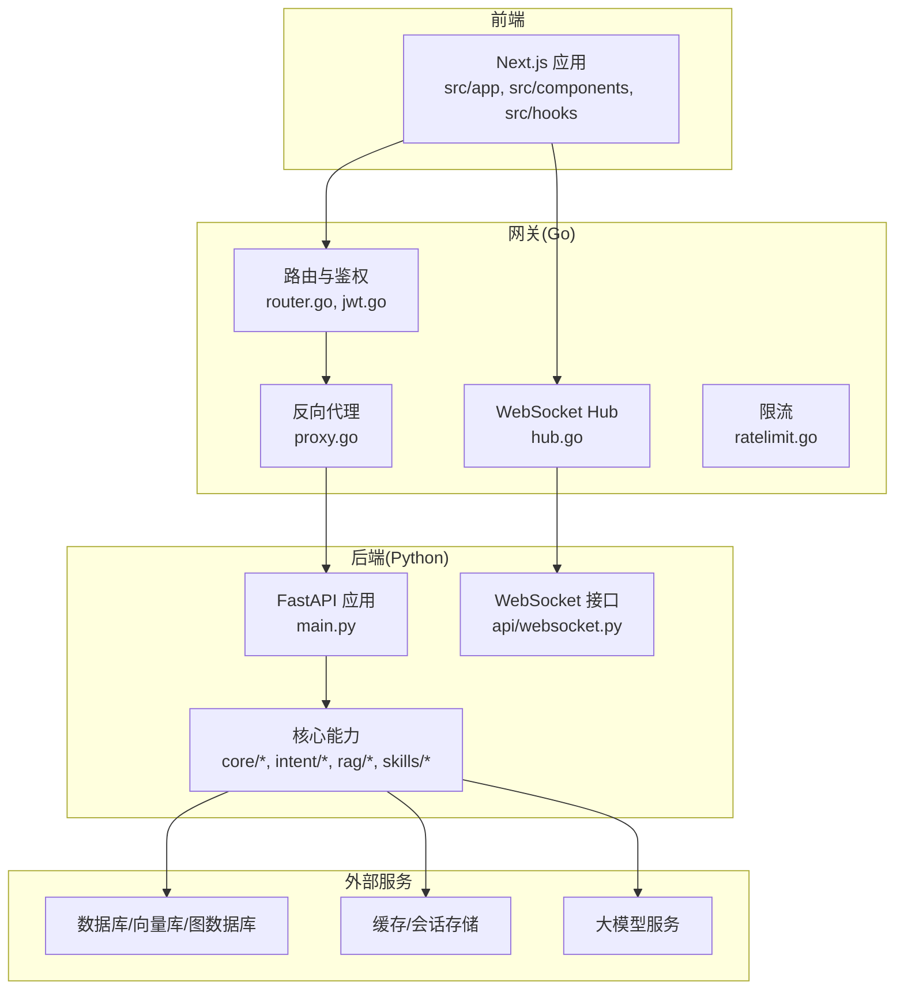
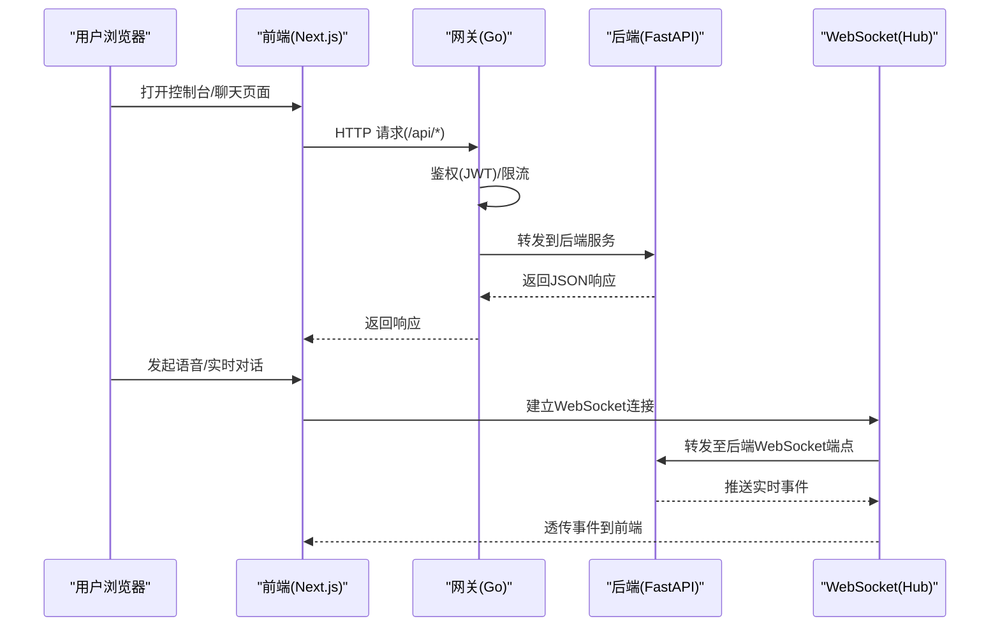
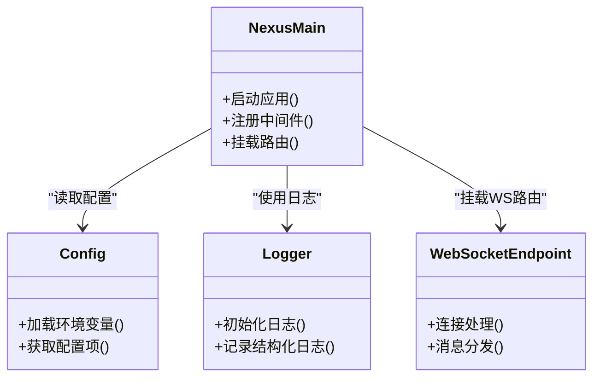
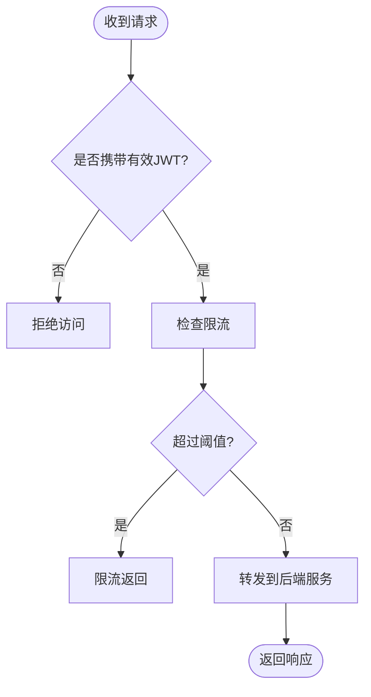
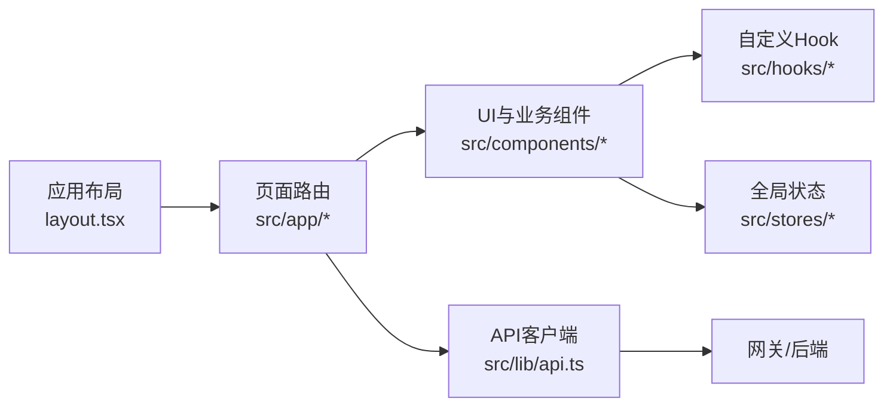
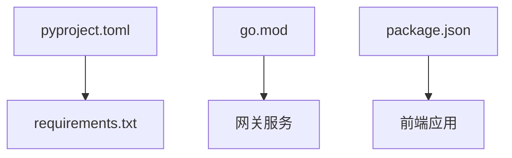

# 开发指南

<cite>
**本文引用的文件**   
- [README.md](file://README.md)
- [.pre-commit-config.yaml](file://.pre-commit-config.yaml)
- [.editorconfig](file://.editorconfig)
- [Makefile](file://Makefile)
- [docker-compose.yml](file://docker-compose.yml)
- [backend_design/pyproject.toml](file://backend_design/pyproject.toml)
- [backend_design/requirements.txt](file://backend_design/requirements.txt)
- [backend_design/nexus/main.py](file://backend_design/nexus/main.py)
- [backend_design/nexus/config.py](file://backend_design/nexus/config.py)
- [backend_design/nexus/core/logger.py](file://backend_design/nexus/core/logger.py)
- [backend_design/nexus/api/websocket.py](file://backend_design/nexus/api/websocket.py)
- [backend_design/tests/test_api.py](file://backend_design/tests/test_api.py)
- [backend_design/tests/test_core.py](file://backend_design/tests/test_core.py)
- [backend_design/scripts/test_api.py](file://backend_design/scripts/test_api.py)
- [frontend_design/package.json](file://frontend_design/package.json)
- [frontend_design/tsconfig.json](file://frontend_design/tsconfig.json)
- [frontend_design/tailwind.config.ts](file://frontend_design/tailwind.config.ts)
- [frontend_design/src/app/layout.tsx](file://frontend_design/src/app/layout.tsx)
- [frontend_design/src/lib/api.ts](file://frontend_design/src/lib/api.ts)
- [frontend_design/Dockerfile](file://frontend_design/Dockerfile)
- [backend_design/gateway/go.mod](file://backend_design/gateway/go.mod)
- [backend_design/gateway/internal/router/router.go](file://backend_design/gateway/internal/router/router.go)
- [backend_design/gateway/internal/auth/jwt.go](file://backend_design/gateway/internal/auth/jwt.go)
- [backend_design/gateway/internal/ws/hub.go](file://backend_design/gateway/internal/ws/hub.go)
- [backend_design/gateway/internal/ratelimit/ratelimit.go](file://backend_design/gateway/internal/ratelimit/ratelimit.go)
- [backend_design/gateway/internal/proxy/proxy.go](file://backend_design/gateway/internal/proxy/proxy.go)
- [backend_design/gateway/Dockerfile](file://backend_design/gateway/Dockerfile)
- [docs/deployment/SETUP.md](file://docs/deployment/SETUP.md)
- [docs/testing/TESTING.md](file://docs/testing/TESTING.md)
</cite>

## 目录
1. [简介](#简介)
2. [项目结构](#项目结构)
3. [核心组件](#核心组件)
4. [架构总览](#架构总览)
5. [详细组件分析](#详细组件分析)
6. [依赖关系分析](#依赖关系分析)
7. [性能与可观测性](#性能与可观测性)
8. [故障排查指南](#故障排查指南)
9. [贡献与协作流程](#贡献与协作流程)
10. [结论](#结论)
11. [附录：新功能开发模板](#附录：新功能开发模板)

## 简介
本指南面向NexusCockpit项目的开发者，覆盖本地开发环境搭建、IDE与代码规范配置、预提交钩子、测试策略与执行、调试技巧、性能分析与问题定位、以及贡献代码的协作规范。文档同时提供新功能的开发模板与示例路径，帮助快速上手并保持一致的开发体验。

## 项目结构
仓库采用前后端分离与多语言服务组合：
- 后端（Python）：基于FastAPI的服务，包含API路由、WebSocket、意图识别、RAG检索、记忆管理、技能编排、车辆控制等模块。
- 网关（Go）：负责鉴权、限流、反向代理与WebSocket转发。
- 前端（Next.js + TypeScript + Tailwind）：提供控制台、聊天、车辆控制、数据平台等页面。
- 基础设施：Docker Compose编排，Prometheus/Grafana/Loki监控日志。
- 脚本与测试：自动化脚本与测试用例位于backend_design下。

图表来源
- [backend_design/nexus/main.py](file://backend_design/nexus/main.py)
- [backend_design/nexus/api/websocket.py](file://backend_design/nexus/api/websocket.py)
- [backend_design/gateway/internal/router/router.go](file://backend_design/gateway/internal/router/router.go)
- [backend_design/gateway/internal/ws/hub.go](file://backend_design/gateway/internal/ws/hub.go)
- [backend_design/gateway/internal/proxy/proxy.go](file://backend_design/gateway/internal/proxy/proxy.go)

章节来源
- [README.md](file://README.md)
- [docker-compose.yml](file://docker-compose.yml)

## 核心组件
- 后端主入口与配置
  - FastAPI应用启动与生命周期管理，统一异常处理、中间件注册、路由挂载。
  - 配置加载与环境变量注入，支持不同运行环境的差异化配置。
- WebSocket通信
  - 服务端WebSocket端点用于实时消息推送与双向交互。
- 网关鉴权与代理
  - JWT鉴权、请求转发、速率限制、WebSocket连接桥接。
- 前端工程化
  - Next.js应用结构、TypeScript配置、Tailwind样式体系、API客户端封装。

章节来源
- [backend_design/nexus/main.py](file://backend_design/nexus/main.py)
- [backend_design/nexus/config.py](file://backend_design/nexus/config.py)
- [backend_design/nexus/api/websocket.py](file://backend_design/nexus/api/websocket.py)
- [backend_design/gateway/internal/auth/jwt.go](file://backend_design/gateway/internal/auth/jwt.go)
- [backend_design/gateway/internal/proxy/proxy.go](file://backend_design/gateway/internal/proxy/proxy.go)
- [frontend_design/src/lib/api.ts](file://frontend_design/src/lib/api.ts)
- [frontend_design/tsconfig.json](file://frontend_design/tsconfig.json)
- [frontend_design/tailwind.config.ts](file://frontend_design/tailwind.config.ts)

## 架构总览
整体架构由“前端—网关—后端”三层组成，网关承担鉴权、限流与协议适配；后端提供业务逻辑与AI能力；前端通过REST与WebSocket与后端交互。

图表来源
- [backend_design/gateway/internal/auth/jwt.go](file://backend_design/gateway/internal/auth/jwt.go)
- [backend_design/gateway/internal/ratelimit/ratelimit.go](file://backend_design/gateway/internal/ratelimit/ratelimit.go)
- [backend_design/gateway/internal/proxy/proxy.go](file://backend_design/gateway/internal/proxy/proxy.go)
- [backend_design/gateway/internal/ws/hub.go](file://backend_design/gateway/internal/ws/hub.go)
- [backend_design/nexus/api/websocket.py](file://backend_design/nexus/api/websocket.py)

## 详细组件分析

### 后端（Python/FastAPI）
- 应用启动与路由
  - 主入口负责创建FastAPI实例、注册中间件、挂载API路由与WebSocket路由。
  - 配置模块集中管理环境变量与默认值，便于本地与部署环境切换。
- 日志与可观测性
  - 统一日志初始化与输出格式，结合Loki进行日志采集。
  - 指标埋点与链路追踪预留扩展点。
- 测试与脚本
  - 单元测试与集成测试位于tests目录，脚本目录提供API与DB验证工具。

图表来源
- [backend_design/nexus/main.py](file://backend_design/nexus/main.py)
- [backend_design/nexus/config.py](file://backend_design/nexus/config.py)
- [backend_design/nexus/core/logger.py](file://backend_design/nexus/core/logger.py)
- [backend_design/nexus/api/websocket.py](file://backend_design/nexus/api/websocket.py)

章节来源
- [backend_design/nexus/main.py](file://backend_design/nexus/main.py)
- [backend_design/nexus/config.py](file://backend_design/nexus/config.py)
- [backend_design/nexus/core/logger.py](file://backend_design/nexus/core/logger.py)
- [backend_design/nexus/api/websocket.py](file://backend_design/nexus/api/websocket.py)
- [backend_design/tests/test_api.py](file://backend_design/tests/test_api.py)
- [backend_design/tests/test_core.py](file://backend_design/tests/test_core.py)
- [backend_design/scripts/test_api.py](file://backend_design/scripts/test_api.py)

### 网关（Go）
- 路由与鉴权
  - 统一路由表与JWT校验，确保所有进入后端的请求具备身份上下文。
- 反向代理与WebSocket桥接
  - 将HTTP请求转发至后端服务，并将WebSocket连接桥接到后端WS端点。
- 限流
  - 基于令牌桶或滑动窗口实现请求限流，保护后端资源。

图表来源
- [backend_design/gateway/internal/auth/jwt.go](file://backend_design/gateway/internal/auth/jwt.go)
- [backend_design/gateway/internal/ratelimit/ratelimit.go](file://backend_design/gateway/internal/ratelimit/ratelimit.go)
- [backend_design/gateway/internal/proxy/proxy.go](file://backend_design/gateway/internal/proxy/proxy.go)

章节来源
- [backend_design/gateway/internal/router/router.go](file://backend_design/gateway/internal/router/router.go)
- [backend_design/gateway/internal/auth/jwt.go](file://backend_design/gateway/internal/auth/jwt.go)
- [backend_design/gateway/internal/ratelimit/ratelimit.go](file://backend_design/gateway/internal/ratelimit/ratelimit.go)
- [backend_design/gateway/internal/proxy/proxy.go](file://backend_design/gateway/internal/proxy/proxy.go)
- [backend_design/gateway/internal/ws/hub.go](file://backend_design/gateway/internal/ws/hub.go)

### 前端（Next.js + TypeScript）
- 应用结构与类型定义
  - 页面按功能划分在src/app下，通用组件在src/components，状态与Hook在src/stores与src/hooks。
  - TypeScript严格模式与路径别名提升可维护性。
- API客户端
  - 统一的API封装，处理鉴权头、错误重试与类型安全。
- 样式与构建
  - Tailwind配置集中管理主题与插件，Dockerfile用于镜像构建。

图表来源
- [frontend_design/src/app/layout.tsx](file://frontend_design/src/app/layout.tsx)
- [frontend_design/src/lib/api.ts](file://frontend_design/src/lib/api.ts)
- [frontend_design/tsconfig.json](file://frontend_design/tsconfig.json)
- [frontend_design/tailwind.config.ts](file://frontend_design/tailwind.config.ts)

章节来源
- [frontend_design/package.json](file://frontend_design/package.json)
- [frontend_design/tsconfig.json](file://frontend_design/tsconfig.json)
- [frontend_design/tailwind.config.ts](file://frontend_design/tailwind.config.ts)
- [frontend_design/src/app/layout.tsx](file://frontend_design/src/app/layout.tsx)
- [frontend_design/src/lib/api.ts](file://frontend_design/src/lib/api.ts)
- [frontend_design/Dockerfile](file://frontend_design/Dockerfile)

## 依赖关系分析
- Python后端依赖
  - pyproject.toml与requirements.txt声明运行时依赖，建议优先使用pyproject.toml作为包管理与依赖声明入口。
- Go网关依赖
  - go.mod管理Go模块版本与第三方库。
- 前端依赖
  - package.json管理Node依赖与构建脚本。

图表来源
- [backend_design/pyproject.toml](file://backend_design/pyproject.toml)
- [backend_design/requirements.txt](file://backend_design/requirements.txt)
- [backend_design/gateway/go.mod](file://backend_design/gateway/go.mod)
- [frontend_design/package.json](file://frontend_design/package.json)

章节来源
- [backend_design/pyproject.toml](file://backend_design/pyproject.toml)
- [backend_design/requirements.txt](file://backend_design/requirements.txt)
- [backend_design/gateway/go.mod](file://backend_design/gateway/go.mod)
- [frontend_design/package.json](file://frontend_design/package.json)

## 性能与可观测性
- 日志
  - 后端统一日志初始化，建议在生产环境启用结构化日志与采样策略，结合Loki进行聚合查询。
- 指标
  - 网关限流与后端关键路径埋点，暴露Prometheus指标，Grafana可视化。
- 链路追踪
  - 为长链路调用（如LLM/RAG）增加TraceID透传，便于端到端定位。

章节来源
- [backend_design/nexus/core/logger.py](file://backend_design/nexus/core/logger.py)
- [backend_design/gateway/internal/ratelimit/ratelimit.go](file://backend_design/gateway/internal/ratelimit/ratelimit.go)

## 故障排查指南
- 常见问题定位
  - 鉴权失败：检查JWT签名与过期时间，确认网关与后端时钟同步。
  - 限流触发：观察网关限流日志与后端429响应，调整阈值或扩容。
  - WebSocket断连：检查Hub连接数与心跳机制，确认网络与防火墙策略。
- 日志与指标
  - 使用Loki过滤关键字段（如trace_id、user_id），结合Grafana面板查看延迟与错误率。
- 测试与回归
  - 运行后端API与核心逻辑测试，必要时使用脚本进行冒烟验证。

章节来源
- [backend_design/gateway/internal/auth/jwt.go](file://backend_design/gateway/internal/auth/jwt.go)
- [backend_design/gateway/internal/ratelimit/ratelimit.go](file://backend_design/gateway/internal/ratelimit/ratelimit.go)
- [backend_design/gateway/internal/ws/hub.go](file://backend_design/gateway/internal/ws/hub.go)
- [backend_design/nexus/core/logger.py](file://backend_design/nexus/core/logger.py)
- [backend_design/tests/test_api.py](file://backend_design/tests/test_api.py)
- [backend_design/tests/test_core.py](file://backend_design/tests/test_core.py)
- [backend_design/scripts/test_api.py](file://backend_design/scripts/test_api.py)

## 贡献与协作流程
- 分支管理
  - 建议使用feature/xxx、fix/xxx、release/xxx命名规范，主干保持可发布状态。
- 代码审查
  - 提交前运行格式化与静态检查，确保预提交钩子通过；PR需至少一名Reviewer批准。
- 合并策略
  - 采用Squash Merge或Rebase合并，保持历史整洁；重要变更需附带测试与文档更新。
- 发布与回滚
  - 通过CI流水线构建镜像与部署，保留版本标签以便快速回滚。

章节来源
- [.pre-commit-config.yaml](file://.pre-commit-config.yaml)
- [Makefile](file://Makefile)
- [docker-compose.yml](file://docker-compose.yml)

## 结论
本指南提供了从环境搭建到协作规范的完整开发流程，结合架构图与流程图帮助理解系统边界与数据流向。遵循本文档的规范与最佳实践，可有效提升开发效率与交付质量。

## 附录：新功能开发模板
- 新增后端API
  - 在API路由目录下新增模块，注册路由与中间件，编写单元测试与集成测试。
  - 参考路径：[backend_design/nexus/api/routes](file://backend_design/nexus/api/routes)
- 新增WebSocket事件
  - 在后端WebSocket端点中定义事件类型与处理逻辑，在网关Hub中透传。
  - 参考路径：[backend_design/nexus/api/websocket.py](file://backend_design/nexus/api/websocket.py)、[backend_design/gateway/internal/ws/hub.go](file://backend_design/gateway/internal/ws/hub.go)
- 新增前端页面与组件
  - 在src/app下创建页面，在src/components下复用UI组件，使用src/lib/api.ts进行API调用。
  - 参考路径：[frontend_design/src/app](file://frontend_design/src/app)、[frontend_design/src/components](file://frontend_design/src/components)、[frontend_design/src/lib/api.ts](file://frontend_design/src/lib/api.ts)
- 新增配置项
  - 在配置模块中声明默认值与环境变量映射，并在相关服务中读取。
  - 参考路径：[backend_design/nexus/config.py](file://backend_design/nexus/config.py)
- 新增网关能力
  - 在路由表中添加新路径，必要时在鉴权与限流模块中扩展策略。
  - 参考路径：[backend_design/gateway/internal/router/router.go](file://backend_design/gateway/internal/router/router.go)、[backend_design/gateway/internal/auth/jwt.go](file://backend_design/gateway/internal/auth/jwt.go)、[backend_design/gateway/internal/ratelimit/ratelimit.go](file://backend_design/gateway/internal/ratelimit/ratelimit.go)

章节来源
- [backend_design/nexus/api/websocket.py](file://backend_design/nexus/api/websocket.py)
- [backend_design/gateway/internal/ws/hub.go](file://backend_design/gateway/internal/ws/hub.go)
- [frontend_design/src/lib/api.ts](file://frontend_design/src/lib/api.ts)
- [backend_design/nexus/config.py](file://backend_design/nexus/config.py)
- [backend_design/gateway/internal/router/router.go](file://backend_design/gateway/internal/router/router.go)
- [backend_design/gateway/internal/auth/jwt.go](file://backend_design/gateway/internal/auth/jwt.go)
- [backend_design/gateway/internal/ratelimit/ratelimit.go](file://backend_design/gateway/internal/ratelimit/ratelimit.go)