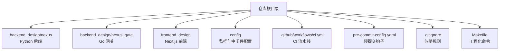
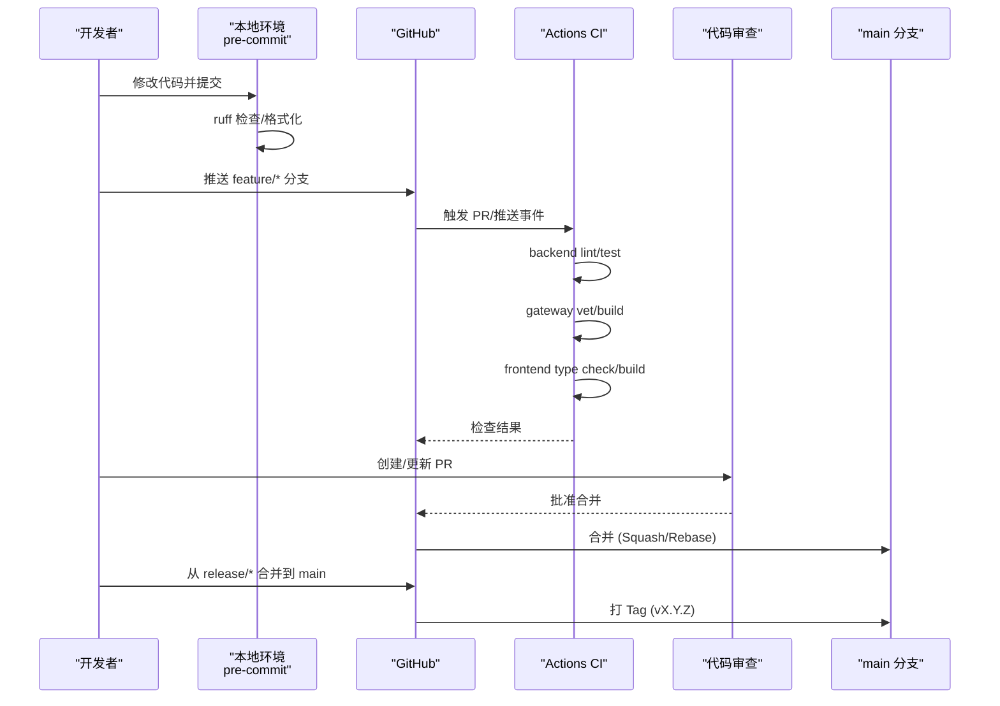
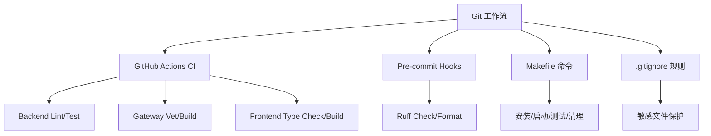

# Git 工作流程

<cite>
**本文引用的文件**
- [README.md](file://README.md)
- [.gitignore](file://.gitignore)
- [.pre-commit-config.yaml](file://.pre-commit-config.yaml)
- [.github/workflows/ci.yml](file://.github/workflows/ci.yml)
- [Makefile](file://Makefile)
- [Agent.md](file://Agent.md)
</cite>

## 目录
1. [简介](#简介)
2. [项目结构](#项目结构)
3. [核心组件](#核心组件)
4. [架构总览](#架构总览)
5. [详细组件分析](#详细组件分析)
6. [依赖分析](#依赖分析)
7. [性能考虑](#性能考虑)
8. [故障排查指南](#故障排查指南)
9. [结论](#结论)
10. [附录](#附录)

## 简介
本规范为 NexusCockpit 制定统一的 Git 工作流程与协作标准，覆盖分支策略、提交信息规范、代码审查与合并策略、版本标签与发布流程、冲突解决与回滚、紧急修复（Hotfix）流程、敏感文件保护（.gitignore）、以及团队协作最佳实践。目标是提升团队开发效率与代码版本管理的规范性，确保多语言栈（Python/Go/Next.js）在统一流程下高效协作。

## 项目结构
NexusCockpit 采用前后端分离与多语言栈：
- 后端 Python 服务：backend_design/nexus
- Go 并发网关：backend_design/nexus_gate
- 前端 Next.js：frontend_design
- 基础设施与配置：config、docker-compose、Makefile
- CI/CD：.github/workflows/ci.yml
- 代码质量：.pre-commit-config.yaml
- 忽略规则：.gitignore

图表来源
- [README.md:93-138](file://README.md#L93-L138)
- [.github/workflows/ci.yml:1-72](file://.github/workflows/ci.yml#L1-L72)
- [.pre-commit-config.yaml:1-10](file://.pre-commit-config.yaml#L1-L10)
- [.gitignore:1-206](file://.gitignore#L1-L206)
- [Makefile:1-173](file://Makefile#L1-L173)

章节来源
- [README.md:93-138](file://README.md#L93-L138)
- [Agent.md:66-170](file://Agent.md#L66-L170)

## 核心组件
- 分支模型：主分支保护、功能分支、发布分支、热修复分支
- 提交信息规范：Conventional Commits 风格
- 代码审查：Pull Request + 自动化检查（lint/test/build）
- 合并策略：Squash Merge 或 Rebase Merge，禁止直接 push 到受保护分支
- 版本标签：语义化版本（SemVer），按里程碑打 tag
- 发布流程：从 release/* 到 main，打 tag 并生成发布说明
- 冲突解决：rebase 优先，必要时 merge 并附变更说明
- 回滚操作：通过 revert 或回退至稳定 tag
- 紧急修复：hotfix/* 分支快速修复，走最小审查路径
- 敏感文件保护：.gitignore 严格过滤密钥、日志、二进制等
- 团队协作：同步上游、变更跟踪、文档更新与一致性校验

章节来源
- [.github/workflows/ci.yml:1-72](file://.github/workflows/ci.yml#L1-L72)
- [.pre-commit-config.yaml:1-10](file://.pre-commit-config.yaml#L1-L10)
- [.gitignore:1-206](file://.gitignore#L1-L206)
- [Makefile:119-173](file://Makefile#L119-L173)

## 架构总览
Git 工作流与 CI/CD 的交互关系如下：开发者在功能分支提交代码，触发 pre-commit 钩子进行本地质量检查；推送后由 GitHub Actions 执行 lint、测试与构建；合并前需通过 Pull Request 审查；发布时从 release/* 合并到 main 并打 tag。

图表来源
- [.github/workflows/ci.yml:1-72](file://.github/workflows/ci.yml#L1-L72)
- [.pre-commit-config.yaml:1-10](file://.pre-commit-config.yaml#L1-L10)

## 详细组件分析

### 分支管理策略
- 主分支保护
  - main：仅允许通过 PR 合并，禁止直接 push
  - develop：日常集成分支，用于功能联调
- 功能分支
  - feature/<模块>-<描述>：新功能开发
  - refactor/<模块>-<描述>：重构
  - docs/<模块>-<描述>：文档更新
- 发布分支
  - release/<版本号>：冻结代码，回归测试，准备发布
- 热修复分支
  - hotfix/<问题描述>：线上紧急修复，快速走最小审查流程

建议命名约定：
- 使用小写和连字符分隔，避免空格与特殊字符
- 保持分支名简洁明确，体现改动范围

章节来源
- [.github/workflows/ci.yml:4-7](file://.github/workflows/ci.yml#L4-L7)

### 提交信息规范
采用 Conventional Commits 风格，便于自动生成变更日志与版本管理：
- feat: 新功能
- fix: 修复缺陷
- docs: 文档更新
- style: 代码格式（不影响逻辑）
- refactor: 重构
- test: 测试相关
- chore: 构建过程或辅助工具变动

示例格式：
- feat(api): 新增座舱聊天接口
- fix(gateway): 修复 JWT 验证失败问题
- docs(readme): 更新部署步骤

章节来源
- [README.md:512-521](file://README.md#L512-L521)

### 代码审查流程
- 所有变更必须通过 Pull Request 审查
- 审查要点：
  - 代码质量：ruff 检查、类型检查、构建成功
  - 测试覆盖：单元测试与集成测试通过
  - 安全性：无敏感信息泄露、依赖安全扫描
  - 可维护性：模块化、注释清晰、文档更新
- 审查通过后合并策略：
  - 推荐 Squash Merge 以保持历史整洁
  - 或 Rebase Merge 保留完整提交历史

章节来源
- [.github/workflows/ci.yml:10-72](file://.github/workflows/ci.yml#L10-L72)

### 合并策略
- main 分支：仅接受来自 release/* 或 hotfix/* 的合并
- develop 分支：接受来自 feature/*、refactor/*、docs/* 的合并
- 禁止直接 push 到受保护分支
- 合并前必须通过 CI 检查与至少一名审查者批准

章节来源
- [.github/workflows/ci.yml:4-7](file://.github/workflows/ci.yml#L4-L7)

### 版本标签管理与发布流程
- 版本规范：遵循 SemVer（主版本.次版本.修订号）
- 打标签时机：
  - release/* 分支完成回归测试后，合并到 main 并打 tag
  - hotfix/* 分支修复完成后，合并到 main 和 develop，并打 tag
- 发布说明：包含新增功能、修复问题、破坏性变更等

章节来源
- [README.md:512-521](file://README.md#L512-L521)

### 冲突解决策略
- 优先使用 rebase 保持线性历史
- 遇到复杂冲突时，使用 merge 并附上冲突解决说明
- 冲突解决后重新运行 CI 检查

章节来源
- [README.md:512-521](file://README.md#L512-L521)

### 代码回滚操作
- 使用 git revert 撤销特定提交
- 回退到稳定版本：checkout 对应 tag 并创建新分支
- 重大回滚需记录原因并通知团队

章节来源
- [README.md:512-521](file://README.md#L512-L521)

### 紧急修复流程（Hotfix）
- 从 main 分支创建 hotfix/* 分支
- 快速修复并通过最小审查流程
- 合并到 main 和 develop，并打 tag
- 通知相关成员并更新文档

章节来源
- [README.md:512-521](file://README.md#L512-L521)

### .gitignore 配置与敏感文件保护
- 忽略规则分类：
  - Python 虚拟环境与缓存
  - IDE 配置文件
  - 环境变量与密钥文件
  - Docker 覆盖配置
  - 日志文件
  - 操作系统临时文件
  - 测试缓存
  - 前端依赖与构建产物
  - 大型模型文件
  - 用户数据与偏好设置
  - 二进制文件与安装包
  - 运行时认证文件
  - Go 网关构建产物
- 敏感文件保护：
  - .env.local、*.secrets、meituan_token*、qweather_secrets* 等
  - 运行时生成的认证文件与缓存目录

章节来源
- [.gitignore:1-206](file://.gitignore#L1-L206)

### 团队协作最佳实践
- 代码同步：定期 pull 上游 develop 分支，避免长期偏离
- 变更跟踪：使用清晰的提交信息与 PR 描述
- 文档更新：代码变更同步更新相关文档
- 质量保障：使用 Makefile 统一命令，确保环境一致
- 持续集成：利用 CI 自动检查与测试

章节来源
- [Makefile:1-173](file://Makefile#L1-L173)
- [Agent.md:252-300](file://Agent.md#L252-L300)

## 依赖分析
Git 工作流依赖以下关键组件：
- GitHub Actions：自动化 CI/CD 流水线
- Pre-commit Hooks：本地代码质量检查
- Makefile：统一工程化命令
- .gitignore：敏感文件与构建产物忽略

图表来源
- [.github/workflows/ci.yml:1-72](file://.github/workflows/ci.yml#L1-L72)
- [.pre-commit-config.yaml:1-10](file://.pre-commit-config.yaml#L1-L10)
- [Makefile:1-173](file://Makefile#L1-L173)
- [.gitignore:1-206](file://.gitignore#L1-L206)

章节来源
- [.github/workflows/ci.yml:1-72](file://.github/workflows/ci.yml#L1-L72)
- [.pre-commit-config.yaml:1-10](file://.pre-commit-config.yaml#L1-L10)
- [Makefile:1-173](file://Makefile#L1-L173)
- [.gitignore:1-206](file://.gitignore#L1-L206)

## 性能考虑
- 合理使用分支策略，避免过长生命周期分支导致合并复杂度增加
- 提交粒度适中，便于回溯与审查
- 利用 CI 缓存依赖，加速构建与测试
- 大文件与模型文件通过外部存储管理，避免仓库膨胀

[本节为通用指导，无需引用具体文件]

## 故障排查指南
- CI 失败：检查 lint、测试、构建日志，定位具体问题
- 冲突解决：使用 git diff 查看差异，手动解决冲突后重新提交
- 权限问题：确认分支保护规则与访问权限
- 敏感文件泄露：立即移除并轮换密钥，审查 .gitignore 规则

章节来源
- [.github/workflows/ci.yml:10-72](file://.github/workflows/ci.yml#L10-L72)
- [.gitignore:1-206](file://.gitignore#L1-L206)

## 结论
本规范为 NexusCockpit 提供了标准化的 Git 工作流程，涵盖分支管理、提交规范、代码审查、版本控制、冲突解决、回滚操作、紧急修复、敏感文件保护与团队协作最佳实践。通过统一的流程与工具链，确保团队开发效率与代码质量，支持多语言栈的高效协作与持续交付。

[本节为总结性内容，无需引用具体文件]

## 附录
- 常用命令参考：
  - 创建分支：git checkout -b feature/<描述>
  - 提交代码：git commit -m "feat: <描述>"
  - 推送分支：git push origin feature/<描述>
  - 创建 PR：通过 GitHub Web 界面
  - 合并分支：选择 Squash Merge 或 Rebase Merge
  - 打标签：git tag -a v1.0.0 -m "Release v1.0.0"
  - 推送标签：git push origin v1.0.0

章节来源
- [README.md:512-521](file://README.md#L512-L521)