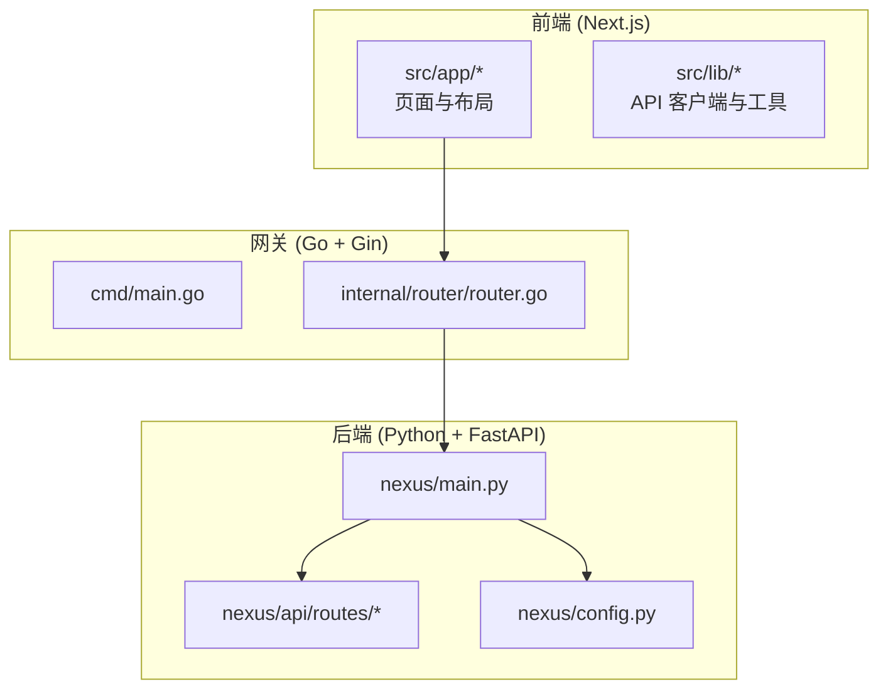
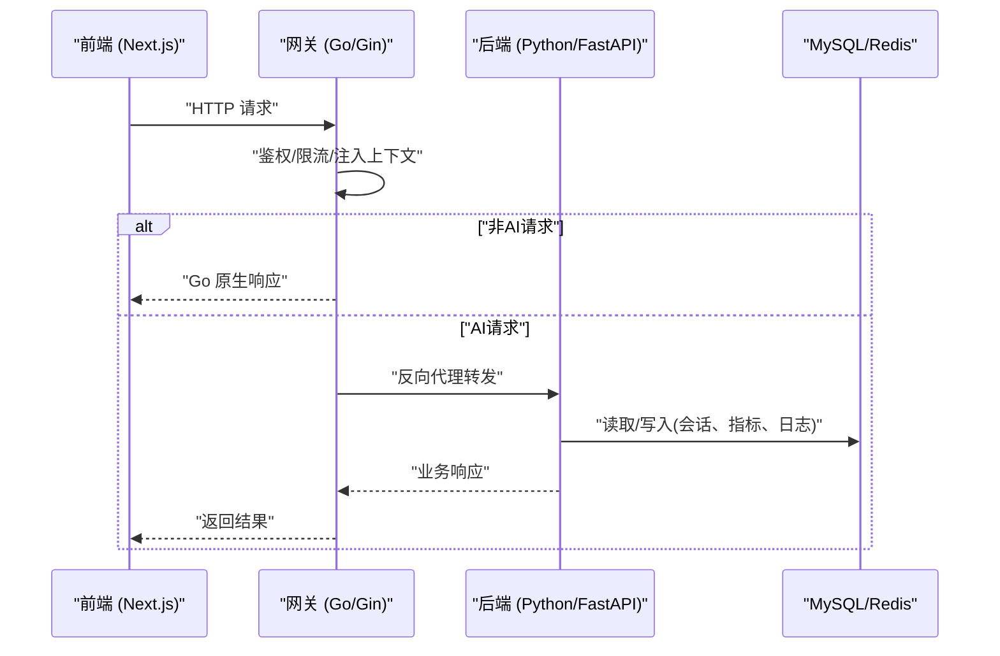
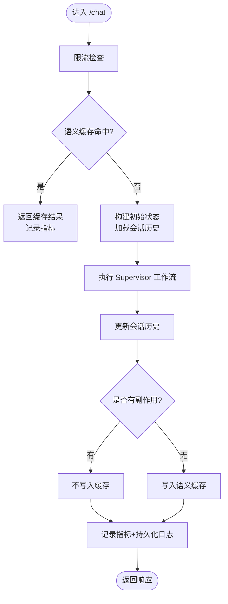
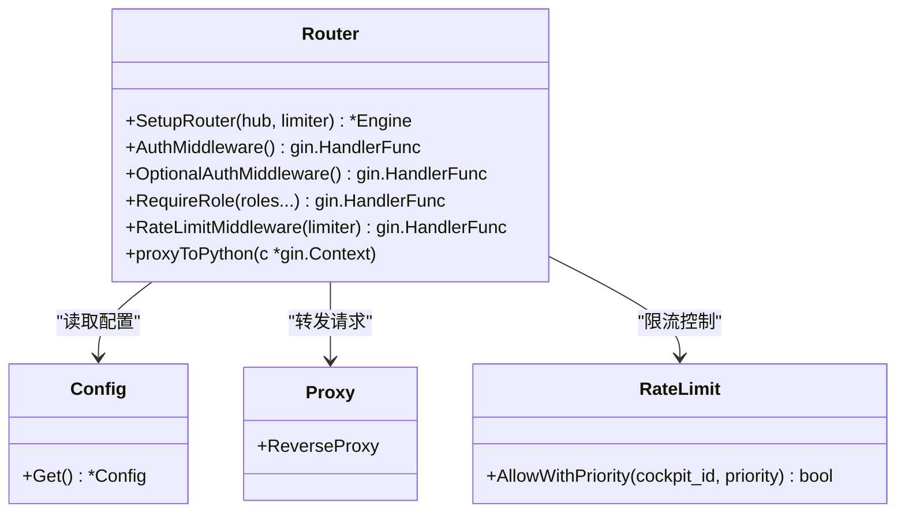
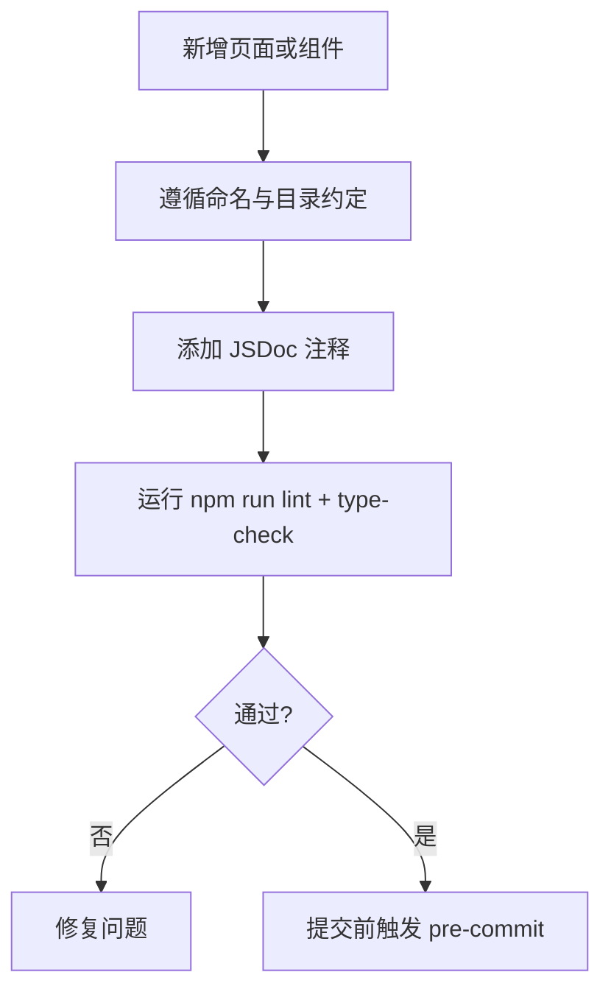
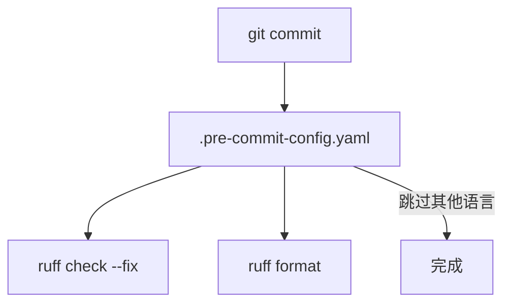
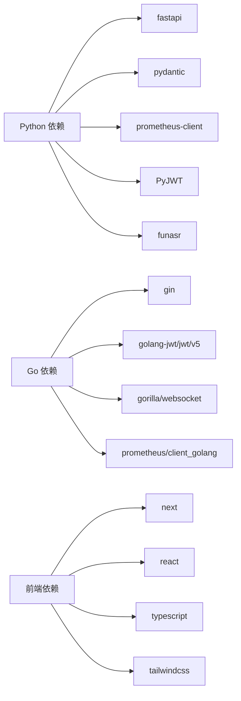

# 代码规范与最佳实践

<cite>
**本文引用的文件**   
- [.pre-commit-config.yaml](file://.pre-commit-config.yaml)
- [main.py](file://backend_design/nexus/main.py)
- [config.py](file://backend_design/nexus/config.py)
- [chat.py](file://backend_design/nexus/api/routes/chat.py)
- [router.go](file://backend_design/nexus_gate/internal/router/router.go)
- [main.go](file://backend_design/nexus_gate/cmd/main.go)
- [go.mod](file://backend_design/nexus_gate/go.mod)
- [package.json](file://frontend_design/package.json)
- [tsconfig.json](file://frontend_design/tsconfig.json)
- [layout.tsx](file://frontend_design/src/app/layout.tsx)
- [page.tsx](file://frontend_design/src/app/cockpit/page.tsx)
- [api.ts](file://frontend_design/src/lib/api.ts)
- [.editorconfig](file://.editorconfig)
- [add_copyright.py](file://scripts/add_copyright.py)
</cite>

## 目录
1. [引言](#引言)
2. [项目结构](#项目结构)
3. [核心组件](#核心组件)
4. [架构总览](#架构总览)
5. [详细组件分析](#详细组件分析)
6. [依赖分析](#依赖分析)
7. [性能考虑](#性能考虑)
8. [故障排查指南](#故障排查指南)
9. [结论](#结论)
10. [附录](#附录)

## 引言
本指南面向 NexusCockpit 多语言工程（Python FastAPI、Go Gin、TypeScript Next.js），统一命名规范、文件组织、注释标准，并明确预提交钩子、类型检查、格式化等自动化流程。同时给出模块划分、包管理、配置文件组织约定，以及文档编写规范（代码注释、API 文档、README 更新要求）。文末提供“正确 vs 错误”示例对照路径，便于快速对齐团队风格。

## 项目结构
仓库采用前后端分离与网关分层：
- Python 后端：backend_design/nexus（FastAPI）
- Go 网关：backend_design/nexus_gate（Gin）
- 前端：frontend_design（Next.js + TypeScript）
- 配置与可观测性：config/（Prometheus/Grafana/Loki 等）
- 模型与数据：models/、data/
- 脚本与工具：scripts/、Makefile
- 文档：docs/

图表来源
- [main.go:1-87](file://backend_design/nexus_gate/cmd/main.go#L1-L87)
- [router.go:56-200](file://backend_design/nexus_gate/internal/router/router.go#L56-L200)
- [main.py:294-433](file://backend_design/nexus/main.py#L294-L433)
- [config.py:601-673](file://backend_design/nexus/config.py#L601-L673)

章节来源
- [main.go:1-87](file://backend_design/nexus_gate/cmd/main.go#L1-L87)
- [router.go:56-200](file://backend_design/nexus_gate/internal/router/router.go#L56-L200)
- [main.py:294-433](file://backend_design/nexus/main.py#L294-L433)
- [config.py:601-673](file://backend_design/nexus/config.py#L601-L673)

## 核心组件
- 应用入口与生命周期
  - Python：创建 FastAPI 实例、注册路由、中间件、异常处理器；在 lifespan 中初始化向量/图谱存储、车控适配器、语义缓存、限流器、会话存储、Agent 工作流、数据库、指标与数据保留策略。
  - Go：解析参数、加载配置、初始化反向代理、WebSocket Hub、限流器、设置路由、启动 HTTP 服务并优雅关闭。
- 配置中心
  - Python：基于 Pydantic Settings 的多环境配置加载（local/prod）、路径解析、全局单例 get_config()。
- API 路由
  - Python：聊天接口（非流式/流式 SSE）、指标记录、日志持久化、会话并发锁、Langfuse 追踪。
  - Go：鉴权、可选鉴权、角色校验、优先级限流、反向代理注入上下文头。
- 前端
  - Next.js App Router 根布局、页面组织、类型与路径别名、构建与脚本。

章节来源
- [main.py:61-291](file://backend_design/nexus/main.py#L61-L291)
- [main.py:294-433](file://backend_design/nexus/main.py#L294-L433)
- [main.go:30-87](file://backend_design/nexus_gate/cmd/main.go#L30-L87)
- [config.py:601-673](file://backend_design/nexus/config.py#L601-L673)
- [chat.py:146-293](file://backend_design/nexus/api/routes/chat.py#L146-L293)
- [router.go:290-424](file://backend_design/nexus_gate/internal/router/router.go#L290-L424)
- [layout.tsx:1-55](file://frontend_design/src/app/layout.tsx#L1-L55)
- [page.tsx:1-41](file://frontend_design/src/app/cockpit/page.tsx#L1-L41)

## 架构总览
请求从前端进入 Go 网关，按路径分流：
- 非 AI 请求：Go 原生处理（健康检查、鉴权、数据中台概览、中间件状态、设置列表等）
- AI 相关请求：转发到 Python FastAPI（对话、车控、ASR/TTS、WebSocket）

图表来源
- [router.go:56-200](file://backend_design/nexus_gate/internal/router/router.go#L56-L200)
- [main.py:294-433](file://backend_design/nexus/main.py#L294-L433)
- [chat.py:146-293](file://backend_design/nexus/api/routes/chat.py#L146-L293)

## 详细组件分析

### Python (FastAPI) 编码规范与最佳实践
- 命名与文件组织
  - 模块与函数使用 snake_case；类名使用 PascalCase；常量全大写。
  - 路由文件以功能域命名（如 chat.py、vehicle.py），统一放在 nexus/api/routes/。
  - 配置集中管理于 nexus/config.py，通过 AppConfig 聚合各子系统配置。
- 注释与文档字符串
  - 模块级 docstring 说明职责、版本变更、调用流程。
  - 函数/方法使用 Google 风格参数与返回值描述。
- 异步与并发
  - 会话级并发锁避免历史交叉污染；对长耗时任务使用 asyncio.create_task 并安全捕获异常。
- 异常与指标
  - 自定义异常映射为不同 HTTP 状态码；统一 Prometheus 指标埋点。
- 配置与环境
  - 使用 pydantic-settings 的 BaseSettings，结合 .env.local/.env.prod 自动切换；生产环境弱密钥检测告警。

图表来源
- [chat.py:146-293](file://backend_design/nexus/api/routes/chat.py#L146-L293)

章节来源
- [main.py:61-291](file://backend_design/nexus/main.py#L61-L291)
- [main.py:294-433](file://backend_design/nexus/main.py#L294-L433)
- [config.py:601-673](file://backend_design/nexus/config.py#L601-L673)
- [chat.py:146-293](file://backend_design/nexus/api/routes/chat.py#L146-L293)

### Go (Gin) 编码规范与最佳实践
- 命名与文件组织
  - 包名小写；函数/变量使用驼峰；测试文件 *_test.go。
  - internal 下按职责分包：auth、config、handlers、proxy、ratelimit、router、ws。
- 路由与中间件
  - 区分“Go 原生处理”和“转发 Python”，统一注入 X-Cockpit-Id/X-User-Id/X-User-Role。
  - 鉴权中间件支持可选模式；角色校验中间件限制访问范围。
- 限流与指标
  - 基于 Redis 的令牌桶实现优先级限流；Prometheus 指标统计请求数与耗时。
- 启动与优雅关闭
  - 解析命令行参数、加载 .env、初始化反向代理与 WebSocket Hub、监听信号优雅退出。

图表来源
- [router.go:56-200](file://backend_design/nexus_gate/internal/router/router.go#L56-L200)
- [router.go:290-424](file://backend_design/nexus_gate/internal/router/router.go#L290-L424)
- [main.go:30-87](file://backend_design/nexus_gate/cmd/main.go#L30-L87)

章节来源
- [router.go:56-200](file://backend_design/nexus_gate/internal/router/router.go#L56-L200)
- [router.go:290-424](file://backend_design/nexus_gate/internal/router/router.go#L290-L424)
- [main.go:30-87](file://backend_design/nexus_gate/cmd/main.go#L30-L87)

### TypeScript (Next.js) 编码规范与最佳实践
- 命名与文件组织
  - 组件与 Hook 使用 PascalCase；工具函数使用 camelCase。
  - 页面按路由文件夹组织（app/*/page.tsx），公共 UI 放 components/ui，领域组件放对应目录。
- 类型与路径别名
  - tsconfig 启用 strict，paths 配置 @/* 指向 src/*，统一导入路径。
- 构建与脚本
  - package.json 定义 dev/build/start/lint/type-check 脚本；Dockerfile 多阶段构建。
- 注释与文档字符串
  - 组件顶部 JSDoc 说明用途、参数、副作用；对外暴露的 API 函数需标注输入输出类型。

章节来源
- [package.json:1-45](file://frontend_design/package.json#L1-L45)
- [tsconfig.json:1-23](file://frontend_design/tsconfig.json#L1-L23)
- [layout.tsx:1-55](file://frontend_design/src/app/layout.tsx#L1-L55)
- [page.tsx:1-41](file://frontend_design/src/app/cockpit/page.tsx#L1-L41)

### 预提交钩子与自动化流程
- 预提交钩子
  - 使用 ruff 进行 Python 代码检查与格式化，仅作用于 backend_design/ 目录。
- 前端类型检查与 Lint
  - 通过 npm scripts 提供 type-check 与 lint，建议本地开发时先执行再提交。
- 编辑器统一
  - .editorconfig 统一缩进、换行、尾部空格等，防止中文乱码与格式不一致。

图表来源
- [.pre-commit-config.yaml:1-10](file://.pre-commit-config.yaml#L1-L10)

章节来源
- [.pre-commit-config.yaml:1-10](file://.pre-commit-config.yaml#L1-L10)
- [package.json:1-45](file://frontend_design/package.json#L1-L45)
- [.editorconfig:1-23](file://.editorconfig#L1-L23)

### 项目结构约定
- 模块划分
  - Python：按能力域拆分（agent、api、core、intent、memory、middleware、models、observability、rag、skills、tts、vehicle）。
  - Go：按职责分包（auth、config、handlers、proxy、ratelimit、router、ws）。
  - 前端：App Router 页面、共享布局、通用 UI、领域组件、hooks、stores、types。
- 包管理
  - Python：requirements.txt 固定依赖版本；pyproject.toml 用于构建元信息。
  - Go：go.mod 声明模块与依赖；go.sum 锁定版本。
  - 前端：package.json 管理依赖与脚本。
- 配置文件组织
  - Python：nexus/config.py 集中管理所有配置项，支持 local/prod 环境切换。
  - Go：internal/config 读取环境变量；.env 由 main 加载。
  - 前端：next.config.js、tailwind.config.ts、postcss.config.js、tsconfig.json。

章节来源
- [config.py:601-673](file://backend_design/nexus/config.py#L601-L673)
- [go.mod:1-44](file://backend_design/nexus_gate/go.mod#L1-L44)
- [package.json:1-45](file://frontend_design/package.json#L1-L45)

### 文档编写规范
- 代码注释
  - 模块级 docstring/JSDoc 说明职责、版本变更、关键流程。
  - 函数/方法标注参数、返回值、异常与副作用。
- API 文档
  - Python：Pydantic 模型自动生成 OpenAPI/Swagger；保持字段描述清晰。
  - Go：路由与中间件注释说明行为与权限要求。
- README 更新
  - 新增功能或配置项需在 docs/ 与 README 同步更新，确保部署与使用说明一致。

章节来源
- [chat.py:1-24](file://backend_design/nexus/api/routes/chat.py#L1-24)
- [main.py:5-19](file://backend_design/nexus/main.py#L5-L19)
- [layout.tsx:7-12](file://frontend_design/src/app/layout.tsx#L7-L12)

### 多语言编码约定对比（正确 vs 错误）
- Python（FastAPI）
  - 正确：使用 snake_case 命名函数与变量；模块首行包含版权与许可证注释；docstring 描述参数与返回值。
  - 错误：混用大小写命名；缺失模块级注释；未使用 Pydantic 模型导致类型不安全。
  - 参考路径：[main.py:5-19](file://backend_design/nexus/main.py#L5-L19)、[chat.py:1-24](file://backend_design/nexus/api/routes/chat.py#L1-24)
- Go（Gin）
  - 正确：包名小写；函数/变量驼峰；路由中间件清晰分层；错误返回结构化 JSON。
  - 错误：包名大写；硬编码配置；缺少鉴权与限流中间件。
  - 参考路径：[router.go:56-200](file://backend_design/nexus_gate/internal/router/router.go#L56-L200)、[main.go:30-87](file://backend_design/nexus_gate/cmd/main.go#L30-L87)
- TypeScript（Next.js）
  - 正确：组件与 Hook 使用 PascalCase；tsconfig 开启 strict；JSDoc 标注输入输出类型。
  - 错误：任意类型 any 滥用；路径别名未使用；缺失类型注解。
  - 参考路径：[tsconfig.json:1-23](file://frontend_design/tsconfig.json#L1-L23)、[layout.tsx:1-55](file://frontend_design/src/app/layout.tsx#L1-L55)

章节来源
- [main.py:5-19](file://backend_design/nexus/main.py#L5-L19)
- [chat.py:1-24](file://backend_design/nexus/api/routes/chat.py#L1-24)
- [router.go:56-200](file://backend_design/nexus_gate/internal/router/router.go#L56-L200)
- [main.go:30-87](file://backend_design/nexus_gate/cmd/main.go#L30-L87)
- [tsconfig.json:1-23](file://frontend_design/tsconfig.json#L1-L23)
- [layout.tsx:1-55](file://frontend_design/src/app/layout.tsx#L1-L55)

## 依赖分析
- Python 依赖
  - FastAPI、Pydantic、prometheus-client、structlog、PyJWT、httpx/aiohttp、funasr、transformers 等。
- Go 依赖
  - gin-gonic/gin、golang-jwt/jwt/v5、gorilla/websocket、prometheus/client_golang。
- 前端依赖
  - next、react、zustand、axios、tailwindcss、typescript、eslint。

图表来源
- [requirements.txt:43-98](file://backend_design/requirements.txt#L43-L98)
- [go.mod:1-44](file://backend_design/nexus_gate/go.mod#L1-L44)
- [package.json:1-45](file://frontend_design/package.json#L1-L45)

章节来源
- [requirements.txt:43-98](file://backend_design/requirements.txt#L43-L98)
- [go.mod:1-44](file://backend_design/nexus_gate/go.mod#L1-L44)
- [package.json:1-45](file://frontend_design/package.json#L1-L45)

## 性能考虑
- 会话并发控制
  - 使用会话级锁避免同一 session 的并发请求交叉污染历史；对空闲锁进行清理防止内存泄漏。
- 语义缓存
  - 命中直接返回，减少 LLM 调用；带副作用的响应禁止缓存。
- 指标与监控
  - Prometheus 指标覆盖网关与后端；Langfuse 链路追踪贯穿 Agent 执行。
- 限流与降级
  - 网关层优先级限流；云端 LLM 不可用时可降级至本地 llama.cpp 兼容接口。

章节来源
- [chat.py:54-74](file://backend_design/nexus/api/routes/chat.py#L54-L74)
- [chat.py:254-264](file://backend_design/nexus/api/routes/chat.py#L254-L264)
- [router.go:31-54](file://backend_design/nexus_gate/internal/router/router.go#L31-L54)
- [config.py:131-146](file://backend_design/nexus/config.py#L131-L146)

## 故障排查指南
- 常见问题定位
  - 连接失败：Milvus/Neo4j/Redis 连接失败不阻止启动，但需关注日志与重试策略。
  - 鉴权失败：检查 Authorization 头与 JWT claims；确认 cockpit_id 匹配。
  - 限流触发：查看优先级与 QPS 上限；必要时调整配置。
  - 会话历史错乱：确认会话锁是否生效；检查 SessionStore 读写顺序。
- 日志与追踪
  - 使用 structlog 结构化日志；Langfuse trace/span 定位慢节点。
- 指标与看板
  - 通过 /metrics 与 Grafana 看板观察 P95/P99 延迟与错误率。

章节来源
- [main.py:89-104](file://backend_design/nexus/main.py#L89-L104)
- [router.go:290-357](file://backend_design/nexus_gate/internal/router/router.go#L290-L357)
- [chat.py:77-144](file://backend_design/nexus/api/routes/chat.py#L77-L144)

## 结论
本规范统一了多语言工程的命名、组织与注释标准，明确了预提交钩子与类型检查流程，并通过架构图与流程图帮助理解系统交互。遵循这些约定将提升代码质量、可维护性与团队协作效率。

## 附录
- 版权头批量添加
  - 使用脚本为 Python/Go/TypeScript 源码添加统一版权声明，扫描指定目录并跳过常见生成目录。
- 前端 API 适配
  - 前端 api.ts 对 Go 网关与 Python 后端的响应差异进行归一化处理，保证上层逻辑一致性。

章节来源
- [add_copyright.py:1-39](file://scripts/add_copyright.py#L1-L39)
- [api.ts:558-594](file://frontend_design/src/lib/api.ts#L558-L594)