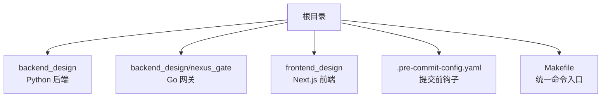
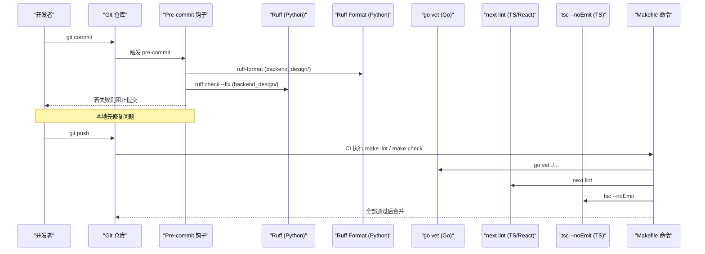
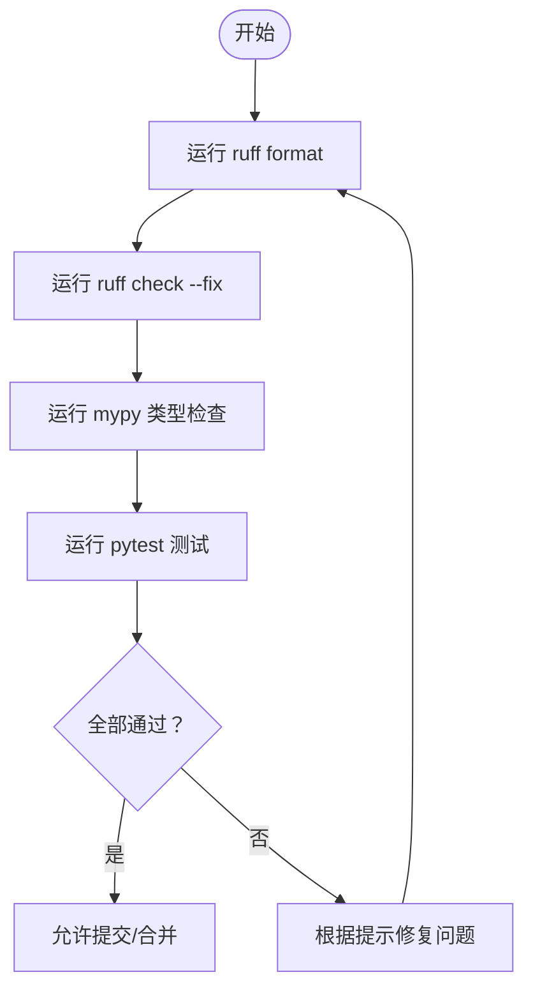
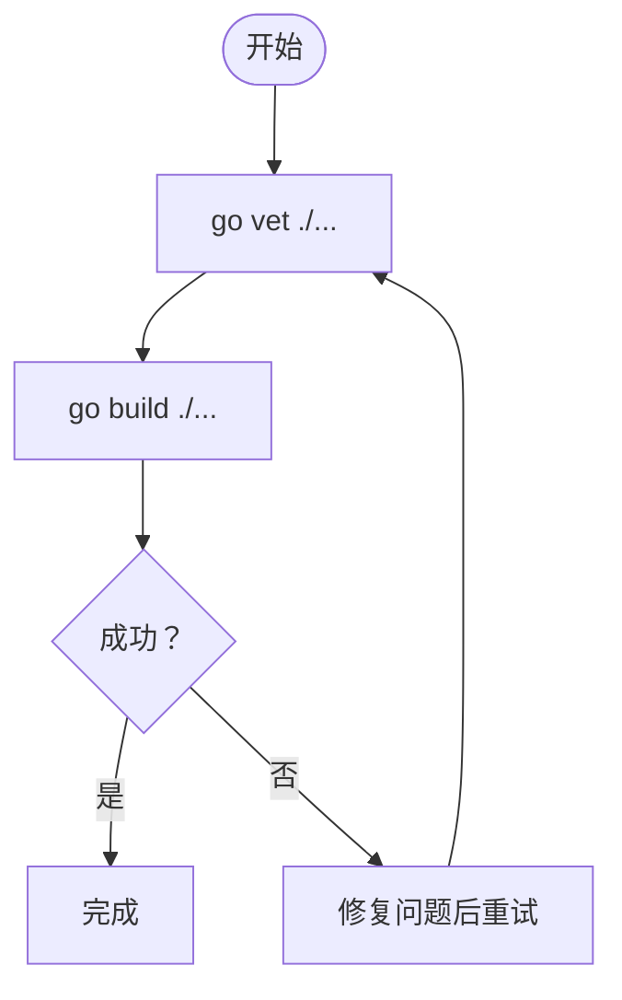
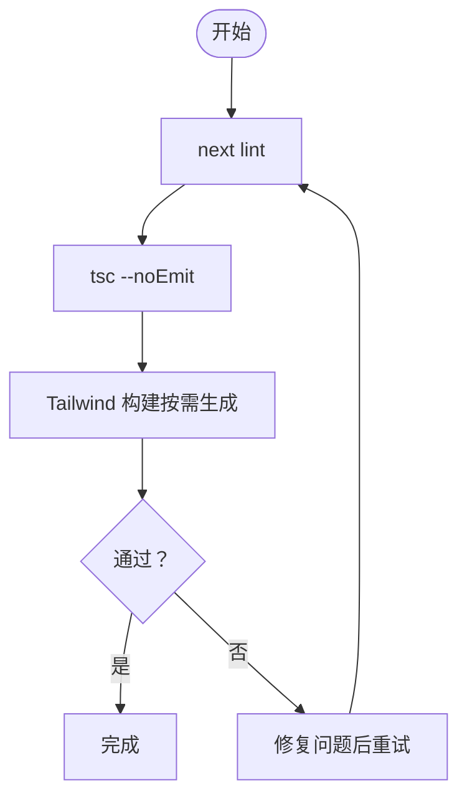
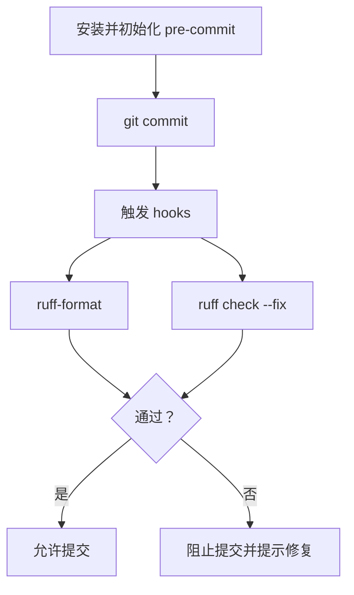
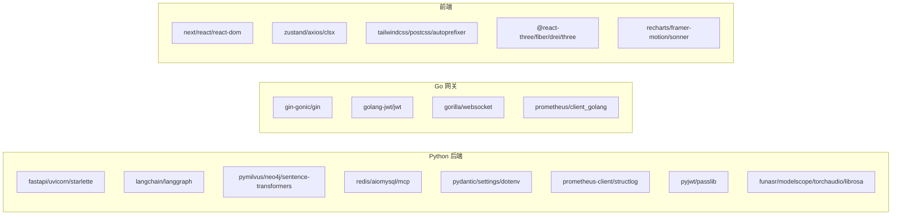

# 代码规范与质量

<cite>
**本文引用的文件**   
- [.pre-commit-config.yaml](file://.pre-commit-config.yaml)
- [backend_design/pyproject.toml](file://backend_design/pyproject.toml)
- [Makefile](file://Makefile)
- [frontend_design/package.json](file://frontend_design/package.json)
- [frontend_design/tsconfig.json](file://frontend_design/tsconfig.json)
- [frontend_design/tailwind.config.ts](file://frontend_design/tailwind.config.ts)
- [backend_design/nexus_gate/go.mod](file://backend_design/nexus_gate/go.mod)
</cite>

## 目录
1. [简介](#简介)
2. [项目结构](#项目结构)
3. [核心组件](#核心组件)
4. [架构总览](#架构总览)
5. [详细组件分析](#详细组件分析)
6. [依赖分析](#依赖分析)
7. [性能考虑](#性能考虑)
8. [故障排查指南](#故障排查指南)
9. [结论](#结论)
10. [附录](#附录)

## 简介
本指南面向 NexusCockpit 团队，统一 Python、Go、TypeScript/React 前端的代码风格与质量要求，明确静态检查、格式化、类型检查与提交前钩子的配置与使用方式。目标是确保团队协作一致、代码可维护性高、交付质量稳定。

## 项目结构
本项目采用多语言多模块组织：
- 后端 Python（FastAPI + LangChain/LangGraph）位于 backend_design
- Go API 网关位于 backend_design/nexus_gate
- 前端 Next.js（TypeScript/React/Tailwind）位于 frontend_design
- 根级 Makefile 提供统一的开发、测试、构建与质量检查命令
- .pre-commit-config.yaml 定义提交前自动检查

**图表来源**
- [Makefile:1-30](file://Makefile#L1-L30)
- [.pre-commit-config.yaml:1-10](file://.pre-commit-config.yaml#L1-L10)

**章节来源**
- [Makefile:1-30](file://Makefile#L1-L30)
- [.pre-commit-config.yaml:1-10](file://.pre-commit-config.yaml#L1-L10)

## 核心组件
- Python 代码规范与质量
  - Ruff 作为 Lint 与格式化工具，目标版本 py310，行宽 120，启用规则集 E/F/I/N/W/UP
  - mypy 用于类型检查（通过 Makefile 调用）
  - pytest 用于单元测试
- Go 代码规范与质量
  - go vet 进行静态检查（通过 Makefile 调用）
  - go build 用于编译验证
- TypeScript/React 前端代码规范与质量
  - next lint 基于 eslint-config-next
  - tsc --noEmit 进行严格类型检查
  - Tailwind CSS 样式体系由 tailwind.config.ts 管理

**章节来源**
- [backend_design/pyproject.toml:111-127](file://backend_design/pyproject.toml#L111-L127)
- [Makefile:122-147](file://Makefile#L122-L147)
- [frontend_design/package.json:9-11](file://frontend_design/package.json#L9-L11)
- [frontend_design/tsconfig.json:1-24](file://frontend_design/tsconfig.json#L1-L24)
- [frontend_design/tailwind.config.ts:1-55](file://frontend_design/tailwind.config.ts#L1-L55)
- [backend_design/nexus_gate/go.mod:1-44](file://backend_design/nexus_gate/go.mod#L1-L44)

## 架构总览
下图展示了从开发者提交到 CI 的自动化质量门禁流程，涵盖 Python、Go、前端三类语言的检查与格式化。

**图表来源**
- [.pre-commit-config.yaml:1-10](file://.pre-commit-config.yaml#L1-L10)
- [Makefile:122-147](file://Makefile#L122-L147)
- [frontend_design/package.json:9-11](file://frontend_design/package.json#L9-L11)

## 详细组件分析

### Python 代码规范与质量（Ruff + mypy + pytest）
- Ruff 配置要点
  - 目标版本：py310
  - 行长度：120
  - 启用的规则集：E（pycodestyle）、F（pyflakes）、I（isort）、N（pep8-naming）、W（警告）、UP（pyupgrade）
  - 文件级忽略：对特定文件的 import 顺序或位置做例外处理
- 格式化与修复
  - ruff format 负责统一缩进、引号、换行等
  - ruff check --fix 自动修复可修复的问题
- 类型检查
  - mypy 通过 Makefile 调用，建议开启严格模式并在项目中逐步完善类型注解
- 测试
  - pytest 异步模式 auto，测试路径 tests

**图表来源**
- [backend_design/pyproject.toml:111-127](file://backend_design/pyproject.toml#L111-L127)
- [Makefile:122-147](file://Makefile#L122-L147)

**章节来源**
- [backend_design/pyproject.toml:111-127](file://backend_design/pyproject.toml#L111-L127)
- [Makefile:122-147](file://Makefile#L122-L147)

### Go 代码规范与质量（vet + build）
- 静态检查
  - go vet 检查常见错误（如未使用的导入、不安全的转换等）
- 编译验证
  - go build 确保代码可编译
- 模块与依赖
  - go.mod 声明了 Gin、JWT、WebSocket、Prometheus 客户端等依赖

**图表来源**
- [Makefile:133-135](file://Makefile#L133-L135)
- [backend_design/nexus_gate/go.mod:1-44](file://backend_design/nexus_gate/go.mod#L1-L44)

**章节来源**
- [Makefile:133-135](file://Makefile#L133-L135)
- [backend_design/nexus_gate/go.mod:1-44](file://backend_design/nexus_gate/go.mod#L1-L44)

### TypeScript/React 前端代码规范与质量（ESLint + TSC + Tailwind）
- ESLint
  - 使用 next lint（基于 eslint-config-next），保证 React/Next.js 最佳实践
- 类型检查
  - tsc --noEmit 严格模式，确保类型安全
- 样式
  - Tailwind CSS 通过 tailwind.config.ts 统一管理主题、颜色、动画等

**图表来源**
- [frontend_design/package.json:9-11](file://frontend_design/package.json#L9-L11)
- [frontend_design/tsconfig.json:1-24](file://frontend_design/tsconfig.json#L1-L24)
- [frontend_design/tailwind.config.ts:1-55](file://frontend_design/tailwind.config.ts#L1-L55)

**章节来源**
- [frontend_design/package.json:9-11](file://frontend_design/package.json#L9-L11)
- [frontend_design/tsconfig.json:1-24](file://frontend_design/tsconfig.json#L1-L24)
- [frontend_design/tailwind.config.ts:1-55](file://frontend_design/tailwind.config.ts#L1-L55)

### Pre-commit Hooks 配置与使用
- 当前配置
  - 针对 backend_design 目录启用 ruff 与 ruff-format
  - ruff 以 --fix 模式运行，自动修复可修复问题
- 使用方法
  - 安装 pre-commit 并执行 pre-commit install
  - 每次提交将自动触发上述检查
  - 若检查失败，需按提示修复后再提交

**图表来源**
- [.pre-commit-config.yaml:1-10](file://.pre-commit-config.yaml#L1-L10)

**章节来源**
- [.pre-commit-config.yaml:1-10](file://.pre-commit-config.yaml#L1-L10)

## 依赖分析
- Python 依赖集中在 backend_design/pyproject.toml，包含 Web、LLM/RAG、中间件、数据库、观测、认证、音频等
- Go 依赖集中在 backend_design/nexus_gate/go.mod，包含 HTTP、鉴权、WebSocket、指标采集
- 前端依赖集中在 frontend_design/package.json，包含 Next.js、React、状态管理、UI 库、可视化等

**图表来源**
- [backend_design/pyproject.toml:10-100](file://backend_design/pyproject.toml#L10-L100)
- [backend_design/nexus_gate/go.mod:5-10](file://backend_design/nexus_gate/go.mod#L5-L10)
- [frontend_design/package.json:12-30](file://frontend_design/package.json#L12-L30)

**章节来源**
- [backend_design/pyproject.toml:10-100](file://backend_design/pyproject.toml#L10-L100)
- [backend_design/nexus_gate/go.mod:5-10](file://backend_design/nexus_gate/go.mod#L5-L10)
- [frontend_design/package.json:12-30](file://frontend_design/package.json#L12-L30)

## 性能考虑
- Python
  - 合理使用异步（FastAPI/aiomysql/httpx/aiohttp）避免阻塞
  - 控制日志级别与采样，减少 I/O 开销
  - 向量检索与重排序注意批处理与缓存策略
- Go
  - 连接池与超时设置合理配置，避免资源泄露
  - 指标上报与日志输出控制频率，降低 GC 压力
- 前端
  - 按需加载组件与路由，减少首屏体积
  - 使用 Tailwind 的按需生成特性，减小 CSS 体积
  - 图表与 3D 渲染按需更新，避免频繁重绘

[本节为通用指导，不直接分析具体文件]

## 故障排查指南
- Python
  - Ruff 报错：查看具体规则编号与消息，优先使用 ruff check --fix 自动修复；必要时在 per-file-ignores 中谨慎添加例外
  - mypy 类型错误：逐步补充类型注解，必要时使用 # type: ignore 临时绕过并记录 TODO
  - pytest 失败：定位用例失败原因，补充必要的环境变量或 Mock
- Go
  - go vet 报错：根据提示修复潜在问题（如空指针、竞态条件）
  - go build 失败：检查依赖版本与 Go 版本匹配
- 前端
  - next lint 报错：遵循 ESLint 规则修复代码风格与潜在错误
  - tsc 类型错误：补齐类型定义或使用断言，保持 strict 模式一致性
  - Tailwind 样式异常：确认 content 路径与变量定义正确

**章节来源**
- [backend_design/pyproject.toml:111-127](file://backend_design/pyproject.toml#L111-L127)
- [Makefile:122-147](file://Makefile#L122-L147)
- [frontend_design/package.json:9-11](file://frontend_design/package.json#L9-L11)
- [frontend_design/tsconfig.json:1-24](file://frontend_design/tsconfig.json#L1-L24)

## 结论
通过统一的 Ruff、mypy、pytest、go vet、next lint、tsc 以及 pre-commit 钩子，NexusCockpit 实现了跨语言的代码质量门禁。建议在团队内推广以下实践：
- 提交前必须通过 pre-commit 检查
- 新增功能需配套测试与类型注解
- 定期运行 make check 与覆盖率报告
- 对第三方依赖升级进行影响评估与回归测试

[本节为总结，不直接分析具体文件]

## 附录

### 代码审查清单（建议）
- 功能正确性与边界条件覆盖
- 类型注解完整且无 any
- 日志与错误信息清晰可追踪
- 性能敏感路径有优化与监控
- 安全相关输入校验与权限控制
- 文档与注释更新及时

### 注释规范（建议）
- 公共函数/类需提供 docstring 说明用途、参数、返回值与异常
- 复杂逻辑添加行内注释解释“为什么”而非“是什么”
- 对外接口变更需在变更说明中注明

### 命名约定（建议）
- Python：模块小写下划线，类名大驼峰，函数/变量小写下划线
- Go：包名小写，导出标识符大驼峰，常量全大写
- 前端：组件 PascalCase，Hook useXxx，常量 UPPER_SNAKE_CASE

### 自动化工具使用指南
- Python
  - 格式化：ruff format
  - 检查与修复：ruff check --fix
  - 类型检查：mypy
  - 测试：pytest
- Go
  - 静态检查：go vet
  - 构建：go build
- 前端
  - 检查：next lint
  - 类型检查：tsc --noEmit
- 统一入口
  - 使用 Makefile 的 lint、format、check 等目标一键执行

**章节来源**
- [Makefile:122-147](file://Makefile#L122-L147)
- [backend_design/pyproject.toml:111-127](file://backend_design/pyproject.toml#L111-L127)
- [frontend_design/package.json:9-11](file://frontend_design/package.json#L9-L11)
- [frontend_design/tsconfig.json:1-24](file://frontend_design/tsconfig.json#L1-L24)