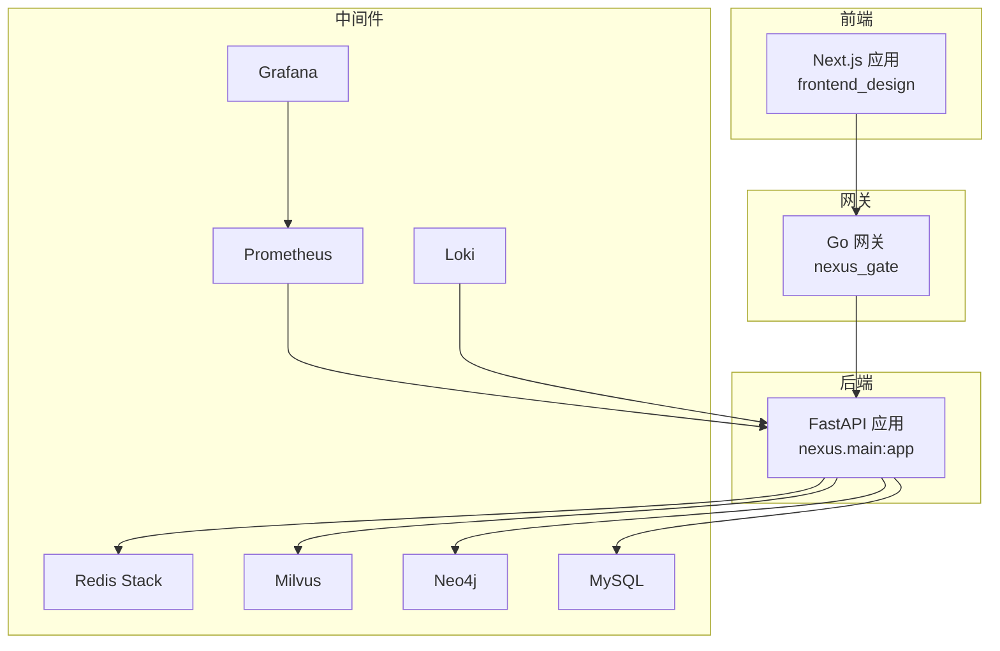
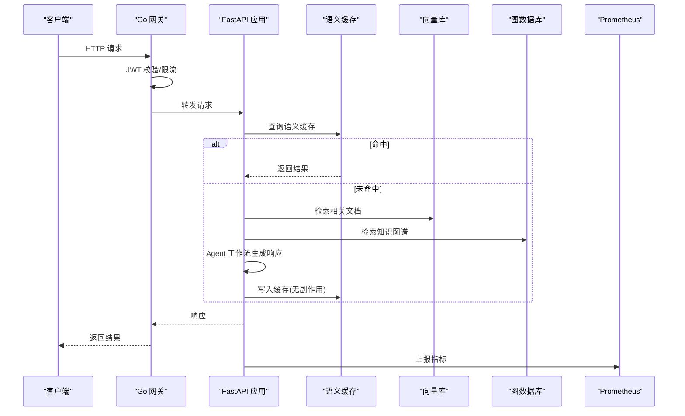
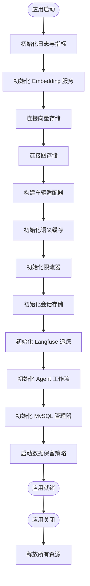
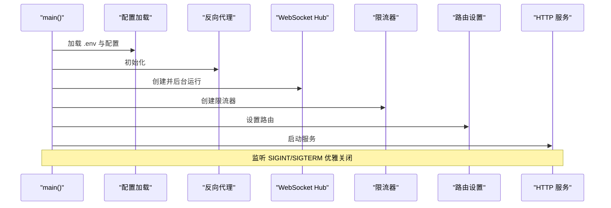
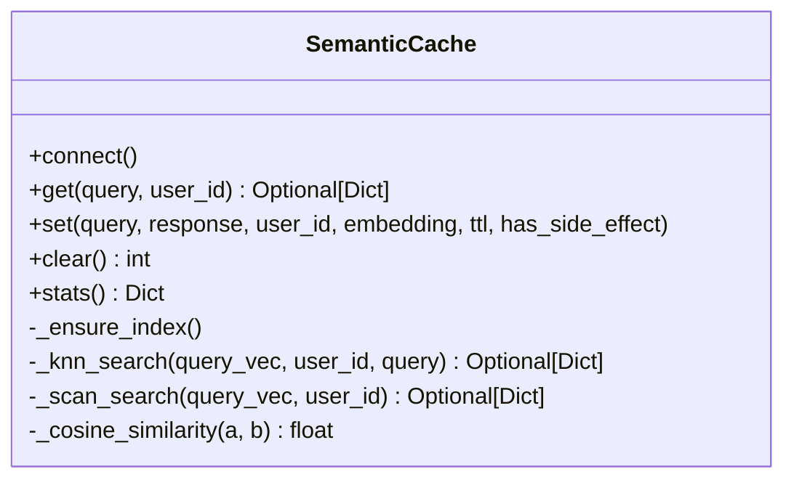
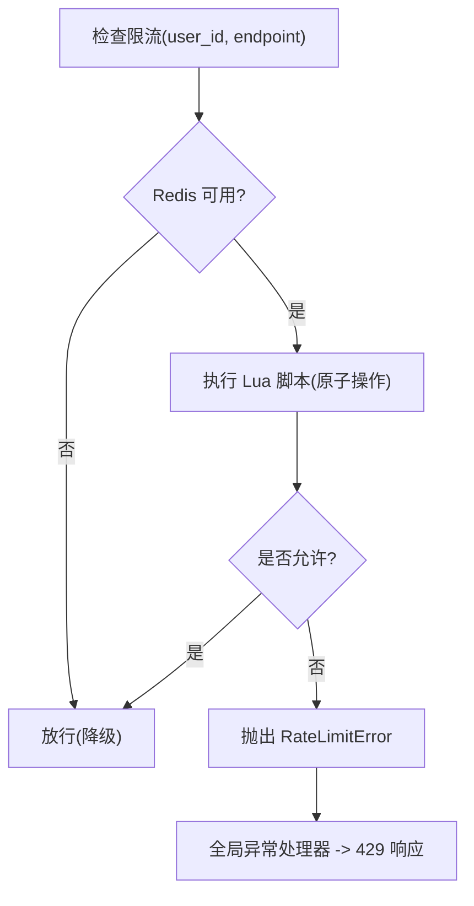
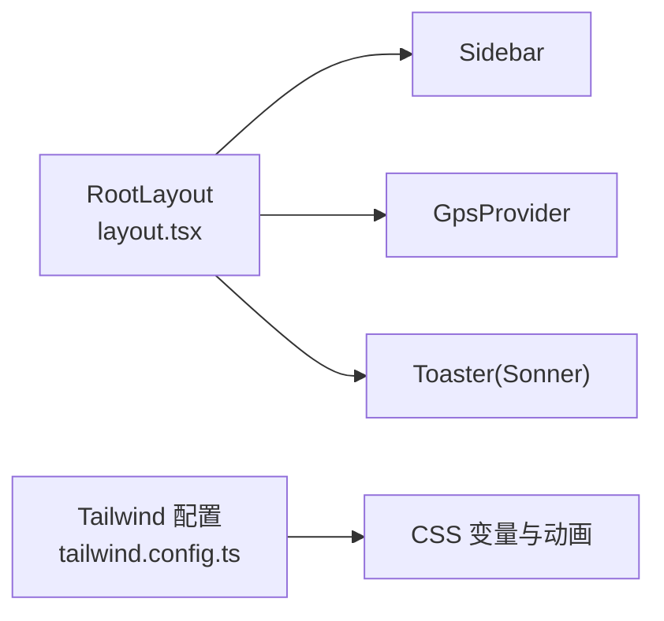
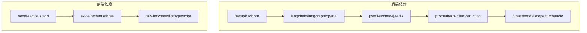

# 开发指南

<cite>
**本文引用的文件**   
- [README.md](file://README.md)
- [.pre-commit-config.yaml](file://.pre-commit-config.yaml)
- [pyproject.toml](file://backend_design/pyproject.toml)
- [package.json](file://frontend_design/package.json)
- [Makefile](file://Makefile)
- [docker-compose.yml](file://docker-compose.yml)
- [SETUP.md](file://docs/deployment/SETUP.md)
- [TESTING.md](file://docs/testing/TESTING.md)
- [main.py](file://backend_design/nexus/main.py)
- [nexus_gate main.go](file://backend_design/nexus_gate/cmd/main.go)
- [layout.tsx](file://frontend_design/src/app/layout.tsx)
- [logger.py](file://backend_design/nexus/core/logger.py)
- [rate_limiter.py](file://backend_design/nexus/middleware/rate_limiter.py)
- [redis_cache.py](file://backend_design/nexus/middleware/redis_cache.py)
- [tailwind.config.ts](file://frontend_design/tailwind.config.ts)
- [.editorconfig](file://.editorconfig)
</cite>

## 目录
1. [简介](#简介)
2. [项目结构](#项目结构)
3. [核心组件](#核心组件)
4. [架构总览](#架构总览)
5. [详细组件分析](#详细组件分析)
6. [依赖关系分析](#依赖关系分析)
7. [性能与可观测性](#性能与可观测性)
8. [调试与故障排查](#调试与故障排查)
9. [贡献指南](#贡献指南)
10. [常见问题解答](#常见问题解答)
11. [结论](#结论)

## 简介
本指南面向 NexusCockpit 开发者，覆盖从环境搭建、IDE 配置、代码规范、测试策略、调试技巧到贡献流程的全链路实践。项目采用 Python（FastAPI）+ Go（Gin）+ TypeScript（Next.js）多语言协作，提供车载语音 Agent、GraphRAG、语义缓存、限流、可观测性等能力。

## 项目结构
- 后端服务：Python FastAPI 应用，位于 backend_design/nexus；Go 并发网关，位于 backend_design/nexus_gate
- 前端应用：Next.js 应用，位于 frontend_design
- 基础设施编排：docker-compose.yml 管理 Milvus、Neo4j、Redis、MySQL、Prometheus、Grafana、Loki 等
- 工程化：Makefile 统一命令；.pre-commit-config.yaml 预提交钩子；pyproject.toml 与 package.json 定义依赖与脚本

图示来源
- [docker-compose.yml:1-246](file://docker-compose.yml#L1-L246)
- [main.py:294-437](file://backend_design/nexus/main.py#L294-L437)
- [nexus_gate main.go:30-87](file://backend_design/nexus_gate/cmd/main.go#L30-L87)

章节来源
- [README.md:95-143](file://README.md#L95-L143)
- [docker-compose.yml:1-246](file://docker-compose.yml#L1-L246)

## 核心组件
- 后端入口与生命周期：创建 FastAPI 实例、注册路由、挂载指标端点、初始化中间件与核心服务（向量库、图谱、缓存、会话、Agent、数据保留策略等），并在关闭时清理资源
- Go 网关：JWT 鉴权、座舱级令牌桶限流、非 AI 请求直处理、AI 请求反向代理至 Python、WebSocket Hub 管理连接
- 语义缓存：基于 Redis Stack RediSearch KNN 的语义缓存，支持按用户分片、TTL 分级、副作用隔离（车控指令不缓存）
- 限流器：基于 Redis Lua 原子滑动窗口，保证分布式安全与无污染的计数
- 结构化日志：structlog JSON 输出，便于 Loki/ELK 采集与链路追踪

章节来源
- [main.py:61-291](file://backend_design/nexus/main.py#L61-L291)
- [nexus_gate main.go:30-87](file://backend_design/nexus_gate/cmd/main.go#L30-L87)
- [redis_cache.py:55-111](file://backend_design/nexus/middleware/redis_cache.py#L55-L111)
- [rate_limiter.py:63-174](file://backend_design/nexus/middleware/rate_limiter.py#L63-L174)
- [logger.py:32-71](file://backend_design/nexus/core/logger.py#L32-L71)

## 架构总览
NexusCockpit 采用分层架构与多语言协作：
- L7 可观测层：Langfuse、Prometheus、Grafana
- L6 API 层：FastAPI REST/SSE/WebSocket + JWT
- L5 中间件层：Redis 语义缓存、限流、会话存储、熔断器
- L4 Agent 层：Supervisor + 专家 Agent 并行执行 + Responder + Reviewer
- L3 服务层：ASR/TTS、Skills、Vehicle、Intent、MCP
- L2 数据层：GraphRAG、Memory、向量/图存储
- L1 核心层：配置、日志、异常、熔断
- L0 基础设施层：Docker Compose 编排中间件

图示来源
- [main.py:318-343](file://backend_design/nexus/main.py#L318-L343)
- [redis_cache.py:160-249](file://backend_design/nexus/middleware/redis_cache.py#L160-L249)
- [rate_limiter.py:100-154](file://backend_design/nexus/middleware/rate_limiter.py#L100-L154)
- [nexus_gate main.go:64-87](file://backend_design/nexus_gate/cmd/main.go#L64-L87)

## 详细组件分析

### 后端应用启动与生命周期
- 启动阶段：加载配置、初始化日志与指标、连接向量/图存储、构建车辆适配器、初始化语义缓存与限流、建立会话存储、初始化 Langfuse 追踪、初始化 Agent 工作流与知识库、初始化 MySQL 管理器、启动数据保留策略
- 关闭阶段：停止数据保留、关闭 Redis 指标连接、断开向量/图存储、关闭语义缓存与会话存储、关闭 Embedding 服务、刷新 Langfuse、关闭检查点 SQLite 连接

图示来源
- [main.py:61-291](file://backend_design/nexus/main.py#L61-L291)

章节来源
- [main.py:61-291](file://backend_design/nexus/main.py#L61-L291)

### Go 网关主流程
- 解析命令行参数与环境变量
- 加载配置、初始化反向代理、启动 WebSocket Hub
- 创建限流器并设置路由
- 启动 HTTP 服务并监听信号实现优雅关闭

图示来源
- [nexus_gate main.go:30-87](file://backend_design/nexus_gate/cmd/main.go#L30-L87)

章节来源
- [nexus_gate main.go:30-87](file://backend_design/nexus_gate/cmd/main.go#L30-L87)

### 语义缓存与安全设计
- 双模式：本地 Redis Stack 使用 RediSearch VECTOR 索引进行 KNN 检索；云端 Redis 走 scan 降级
- 安全性：has_side_effect=True 的响应永不写入缓存，避免车控指令被缓存后不执行的安全事故
- TTL 分级：闲聊较短、知识库较长，过期自动失效

图示来源
- [redis_cache.py:55-111](file://backend_design/nexus/middleware/redis_cache.py#L55-L111)
- [redis_cache.py:160-249](file://backend_design/nexus/middleware/redis_cache.py#L160-L249)
- [redis_cache.py:315-380](file://backend_design/nexus/middleware/redis_cache.py#L315-L380)

章节来源
- [redis_cache.py:55-111](file://backend_design/nexus/middleware/redis_cache.py#L55-L111)
- [redis_cache.py:160-249](file://backend_design/nexus/middleware/redis_cache.py#L160-L249)
- [redis_cache.py:315-380](file://backend_design/nexus/middleware/redis_cache.py#L315-L380)

### 限流器与异常映射
- 基于 Redis Lua 原子滑动窗口，超限直接拒绝且不污染计数器
- 全局异常处理器将 RateLimitError 映射为 429 响应，附带 Retry-After 头

图示来源
- [rate_limiter.py:100-154](file://backend_design/nexus/middleware/rate_limiter.py#L100-L154)
- [main.py:356-368](file://backend_design/nexus/main.py#L356-L368)

章节来源
- [rate_limiter.py:100-154](file://backend_design/nexus/middleware/rate_limiter.py#L100-L154)
- [main.py:356-368](file://backend_design/nexus/main.py#L356-L368)

### 前端布局与样式
- 根布局组件提供 HTML 骨架、侧边栏、GPS 提供者、Toast 通知容器
- Tailwind 主题通过 CSS 变量扩展颜色、圆角与动画

图示来源
- [layout.tsx:29-54](file://frontend_design/src/app/layout.tsx#L29-L54)
- [tailwind.config.ts:1-55](file://frontend_design/tailwind.config.ts#L1-L55)

章节来源
- [layout.tsx:29-54](file://frontend_design/src/app/layout.tsx#L29-L54)
- [tailwind.config.ts:1-55](file://frontend_design/tailwind.config.ts#L1-L55)

## 依赖关系分析
- 后端依赖：FastAPI、Uvicorn、WebSockets、OpenAI/LangChain/LangGraph、PyMilvus、Neo4j、Redis、Pydantic、Prometheus、Structlog、PyJWT、FunASR、ModelScope、Torchaudio、httpx、tenacity、tiktoken、orjson 等
- 前端依赖：Next.js、React、Zustand、Axios、Tailwind、Recharts、Three.js 生态等
- 工程化：pytest、ruff、mypy、eslint、typescript

图示来源
- [pyproject.toml:10-56](file://backend_design/pyproject.toml#L10-L56)
- [package.json:12-43](file://frontend_design/package.json#L12-L43)

章节来源
- [pyproject.toml:10-56](file://backend_design/pyproject.toml#L10-L56)
- [package.json:12-43](file://frontend_design/package.json#L12-L43)

## 性能与可观测性
- Prometheus 指标：在 /metrics 暴露，供 Prometheus 抓取与 Grafana 可视化
- 结构化日志：structlog JSON 输出，便于 Loki 聚合与分析
- 语义缓存命中率：SemanticCache 提供 hit/miss 统计与相似度阈值控制
- 限流与超时：Redis 原子限流与异常映射保障系统稳定性

章节来源
- [main.py:341-343](file://backend_design/nexus/main.py#L341-L343)
- [logger.py:32-71](file://backend_design/nexus/core/logger.py#L32-L71)
- [redis_cache.py:414-449](file://backend_design/nexus/middleware/redis_cache.py#L414-L449)
- [rate_limiter.py:100-154](file://backend_design/nexus/middleware/rate_limiter.py#L100-L154)

## 调试与故障排查
- 日志分析：使用 structlog 获取 JSON 日志，结合 Loki/Grafana 进行检索与关联分析
- 性能 profiling：通过 Prometheus 指标观察 API 延迟、Agent 耗时、缓存命中率；必要时使用 Python 性能工具（如 cProfile）对热点路径进行分析
- 内存泄漏排查：关注长生命周期对象（如 Redis 连接、SQLite 检查点连接）是否正确关闭；在应用关闭阶段确保资源释放
- 常见问题：Docker 端口冲突、模型路径错误、GPU 不可用、pip 安装超时等，参考部署文档中的 FAQ

章节来源
- [logger.py:32-71](file://backend_design/nexus/core/logger.py#L32-L71)
- [main.py:261-291](file://backend_design/nexus/main.py#L261-L291)
- [SETUP.md:464-528](file://docs/deployment/SETUP.md#L464-L528)

## 贡献指南
- 分支管理：特性分支命名建议 feature/*，修复分支 hotfix/*，发布分支 release/*
- Pull Request 流程：提交前运行 lint/format/test，确保 CI 通过；PR 描述包含变更动机、影响范围、验证步骤
- 代码审查标准：遵循编码规范与注释标准，保持高内聚低耦合，新增功能需配套测试用例
- 预提交钩子：启用 ruff 检查与格式化，仅作用于 backend_design 目录

章节来源
- [.pre-commit-config.yaml:1-10](file://.pre-commit-config.yaml#L1-L10)
- [Makefile:103-116](file://Makefile#L103-L116)
- [README.md:543-552](file://README.md#L543-L552)

## 常见问题解答
- 如何快速启动开发环境？
  - 使用 Makefile 一键安装与启动：make install、make dev、make install-frontend、make dev-frontend
- 如何运行测试？
  - 后端：pytest tests/ -v；覆盖率：--cov=nexus --cov-report=html
  - 前端：类型检查 tsc --noEmit；构建 next build
- 如何查看监控面板？
  - Grafana：http://localhost:3001（admin/admin）；Prometheus：http://localhost:9200
- 如何切换本地/云端中间件？
  - 在 .env 中设置 *_PROVIDER=cloud 并填入对应 AK/SK，无需改动代码

章节来源
- [Makefile:36-116](file://Makefile#L36-L116)
- [TESTING.md:228-280](file://docs/testing/TESTING.md#L228-L280)
- [SETUP.md:320-331](file://docs/deployment/SETUP.md#L320-L331)

## 结论
本指南提供了 NexusCockpit 的开发全流程实践，涵盖环境搭建、代码规范、测试策略、调试技巧与贡献流程。遵循本文档可提升团队协作效率与代码质量，确保系统在复杂场景下的稳定性与可观测性。