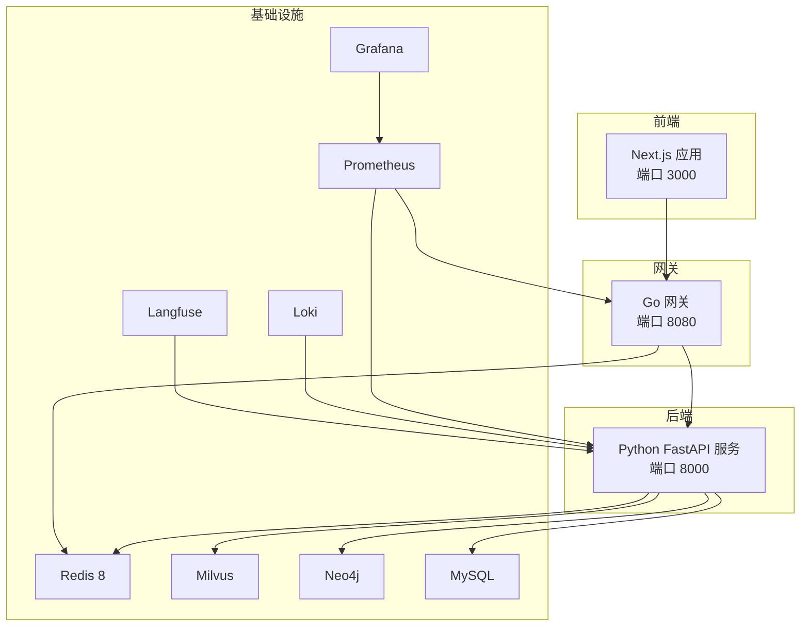
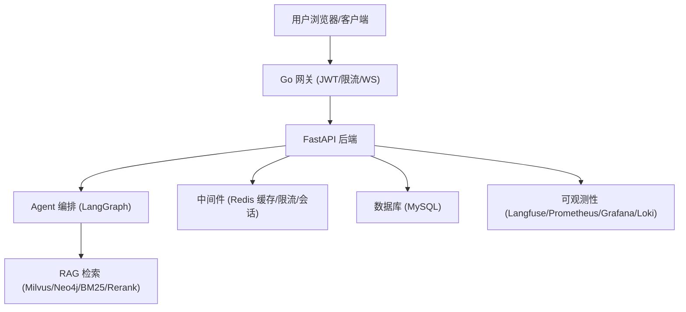
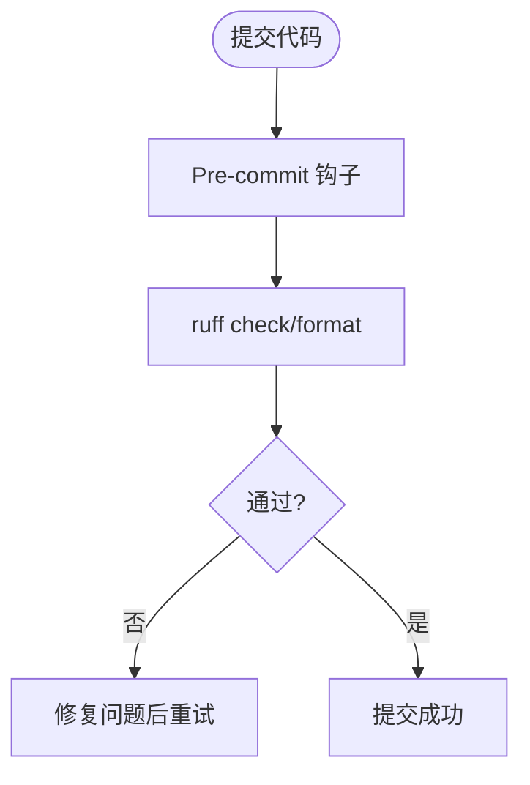
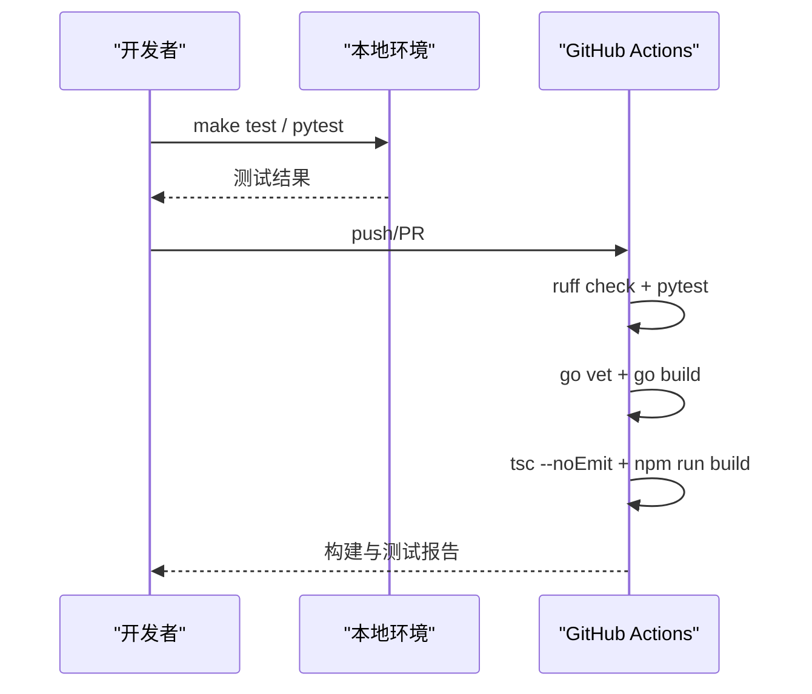
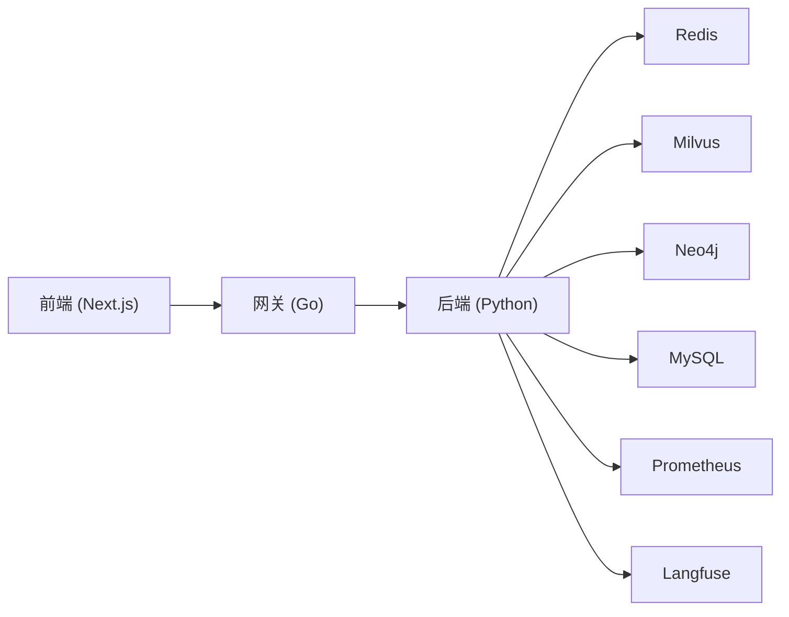

# 开发指南

<cite>
**本文引用的文件**   
- [README.md](file://README.md)
- [Makefile](file://Makefile)
- [backend_design/pyproject.toml](file://backend_design/pyproject.toml)
- [backend_design/requirements.txt](file://backend_design/requirements.txt)
- [frontend_design/package.json](file://frontend_design/package.json)
- [frontend_design/tsconfig.json](file://frontend_design/tsconfig.json)
- [frontend_design/tailwind.config.ts](file://frontend_design/tailwind.config.ts)
- [backend_design/nexus_gate/go.mod](file://backend_design/nexus_gate/go.mod)
- [.pre-commit-config.yaml](file://.pre-commit-config.yaml)
- [.github/workflows/ci.yml](file://.github/workflows/ci.yml)
- [docker-compose.yml](file://docker-compose.yml)
- [backend_design/tests/test_v21.py](file://backend_design/tests/test_v21.py)
</cite>

## 目录
1. [简介](#简介)
2. [项目结构](#项目结构)
3. [核心组件](#核心组件)
4. [架构总览](#架构总览)
5. [详细组件分析](#详细组件分析)
6. [依赖分析](#依赖分析)
7. [性能与质量](#性能与质量)
8. [故障排查指南](#故障排查指南)
9. [结论](#结论)
10. [附录](#附录)

## 简介
本指南面向 NexusCockpit 的新贡献者与日常开发者，提供从环境搭建、依赖管理、代码规范、测试策略、Git 工作流到调试与性能分析的完整开发流程说明。NexusCockpit 是一个企业级车载语音 Agent 项目，采用多语言栈（Python + Go + TypeScript），并集成 Multi-Agent、GraphRAG、MCP、Redis 语义缓存、Prometheus/Grafana/Loki/Langfuse 可观测性等能力。

## 项目结构
仓库采用“后端 Python + Go 网关 + 前端 Next.js”的三端分离结构，配合 Docker Compose 一键拉起中间件与基础设施。

- 后端服务：backend_design/nexus（FastAPI + LangGraph + RAG + ASR/TTS）
- 并发网关：backend_design/nexus_gate（Go Gin + JWT + WebSocket Hub）
- 前端应用：frontend_design（Next.js App Router + Zustand + Tailwind）
- 基础设施：docker-compose.yml（Milvus、Neo4j、Redis、MySQL、Langfuse、Prometheus、Grafana、Loki）
- 工程化：Makefile、CI、Pre-commit、pyproject.toml、package.json、go.mod

```mermaid
graph TB
subgraph "前端"
FE["Next.js 应用<br/>端口 3000"]
end
subgraph "网关"
GW["Go 网关<br/>端口 8080"]
end
subgraph "后端"
PY["Python FastAPI 服务<br/>端口 8000"]
end
subgraph "基础设施"
REDIS["Redis 8"]
MILVUS["Milvus"]
NEO4J["Neo4j"]
MYSQL["MySQL"]
PROM["Prometheus"]
GRAF["Grafana"]
LOKI["Loki"]
LF["Langfuse"]
end
FE --> GW
GW --> PY
PY --> REDIS
PY --> MILVUS
PY --> NEO4J
PY --> MYSQL
GW --> REDIS
PROM --> PY
PROM --> GW
GRAF --> PROM
LOKI --> PY
LF --> PY
```

图表来源
- [docker-compose.yml:1-292](file://docker-compose.yml#L1-L292)
- [README.md:144-320](file://README.md#L144-L320)

章节来源
- [README.md:144-320](file://README.md#L144-L320)
- [docker-compose.yml:1-292](file://docker-compose.yml#L1-L292)

## 核心组件
- 后端（Python）
  - Web 框架：FastAPI + Uvicorn
  - Agent 编排：LangGraph（Supervisor + 专家节点 + Responder + Reflection + Reviewer）
  - RAG：Milvus（向量）、Neo4j（图谱）、BM25（全文）三路融合 + Rerank
  - 中间件：Redis 语义缓存、限流、会话存储
  - 数据库：aiomysql（异步 MySQL）
  - 可观测性：Langfuse、Prometheus、structlog
  - 配置：Pydantic Settings + python-dotenv
- 网关（Go）
  - 路由与鉴权：Gin + JWT
  - 实时通信：gorilla/websocket Hub
  - 指标：prometheus/client_golang
- 前端（TypeScript/Next.js）
  - 页面与组件：App Router、Tailwind CSS
  - 状态管理：Zustand
  - API 调用：axios
  - 类型检查：tsc（strict）

章节来源
- [backend_design/pyproject.toml:1-135](file://backend_design/pyproject.toml#L1-L135)
- [backend_design/requirements.txt:1-105](file://backend_design/requirements.txt#L1-L105)
- [backend_design/nexus_gate/go.mod:1-44](file://backend_design/nexus_gate/go.mod#L1-L44)
- [frontend_design/package.json:1-43](file://frontend_design/package.json#L1-L43)

## 架构总览
系统遵循 7 层分层架构，前后端通过 Go 网关聚合与鉴权，后端承载 AI 能力与数据检索，基础设施由 Docker Compose 统一编排。

```mermaid
graph TB
A["用户浏览器/客户端"] --> B["Go 网关 (JWT/限流/WS)"]
B --> C["FastAPI 后端"]
C --> D["Agent 编排 (LangGraph)"]
D --> E["RAG 检索 (Milvus/Neo4j/BM25/Rerank)"]
C --> F["中间件 (Redis 缓存/限流/会话)"]
C --> G["数据库 (MySQL)"]
C --> H["可观测性 (Langfuse/Prometheus/Grafana/Loki)"]
```

图表来源
- [README.md:369-440](file://README.md#L369-L440)
- [docker-compose.yml:1-292](file://docker-compose.yml#L1-L292)

## 详细组件分析

### 开发环境与依赖管理
- 环境要求
  - Python >= 3.10；Go >= 1.21；Node.js >= 18；Docker >= 24；Docker Compose >= 2.20；Git >= 2.30
- 安装与启动
  - 使用 Makefile 统一命令：install、install-frontend、install-gateway、dev、dev-frontend、dev-all、docker-up、init-db、lint、test、build-gateway 等
  - 前端依赖通过 npm install 安装，脚本定义在 package.json
  - Go 网关依赖 go mod download
- 模型下载
  - ASR（SenseVoice）、TTS（CosyVoice）、声纹（CAM++）等模型需按 README 指引下载至 models 目录

章节来源
- [README.md:144-240](file://README.md#L144-L240)
- [Makefile:1-173](file://Makefile#L1-L173)
- [frontend_design/package.json:1-43](file://frontend_design/package.json#L1-L43)
- [backend_design/nexus_gate/go.mod:1-44](file://backend_design/nexus_gate/go.mod#L1-L44)

### 代码规范与 Linting
- Python
  - 使用 ruff 进行 lint 与格式化，配置位于 pyproject.toml
  - 支持 mypy 类型检查（本地全量环境运行）
- Go
  - 使用 go vet 进行静态检查
- TypeScript
  - ESLint（next lint）+ tsc --noEmit 类型检查
- Pre-commit
  - 提交前自动执行 ruff 与 ruff-format（仅 backend_design）

```mermaid
flowchart TD
Start(["提交代码"]) --> CheckPC["Pre-commit 钩子"]
CheckPC --> RunRuff["ruff check/format"]
RunRuff --> Pass{"通过?"}
Pass --> |否| Fix["修复问题后重试"]
Pass --> |是| Commit["提交成功"]
```

图表来源
- [.pre-commit-config.yaml:1-10](file://.pre-commit-config.yaml#L1-L10)
- [backend_design/pyproject.toml:111-123](file://backend_design/pyproject.toml#L111-L123)
- [Makefile:122-147](file://Makefile#L122-L147)

章节来源
- [backend_design/pyproject.toml:111-123](file://backend_design/pyproject.toml#L111-L123)
- [frontend_design/tsconfig.json:1-24](file://frontend_design/tsconfig.json#L1-L24)
- [.pre-commit-config.yaml:1-10](file://.pre-commit-config.yaml#L1-L10)

### 测试策略
- 单元测试（Python）
  - 使用 pytest，异步模式 auto，测试路径 tests
  - 示例覆盖 CockpitManager 与 TenantContext 的多座舱上下文隔离
- 集成测试（建议）
  - 基于 docker-compose 启动中间件后，对 Redis/Milvus/Neo4j/MySQL 进行端到端验证
- 前端测试（建议）
  - 使用 Jest/React Testing Library（按需引入）
- CI
  - GitHub Actions 对后端（ruff + pytest）、网关（go vet + build）、前端（tsc + build）进行校验

```mermaid
sequenceDiagram
participant Dev as "开发者"
participant Local as "本地环境"
participant CI as "GitHub Actions"
Dev->>Local : make test / pytest
Local-->>Dev : 测试结果
Dev->>CI : push/PR
CI->>CI : ruff check + pytest
CI->>CI : go vet + go build
CI->>CI : tsc --noEmit + npm run build
CI-->>Dev : 构建与测试报告
```

图表来源
- [backend_design/tests/test_v21.py:1-219](file://backend_design/tests/test_v21.py#L1-L219)
- [.github/workflows/ci.yml:1-72](file://.github/workflows/ci.yml#L1-L72)
- [Makefile:153-161](file://Makefile#L153-L161)

章节来源
- [backend_design/tests/test_v21.py:1-219](file://backend_design/tests/test_v21.py#L1-L219)
- [.github/workflows/ci.yml:1-72](file://.github/workflows/ci.yml#L1-L72)
- [Makefile:153-161](file://Makefile#L153-L161)

### Git 工作流程与分支管理
- 推荐分支模型
  - main：稳定发布分支
  - develop：集成开发分支
  - feature/*：功能分支
  - fix/*：缺陷修复分支
- 提交规范
  - 使用语义化提交信息（如 feat/fix/docs/chore）
  - 提交前执行 lint/format/check
- 代码审查
  - 通过 Pull Request 发起审查，CI 通过后合并

章节来源
- [README.md:512-522](file://README.md#L512-L522)
- [.github/workflows/ci.yml:1-72](file://.github/workflows/ci.yml#L1-L72)

### 调试技巧与常用工具
- 后端调试
  - 使用 uvicorn 的 --reload 热重载
  - 日志：structlog + Loki；健康检查 /health
- 网关调试
  - 直接 go run cmd/main.go；查看 .env.local 中的 JWT 密钥一致性
- 前端调试
  - next dev 启动，浏览器开发者工具、Network 面板观察 SSE/WebSocket
- 可观测性
  - Prometheus 抓取指标，Grafana 可视化看板，Langfuse 追踪 LLM 调用链

章节来源
- [README.md:242-320](file://README.md#L242-L320)
- [docker-compose.yml:1-292](file://docker-compose.yml#L1-L292)

### 添加新功能（示例流程）
- 新增后端接口
  - 在对应模块下新增路由与逻辑，确保 Pydantic 模型与异常处理完善
  - 编写单元测试，覆盖正常与异常路径
  - 更新文档与 OpenAPI（如有需要）
- 新增网关路由
  - 在 Go 网关中注册路由，复用 JWT 鉴权与限流中间件
- 新增前端页面/组件
  - 在 src/app 或 src/components 下创建页面与组件，使用 Zustand 管理状态
  - 通过 axios 调用后端 API，处理错误与加载态

章节来源
- [Makefile:122-147](file://Makefile#L122-L147)
- [backend_design/pyproject.toml:1-135](file://backend_design/pyproject.toml#L1-L135)
- [frontend_design/package.json:1-43](file://frontend_design/package.json#L1-L43)

### 修复 Bug（示例流程）
- 定位问题
  - 使用日志与链路追踪（Langfuse）定位根因
- 最小化复现
  - 编写单测用例复现问题
- 修复与回归
  - 修复后运行 lint/format/check，确保无副作用
  - 补充测试用例防止回归

章节来源
- [backend_design/tests/test_v21.py:1-219](file://backend_design/tests/test_v21.py#L1-L219)
- [.github/workflows/ci.yml:1-72](file://.github/workflows/ci.yml#L1-L72)

### 提交代码（示例流程）
- 拉取最新 develop 分支
- 创建特性分支 feature/xxx
- 编码并提交（遵循提交规范）
- 推送并发起 PR，等待 CI 与审查通过

章节来源
- [README.md:512-522](file://README.md#L512-L522)

## 依赖分析
- Python 依赖
  - Web：fastapi、uvicorn、starlette、websockets
  - Agent：langchain-openai、langgraph、langgraph-checkpoint-sqlite
  - RAG：pymilvus、neo4j、sentence-transformers、langchain-community
  - 中间件：redis、aiomysql
  - 可观测性：langfuse、prometheus-client、structlog
  - 音频：funasr、modelscope、torchaudio、librosa、soundfile、pydub
- Go 依赖
  - gin、golang-jwt/jwt/v5、gorilla/websocket、prometheus/client_golang
- 前端依赖
  - next、react、zustand、axios、tailwindcss、eslint、typescript

```mermaid
graph LR
FE["前端 (Next.js)"] --> GW["网关 (Go)"]
GW --> PY["后端 (Python)"]
PY --> REDIS["Redis"]
PY --> MILVUS["Milvus"]
PY --> NEO4J["Neo4j"]
PY --> MYSQL["MySQL"]
PY --> PROM["Prometheus"]
PY --> LF["Langfuse"]
```

图表来源
- [backend_design/pyproject.toml:1-135](file://backend_design/pyproject.toml#L1-L135)
- [backend_design/nexus_gate/go.mod:1-44](file://backend_design/nexus_gate/go.mod#L1-L44)
- [frontend_design/package.json:1-43](file://frontend_design/package.json#L1-L43)

章节来源
- [backend_design/pyproject.toml:1-135](file://backend_design/pyproject.toml#L1-L135)
- [backend_design/nexus_gate/go.mod:1-44](file://backend_design/nexus_gate/go.mod#L1-L44)
- [frontend_design/package.json:1-43](file://frontend_design/package.json#L1-L43)

## 性能与质量
- 性能优化
  - 使用 Redis 语义缓存减少重复计算与 I/O
  - GraphRAG 三路融合 + Rerank 提升检索质量与效率
  - Go 网关高并发低内存，WebSocket Hub 支持实时通信
- 内存泄漏检测
  - Python：结合 memory_profiler 与 pprof（如适用）
  - Go：pprof 与 go tool trace
  - 前端：Chrome Performance 面板与 React DevTools Profiler
- 代码质量检查
  - Python：ruff + mypy + pytest-cov
  - Go：go vet + go build
  - TypeScript：eslint + tsc --noEmit

章节来源
- [Makefile:122-161](file://Makefile#L122-L161)
- [.github/workflows/ci.yml:1-72](file://.github/workflows/ci.yml#L1-L72)

## 故障排查指南
- 常见问题
  - JWT 不一致导致 401：确保网关与后端使用相同 JWT_SECRET_KEY
  - 端口冲突：Windows Hyper-V 保留端口避让，参考 docker-compose.yml 端口映射
  - 模型未下载：按 README 指引下载 ASR/TTS/Embedding/Reranker 模型
- 诊断步骤
  - 检查各服务健康端点（/health）
  - 查看容器日志（docker compose logs）
  - 使用 Prometheus/Grafana 查看指标与告警
  - 使用 Langfuse 追踪 LLM 调用链

章节来源
- [README.md:242-320](file://README.md#L242-L320)
- [docker-compose.yml:1-292](file://docker-compose.yml#L1-L292)

## 结论
本指南提供了 NexusCockpit 从环境搭建、依赖管理、代码规范、测试策略、Git 工作流到调试与性能分析的完整开发流程。遵循本文档与实践，新贡献者可快速上手并高效参与项目开发与维护。

## 附录
- 常用命令速查
  - 安装依赖：make install、make install-frontend、make install-gateway
  - 启动服务：make dev、make dev-frontend、make dev-all
  - 基础设施：make docker-up、make docker-down、make docker-logs
  - 初始化数据库：make init-db
  - 代码质量：make lint、make format、make check
  - 测试：make test、make test-cov
  - 构建网关：make build-gateway

章节来源
- [Makefile:1-173](file://Makefile#L1-L173)