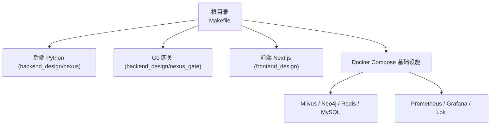
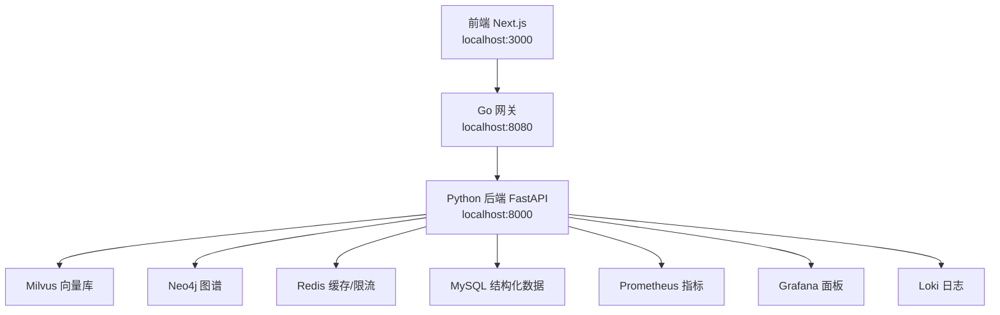
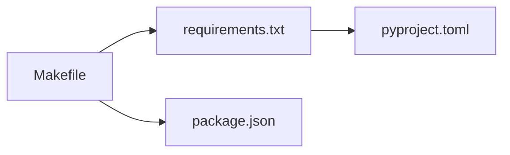

# 开发环境搭建

<cite>
**本文引用的文件**   
- [README.md](file://README.md)
- [Makefile](file://Makefile)
- [.env.example](file://.env.example)
- [backend_design/requirements.txt](file://backend_design/requirements.txt)
- [backend_design/pyproject.toml](file://backend_design/pyproject.toml)
- [frontend_design/package.json](file://frontend_design/package.json)
- [docs/deployment/SETUP.md](file://docs/deployment/SETUP.md)
- [docs/deployment/LLM_FALLBACK.md](file://docs/deployment/LLM_FALLBACK.md)
</cite>

## 目录
1. [简介](#简介)
2. [项目结构](#项目结构)
3. [核心组件](#核心组件)
4. [架构总览](#架构总览)
5. [详细组件分析](#详细组件分析)
6. [依赖关系分析](#依赖关系分析)
7. [性能与资源建议](#性能与资源建议)
8. [故障排查指南](#故障排查指南)
9. [结论](#结论)
10. [附录：IDE 推荐配置](#附录ide-推荐配置)

## 简介
本指南面向本地开发者，提供 NexusCockpit 的完整开发环境搭建流程。内容涵盖 Python 虚拟环境创建、CPU/GPU 依赖安装、前端依赖安装；Makefile 命令说明；环境变量配置（.env）；以及常见环境问题排查。同时给出 IDE 推荐配置，帮助快速进入开发状态。

## 项目结构
NexusCockpit 采用前后端分离与多语言协作：
- 后端 Python 服务位于 backend_design/nexus，使用 FastAPI + LangGraph 等框架
- Go 并发网关位于 backend_design/nexus_gate
- 前端 Next.js 应用位于 frontend_design
- 基础设施通过 Docker Compose 编排（Milvus、Neo4j、Redis、MySQL、Prometheus、Grafana、Loki）
- 根目录 Makefile 统一封装常用开发任务

图表来源
- [Makefile:1-139](file://Makefile#L1-L139)
- [README.md:95-140](file://README.md#L95-L140)

章节来源
- [README.md:95-140](file://README.md#L95-L140)
- [Makefile:1-139](file://Makefile#L1-L139)

## 核心组件
- 后端 Python 服务：FastAPI + LangGraph + GraphRAG + ASR/TTS + 中间件（缓存、限流、会话、异步队列）
- Go 网关：JWT 鉴权、优先级限流、WebSocket Hub、反向代理
- 前端：Next.js 14 App Router，集成 Zustand、Tailwind、Recharts、Three.js 可视化
- 基础设施：向量库 Milvus、图数据库 Neo4j、缓存 Redis、关系型 MySQL、可观测性 Prometheus/Grafana/Loki

章节来源
- [README.md:14-33](file://README.md#L14-L33)
- [backend_design/pyproject.toml:10-56](file://backend_design/pyproject.toml#L10-L56)
- [frontend_design/package.json:12-43](file://frontend_design/package.json#L12-L43)

## 架构总览
下图展示本地开发时各组件交互关系：前端通过网关访问后端 API，后端连接中间件与模型服务，可观测性采集指标与日志。

图表来源
- [README.md:310-318](file://README.md#L310-L318)
- [docs/deployment/SETUP.md:145-190](file://docs/deployment/SETUP.md#L145-L190)

## 详细组件分析

### 一、本地开发环境搭建步骤

#### 1. 前置要求
- Python 3.10+
- Go 1.21+（仅运行或调试 Go 网关时需要）
- Node.js 18+（前端开发）
- Docker 24+ 与 Docker Compose 2.20+（基础设施）
- Git 2.30+

章节来源
- [README.md:148-158](file://README.md#L148-L158)
- [docs/deployment/SETUP.md:22-48](file://docs/deployment/SETUP.md#L22-L48)

#### 2. 克隆仓库
- 使用 Git 克隆项目到本地工作区

章节来源
- [README.md:159-164](file://README.md#L159-L164)

#### 3. 启动基础设施（Docker）
- 一键启动所有中间件并验证状态
- 如需清理数据，使用 down -v（谨慎操作）

章节来源
- [README.md:166-179](file://README.md#L166-L179)
- [docs/deployment/SETUP.md:145-190](file://docs/deployment/SETUP.md#L145-L190)

#### 4. 创建 Python 虚拟环境
- Windows PowerShell 示例：
  - python -m venv .venv
  - .\.venv\Scripts\Activate.ps1
- Linux/macOS 示例：
  - python3 -m venv .venv
  - source .venv/bin/activate
- 验证 Python/pip 指向虚拟环境

章节来源
- [docs/deployment/SETUP.md:51-90](file://docs/deployment/SETUP.md#L51-L90)

#### 5. 安装 Python 依赖（CPU/GPU）
- CPU 版本 PyTorch：
  - pip install torch torchaudio --index-url https://download.pytorch.org/whl/cpu
- GPU 版本 PyTorch（CUDA 12.1/12.8）：
  - pip install torch torchaudio --index-url https://download.pytorch.org/whl/cu121
  - 或 cu128（以 pytorch.org 最新为准）
- 安装项目依赖：
  - pip install -r backend_design/requirements.txt
  - 或使用 pyproject 开发模式：pip install -e ".[dev]"
- 验证核心依赖导入

章节来源
- [docs/deployment/SETUP.md:94-141](file://docs/deployment/SETUP.md#L94-L141)
- [backend_design/requirements.txt:1-99](file://backend_design/requirements.txt#L1-L99)
- [backend_design/pyproject.toml:58-66](file://backend_design/pyproject.toml#L58-L66)

#### 6. 下载 AI 模型
- SenseVoice ASR、CAM++ 声纹、CosyVoice TTS 模型需下载到 models 目录
- CosyVoice 约 3.5GB，确保磁盘空间充足
- 可选：本地 LLM 降级模型（Qwen GGUF），用于 llama.cpp 服务

章节来源
- [README.md:200-216](file://README.md#L200-L216)
- [docs/deployment/SETUP.md:193-301](file://docs/deployment/SETUP.md#L193-L301)
- [docs/deployment/LLM_FALLBACK.md:20-47](file://docs/deployment/LLM_FALLBACK.md#L20-L47)

#### 7. 配置环境变量（.env）
- 复制模板：cp .env.example .env
- 必填项包括 ARK_API_KEY、TAVILY_API_KEY 等
- 双模式开关：VECTOR_STORE_PROVIDER、GRAPH_STORE_PROVIDER、CACHE_PROVIDER、RERANKER_PROVIDER
- 路径配置默认相对项目根目录，通常无需修改
- 可选启用 Langfuse 追踪、本地 LLM 降级等

章节来源
- [README.md:218-247](file://README.md#L218-L247)
- [.env.example:1-194](file://.env.example#L1-L194)
- [docs/deployment/SETUP.md:304-357](file://docs/deployment/SETUP.md#L304-L357)

#### 8. 初始化数据库
- 初始化 Milvus 集合与 Neo4j 约束/索引
- 可选导入食物数据

章节来源
- [docs/deployment/SETUP.md:360-390](file://docs/deployment/SETUP.md#L360-L390)

#### 9. 启动服务
- 后端开发模式：
  - cd backend_design && python -m nexus.main
  - 或使用 uvicorn：uvicorn nexus.main:app --host 0.0.0.0 --port 8000 --reload
- Go 网关：
  - cd backend_design/nexus_gate && go run cmd/main.go
  - 或编译后运行：go build -o nexus_gate cmd/main.go && ./nexus_gate --env ../.env
- 前端开发模式：
  - cd frontend_design && npm run dev

章节来源
- [README.md:249-306](file://README.md#L249-L306)
- [docs/deployment/SETUP.md:393-414](file://docs/deployment/SETUP.md#L393-L414)

#### 10. 访问应用与服务
- 前端界面：http://localhost:3000/cockpit
- API 文档：http://localhost:8000/docs
- 健康检查：http://localhost:8000/health、http://localhost:8080/health
- Grafana：http://localhost:3001（admin/admin）
- Prometheus：http://localhost:9090

章节来源
- [README.md:310-318](file://README.md#L310-L318)

### 二、Makefile 命令详解
- help：显示可用目标与简要说明
- install：创建虚拟环境并安装 CPU 版 PyTorch 及后端依赖
- install-gpu：创建虚拟环境并安装 GPU 版 PyTorch 及后端依赖
- install-frontend：安装前端依赖
- install-all：同时安装后端与前端依赖
- dev：启动后端开发服务（在 backend_design 下执行入口）
- dev-frontend：启动前端开发服务
- dev-all：提示在两个终端分别运行 dev 与 dev-frontend
- docker-up：启动基础设施
- docker-down：停止基础设施
- docker-logs：查看基础设施日志
- docker-clean：停止并删除数据卷（谨慎）
- init-db：初始化 Milvus 与 Neo4j
- lint/format/check：代码质量检查与格式化
- test/test-cov：运行测试与覆盖率报告
- clean：清理构建产物与缓存

章节来源
- [Makefile:18-139](file://Makefile#L18-L139)

### 三、环境变量配置要点
- LLM/Embedding：ARK_API_KEY、ARK_BASE_URL、LLM_MODEL、EMBEDDING_MODEL、EMBEDDING_DIM
- 中间件 Provider 切换：VECTOR_STORE_PROVIDER、GRAPH_STORE_PROVIDER、CACHE_PROVIDER、RERANKER_PROVIDER
- 中间件地址与凭据：MILVUS_*、NEO4J_*、REDIS_*
- 搜索与追踪：TAVILY_API_KEY、LANGFUSE_*
- JWT 认证：JWT_SECRET_KEY、JWT_ALGORITHM、JWT_EXPIRE_MINUTES
- 车控适配器：VEHICLE_ADAPTER（mock/http）
- 模型路径：FUNASR_MODEL_PATH、CAM_MODEL_PATH、COSYVOICE_MODEL_PATH
- 数据目录：FOOD_DATA_DIR、KNOWLEDGE_DATA_DIR、UPLOAD_DIR、TEMP_DIR、PREFERENCES_DIR
- 服务器参数：HOST、PORT、DEBUG、LOG_LEVEL
- 语义缓存：SEMANTIC_CACHE_ENABLED、SIMILARITY_THRESHOLD、TTL_SECONDS
- LLM 降级：LLM_FALLBACK_ENABLED、LLM_FALLBACK_BASE_URL、LLM_FALLBACK_MODEL、LLM_FALLBACK_TIMEOUT

章节来源
- [.env.example:13-194](file://.env.example#L13-L194)
- [docs/deployment/SETUP.md:304-357](file://docs/deployment/SETUP.md#L304-L357)
- [docs/deployment/LLM_FALLBACK.md:49-58](file://docs/deployment/LLM_FALLBACK.md#L49-L58)

### 四、前端依赖安装与脚本
- 安装依赖：npm install
- 开发模式：npm run dev（端口 3000）
- 构建与生产启动：npm run build、npm start
- 类型检查：npm run type-check

章节来源
- [frontend_design/package.json:5-11](file://frontend_design/package.json#L5-L11)
- [frontend_design/package.json:12-43](file://frontend_design/package.json#L12-L43)

## 依赖关系分析
- 后端依赖集中在 requirements.txt 与 pyproject.toml，包含 Web 框架、Agent/RAG、中间件、音视频、可观测性与工具链
- 前端依赖集中在 package.json，包含 Next.js、UI 与可视化库
- Makefile 将环境准备与开发任务标准化，降低上手门槛

图表来源
- [backend_design/requirements.txt:1-99](file://backend_design/requirements.txt#L1-L99)
- [backend_design/pyproject.toml:10-56](file://backend_design/pyproject.toml#L10-L56)
- [frontend_design/package.json:12-43](file://frontend_design/package.json#L12-L43)
- [Makefile:36-54](file://Makefile#L36-L54)

章节来源
- [backend_design/requirements.txt:1-99](file://backend_design/requirements.txt#L1-L99)
- [backend_design/pyproject.toml:10-56](file://backend_design/pyproject.toml#L10-L56)
- [frontend_design/package.json:12-43](file://frontend_design/package.json#L12-L43)
- [Makefile:36-54](file://Makefile#L36-L54)

## 性能与资源建议
- CPU 推理：无 GPU 也可运行，但语音处理与模型加载较慢
- GPU 加速：建议 8GB+ 显存，安装 CUDA 12.x 并使用 GPU 版 PyTorch
- 内存与磁盘：推荐 16GB+ 内存，50GB+ 磁盘（含模型文件）
- 并发与吞吐：生产环境可通过 uvicorn workers 提升并发能力

章节来源
- [docs/deployment/SETUP.md:40-48](file://docs/deployment/SETUP.md#L40-L48)
- [docs/deployment/SETUP.md:110-121](file://docs/deployment/SETUP.md#L110-L121)
- [docs/deployment/SETUP.md:410-414](file://docs/deployment/SETUP.md#L410-L414)

## 故障排查指南
- Docker 启动失败：检查 Docker 运行状态与端口占用
- Milvus 连接失败：查看容器日志，等待完全启动
- 模型加载失败：确认模型文件存在且路径正确
- GPU 不可用：检查 CUDA 驱动与 nvidia-smi
- 虚拟环境激活失败（Windows PowerShell）：调整执行策略后重新激活
- pip 安装超时：使用国内镜像源

章节来源
- [docs/deployment/SETUP.md:464-527](file://docs/deployment/SETUP.md#L464-L527)

## 结论
通过以上步骤，你可以在本地完成 NexusCockpit 的完整开发环境搭建，包括后端、前端与基础设施。借助 Makefile 与环境变量，可以灵活切换 CPU/GPU、本地/云端中间件，并快速定位常见问题。建议在开发中结合可观测性工具进行问题诊断与性能优化。

## 附录：IDE 推荐配置
- VS Code 插件推荐
  - Python：支持虚拟环境识别、Lint、Type Check、测试
  - Go：支持 Go 语言工具链、调试、格式化
  - ESLint/Prettier：前端代码规范与格式化
  - Tailwind CSS IntelliSense：样式类名补全
  - Docker：容器管理与 Compose 支持
- Python 工具链
  - 使用 venv 管理依赖，配合 ruff/mypy/pytest
- Go 工具链
  - 使用 go mod 管理模块，go build/run 调试
- TypeScript/Next.js
  - 使用 tsc 类型检查，ESLint 校验，npm scripts 统一命令

章节来源
- [backend_design/pyproject.toml:58-66](file://backend_design/pyproject.toml#L58-L66)
- [frontend_design/package.json:33-43](file://frontend_design/package.json#L33-L43)