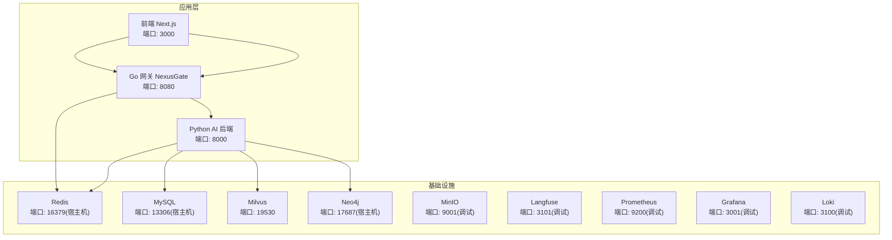
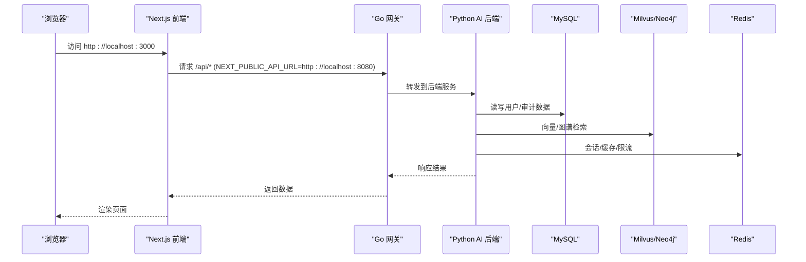
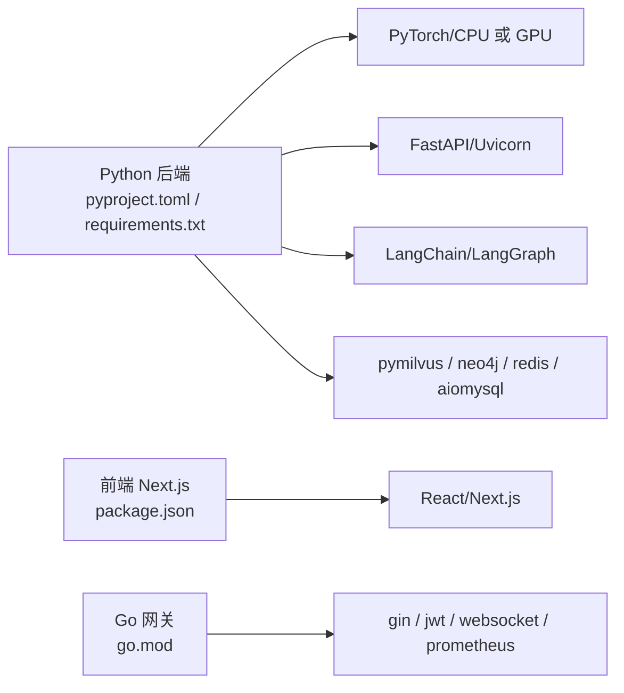

# 开发环境搭建

<cite>
**本文引用的文件**   
- [Makefile](file://Makefile)
- [docker-compose.yml](file://docker-compose.yml)
- [docker-compose.dev.yml](file://docker-compose.dev.yml)
- [backend_design/Dockerfile](file://backend_design/Dockerfile)
- [frontend_design/Dockerfile](file://frontend_design/Dockerfile)
- [backend_design/nexus_gate/Dockerfile](file://backend_design/nexus_gate/Dockerfile)
- [backend_design/pyproject.toml](file://backend_design/pyproject.toml)
- [backend_design/requirements.txt](file://backend_design/requirements.txt)
- [frontend_design/package.json](file://frontend_design/package.json)
- [backend_design/nexus_gate/go.mod](file://backend_design/nexus_gate/go.mod)
- [scripts/start-backend.ps1](file://scripts/start-backend.ps1)
- [scripts/start-frontend.ps1](file://scripts/start-frontend.ps1)
- [scripts/start-gateway.ps1](file://scripts/start-gateway.ps1)
- [backend_design/scripts/init_milvus.py](file://backend_design/scripts/init_milvus.py)
- [backend_design/scripts/init_neo4j.py](file://backend_design/scripts/init_neo4j.py)
</cite>

## 目录
1. [简介](#简介)
2. [项目结构](#项目结构)
3. [核心组件](#核心组件)
4. [架构总览](#架构总览)
5. [详细组件分析](#详细组件分析)
6. [依赖关系分析](#依赖关系分析)
7. [性能注意事项](#性能注意事项)
8. [故障排查指南](#故障排查指南)
9. [结论](#结论)
10. [附录](#附录)

## 简介
本指南面向首次接触 NexusCockpit 的开发者，目标是帮助你在本地快速搭建完整的开发环境。内容涵盖：
- Python 虚拟环境的创建与依赖安装（CPU/GPU 版 PyTorch）
- 前端 Next.js 项目的依赖管理与构建流程
- Go 网关的依赖下载与编译配置
- Docker 基础设施服务的启动与管理命令
- 环境变量配置、数据库初始化步骤
- 常见环境问题与解决方案
- Makefile 常用命令速查（install、dev、test、lint 等）

## 项目结构
NexusCockpit 采用多语言、多服务架构：
- 后端 Python AI 服务（FastAPI + Uvicorn）
- 前端 Next.js Web 应用
- Go API 网关（NexusGate）
- 中间件与数据服务（Redis、MySQL、Milvus、Neo4j、MinIO、Langfuse、Prometheus、Grafana、Loki）

```mermaid
graph TB
subgraph "应用层"
FE["前端 Next.js<br/>端口: 3000"]
GW["Go 网关 NexusGate<br/>端口: 8080"]
PY["Python AI 后端<br/>端口: 8000"]
end
subgraph "基础设施"
REDIS["Redis<br/>端口: 16379(宿主机)"]
MYSQL["MySQL<br/>端口: 13306(宿主机)"]
MILVUS["Milvus<br/>端口: 19530"]
NEO4J["Neo4j<br/>端口: 17687(宿主机)"]
MINIO["MinIO<br/>端口: 9001(调试)"]
LANGFUSE["Langfuse<br/>端口: 3101(调试)"]
PROM["Prometheus<br/>端口: 9200(调试)"]
GRAF["Grafana<br/>端口: 3001(调试)"]
LOKI["Loki<br/>端口: 3100(调试)"]
end
FE --> GW
GW --> PY
PY --> REDIS
PY --> MYSQL
PY --> MILVUS
PY --> NEO4J
GW --> REDIS
FE --> GW
```

图表来源
- [docker-compose.yml:1-292](file://docker-compose.yml#L1-L292)
- [docker-compose.dev.yml:1-63](file://docker-compose.dev.yml#L1-L63)

章节来源
- [Makefile:1-173](file://Makefile#L1-L173)
- [docker-compose.yml:1-292](file://docker-compose.yml#L1-L292)

## 核心组件
- 后端 Python AI 服务：基于 FastAPI/Uvicorn，提供 REST/WebSocket/MCP 接口，集成 RAG、Agent、ASR/TTS、可观测性等能力。
- 前端 Next.js：提供管理控制台、聊天界面、车辆控制面板等页面。
- Go 网关：统一入口，鉴权、限流、代理到后端，暴露 WebSocket 通道。
- 数据与中间件：Redis（缓存/限流/会话）、MySQL（用户数据/审计日志）、Milvus（向量检索）、Neo4j（知识图谱）、MinIO（对象存储）、Langfuse（LLM 追踪）、Prometheus/Grafana/Loki（监控与日志）。

章节来源
- [backend_design/pyproject.toml:1-135](file://backend_design/pyproject.toml#L1-L135)
- [backend_design/requirements.txt:1-105](file://backend_design/requirements.txt#L1-L105)
- [frontend_design/package.json:1-43](file://frontend_design/package.json#L1-L43)
- [backend_design/nexus_gate/go.mod:1-44](file://backend_design/nexus_gate/go.mod#L1-L44)

## 架构总览
下图展示了从浏览器到各服务的调用链路与依赖关系，以及开发模式下的端口映射。

```mermaid
sequenceDiagram
participant Browser as "浏览器"
participant FE as "Next.js 前端"
participant GW as "Go 网关"
participant PY as "Python AI 后端"
participant DB as "MySQL"
participant VDB as "Milvus/Neo4j"
participant Cache as "Redis"
Browser->>FE : 访问 http : //localhost : 3000
FE->>GW : 请求 /api/* (NEXT_PUBLIC_API_URL=http : //localhost : 8080)
GW->>PY : 转发到后端服务
PY->>DB : 读写用户/审计数据
PY->>VDB : 向量/图谱检索
PY->>Cache : 会话/缓存/限流
PY-->>GW : 响应结果
GW-->>FE : 返回数据
FE-->>Browser : 渲染页面
```

图表来源
- [docker-compose.yml:1-292](file://docker-compose.yml#L1-L292)
- [frontend_design/package.json:1-43](file://frontend_design/package.json#L1-L43)

## 详细组件分析

### Python 后端环境搭建（含 CPU/GPU PyTorch）
- 使用 Makefile 一键创建虚拟环境并安装依赖：
  - CPU 版本：make install
  - GPU 版本（CUDA 12.1）：make install-gpu
- 也可手动操作：
  - 创建 venv：python -m venv .venv
  - 激活 venv（Windows）：.venv\Scripts\activate
  - 安装 PyTorch（CPU）：pip install torch torchaudio --index-url https://download.pytorch.org/whl/cpu
  - 安装 PyTorch（GPU cu121）：pip install torch torchaudio --index-url https://download.pytorch.org/whl/cu121
  - 安装其他依赖：pip install -r backend_design/requirements.txt
- 运行后端：
  - 直接运行：make dev
  - 带日志捕获（PowerShell）：make dev-log

注意：
- requirements.txt 中明确说明需先单独安装 PyTorch，再安装其余依赖。
- pyproject.toml 声明了 Python>=3.10 及主要依赖版本范围。

章节来源
- [Makefile:38-50](file://Makefile#L38-L50)
- [backend_design/requirements.txt:1-105](file://backend_design/requirements.txt#L1-L105)
- [backend_design/pyproject.toml:1-135](file://backend_design/pyproject.toml#L1-L135)
- [scripts/start-backend.ps1:1-43](file://scripts/start-backend.ps1#L1-L43)

### 前端 Next.js 环境搭建与构建
- 安装依赖：make install-frontend（进入 frontend_design 执行 npm install）
- 开发模式：make dev-frontend（npm run dev，默认端口 3000）
- 构建产物：npm run build（生成 standalone 部署包）
- 生产运行：npm start（由 Dockerfile 指定 node server.js）

章节来源
- [Makefile:52-54](file://Makefile#L52-L54)
- [frontend_design/package.json:1-43](file://frontend_design/package.json#L1-L43)
- [frontend_design/Dockerfile:1-32](file://frontend_design/Dockerfile#L1-L32)

### Go 网关依赖下载与编译
- 下载依赖：make install-gateway（go mod download）
- 构建二进制：make build-gateway（go build ./...）
- 运行网关（带日志捕获）：make dev-gateway-log（脚本加载 .env.local 共享 JWT 密钥）

章节来源
- [Makefile:56-58](file://Makefile#L56-L58)
- [Makefile:156-157](file://Makefile#L156-L157)
- [backend_design/nexus_gate/go.mod:1-44](file://backend_design/nexus_gate/go.mod#L1-L44)
- [scripts/start-gateway.ps1:1-44](file://scripts/start-gateway.ps1#L1-L44)
- [backend_design/nexus_gate/Dockerfile:1-22](file://backend_design/nexus_gate/Dockerfile#L1-L22)

### Docker 基础设施服务启动与管理
- 启动所有中间件与应用（app profile）：make docker-up
- 停止服务：make docker-down
- 查看日志：make docker-logs
- 清理数据卷（谨慎）：make docker-clean
- 开发调试模式（叠加 dev 覆盖）：docker compose -f docker-compose.yml -f docker-compose.dev.yml up -d

关键端口（宿主机）：
- Redis: 16379
- MySQL: 13306
- Neo4j: 17687
- Milvus: 19530
- MinIO Console: 9001（开发）
- Langfuse: 3101（开发）
- Prometheus: 9200（开发）
- Grafana: 3001（开发）
- Loki: 3100（开发）

章节来源
- [Makefile:94-107](file://Makefile#L94-L107)
- [docker-compose.yml:1-292](file://docker-compose.yml#L1-L292)
- [docker-compose.dev.yml:1-63](file://docker-compose.dev.yml#L1-L63)

### 环境变量配置
- 前后端共享 .env（或 .env.local），用于 JWT、数据库密码、Redis 密码等。
- 网关通过脚本参数 --env 加载 .env.local，确保与 Python 后端一致。
- 前端 NEXT_PUBLIC_API_URL 指向网关地址（默认 http://localhost:8080）。

建议的最小 .env 项（示例字段名，具体值按实际设置）：
- JWT_SECRET_KEY（网关与后端一致）
- REDIS_PASSWORD
- MYSQL_ROOT_PASSWORD
- NEO4J_PASSWORD
- MINIO_ACCESS_KEY / MINIO_SECRET_KEY
- LANGFUSE_DB_PASSWORD / LANGFUSE_NEXTAUTH_SECRET / LANGFUSE_SALT

章节来源
- [docker-compose.yml:23-30](file://docker-compose.yml#L23-L30)
- [docker-compose.yml:48-57](file://docker-compose.yml#L48-L57)
- [docker-compose.yml:84-86](file://docker-compose.yml#L84-L86)
- [scripts/start-gateway.ps1:38-40](file://scripts/start-gateway.ps1#L38-L40)

### 数据库与中间件初始化
- 初始化 Milvus 集合与索引：make init-db（内部调用 init_milvus.py）
- 初始化 Neo4j 约束与索引：make init-db（内部调用 init_neo4j.py）
- MySQL 在容器启动时自动执行迁移脚本（v2.1_migration.sql）

章节来源
- [Makefile:113-116](file://Makefile#L113-L116)
- [backend_design/scripts/init_milvus.py:1-54](file://backend_design/scripts/init_milvus.py#L1-L54)
- [backend_design/scripts/init_neo4j.py:1-39](file://backend_design/scripts/init_neo4j.py#L1-L39)
- [docker-compose.yml:198-203](file://docker-compose.yml#L198-L203)

### Makefile 常用命令速查
- 环境安装
  - make install：创建 venv 并安装 CPU 版 PyTorch 与依赖
  - make install-gpu：创建 venv 并安装 GPU 版 PyTorch（cu121）与依赖
  - make install-frontend：安装前端依赖
  - make install-gateway：下载 Go 依赖
  - make install-all：一次性安装全部依赖
- 开发运行
  - make dev：启动后端（Uvicorn）
  - make dev-frontend：启动前端（Next.js）
  - make dev-all：提示分终端启动后端与前端
  - make dev-log / dev-frontend-log / dev-gateway-log：带日志捕获的启动（PowerShell）
- 测试与质量
  - make test：运行 pytest
  - make lint：运行 ruff（后端）与 go vet（网关）
  - make format：格式化代码（ruff）
  - make check：综合检查（lint + mypy + pytest + go build）
- 构建与清理
  - make build-gateway：构建 Go 二进制
  - make clean：清理构建产物与缓存
- Docker
  - make docker-up / docker-down / docker-logs / docker-clean

章节来源
- [Makefile:1-173](file://Makefile#L1-L173)

## 依赖关系分析
- Python 后端依赖集中在 pyproject.toml 与 requirements.txt，前者定义运行时依赖与可选开发依赖，后者固定版本便于 pip 安装。
- 前端依赖由 package.json 管理，使用 npm ci 或 npm install。
- Go 网关依赖由 go.mod 管理，支持 go mod tidy 与 go build。

```mermaid
graph LR
A["Python 后端<br/>pyproject.toml / requirements.txt"] --> B["PyTorch/CPU 或 GPU"]
A --> C["FastAPI/Uvicorn"]
A --> D["LangChain/LangGraph"]
A --> E["pymilvus / neo4j / redis / aiomysql"]
F["前端 Next.js<br/>package.json"] --> G["React/Next.js"]
H["Go 网关<br/>go.mod"] --> I["gin / jwt / websocket / prometheus"]
```

图表来源
- [backend_design/pyproject.toml:1-135](file://backend_design/pyproject.toml#L1-L135)
- [backend_design/requirements.txt:1-105](file://backend_design/requirements.txt#L1-L105)
- [frontend_design/package.json:1-43](file://frontend_design/package.json#L1-L43)
- [backend_design/nexus_gate/go.mod:1-44](file://backend_design/nexus_gate/go.mod#L1-L44)

章节来源
- [backend_design/pyproject.toml:1-135](file://backend_design/pyproject.toml#L1-L135)
- [backend_design/requirements.txt:1-105](file://backend_design/requirements.txt#L1-L105)
- [frontend_design/package.json:1-43](file://frontend_design/package.json#L1-L43)
- [backend_design/nexus_gate/go.mod:1-44](file://backend_design/nexus_gate/go.mod#L1-L44)

## 性能注意事项
- 镜像体积优化：Python 后端 Dockerfile 使用 CPU-only PyTorch 与 slim 基础镜像，显著减小镜像大小。
- 分层缓存：Docker 构建阶段将依赖安装与源码复制分离，提升构建速度。
- 资源限制：Redis 设置了 maxmemory 与淘汰策略，避免内存溢出。
- 健康检查：各服务均配置 healthcheck，便于编排与自愈。

章节来源
- [backend_design/Dockerfile:1-58](file://backend_design/Dockerfile#L1-L58)
- [docker-compose.yml:166-186](file://docker-compose.yml#L166-L186)

## 故障排查指南
常见问题与解决思路：
- 端口冲突（Windows Hyper-V 保留范围）
  - Redis 使用 16379，MySQL 使用 13306，Neo4j 使用 17687，避免与系统保留端口冲突。
- 依赖安装失败
  - 确认 Python 版本 >= 3.10；先安装 PyTorch（CPU/GPU）再安装 requirements.txt。
  - 前端若网络问题，可使用国内镜像源或离线包。
- 数据库/中间件未就绪
  - 使用 make docker-logs 查看服务状态；确保 healthcheck 通过后再启动应用。
- 环境变量不一致
  - 确保 .env/.env.local 中的 JWT 密钥、Redis/MySQL/Neo4j 密码前后端一致。
- 日志定位
  - 使用 PowerShell 脚本启动的服务会将输出写入 logs 目录下对应日志文件。

章节来源
- [docker-compose.yml:158-186](file://docker-compose.yml#L158-L186)
- [backend_design/requirements.txt:1-105](file://backend_design/requirements.txt#L1-L105)
- [scripts/start-backend.ps1:1-43](file://scripts/start-backend.ps1#L1-L43)
- [scripts/start-frontend.ps1:1-42](file://scripts/start-frontend.ps1#L1-L42)
- [scripts/start-gateway.ps1:1-44](file://scripts/start-gateway.ps1#L1-L44)

## 结论
按照本指南完成环境搭建后，你将拥有：
- 可用的 Python 后端（CPU/GPU 可选）
- 可运行的 Next.js 前端
- 可编译的 Go 网关
- 完整的数据与中间件栈（Redis、MySQL、Milvus、Neo4j、MinIO、Langfuse、Prometheus/Grafana/Loki）
借助 Makefile 与 Docker Compose，你可以高效地启动、调试与维护整个系统。

## 附录
- 推荐工作流
  - 首次搭建：make install-all → make docker-up → make init-db → make dev-log / make dev-frontend-log / make dev-gateway-log
  - 日常开发：按需重启相应服务，使用 docker-logs 与日志文件定位问题
  - 发布构建：分别构建前端与网关镜像，后端镜像使用 CPU-only PyTorch 以减小体积