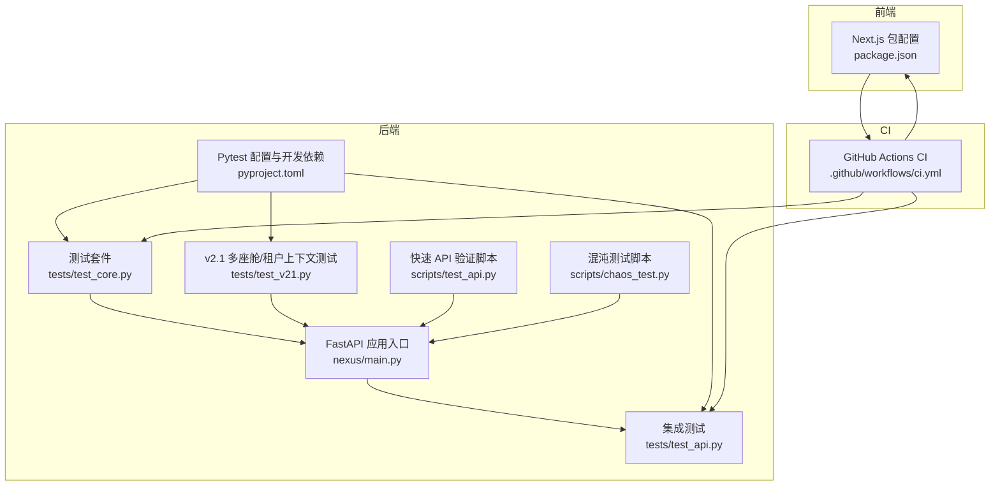
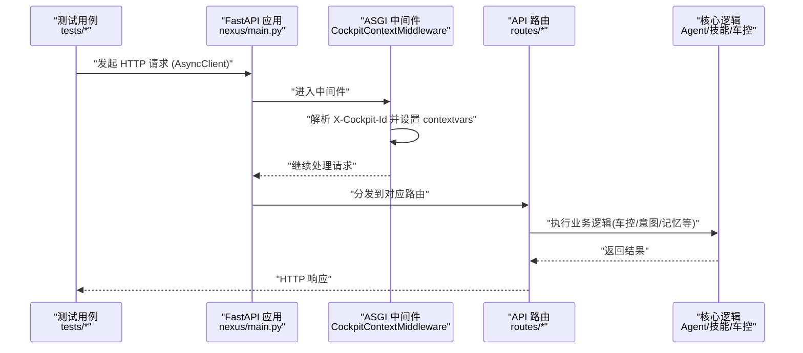
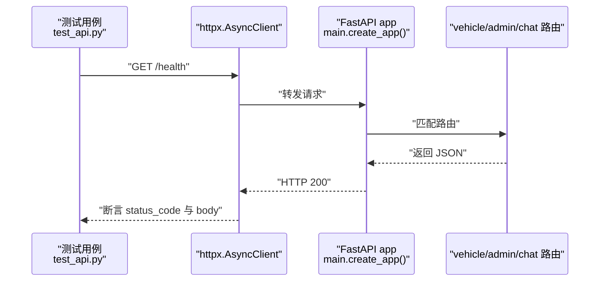
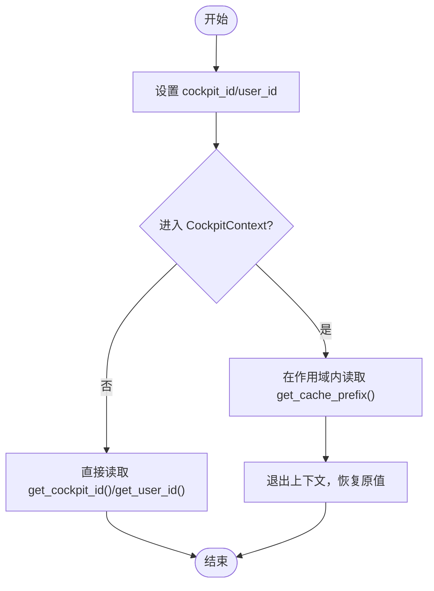
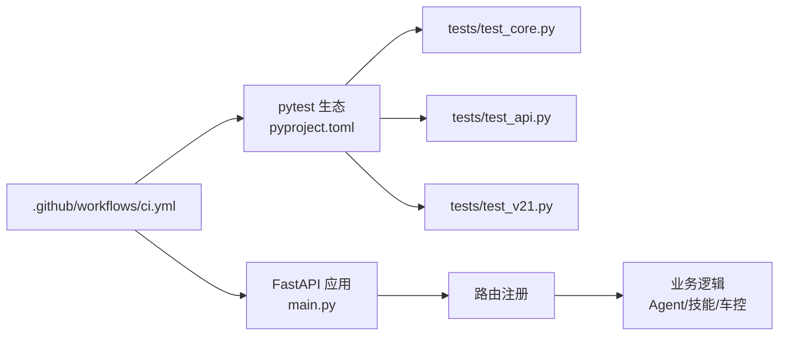

# 测试策略与实践

<cite>
**本文引用的文件**   
- [backend_design/tests/test_api.py](file://backend_design/tests/test_api.py)
- [backend_design/tests/test_core.py](file://backend_design/tests/test_core.py)
- [backend_design/tests/test_v21.py](file://backend_design/tests/test_v21.py)
- [backend_design/pyproject.toml](file://backend_design/pyproject.toml)
- [backend_design/nexus/main.py](file://backend_design/nexus/main.py)
- [backend_design/nexus/core/cockpit_manager.py](file://backend_design/nexus/core/cockpit_manager.py)
- [backend_design/nexus/core/tenant_context.py](file://backend_design/nexus/core/tenant_context.py)
- [backend_design/scripts/test_api.py](file://backend_design/scripts/test_api.py)
- [backend_design/scripts/chaos_test.py](file://backend_design/scripts/chaos_test.py)
- [.github/workflows/ci.yml](file://.github/workflows/ci.yml)
- [frontend_design/package.json](file://frontend_design/package.json)
- [docs/testing/TESTING.md](file://docs/testing/TESTING.md)
</cite>

## 目录
1. [引言](#引言)
2. [项目结构](#项目结构)
3. [核心组件](#核心组件)
4. [架构总览](#架构总览)
5. [详细组件分析](#详细组件分析)
6. [依赖分析](#依赖分析)
7. [性能考虑](#性能考虑)
8. [故障排查指南](#故障排查指南)
9. [结论](#结论)
10. [附录](#附录)

## 引言
本文件面向 NexusCockpit 的测试策略与工程实践，围绕“测试金字塔”（单元测试、集成测试、E2E/端到端测试）给出分层设计、框架选型与配置、用例编写规范、覆盖率与报告、以及持续集成中的执行与失败处理机制。文档同时结合现有代码仓库中的测试实现与脚本，提供可落地的操作指引与最佳实践建议。

## 项目结构
NexusCockpit 的后端采用 FastAPI + Python 生态，前端基于 Next.js。测试相关主要位于后端 tests 目录与文档 testing 说明中；CI 流程定义在 GitHub Actions 中；前端当前以类型检查与构建为主，未引入专用前端测试框架。

图示来源
- [backend_design/nexus/main.py:294-437](file://backend_design/nexus/main.py#L294-L437)
- [backend_design/tests/test_core.py:1-156](file://backend_design/tests/test_core.py#L1-L156)
- [backend_design/tests/test_api.py:1-71](file://backend_design/tests/test_api.py#L1-L71)
- [backend_design/tests/test_v21.py:1-220](file://backend_design/tests/test_v21.py#L1-L220)
- [backend_design/pyproject.toml:58-77](file://backend_design/pyproject.toml#L58-L77)
- [backend_design/scripts/test_api.py:1-87](file://backend_design/scripts/test_api.py#L1-L87)
- [backend_design/scripts/chaos_test.py:1-48](file://backend_design/scripts/chaos_test.py#L1-L48)
- [frontend_design/package.json:1-45](file://frontend_design/package.json#L1-L45)
- [.github/workflows/ci.yml:1-50](file://.github/workflows/ci.yml#L1-L50)

章节来源
- [backend_design/pyproject.toml:58-77](file://backend_design/pyproject.toml#L58-L77)
- [docs/testing/TESTING.md:1-314](file://docs/testing/TESTING.md#L1-L314)

## 核心组件
- 测试框架与配置
  - pytest 作为统一测试框架，启用异步自动模式，测试路径为 tests。
  - 开发依赖包含 pytest、pytest-asyncio、pytest-cov、httpx、ruff、mypy。
- 应用入口与中间件
  - FastAPI 应用通过 lifespan 初始化各子系统（向量库、图数据库、缓存、限流、会话、Agent 工作流等），并注册路由与全局异常处理器。
  - 自定义 ASGI 中间件用于提取 X-Cockpit-Id 并注入到 contextvars，确保请求级隔离。
- 多座舱与多租户上下文
  - CockpitManager 负责座舱注册、查询、注销与资源隔离（Redis DB、Milvus collection 前缀）。
  - TenantContext 使用 contextvars 在协程安全地传播 cockpit_id 与 user_id，并提供上下文管理器。

章节来源
- [backend_design/pyproject.toml:58-77](file://backend_design/pyproject.toml#L58-L77)
- [backend_design/nexus/main.py:294-437](file://backend_design/nexus/main.py#L294-L437)
- [backend_design/nexus/core/cockpit_manager.py:77-200](file://backend_design/nexus/core/cockpit_manager.py#L77-L200)
- [backend_design/nexus/core/tenant_context.py:1-106](file://backend_design/nexus/core/tenant_context.py#L1-L106)

## 架构总览
下图展示从测试到应用的调用关系与数据流：测试驱动 FastAPI 应用，经由中间件设置租户上下文，再进入具体路由与业务逻辑。

图示来源
- [backend_design/nexus/main.py:397-431](file://backend_design/nexus/main.py#L397-L431)
- [backend_design/tests/test_api.py:1-71](file://backend_design/tests/test_api.py#L1-L71)

## 详细组件分析

### 测试金字塔分层设计
- 单元测试
  - 目标：覆盖纯函数、类方法、状态机、上下文管理器等无外部依赖或仅依赖内存/模拟对象的逻辑。
  - 示例：MockVehicleBus、HeuristicRouter、SkillRegistry、AgentState、CockpitManager、TenantContext。
  - 工具：pytest + unittest.mock（AsyncMock/MagicMock/patch）。
- 集成测试
  - 目标：验证 FastAPI 路由与内部模块协作，必要时连接真实中间件（如 Redis/MySQL）或降级到内存/本地存储。
  - 示例：根路径、健康检查、技能列表、车辆状态与命令接口。
  - 工具：pytest + httpx.AsyncClient + ASGITransport。
- E2E/端到端测试
  - 目标：在接近生产的环境中验证完整链路（前端页面、后端服务、中间件、外部系统）。
  - 现状：前端以类型检查与构建为主；后端提供快速 API 验证脚本与混沌测试脚本辅助验证。
  - 建议：后续可引入 Playwright/Cypress 进行 UI 自动化与跨浏览器验证。

章节来源
- [backend_design/tests/test_core.py:1-156](file://backend_design/tests/test_core.py#L1-L156)
- [backend_design/tests/test_api.py:1-71](file://backend_design/tests/test_api.py#L1-L71)
- [backend_design/scripts/test_api.py:1-87](file://backend_design/scripts/test_api.py#L1-L87)
- [backend_design/scripts/chaos_test.py:1-48](file://backend_design/scripts/chaos_test.py#L1-L48)
- [frontend_design/package.json:1-45](file://frontend_design/package.json#L1-L45)

### 测试框架选择与配置
- 后端
  - pytest：统一测试运行器，支持插件生态。
  - pytest-asyncio：启用 async def 测试与 @pytest.mark.asyncio。
  - pytest-cov：覆盖率统计与 HTML 报告生成。
  - httpx：异步 HTTP 客户端，配合 ASGITransport 直接挂载 FastAPI app 进行测试。
  - pyproject.toml 配置：
    - asyncio_mode = "auto"
    - testpaths = ["tests"]
    - dev 依赖包含 pytest、pytest-asyncio、pytest-cov、httpx、ruff、mypy。
- 前端
  - 当前 package.json 未包含 Jest/Vitest/Playwright 等测试依赖，仅提供类型检查与构建脚本。
  - 建议：引入 Vitest 进行单元与组件测试，Playwright 进行 E2E 测试。

章节来源
- [backend_design/pyproject.toml:58-77](file://backend_design/pyproject.toml#L58-L77)
- [frontend_design/package.json:1-45](file://frontend_design/package.json#L1-45)

### 测试用例编写规范
- 测试数据准备
  - 使用 fixture 构造轻量对象（如 MockVehicleBus、CockpitManager 实例），避免共享单例污染。
  - 对复杂对象使用 dataclass 或 Pydantic 模型，便于断言字段。
- Mock 策略
  - 对外部依赖（网络、数据库、LLM、向量库）优先使用 unittest.mock（AsyncMock/MagicMock/patch）或替换为内存实现。
  - 对车控总线使用 MockVehicleBus 模拟设备行为，保证测试稳定与快速。
- 异步测试处理
  - 使用 async def 测试函数与 pytest-asyncio 自动模式；必要时显式标记 @pytest.mark.asyncio。
  - 对上下文管理器（CockpitContext）需覆盖同步与异步两种用法。
- 命名与组织
  - 按功能域划分测试类与方法名，保持可读性与定位效率。
  - 每个测试聚焦单一职责，断言明确且最小化副作用。

章节来源
- [backend_design/tests/test_core.py:1-156](file://backend_design/tests/test_core.py#L1-L156)
- [backend_design/tests/test_v21.py:1-220](file://backend_design/tests/test_v21.py#L1-L220)
- [backend_design/pyproject.toml:75-77](file://backend_design/pyproject.toml#L75-L77)

### 覆盖率要求与报告生成
- 覆盖率采集
  - 使用 pytest-cov 收集覆盖率，推荐输出 HTML 报告以便浏览。
- 阈值与门禁
  - 建议在 CI 中设定最低覆盖率阈值（例如行覆盖率≥80%），不达标则失败。
- 报告位置
  - HTML 报告默认生成于 htmlcov 目录，可在本地查看或在 CI 中归档。

章节来源
- [backend_design/pyproject.toml:58-66](file://backend_design/pyproject.toml#L58-L66)
- [docs/testing/TESTING.md:245-246](file://docs/testing/TESTING.md#L245-L246)

### 具体测试示例与要点

#### API 接口测试（集成测试）
- 使用 httpx.AsyncClient 与 ASGITransport 直接挂载 FastAPI app，无需启动进程。
- 典型用例：根路径、健康检查、技能列表、车辆状态与命令。
- 注意事项：
  - 确保路由已注册，异常处理器能正确返回预期状态码。
  - 对需要认证的路径，先获取 token 再携带 Authorization 头。

图示来源
- [backend_design/tests/test_api.py:1-71](file://backend_design/tests/test_api.py#L1-L71)
- [backend_design/nexus/main.py:318-343](file://backend_design/nexus/main.py#L318-L343)

章节来源
- [backend_design/tests/test_api.py:1-71](file://backend_design/tests/test_api.py#L1-L71)

#### Agent 逻辑测试（启发式路由与技能注册）
- HeuristicRouter：根据自然语言输入推断意图与参数。
- SkillRegistry：列出可用技能、获取 Tool Schema、异步执行技能。
- 建议：
  - 对 LLM 调用进行 Mock，避免外部依赖不稳定。
  - 对工具执行结果进行结构化断言（status/action/message）。

章节来源
- [backend_design/tests/test_core.py:74-135](file://backend_design/tests/test_core.py#L74-L135)

#### 数据库与中间件操作测试
- CockpitManager：注册/查询/更新/注销座舱，校验隔离属性（redis_db、milvus_collection_prefix）。
- TenantContext：设置/获取 cockpit_id 与 user_id，验证上下文恢复与嵌套作用域。
- 建议：
  - 使用独立实例避免状态污染。
  - 对异步初始化中间件资源进行非阻塞处理与异常捕获。

图示来源
- [backend_design/nexus/core/tenant_context.py:74-106](file://backend_design/nexus/core/tenant_context.py#L74-L106)
- [backend_design/tests/test_v21.py:138-220](file://backend_design/tests/test_v21.py#L138-L220)

章节来源
- [backend_design/tests/test_v21.py:1-220](file://backend_design/tests/test_v21.py#L1-L220)
- [backend_design/nexus/core/cockpit_manager.py:77-200](file://backend_design/nexus/core/cockpit_manager.py#L77-L200)
- [backend_design/nexus/core/tenant_context.py:1-106](file://backend_design/nexus/core/tenant_context.py#L1-L106)

### 前端测试现状与建议
- 现状
  - package.json 未包含测试框架，仅提供类型检查与构建脚本。
  - 可通过浏览器访问页面进行手动验证（仪表板、聊天、车控面板、设置）。
- 建议
  - 引入 Vitest 进行单元与组件测试，结合 React Testing Library 验证交互。
  - 引入 Playwright 进行 E2E 测试，覆盖关键用户旅程（登录、对话、车控操作）。

章节来源
- [frontend_design/package.json:1-45](file://frontend_design/package.json#L1-45)
- [docs/testing/TESTING.md:147-191](file://docs/testing/TESTING.md#L147-L191)

## 依赖分析
- 后端测试依赖
  - pytest、pytest-asyncio、pytest-cov、httpx、ruff、mypy。
- 应用依赖
  - FastAPI、uvicorn、websockets、langchain/langgraph、pymilvus、neo4j、redis、pydantic、prometheus-client、structlog、pyjwt、passlib、funasr、modelscope、torchaudio、tenacity、tiktoken、tavily-python、duckduckgo-search、orjson。
- CI 依赖
  - GitHub Actions 安装 Python 环境、依赖、运行 lint、类型检查与测试。

图示来源
- [backend_design/pyproject.toml:58-77](file://backend_design/pyproject.toml#L58-L77)
- [backend_design/nexus/main.py:318-343](file://backend_design/nexus/main.py#L318-L343)
- [.github/workflows/ci.yml:1-50](file://.github/workflows/ci.yml#L1-L50)

章节来源
- [backend_design/pyproject.toml:10-66](file://backend_design/pyproject.toml#L10-L66)
- [.github/workflows/ci.yml:1-50](file://.github/workflows/ci.yml#L1-L50)

## 性能考虑
- 基准指标
  - 健康检查、车控命令、缓存命中、LLM 首字延迟与完整响应时间。
- 并发与压测
  - 可使用 ab/wrk 进行并发测试，关注 P95/P99 延迟与错误率。
- 容错与降级
  - Redis/Milvus/LLM 不可用时，应降级至内存或默认策略，保证服务可用性。
- 监控与可观测性
  - Prometheus 指标端点暴露，Langfuse 追踪可用于调试与优化。

章节来源
- [docs/testing/TESTING.md:194-226](file://docs/testing/TESTING.md#L194-L226)
- [backend_design/nexus/main.py:341-352](file://backend_design/nexus/main.py#L341-L352)

## 故障排查指南
- 常见失败场景
  - 外部依赖不可用（Redis/MySQL/Milvus/LLM）导致超时或异常。
  - 认证失败或令牌过期。
  - 限流触发返回 429。
- 诊断步骤
  - 使用快速 API 验证脚本进行端到端连通性检查。
  - 使用混沌测试脚本模拟故障，观察降级与恢复行为。
  - 查看日志与指标，定位瓶颈与异常堆栈。
- 修复建议
  - 增加重试与退避策略（tenacity）。
  - 完善异常映射与错误消息，便于前端提示与运维告警。
  - 对关键路径添加埋点与耗时统计。

章节来源
- [backend_design/scripts/test_api.py:1-87](file://backend_design/scripts/test_api.py#L1-L87)
- [backend_design/scripts/chaos_test.py:1-48](file://backend_design/scripts/chaos_test.py#L1-L48)
- [backend_design/nexus/main.py:354-395](file://backend_design/nexus/main.py#L354-L395)

## 结论
本项目已形成较为完善的测试体系：以 pytest 为核心的单元测试与集成测试，结合上下文隔离与 Mock 策略，保障核心逻辑稳定性；通过快速 API 验证与混沌测试提升韧性；CI 流水线完成基础质量门禁。建议后续在前端引入专业测试框架，完善 E2E 自动化与覆盖率门禁，进一步提升交付质量与可维护性。

## 附录
- 测试命令速查
  - 后端：运行全部测试、指定文件/类/用例、覆盖率报告。
  - 前端：类型检查与构建。
  - 基础设施：Docker Compose 启动/停止/清理。
- 环境与依赖
  - 最低环境：Python 3.10+、Node.js 18+，无需 Docker 与 API Key 即可运行部分测试。
  - 完整环境：含 Docker 中间件、ARK_API_KEY、Tavily API Key、模型文件等。

章节来源
- [docs/testing/TESTING.md:228-314](file://docs/testing/TESTING.md#L228-L314)