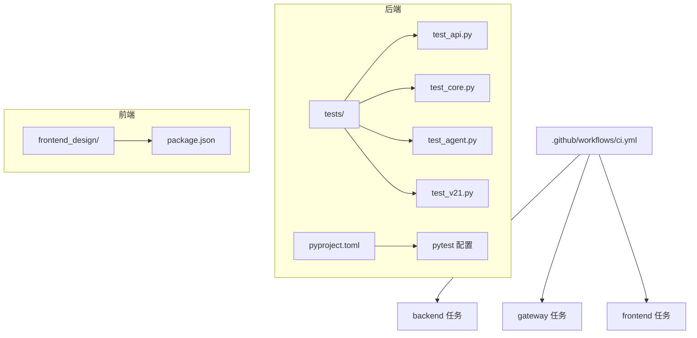
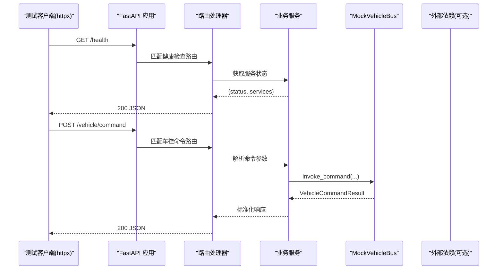
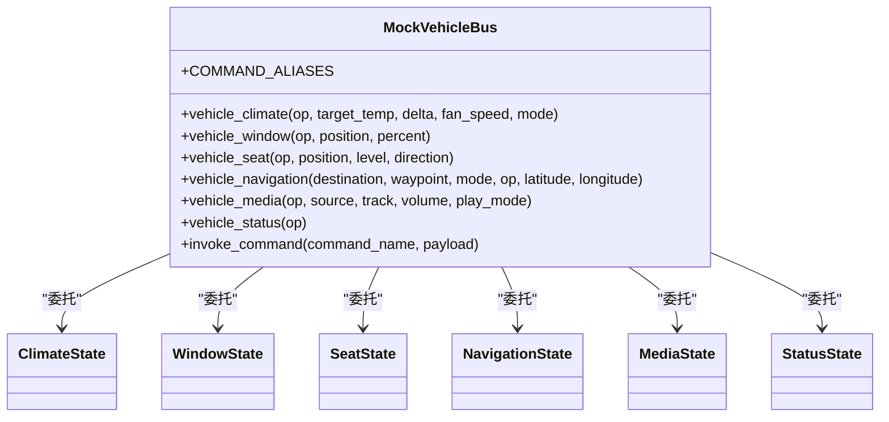
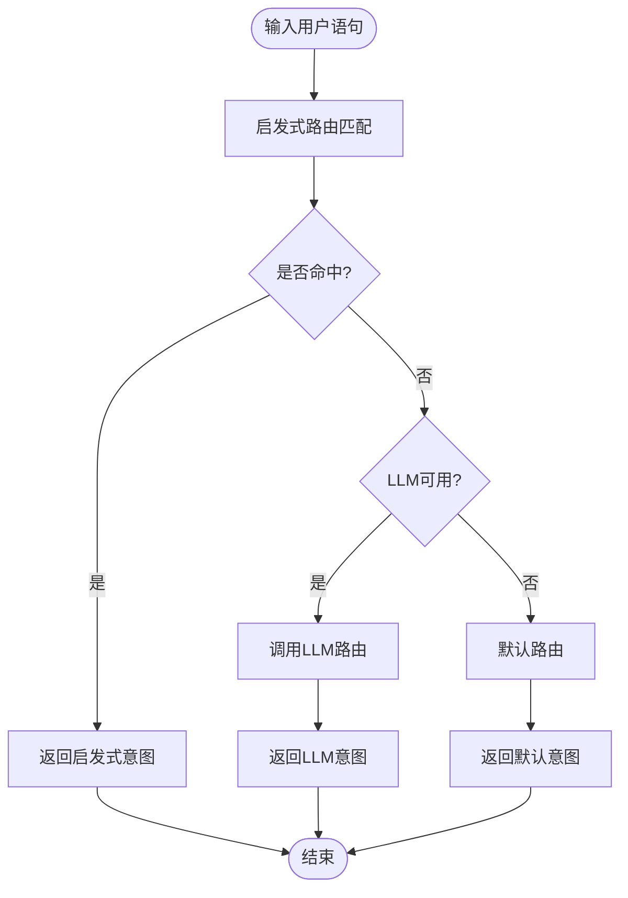
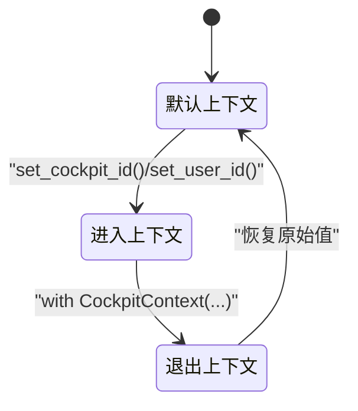
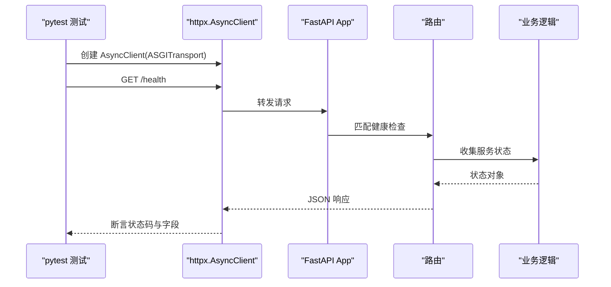
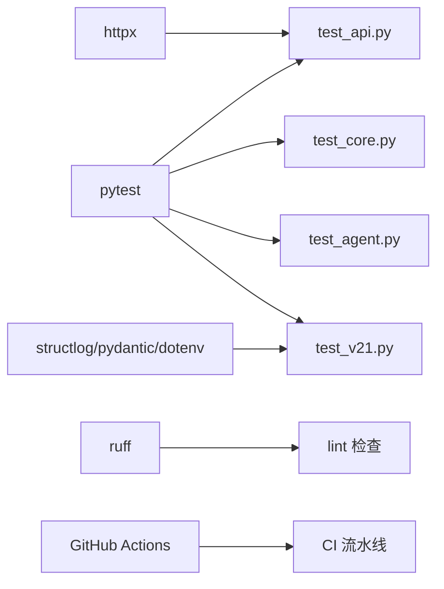

# 测试策略与实践

<cite>
**本文引用的文件**
- [backend_design/tests/test_api.py](file://backend_design/tests/test_api.py)
- [backend_design/tests/test_core.py](file://backend_design/tests/test_core.py)
- [backend_design/tests/test_agent.py](file://backend_design/tests/test_agent.py)
- [backend_design/tests/test_v21.py](file://backend_design/tests/test_v21.py)
- [backend_design/pyproject.toml](file://backend_design/pyproject.toml)
- [.github/workflows/ci.yml](file://.github/workflows/ci.yml)
- [Makefile](file://Makefile)
- [backend_design/nexus/vehicle/mock/__init__.py](file://backend_design/nexus/vehicle/mock/__init__.py)
- [frontend_design/package.json](file://frontend_design/package.json)
</cite>

## 目录
1. [引言](#引言)
2. [项目结构](#项目结构)
3. [核心组件](#核心组件)
4. [架构总览](#架构总览)
5. [详细组件分析](#详细组件分析)
6. [依赖关系分析](#依赖关系分析)
7. [性能考虑](#性能考虑)
8. [故障排查指南](#故障排查指南)
9. [结论](#结论)
10. [附录](#附录)

## 引言
本指南面向 NexusCockpit 项目的测试策略与最佳实践，覆盖单元测试、集成测试、端到端测试、覆盖率与报告、性能/压力/安全测试方法，以及持续集成配置。目标是帮助团队以 pytest 为核心构建稳定、可维护、可观测的测试体系，确保代码质量与功能稳定性。

## 项目结构
后端测试位于 backend_design/tests，使用 pytest + pytest-asyncio；前端为 Next.js 应用，当前未内置测试框架；CI 通过 GitHub Actions 执行 Python lint 与部分测试用例。

```mermaid
graph TB
subgraph "后端"
T["tests/"] --> TA["test_api.py"]
T --> TC["test_core.py"]
T --> TG["test_agent.py"]
T --> TV["test_v21.py"]
P["pyproject.toml"] --> PT["pytest 配置"]
end
subgraph "前端"
F["frontend_design/"] --> FP["package.json"]
end
CI[".github/workflows/ci.yml"] --> B["backend 任务"]
CI --> G["gateway 任务"]
CI --> FR["frontend 任务"]
```

**图表来源**
- [backend_design/tests/test_api.py:1-71](file://backend_design/tests/test_api.py#L1-L71)
- [backend_design/tests/test_core.py:1-152](file://backend_design/tests/test_core.py#L1-L152)
- [backend_design/tests/test_agent.py:1-242](file://backend_design/tests/test_agent.py#L1-L242)
- [backend_design/tests/test_v21.py:1-219](file://backend_design/tests/test_v21.py#L1-L219)
- [backend_design/pyproject.toml:124-127](file://backend_design/pyproject.toml#L124-L127)
- [.github/workflows/ci.yml:10-36](file://.github/workflows/ci.yml#L10-L36)
- [frontend_design/package.json:1-43](file://frontend_design/package.json#L1-L43)

**章节来源**
- [backend_design/pyproject.toml:124-127](file://backend_design/pyproject.toml#L124-L127)
- [.github/workflows/ci.yml:10-36](file://.github/workflows/ci.yml#L10-L36)
- [Makefile:153-161](file://Makefile#L153-L161)

## 核心组件
- 测试框架与运行环境
  - pytest、pytest-asyncio、pytest-cov（可选）在 pyproject.toml 中声明，测试路径为 tests。
  - Makefile 提供 test 与 test-cov 目标，便于本地快速运行与生成覆盖率报告。
- API 集成测试
  - 使用 httpx.AsyncClient + ASGITransport 直接挂载 FastAPI app，无需启动进程。
- 模拟车控总线
  - MockVehicleBus 作为门面模式封装空调、车窗、座椅、导航、媒体、状态等子系统，便于断言状态变化。
- Agent/意图路由与技能注册
  - HeuristicRouter、IntentRouterService、SkillRegistry 等模块均有对应测试覆盖。
- 多座舱管理与租户上下文
  - CockpitManager、TenantContext 相关用例验证隔离、缓存前缀、上下文恢复等。

**章节来源**
- [backend_design/pyproject.toml:102-109](file://backend_design/pyproject.toml#L102-L109)
- [backend_design/pyproject.toml:124-127](file://backend_design/pyproject.toml#L124-L127)
- [backend_design/tests/test_api.py:1-71](file://backend_design/tests/test_api.py#L1-L71)
- [backend_design/nexus/vehicle/mock/__init__.py:39-220](file://backend_design/nexus/vehicle/mock/__init__.py#L39-L220)
- [backend_design/tests/test_core.py:1-152](file://backend_design/tests/test_core.py#L1-L152)
- [backend_design/tests/test_agent.py:1-242](file://backend_design/tests/test_agent.py#L1-L242)
- [backend_design/tests/test_v21.py:1-219](file://backend_design/tests/test_v21.py#L1-L219)

## 架构总览
下图展示从请求到响应的主要测试路径：HTTP 客户端通过 ASGI 传输调用 FastAPI 应用，内部路由分发至业务逻辑，最终返回结构化响应。

```mermaid
sequenceDiagram
participant Client as "测试客户端(httpx)"
participant App as "FastAPI 应用"
participant Router as "路由处理器"
participant Service as "业务服务"
participant Bus as "MockVehicleBus"
participant DB as "外部依赖(可选)"
Client->>App : GET /health
App->>Router : 匹配健康检查路由
Router->>Service : 获取服务状态
Service-->>Router : {status, services}
Router-->>Client : 200 JSON
Client->>App : POST /vehicle/command
App->>Router : 匹配车控命令路由
Router->>Service : 解析命令参数
Service->>Bus : invoke_command(...)
Bus-->>Service : VehicleCommandResult
Service-->>Router : 标准化响应
Router-->>Client : 200 JSON
```

**图表来源**
- [backend_design/tests/test_api.py:1-71](file://backend_design/tests/test_api.py#L1-L71)
- [backend_design/nexus/vehicle/mock/__init__.py:194-220](file://backend_design/nexus/vehicle/mock/__init__.py#L194-L220)

## 详细组件分析

### 单元测试：MockVehicleBus（车控总线）
- 设计要点
  - 门面模式聚合多个子状态模块，对外暴露统一接口。
  - COMMAND_ALIASES 支持命令别名映射，invoke_command 负责参数清理与异常处理。
- 测试要点
  - 针对空调、车窗、座椅、导航、媒体、状态等场景进行正向与边界用例断言。
  - 校验状态字典变化与返回值字段。

```mermaid
classDiagram
class MockVehicleBus {
+COMMAND_ALIASES
+vehicle_climate(op, target_temp, delta, fan_speed, mode)
+vehicle_window(op, position, percent)
+vehicle_seat(op, position, level, direction)
+vehicle_navigation(destination, waypoint, mode, op, latitude, longitude)
+vehicle_media(op, source, track, volume, play_mode)
+vehicle_status(op)
+invoke_command(command_name, payload)
}
class ClimateState
class WindowState
class SeatState
class NavigationState
class MediaState
class StatusState
MockVehicleBus --> ClimateState : "委托"
MockVehicleBus --> WindowState : "委托"
MockVehicleBus --> SeatState : "委托"
MockVehicleBus --> NavigationState : "委托"
MockVehicleBus --> MediaState : "委托"
MockVehicleBus --> StatusState : "委托"
```

**图表来源**
- [backend_design/nexus/vehicle/mock/__init__.py:39-220](file://backend_design/nexus/vehicle/mock/__init__.py#L39-L220)

**章节来源**
- [backend_design/tests/test_core.py:11-68](file://backend_design/tests/test_core.py#L11-L68)
- [backend_design/nexus/vehicle/mock/__init__.py:39-220](file://backend_design/nexus/vehicle/mock/__init__.py#L39-L220)

### 单元测试：意图路由与技能注册
- 启发式路由
  - 对车控指令进行关键词匹配，返回结构化意图；闲聊不命中。
- IntentRouterService
  - 三级路由（启发式/LLM/默认），fast path 优先启发式。
- SkillRegistry
  - 列出技能、获取工具 Schema、按分组查询、副作用技能识别。

```mermaid
flowchart TD
Start(["输入用户语句"]) --> Heuristic["启发式路由匹配"]
Heuristic --> Match{"是否命中?"}
Match --> |是| ReturnHeuristic["返回启发式意图"]
Match --> |否| LLMCheck{"LLM可用?"}
LLMCheck --> |是| CallLLM["调用LLM路由"]
LLMCheck --> |否| DefaultRoute["默认路由"]
CallLLM --> ReturnLLM["返回LLM意图"]
DefaultRoute --> ReturnDefault["返回默认意图"]
ReturnHeuristic --> End(["结束"])
ReturnLLM --> End
ReturnDefault --> End
```

**图表来源**
- [backend_design/tests/test_agent.py:23-83](file://backend_design/tests/test_agent.py#L23-L83)

**章节来源**
- [backend_design/tests/test_agent.py:23-83](file://backend_design/tests/test_agent.py#L23-L83)
- [backend_design/tests/test_agent.py:131-182](file://backend_design/tests/test_agent.py#L131-L182)

### 单元测试：多座舱管理与租户上下文
- CockpitManager
  - 默认座舱初始化、注册/注销/更新、统计摘要、Redis/Milvus 前缀计算。
- TenantContext
  - cockpit_id/user_id 设置与恢复、缓存前缀、异步上下文管理器、嵌套上下文。

```mermaid
stateDiagram-v2
[*] --> 默认上下文
默认上下文 --> 进入上下文 : "set_cockpit_id()/set_user_id()"
进入上下文 --> 退出上下文 : "with CockpitContext(...)"
退出上下文 --> 默认上下文 : "恢复原始值"
```

**图表来源**
- [backend_design/tests/test_v21.py:137-219](file://backend_design/tests/test_v21.py#L137-L219)

**章节来源**
- [backend_design/tests/test_v21.py:25-131](file://backend_design/tests/test_v21.py#L25-L131)
- [backend_design/tests/test_v21.py:137-219](file://backend_design/tests/test_v21.py#L137-L219)

### 集成测试：API 接口测试
- 使用 httpx.AsyncClient 挂载 FastAPI 应用，避免进程启动开销。
- 覆盖根路径、健康检查、技能列表、车辆状态与命令等关键接口。
- 建议扩展：鉴权流程、错误码、超时与重试、并发请求。

```mermaid
sequenceDiagram
participant Test as "pytest 测试"
participant Client as "httpx.AsyncClient"
participant App as "FastAPI App"
participant Route as "路由"
participant Logic as "业务逻辑"
Test->>Client : 创建 AsyncClient(ASGITransport)
Test->>Client : GET /health
Client->>App : 转发请求
App->>Route : 匹配健康检查
Route->>Logic : 收集服务状态
Logic-->>Route : 状态对象
Route-->>Client : JSON 响应
Client-->>Test : 断言状态码与字段
```

**图表来源**
- [backend_design/tests/test_api.py:1-71](file://backend_design/tests/test_api.py#L1-L71)

**章节来源**
- [backend_design/tests/test_api.py:1-71](file://backend_design/tests/test_api.py#L1-L71)

### 端到端测试：前端组件与用户流程
- 现状
  - frontend_design/package.json 未包含测试脚本或框架（如 Jest/Vitest/Cypress）。
- 建议方案
  - 组件测试：Vitest + React Testing Library，断言渲染与交互。
  - 页面级 E2E：Playwright 或 Cypress，模拟登录、聊天、车控操作全流程。
  - Mock 策略：拦截 axios 请求，返回固定数据，保证测试稳定性。

[本节为概念性内容，不直接分析具体文件]

## 依赖关系分析
- 后端测试依赖
  - pytest、pytest-asyncio、httpx 用于异步 API 测试。
  - 部分测试需要 structlog、pydantic、python-dotenv 等运行时依赖。
- CI 依赖
  - GitHub Actions 安装轻量依赖并执行 ruff 与 pytest。
- 前端依赖
  - 当前无测试依赖，需引入测试框架与工具链。

```mermaid
graph LR
A["pytest"] --> B["test_api.py"]
A --> C["test_core.py"]
A --> D["test_agent.py"]
A --> E["test_v21.py"]
F["httpx"] --> B
G["structlog/pydantic/dotenv"] --> E
H["ruff"] --> I["lint 检查"]
J["GitHub Actions"] --> K["CI 流水线"]
```

**图表来源**
- [backend_design/pyproject.toml:102-109](file://backend_design/pyproject.toml#L102-L109)
- [.github/workflows/ci.yml:21-36](file://.github/workflows/ci.yml#L21-L36)

**章节来源**
- [backend_design/pyproject.toml:102-109](file://backend_design/pyproject.toml#L102-L109)
- [.github/workflows/ci.yml:21-36](file://.github/workflows/ci.yml#L21-L36)

## 性能考虑
- 测试性能优化
  - 使用 ASGI 直连测试避免进程启动开销。
  - 合理拆分测试集，避免共享全局状态污染。
  - 对耗时操作（网络、模型加载）进行 Mock 或缓存。
- 覆盖率目标
  - 建议核心模块（Agent、意图路由、车控总线、会话管理）达到 80%+ 行覆盖率。
  - 报告生成：pytest-cov 输出 HTML 与终端摘要。
- 性能/压力测试
  - 使用 locust/k6 对 API 进行压测，关注 QPS、延迟分布、错误率。
  - 对 LLM/向量检索等慢路径进行降级与限流测试。
- 安全测试
  - 注入非法参数、越权访问、JWT 伪造、SQL 注入等用例。
  - 依赖扫描（pip-audit）、镜像漏洞扫描（Trivy）。

[本节为通用指导，不直接分析具体文件]

## 故障排查指南
- 常见问题
  - 异步测试未启用：确保 pytest.ini_options 中 asyncio_mode=auto 或使用 @pytest.mark.asyncio。
  - 依赖缺失：CI 仅安装轻量依赖，本地需安装完整 dev 依赖。
  - 上下文污染：每个测试独立实例化管理器/上下文，避免单例污染。
- 定位技巧
  - 增加日志输出（structlog），捕获请求/响应与中间状态。
  - 使用 pytest -v -s 查看详细输出，结合 --tb=short 聚焦错误堆栈。
  - 对失败用例最小化复现，逐步缩小范围。

**章节来源**
- [backend_design/pyproject.toml:124-127](file://backend_design/pyproject.toml#L124-L127)
- [.github/workflows/ci.yml:21-36](file://.github/workflows/ci.yml#L21-L36)
- [Makefile:153-161](file://Makefile#L153-L161)

## 结论
NexusCockpit 已具备完善的 pytest 测试基础，覆盖 API、车控总线、意图路由、技能注册与多座舱管理等核心能力。建议进一步完善前端测试、扩大覆盖率、引入性能与安全测试，并将更多用例纳入 CI，形成闭环的质量保障体系。

[本节为总结性内容，不直接分析具体文件]

## 附录

### 测试清单与最佳实践
- 单元测试
  - 每个类/函数至少一个正向用例与一个异常用例。
  - 使用 fixture 管理测试数据与依赖，避免硬编码。
  - 对异步代码使用 pytest-asyncio，避免阻塞。
- 集成测试
  - 使用 ASGI 直连或 TestClient，减少外部依赖。
  - 对数据库/缓存/外部服务使用 Mock 或内存实现。
- 端到端测试
  - 覆盖关键用户旅程（登录、聊天、车控）。
  - 使用稳定的测试账号与数据快照。
- 覆盖率与报告
  - 目标：核心模块≥80%，整体≥70%。
  - 报告：HTML + 终端摘要，CI 中归档。
- 持续集成
  - 分支保护：必须通过 lint、类型检查、测试。
  - 并行执行：按模块拆分任务，缩短反馈时间。

**章节来源**
- [backend_design/pyproject.toml:102-109](file://backend_design/pyproject.toml#L102-L109)
- [Makefile:153-161](file://Makefile#L153-L161)
- [.github/workflows/ci.yml:10-36](file://.github/workflows/ci.yml#L10-L36)