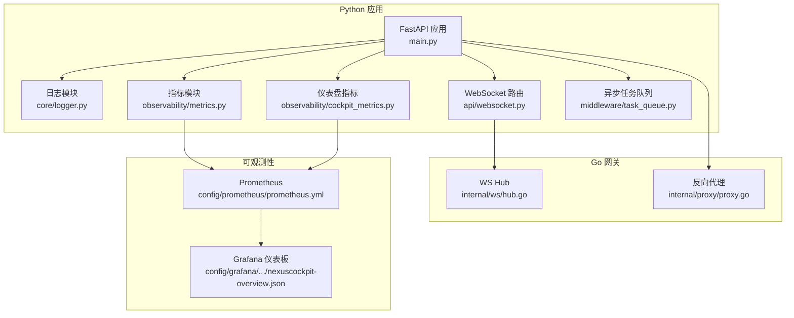
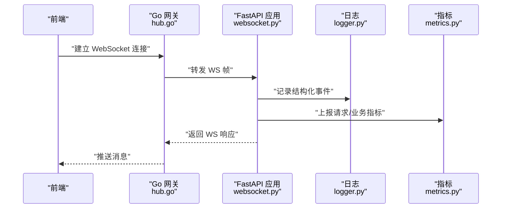
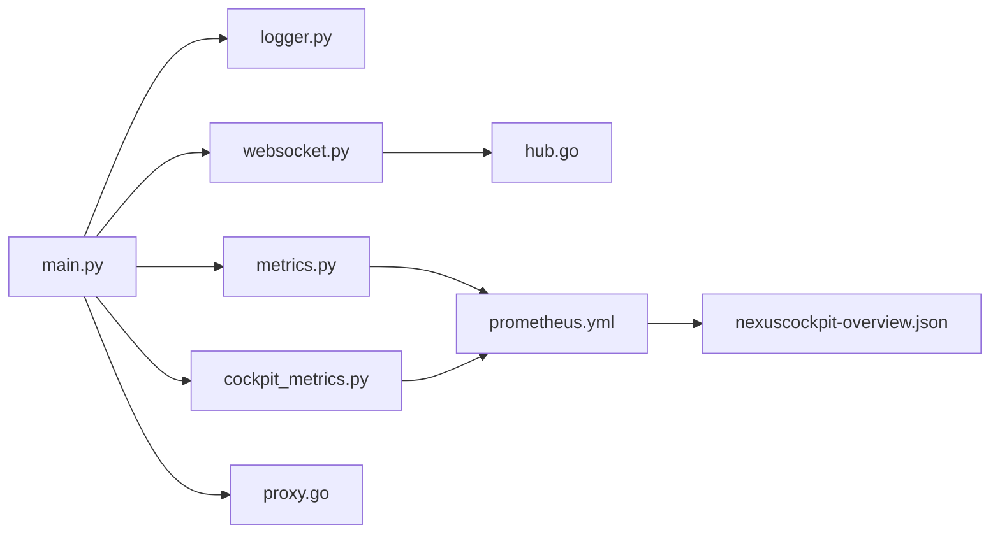

# 调试技巧与工具

<cite>
**本文引用的文件**   
- [backend_design/nexus/core/logger.py](file://backend_design/nexus/core/logger.py)
- [backend_design/nexus/observability/metrics.py](file://backend_design/nexus/observability/metrics.py)
- [backend_design/nexus/observability/cockpit_metrics.py](file://backend_design/nexus/observability/cockpit_metrics.py)
- [backend_design/nexus/api/websocket.py](file://backend_design/nexus/api/websocket.py)
- [backend_design/nexus/middleware/task_queue.py](file://backend_design/nexus/middleware/task_queue.py)
- [backend_design/nexus_gate/internal/ws/hub.go](file://backend_design/nexus_gate/internal/ws/hub.go)
- [backend_design/nexus_gate/internal/proxy/proxy.go](file://backend_design/nexus_gate/internal/proxy/proxy.go)
- [config/prometheus/prometheus.yml](file://config/prometheus/prometheus.yml)
- [config/grafana/provisioning/dashboards/nexuscockpit-overview.json](file://config/grafana/provisioning/dashboards/nexuscockpit-overview.json)
- [docker-compose.yml](file://docker-compose.yml)
- [backend_design/Dockerfile](file://backend_design/Dockerfile)
- [backend_design/pyproject.toml](file://backend_design/pyproject.toml)
- [backend_design/nexus/config.py](file://backend_design/nexus/config.py)
- [backend_design/nexus/main.py](file://backend_design/nexus/main.py)
</cite>

## 目录
1. [简介](#简介)
2. [项目结构](#项目结构)
3. [核心组件](#核心组件)
4. [架构总览](#架构总览)
5. [详细组件分析](#详细组件分析)
6. [依赖关系分析](#依赖关系分析)
7. [性能考虑](#性能考虑)
8. [故障排查指南](#故障排查指南)
9. [结论](#结论)
10. [附录](#附录)

## 简介
本指南面向 NexusCockpit 的开发者与运维人员，聚焦于“如何高效调试”：从日志系统、结构化记录与聚合分析，到性能监控与 profiling（内存泄漏检测、CPU 分析、数据库查询优化），再到分布式场景下的微服务调用追踪、WebSocket 连接调试与异步任务调试；最后覆盖 Docker 环境下的容器日志、端口映射与网络问题排查，并给出常见问题的定位步骤。

## 项目结构
NexusCockpit 后端采用 Python FastAPI 应用，配合 Go 编写的网关（nexus_gate）提供 WebSocket 转发与鉴权等能力。可观测性通过 Prometheus + Grafana 进行指标采集与可视化，日志由 Python 标准库 logger 输出，结合外部日志收集器（如 Loki）实现集中化分析。

图表来源
- [backend_design/nexus/main.py](file://backend_design/nexus/main.py)
- [backend_design/nexus/core/logger.py](file://backend_design/nexus/core/logger.py)
- [backend_design/nexus/observability/metrics.py](file://backend_design/nexus/observability/metrics.py)
- [backend_design/nexus/observability/cockpit_metrics.py](file://backend_design/nexus/observability/cockpit_metrics.py)
- [backend_design/nexus/api/websocket.py](file://backend_design/nexus/api/websocket.py)
- [backend_design/nexus/middleware/task_queue.py](file://backend_design/nexus/middleware/task_queue.py)
- [backend_design/nexus_gate/internal/ws/hub.go](file://backend_design/nexus_gate/internal/ws/hub.go)
- [backend_design/nexus_gate/internal/proxy/proxy.go](file://backend_design/nexus_gate/internal/proxy/proxy.go)
- [config/prometheus/prometheus.yml](file://config/prometheus/prometheus.yml)
- [config/grafana/provisioning/dashboards/nexuscockpit-overview.json](file://config/grafana/provisioning/dashboards/nexuscockpit-overview.json)

章节来源
- [backend_design/nexus/main.py](file://backend_design/nexus/main.py)
- [backend_design/nexus/core/logger.py](file://backend_design/nexus/core/logger.py)
- [backend_design/nexus/observability/metrics.py](file://backend_design/nexus/observability/metrics.py)
- [backend_design/nexus/observability/cockpit_metrics.py](file://backend_design/nexus/observability/cockpit_metrics.py)
- [backend_design/nexus/api/websocket.py](file://backend_design/nexus/api/websocket.py)
- [backend_design/nexus/middleware/task_queue.py](file://backend_design/nexus/middleware/task_queue.py)
- [backend_design/nexus_gate/internal/ws/hub.go](file://backend_design/nexus_gate/internal/ws/hub.go)
- [backend_design/nexus_gate/internal/proxy/proxy.go](file://backend_design/nexus_gate/internal/proxy/proxy.go)
- [config/prometheus/prometheus.yml](file://config/prometheus/prometheus.yml)
- [config/grafana/provisioning/dashboards/nexuscockpit-overview.json](file://config/grafana/provisioning/dashboards/nexuscockpit-overview.json)

## 核心组件
- 日志系统：基于 Python 标准库 logger，支持结构化字段输出与级别控制，便于后续接入 Loki/ELK 等聚合平台。
- 指标系统：暴露 /metrics 端点，集成 Prometheus 抓取；包含通用指标与 Cockpit 业务指标。
- WebSocket 链路：前端通过网关（Go）建立 WS 连接，再由网关转发至后端处理，便于统一鉴权与限流。
- 异步任务：使用中间件中的任务队列承载耗时操作，避免阻塞请求线程。
- 可观测性配置：Prometheus 抓取目标与 Grafana 仪表板预置，快速上手监控。

章节来源
- [backend_design/nexus/core/logger.py](file://backend_design/nexus/core/logger.py)
- [backend_design/nexus/observability/metrics.py](file://backend_design/nexus/observability/metrics.py)
- [backend_design/nexus/observability/cockpit_metrics.py](file://backend_design/nexus/observability/cockpit_metrics.py)
- [backend_design/nexus/api/websocket.py](file://backend_design/nexus/api/websocket.py)
- [backend_design/nexus/middleware/task_queue.py](file://backend_design/nexus/middleware/task_queue.py)
- [config/prometheus/prometheus.yml](file://config/prometheus/prometheus.yml)
- [config/grafana/provisioning/dashboards/nexuscockpit-overview.json](file://config/grafana/provisioning/dashboards/nexuscockpit-overview.json)

## 架构总览
下图展示一次典型 WebSocket 消息在网关与后端之间的流转过程，以及日志与指标的埋点位置。

图表来源
- [backend_design/nexus_gate/internal/ws/hub.go](file://backend_design/nexus_gate/internal/ws/hub.go)
- [backend_design/nexus/api/websocket.py](file://backend_design/nexus/api/websocket.py)
- [backend_design/nexus/core/logger.py](file://backend_design/nexus/core/logger.py)
- [backend_design/nexus/observability/metrics.py](file://backend_design/nexus/observability/metrics.py)

## 详细组件分析

### 日志系统与结构化记录
- 设计要点
  - 使用标准库 logger 初始化全局实例，统一格式化输出 JSON 或文本格式。
  - 为关键路径（请求进入/离开、异常、业务事件）添加结构化字段（如 trace_id、user_id、session_id）。
  - 通过环境变量或配置文件动态调整日志级别，便于生产与开发差异化。
- 使用建议
  - 在入口中间件注入 trace_id，贯穿整条调用链。
  - 对敏感信息脱敏后再写入日志。
  - 将日志输出到 stdout/stderr，交由容器编排与日志收集器统一采集。
- 常见问题
  - 日志级别过高导致磁盘膨胀：按需开启 DEBUG 级别，仅用于本地复现。
  - 缺少必要上下文字段：确保中间件正确填充 trace_id 等键。

章节来源
- [backend_design/nexus/core/logger.py](file://backend_design/nexus/core/logger.py)
- [backend_design/nexus/config.py](file://backend_design/nexus/config.py)

### 指标系统与 Prometheus/Grafana
- 设计要点
  - 暴露 /metrics 端点，供 Prometheus 定时抓取。
  - 定义通用指标（HTTP 请求计数、延迟分布、错误率）与业务指标（Cockpit 会话数、技能调用次数等）。
  - 通过 Grafana 仪表板快速查看整体健康度与热点指标。
- 使用建议
  - 合理设置采样与标签维度，避免高基数导致存储压力。
  - 为关键接口增加直方图/计时器，观察 P95/P99 延迟。
  - 将告警规则与 Grafana 联动，及时发现问题。
- 常见问题
  - 指标缺失：确认 /metrics 可达且被 Prometheus 抓取成功。
  - 指标爆炸：检查标签是否过多或存在未收敛的值域。

章节来源
- [backend_design/nexus/observability/metrics.py](file://backend_design/nexus/observability/metrics.py)
- [backend_design/nexus/observability/cockpit_metrics.py](file://backend_design/nexus/observability/cockpit_metrics.py)
- [config/prometheus/prometheus.yml](file://config/prometheus/prometheus.yml)
- [config/grafana/provisioning/dashboards/nexuscockpit-overview.json](file://config/grafana/provisioning/dashboards/nexuscockpit-overview.json)

### WebSocket 连接调试（网关与后端）
- 设计要点
  - Go 网关维护连接集合并负责转发，后端按路由处理具体业务。
  - 建议在网关层记录握手、心跳、断开事件；在后端记录业务消息收发。
- 调试步骤
  - 使用浏览器开发者工具或 ws 客户端验证连通性与消息内容。
  - 在网关与后端同时打开 DEBUG 日志，比对时间戳与 trace_id。
  - 关注网关转发失败、认证失败、速率限制等错误码。
- 常见问题
  - 跨域或证书问题：检查 Nginx/网关配置与证书链。
  - 长连接超时：核对负载均衡与健康检查策略。

章节来源
- [backend_design/nexus_gate/internal/ws/hub.go](file://backend_design/nexus_gate/internal/ws/hub.go)
- [backend_design/nexus/api/websocket.py](file://backend_design/nexus/api/websocket.py)

### 异步任务调试
- 设计要点
  - 通过中间件的任务队列执行耗时任务，避免阻塞主线程。
  - 为任务入队、出队、完成、失败等状态埋点日志与指标。
- 调试步骤
  - 检查任务队列消费者是否存活、消费速率是否匹配生产速率。
  - 针对失败任务，根据任务 ID 检索对应日志与堆栈。
  - 观察重试与退避策略是否生效。
- 常见问题
  - 任务堆积：扩容消费者或优化任务粒度。
  - 重复消费：确保幂等设计与去重逻辑。

章节来源
- [backend_design/nexus/middleware/task_queue.py](file://backend_design/nexus/middleware/task_queue.py)

### 反向代理与鉴权链路
- 设计要点
  - Go 网关承担鉴权、限流与转发职责，降低后端复杂度。
  - 在代理层记录上游请求详情与下游响应状态，便于端到端排障。
- 调试步骤
  - 对比网关与后端的请求体/响应体差异，定位序列化或协议不一致问题。
  - 检查鉴权令牌传递是否正确，必要时打印最小必要上下文。
- 常见问题
  - 头部丢失或大小写不一致：统一规范化处理。
  - 大请求体截断：检查代理缓冲区与超时配置。

章节来源
- [backend_design/nexus_gate/internal/proxy/proxy.go](file://backend_design/nexus_gate/internal/proxy/proxy.go)

## 依赖关系分析
- 组件耦合
  - 应用入口 main.py 注册路由与中间件，依赖 logger、metrics、websocket 等模块。
  - 网关 hub.go 与 proxy.go 分别负责 WS 转发与 HTTP 代理，减少后端负担。
  - metrics.py 与 cockpit_metrics.py 共同构成指标体系，被 Prometheus 抓取。
- 外部依赖
  - Prometheus 抓取 /metrics，Grafana 读取 Prometheus 数据源并渲染仪表板。
  - 容器编排通过 docker-compose.yml 启动各服务，Dockerfile 定义运行环境。

图表来源
- [backend_design/nexus/main.py](file://backend_design/nexus/main.py)
- [backend_design/nexus/core/logger.py](file://backend_design/nexus/core/logger.py)
- [backend_design/nexus/api/websocket.py](file://backend_design/nexus/api/websocket.py)
- [backend_design/nexus/observability/metrics.py](file://backend_design/nexus/observability/metrics.py)
- [backend_design/nexus/observability/cockpit_metrics.py](file://backend_design/nexus/observability/cockpit_metrics.py)
- [backend_design/nexus_gate/internal/ws/hub.go](file://backend_design/nexus_gate/internal/ws/hub.go)
- [backend_design/nexus_gate/internal/proxy/proxy.go](file://backend_design/nexus_gate/internal/proxy/proxy.go)
- [config/prometheus/prometheus.yml](file://config/prometheus/prometheus.yml)
- [config/grafana/provisioning/dashboards/nexuscockpit-overview.json](file://config/grafana/provisioning/dashboards/nexuscockpit-overview.json)

章节来源
- [backend_design/nexus/main.py](file://backend_design/nexus/main.py)
- [backend_design/nexus/core/logger.py](file://backend_design/nexus/core/logger.py)
- [backend_design/nexus/api/websocket.py](file://backend_design/nexus/api/websocket.py)
- [backend_design/nexus/observability/metrics.py](file://backend_design/nexus/observability/metrics.py)
- [backend_design/nexus/observability/cockpit_metrics.py](file://backend_design/nexus/observability/cockpit_metrics.py)
- [backend_design/nexus_gate/internal/ws/hub.go](file://backend_design/nexus_gate/internal/ws/hub.go)
- [backend_design/nexus_gate/internal/proxy/proxy.go](file://backend_design/nexus_gate/internal/proxy/proxy.go)
- [config/prometheus/prometheus.yml](file://config/prometheus/prometheus.yml)
- [config/grafana/provisioning/dashboards/nexuscockpit-overview.json](file://config/grafana/provisioning/dashboards/nexuscockpit-overview.json)

## 性能考虑
- CPU 性能分析
  - 在生产或预发环境开启性能剖析，定位热点函数与锁竞争。
  - 结合指标面板观察 QPS、P95/P99 延迟与错误率变化趋势。
- 内存泄漏检测
  - 定期导出内存快照，对比对象增长趋势，识别未释放资源。
  - 关注长生命周期对象（连接池、缓存、订阅者）的生命周期管理。
- 数据库查询优化
  - 启用慢查询日志，分析执行计划与索引命中情况。
  - 对高频查询引入缓存或批处理，减少热点表压力。
- 指标与告警
  - 为关键路径设置阈值告警，缩短 MTTR。
  - 使用 Grafana 仪表板进行日常巡检与复盘。

[本节为通用指导，不直接分析具体文件]

## 故障排查指南

### 日志相关问题
- 现象：无法定位问题根因
  - 步骤：确认 trace_id 是否贯穿全链路；在网关与后端同时开启更细粒度日志；使用聚合平台按 trace_id 过滤。
- 现象：日志量过大
  - 步骤：调整日志级别；对非关键路径降级；对大对象脱敏或截断。

章节来源
- [backend_design/nexus/core/logger.py](file://backend_design/nexus/core/logger.py)

### 指标不可用
- 现象：/metrics 无数据
  - 步骤：检查 Prometheus 抓取配置与目标可达性；确认应用已暴露 /metrics；查看 Grafana 数据源状态。
- 现象：指标维度爆炸
  - 步骤：审查标签选择，避免高基数；对枚举值做归一化处理。

章节来源
- [backend_design/nexus/observability/metrics.py](file://backend_design/nexus/observability/metrics.py)
- [config/prometheus/prometheus.yml](file://config/prometheus/prometheus.yml)

### WebSocket 连接不稳定
- 现象：频繁断开或消息乱序
  - 步骤：检查网关心跳与超时配置；在后端记录握手与消息时序；核对负载均衡健康检查策略。
- 现象：鉴权失败
  - 步骤：校验令牌传递与签名；在网关与后端分别打印最小必要上下文。

章节来源
- [backend_design/nexus_gate/internal/ws/hub.go](file://backend_design/nexus_gate/internal/ws/hub.go)
- [backend_design/nexus/api/websocket.py](file://backend_design/nexus/api/websocket.py)

### 异步任务堆积
- 现象：任务积压、延迟升高
  - 步骤：检查消费者数量与消费速率；观察失败重试与死信队列；定位瓶颈任务并拆分或优化。

章节来源
- [backend_design/nexus/middleware/task_queue.py](file://backend_design/nexus/middleware/task_queue.py)

### Docker 环境问题
- 现象：容器内无法访问外部服务
  - 步骤：检查 docker-compose 网络与端口映射；在容器内执行网络诊断命令；确认防火墙与安全组策略。
- 现象：端口冲突或服务不可达
  - 步骤：核对宿主机与容器端口映射；查看容器日志与进程状态；重启相关服务并观察恢复情况。

章节来源
- [docker-compose.yml](file://docker-compose.yml)
- [backend_design/Dockerfile](file://backend_design/Dockerfile)

## 结论
通过统一的日志规范、完善的指标体系与合理的分布式调试手段，可以显著提升 NexusCockpit 的可观测性与排障效率。建议在日常迭代中持续完善 trace 链路、指标维度与告警规则，并结合 Docker 环境进行标准化演练与回归。

[本节为总结性内容，不直接分析具体文件]

## 附录

### 常用命令与路径参考
- 查看容器日志：使用编排工具查看 Python 应用与网关服务的标准输出。
- 抓取指标：访问应用的 /metrics 端点，确认 Prometheus 抓取正常。
- 打开 Grafana 仪表板：加载预置的 overview 仪表板，快速掌握系统健康度。

章节来源
- [backend_design/pyproject.toml](file://backend_design/pyproject.toml)
- [config/grafana/provisioning/dashboards/nexuscockpit-overview.json](file://config/grafana/provisioning/dashboards/nexuscockpit-overview.json)