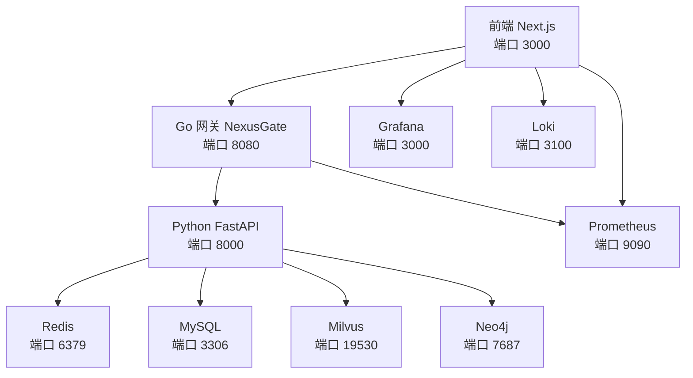
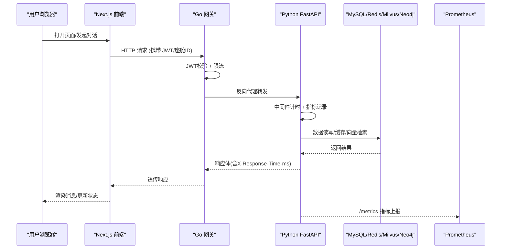
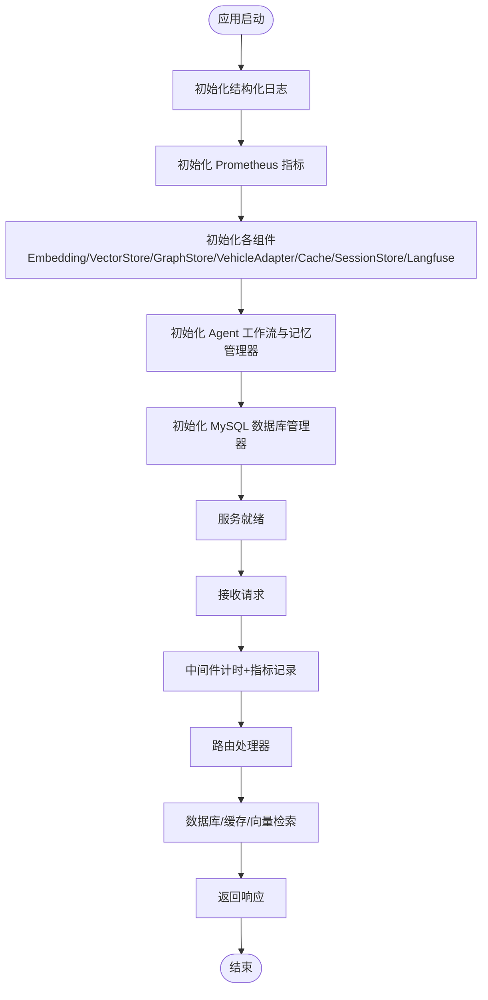
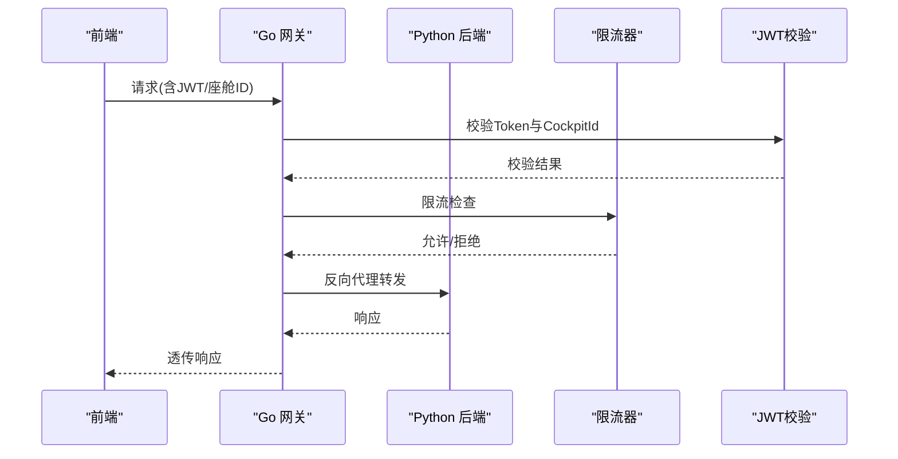
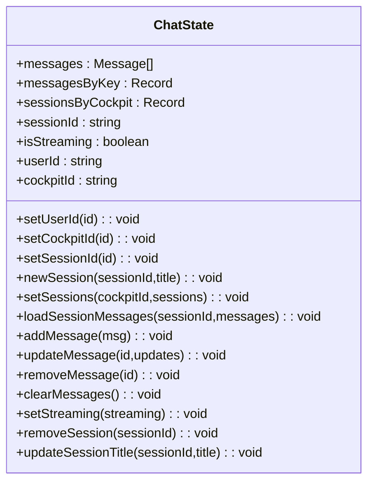
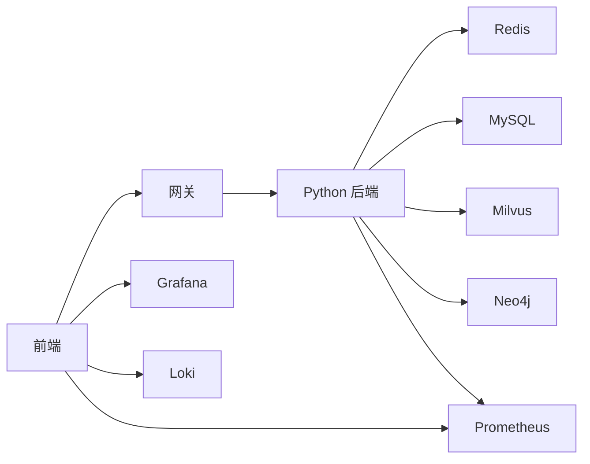

# 调试技巧与工具

<cite>
**本文引用的文件**   
- [backend_design/nexus/main.py](file://backend_design/nexus/main.py)
- [backend_design/Dockerfile](file://backend_design/Dockerfile)
- [docker-compose.yml](file://docker-compose.yml)
- [docker-compose.dev.yml](file://docker-compose.dev.yml)
- [backend_design/nexus/core/logger.py](file://backend_design/nexus/core/logger.py)
- [backend_design/nexus/config/__init__.py](file://backend_design/nexus/config/__init__.py)
- [scripts/start-backend.ps1](file://scripts/start-backend.ps1)
- [backend_design/nexus_gate/cmd/main.go](file://backend_design/nexus_gate/cmd/main.go)
- [backend_design/nexus_gate/internal/config/config.go](file://backend_design/nexus_gate/internal/config/config.go)
- [frontend_design/src/app/layout.tsx](file://frontend_design/src/app/layout.tsx)
- [frontend_design/src/stores/chat-store.ts](file://frontend_design/src/stores/chat-store.ts)
- [frontend_design/package.json](file://frontend_design/package.json)
</cite>

## 目录
1. [简介](#简介)
2. [项目结构](#项目结构)
3. [核心组件](#核心组件)
4. [架构总览](#架构总览)
5. [详细组件分析](#详细组件分析)
6. [依赖关系分析](#依赖关系分析)
7. [性能考虑](#性能考虑)
8. [故障排查指南](#故障排查指南)
9. [结论](#结论)
10. [附录](#附录)

## 简介
本指南面向 NexusCockpit 项目的开发者，提供从 Python 后端、Go 网关到前端应用的系统化调试方法与工具使用建议。内容涵盖：
- Python FastAPI 服务：IDE 调试配置、结构化日志、异常统一处理、Prometheus 指标采集
- Go 网关：启动流程、环境变量加载、日志输出、限流与代理链路追踪
- 前端应用：浏览器开发者工具、网络请求调试、Zustand 状态管理调试
- Docker 容器：多服务编排、健康检查、开发模式端口暴露、日志收集（Loki/Prometheus/Grafana）
- 数据库与中间件：MySQL、Redis、Milvus、Neo4j 的常见连接问题与优化思路
- 性能瓶颈定位：内存泄漏检测、慢查询分析、并发与限流调优

## 项目结构
NexusCockpit 采用“Go 网关 + Python AI 后端 + Next.js 前端”的分层架构，并通过 Docker Compose 编排基础设施（Redis、MySQL、Milvus、Neo4j、Langfuse、Prometheus、Grafana、Loki）。

```mermaid
graph TB
FE["前端 Next.js<br/>端口 3000"] --> GW["Go 网关 NexusGate<br/>端口 8080"]
GW --> PY["Python FastAPI<br/>端口 8000"]
PY --> REDIS["Redis<br/>端口 6379"]
PY --> MYSQL["MySQL<br/>端口 3306"]
PY --> MILVUS["Milvus<br/>端口 19530"]
PY --> NEO4J["Neo4j<br/>端口 7687"]
GW --> PROM["Prometheus<br/>端口 9090"]
FE --> PROM
FE --> GRAF["Grafana<br/>端口 3000"]
FE --> LOKI["Loki<br/>端口 3100"]
```

**图表来源** 
- [docker-compose.yml:16-88](file://docker-compose.yml#L16-L88)
- [docker-compose.yml:94-209](file://docker-compose.yml#L94-L209)
- [docker-compose.yml:248-276](file://docker-compose.yml#L248-L276)

**章节来源**
- [docker-compose.yml:1-292](file://docker-compose.yml#L1-L292)

## 核心组件
- Python 后端入口与生命周期管理：FastAPI 应用创建、中间件注册、全局异常处理器、Prometheus 指标挂载、资源初始化与清理
- 结构化日志：structlog JSON/彩色控制台输出、敏感信息脱敏、uvicorn 访问日志落盘
- 配置中心：基于 pydantic-settings 的统一配置聚合与环境变量加载
- Go 网关：环境变量加载、反向代理、WebSocket Hub、限流器、优雅关闭
- 前端布局与状态：Next.js 根布局、Zustand 聊天状态持久化与多会话管理

**章节来源**
- [backend_design/nexus/main.py:436-658](file://backend_design/nexus/main.py#L436-L658)
- [backend_design/nexus/core/logger.py:83-202](file://backend_design/nexus/core/logger.py#L83-L202)
- [backend_design/nexus/config/__init__.py:84-151](file://backend_design/nexus/config/__init__.py#L84-L151)
- [backend_design/nexus_gate/cmd/main.go:43-153](file://backend_design/nexus_gate/cmd/main.go#L43-L153)
- [backend_design/nexus_gate/internal/config/config.go:80-118](file://backend_design/nexus_gate/internal/config/config.go#L80-L118)
- [frontend_design/src/app/layout.tsx:29-54](file://frontend_design/src/app/layout.tsx#L29-L54)
- [frontend_design/src/stores/chat-store.ts:77-109](file://frontend_design/src/stores/chat-store.ts#L77-L109)

## 架构总览
下图展示一次典型的前端请求在网关与后端的调用链路与关键监控点。

```mermaid
sequenceDiagram
participant U as "用户浏览器"
participant FE as "Next.js 前端"
participant GW as "Go 网关"
participant PY as "Python FastAPI"
participant DB as "MySQL/Redis/Milvus/Neo4j"
participant PM as "Prometheus"
U->>FE : 打开页面/发起对话
FE->>GW : HTTP 请求 (携带 JWT/座舱ID)
GW->>GW : JWT校验 + 限流
GW->>PY : 反向代理转发
PY->>PY : 中间件计时 + 指标记录
PY->>DB : 数据读写/缓存/向量检索
DB-->>PY : 返回结果
PY-->>GW : 响应体(含X-Response-Time-ms)
GW-->>FE : 透传响应
FE-->>U : 渲染消息/更新状态
PY-->>PM : /metrics 指标上报
```

**图表来源** 
- [backend_design/nexus/main.py:598-652](file://backend_design/nexus/main.py#L598-L652)
- [backend_design/nexus/main.py:486-488](file://backend_design/nexus/main.py#L486-L488)
- [backend_design/nexus_gate/cmd/main.go:123-145](file://backend_design/nexus_gate/cmd/main.go#L123-L145)

## 详细组件分析

### Python 后端调试要点
- 启动与热重载
  - 本地运行：通过 uvicorn 启动，支持 --reload 热重载；Windows 可使用 PowerShell 脚本将终端输出同时写入日志文件
  - 容器运行：Dockerfile 中设置健康检查与健康探测，便于编排平台感知服务就绪
- 结构化日志与异常处理
  - 使用 structlog 输出 JSON（生产）或彩色控制台（开发），自动脱敏敏感字段
  - 全局异常处理器统一错误格式，便于前端一致化处理
- 指标与可观测性
  - Prometheus 指标挂载于 /metrics，中间件统计请求计数与延迟
  - Langfuse 用于 LLM 调用追踪（可选）
- 配置与环境
  - AppConfig 聚合所有子系统配置，支持 .env 文件与环境变量覆盖

```mermaid
flowchart TD
Start(["应用启动"]) --> InitLog["初始化结构化日志"]
InitLog --> InitMetrics["初始化 Prometheus 指标"]
InitMetrics --> InitComponents["初始化各组件<br/>Embedding/VectorStore/GraphStore/VehicleAdapter/Cache/SessionStore/Langfuse"]
InitComponents --> InitAgent["初始化 Agent 工作流与记忆管理器"]
InitAgent --> InitDB["初始化 MySQL 数据库管理器"]
InitDB --> Ready["服务就绪"]
Ready --> Request["接收请求"]
Request --> Middleware["中间件计时+指标记录"]
Middleware --> Handler["路由处理器"]
Handler --> DBIO["数据库/缓存/向量检索"]
DBIO --> Response["返回响应"]
Response --> End(["结束"])
```

**图表来源** 
- [backend_design/nexus/main.py:75-101](file://backend_design/nexus/main.py#L75-L101)
- [backend_design/nexus/main.py:112-181](file://backend_design/nexus/main.py#L112-L181)
- [backend_design/nexus/main.py:182-277](file://backend_design/nexus/main.py#L182-L277)
- [backend_design/nexus/main.py:281-316](file://backend_design/nexus/main.py#L281-L316)
- [backend_design/nexus/main.py:598-652](file://backend_design/nexus/main.py#L598-L652)

**章节来源**
- [backend_design/nexus/main.py:436-658](file://backend_design/nexus/main.py#L436-L658)
- [backend_design/nexus/core/logger.py:83-202](file://backend_design/nexus/core/logger.py#L83-L202)
- [backend_design/nexus/config/__init__.py:84-151](file://backend_design/nexus/config/__init__.py#L84-L151)
- [backend_design/Dockerfile:52-58](file://backend_design/Dockerfile#L52-L58)
- [scripts/start-backend.ps1:34-43](file://scripts/start-backend.ps1#L34-L43)

### Go 网关调试要点
- 启动流程与环境加载
  - 命令行参数解析与环境变量加载（优先 --env，其次自动查找 .env.local/.env）
  - 日志文件输出到 logs/go_logs/gateway_YYYYMMDD_HHMMSS.log，支持控制台与文件双写
- 路由与代理
  - 非 AI 请求直接处理（如 health/auth），AI 请求反向代理到 Python FastAPI
  - WebSocket Hub 管理长连接
- 限流与安全
  - 基于 QPS 的令牌桶限流
  - JWT 鉴权与 Cockpit ID 校验
  - 生产环境安全检查（默认弱密钥/CORS 通配符等拒绝启动）

```mermaid
sequenceDiagram
participant FE as "前端"
participant GW as "Go 网关"
participant PY as "Python 后端"
participant RL as "限流器"
participant AUTH as "JWT校验"
FE->>GW : 请求(含JWT/座舱ID)
GW->>AUTH : 校验Token与CockpitId
AUTH-->>GW : 校验结果
GW->>RL : 限流检查
RL-->>GW : 允许/拒绝
GW->>PY : 反向代理转发
PY-->>GW : 响应
GW-->>FE : 透传响应
```

**图表来源** 
- [backend_design/nexus_gate/cmd/main.go:43-153](file://backend_design/nexus_gate/cmd/main.go#L43-L153)
- [backend_design/nexus_gate/internal/config/config.go:80-118](file://backend_design/nexus_gate/internal/config/config.go#L80-L118)

**章节来源**
- [backend_design/nexus_gate/cmd/main.go:43-153](file://backend_design/nexus_gate/cmd/main.go#L43-L153)
- [backend_design/nexus_gate/internal/config/config.go:80-118](file://backend_design/nexus_gate/internal/config/config.go#L80-L118)

### 前端调试要点
- 根布局与全局通知
  - Next.js 根布局注入侧边栏、GPS 提供者与 Toast 通知容器
- 状态管理与持久化
  - Zustand 管理聊天状态，按座舱与会话分组存储，持久化至 localStorage
  - 支持多会话切换、历史消息加载、流式接收状态控制

```mermaid
classDiagram
class ChatState {
+messages : Message[]
+messagesByKey : Record<string, Message[]>
+sessionsByCockpit : Record<string, SessionMeta[]>
+sessionId : string
+isStreaming : boolean
+userId : string
+cockpitId : string
+setUserId(id) : void
+setCockpitId(id) : void
+setSessionId(id) : void
+newSession(sessionId,title) : void
+setSessions(cockpitId,sessions) : void
+loadSessionMessages(sessionId,messages) : void
+addMessage(msg) : void
+updateMessage(id,updates) : void
+removeMessage(id) : void
+clearMessages() : void
+setStreaming(streaming) : void
+removeSession(sessionId) : void
+updateSessionTitle(sessionId,title) : void
}
```

**图表来源** 
- [frontend_design/src/stores/chat-store.ts:31-69](file://frontend_design/src/stores/chat-store.ts#L31-L69)

**章节来源**
- [frontend_design/src/app/layout.tsx:29-54](file://frontend_design/src/app/layout.tsx#L29-L54)
- [frontend_design/src/stores/chat-store.ts:77-109](file://frontend_design/src/stores/chat-store.ts#L77-L109)

## 依赖关系分析
- 服务间依赖
  - 前端依赖网关（NEXT_PUBLIC_API_URL=http://localhost:8080）
  - 网关依赖 Redis（限流与会话）、Python 后端（反向代理）
  - Python 后端依赖 Redis、MySQL、Milvus、Neo4j、Langfuse（可选）
- 可观测性依赖
  - Prometheus 抓取 /metrics
  - Grafana 可视化 Prometheus/Loki 数据
  - Loki 聚合日志

```mermaid
graph LR
FE["前端"] --> GW["网关"]
GW --> PY["Python 后端"]
PY --> REDIS["Redis"]
PY --> MYSQL["MySQL"]
PY --> MILVUS["Milvus"]
PY --> NEO4J["Neo4j"]
PY --> PROM["Prometheus"]
FE --> PROM
FE --> GRAF["Grafana"]
FE --> LOKI["Loki"]
```

**图表来源** 
- [docker-compose.yml:16-88](file://docker-compose.yml#L16-L88)
- [docker-compose.yml:94-209](file://docker-compose.yml#L94-L209)
- [docker-compose.yml:248-276](file://docker-compose.yml#L248-L276)

**章节来源**
- [docker-compose.yml:1-292](file://docker-compose.yml#L1-L292)

## 性能考虑
- Python 后端
  - 中间件统一计时与指标记录，关注 /metrics 中的 REQUEST_COUNT 与 REQUEST_LATENCY
  - ASR/TTS 模型后台预加载，避免阻塞启动；首次请求按需加载
  - 结构化日志在生产环境输出 JSON，减少 I/O 开销；敏感字段脱敏
- Go 网关
  - 令牌桶限流保护后端；合理设置 QPS 上限
  - 日志文件轮转与集中输出，便于快速定位瓶颈
- 前端
  - 使用浏览器性能面板分析首屏渲染与网络请求耗时
  - Zustand 状态变更尽量批量更新，避免频繁重渲染
- 数据库与中间件
  - MySQL：慢查询日志、索引优化、连接池配置
  - Redis：内存策略 allkeys-lru、最大内存限制、IO 线程数
  - Milvus/Neo4j：连接失败不阻止启动，运行时重试与降级

[本节为通用指导，不直接分析具体文件]

## 故障排查指南
- Python 后端
  - 启动失败：检查 .env 配置、依赖安装、端口占用；查看 logs/backend_logs/*.log
  - 认证失败：确认 JWT_SECRET 与网关一致；查看 AuthError 处理器日志
  - 限流触发：检查 RATE_LIMIT_QPS 与客户端请求频率；查看 RateLimitError 处理器
  - 指标缺失：确认 /metrics 端点可达；检查 Prometheus 抓取配置
- Go 网关
  - 启动警告：检查 .env.local/.env 是否加载成功；确认 NEXUS_AI_HOST/NEXUS_AI_PORT
  - 代理失败：验证 Python 后端健康检查；查看 gateway_*.log
  - 限流拒绝：调整 QPS；观察限流器日志
- 前端
  - 跨域错误：检查 CORS_ORIGINS 与 NEXT_PUBLIC_API_URL
  - 状态不同步：查看 Zustand DevTools（浏览器扩展）与 localStorage
  - 网络请求失败：使用 Network 面板查看请求头、响应码与错误信息
- Docker 与基础设施
  - 健康检查失败：检查服务端口映射、依赖服务就绪顺序
  - 日志收集：确认 Loki/Grafana 端口暴露与配置文件挂载
  - 数据库连接：检查密码、字符集、端口映射与防火墙规则

**章节来源**
- [backend_design/nexus/main.py:503-596](file://backend_design/nexus/main.py#L503-L596)
- [backend_design/nexus/core/logger.py:97-173](file://backend_design/nexus/core/logger.py#L97-L173)
- [backend_design/nexus_gate/cmd/main.go:95-121](file://backend_design/nexus_gate/cmd/main.go#L95-L121)
- [docker-compose.dev.yml:52-63](file://docker-compose.dev.yml#L52-L63)

## 结论
通过统一的日志规范、指标采集、限流与鉴权机制，NexusCockpit 提供了完善的调试与可观测性基础。结合 IDE 调试、浏览器开发者工具与 Docker 编排，开发者可以快速定位并解决前后端与基础设施的问题。建议在生产环境中启用结构化日志、指标与链路追踪，持续优化性能与稳定性。

[本节为总结，不直接分析具体文件]

## 附录
- 常用命令
  - 启动后端（Windows）：执行 scripts/start-backend.ps1
  - 启动全栈（开发模式）：docker compose -f docker-compose.yml -f docker-compose.dev.yml up -d
  - 查看指标：访问 http://localhost:9200 与 http://localhost:8000/metrics
  - 查看日志：logs/backend_logs/*.log 与 logs/go_logs/gateway_*.log
- 关键端口
  - 前端：3000
  - 网关：8080
  - 后端：8000
  - Redis：6379（宿主机 16379）
  - MySQL：3306（宿主机 13306）
  - Milvus：19530
  - Neo4j：7687（Bolt 17687，Browser 17474）
  - Prometheus：9090（宿主机 9200）
  - Grafana：3000（宿主机 3001）
  - Loki：3100（宿主机 3100）
  - Langfuse：3000（宿主机 3101）

**章节来源**
- [scripts/start-backend.ps1:1-43](file://scripts/start-backend.ps1#L1-L43)
- [docker-compose.yml:16-88](file://docker-compose.yml#L16-L88)
- [docker-compose.yml:94-209](file://docker-compose.yml#L94-L209)
- [docker-compose.yml:248-276](file://docker-compose.yml#L248-L276)
- [docker-compose.dev.yml:15-50](file://docker-compose.dev.yml#L15-L50)