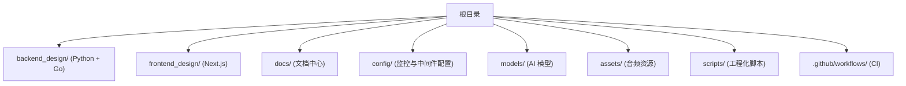
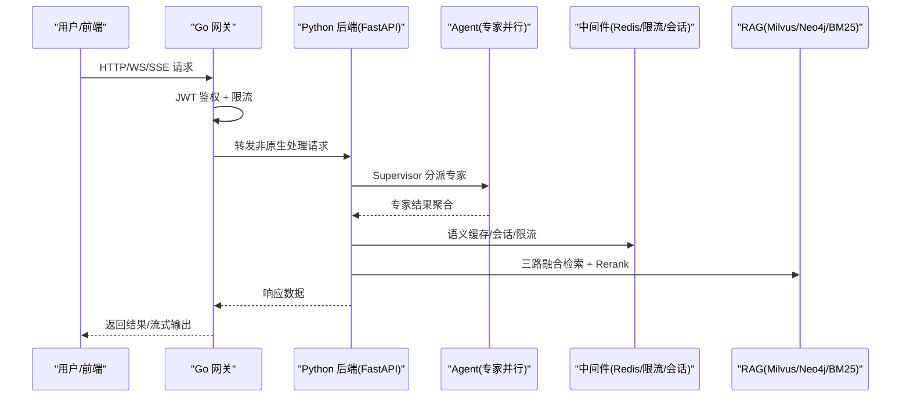
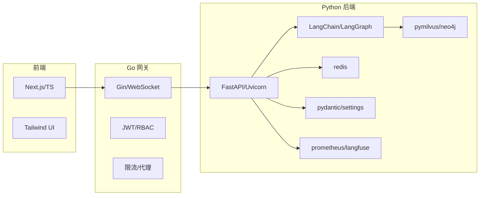

# 贡献指南

<cite>
**本文引用的文件**   
- [README.md](file://README.md)
- [Agent.md](file://Agent.md)
- [Makefile](file://Makefile)
- [.pre-commit-config.yaml](file://.pre-commit-config.yaml)
- [.github/workflows/ci.yml](file://.github/workflows/ci.yml)
- [backend_design/pyproject.toml](file://backend_design/pyproject.toml)
- [backend_design/requirements.txt](file://backend_design/requirements.txt)
- [backend_design/tests/test_api.py](file://backend_design/tests/test_api.py)
</cite>

## 目录
1. [简介](#简介)
2. [项目结构](#项目结构)
3. [核心组件](#核心组件)
4. [架构总览](#架构总览)
5. [详细组件分析](#详细组件分析)
6. [依赖关系分析](#依赖关系分析)
7. [性能与质量考量](#性能与质量考量)
8. [故障排查指南](#故障排查指南)
9. [结论](#结论)
10. [附录](#附录)

## 简介
本指南面向希望参与 NexusCockpit 开源项目的贡献者，涵盖从 Fork、创建分支到提交 Pull Request 的完整流程；明确代码风格、测试要求与技术文档更新规范；说明问题报告与功能请求的提交流程；提供社区行为准则与协作规范；并为新贡献者提供入门指导（项目结构、开发环境搭建与第一个贡献任务）。目标是确保社区活跃与项目高质量演进。

## 项目结构
NexusCockpit 采用前后端分离与多语言栈：
- 后端 Python AI 服务：backend_design/nexus
- Go 并发网关：backend_design/nexus_gate
- 前端 Next.js：frontend_design
- 基础设施与配置：docker-compose、config、scripts
- 文档与模型：docs、models、assets

章节来源
- [README.md:93-138](file://README.md#L93-L138)
- [Agent.md:66-170](file://Agent.md#L66-L170)

## 核心组件
- 后端（Python）：FastAPI 应用、Multi-Agent（Supervisor+5 Experts）、RAG（Milvus/Neo4j/BM25）、中间件（Redis 缓存/限流/会话）、可观测性（Langfuse/Prometheus/Grafana）
- 网关（Go）：JWT 鉴权、优先级限流、WebSocket Hub、反向代理
- 前端（Next.js）：座舱控制台、聊天页、数据中台看板、设置与管理后台
- 基础设施：Docker Compose 编排 Milvus/Neo4j/Redis/MySQL/Prometheus/Grafana/Loki

章节来源
- [README.md:14-33](file://README.md#L14-L33)
- [Agent.md:36-64](file://Agent.md#L36-L64)

## 架构总览
下图展示用户请求在 Go 网关与 Python 后端之间的流转，以及 Agent 层与 RAG/中间件的交互。

图表来源
- [README.md:369-440](file://README.md#L369-L440)
- [Agent.md:11-24](file://Agent.md#L11-L24)

## 详细组件分析

### 贡献工作流（Fork → 分支 → PR）
- Fork 仓库到你的 GitHub 账户
- 克隆本地并添加上游远程
- 创建特性分支（如 feature/xxx 或 fix/yyy）
- 提交变更（遵循 Commit 规范）
- 推送分支并创建 Pull Request（描述变更影响、测试覆盖、文档更新）
- 通过 CI 检查与代码审查后合并

章节来源
- [README.md:512-522](file://README.md#L512-L522)

### 代码风格与格式化
- Python：使用 ruff 进行 lint 与格式化，行长度 120，目标版本 py310
- Go：go vet 与 go build 校验
- 编辑器：统一 .editorconfig（UTF-8）
- 提交前钩子：pre-commit 自动执行 ruff 修复与格式化

章节来源
- [backend_design/pyproject.toml:111-123](file://backend_design/pyproject.toml#L111-L123)
- [.pre-commit-config.yaml:1-10](file://.pre-commit-config.yaml#L1-L10)
- [Makefile:122-140](file://Makefile#L122-L140)

### 测试要求
- 后端：pytest + pytest-asyncio，异步模式 auto，测试路径 tests
- 前端：TypeScript 类型检查与构建（CI 中执行 tsc --noEmit 与 npm run build）
- 网关：go vet 与 go build
- 建议：新增/修改逻辑需补充单元测试或集成测试，保证关键路径覆盖率

章节来源
- [backend_design/pyproject.toml:124-127](file://backend_design/pyproject.toml#L124-L127)
- [backend_design/tests/test_api.py:1-71](file://backend_design/tests/test_api.py#L1-L71)
- [.github/workflows/ci.yml:55-71](file://.github/workflows/ci.yml#L55-L71)
- [.github/workflows/ci.yml:38-54](file://.github/workflows/ci.yml#L38-L54)

### 技术文档更新
- 每次代码修改后，必须执行 post-code-guardian 编排器：code-review → code-doc → doc-sync
- 确保函数 docstring、行内注释与 .md 文档一致
- 重要接口与架构变更需在 docs/ 下同步更新

章节来源
- [Agent.md:252-300](file://Agent.md#L252-L300)

### 问题报告与功能请求
- 使用 GitHub Issues 提交 Bug 或功能请求
- 提供复现步骤、期望行为、实际行为与环境信息
- 涉及 API 变更时，附上 curl 示例或前端调用方式

章节来源
- [README.md:524-528](file://README.md#L524-L528)

### 社区行为准则与协作规范
- 尊重与包容：保持专业沟通，避免人身攻击
- 透明与协作：公开讨论设计决策，鼓励提出改进建议
- 责任与质量：提交前自检（lint/format/test），PR 描述清晰
- 安全与合规：不泄露密钥与敏感信息，遵守 MIT 协议与版权声明

章节来源
- [README.md:478-509](file://README.md#L478-L509)

### 新贡献者入门
- 环境要求：Python 3.10+、Go 1.21+、Node.js 18+、Docker 24+、Docker Compose 2.20+
- 启动基础设施：docker compose up -d
- 安装后端：make install 或 pip install -r backend_design/requirements.txt
- 下载 AI 模型：按 README 指引下载 SenseVoice/CosyVoice/CAM++
- 配置环境变量：复制 .env.example 并填写必要 Key
- 启动后端：make dev 或 uvicorn 直接运行
- 启动网关：cd backend_design/nexus_gate && go run cmd/main.go
- 启动前端：cd frontend_design && npm install && npm run dev
- 访问地址：前端 http://localhost:3000/cockpit，API 文档 http://localhost:8000/docs

章节来源
- [README.md:146-319](file://README.md#L146-L319)

### 第一个贡献任务建议
- 为新增/修改的函数补充 docstring 与行内注释（code-doc）
- 运行 make lint 与 make test，修复发现的问题
- 更新相关 .md 文档（doc-sync）
- 提交 PR 并在描述中说明变更范围与验证方法

章节来源
- [Agent.md:252-300](file://Agent.md#L252-L300)
- [Makefile:122-147](file://Makefile#L122-L147)

### 代码审查标准与合并条件
- 代码审查要点：
  - 正确性：逻辑无误、边界条件覆盖
  - 可读性：命名清晰、结构合理、注释充分
  - 可维护性：模块化、低耦合、易扩展
  - 安全性：鉴权、输入校验、敏感信息保护
  - 性能：避免阻塞、合理使用缓存与并发
- 合并条件：
  - CI 全绿（后端 lint/test、网关 vet/build、前端 typecheck/build）
  - 至少一名 Maintainer 批准
  - 无未解决冲突
  - 相关文档已更新

章节来源
- [.github/workflows/ci.yml:1-72](file://.github/workflows/ci.yml#L1-L72)
- [Makefile:122-147](file://Makefile#L122-L147)

## 依赖关系分析
- Python 依赖：FastAPI、LangChain/LangGraph、pymilvus、neo4j、redis、pydantic、prometheus-client、langfuse 等
- 开发工具：pytest、ruff、mypy
- Go 网关：go mod 管理依赖，CI 中 go vet 与 go build
- 前端：Next.js、TypeScript、Tailwind CSS

图表来源
- [backend_design/pyproject.toml:10-100](file://backend_design/pyproject.toml#L10-L100)
- [backend_design/requirements.txt:11-105](file://backend_design/requirements.txt#L11-L105)
- [.github/workflows/ci.yml:38-71](file://.github/workflows/ci.yml#L38-L71)

章节来源
- [backend_design/pyproject.toml:10-100](file://backend_design/pyproject.toml#L10-L100)
- [backend_design/requirements.txt:11-105](file://backend_design/requirements.txt#L11-L105)

## 性能与质量考量
- 性能优化：
  - 使用 Redis 语义缓存与 RediSearch KNN 提升检索效率
  - 三路 RRF 融合 + Rerank 提高召回质量
  - Go 网关高并发处理与 WebSocket Hub 降低延迟
- 质量保障：
  - pre-commit 钩子强制 lint/format
  - CI 自动化测试与构建
  - 结构化日志与可观测性（Langfuse/Prometheus/Grafana）

章节来源
- [README.md:14-33](file://README.md#L14-L33)
- [.pre-commit-config.yaml:1-10](file://.pre-commit-config.yaml#L1-L10)
- [.github/workflows/ci.yml:1-72](file://.github/workflows/ci.yml#L1-L72)

## 故障排查指南
- 常见问题：
  - 端口占用或服务未启动：检查 docker compose ps 与各服务健康端点
  - JWT 不一致导致 401：确保 Go 网关与 Python 后端使用相同 JWT_SECRET_KEY
  - 模型未下载或路径错误：按 README 指引下载模型并确认路径
  - 依赖缺失：重新安装 requirements.txt 或 go mod download
- 诊断命令：
  - make docker-logs 查看基础设施日志
  - make dev-log/dev-frontend-log/dev-gateway-log 捕获终端输出到日志文件
  - make lint/make test 快速定位代码问题

章节来源
- [README.md:263-288](file://README.md#L263-L288)
- [Makefile:94-107](file://Makefile#L94-L107)
- [Makefile:81-88](file://Makefile#L81-L88)

## 结论
通过规范的贡献流程、严格的代码质量与测试要求、完善的文档同步机制与活跃的社区协作，NexusCockpit 能够持续演进并保持高质量。欢迎每一位贡献者参与，共同推动车载语音 Agent 的发展。

## 附录
- 常用命令速查：
  - 启动基础设施：make docker-up
  - 安装依赖：make install / make install-frontend / make install-gateway
  - 开发启动：make dev / make dev-frontend / make dev-gateway-log
  - 代码检查：make lint / make check
  - 测试：make test / make test-cov
  - 清理：make clean

章节来源
- [Agent.md:172-185](file://Agent.md#L172-L185)
- [Makefile:30-173](file://Makefile#L30-L173)