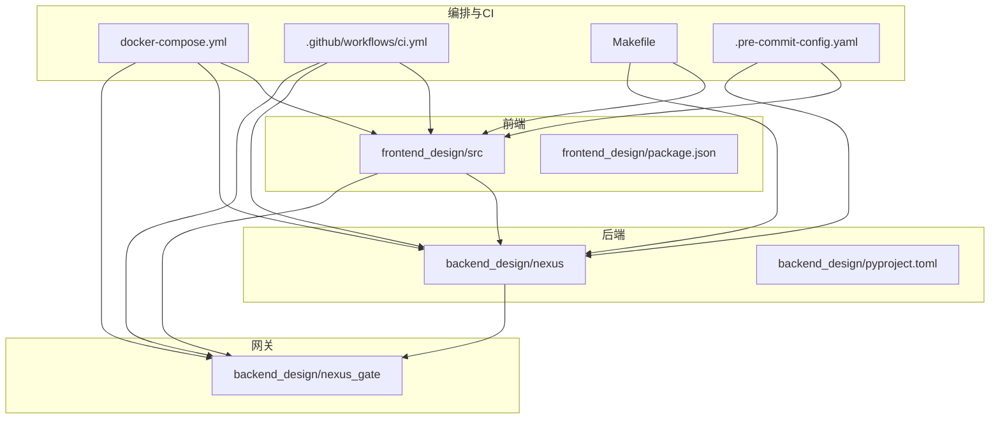
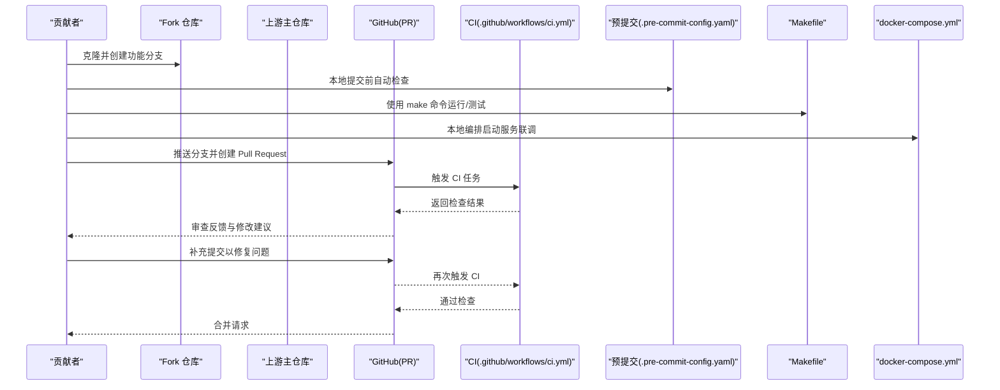
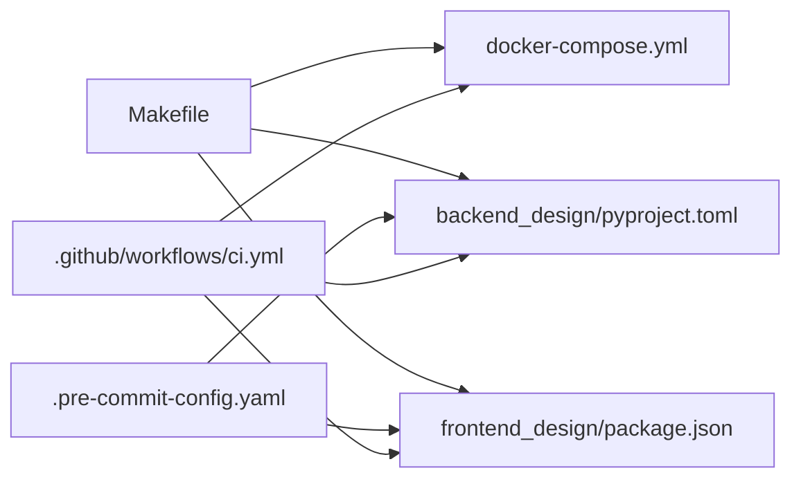

# 贡献流程与协作

<cite>
**本文引用的文件**   
- [README.md](file://README.md)
- [.github/workflows/ci.yml](file://.github/workflows/ci.yml)
- [.pre-commit-config.yaml](file://.pre-commit-config.yaml)
- [Makefile](file://Makefile)
- [docker-compose.yml](file://docker-compose.yml)
- [backend_design/pyproject.toml](file://backend_design/pyproject.toml)
- [frontend_design/package.json](file://frontend_design/package.json)
- [docs/testing/TESTING.md](file://docs/testing/TESTING.md)
</cite>

## 目录
1. [简介](#简介)
2. [项目结构](#项目结构)
3. [核心组件](#核心组件)
4. [架构总览](#架构总览)
5. [详细组件分析](#详细组件分析)
6. [依赖分析](#依赖分析)
7. [性能考虑](#性能考虑)
8. [故障排查指南](#故障排查指南)
9. [结论](#结论)
10. [附录](#附录)

## 简介
本指南面向希望为 NexusCockpit 贡献代码的开发者，聚焦于分支管理策略、Pull Request 规范、Git 工作流最佳实践、团队协作约定以及新贡献者入门路径。文档内容基于仓库现有配置与工程化脚本进行提炼，确保可操作且与当前工程一致。

## 项目结构
NexusCockpit 采用前后端分离与多语言服务组合：
- 后端（Python）：位于 backend_design/nexus，提供 API、Agent、RAG、中间件等能力
- 网关（Go）：位于 backend_design/nexus_gate，负责鉴权、限流、代理与 WebSocket 转发
- 前端（Next.js）：位于 frontend_design/src，提供控制台与交互界面
- 基础设施与编排：docker-compose.yml 统一编排服务
- CI 流水线：.github/workflows/ci.yml 定义自动化检查
- 本地开发工具链：Makefile、.pre-commit-config.yaml、各子项目包管理配置

图表来源
- [docker-compose.yml](file://docker-compose.yml)
- [.github/workflows/ci.yml](file://.github/workflows/ci.yml)
- [Makefile](file://Makefile)
- [.pre-commit-config.yaml](file://.pre-commit-config.yaml)
- [backend_design/pyproject.toml](file://backend_design/pyproject.toml)
- [frontend_design/package.json](file://frontend_design/package.json)

章节来源
- [README.md](file://README.md)
- [docker-compose.yml](file://docker-compose.yml)
- [.github/workflows/ci.yml](file://.github/workflows/ci.yml)
- [Makefile](file://Makefile)
- [.pre-commit-config.yaml](file://.pre-commit-config.yaml)
- [backend_design/pyproject.toml](file://backend_design/pyproject.toml)
- [frontend_design/package.json](file://frontend_design/package.json)

## 核心组件
本节从“贡献视角”梳理与协作相关的工程化组件及其职责：
- CI 流水线（GitHub Actions）：在 PR 触发构建与测试，保障合并质量
- 预提交钩子（Pre-commit）：在本地提交前执行格式化与静态检查
- Makefile：封装常用命令（安装依赖、运行服务、测试等），降低上手门槛
- docker-compose：一键拉起前后端与依赖服务，便于联调与演示
- 子项目包管理：pyproject.toml（Python）、package.json（Node/Next.js）用于依赖与脚本声明

章节来源
- [.github/workflows/ci.yml](file://.github/workflows/ci.yml)
- [.pre-commit-config.yaml](file://.pre-commit-config.yaml)
- [Makefile](file://Makefile)
- [docker-compose.yml](file://docker-compose.yml)
- [backend_design/pyproject.toml](file://backend_design/pyproject.toml)
- [frontend_design/package.json](file://frontend_design/package.json)

## 架构总览
下图展示贡献者在本地到远端的典型工作流，包括分支创建、PR 提交流程与 CI 校验。

图表来源
- [.github/workflows/ci.yml](file://.github/workflows/ci.yml)
- [.pre-commit-config.yaml](file://.pre-commit-config.yaml)
- [Makefile](file://Makefile)
- [docker-compose.yml](file://docker-compose.yml)

## 详细组件分析

### 分支管理策略
- 主分支保护
  - 建议将 main/master 作为受保护分支，禁止直接推送，仅允许通过 Pull Request 合并
  - 建议在 GitHub 中启用分支保护规则：要求至少一名审查者批准、强制 CI 通过、禁止撤销历史
- 功能分支命名
  - 推荐格式：<类型>/<短描述>，例如 feat/chat-api、fix/auth-bug、refactor/memory-manager
  - 类型参考：feat、fix、refactor、docs、test、chore、perf、ci、revert
- 合并请求流程
  - 在功能分支完成开发与自测后，推送至远端并创建 PR
  - PR 需关联 Issue（如有），并在描述中说明变更范围、影响面与验证方式
  - 合并前需满足：CI 全绿、至少一位维护者审查通过、无遗留冲突

章节来源
- [.github/workflows/ci.yml](file://.github/workflows/ci.yml)

### Pull Request 规范
- PR 模板
  - 若仓库未提供默认模板，请在 PR 描述中包含以下要点：背景与目标、主要变更点、影响范围、测试方法与结果、兼容性说明、回滚方案
- 代码审查标准
  - 可读性与一致性：遵循团队约定的风格与命名规范
  - 正确性与健壮性：覆盖边界条件与异常路径
  - 可维护性：模块内聚、接口清晰、避免过度耦合
  - 安全性：敏感信息不入库、输入校验、权限控制
- CI 检查要求
  - 所有 PR 必须通过 CI 流水线；如新增或修改关键逻辑，应补充相应测试用例
  - 建议在本地先运行 pre-commit 与相关测试，减少 CI 失败次数

章节来源
- [.github/workflows/ci.yml](file://.github/workflows/ci.yml)

### Git 工作流最佳实践
- Commit 消息规范
  - 建议采用约定式提交（Conventional Commits）：type(scope): subject
  - 示例类型：feat、fix、refactor、docs、test、chore、perf、ci、revert
  - 正文可包含动机、实现要点与注意事项
- Rebase 策略
  - 保持提交历史整洁：优先使用 rebase 同步上游最新改动，避免不必要的 merge commit
  - 在公共分支上谨慎 rebase；个人功能分支可自由 rebase 整理
- 版本发布流程
  - 建议使用语义化版本（SemVer）：major.minor.patch
  - 发布前打 tag，并在 Release Notes 中汇总重要变更与迁移指引
  - 结合 CI 自动生成制品或镜像（如适用）

章节来源
- [.pre-commit-config.yaml](file://.pre-commit-config.yaml)
- [Makefile](file://Makefile)

### 团队协作约定
- Issue 管理
  - 新功能与缺陷均通过 Issue 跟踪；Issue 标题简明扼要，正文包含复现步骤或需求背景
  - 使用标签分类（bug、enhancement、documentation、help wanted 等）
- 讨论沟通
  - 在 Issue 或 PR 评论中讨论技术细节，必要时发起异步语音/视频会议
  - 重要决策记录在 Issue/PR 中，形成可追溯的知识资产
- 知识分享
  - 将通用经验沉淀到 docs 目录，如部署、测试、排障等
  - 定期复盘与分享，提升团队整体效率与质量

章节来源
- [docs/testing/TESTING.md](file://docs/testing/TESTING.md)

### 新贡献者入门指南
- 环境准备
  - 安装必要工具：Git、Docker、Python 与 Node.js 运行时
  - 克隆 Fork 后的仓库，配置上游远程地址以便同步更新
- 首次运行
  - 使用 docker-compose 快速拉起服务，验证前后端连通性
  - 使用 Makefile 提供的命令安装依赖、启动服务与运行测试
- 本地开发
  - 启用 pre-commit 钩子，保证提交前完成基础检查
  - 在功能分支上进行开发与自测，确保本地通过后再推送
- 提交第一个 PR
  - 推送分支并创建 PR，填写变更说明与验证方法
  - 根据审查意见迭代修改，直至 CI 通过并获得批准

章节来源
- [docker-compose.yml](file://docker-compose.yml)
- [Makefile](file://Makefile)
- [.pre-commit-config.yaml](file://.pre-commit-config.yaml)

## 依赖分析
下图展示与贡献流程密切相关的工程化依赖关系：

图表来源
- [Makefile](file://Makefile)
- [docker-compose.yml](file://docker-compose.yml)
- [backend_design/pyproject.toml](file://backend_design/pyproject.toml)
- [frontend_design/package.json](file://frontend_design/package.json)
- [.pre-commit-config.yaml](file://.pre-commit-config.yaml)
- [.github/workflows/ci.yml](file://.github/workflows/ci.yml)

章节来源
- [Makefile](file://Makefile)
- [docker-compose.yml](file://docker-compose.yml)
- [backend_design/pyproject.toml](file://backend_design/pyproject.toml)
- [frontend_design/package.json](file://frontend_design/package.json)
- [.pre-commit-config.yaml](file://.pre-commit-config.yaml)
- [.github/workflows/ci.yml](file://.github/workflows/ci.yml)

## 性能考虑
- 在本地尽量复用 docker-compose 与缓存机制，缩短构建与测试时间
- 合理拆分提交，避免单次提交过大导致审查与回滚困难
- 对耗时较长的测试或构建任务，可在 CI 中并行化以提升吞吐

[本节为通用指导，不直接分析具体文件]

## 故障排查指南
- CI 失败
  - 查看 GitHub Actions 日志定位失败阶段（构建、测试、打包等）
  - 在本地复现相同命令，逐步缩小问题范围
- 预提交钩子报错
  - 确认已安装对应工具链与依赖，必要时重新初始化钩子
- 本地服务无法启动
  - 检查端口占用、环境变量与配置文件
  - 使用 docker-compose logs 查看容器日志

章节来源
- [.github/workflows/ci.yml](file://.github/workflows/ci.yml)
- [.pre-commit-config.yaml](file://.pre-commit-config.yaml)
- [docker-compose.yml](file://docker-compose.yml)

## 结论
通过明确的分支策略、严格的 PR 规范、完善的 CI 与本地工具链，NexusCockpit 能够高效地支持多人协作与持续交付。建议贡献者严格遵循本文流程，并结合仓库现有脚本与配置开展开发，以确保代码质量与交付稳定性。

[本节为总结性内容，不直接分析具体文件]

## 附录
- 常用命令速查（以 Makefile 为准）
  - 安装依赖、启动服务、运行测试等命令请参考 Makefile 中的目标
- 测试参考
  - 测试方法与用例组织可参考 docs/testing/TESTING.md

章节来源
- [Makefile](file://Makefile)
- [docs/testing/TESTING.md](file://docs/testing/TESTING.md)