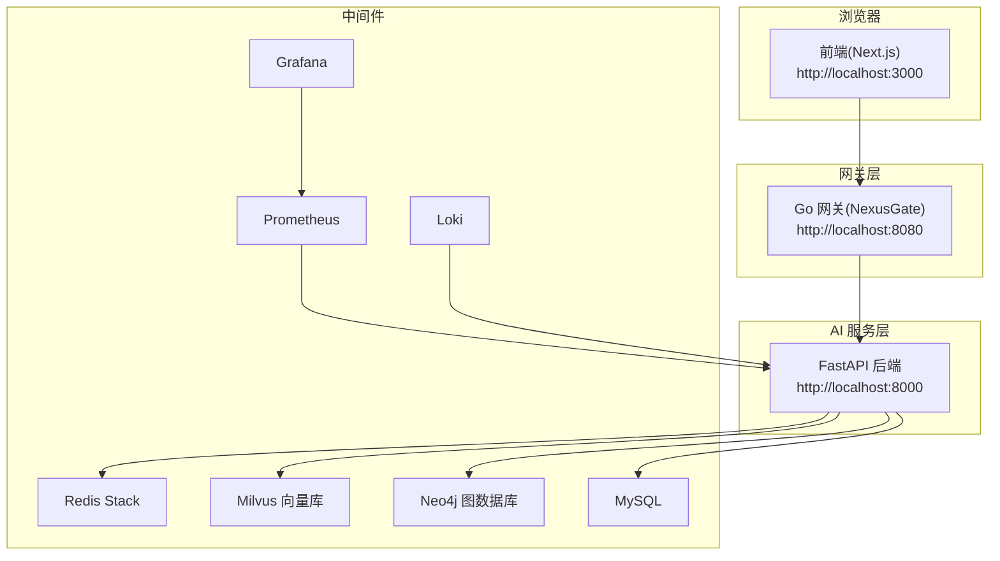
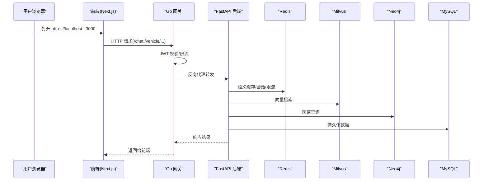
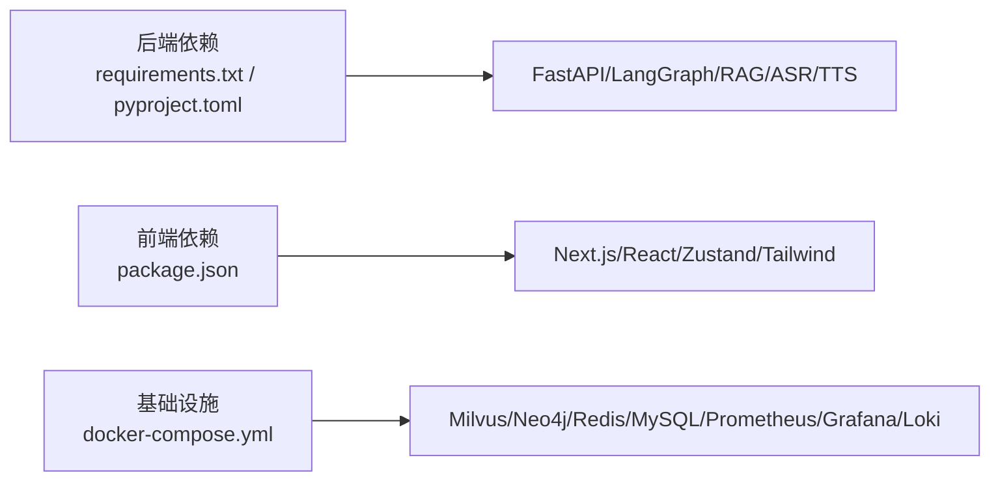

# 快速开始

<cite>
**本文引用的文件**   
- [README.md](file://README.md)
- [docker-compose.yml](file://docker-compose.yml)
- [Makefile](file://Makefile)
- [backend_design/requirements.txt](file://backend_design/requirements.txt)
- [backend_design/pyproject.toml](file://backend_design/pyproject.toml)
- [frontend_design/package.json](file://frontend_design/package.json)
- [frontend_design/next.config.js](file://frontend_design/next.config.js)
- [backend_design/nexus/main.py](file://backend_design/nexus/main.py)
- [backend_design/nexus_gate/cmd/main.go](file://backend_design/nexus_gate/cmd/main.go)
- [docs/deployment/SETUP.md](file://docs/deployment/SETUP.md)
- [docs/deployment/VERIFICATION.md](file://docs/deployment/VERIFICATION.md)
</cite>

## 目录
1. [简介](#简介)
2. [项目结构](#项目结构)
3. [核心组件](#核心组件)
4. [架构总览](#架构总览)
5. [详细步骤：从零到运行](#详细步骤从零到运行)
6. [依赖与关系分析](#依赖与关系分析)
7. [性能与稳定性建议](#性能与稳定性建议)
8. [故障排查指南](#故障排查指南)
9. [结论](#结论)
10. [附录：常用地址与API示例](#附录常用地址与api示例)

## 简介
本指南面向首次接触 NexusCockpit 的用户，提供从环境检查、项目克隆、基础设施启动、AI 模型下载、环境变量配置、后端服务启动、Go 网关启动、前端应用启动到验证的完整流程。目标是让新手在本地快速跑通“语音对话 + 车控 + 可视化”的全链路体验。

## 项目结构
NexusCockpit 采用前后端分离与多语言协作：
- 后端 AI 服务（Python/FastAPI）：负责 Agent、RAG、ASR/TTS、车控等能力
- Go 并发网关：统一鉴权、限流、WebSocket Hub、反向代理
- 前端 Next.js：座舱控制台、聊天、车控面板、设置与监控入口
- 基础设施：Milvus、Neo4j、Redis、MySQL、Prometheus、Grafana、Loki 等通过 Docker Compose 编排



图表来源
- [docker-compose.yml:1-246](file://docker-compose.yml#L1-L246)
- [backend_design/nexus/main.py:1-200](file://backend_design/nexus/main.py#L1-L200)
- [backend_design/nexus_gate/cmd/main.go:1-180](file://backend_design/nexus_gate/cmd/main.go#L1-L180)
- [frontend_design/next.config.js:1-21](file://frontend_design/next.config.js#L1-L21)

章节来源
- [README.md:95-143](file://README.md#L95-L143)
- [docker-compose.yml:1-246](file://docker-compose.yml#L1-L246)

## 核心组件
- Python FastAPI 后端：加载配置、初始化 Embedding/向量/图谱存储、语义缓存、限流、会话存储、Agent 工作流、技能注册、检索器、指标与追踪等
- Go 网关：JWT 鉴权、座舱级令牌桶限流、非 AI 请求直接处理、AI 请求反向代理、WebSocket Hub
- 前端 Next.js：仪表盘、聊天、车控面板、设置；默认直连网关或后端（可配置）

章节来源
- [backend_design/nexus/main.py:1-200](file://backend_design/nexus/main.py#L1-L200)
- [backend_design/nexus_gate/cmd/main.go:1-180](file://backend_design/nexus_gate/cmd/main.go#L1-L180)
- [frontend_design/package.json:1-45](file://frontend_design/package.json#L1-L45)
- [frontend_design/next.config.js:1-21](file://frontend_design/next.config.js#L1-L21)

## 架构总览
下图展示典型请求路径：前端 → Go 网关 → FastAPI 后端 → 中间件（Redis/Milvus/Neo4j/MySQL），并输出指标与日志。



图表来源
- [backend_design/nexus/main.py:1-200](file://backend_design/nexus/main.py#L1-L200)
- [backend_design/nexus_gate/cmd/main.go:1-180](file://backend_design/nexus_gate/cmd/main.go#L1-L180)
- [docker-compose.yml:1-246](file://docker-compose.yml#L1-L246)

## 详细步骤：从零到运行

### 1. 环境要求检查
- Python 3.10+
- Go 1.21+
- Node.js 18+
- Docker 24+ 与 Docker Compose 2.20+
- Git 2.30+

说明：
- 后端依赖见 requirements.txt 与 pyproject.toml
- 前端依赖见 package.json
- 版本要求参考 README 与 SETUP 文档

章节来源
- [README.md:146-158](file://README.md#L146-L158)
- [backend_design/requirements.txt:1-99](file://backend_design/requirements.txt#L1-L99)
- [backend_design/pyproject.toml:1-86](file://backend_design/pyproject.toml#L1-L86)
- [frontend_design/package.json:1-45](file://frontend_design/package.json#L1-L45)
- [docs/deployment/SETUP.md:22-48](file://docs/deployment/SETUP.md#L22-L48)

### 2. 克隆项目
```bash
git clone https://github.com/zmdhdu/NexusCockpit.git
cd NexusCockpit
```

章节来源
- [README.md:159-164](file://README.md#L159-L164)

### 3. 启动基础设施（Docker Compose）
```bash
docker compose up -d
docker compose ps
```
预期所有中间件为 running 状态。

章节来源
- [README.md:166-178](file://README.md#L166-L178)
- [docker-compose.yml:90-246](file://docker-compose.yml#L90-L246)

### 4. 安装后端环境
```bash
python -m venv .venv
# Windows PowerShell: .\.venv\Scripts\Activate.ps1
# Linux/macOS: source .venv/bin/activate

pip install --upgrade pip setuptools wheel
pip install torch torchaudio --index-url https://download.pytorch.org/whl/cpu
pip install -r backend_design/requirements.txt
```
或使用 Makefile：
```bash
make install
```

章节来源
- [docs/deployment/SETUP.md:94-141](file://docs/deployment/SETUP.md#L94-L141)
- [Makefile:36-48](file://Makefile#L36-L48)
- [backend_design/requirements.txt:1-99](file://backend_design/requirements.txt#L1-L99)

### 5. 下载 AI 模型（SenseVoice、CAM++、CosyVoice）
```bash
pip install modelscope

# SenseVoice ASR
modelscope download --model iic/SenseVoiceSmall --local_dir ./models/asr/sensevoice

# CAM++ 声纹
modelscope download --model iic/speech_campplus_sv_zh-cn_3dspeaker_16k --local_dir ./models/sv/cam_plus

# CosyVoice TTS（约 3.5GB）
modelscope download --model iic/CosyVoice-300M --local_dir ./models/tts/cosyvoice
```

章节来源
- [README.md:200-216](file://README.md#L200-L216)
- [docs/deployment/SETUP.md:193-301](file://docs/deployment/SETUP.md#L193-L301)

### 6. 配置环境变量
```bash
cp .env.example .env
```
编辑 .env，至少填写：
- ARK_API_KEY、ARK_BASE_URL、LLM_MODEL、EMBEDDING_MODEL、EMBEDDING_DIM
- 可选：各 PROVIDER 开关（VECTOR_STORE_PROVIDER、GRAPH_STORE_PROVIDER、CACHE_PROVIDER、RERANKER_PROVIDER）

章节来源
- [README.md:218-247](file://README.md#L218-L247)
- [docs/deployment/SETUP.md:304-357](file://docs/deployment/SETUP.md#L304-L357)

### 7. 初始化数据库（可选但推荐）
```bash
cd backend_design && python -m scripts.init_milvus
cd backend_design && python -m scripts.init_neo4j
```

章节来源
- [docs/deployment/SETUP.md:360-390](file://docs/deployment/SETUP.md#L360-L390)
- [Makefile:94-97](file://Makefile#L94-L97)

### 8. 启动后端服务（FastAPI）
方式一（推荐开发模式）：
```bash
cd backend_design
uvicorn nexus.main:app --host 0.0.0.0 --port 8000 --reload
```
方式二（使用 Makefile）：
```bash
make dev
```
健康检查：
```bash
curl http://localhost:8000/health
```

章节来源
- [README.md:249-268](file://README.md#L249-L268)
- [backend_design/nexus/main.py:1-200](file://backend_design/nexus/main.py#L1-L200)
- [Makefile:60-61](file://Makefile#L60-L61)

### 9. 启动 Go 网关（NexusGate）
方式一（直接运行）：
```bash
cd backend_design/nexus_gate
go run cmd/main.go
```
方式二（编译后运行）：
```bash
go build -o nexus_gate cmd/main.go
./nexus_gate --env ../.env
```
健康检查：
```bash
curl http://localhost:8080/health
```

章节来源
- [README.md:269-287](file://README.md#L269-L287)
- [backend_design/nexus_gate/cmd/main.go:1-180](file://backend_design/nexus_gate/cmd/main.go#L1-L180)

### 10. 启动前端应用（Next.js）
```bash
cd frontend_design
npm install
npm run dev
```
或使用 Makefile：
```bash
make install-frontend
make dev-frontend
```

章节来源
- [README.md:289-306](file://README.md#L289-L306)
- [frontend_design/package.json:1-45](file://frontend_design/package.json#L1-L45)
- [Makefile:50-64](file://Makefile#L50-L64)

### 11. 访问与验证
- 前端界面：http://localhost:3000/cockpit
- API 文档：http://localhost:8000/docs
- 后端健康：http://localhost:8000/health
- 网关健康：http://localhost:8080/health
- Grafana：http://localhost:3001（admin/admin）
- Prometheus：http://localhost:9090

章节来源
- [README.md:308-318](file://README.md#L308-L318)

## 依赖与关系分析
- 后端依赖：FastAPI、LangGraph、PyMilvus、Neo4j、Redis、Pydantic Settings、FunASR、ModelScope、Torchaudio 等
- 前端依赖：Next.js 14、React 18、Zustand、Tailwind 等
- 基础设施：Milvus、Neo4j、Redis、MySQL、Prometheus、Grafana、Loki



图表来源
- [backend_design/requirements.txt:1-99](file://backend_design/requirements.txt#L1-L99)
- [backend_design/pyproject.toml:1-86](file://backend_design/pyproject.toml#L1-L86)
- [frontend_design/package.json:1-45](file://frontend_design/package.json#L1-L45)
- [docker-compose.yml:90-246](file://docker-compose.yml#L90-L246)

章节来源
- [backend_design/requirements.txt:1-99](file://backend_design/requirements.txt#L1-L99)
- [backend_design/pyproject.toml:1-86](file://backend_design/pyproject.toml#L1-L86)
- [frontend_design/package.json:1-45](file://frontend_design/package.json#L1-L45)
- [docker-compose.yml:1-246](file://docker-compose.yml#L1-L246)

## 性能与稳定性建议
- 优先使用 Redis 语义缓存命中，减少 LLM 调用
- 合理设置 LLM 并发限制与超时，避免雪崩
- 对 Milvus/Neo4j 连接失败做降级与重试
- 使用 Prometheus + Grafana 观察关键指标（延迟、命中率、错误率）
- 生产部署时增加 workers 数量与资源配额

[本节为通用建议，不直接分析具体文件]

## 故障排查指南
- Docker 启动失败：检查端口占用与服务状态
- Milvus 连接失败：等待容器完全就绪后再试
- 模型加载失败：确认模型路径与相对路径解析
- GPU 不可用：检查 CUDA 驱动与 PyTorch 安装源
- 虚拟环境激活失败（Windows）：调整执行策略
- pip 安装超时：切换国内镜像源

章节来源
- [docs/deployment/SETUP.md:464-527](file://docs/deployment/SETUP.md#L464-L527)
- [docs/deployment/VERIFICATION.md:629-705](file://docs/deployment/VERIFICATION.md#L629-L705)

## 结论
按照本指南完成环境准备、基础设施启动、模型下载与环境变量配置后，即可依次启动后端、网关与前端，并通过健康检查与基础 API 验证全链路可用性。建议在后续使用中结合监控看板与日志系统持续优化性能与稳定性。

[本节为总结性内容，不直接分析具体文件]

## 附录：常用地址与API示例
- 获取 JWT Token
- 文本对话（非流式）
- SSE 流式对话
- 车控命令
- WebSocket 连接

章节来源
- [README.md:369-413](file://README.md#L369-L413)