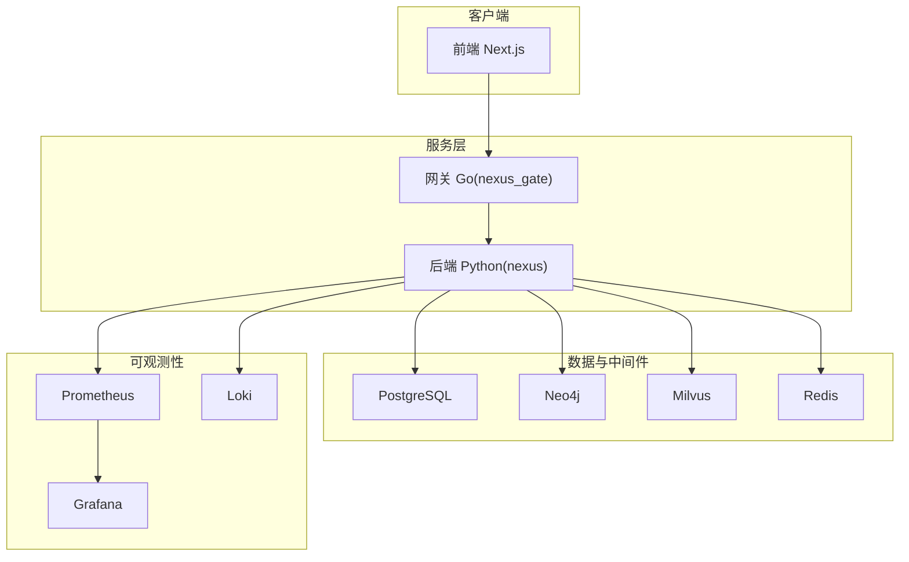
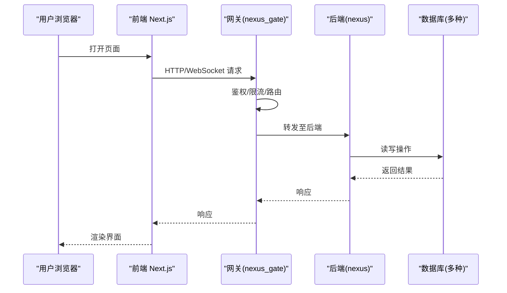
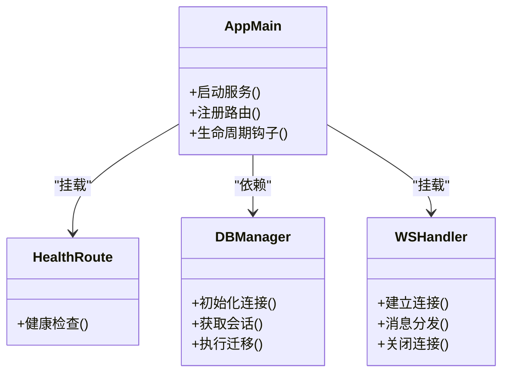
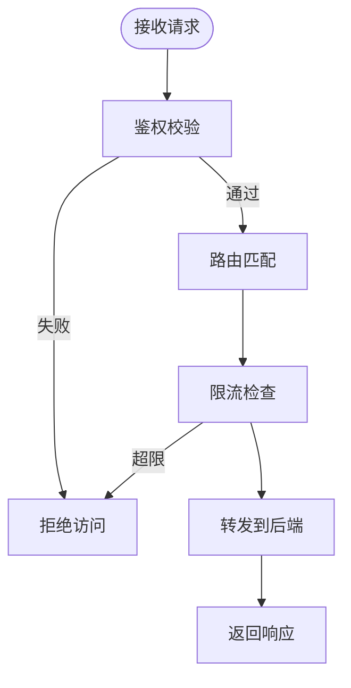
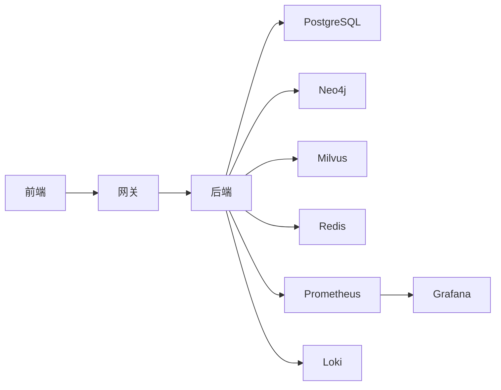

# 快速开始

<cite>
**本文引用的文件**   
- [docker-compose.yml](file://docker-compose.yml)
- [backend_design/nexus/main.py](file://backend_design/nexus/main.py)
- [backend_design/nexus/config.py](file://backend_design/nexus/config.py)
- [backend_design/nexus/core/db_manager.py](file://backend_design/nexus/core/db_manager.py)
- [backend_design/nexus/api/routes/health.py](file://backend_design/nexus/api/routes/health.py)
- [backend_design/nexus/api/websocket.py](file://backend_design/nexus/api/websocket.py)
- [backend_design/nexus_gate/cmd/main.go](file://backend_design/nexus_gate/cmd/main.go)
- [backend_design/nexus_gate/internal/config/config.go](file://backend_design/nexus_gate/internal/config/config.go)
- [backend_design/Dockerfile](file://backend_design/Dockerfile)
- [frontend_design/package.json](file://frontend_design/package.json)
- [frontend_design/Dockerfile](file://frontend_design/Dockerfile)
- [config/grafana/provisioning/datasources/prometheus.yml](file://config/grafana/provisioning/datasources/prometheus.yml)
- [config/grafana/provisioning/dashboards/dashboards.yml](file://config/grafana/provisioning/dashboards/dashboards.yml)
- [config/prometheus/prometheus.yml](file://config/prometheus/prometheus.yml)
- [backend_design/scripts/init_neo4j.py](file://backend_design/scripts/init_neo4j.py)
- [backend_design/scripts/init_milvus.py](file://backend_design/scripts/init_milvus.py)
- [models/asr/sensevoice/configuration.json](file://models/asr/sensevoice/configuration.json)
- [models/tts/cosyvoice/configuration.json](file://models/tts/cosyvoice/configuration.json)
- [models/reranker/bge-reranker-v2-m3/configuration.json](file://models/reranker/bge-reranker-v2-m3/configuration.json)
- [models/sv/cam_plus/configuration.json](file://models/sv/cam_plus/configuration.json)
- [README.md](file://README.md)
</cite>

## 目录
1. [简介](#简介)
2. [项目结构](#项目结构)
3. [核心组件](#核心组件)
4. [架构总览](#架构总览)
5. [详细组件分析](#详细组件分析)
6. [依赖关系分析](#依赖关系分析)
7. [性能与资源建议](#性能与资源建议)
8. [故障排除指南](#故障排除指南)
9. [结论](#结论)
10. [附录](#附录) 

## 简介
本指南面向初次接触 NexusCockpit 的用户，提供从零到一的环境搭建、服务启动与验证流程。你将完成以下目标：
- 使用 Docker Compose 一键拉起后端、网关、数据库与可观测性组件
- 初始化图数据库与向量数据库
- 准备本地模型（ASR/TTS/Reranker/声纹）并配置路径
- 启动前端开发环境并进行基本功能验证
- 常见问题的定位与解决思路

## 项目结构
NexusCockpit 采用前后端分离与多语言微服务组合：
- 后端服务：Python FastAPI 应用，包含 API、WebSocket、Agent、RAG、记忆、技能等模块
- 网关服务：Go 实现的轻量网关，负责鉴权、限流、代理与 WebSocket Hub
- 前端应用：Next.js 应用，提供聊天、座舱、车辆控制、数据平台等页面
- 基础设施：PostgreSQL、Neo4j、Milvus、Redis、Prometheus/Grafana/Loki 等
- 模型资产：ASR、TTS、Reranker、声纹等模型配置文件位于 models 目录

图表来源
- [docker-compose.yml](file://docker-compose.yml)
- [backend_design/nexus/main.py](file://backend_design/nexus/main.py)
- [backend_design/nexus_gate/cmd/main.go](file://backend_design/nexus_gate/cmd/main.go)

章节来源
- [README.md](file://README.md)

## 核心组件
- 后端服务（nexus）
  - 入口与路由注册、生命周期管理
  - 健康检查与健康探针
  - 数据库连接管理与迁移
  - WebSocket 长连接支持
- 网关服务（nexus_gate）
  - 请求转发、鉴权、限流
  - WebSocket Hub 转发
- 前端应用（Next.js）
  - 页面与组件组织
  - 与后端 API/WebSocket 的交互
- 可观测性
  - Prometheus 抓取指标
  - Grafana 仪表盘与数据源
  - Loki 日志采集

章节来源
- [backend_design/nexus/main.py](file://backend_design/nexus/main.py)
- [backend_design/nexus/api/routes/health.py](file://backend_design/nexus/api/routes/health.py)
- [backend_design/nexus/api/websocket.py](file://backend_design/nexus/api/websocket.py)
- [backend_design/nexus/core/db_manager.py](file://backend_design/nexus/core/db_manager.py)
- [backend_design/nexus_gate/cmd/main.go](file://backend_design/nexus_gate/cmd/main.go)
- [config/grafana/provisioning/datasources/prometheus.yml](file://config/grafana/provisioning/datasources/prometheus.yml)
- [config/grafana/provisioning/dashboards/dashboards.yml](file://config/grafana/provisioning/dashboards/dashboards.yml)
- [config/prometheus/prometheus.yml](file://config/prometheus/prometheus.yml)

## 架构总览
下图展示了从浏览器到后端服务的完整调用链，包括网关转发、鉴权、业务处理与数据访问。

图表来源
- [backend_design/nexus_gate/cmd/main.go](file://backend_design/nexus_gate/cmd/main.go)
- [backend_design/nexus/main.py](file://backend_design/nexus/main.py)
- [backend_design/nexus/api/websocket.py](file://backend_design/nexus/api/websocket.py)

## 详细组件分析

### 后端服务（nexus）
- 启动与配置
  - 通过入口脚本加载配置、注册路由、启动服务
  - 关键配置项由配置模块集中管理
- 健康检查
  - 暴露健康检查接口，便于编排系统探测存活状态
- 数据库管理
  - 封装连接池、会话管理、迁移执行
- WebSocket
  - 提供实时通信能力，供前端语音、遥测等场景使用

图表来源
- [backend_design/nexus/main.py](file://backend_design/nexus/main.py)
- [backend_design/nexus/api/routes/health.py](file://backend_design/nexus/api/routes/health.py)
- [backend_design/nexus/core/db_manager.py](file://backend_design/nexus/core/db_manager.py)
- [backend_design/nexus/api/websocket.py](file://backend_design/nexus/api/websocket.py)

章节来源
- [backend_design/nexus/main.py](file://backend_design/nexus/main.py)
- [backend_design/nexus/config.py](file://backend_design/nexus/config.py)
- [backend_design/nexus/api/routes/health.py](file://backend_design/nexus/api/routes/health.py)
- [backend_design/nexus/core/db_manager.py](file://backend_design/nexus/core/db_manager.py)
- [backend_design/nexus/api/websocket.py](file://backend_design/nexus/api/websocket.py)

### 网关服务（nexus_gate）
- 职责
  - 统一入口、鉴权校验、速率限制、请求转发
  - WebSocket Hub 维护与广播
- 配置
  - 通过配置模块加载端口、上游地址、鉴权策略等

图表来源
- [backend_design/nexus_gate/cmd/main.go](file://backend_design/nexus_gate/cmd/main.go)
- [backend_design/nexus_gate/internal/config/config.go](file://backend_design/nexus_gate/internal/config/config.go)

章节来源
- [backend_design/nexus_gate/cmd/main.go](file://backend_design/nexus_gate/cmd/main.go)
- [backend_design/nexus_gate/internal/config/config.go](file://backend_design/nexus_gate/internal/config/config.go)

### 前端应用（Next.js）
- 运行方式
  - 安装依赖后启动开发服务器
  - 构建镜像用于容器化部署
- 主要页面
  - 聊天、座舱、车辆控制、数据平台、设置等

章节来源
- [frontend_design/package.json](file://frontend_design/package.json)
- [frontend_design/Dockerfile](file://frontend_design/Dockerfile)

### 可观测性（Prometheus/Grafana/Loki）
- 指标采集
  - Prometheus 抓取后端暴露的指标
- 可视化
  - Grafana 预置数据源与仪表盘
- 日志
  - Loki 收集后端日志，便于问题排查

章节来源
- [config/prometheus/prometheus.yml](file://config/prometheus/prometheus.yml)
- [config/grafana/provisioning/datasources/prometheus.yml](file://config/grafana/provisioning/datasources/prometheus.yml)
- [config/grafana/provisioning/dashboards/dashboards.yml](file://config/grafana/provisioning/dashboards/dashboards.yml)

## 依赖关系分析
- 外部依赖
  - 数据库：PostgreSQL、Neo4j、Milvus
  - 缓存与会话：Redis
  - 可观测性：Prometheus、Grafana、Loki
- 内部依赖
  - 前端依赖后端 API 与 WebSocket
  - 网关依赖后端服务
  - 后端依赖各类数据库与中间件

图表来源
- [docker-compose.yml](file://docker-compose.yml)

章节来源
- [docker-compose.yml](file://docker-compose.yml)

## 性能与资源建议
- CPU/内存
  - 后端与模型推理对 CPU/内存有一定要求，建议至少 4 核 8GB 起步
- 磁盘空间
  - 模型文件与向量索引会占用较多空间，预留足够容量
- 网络
  - 确保各容器间网络互通，避免跨主机延迟过高
- 并发与限流
  - 根据实际负载调整网关限流阈值与后端线程池参数

[本节为通用指导，无需代码引用]

## 故障排除指南
- 服务无法启动
  - 检查端口冲突与容器网络连通性
  - 查看后端与网关日志输出
- 健康检查失败
  - 确认后端健康接口可达
  - 检查数据库连接配置与权限
- 模型加载失败
  - 确认模型配置文件存在且路径正确
  - 检查磁盘空间与读取权限
- 向量检索异常
  - 检查 Milvus 服务状态与集合创建情况
- 图查询异常
  - 检查 Neo4j 服务状态与初始数据导入是否成功
- 前端无法连接后端
  - 检查网关与后端地址配置
  - 确认 CORS 与鉴权策略

章节来源
- [backend_design/nexus/api/routes/health.py](file://backend_design/nexus/api/routes/health.py)
- [backend_design/nexus/core/db_manager.py](file://backend_design/nexus/core/db_manager.py)
- [backend_design/nexus_gate/cmd/main.go](file://backend_design/nexus_gate/cmd/main.go)
- [models/asr/sensevoice/configuration.json](file://models/asr/sensevoice/configuration.json)
- [models/tts/cosyvoice/configuration.json](file://models/tts/cosyvoice/configuration.json)
- [models/reranker/bge-reranker-v2-m3/configuration.json](file://models/reranker/bge-reranker-v2-m3/configuration.json)
- [models/sv/cam_plus/configuration.json](file://models/sv/cam_plus/configuration.json)

## 结论
通过本指南，你已完成 NexusCockpit 的基础环境搭建与服务启动，并对核心组件与依赖关系有了整体认识。后续可根据业务需求扩展模型、技能与仪表盘，逐步完善系统能力。

[本节为总结性内容，无需代码引用]

## 附录

### 环境准备清单
- 操作系统：Linux/macOS/Windows（推荐 Linux）
- Docker 与 Docker Compose
- Node.js（仅本地前端开发需要）
- 足够的磁盘空间以存放模型与数据

[本节为通用说明，无需代码引用]

### 一键启动服务
- 在仓库根目录执行 docker compose 启动命令
- 等待所有服务就绪后，访问前端页面进行体验

章节来源
- [docker-compose.yml](file://docker-compose.yml)

### 初始化数据库与模型
- 初始化图数据库
  - 执行脚本以创建必要的节点与关系
- 初始化向量数据库
  - 执行脚本以创建集合与基础索引
- 准备本地模型
  - 将 ASR/TTS/Reranker/声纹模型放置于 models 目录
  - 核对各模型的 configuration.json 中的路径与参数

章节来源
- [backend_design/scripts/init_neo4j.py](file://backend_design/scripts/init_neo4j.py)
- [backend_design/scripts/init_milvus.py](file://backend_design/scripts/init_milvus.py)
- [models/asr/sensevoice/configuration.json](file://models/asr/sensevoice/configuration.json)
- [models/tts/cosyvoice/configuration.json](file://models/tts/cosyvoice/configuration.json)
- [models/reranker/bge-reranker-v2-m3/configuration.json](file://models/reranker/bge-reranker-v2-m3/configuration.json)
- [models/sv/cam_plus/configuration.json](file://models/sv/cam_plus/configuration.json)

### 配置要点
- 后端配置
  - 数据库连接、模型路径、中间件开关等
- 网关配置
  - 监听端口、上游地址、鉴权策略、限流阈值
- 可观测性配置
  - Prometheus 抓取目标、Grafana 数据源与仪表盘

章节来源
- [backend_design/nexus/config.py](file://backend_design/nexus/config.py)
- [backend_design/nexus_gate/internal/config/config.go](file://backend_design/nexus_gate/internal/config/config.go)
- [config/prometheus/prometheus.yml](file://config/prometheus/prometheus.yml)
- [config/grafana/provisioning/datasources/prometheus.yml](file://config/grafana/provisioning/datasources/prometheus.yml)
- [config/grafana/provisioning/dashboards/dashboards.yml](file://config/grafana/provisioning/dashboards/dashboards.yml)

### 构建与部署
- 后端镜像构建
  - 基于后端 Dockerfile 构建镜像
- 前端镜像构建
  - 基于前端 Dockerfile 构建镜像
- 生产环境部署
  - 结合编排工具（如 Kubernetes）进行滚动升级与扩缩容

章节来源
- [backend_design/Dockerfile](file://backend_design/Dockerfile)
- [frontend_design/Dockerfile](file://frontend_design/Dockerfile)

### 基本运行验证
- 健康检查
  - 调用后端健康接口，确认服务存活
- 前端页面
  - 访问首页与聊天页面，验证基本交互
- 可观测性
  - 打开 Grafana 仪表盘，确认指标与日志可见

章节来源
- [backend_design/nexus/api/routes/health.py](file://backend_design/nexus/api/routes/health.py)
- [frontend_design/package.json](file://frontend_design/package.json)
- [config/grafana/provisioning/dashboards/dashboards.yml](file://config/grafana/provisioning/dashboards/dashboards.yml)