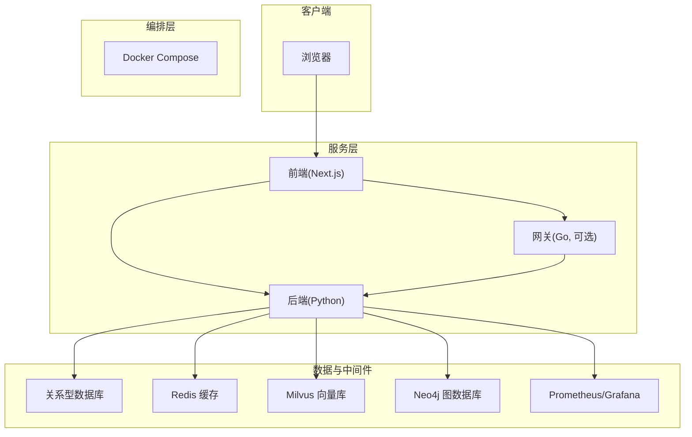
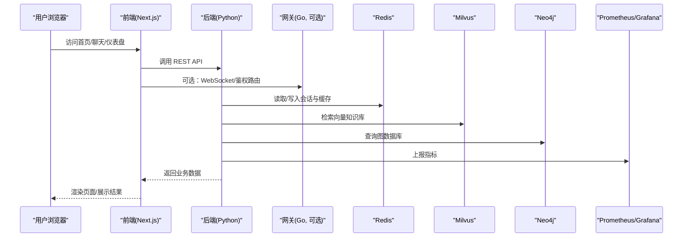
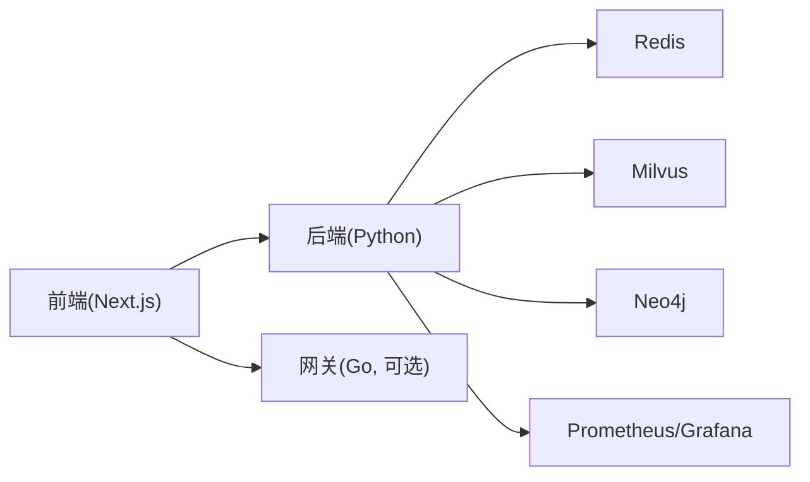

# 快速开始

<cite>
**本文引用的文件**   
- [docker-compose.yml](file://docker-compose.yml)
- [README.md](file://README.md)
- [backend_design/Dockerfile](file://backend_design/Dockerfile)
- [frontend_design/Dockerfile](file://frontend_design/Dockerfile)
- [backend_design/pyproject.toml](file://backend_design/pyproject.toml)
- [backend_design/requirements.txt](file://backend_design/requirements.txt)
- [backend_design/nexus/main.py](file://backend_design/nexus/main.py)
- [backend_design/nexus/config.py](file://backend_design/nexus/config.py)
- [backend_design/nexus/core/db_manager.py](file://backend_design/nexus/core/db_manager.py)
- [backend_design/scripts/init_neo4j.py](file://backend_design/scripts/init_neo4j.py)
- [backend_design/scripts/init_milvus.py](file://backend_design/scripts/init_milvus.py)
- [scripts/start-backend.ps1](file://scripts/start-backend.ps1)
- [scripts/start-frontend.ps1](file://scripts/start-frontend.ps1)
- [scripts/start-gateway.ps1](file://scripts/start-gateway.ps1)
- [Makefile](file://Makefile)
- [config/prometheus/prometheus.yml](file://config/prometheus/prometheus.yml)
- [config/grafana/provisioning/datasources/prometheus.yml](file://config/grafana/provisioning/datasources/prometheus.yml)
- [config/grafana/provisioning/dashboards/dashboards.yml](file://config/grafana/provisioning/dashboards/dashboards.yml)
- [config/grafana/provisioning/dashboards/nexuscockpit-overview.json](file://config/grafana/provisioning/dashboards/nexuscockpit-overview.json)
- [backend_design/nexus/api/websocket.py](file://backend_design/nexus/api/websocket.py)
- [backend_design/nexus/middleware/session_store.py](file://backend_design/nexus/middleware/session_store.py)
- [backend_design/nexus/middleware/redis_cache.py](file://backend_design/nexus/middleware/redis_cache.py)
- [backend_design/nexus/observability/metrics.py](file://backend_design/nexus/observability/metrics.py)
</cite>

## 目录
1. [简介](#简介)
2. [项目结构](#项目结构)
3. [核心组件](#核心组件)
4. [架构总览](#架构总览)
5. [详细组件分析](#详细组件分析)
6. [依赖分析](#依赖分析)
7. [性能考虑](#性能考虑)
8. [故障排查指南](#故障排查指南)
9. [结论](#结论)
10. [附录](#附录)

## 简介
本指南面向首次接触 NexusCockpit 的用户，提供从零开始的完整部署体验。内容涵盖：
- Docker 环境准备与一键启动
- 开发环境搭建（Python、Node.js）
- 数据库与中间件初始化
- 手动部署步骤
- 常见问题排查
- 基本功能验证

通过本指南，你将能够在本地或服务器环境中快速运行系统并验证核心能力。

## 项目结构
NexusCockpit 采用前后端分离与多服务编排的架构：
- 后端服务：基于 Python 的后端 API、Agent、RAG、技能等模块
- 前端应用：Next.js 构建的前端界面
- 网关服务：Go 实现的轻量网关（可选）
- 基础设施：Docker Compose 编排容器化服务（数据库、缓存、向量库、图数据库、可观测性组件等）

图表来源
- [docker-compose.yml](file://docker-compose.yml)
- [backend_design/Dockerfile](file://backend_design/Dockerfile)
- [frontend_design/Dockerfile](file://frontend_design/Dockerfile)

章节来源
- [README.md](file://README.md)
- [docker-compose.yml](file://docker-compose.yml)

## 核心组件
- 后端服务
  - 入口与配置：主程序入口与配置加载
  - 数据库管理：连接池、迁移与初始化
  - 会话与缓存：基于 Redis 的会话存储与缓存
  - 可观测性：指标采集与导出
- 前端应用
  - Next.js 应用，负责用户交互与页面渲染
- 网关服务
  - Go 实现，提供鉴权、限流、代理与 WebSocket 转发能力（可选）
- 基础设施
  - 数据库、缓存、向量库、图数据库、监控与日志

章节来源
- [backend_design/nexus/main.py](file://backend_design/nexus/main.py)
- [backend_design/nexus/config.py](file://backend_design/nexus/config.py)
- [backend_design/nexus/core/db_manager.py](file://backend_design/nexus/core/db_manager.py)
- [backend_design/nexus/middleware/session_store.py](file://backend_design/nexus/middleware/session_store.py)
- [backend_design/nexus/middleware/redis_cache.py](file://backend_design/nexus/middleware/redis_cache.py)
- [backend_design/nexus/observability/metrics.py](file://backend_design/nexus/observability/metrics.py)
- [backend_design/Dockerfile](file://backend_design/Dockerfile)
- [frontend_design/Dockerfile](file://frontend_design/Dockerfile)

## 架构总览
下图展示了从浏览器到各服务的请求路径以及关键依赖关系。

图表来源
- [backend_design/nexus/api/websocket.py](file://backend_design/nexus/api/websocket.py)
- [backend_design/nexus/middleware/redis_cache.py](file://backend_design/nexus/middleware/redis_cache.py)
- [backend_design/nexus/observability/metrics.py](file://backend_design/nexus/observability/metrics.py)
- [docker-compose.yml](file://docker-compose.yml)

## 详细组件分析

### 环境准备与一键启动（推荐）
- 前置条件
  - 安装 Docker 与 Docker Compose
  - 确保端口未被占用（默认由 docker-compose 映射）
- 一键启动
  - 在项目根目录执行编排命令以拉起所有服务
  - 等待服务就绪后，打开浏览器访问前端地址
- 停止服务
  - 使用编排命令停止并清理容器

章节来源
- [docker-compose.yml](file://docker-compose.yml)
- [README.md](file://README.md)

### 开发环境搭建（Python + Node.js）
- Python 环境
  - 使用项目提供的依赖清单进行安装
  - 建议创建虚拟环境以避免冲突
- Node.js 环境
  - 安装 Node.js 与包管理器
  - 进入前端目录安装依赖并启动开发服务器
- 数据库与中间件初始化
  - 使用脚本初始化 Neo4j 与 Milvus 所需的数据结构与索引
  - 确保相关服务已启动且网络可达

章节来源
- [backend_design/requirements.txt](file://backend_design/requirements.txt)
- [backend_design/pyproject.toml](file://backend_design/pyproject.toml)
- [backend_design/scripts/init_neo4j.py](file://backend_design/scripts/init_neo4j.py)
- [backend_design/scripts/init_milvus.py](file://backend_design/scripts/init_milvus.py)
- [frontend_design/package.json](file://frontend_design/package.json)

### 手动部署步骤
- 构建镜像
  - 分别构建后端与前端镜像
- 配置环境变量
  - 根据实际部署环境调整数据库、缓存、向量库、图数据库的连接参数
- 启动服务
  - 使用编排文件或容器命令启动各服务
- 验证服务
  - 检查健康检查接口与前端页面是否正常

章节来源
- [backend_design/Dockerfile](file://backend_design/Dockerfile)
- [frontend_design/Dockerfile](file://frontend_design/Dockerfile)
- [docker-compose.yml](file://docker-compose.yml)

### 一键启动脚本使用方法
- Windows PowerShell 脚本
  - 后端启动脚本：用于在本地直接运行后端服务（非容器）
  - 前端启动脚本：用于在本地直接运行前端开发服务器
  - 网关启动脚本：用于在本地直接运行网关服务（可选）
- 使用方式
  - 在对应目录下执行脚本，按提示完成依赖安装与服务启动
  - 适用于本地开发与调试场景

章节来源
- [scripts/start-backend.ps1](file://scripts/start-backend.ps1)
- [scripts/start-frontend.ps1](file://scripts/start-frontend.ps1)
- [scripts/start-gateway.ps1](file://scripts/start-gateway.ps1)

### Makefile 常用任务
- 提供便捷的任务入口，如构建、启动、测试等
- 适合在多服务环境下统一操作

章节来源
- [Makefile](file://Makefile)

## 依赖分析
- 外部依赖
  - 数据库：关系型数据库（由编排文件定义）
  - 缓存与会话：Redis
  - 向量检索：Milvus
  - 图数据库：Neo4j
  - 可观测性：Prometheus 与 Grafana
- 内部依赖
  - 后端依赖中间件（会话、缓存）、模型与工具模块
  - 前端依赖后端 API 与可选网关

图表来源
- [docker-compose.yml](file://docker-compose.yml)
- [config/prometheus/prometheus.yml](file://config/prometheus/prometheus.yml)
- [config/grafana/provisioning/datasources/prometheus.yml](file://config/grafana/provisioning/datasources/prometheus.yml)
- [config/grafana/provisioning/dashboards/dashboards.yml](file://config/grafana/provisioning/dashboards/dashboards.yml)
- [config/grafana/provisioning/dashboards/nexuscockpit-overview.json](file://config/grafana/provisioning/dashboards/nexuscockpit-overview.json)

章节来源
- [docker-compose.yml](file://docker-compose.yml)
- [config/prometheus/prometheus.yml](file://config/prometheus/prometheus.yml)
- [config/grafana/provisioning/datasources/prometheus.yml](file://config/grafana/provisioning/datasources/prometheus.yml)
- [config/grafana/provisioning/dashboards/dashboards.yml](file://config/grafana/provisioning/dashboards/dashboards.yml)
- [config/grafana/provisioning/dashboards/nexuscockpit-overview.json](file://config/grafana/provisioning/dashboards/nexuscockpit-overview.json)

## 性能考虑
- 合理设置连接池大小与超时时间，避免资源耗尽
- 对高频读路径启用缓存，降低数据库压力
- 向量检索与图查询需关注索引与查询复杂度
- 开启指标采集与告警，便于定位瓶颈
- 前端静态资源与 CDN 加速可提升首屏性能

[本节为通用指导，不直接分析具体文件]

## 故障排查指南
- 服务无法启动
  - 检查端口占用与防火墙规则
  - 查看容器日志与编排状态
- 数据库连接失败
  - 确认连接参数与网络可达性
  - 检查数据库是否已完成初始化
- 缓存不可用
  - 验证 Redis 服务状态与密码配置
- 向量/图数据库异常
  - 检查 Milvus 与 Neo4j 服务状态与版本兼容性
- 前端无法访问
  - 确认前端服务已启动且端口映射正确
  - 检查后端 API 是否可达
- 指标未上报
  - 检查 Prometheus 与 Grafana 配置是否正确
  - 确认后端指标出口可用

章节来源
- [backend_design/nexus/core/db_manager.py](file://backend_design/nexus/core/db_manager.py)
- [backend_design/nexus/middleware/redis_cache.py](file://backend_design/nexus/middleware/redis_cache.py)
- [backend_design/nexus/observability/metrics.py](file://backend_design/nexus/observability/metrics.py)
- [config/prometheus/prometheus.yml](file://config/prometheus/prometheus.yml)
- [config/grafana/provisioning/datasources/prometheus.yml](file://config/grafana/provisioning/datasources/prometheus.yml)
- [config/grafana/provisioning/dashboards/dashboards.yml](file://config/grafana/provisioning/dashboards/dashboards.yml)
- [config/grafana/provisioning/dashboards/nexuscockpit-overview.json](file://config/grafana/provisioning/dashboards/nexuscockpit-overview.json)

## 结论
通过本指南，你应能完成 NexusCockpit 的一键部署与开发环境搭建，理解核心组件与依赖关系，并在遇到问题时快速定位与解决。建议在正式部署前先在本地完成全流程验证，再逐步迁移至生产环境。

## 附录
- 常用命令参考
  - 启动编排服务：在项目根目录执行编排命令
  - 停止编排服务：在项目根目录执行编排命令
  - 查看服务状态与日志：使用编排命令查看
- 配置文件位置
  - 监控与仪表板配置位于 config 目录下的相应子目录中

章节来源
- [docker-compose.yml](file://docker-compose.yml)
- [config/prometheus/prometheus.yml](file://config/prometheus/prometheus.yml)
- [config/grafana/provisioning/datasources/prometheus.yml](file://config/grafana/provisioning/datasources/prometheus.yml)
- [config/grafana/provisioning/dashboards/dashboards.yml](file://config/grafana/provisioning/dashboards/dashboards.yml)
- [config/grafana/provisioning/dashboards/nexuscockpit-overview.json](file://config/grafana/provisioning/dashboards/nexuscockpit-overview.json)