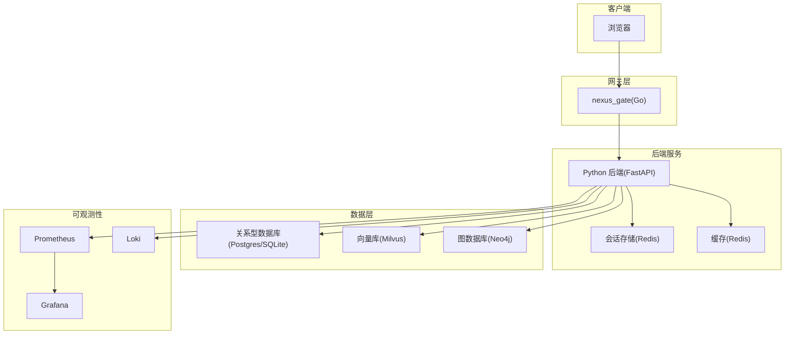
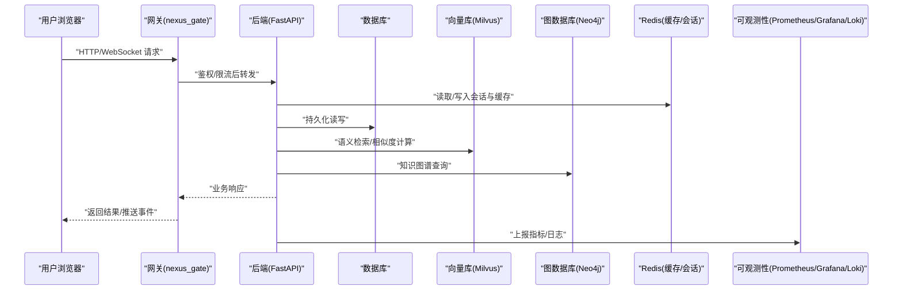
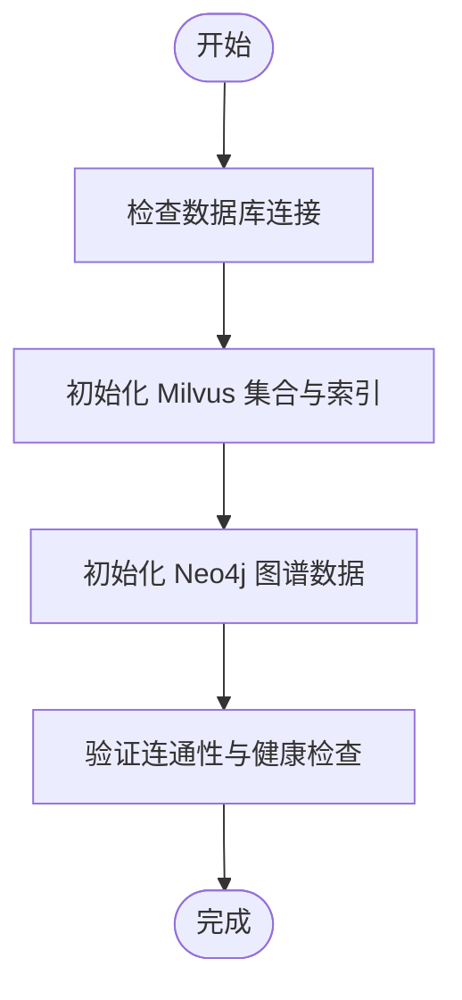
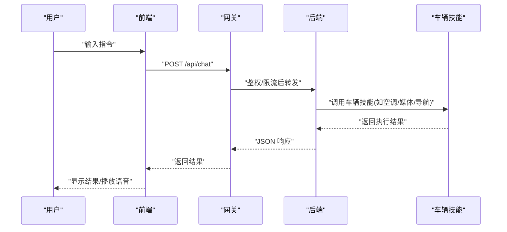
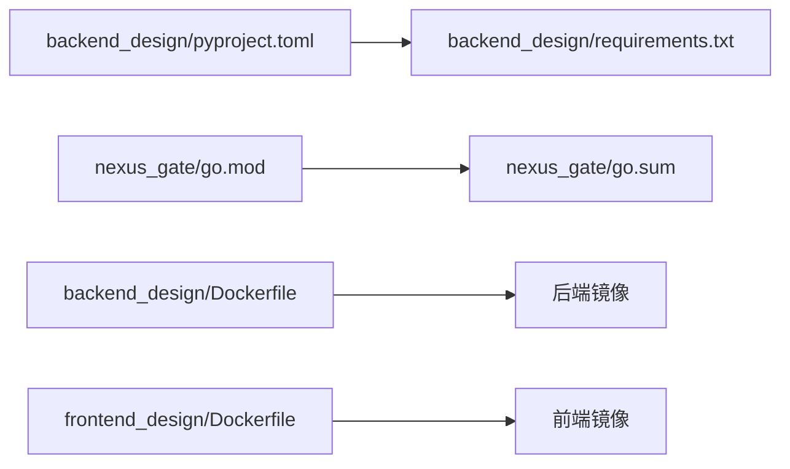

# 快速开始

<cite>
**本文引用的文件**   
- [README.md](file://README.md)
- [docker-compose.yml](file://docker-compose.yml)
- [backend_design/Dockerfile](file://backend_design/Dockerfile)
- [frontend_design/Dockerfile](file://frontend_design/Dockerfile)
- [backend_design/nexus/main.py](file://backend_design/nexus/main.py)
- [backend_design/pyproject.toml](file://backend_design/pyproject.toml)
- [backend_design/requirements.txt](file://backend_design/requirements.txt)
- [backend_design/scripts/init_milvus.py](file://backend_design/scripts/init_milvus.py)
- [backend_design/scripts/init_neo4j.py](file://backend_design/scripts/init_neo4j.py)
- [scripts/start-backend.ps1](file://scripts/start-backend.ps1)
- [scripts/start-frontend.ps1](file://scripts/start-frontend.ps1)
- [scripts/start-gateway.ps1](file://scripts/start-gateway.ps1)
- [Makefile](file://Makefile)
- [config/grafana/provisioning/dashboards/nexuscockpit-overview.json](file://config/grafana/provisioning/dashboards/nexuscockpit-overview.json)
- [config/prometheus/prometheus.yml](file://config/prometheus/prometheus.yml)
- [config/loki/loki-config.yml](file://config/loki/loki-config.yml)
- [backend_design/nexus/config.py](file://backend_design/nexus/config.py)
- [backend_design/nexus/core/db_manager.py](file://backend_design/nexus/core/db_manager.py)
- [backend_design/nexus/api/routes/chat.py](file://backend_design/nexus/api/routes/chat.py)
- [backend_design/nexus/api/routes/vehicle.py](file://backend_design/nexus/api/routes/vehicle.py)
- [backend_design/nexus/api/websocket.py](file://backend_design/nexus/api/websocket.py)
- [backend_design/nexus/middleware/session_store.py](file://backend_design/nexus/middleware/session_store.py)
- [backend_design/nexus/middleware/redis_cache.py](file://backend_design/nexus/middleware/redis_cache.py)
- [backend_design/nexus/skills/vehicle/climate.py](file://backend_design/nexus/skills/vehicle/climate.py)
- [backend_design/nexus/skills/vehicle/media.py](file://backend_design/nexus/skills/vehicle/media.py)
- [backend_design/nexus/skills/vehicle/navigation.py](file://backend_design/nexus/skills/vehicle/navigation.py)
- [backend_design/nexus/skills/vehicle/seat.py](file://backend_design/nexus/skills/vehicle/seat.py)
- [backend_design/nexus/skills/vehicle/status.py](file://backend_design/nexus/skills/vehicle/status.py)
- [backend_design/nexus/skills/vehicle/window.py](file://backend_design/nexus/skills/vehicle/window.py)
- [models/asr/sensevoice/README.md](file://models/asr/sensevoice/README.md)
- [models/tts/cosyvoice/README.md](file://models/tts/cosyvoice/README.md)
- [models/reranker/bge-reranker-v2-m3/README.md](file://models/reranker/bge-reranker-v2-m3/README.md)
- [models/sv/cam_plus/README.md](file://models/sv/cam_plus/README.md)
- [docs/deployment/SETUP.md](file://docs/deployment/SETUP.md)
- [docs/deployment/VERIFICATION.md](file://docs/deployment/VERIFICATION.md)
</cite>

## 目录
1. [简介](#简介)
2. [项目结构](#项目结构)
3. [核心组件](#核心组件)
4. [架构总览](#架构总览)
5. [详细组件分析](#详细组件分析)
6. [依赖分析](#依赖分析)
7. [性能考虑](#性能考虑)
8. [故障排查指南](#故障排查指南)
9. [结论](#结论)
10. [附录](#附录)

## 简介
本快速开始指南面向首次接触 NexusCockpit 的开发者与用户，目标是在约30分钟内完成环境搭建、服务启动与基础功能体验。你将学会：
- 使用 Docker Compose 一键拉起后端、网关、前端与可观测性组件
- 初始化数据库与向量/图数据库索引
- 下载并配置语音识别、文本转语音、重排序等模型
- 通过 Web 界面发送消息、查看车辆状态与控制车辆功能
- 定位常见问题并完成基本排障

## 项目结构
NexusCockpit 采用前后端分离与微服务化设计，关键目录说明如下：
- backend_design：Python 后端服务（FastAPI）、中间件、技能、RAG、可观测性等
- frontend_design：Next.js 前端应用
- nexus_gate：Go 编写的 API 网关（鉴权、限流、WebSocket 转发）
- models：本地模型资源（ASR/TTS/Reranker/SV）
- config：Grafana/Prometheus/Loki 的可观测性配置
- scripts：Windows 一键启动脚本
- docs：部署与验证文档

图表来源
- [docker-compose.yml](file://docker-compose.yml)
- [backend_design/nexus/main.py](file://backend_design/nexus/main.py)
- [backend_design/nexus/middleware/session_store.py](file://backend_design/nexus/middleware/session_store.py)
- [backend_design/nexus/middleware/redis_cache.py](file://backend_design/nexus/middleware/redis_cache.py)
- [backend_design/scripts/init_milvus.py](file://backend_design/scripts/init_milvus.py)
- [backend_design/scripts/init_neo4j.py](file://backend_design/scripts/init_neo4j.py)
- [config/prometheus/prometheus.yml](file://config/prometheus/prometheus.yml)
- [config/grafana/provisioning/dashboards/nexuscockpit-overview.json](file://config/grafana/provisioning/dashboards/nexuscockpit-overview.json)
- [config/loki/loki-config.yml](file://config/loki/loki-config.yml)

章节来源
- [README.md](file://README.md)
- [docker-compose.yml](file://docker-compose.yml)
- [backend_design/Dockerfile](file://backend_design/Dockerfile)
- [frontend_design/Dockerfile](file://frontend_design/Dockerfile)

## 核心组件
- 后端服务（FastAPI）
  - 入口与路由：提供聊天、车辆控制、设置、健康检查等接口
  - 中间件：会话存储、Redis 缓存、速率限制、任务队列
  - RAG：统一检索器、向量库、图存储、重排序
  - 技能：空调、媒体、导航、座椅、车窗、状态等
  - 可观测性：指标采集、日志输出、链路追踪
- 网关（Go）
  - 鉴权、限流、WebSocket Hub、反向代理
- 前端（Next.js）
  - 聊天窗口、车辆面板、仪表盘、管理后台
- 数据与中间件
  - 关系型数据库、Milvus 向量库、Neo4j 图数据库、Redis 缓存与会话
- 可观测性
  - Prometheus 抓取指标，Grafana 展示看板，Loki 聚合日志

章节来源
- [backend_design/nexus/main.py](file://backend_design/nexus/main.py)
- [backend_design/nexus/api/routes/chat.py](file://backend_design/nexus/api/routes/chat.py)
- [backend_design/nexus/api/routes/vehicle.py](file://backend_design/nexus/api/routes/vehicle.py)
- [backend_design/nexus/api/websocket.py](file://backend_design/nexus/api/websocket.py)
- [backend_design/nexus/middleware/session_store.py](file://backend_design/nexus/middleware/session_store.py)
- [backend_design/nexus/middleware/redis_cache.py](file://backend_design/nexus/middleware/redis_cache.py)
- [backend_design/nexus/skills/vehicle/climate.py](file://backend_design/nexus/skills/vehicle/climate.py)
- [backend_design/nexus/skills/vehicle/media.py](file://backend_design/nexus/skills/vehicle/media.py)
- [backend_design/nexus/skills/vehicle/navigation.py](file://backend_design/nexus/skills/vehicle/navigation.py)
- [backend_design/nexus/skills/vehicle/seat.py](file://backend_design/nexus/skills/vehicle/seat.py)
- [backend_design/nexus/skills/vehicle/status.py](file://backend_design/nexus/skills/vehicle/status.py)
- [backend_design/nexus/skills/vehicle/window.py](file://backend_design/nexus/skills/vehicle/window.py)

## 架构总览
下图展示了从浏览器到后端、再到数据层与可观测性组件的整体交互流程。

图表来源
- [backend_design/nexus/main.py](file://backend_design/nexus/main.py)
- [backend_design/nexus/api/websocket.py](file://backend_design/nexus/api/websocket.py)
- [backend_design/nexus/middleware/redis_cache.py](file://backend_design/nexus/middleware/redis_cache.py)
- [backend_design/nexus/middleware/session_store.py](file://backend_design/nexus/middleware/session_store.py)
- [backend_design/scripts/init_milvus.py](file://backend_design/scripts/init_milvus.py)
- [backend_design/scripts/init_neo4j.py](file://backend_design/scripts/init_neo4j.py)
- [config/prometheus/prometheus.yml](file://config/prometheus/prometheus.yml)
- [config/grafana/provisioning/dashboards/nexuscockpit-overview.json](file://config/grafana/provisioning/dashboards/nexuscockpit-overview.json)
- [config/loki/loki-config.yml](file://config/loki/loki-config.yml)

## 详细组件分析

### 环境准备与一键启动
- 前置条件
  - 操作系统：Windows/macOS/Linux
  - 已安装 Docker 与 docker-compose
  - 建议内存：≥8GB（含模型加载时峰值）
- 克隆仓库并进入根目录
- 使用 Makefile 或脚本一键启动
  - Windows PowerShell：运行 start-backend.ps1、start-frontend.ps1、start-gateway.ps1
  - 跨平台：执行 make up（若未定义则回退至 docker-compose up）
- 访问地址
  - 前端：http://localhost:3000
  - 后端 API：http://localhost:8000
  - 网关：http://localhost:8080
  - Grafana：http://localhost:3001
  - Prometheus：http://localhost:9090
  - Loki：http://localhost:3100

章节来源
- [Makefile](file://Makefile)
- [scripts/start-backend.ps1](file://scripts/start-backend.ps1)
- [scripts/start-frontend.ps1](file://scripts/start-frontend.ps1)
- [scripts/start-gateway.ps1](file://scripts/start-gateway.ps1)
- [docker-compose.yml](file://docker-compose.yml)

### 数据库与索引初始化
- 关系型数据库
  - 由后端自动创建表结构（如未启用迁移脚本）
- 向量库 Milvus
  - 执行初始化脚本以创建集合与索引
- 图数据库 Neo4j
  - 执行初始化脚本以导入初始图谱数据

图表来源
- [backend_design/scripts/init_milvus.py](file://backend_design/scripts/init_milvus.py)
- [backend_design/scripts/init_neo4j.py](file://backend_design/scripts/init_neo4j.py)
- [backend_design/nexus/core/db_manager.py](file://backend_design/nexus/core/db_manager.py)

章节来源
- [backend_design/scripts/init_milvus.py](file://backend_design/scripts/init_milvus.py)
- [backend_design/scripts/init_neo4j.py](file://backend_design/scripts/init_neo4j.py)
- [backend_design/nexus/core/db_manager.py](file://backend_design/nexus/core/db_manager.py)

### 模型下载与配置
- ASR（语音识别）
  - 模型路径参考 models/asr/sensevoice
  - 在配置中指定模型目录与采样率等参数
- TTS（文本转语音）
  - 模型路径参考 models/tts/cosyvoice
  - 在配置中指定模型目录与合成引擎参数
- Reranker（重排序）
  - 模型路径参考 models/reranker/bge-reranker-v2-m3
  - 在配置中指定模型权重与设备
- SV（声纹）
  - 模型路径参考 models/sv/cam_plus
  - 在配置中指定注册与比对阈值

提示
- 首次启动会尝试加载本地模型，若缺失将报错；请根据 README 指引下载对应模型并放置到 models 目录下
- 可通过环境变量或配置文件覆盖默认路径

章节来源
- [models/asr/sensevoice/README.md](file://models/asr/sensevoice/README.md)
- [models/tts/cosyvoice/README.md](file://models/tts/cosyvoice/README.md)
- [models/reranker/bge-reranker-v2-m3/README.md](file://models/reranker/bge-reranker-v2-m3/README.md)
- [models/sv/cam_plus/README.md](file://models/sv/cam_plus/README.md)
- [backend_design/nexus/config.py](file://backend_design/nexus/config.py)

### 配置文件要点
- 后端配置
  - 数据库连接串、Redis 地址、向量库与图数据库连接
  - 模型路径、设备选择（CPU/GPU）、并发线程数
  - 日志级别、可观测性开关
- 网关配置
  - JWT 密钥、限流策略、WebSocket 心跳
- 可观测性
  - Prometheus 抓取目标、Grafana 看板、Loki 日志源

章节来源
- [backend_design/nexus/config.py](file://backend_design/nexus/config.py)
- [config/prometheus/prometheus.yml](file://config/prometheus/prometheus.yml)
- [config/grafana/provisioning/dashboards/nexuscockpit-overview.json](file://config/grafana/provisioning/dashboards/nexuscockpit-overview.json)
- [config/loki/loki-config.yml](file://config/loki/loki-config.yml)

### 基本使用示例
- 访问 Web 界面
  - 打开 http://localhost:3000，进入聊天页面
- 发送第一条消息
  - 在聊天框输入“你好”，确认收到回复
- 控制车辆功能
  - 示例指令：“打开空调”、“调高温度”、“播放音乐”、“导航到公司”、“打开车窗”、“调节座椅位置”
  - 这些指令将由对应技能处理并返回执行结果
- WebSocket 实时事件
  - 支持语音播报、进度推送、状态变更等实时事件

图表来源
- [backend_design/nexus/api/routes/chat.py](file://backend_design/nexus/api/routes/chat.py)
- [backend_design/nexus/api/routes/vehicle.py](file://backend_design/nexus/api/routes/vehicle.py)
- [backend_design/nexus/api/websocket.py](file://backend_design/nexus/api/websocket.py)
- [backend_design/nexus/skills/vehicle/climate.py](file://backend_design/nexus/skills/vehicle/climate.py)
- [backend_design/nexus/skills/vehicle/media.py](file://backend_design/nexus/skills/vehicle/media.py)
- [backend_design/nexus/skills/vehicle/navigation.py](file://backend_design/nexus/skills/vehicle/navigation.py)
- [backend_design/nexus/skills/vehicle/seat.py](file://backend_design/nexus/skills/vehicle/seat.py)
- [backend_design/nexus/skills/vehicle/window.py](file://backend_design/nexus/skills/vehicle/window.py)
- [backend_design/nexus/skills/vehicle/status.py](file://backend_design/nexus/skills/vehicle/status.py)

章节来源
- [backend_design/nexus/api/routes/chat.py](file://backend_design/nexus/api/routes/chat.py)
- [backend_design/nexus/api/routes/vehicle.py](file://backend_design/nexus/api/routes/vehicle.py)
- [backend_design/nexus/api/websocket.py](file://backend_design/nexus/api/websocket.py)
- [backend_design/nexus/skills/vehicle/climate.py](file://backend_design/nexus/skills/vehicle/climate.py)
- [backend_design/nexus/skills/vehicle/media.py](file://backend_design/nexus/skills/vehicle/media.py)
- [backend_design/nexus/skills/vehicle/navigation.py](file://backend_design/nexus/skills/vehicle/navigation.py)
- [backend_design/nexus/skills/vehicle/seat.py](file://backend_design/nexus/skills/vehicle/seat.py)
- [backend_design/nexus/skills/vehicle/window.py](file://backend_design/nexus/skills/vehicle/window.py)
- [backend_design/nexus/skills/vehicle/status.py](file://backend_design/nexus/skills/vehicle/status.py)

## 依赖分析
- Python 依赖
  - requirements.txt 与 pyproject.toml 定义了运行时包
- Go 依赖
  - nexus_gate 使用 go.mod 管理
- 容器镜像
  - backend_design/Dockerfile 与 frontend_design/Dockerfile 分别构建后端与前端的镜像

图表来源
- [backend_design/pyproject.toml](file://backend_design/pyproject.toml)
- [backend_design/requirements.txt](file://backend_design/requirements.txt)
- [backend_design/Dockerfile](file://backend_design/Dockerfile)
- [frontend_design/Dockerfile](file://frontend_design/Dockerfile)

章节来源
- [backend_design/pyproject.toml](file://backend_design/pyproject.toml)
- [backend_design/requirements.txt](file://backend_design/requirements.txt)
- [backend_design/Dockerfile](file://backend_design/Dockerfile)
- [frontend_design/Dockerfile](file://frontend_design/Dockerfile)

## 性能考虑
- 模型加载
  - 首次启动需加载 ASR/TTS/Reranker/SV 模型，建议在具备 GPU 的环境中运行以提升推理速度
- 并发与缓存
  - 合理调整 Redis 缓存命中率与会话过期时间，降低数据库压力
- 可观测性
  - 开启 Prometheus 指标与 Loki 日志，结合 Grafana 看板进行容量规划与瓶颈定位

[本节为通用指导，不直接分析具体文件]

## 故障排查指南
- 无法访问前端
  - 检查端口占用与防火墙规则
  - 确认前端容器是否成功启动
- 后端健康检查失败
  - 查看后端日志，确认数据库、Redis、Milvus、Neo4j 连接是否正常
  - 校验配置文件中的连接串与凭据
- 模型加载失败
  - 确认 models 目录结构与权限
  - 检查模型 README 中的版本与依赖要求
- 向量/图数据库初始化失败
  - 重新执行 init_milvus.py 与 init_neo4j.py
  - 检查网络连通性与认证信息
- 鉴权失败
  - 核对网关 JWT 配置与后端签名算法
- 实时事件无推送
  - 检查 WebSocket 握手与心跳配置
  - 确认网关与后端 WS 路由一致

章节来源
- [docs/deployment/SETUP.md](file://docs/deployment/SETUP.md)
- [docs/deployment/VERIFICATION.md](file://docs/deployment/VERIFICATION.md)
- [backend_design/nexus/core/db_manager.py](file://backend_design/nexus/core/db_manager.py)
- [backend_design/nexus/api/websocket.py](file://backend_design/nexus/api/websocket.py)
- [backend_design/nexus/middleware/redis_cache.py](file://backend_design/nexus/middleware/redis_cache.py)
- [backend_design/nexus/middleware/session_store.py](file://backend_design/nexus/middleware/session_store.py)

## 结论
通过以上步骤，你可以在30分钟内完成 NexusCockpit 的环境搭建与服务启动，并使用 Web 界面完成聊天、车辆控制等基础操作。建议后续结合可观测性工具进行监控与优化，逐步扩展更多技能与场景。

## 附录
- 常用命令
  - 启动全部服务：make up 或 docker-compose up -d
  - 停止服务：make down 或 docker-compose down
  - 查看日志：docker-compose logs -f <服务名>
- 参考文档
  - 部署与验证：docs/deployment/SETUP.md、docs/deployment/VERIFICATION.md
  - 模型说明：models/*/README.md

章节来源
- [Makefile](file://Makefile)
- [docker-compose.yml](file://docker-compose.yml)
- [docs/deployment/SETUP.md](file://docs/deployment/SETUP.md)
- [docs/deployment/VERIFICATION.md](file://docs/deployment/VERIFICATION.md)
- [models/asr/sensevoice/README.md](file://models/asr/sensevoice/README.md)
- [models/tts/cosyvoice/README.md](file://models/tts/cosyvoice/README.md)
- [models/reranker/bge-reranker-v2-m3/README.md](file://models/reranker/bge-reranker-v2-m3/README.md)
- [models/sv/cam_plus/README.md](file://models/sv/cam_plus/README.md)