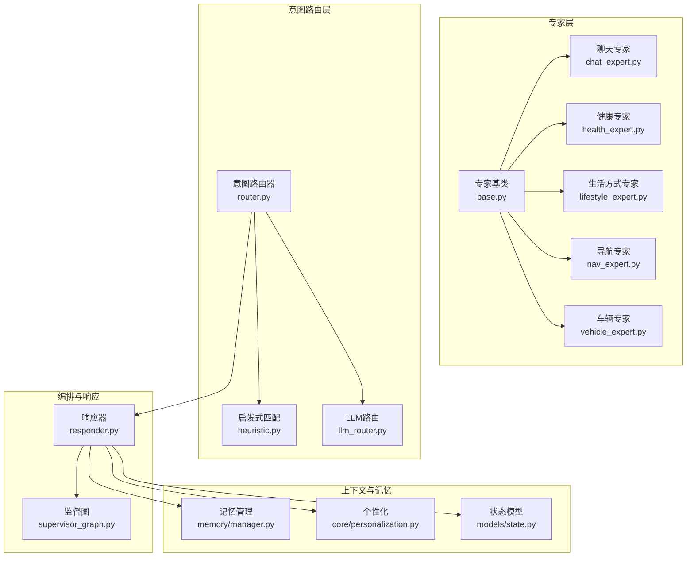
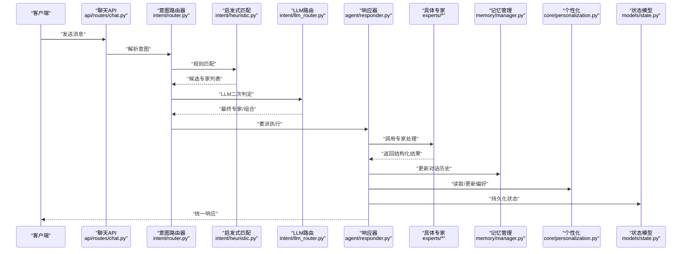
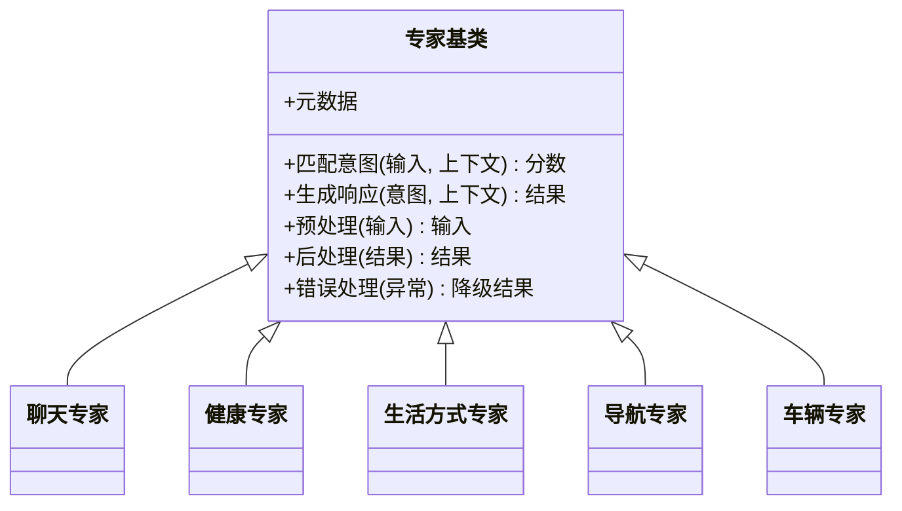
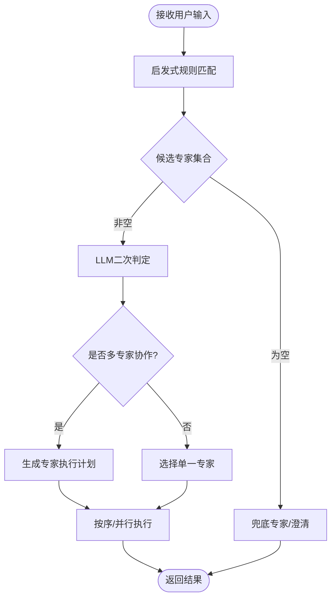
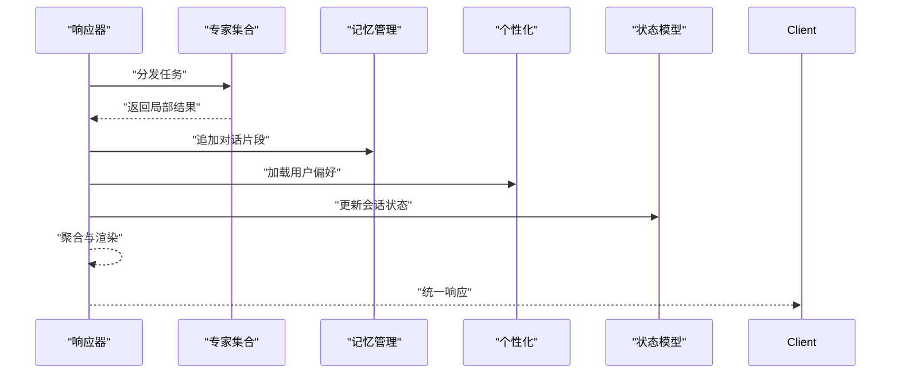
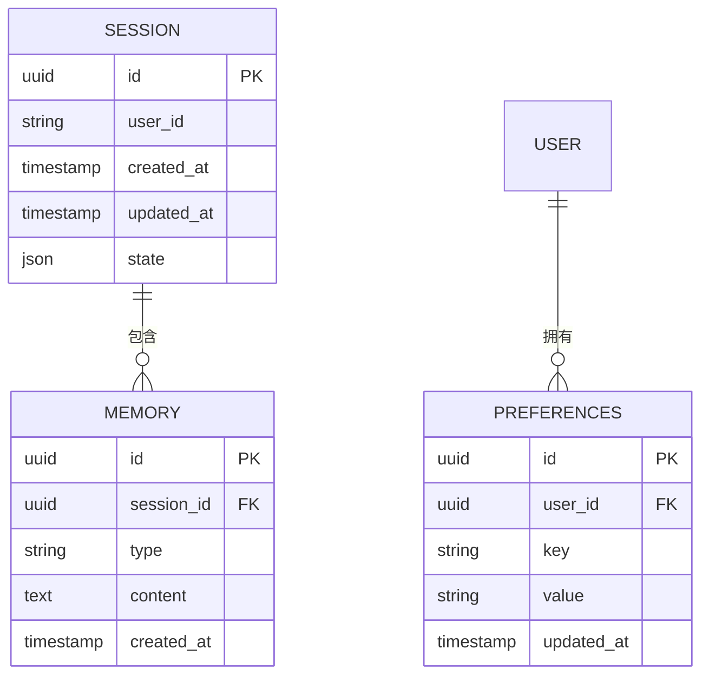
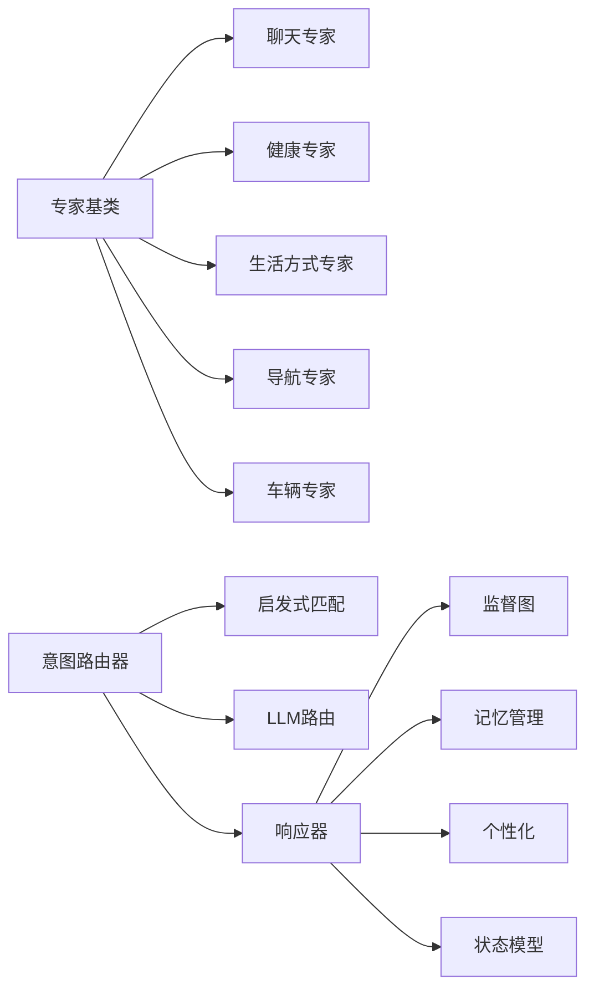

# 专家模块开发

<cite>
**本文引用的文件**   
- [backend_design/nexus/agent/experts/base.py](file://backend_design/nexus/agent/experts/base.py)
- [backend_design/nexus/agent/experts/chat_expert.py](file://backend_design/nexus/agent/experts/chat_expert.py)
- [backend_design/nexus/agent/experts/health_expert.py](file://backend_design/nexus/agent/experts/health_expert.py)
- [backend_design/nexus/agent/experts/lifestyle_expert.py](file://backend_design/nexus/agent/experts/lifestyle_expert.py)
- [backend_design/nexus/agent/experts/nav_expert.py](file://backend_design/nexus/agent/experts/nav_expert.py)
- [backend_design/nexus/agent/experts/vehicle_expert.py](file://backend_design/nexus/agent/experts/vehicle_expert.py)
- [backend_design/nexus/intent/router.py](file://backend_design/nexus/intent/router.py)
- [backend_design/nexus/intent/heuristic.py](file://backend_design/nexus/intent/heuristic.py)
- [backend_design/nexus/intent/llm_router.py](file://backend_design/nexus/intent/llm_router.py)
- [backend_design/nexus/agent/responder.py](file://backend_design/nexus/agent/responder.py)
- [backend_design/nexus/memory/manager.py](file://backend_design/nexus/memory/manager.py)
- [backend_design/nexus/core/personalization.py](file://backend_design/nexus/core/personalization.py)
- [backend_design/nexus/models/state.py](file://backend_design/nexus/models/state.py)
- [backend_design/nexus/api/routes/chat.py](file://backend_design/nexus/api/routes/chat.py)
- [backend_design/nexus/supervisor_graph.py](file://backend_design/nexus/agent/supervisor_graph.py)
</cite>

## 目录
1. [简介](#简介)
2. [项目结构](#项目结构)
3. [核心组件](#核心组件)
4. [架构总览](#架构总览)
5. [详细组件分析](#详细组件分析)
6. [依赖关系分析](#依赖关系分析)
7. [性能考量](#性能考量)
8. [故障排查指南](#故障排查指南)
9. [结论](#结论)
10. [附录](#附录)

## 简介
本文件面向NexusCockpit系统的“专家模块”开发者，系统性阐述专家基类的继承与实现方法、意图匹配算法、响应生成逻辑、专家注册与路由机制（基于规则与LLM驱动）、多专家协作模式，以及上下文管理与记忆机制。文档同时提供自定义专家的开发示例（特定领域、业务逻辑、外部服务集成），并给出测试策略与性能调优建议，帮助读者快速构建高质量、可维护的专家能力。

## 项目结构
专家模块位于后端设计目录下的 agent/experts 子目录，配合意图路由、响应器、记忆与个性化等子系统共同构成完整的对话处理链路。关键路径包括：
- 专家定义与实现：backend_design/nexus/agent/experts
- 意图识别与路由：backend_design/nexus/intent
- 响应组装与编排：backend_design/nexus/agent/responder.py
- 记忆与个性化：backend_design/nexus/memory/manager.py, backend_design/nexus/core/personalization.py
- 状态模型：backend_design/nexus/models/state.py
- API入口：backend_design/nexus/api/routes/chat.py
- 多专家协作图：backend_design/nexus/agent/supervisor_graph.py

图表来源
- [backend_design/nexus/agent/experts/base.py](file://backend_design/nexus/agent/experts/base.py)
- [backend_design/nexus/agent/experts/chat_expert.py](file://backend_design/nexus/agent/experts/chat_expert.py)
- [backend_design/nexus/agent/experts/health_expert.py](file://backend_design/nexus/agent/experts/health_expert.py)
- [backend_design/nexus/agent/experts/lifestyle_expert.py](file://backend_design/nexus/agent/experts/lifestyle_expert.py)
- [backend_design/nexus/agent/experts/nav_expert.py](file://backend_design/nexus/agent/experts/nav_expert.py)
- [backend_design/nexus/agent/experts/vehicle_expert.py](file://backend_design/nexus/agent/experts/vehicle_expert.py)
- [backend_design/nexus/intent/router.py](file://backend_design/nexus/intent/router.py)
- [backend_design/nexus/intent/heuristic.py](file://backend_design/nexus/intent/heuristic.py)
- [backend_design/nexus/intent/llm_router.py](file://backend_design/nexus/intent/llm_router.py)
- [backend_design/nexus/agent/responder.py](file://backend_design/nexus/agent/responder.py)
- [backend_design/nexus/agent/supervisor_graph.py](file://backend_design/nexus/agent/supervisor_graph.py)
- [backend_design/nexus/memory/manager.py](file://backend_design/nexus/memory/manager.py)
- [backend_design/nexus/core/personalization.py](file://backend_design/nexus/core/personalization.py)
- [backend_design/nexus/models/state.py](file://backend_design/nexus/models/state.py)

章节来源
- [backend_design/nexus/agent/experts/base.py](file://backend_design/nexus/agent/experts/base.py)
- [backend_design/nexus/intent/router.py](file://backend_design/nexus/intent/router.py)
- [backend_design/nexus/agent/responder.py](file://backend_design/nexus/agent/responder.py)
- [backend_design/nexus/memory/manager.py](file://backend_design/nexus/memory/manager.py)
- [backend_design/nexus/core/personalization.py](file://backend_design/nexus/core/personalization.py)
- [backend_design/nexus/models/state.py](file://backend_design/nexus/models/state.py)
- [backend_design/nexus/api/routes/chat.py](file://backend_design/nexus/api/routes/chat.py)
- [backend_design/nexus/agent/supervisor_graph.py](file://backend_design/nexus/agent/supervisor_graph.py)

## 核心组件
- 专家基类：定义专家的统一接口、元数据、意图匹配钩子、响应生成模板、上下文注入点与错误处理约定。
- 具体专家：在基类之上实现领域特定的意图匹配与响应逻辑，如聊天、健康、生活方式、导航、车辆控制等。
- 意图路由：组合启发式规则与LLM判断，将用户输入映射到目标专家或专家组合。
- 响应器：协调专家执行、结果聚合、格式统一与输出渲染。
- 记忆与个性化：维护对话历史、用户偏好与状态，为专家提供上下文支撑。
- 监督图：在多专家协作场景下，组织专家间的调用顺序与条件分支。

章节来源
- [backend_design/nexus/agent/experts/base.py](file://backend_design/nexus/agent/experts/base.py)
- [backend_design/nexus/agent/experts/chat_expert.py](file://backend_design/nexus/agent/experts/chat_expert.py)
- [backend_design/nexus/agent/experts/health_expert.py](file://backend_design/nexus/agent/experts/health_expert.py)
- [backend_design/nexus/agent/experts/lifestyle_expert.py](file://backend_design/nexus/agent/experts/lifestyle_expert.py)
- [backend_design/nexus/agent/experts/nav_expert.py](file://backend_design/nexus/agent/experts/nav_expert.py)
- [backend_design/nexus/agent/experts/vehicle_expert.py](file://backend_design/nexus/agent/experts/vehicle_expert.py)
- [backend_design/nexus/intent/router.py](file://backend_design/nexus/intent/router.py)
- [backend_design/nexus/intent/heuristic.py](file://backend_design/nexus/intent/heuristic.py)
- [backend_design/nexus/intent/llm_router.py](file://backend_design/nexus/intent/llm_router.py)
- [backend_design/nexus/agent/responder.py](file://backend_design/nexus/agent/responder.py)
- [backend_design/nexus/memory/manager.py](file://backend_design/nexus/memory/manager.py)
- [backend_design/nexus/core/personalization.py](file://backend_design/nexus/core/personalization.py)
- [backend_design/nexus/models/state.py](file://backend_design/nexus/models/state.py)
- [backend_design/nexus/agent/supervisor_graph.py](file://backend_design/nexus/agent/supervisor_graph.py)

## 架构总览
下图展示从API请求到专家执行与响应的端到端流程，包含意图路由、专家选择、响应组装与记忆更新。

图表来源
- [backend_design/nexus/api/routes/chat.py](file://backend_design/nexus/api/routes/chat.py)
- [backend_design/nexus/intent/router.py](file://backend_design/nexus/intent/router.py)
- [backend_design/nexus/intent/heuristic.py](file://backend_design/nexus/intent/heuristic.py)
- [backend_design/nexus/intent/llm_router.py](file://backend_design/nexus/intent/llm_router.py)
- [backend_design/nexus/agent/responder.py](file://backend_design/nexus/agent/responder.py)
- [backend_design/nexus/agent/experts/chat_expert.py](file://backend_design/nexus/agent/experts/chat_expert.py)
- [backend_design/nexus/agent/experts/health_expert.py](file://backend_design/nexus/agent/experts/health_expert.py)
- [backend_design/nexus/agent/experts/lifestyle_expert.py](file://backend_design/nexus/agent/experts/lifestyle_expert.py)
- [backend_design/nexus/agent/experts/nav_expert.py](file://backend_design/nexus/agent/experts/nav_expert.py)
- [backend_design/nexus/agent/experts/vehicle_expert.py](file://backend_design/nexus/agent/experts/vehicle_expert.py)
- [backend_design/nexus/memory/manager.py](file://backend_design/nexus/memory/manager.py)
- [backend_design/nexus/core/personalization.py](file://backend_design/nexus/core/personalization.py)
- [backend_design/nexus/models/state.py](file://backend_design/nexus/models/state.py)

## 详细组件分析

### 专家基类与接口定义
- 职责边界
  - 定义统一的专家元数据（名称、版本、描述、适用域）。
  - 暴露意图匹配钩子，允许基于关键词、正则、语义相似度或外部信号进行匹配。
  - 提供响应生成模板与格式化规范，确保输出一致性与可扩展性。
  - 注入上下文参数（会话ID、用户ID、设备信息、时间戳等）。
  - 约定异常类型与错误码，便于上层统一处理与降级。
- 扩展点
  - 重写意图匹配方法以接入启发式或LLM评分。
  - 重写响应生成方法以支持富文本、卡片、动作指令等。
  - 可选地实现预处理器与后处理器，用于数据清洗与结果增强。
- 最佳实践
  - 保持专家无状态或最小状态，依赖记忆与个性化模块管理长期上下文。
  - 明确输入校验与失败回退路径，避免级联错误。
  - 使用配置项控制行为开关与阈值，便于A/B测试与灰度发布。

章节来源
- [backend_design/nexus/agent/experts/base.py](file://backend_design/nexus/agent/experts/base.py)

### 具体专家实现示例
- 聊天专家
  - 侧重通用对话、闲聊与引导澄清，适合低置信度意图的兜底处理。
  - 通过记忆模块获取近期话题，结合个性化偏好调整语气与内容。
- 健康专家
  - 聚焦健康指标解读与建议，需严格遵循安全提示与免责声明。
  - 可与外部健康服务集成，拉取用户健康数据并生成可读报告。
- 生活方式专家
  - 覆盖日程、提醒、习惯养成等场景，强调任务型交互与状态同步。
- 导航专家
  - 处理路线规划、目的地搜索与实时路况，需要与地图服务深度集成。
- 车辆专家
  - 负责车辆控制与状态查询，要求高可靠性与权限校验。
  - 与车辆网关或MCP服务通信，确保指令幂等与回滚策略。

图表来源
- [backend_design/nexus/agent/experts/base.py](file://backend_design/nexus/agent/experts/base.py)
- [backend_design/nexus/agent/experts/chat_expert.py](file://backend_design/nexus/agent/experts/chat_expert.py)
- [backend_design/nexus/agent/experts/health_expert.py](file://backend_design/nexus/agent/experts/health_expert.py)
- [backend_design/nexus/agent/experts/lifestyle_expert.py](file://backend_design/nexus/agent/experts/lifestyle_expert.py)
- [backend_design/nexus/agent/experts/nav_expert.py](file://backend_design/nexus/agent/experts/nav_expert.py)
- [backend_design/nexus/agent/experts/vehicle_expert.py](file://backend_design/nexus/agent/experts/vehicle_expert.py)

章节来源
- [backend_design/nexus/agent/experts/chat_expert.py](file://backend_design/nexus/agent/experts/chat_expert.py)
- [backend_design/nexus/agent/experts/health_expert.py](file://backend_design/nexus/agent/experts/health_expert.py)
- [backend_design/nexus/agent/experts/lifestyle_expert.py](file://backend_design/nexus/agent/experts/lifestyle_expert.py)
- [backend_design/nexus/agent/experts/nav_expert.py](file://backend_design/nexus/agent/experts/nav_expert.py)
- [backend_design/nexus/agent/experts/vehicle_expert.py](file://backend_design/nexus/agent/experts/vehicle_expert.py)

### 意图匹配算法与专家路由
- 规则匹配（启发式）
  - 基于关键词、正则表达式、意图词典与权重打分，快速筛选候选专家。
  - 适用于高频、明确的意图场景，具备低延迟与高稳定性。
- LLM驱动路由
  - 对复杂或模糊意图，调用大语言模型进行语义理解与专家选择。
  - 支持多专家协作决策，输出专家序列或并行调用计划。
- 混合路由策略
  - 先启发式过滤，再LLM精判；或根据置信度动态切换策略。
  - 引入缓存与降级机制，保障极端情况下的可用性。

图表来源
- [backend_design/nexus/intent/router.py](file://backend_design/nexus/intent/router.py)
- [backend_design/nexus/intent/heuristic.py](file://backend_design/nexus/intent/heuristic.py)
- [backend_design/nexus/intent/llm_router.py](file://backend_design/nexus/intent/llm_router.py)

章节来源
- [backend_design/nexus/intent/router.py](file://backend_design/nexus/intent/router.py)
- [backend_design/nexus/intent/heuristic.py](file://backend_design/nexus/intent/heuristic.py)
- [backend_design/nexus/intent/llm_router.py](file://backend_design/nexus/intent/llm_router.py)

### 响应生成与编排
- 响应器职责
  - 统一封装专家输出，进行格式转换、富媒体渲染与动作指令拼装。
  - 管理并发与超时，保证整体SLA。
  - 与记忆和个性化模块交互，动态调整回复风格与内容。
- 编排与监督
  - 监督图负责多专家协作的流程控制，包括条件分支、重试与补偿。
  - 支持流式输出与增量更新，提升用户体验。

图表来源
- [backend_design/nexus/agent/responder.py](file://backend_design/nexus/agent/responder.py)
- [backend_design/nexus/agent/supervisor_graph.py](file://backend_design/nexus/agent/supervisor_graph.py)
- [backend_design/nexus/memory/manager.py](file://backend_design/nexus/memory/manager.py)
- [backend_design/nexus/core/personalization.py](file://backend_design/nexus/core/personalization.py)
- [backend_design/nexus/models/state.py](file://backend_design/nexus/models/state.py)

章节来源
- [backend_design/nexus/agent/responder.py](file://backend_design/nexus/agent/responder.py)
- [backend_design/nexus/agent/supervisor_graph.py](file://backend_design/nexus/agent/supervisor_graph.py)

### 上下文管理与记忆机制
- 对话历史
  - 记录用户与系统交互的关键节点，支持回溯与摘要压缩。
- 用户偏好
  - 存储语言风格、主题兴趣、常用操作等，影响专家选择与回复定制。
- 状态保持
  - 会话级状态（当前任务、中间变量）与跨会话状态（长期记忆）分离。
- 冲突解决
  - 当不同来源的偏好或状态不一致时，采用优先级与时间衰减策略。

图表来源
- [backend_design/nexus/memory/manager.py](file://backend_design/nexus/memory/manager.py)
- [backend_design/nexus/core/personalization.py](file://backend_design/nexus/core/personalization.py)
- [backend_design/nexus/models/state.py](file://backend_design/nexus/models/state.py)

章节来源
- [backend_design/nexus/memory/manager.py](file://backend_design/nexus/memory/manager.py)
- [backend_design/nexus/core/personalization.py](file://backend_design/nexus/core/personalization.py)
- [backend_design/nexus/models/state.py](file://backend_design/nexus/models/state.py)

### 自定义专家开发示例
- 特定领域专家（如金融、法律）
  - 在基类中实现领域术语匹配与合规检查。
  - 集成知识库检索与引用标注，确保答案可追溯。
- 业务逻辑专家（如订单、库存）
  - 对接业务系统API，完成事务性操作与状态同步。
  - 实现幂等键与重试策略，保障一致性。
- 外部服务集成专家（如天气、新闻）
  - 封装第三方SDK，增加熔断与降级逻辑。
  - 缓存热点数据，减少外部依赖延迟。

章节来源
- [backend_design/nexus/agent/experts/base.py](file://backend_design/nexus/agent/experts/base.py)
- [backend_design/nexus/agent/experts/chat_expert.py](file://backend_design/nexus/agent/experts/chat_expert.py)
- [backend_design/nexus/agent/experts/health_expert.py](file://backend_design/nexus/agent/experts/health_expert.py)
- [backend_design/nexus/agent/experts/lifestyle_expert.py](file://backend_design/nexus/agent/experts/lifestyle_expert.py)
- [backend_design/nexus/agent/experts/nav_expert.py](file://backend_design/nexus/agent/experts/nav_expert.py)
- [backend_design/nexus/agent/experts/vehicle_expert.py](file://backend_design/nexus/agent/experts/vehicle_expert.py)

## 依赖关系分析
专家模块与意图路由、响应器、记忆与个性化之间存在清晰的依赖关系。专家仅关注领域逻辑，路由与编排负责调度与协同，记忆与个性化提供上下文支撑。

图表来源
- [backend_design/nexus/agent/experts/base.py](file://backend_design/nexus/agent/experts/base.py)
- [backend_design/nexus/agent/experts/chat_expert.py](file://backend_design/nexus/agent/experts/chat_expert.py)
- [backend_design/nexus/agent/experts/health_expert.py](file://backend_design/nexus/agent/experts/health_expert.py)
- [backend_design/nexus/agent/experts/lifestyle_expert.py](file://backend_design/nexus/agent/experts/lifestyle_expert.py)
- [backend_design/nexus/agent/experts/nav_expert.py](file://backend_design/nexus/agent/experts/nav_expert.py)
- [backend_design/nexus/agent/experts/vehicle_expert.py](file://backend_design/nexus/agent/experts/vehicle_expert.py)
- [backend_design/nexus/intent/router.py](file://backend_design/nexus/intent/router.py)
- [backend_design/nexus/intent/heuristic.py](file://backend_design/nexus/intent/heuristic.py)
- [backend_design/nexus/intent/llm_router.py](file://backend_design/nexus/intent/llm_router.py)
- [backend_design/nexus/agent/responder.py](file://backend_design/nexus/agent/responder.py)
- [backend_design/nexus/agent/supervisor_graph.py](file://backend_design/nexus/agent/supervisor_graph.py)
- [backend_design/nexus/memory/manager.py](file://backend_design/nexus/memory/manager.py)
- [backend_design/nexus/core/personalization.py](file://backend_design/nexus/core/personalization.py)
- [backend_design/nexus/models/state.py](file://backend_design/nexus/models/state.py)

章节来源
- [backend_design/nexus/agent/experts/base.py](file://backend_design/nexus/agent/experts/base.py)
- [backend_design/nexus/intent/router.py](file://backend_design/nexus/intent/router.py)
- [backend_design/nexus/agent/responder.py](file://backend_design/nexus/agent/responder.py)
- [backend_design/nexus/memory/manager.py](file://backend_design/nexus/memory/manager.py)
- [backend_design/nexus/core/personalization.py](file://backend_design/nexus/core/personalization.py)
- [backend_design/nexus/models/state.py](file://backend_design/nexus/models/state.py)

## 性能考量
- 意图路由优化
  - 启发式规则优先，减少LLM调用次数。
  - 对热门意图建立缓存，降低重复计算开销。
- 专家执行优化
  - 合理设置超时与并发上限，避免资源争用。
  - 对IO密集型操作使用异步与连接池。
- 记忆与个性化
  - 对话历史采用滑动窗口与摘要压缩，控制内存占用。
  - 偏好数据分层存储，热点数据入缓存。
- 监控与观测
  - 埋点关键路径耗时与错误率，结合日志与指标进行定位。
  - 对LLM路由与外部服务调用设置熔断与降级策略。

[本节为通用指导，不直接分析具体文件]

## 故障排查指南
- 常见问题
  - 意图误判：检查启发式规则与LLM路由的阈值与样本覆盖。
  - 专家执行超时：确认外部依赖可用性与连接池配置。
  - 记忆写入失败：验证存储介质与权限，检查冲突解决策略。
- 调试建议
  - 启用详细日志，记录输入、路由决策与专家输出。
  - 使用沙箱环境回放问题用例，逐步缩小范围。
  - 对关键路径添加断言与契约校验，提前发现异常。

章节来源
- [backend_design/nexus/intent/router.py](file://backend_design/nexus/intent/router.py)
- [backend_design/nexus/intent/heuristic.py](file://backend_design/nexus/intent/heuristic.py)
- [backend_design/nexus/intent/llm_router.py](file://backend_design/nexus/intent/llm_router.py)
- [backend_design/nexus/agent/responder.py](file://backend_design/nexus/agent/responder.py)
- [backend_design/nexus/memory/manager.py](file://backend_design/nexus/memory/manager.py)

## 结论
专家模块通过统一的基类与清晰的职责划分，实现了可扩展的领域能力封装。结合启发式与LLM驱动的意图路由、响应器的编排与记忆个性化支撑，系统能够在复杂对话场景中稳定高效地工作。开发者应遵循最佳实践，完善测试与监控，持续优化性能与体验。

[本节为总结性内容，不直接分析具体文件]

## 附录
- API入口参考
  - 聊天API负责接收消息并委托意图路由与响应器处理。
- 多专家协作
  - 监督图提供流程控制与条件分支，支持串行与并行执行。
- 状态模型
  - 会话状态与记忆结构清晰分离，便于扩展与维护。

章节来源
- [backend_design/nexus/api/routes/chat.py](file://backend_design/nexus/api/routes/chat.py)
- [backend_design/nexus/agent/supervisor_graph.py](file://backend_design/nexus/agent/supervisor_graph.py)
- [backend_design/nexus/models/state.py](file://backend_design/nexus/models/state.py)