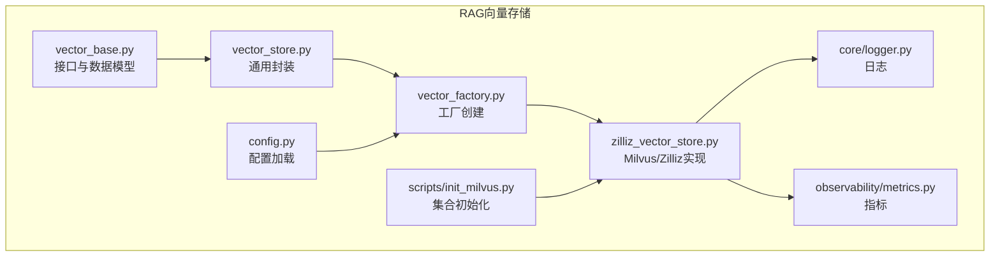
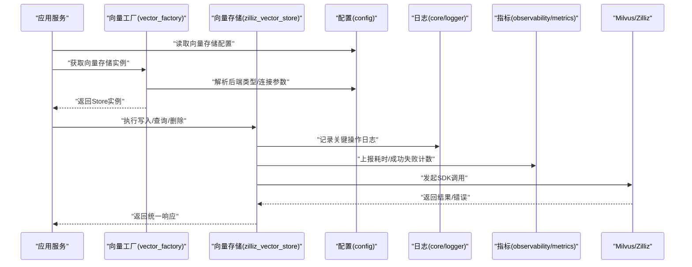
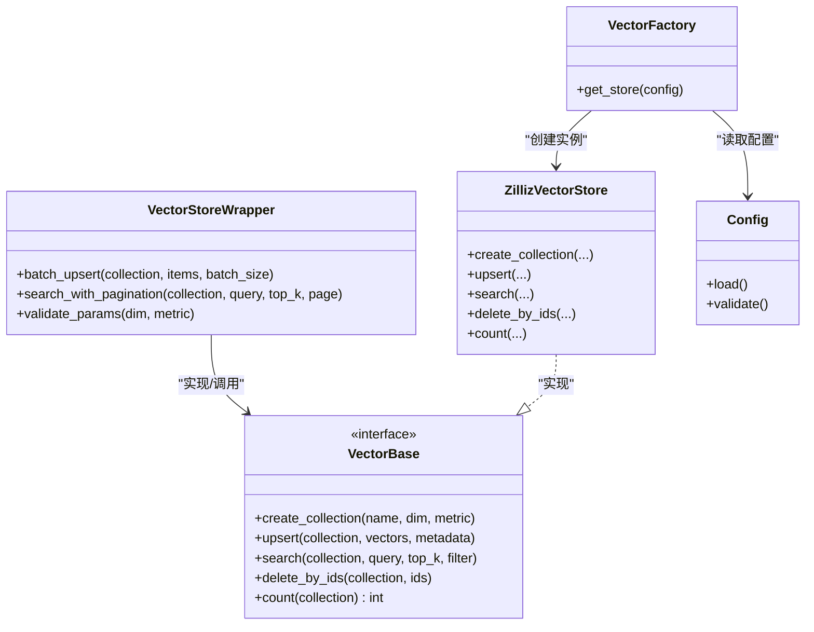

# 向量存储后端扩展

<cite>
**本文引用的文件**   
- [backend_design/nexus/rag/vector_base.py](file://backend_design/nexus/rag/vector_base.py)
- [backend_design/nexus/rag/vector_store.py](file://backend_design/nexus/rag/vector_store.py)
- [backend_design/nexus/rag/vector_factory.py](file://backend_design/nexus/rag/vector_factory.py)
- [backend_design/nexus/rag/zilliz_vector_store.py](file://backend_design/nexus/rag/zilliz_vector_store.py)
- [backend_design/nexus/config.py](file://backend_design/nexus/config.py)
- [backend_design/nexus/core/logger.py](file://backend_design/nexus/core/logger.py)
- [backend_design/nexus/observability/metrics.py](file://backend_design/nexus/observability/metrics.py)
- [backend_design/scripts/init_milvus.py](file://backend_design/scripts/init_milvus.py)
</cite>

## 目录
1. [简介](#简介)
2. [项目结构](#项目结构)
3. [核心组件](#核心组件)
4. [架构总览](#架构总览)
5. [详细组件分析](#详细组件分析)
6. [依赖关系分析](#依赖关系分析)
7. [性能考虑](#性能考虑)
8. [故障排查指南](#故障排查指南)
9. [结论](#结论)
10. [附录](#附录)

## 简介
本文件面向NexusCockpit系统的“向量存储后端扩展”，聚焦于RAG（检索增强生成）模块中的向量存储抽象与实现。文档将系统阐述：
- 向量存储接口定义与核心API（插入、查询、删除、批量操作等）
- 相似度计算算法与度量方式（余弦相似度、欧氏距离、内积等）
- 索引构建与优化策略（HNSW、IVF、PQ等）
- 自定义向量存储后端的接入示例（以Milvus为例，并给出FAISS、Chroma的接入要点）
- 生产级性能优化（连接池、批量、分片、内存管理）
- 错误处理、重试机制与监控指标

## 项目结构
与向量存储相关的代码主要位于 backend_design/nexus/rag 目录下，采用“接口抽象 + 工厂 + 具体实现”的分层组织方式：
- vector_base.py：定义统一的向量存储接口与数据模型
- vector_store.py：封装通用能力（如批量、分页、过滤等）
- vector_factory.py：根据配置动态创建具体后端实例
- zilliz_vector_store.py：基于Zilliz Cloud/Milvus的具体实现
- config.py：加载与校验向量存储相关配置
- core/logger.py：日志记录
- observability/metrics.py：可观测性指标采集
- scripts/init_milvus.py：Milvus集合初始化脚本

图表来源
- [backend_design/nexus/rag/vector_base.py](file://backend_design/nexus/rag/vector_base.py)
- [backend_design/nexus/rag/vector_store.py](file://backend_design/nexus/rag/vector_store.py)
- [backend_design/nexus/rag/vector_factory.py](file://backend_design/nexus/rag/vector_factory.py)
- [backend_design/nexus/rag/zilliz_vector_store.py](file://backend_design/nexus/rag/zilliz_vector_store.py)
- [backend_design/nexus/config.py](file://backend_design/nexus/config.py)
- [backend_design/nexus/core/logger.py](file://backend_design/nexus/core/logger.py)
- [backend_design/nexus/observability/metrics.py](file://backend_design/nexus/observability/metrics.py)
- [backend_design/scripts/init_milvus.py](file://backend_design/scripts/init_milvus.py)

章节来源
- [backend_design/nexus/rag/vector_base.py](file://backend_design/nexus/rag/vector_base.py)
- [backend_design/nexus/rag/vector_store.py](file://backend_design/nexus/rag/vector_store.py)
- [backend_design/nexus/rag/vector_factory.py](file://backend_design/nexus/rag/vector_factory.py)
- [backend_design/nexus/rag/zilliz_vector_store.py](file://backend_design/nexus/rag/zilliz_vector_store.py)
- [backend_design/nexus/config.py](file://backend_design/nexus/config.py)
- [backend_design/nexus/core/logger.py](file://backend_design/nexus/core/logger.py)
- [backend_design/nexus/observability/metrics.py](file://backend_design/nexus/observability/metrics.py)
- [backend_design/scripts/init_milvus.py](file://backend_design/scripts/init_milvus.py)

## 核心组件
本节从接口契约、数据模型、工厂模式与通用封装四个维度说明核心组件职责与交互。

- 接口与数据模型（vector_base.py）
  - 定义统一的向量存储接口，包括：
    - 集合/命名空间管理（创建、存在性检查、删除）
    - 向量写入（单条/批量）、更新、删除
    - 相似性搜索（top-k、阈值过滤、元数据过滤）
    - 统计信息（计数、维度、索引状态）
  - 定义统一的数据模型（如向量、元数据、搜索结果），确保上层调用一致。

- 通用封装（vector_store.py）
  - 在接口之上提供通用能力：
    - 批量写入与批大小控制
    - 分页游标与结果裁剪
    - 过滤条件标准化与参数校验
    - 基础重试与超时包装（可选）

- 工厂（vector_factory.py）
  - 依据配置选择并实例化具体后端（如Milvus/Zilliz）
  - 支持多租户/多集合路由（按命名空间或标签）

- 具体实现（zilliz_vector_store.py）
  - 对接Milvus/Zilliz SDK，完成集合生命周期管理、索引构建、读写路径
  - 暴露与接口一致的API，屏蔽底层差异

章节来源
- [backend_design/nexus/rag/vector_base.py](file://backend_design/nexus/rag/vector_base.py)
- [backend_design/nexus/rag/vector_store.py](file://backend_design/nexus/rag/vector_store.py)
- [backend_design/nexus/rag/vector_factory.py](file://backend_design/nexus/rag/vector_factory.py)
- [backend_design/nexus/rag/zilliz_vector_store.py](file://backend_design/nexus/rag/zilliz_vector_store.py)

## 架构总览
下图展示从业务侧到向量存储后端的整体流程，包含配置注入、工厂创建、具体实现与可观测性。

图表来源
- [backend_design/nexus/rag/vector_factory.py](file://backend_design/nexus/rag/vector_factory.py)
- [backend_design/nexus/rag/zilliz_vector_store.py](file://backend_design/nexus/rag/zilliz_vector_store.py)
- [backend_design/nexus/config.py](file://backend_design/nexus/config.py)
- [backend_design/nexus/core/logger.py](file://backend_design/nexus/core/logger.py)
- [backend_design/nexus/observability/metrics.py](file://backend_design/nexus/observability/metrics.py)

## 详细组件分析

### 接口与数据模型（vector_base.py）
- 设计目标
  - 为所有向量后端提供统一契约，屏蔽底层差异
  - 明确输入输出数据结构，便于测试与替换
- 关键职责
  - 定义集合/命名空间的生命周期方法
  - 定义向量CRUD与相似性搜索方法
  - 定义统一的结果结构与字段语义（如相似度分数、命中ID、元数据）
- 复杂度与约束
  - 接口方法应保证幂等性与一致性（如批量写入的原子性或至少可回滚）
  - 对高维向量的长度与数据类型进行前置校验，避免下游异常

章节来源
- [backend_design/nexus/rag/vector_base.py](file://backend_design/nexus/rag/vector_base.py)

### 通用封装（vector_store.py）
- 设计目标
  - 在接口之上提供跨实现的通用逻辑，减少重复代码
- 典型能力
  - 批量写入：按批次切分、并发度控制、失败重试与部分失败聚合
  - 查询封装：top-k、相似度阈值、元数据过滤、排序与分页
  - 参数校验：维度一致性、空值处理、非法值拦截
- 性能考量
  - 合理设置批大小与并发度，平衡吞吐与延迟
  - 对慢查询进行限流与降级

章节来源
- [backend_design/nexus/rag/vector_store.py](file://backend_design/nexus/rag/vector_store.py)

### 工厂模式（vector_factory.py）
- 设计目标
  - 通过配置驱动，动态创建不同向量后端实例
- 关键点
  - 支持多后端切换（如Milvus、FAISS、Chroma）
  - 集中管理连接参数、超时、重试策略
  - 可扩展新后端时仅需注册映射

章节来源
- [backend_design/nexus/rag/vector_factory.py](file://backend_design/nexus/rag/vector_factory.py)

### 具体实现：Milvus/Zilliz（zilliz_vector_store.py）
- 设计目标
  - 基于Milvus/Zilliz SDK实现统一接口
- 关键职责
  - 集合/索引的创建与迁移（配合init_milvus.py）
  - 向量写入（单条/批量）、删除、更新
  - 相似性搜索（top-k、阈值、过滤表达式）
  - 统计信息与健康检查
- 与外部依赖的关系
  - 使用Milvus/Zilliz客户端进行网络IO
  - 结合logger与metrics进行可观测性上报

章节来源
- [backend_design/nexus/rag/zilliz_vector_store.py](file://backend_design/nexus/rag/zilliz_vector_store.py)
- [backend_design/scripts/init_milvus.py](file://backend_design/scripts/init_milvus.py)

### 相似度计算与度量方法
- 支持的度量
  - 余弦相似度：适用于归一化后的嵌入向量，关注方向一致性
  - 欧氏距离：衡量绝对距离，适合低维或需要几何距离的场景
  - 内积（点积）：在未归一化向量上反映强度与方向的综合
- 选择建议
  - 文本嵌入通常优先余弦相似度
  - 图像/音频嵌入可根据任务选择欧氏或内积
  - 若使用量化压缩（如PQ），需评估度量失真
- 实现位置
  - 由具体后端在索引与查询阶段决定度量方式，并通过配置传入

章节来源
- [backend_design/nexus/rag/zilliz_vector_store.py](file://backend_design/nexus/rag/zilliz_vector_store.py)

### 索引构建与优化策略
- 常用索引类型
  - HNSW：近似最近邻图索引，适合在线低延迟检索
  - IVF：倒排文件索引，适合大规模数据的粗粒度分区
  - PQ：乘积量化，用于降维压缩，提升吞吐与降低存储
- 组合策略
  - IVF+HNSW：先分区再图检索，兼顾规模与延迟
  - IVF+PQ：先分区再压缩，适合海量数据
- 调优要点
  - M/efConstruction/HNSW的M与efSearch参数权衡召回与延迟
  - IVF的nlist与nprobe影响召回率与查询时间
  - PQ的subvector与bits影响压缩比与精度损失
- 初始化与迁移
  - 使用init_milvus.py进行集合与索引的预创建与版本管理

章节来源
- [backend_design/nexus/rag/zilliz_vector_store.py](file://backend_design/nexus/rag/zilliz_vector_store.py)
- [backend_design/scripts/init_milvus.py](file://backend_design/scripts/init_milvus.py)

### 自定义后端接入示例（要点）
- 接入步骤
  - 实现接口：遵循vector_base.py定义的契约
  - 封装通用逻辑：复用vector_store.py的批量、分页、过滤等能力
  - 注册工厂：在vector_factory.py中新增后端类型映射
  - 配置注入：在config.py中增加对应配置项
- 参考案例
  - Milvus/Zilliz：参见zilliz_vector_store.py的实现思路
  - FAISS：本地内存索引，适合离线/小规模场景，注意持久化与热更新
  - Chroma：轻量级嵌入式向量库，适合开发测试或小规模部署

章节来源
- [backend_design/nexus/rag/vector_base.py](file://backend_design/nexus/rag/vector_base.py)
- [backend_design/nexus/rag/vector_store.py](file://backend_design/nexus/rag/vector_store.py)
- [backend_design/nexus/rag/vector_factory.py](file://backend_design/nexus/rag/vector_factory.py)
- [backend_design/nexus/rag/zilliz_vector_store.py](file://backend_design/nexus/rag/zilliz_vector_store.py)
- [backend_design/nexus/config.py](file://backend_design/nexus/config.py)

## 依赖关系分析
下图展示各模块之间的依赖与调用关系。

图表来源
- [backend_design/nexus/rag/vector_base.py](file://backend_design/nexus/rag/vector_base.py)
- [backend_design/nexus/rag/vector_store.py](file://backend_design/nexus/rag/vector_store.py)
- [backend_design/nexus/rag/zilliz_vector_store.py](file://backend_design/nexus/rag/zilliz_vector_store.py)
- [backend_design/nexus/rag/vector_factory.py](file://backend_design/nexus/rag/vector_factory.py)
- [backend_design/nexus/config.py](file://backend_design/nexus/config.py)

章节来源
- [backend_design/nexus/rag/vector_base.py](file://backend_design/nexus/rag/vector_base.py)
- [backend_design/nexus/rag/vector_store.py](file://backend_design/nexus/rag/vector_store.py)
- [backend_design/nexus/rag/zilliz_vector_store.py](file://backend_design/nexus/rag/zilliz_vector_store.py)
- [backend_design/nexus/rag/vector_factory.py](file://backend_design/nexus/rag/vector_factory.py)
- [backend_design/nexus/config.py](file://backend_design/nexus/config.py)

## 性能考虑
- 连接池管理
  - 复用Milvus/Zilliz客户端连接，避免频繁握手
  - 设置合理的最大连接数与空闲回收策略
- 批量操作
  - 调整批大小与并发度，平衡吞吐与延迟
  - 对部分失败的批次进行重试与补偿
- 分片策略
  - 按租户/业务域划分集合或命名空间，隔离热点
  - 利用IVF分区提升大规模检索效率
- 内存管理
  - 控制单次查询返回量，避免大对象堆积
  - 对中间结果及时释放，防止内存泄漏
- 缓存与预热
  - 对高频查询结果做短期缓存
  - 启动时预建索引与加载必要资源
- 监控与告警
  - 上报QPS、P99延迟、错误率、索引构建时长等指标
  - 针对慢查询与失败率设置阈值告警

[本节为通用指导，不直接分析具体文件]

## 故障排查指南
- 常见问题定位
  - 连接失败：检查配置（地址、认证、端口）、网络连通性与防火墙规则
  - 索引未生效：确认集合是否已创建、索引类型与参数是否正确
  - 查询无结果：核对向量维度、度量方式与过滤条件
- 重试与降级
  - 对瞬时错误（网络抖动、服务端繁忙）实施指数退避重试
  - 在不可用时启用降级策略（返回空结果或缓存结果）
- 日志与指标
  - 关键路径打点：写入、查询、删除、索引构建
  - 指标上报：耗时分布、成功率、错误码分类
- 工具与脚本
  - 使用init_milvus.py验证集合与索引状态
  - 结合日志与指标面板快速定位瓶颈

章节来源
- [backend_design/nexus/core/logger.py](file://backend_design/nexus/core/logger.py)
- [backend_design/nexus/observability/metrics.py](file://backend_design/nexus/observability/metrics.py)
- [backend_design/scripts/init_milvus.py](file://backend_design/scripts/init_milvus.py)

## 结论
通过统一的接口抽象与工厂模式，NexusCockpit的向量存储后端具备良好的可扩展性与可替换性。以Milvus/Zilliz为代表的云原生向量数据库可作为默认后端，同时保留接入FAISS、Chroma等其他方案的能力。在生产环境中，应重点关注索引选型与参数调优、批量与连接池策略、以及完善的错误处理与可观测性建设。

[本节为总结性内容，不直接分析具体文件]

## 附录
- 配置项建议
  - 后端类型、连接地址、认证信息
  - 集合/命名空间前缀、默认度量、默认索引类型
  - 批大小、超时、重试次数与退避策略
- 最佳实践清单
  - 上线前完成索引预热与健康检查
  - 压测覆盖峰值QPS与长尾延迟
  - 建立变更基线与回滚预案

[本节为补充信息，不直接分析具体文件]