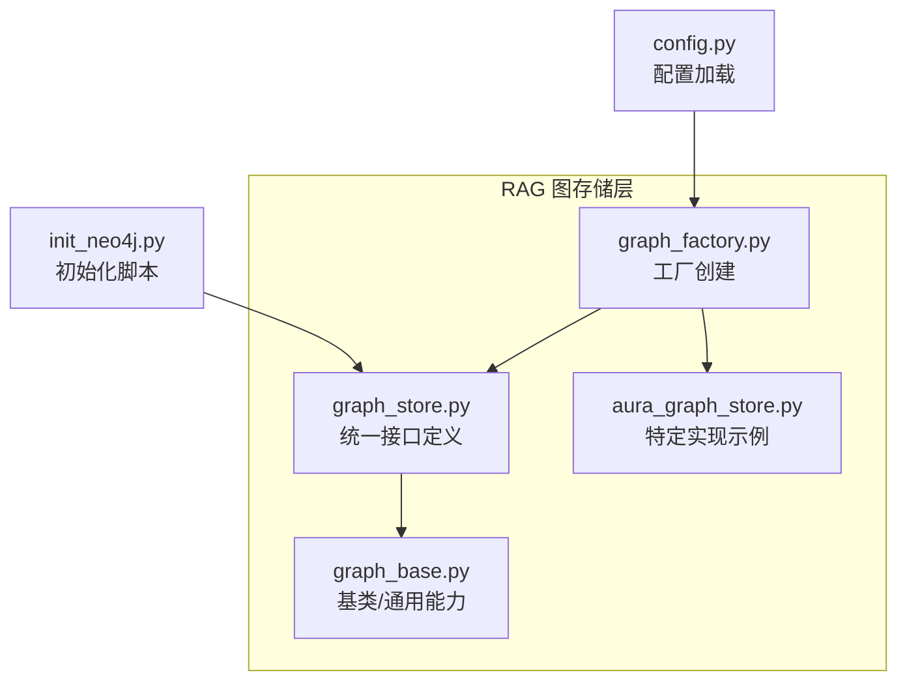
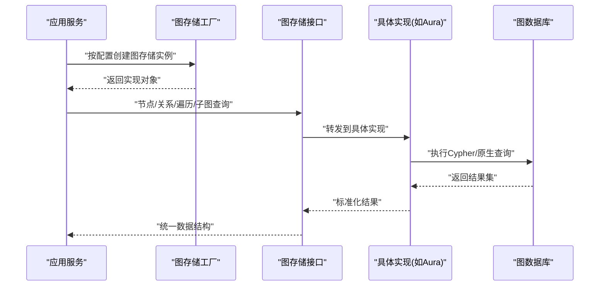
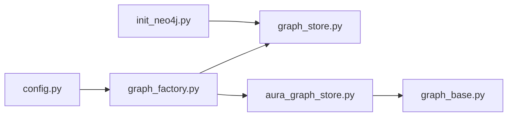

# 图存储后端扩展

<cite>
**本文引用的文件**   
- [backend_design/nexus/rag/graph_store.py](file://backend_design/nexus/rag/graph_store.py)
- [backend_design/nexus/rag/graph_base.py](file://backend_design/nexus/rag/graph_base.py)
- [backend_design/nexus/rag/graph_factory.py](file://backend_design/nexus/rag/graph_factory.py)
- [backend_design/nexus/rag/aura_graph_store.py](file://backend_design/nexus/rag/aura_graph_store.py)
- [backend_design/nexus/config.py](file://backend_design/nexus/config.py)
- [backend_design/scripts/init_neo4j.py](file://backend_design/scripts/init_neo4j.py)
</cite>

## 目录
1. [简介](#简介)
2. [项目结构](#项目结构)
3. [核心组件](#核心组件)
4. [架构总览](#架构总览)
5. [详细组件分析](#详细组件分析)
6. [依赖关系分析](#依赖关系分析)
7. [性能考虑](#性能考虑)
8. [故障排查指南](#故障排查指南)
9. [结论](#结论)
10. [附录](#附录)

## 简介
本文件面向NexusCockpit系统的“图存储后端扩展”，聚焦于图数据库抽象接口、连接与事务管理、查询优化策略、多厂商实现接入（如Neo4j、Amazon Neptune、TigerGraph等）、版本与迁移、以及可视化与运维支持。文档以仓库中现有图存储相关代码为依据，提供可操作的扩展指南与最佳实践，帮助开发者快速集成新的图数据库后端并保障生产可用性与可观测性。

## 项目结构
与图存储相关的核心模块位于 backend_design/nexus/rag 目录下，包含统一的图存储接口定义、工厂模式创建、具体实现与初始化脚本；配置集中在 backend_design/nexus/config.py；初始化脚本位于 backend_design/scripts/init_neo4j.py。

图表来源
- [backend_design/nexus/rag/graph_store.py](file://backend_design/nexus/rag/graph_store.py)
- [backend_design/nexus/rag/graph_base.py](file://backend_design/nexus/rag/graph_base.py)
- [backend_design/nexus/rag/graph_factory.py](file://backend_design/nexus/rag/graph_factory.py)
- [backend_design/nexus/rag/aura_graph_store.py](file://backend_design/nexus/rag/aura_graph_store.py)
- [backend_design/nexus/config.py](file://backend_design/nexus/config.py)
- [backend_design/scripts/init_neo4j.py](file://backend_design/scripts/init_neo4j.py)

章节来源
- [backend_design/nexus/rag/graph_store.py](file://backend_design/nexus/rag/graph_store.py)
- [backend_design/nexus/rag/graph_base.py](file://backend_design/nexus/rag/graph_base.py)
- [backend_design/nexus/rag/graph_factory.py](file://backend_design/nexus/rag/graph_factory.py)
- [backend_design/nexus/rag/aura_graph_store.py](file://backend_design/nexus/rag/aura_graph_store.py)
- [backend_design/nexus/config.py](file://backend_design/nexus/config.py)
- [backend_design/scripts/init_neo4j.py](file://backend_design/scripts/init_neo4j.py)

## 核心组件
- 统一图存储接口：定义节点CRUD、关系管理、图遍历、子图查询、批量操作、事务边界、索引与约束管理等核心方法，屏蔽底层差异。
- 基类与通用能力：封装连接生命周期、重试与退避、错误分类、日志与指标上报、分页与游标处理等通用逻辑。
- 工厂模式：根据配置动态选择并实例化具体图存储实现，便于扩展新厂商。
- 具体实现示例：提供至少一个参考实现（例如 Aura Graph Store），展示如何对接云原生图数据库。
- 配置中心：集中管理连接参数、超时、重试、池大小、事务隔离级别等。
- 初始化脚本：用于在目标图数据库中创建必要的索引、约束或初始数据。

章节来源
- [backend_design/nexus/rag/graph_store.py](file://backend_design/nexus/rag/graph_store.py)
- [backend_design/nexus/rag/graph_base.py](file://backend_design/nexus/rag/graph_base.py)
- [backend_design/nexus/rag/graph_factory.py](file://backend_design/nexus/rag/graph_factory.py)
- [backend_design/nexus/rag/aura_graph_store.py](file://backend_design/nexus/rag/aura_graph_store.py)
- [backend_design/nexus/config.py](file://backend_design/nexus/config.py)
- [backend_design/scripts/init_neo4j.py](file://backend_design/scripts/init_neo4j.py)

## 架构总览
下图展示了上层业务通过工厂获取图存储实例，调用统一接口完成读写与查询，底层由具体实现驱动不同图数据库。

图表来源
- [backend_design/nexus/rag/graph_factory.py](file://backend_design/nexus/rag/graph_factory.py)
- [backend_design/nexus/rag/graph_store.py](file://backend_design/nexus/rag/graph_store.py)
- [backend_design/nexus/rag/aura_graph_store.py](file://backend_design/nexus/rag/aura_graph_store.py)

## 详细组件分析

### 统一图存储接口（graph_store.py）
- 职责
  - 定义节点增删改查、关系增删改查、路径与子图查询、批量写入、事务边界、索引与约束管理、健康检查等标准API。
  - 对返回数据进行规范化，屏蔽不同图数据库的差异。
- 关键能力
  - 节点CRUD：按标签/属性创建、更新、删除、按ID或条件检索。
  - 关系管理：建立/解除关系、按起点/终点/类型检索关系。
  - 图遍历：固定深度/可变深度的邻居遍历、路径枚举、过滤条件。
  - 子图查询：基于种子节点集合与关系类型范围导出子图。
  - 事务：支持显式事务上下文，保证原子性与一致性。
  - 索引与约束：创建/删除唯一约束、属性索引、复合索引等。
  - 批处理：批量插入/更新以提升吞吐。
  - 健康检查：连通性探测与延迟度量。
- 设计要点
  - 接口稳定，向后兼容；新增能力通过可选参数或扩展方法。
  - 错误模型统一，区分网络错误、认证失败、语法错误、约束冲突等。
  - 结果集采用轻量级数据结构，避免过度序列化开销。

章节来源
- [backend_design/nexus/rag/graph_store.py](file://backend_design/nexus/rag/graph_store.py)

### 基类与通用能力（graph_base.py）
- 职责
  - 封装连接生命周期、连接池、重试与退避、超时控制、日志与指标上报、分页与游标、事务包装器。
- 关键能力
  - 连接池：最小/最大连接数、空闲回收、等待队列长度、获取超时。
  - 重试与退避：指数退避、抖动、幂等判断、限流保护。
  - 事务包装：自动提交/回滚、嵌套事务策略、隔离级别映射。
  - 指标与追踪：耗时、成功率、错误码分布、慢查询采样。
  - 错误分类：将底层异常转换为统一错误类型，附带诊断信息。
- 设计要点
  - 线程安全与协程友好；避免长事务占用连接。
  - 可插拔的指标采集器与日志适配器。

章节来源
- [backend_design/nexus/rag/graph_base.py](file://backend_design/nexus/rag/graph_base.py)

### 工厂模式（graph_factory.py）
- 职责
  - 根据配置项选择并实例化具体图存储实现，注入连接参数与全局策略。
- 关键能力
  - 注册表：维护已实现的图存储类型与对应类。
  - 配置解析：从配置中心读取连接参数、重试策略、事务隔离级别等。
  - 健康自检：启动时进行连通性检测与必要索引校验。
- 设计要点
  - 新增实现只需注册类型与实现类，无需改动调用方。
  - 支持运行时切换（谨慎使用，需考虑状态清理）。

章节来源
- [backend_design/nexus/rag/graph_factory.py](file://backend_design/nexus/rag/graph_factory.py)

### 具体实现示例（aura_graph_store.py）
- 职责
  - 演示如何基于统一接口实现一个具体的图存储后端（例如对接云原生图数据库）。
- 关键能力
  - 连接与认证：URL、用户名/密码或令牌、TLS设置。
  - 查询适配：将统一接口调用转换为底层驱动可用的查询语言。
  - 结果映射：将底层结果映射为统一数据结构。
  - 错误转换：将底层异常映射为统一错误类型。
- 设计要点
  - 保持与接口一致的行为语义（事务、重试、分页等）。
  - 针对厂商特性做最小适配，避免耦合过多平台细节。

章节来源
- [backend_design/nexus/rag/aura_graph_store.py](file://backend_design/nexus/rag/aura_graph_store.py)

### 配置管理（config.py）
- 职责
  - 集中管理图存储相关配置：连接参数、连接池、重试、事务、索引策略、监控开关等。
- 关键配置项（示例）
  - 连接：地址、端口、协议、认证方式、TLS。
  - 连接池：最小/最大连接数、空闲超时、获取超时。
  - 重试：最大次数、退避基数、最大退避时间、是否启用抖动。
  - 事务：默认隔离级别、超时时间、是否自动提交。
  - 索引：默认索引策略、复合索引字段列表。
  - 监控：是否开启慢查询记录、指标输出目标。
- 设计要点
  - 分层覆盖：默认值 < 环境变量 < 配置文件 < 运行时注入。
  - 敏感信息加密存储与热更新支持。

章节来源
- [backend_design/nexus/config.py](file://backend_design/nexus/config.py)

### 初始化脚本（init_neo4j.py）
- 职责
  - 在目标图数据库中创建必要的索引、约束与初始数据，确保系统运行前环境就绪。
- 关键能力
  - 索引与约束：唯一约束、属性索引、复合索引。
  - 初始数据：种子节点/关系、字典表、权限基线。
  - 幂等执行：重复运行不破坏已有结构。
- 设计要点
  - 失败重试与断点续跑。
  - 输出详细日志与指标，便于审计与排障。

章节来源
- [backend_design/scripts/init_neo4j.py](file://backend_design/scripts/init_neo4j.py)

## 依赖关系分析
下图展示各模块之间的依赖关系与交互方向。

图表来源
- [backend_design/nexus/config.py](file://backend_design/nexus/config.py)
- [backend_design/nexus/rag/graph_factory.py](file://backend_design/nexus/rag/graph_factory.py)
- [backend_design/nexus/rag/graph_store.py](file://backend_design/nexus/rag/graph_store.py)
- [backend_design/nexus/rag/aura_graph_store.py](file://backend_design/nexus/rag/aura_graph_store.py)
- [backend_design/nexus/rag/graph_base.py](file://backend_design/nexus/rag/graph_base.py)
- [backend_design/scripts/init_neo4j.py](file://backend_design/scripts/init_neo4j.py)

章节来源
- [backend_design/nexus/config.py](file://backend_design/nexus/config.py)
- [backend_design/nexus/rag/graph_factory.py](file://backend_design/nexus/rag/graph_factory.py)
- [backend_design/nexus/rag/graph_store.py](file://backend_design/nexus/rag/graph_store.py)
- [backend_design/nexus/rag/aura_graph_store.py](file://backend_design/nexus/rag/aura_graph_store.py)
- [backend_design/nexus/rag/graph_base.py](file://backend_design/nexus/rag/graph_base.py)
- [backend_design/scripts/init_neo4j.py](file://backend_design/scripts/init_neo4j.py)

## 性能考虑
- 连接池与并发
  - 合理设置最小/最大连接数与获取超时，避免连接饥饿与长时间阻塞。
  - 在高并发场景下，结合异步I/O提升吞吐。
- 事务与隔离
  - 尽量缩短事务边界，减少锁持有时间。
  - 根据业务需求选择合适的隔离级别，权衡一致性与性能。
- 查询优化
  - 优先使用带索引的属性过滤，避免全图扫描。
  - 限制遍历深度与返回规模，采用分页与游标。
  - 合并多次小查询为单次批量操作，降低往返开销。
- 索引与约束
  - 为高频查询字段建立单列/复合索引。
  - 对唯一性要求高的字段添加唯一约束，避免重复写入。
- 缓存与降级
  - 热点数据可引入本地或分布式缓存，注意失效策略。
  - 图数据库不可用时，提供只读缓存或降级响应。

[本节为通用指导，不直接分析具体文件]

## 故障排查指南
- 常见问题定位
  - 连接失败：检查地址、端口、认证、TLS与防火墙策略。
  - 查询超时：查看慢查询日志，确认是否存在缺失索引或过深遍历。
  - 事务冲突：观察锁等待与死锁告警，调整事务粒度与重试策略。
  - 资源耗尽：监控连接池使用率、内存与CPU，必要时扩容或限流。
- 诊断手段
  - 启用慢查询采样与详细日志，记录关键参数与堆栈。
  - 暴露基础指标（连接池、QPS、P99延迟、错误率），配合告警规则。
  - 使用健康检查端点验证连通性与基本功能。
- 恢复策略
  - 自动重试与熔断，避免雪崩。
  - 分片/分区写入，降低热点影响。
  - 定期备份与演练恢复流程。

[本节为通用指导，不直接分析具体文件]

## 结论
通过统一的图存储接口与工厂模式，NexusCockpit能够以低耦合的方式接入多种图数据库，并在连接管理、事务处理、查询优化与可观测性方面提供一致的体验。建议在生产环境中完善索引与约束、强化监控与告警、制定完善的备份与迁移策略，以确保高可用与高性能。

[本节为总结性内容，不直接分析具体文件]

## 附录

### 自定义图存储后端实现步骤
- 新建实现类
  - 继承基类，实现统一接口中的全部方法。
  - 在构造中完成连接池与重试策略初始化。
- 注册到工厂
  - 在工厂注册表中登记新实现类型与类引用。
  - 在配置中增加对应的连接参数与策略。
- 编写初始化脚本
  - 为目标数据库创建索引、约束与初始数据。
  - 保证幂等与可重入。
- 测试与验收
  - 单元测试覆盖CRUD、遍历、事务、错误分支。
  - 压测评估吞吐与延迟，调优连接池与查询。
- 上线与监控
  - 灰度发布，逐步放量。
  - 配置告警阈值与看板，持续优化。

[本节为通用指导，不直接分析具体文件]

### 多厂商接入要点（Neo4j、Amazon Neptune、TigerGraph）
- Neo4j
  - 使用官方驱动，关注连接池与事务边界。
  - 利用APOC等扩展库增强能力（按需）。
- Amazon Neptune
  - 遵循Gremlin或OpenCypher方言差异，做好查询适配。
  - 注意读写分离与集群拓扑变化。
- TigerGraph
  - 使用GSQL或REST API，注意批次与分页策略。
  - 关注图模式变更对查询的影响。

[本节为通用指导，不直接分析具体文件]

### 版本管理与迁移策略
- Schema变更
  - 通过迁移脚本管理索引与约束变更，保证幂等。
  - 变更前进行兼容性评估与回滚方案准备。
- 数据备份与恢复
  - 定期全量备份，增量同步至冷备。
  - 定期演练恢复流程，验证RTO/RPO。
- 增量同步
  - 基于时间戳或事件流的增量捕获。
  - 冲突解决策略与去重机制。

[本节为通用指导，不直接分析具体文件]

### 可视化与运维支持
- 可视化
  - 将子图结果导出为前端可视化的标准格式。
  - 支持按标签/关系类型筛选与聚合统计。
- 监控
  - 暴露连接池、事务、查询延迟、错误率等指标。
  - 结合日志与链路追踪定位问题。
- 故障排查
  - 提供健康检查与诊断命令。
  - 记录慢查询样本与上下文信息。

[本节为通用指导，不直接分析具体文件]