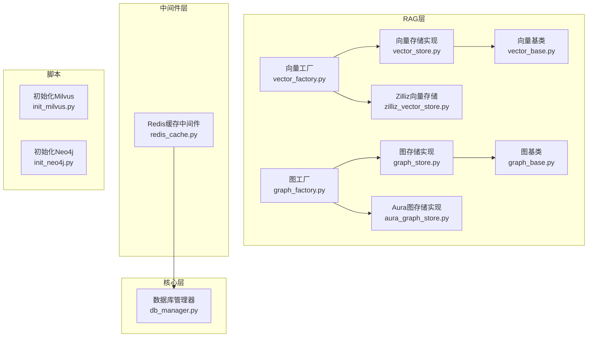
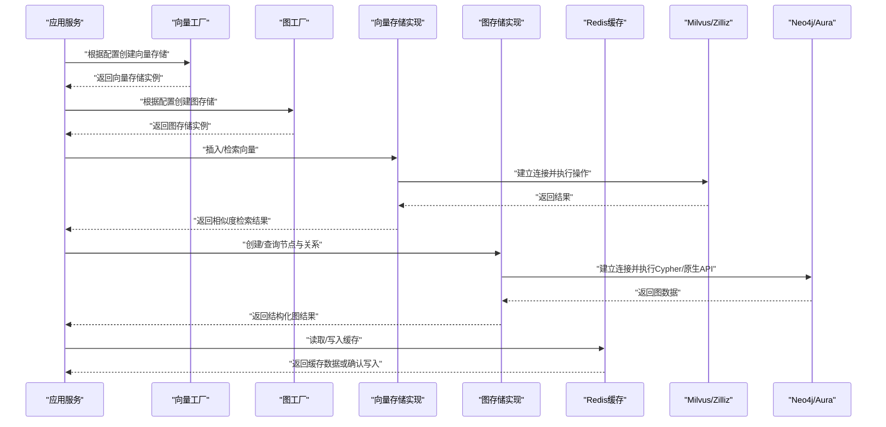
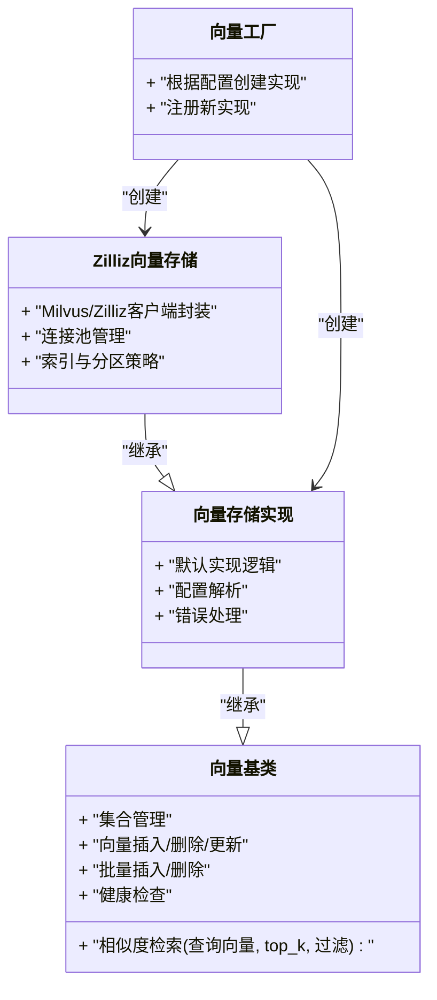
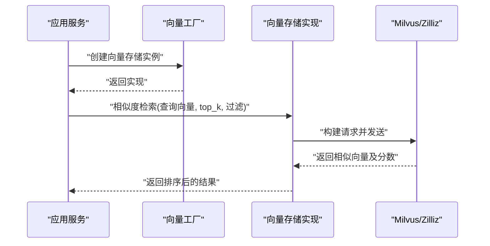
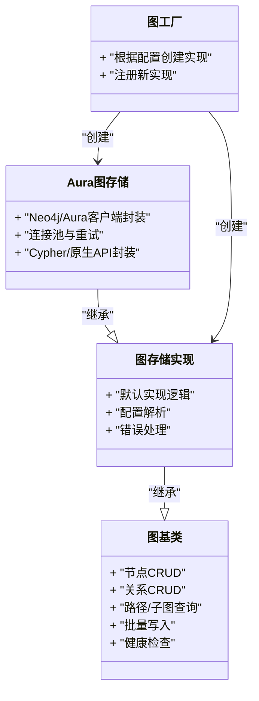
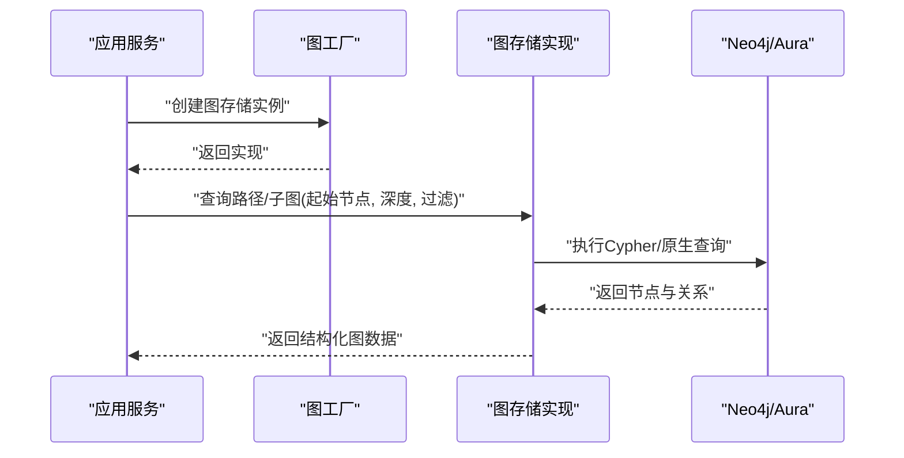
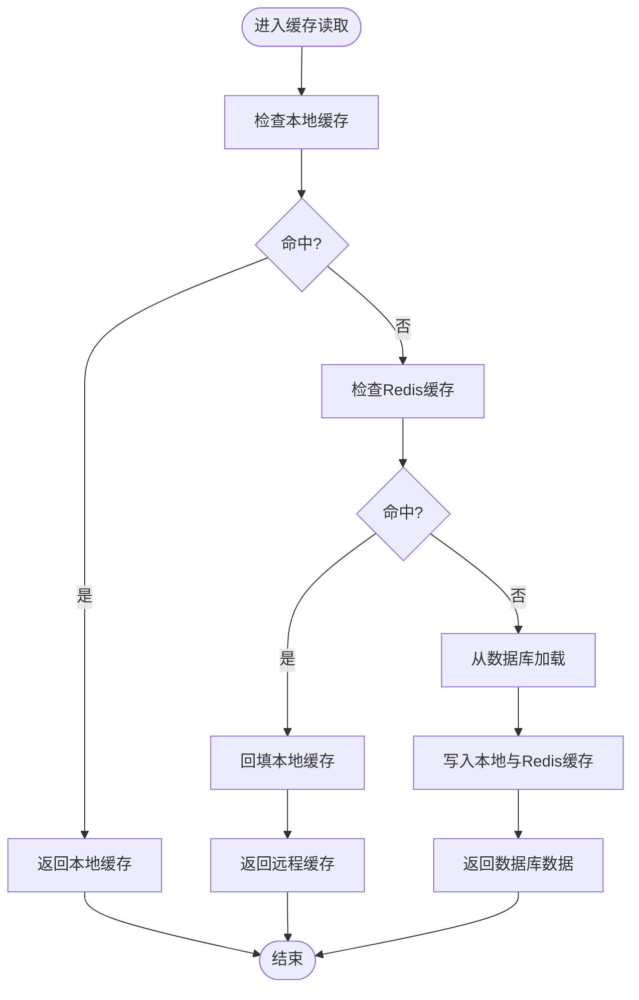
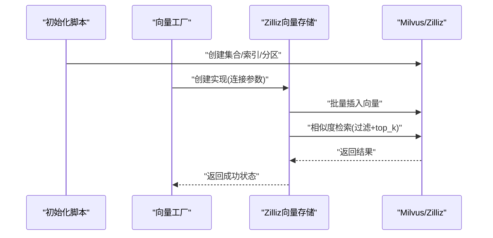
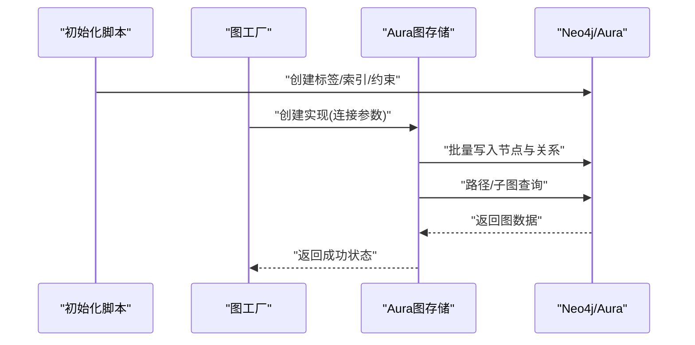
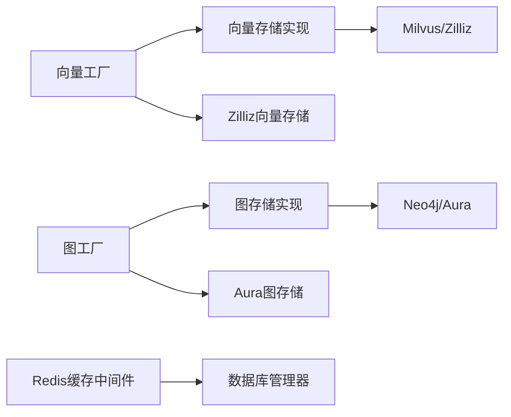

# 存储后端扩展

<cite>
**本文引用的文件**   
- [backend_design/nexus/rag/vector_base.py](file://backend_design/nexus/rag/vector_base.py)
- [backend_design/nexus/rag/vector_store.py](file://backend_design/nexus/rag/vector_store.py)
- [backend_design/nexus/rag/vector_factory.py](file://backend_design/nexus/rag/vector_factory.py)
- [backend_design/nexus/rag/zilliz_vector_store.py](file://backend_design/nexus/rag/zilliz_vector_store.py)
- [backend_design/nexus/rag/graph_base.py](file://backend_design/nexus/rag/graph_base.py)
- [backend_design/nexus/rag/graph_store.py](file://backend_design/nexus/rag/graph_store.py)
- [backend_design/nexus/rag/graph_factory.py](file://backend_design/nexus/rag/graph_factory.py)
- [backend_design/nexus/rag/aura_graph_store.py](file://backend_design/nexus/rag/aura_graph_store.py)
- [backend_design/nexus/middleware/redis_cache.py](file://backend_design/nexus/middleware/redis_cache.py)
- [backend_design/nexus/core/db_manager.py](file://backend_design/nexus/core/db_manager.py)
- [backend_design/scripts/init_milvus.py](file://backend_design/scripts/init_milvus.py)
- [backend_design/scripts/init_neo4j.py](file://backend_design/scripts/init_neo4j.py)
</cite>

## 目录
1. [简介](#简介)
2. [项目结构](#项目结构)
3. [核心组件](#核心组件)
4. [架构总览](#架构总览)
5. [详细组件分析](#详细组件分析)
6. [依赖关系分析](#依赖关系分析)
7. [性能考虑](#性能考虑)
8. [故障排查指南](#故障排查指南)
9. [结论](#结论)
10. [附录](#附录)

## 简介
本文件面向NexusCockpit系统的“存储后端扩展”，聚焦三类存储：向量存储、图存储与缓存存储。文档从接口定义、相似度计算、批量操作、连接管理、一致性保证、失效策略，到具体实现（Milvus、Neo4j、自定义）与性能优化进行全面说明，帮助开发者快速接入并扩展新的存储后端。

## 项目结构
与存储后端扩展相关的代码主要分布在以下模块：
- 向量存储：抽象接口、工厂、默认实现与Zilliz/Milvus实现
- 图存储：抽象接口、工厂、默认实现与Aura Graph Store实现
- 缓存存储：Redis中间件封装
- 数据库管理：通用DB连接管理（用于关系型数据）
- 初始化脚本：Milvus与Neo4j的初始化示例

图表来源
- [backend_design/nexus/rag/vector_base.py](file://backend_design/nexus/rag/vector_base.py)
- [backend_design/nexus/rag/vector_store.py](file://backend_design/nexus/rag/vector_store.py)
- [backend_design/nexus/rag/vector_factory.py](file://backend_design/nexus/rag/vector_factory.py)
- [backend_design/nexus/rag/zilliz_vector_store.py](file://backend_design/nexus/rag/zilliz_vector_store.py)
- [backend_design/nexus/rag/graph_base.py](file://backend_design/nexus/rag/graph_base.py)
- [backend_design/nexus/rag/graph_store.py](file://backend_design/nexus/rag/graph_store.py)
- [backend_design/nexus/rag/graph_factory.py](file://backend_design/nexus/rag/graph_factory.py)
- [backend_design/nexus/rag/aura_graph_store.py](file://backend_design/nexus/rag/aura_graph_store.py)
- [backend_design/nexus/middleware/redis_cache.py](file://backend_design/nexus/middleware/redis_cache.py)
- [backend_design/nexus/core/db_manager.py](file://backend_design/nexus/core/db_manager.py)
- [backend_design/scripts/init_milvus.py](file://backend_design/scripts/init_milvus.py)
- [backend_design/scripts/init_neo4j.py](file://backend_design/scripts/init_neo4j.py)

章节来源
- [backend_design/nexus/rag/vector_base.py](file://backend_design/nexus/rag/vector_base.py)
- [backend_design/nexus/rag/vector_store.py](file://backend_design/nexus/rag/vector_store.py)
- [backend_design/nexus/rag/vector_factory.py](file://backend_design/nexus/rag/vector_factory.py)
- [backend_design/nexus/rag/zilliz_vector_store.py](file://backend_design/nexus/rag/zilliz_vector_store.py)
- [backend_design/nexus/rag/graph_base.py](file://backend_design/nexus/rag/graph_base.py)
- [backend_design/nexus/rag/graph_store.py](file://backend_design/nexus/rag/graph_store.py)
- [backend_design/nexus/rag/graph_factory.py](file://backend_design/nexus/rag/graph_factory.py)
- [backend_design/nexus/rag/aura_graph_store.py](file://backend_design/nexus/rag/aura_graph_store.py)
- [backend_design/nexus/middleware/redis_cache.py](file://backend_design/nexus/middleware/redis_cache.py)
- [backend_design/nexus/core/db_manager.py](file://backend_design/nexus/core/db_manager.py)
- [backend_design/scripts/init_milvus.py](file://backend_design/scripts/init_milvus.py)
- [backend_design/scripts/init_neo4j.py](file://backend_design/scripts/init_neo4j.py)

## 核心组件
本节概述三大存储后端的职责与边界：
- 向量存储后端：提供向量的增删改查、相似度检索、批量写入等能力；通过工厂按配置选择具体实现（如Milvus/Zilliz）。
- 图存储后端：提供节点与关系的创建、更新、删除与查询；支持路径遍历、子图检索等；通过工厂选择具体实现（如Aura）。
- 缓存存储后端：基于Redis的高性能键值缓存，提供TTL、原子操作、分布式锁等能力，服务于会话、热点数据与中间结果。

章节来源
- [backend_design/nexus/rag/vector_base.py](file://backend_design/nexus/rag/vector_base.py)
- [backend_design/nexus/rag/vector_store.py](file://backend_design/nexus/rag/vector_store.py)
- [backend_design/nexus/rag/vector_factory.py](file://backend_design/nexus/rag/vector_factory.py)
- [backend_design/nexus/rag/zilliz_vector_store.py](file://backend_design/nexus/rag/zilliz_vector_store.py)
- [backend_design/nexus/rag/graph_base.py](file://backend_design/nexus/rag/graph_base.py)
- [backend_design/nexus/rag/graph_store.py](file://backend_design/nexus/rag/graph_store.py)
- [backend_design/nexus/rag/graph_factory.py](file://backend_design/nexus/rag/graph_factory.py)
- [backend_design/nexus/rag/aura_graph_store.py](file://backend_design/nexus/rag/aura_graph_store.py)
- [backend_design/nexus/middleware/redis_cache.py](file://backend_design/nexus/middleware/redis_cache.py)

## 架构总览
下图展示了上层业务如何通过工厂获取具体存储实现，以及各存储后端与外部系统交互的关系。

图表来源
- [backend_design/nexus/rag/vector_factory.py](file://backend_design/nexus/rag/vector_factory.py)
- [backend_design/nexus/rag/graph_factory.py](file://backend_design/nexus/rag/graph_factory.py)
- [backend_design/nexus/rag/vector_store.py](file://backend_design/nexus/rag/vector_store.py)
- [backend_design/nexus/rag/zilliz_vector_store.py](file://backend_design/nexus/rag/zilliz_vector_store.py)
- [backend_design/nexus/rag/graph_store.py](file://backend_design/nexus/rag/graph_store.py)
- [backend_design/nexus/rag/aura_graph_store.py](file://backend_design/nexus/rag/aura_graph_store.py)
- [backend_design/nexus/middleware/redis_cache.py](file://backend_design/nexus/middleware/redis_cache.py)

## 详细组件分析

### 向量存储后端
- 接口与抽象
  - 定义统一的向量集合管理、向量CRUD、相似度检索、批量写入等接口，屏蔽底层差异。
  - 支持维度、度量类型、索引参数等配置项，便于不同向量库适配。
- 相似度计算
  - 在检索时指定度量方式（如余弦相似度），由底层向量库完成近似最近邻搜索。
  - 可结合过滤条件（元数据筛选）提升召回质量。
- 批量操作
  - 提供批量插入、批量删除、批量更新接口，减少网络往返，提高吞吐。
- 工厂与实现
  - 通过工厂按配置动态创建具体实现（如Zilliz/Milvus）。
  - 默认实现提供基础行为，具体实现覆盖关键方法以对接特定向量库。

图表来源
- [backend_design/nexus/rag/vector_base.py](file://backend_design/nexus/rag/vector_base.py)
- [backend_design/nexus/rag/vector_store.py](file://backend_design/nexus/rag/vector_store.py)
- [backend_design/nexus/rag/zilliz_vector_store.py](file://backend_design/nexus/rag/zilliz_vector_store.py)
- [backend_design/nexus/rag/vector_factory.py](file://backend_design/nexus/rag/vector_factory.py)

章节来源
- [backend_design/nexus/rag/vector_base.py](file://backend_design/nexus/rag/vector_base.py)
- [backend_design/nexus/rag/vector_store.py](file://backend_design/nexus/rag/vector_store.py)
- [backend_design/nexus/rag/zilliz_vector_store.py](file://backend_design/nexus/rag/zilliz_vector_store.py)
- [backend_design/nexus/rag/vector_factory.py](file://backend_design/nexus/rag/vector_factory.py)

#### 向量检索流程（序列图）

图表来源
- [backend_design/nexus/rag/vector_factory.py](file://backend_design/nexus/rag/vector_factory.py)
- [backend_design/nexus/rag/vector_store.py](file://backend_design/nexus/rag/vector_store.py)
- [backend_design/nexus/rag/zilliz_vector_store.py](file://backend_design/nexus/rag/zilliz_vector_store.py)

### 图存储后端
- 接口与抽象
  - 定义节点与关系的CRUD、路径查询、子图检索、事务性写入等接口。
  - 支持标签、属性、索引与约束的配置，便于不同图数据库适配。
- 连接与查询
  - 通过工厂按需创建具体实现（如Aura Graph Store），内部封装连接管理与重试机制。
  - 查询优化包括分页、限制深度、选择性投影字段，避免全图扫描。
- 实现与扩展
  - 默认实现提供通用逻辑，具体实现覆盖底层驱动调用。
  - 新增图数据库只需实现统一接口并通过工厂注册。

图表来源
- [backend_design/nexus/rag/graph_base.py](file://backend_design/nexus/rag/graph_base.py)
- [backend_design/nexus/rag/graph_store.py](file://backend_design/nexus/rag/graph_store.py)
- [backend_design/nexus/rag/aura_graph_store.py](file://backend_design/nexus/rag/aura_graph_store.py)
- [backend_design/nexus/rag/graph_factory.py](file://backend_design/nexus/rag/graph_factory.py)

章节来源
- [backend_design/nexus/rag/graph_base.py](file://backend_design/nexus/rag/graph_base.py)
- [backend_design/nexus/rag/graph_store.py](file://backend_design/nexus/rag/graph_store.py)
- [backend_design/nexus/rag/aura_graph_store.py](file://backend_design/nexus/rag/aura_graph_store.py)
- [backend_design/nexus/rag/graph_factory.py](file://backend_design/nexus/rag/graph_factory.py)

#### 图查询流程（序列图）

图表来源
- [backend_design/nexus/rag/graph_factory.py](file://backend_design/nexus/rag/graph_factory.py)
- [backend_design/nexus/rag/graph_store.py](file://backend_design/nexus/rag/graph_store.py)
- [backend_design/nexus/rag/aura_graph_store.py](file://backend_design/nexus/rag/aura_graph_store.py)

### 缓存存储后端（Redis）
- 策略与一致性
  - 采用TTL过期策略控制缓存生命周期，配合版本号或时间戳保证强一致场景下的数据一致性。
  - 对热点数据进行预取与分层缓存（本地+分布式），降低远端压力。
- 失效机制
  - 支持主动失效（按Key或模式）、被动失效（TTL到期）、延迟双删（写库后延时删除缓存）。
  - 针对并发写冲突，使用分布式锁或原子操作保障正确性。
- 中间件封装
  - 提供统一的缓存读写接口，包含序列化、压缩、错误降级与监控埋点。

图表来源
- [backend_design/nexus/middleware/redis_cache.py](file://backend_design/nexus/middleware/redis_cache.py)
- [backend_design/nexus/core/db_manager.py](file://backend_design/nexus/core/db_manager.py)

章节来源
- [backend_design/nexus/middleware/redis_cache.py](file://backend_design/nexus/middleware/redis_cache.py)
- [backend_design/nexus/core/db_manager.py](file://backend_design/nexus/core/db_manager.py)

### 完整接入案例

#### Milvus向量库接入
- 初始化与配置
  - 使用初始化脚本准备集合、索引与分区策略，确保维度与度量类型匹配。
  - 通过工厂配置选择Milvus/Zilliz实现，注入连接参数与重试策略。
- 典型操作
  - 批量插入向量与元数据，设置过滤字段以提升检索精度。
  - 相似度检索时指定top_k与过滤条件，返回排序结果。

图表来源
- [backend_design/scripts/init_milvus.py](file://backend_design/scripts/init_milvus.py)
- [backend_design/nexus/rag/vector_factory.py](file://backend_design/nexus/rag/vector_factory.py)
- [backend_design/nexus/rag/zilliz_vector_store.py](file://backend_design/nexus/rag/zilliz_vector_store.py)

章节来源
- [backend_design/scripts/init_milvus.py](file://backend_design/scripts/init_milvus.py)
- [backend_design/nexus/rag/vector_factory.py](file://backend_design/nexus/rag/vector_factory.py)
- [backend_design/nexus/rag/zilliz_vector_store.py](file://backend_design/nexus/rag/zilliz_vector_store.py)

#### Neo4j图数据库接入
- 初始化与配置
  - 使用初始化脚本创建标签、索引与约束，优化查询路径。
  - 通过工厂配置选择Aura实现，注入认证与连接池参数。
- 典型操作
  - 批量创建节点与关系，设置属性与索引。
  - 执行路径查询与子图检索，限制深度与投影字段。

图表来源
- [backend_design/scripts/init_neo4j.py](file://backend_design/scripts/init_neo4j.py)
- [backend_design/nexus/rag/graph_factory.py](file://backend_design/nexus/rag/graph_factory.py)
- [backend_design/nexus/rag/aura_graph_store.py](file://backend_design/nexus/rag/aura_graph_store.py)

章节来源
- [backend_design/scripts/init_neo4j.py](file://backend_design/scripts/init_neo4j.py)
- [backend_design/nexus/rag/graph_factory.py](file://backend_design/nexus/rag/graph_factory.py)
- [backend_design/nexus/rag/aura_graph_store.py](file://backend_design/nexus/rag/aura_graph_store.py)

#### 自定义存储后端接入
- 步骤
  - 实现向量或图基类定义的接口，覆盖必要方法（如连接、CRUD、检索）。
  - 在工厂中注册新实现，并提供配置解析与健康检查。
  - 编写单元测试验证连通性与基本功能。
- 建议
  - 遵循幂等与重试策略，处理网络抖动与超时。
  - 提供指标与日志，便于问题定位与容量规划。

章节来源
- [backend_design/nexus/rag/vector_base.py](file://backend_design/nexus/rag/vector_base.py)
- [backend_design/nexus/rag/vector_factory.py](file://backend_design/nexus/rag/vector_factory.py)
- [backend_design/nexus/rag/graph_base.py](file://backend_design/nexus/rag/graph_base.py)
- [backend_design/nexus/rag/graph_factory.py](file://backend_design/nexus/rag/graph_factory.py)

## 依赖关系分析
- 耦合与内聚
  - 工厂与实现解耦，通过配置选择具体后端，提升可扩展性。
  - 中间件层与核心层分离，缓存与数据库管理职责清晰。
- 外部依赖
  - 向量后端依赖Milvus/Zilliz客户端。
  - 图后端依赖Neo4j/Aura客户端。
  - 缓存后端依赖Redis客户端。
- 潜在循环依赖
  - 当前设计通过工厂与接口避免循环依赖，保持单向依赖。

图表来源
- [backend_design/nexus/rag/vector_factory.py](file://backend_design/nexus/rag/vector_factory.py)
- [backend_design/nexus/rag/vector_store.py](file://backend_design/nexus/rag/vector_store.py)
- [backend_design/nexus/rag/zilliz_vector_store.py](file://backend_design/nexus/rag/zilliz_vector_store.py)
- [backend_design/nexus/rag/graph_factory.py](file://backend_design/nexus/rag/graph_factory.py)
- [backend_design/nexus/rag/graph_store.py](file://backend_design/nexus/rag/graph_store.py)
- [backend_design/nexus/rag/aura_graph_store.py](file://backend_design/nexus/rag/aura_graph_store.py)
- [backend_design/nexus/middleware/redis_cache.py](file://backend_design/nexus/middleware/redis_cache.py)
- [backend_design/nexus/core/db_manager.py](file://backend_design/nexus/core/db_manager.py)

章节来源
- [backend_design/nexus/rag/vector_factory.py](file://backend_design/nexus/rag/vector_factory.py)
- [backend_design/nexus/rag/vector_store.py](file://backend_design/nexus/rag/vector_store.py)
- [backend_design/nexus/rag/zilliz_vector_store.py](file://backend_design/nexus/rag/zilliz_vector_store.py)
- [backend_design/nexus/rag/graph_factory.py](file://backend_design/nexus/rag/graph_factory.py)
- [backend_design/nexus/rag/graph_store.py](file://backend_design/nexus/rag/graph_store.py)
- [backend_design/nexus/rag/aura_graph_store.py](file://backend_design/nexus/rag/aura_graph_store.py)
- [backend_design/nexus/middleware/redis_cache.py](file://backend_design/nexus/middleware/redis_cache.py)
- [backend_design/nexus/core/db_manager.py](file://backend_design/nexus/core/db_manager.py)

## 性能考虑
- 连接池管理
  - 为向量与图后端维护连接池，合理设置最大连接数与空闲回收策略，避免资源耗尽。
  - 对Redis客户端启用连接复用与超时控制。
- 查询优化
  - 向量检索：选择合适的索引类型（HNSW/IVF/PQ），调整nprobe与efSearch等参数；利用元数据过滤减少候选集。
  - 图查询：限制遍历深度、选择性投影字段、使用索引与约束，避免全图扫描。
- 数据分片与分区
  - 向量库：按租户或时间范围进行分区，提升隔离与检索效率。
  - 图库：按标签或属性划分节点，结合路由策略减少跨分区查询。
- 批处理与异步
  - 批量插入/删除减少网络往返；对耗时任务采用异步队列与背压控制。
- 缓存策略
  - 多级缓存（本地+Redis），热点数据预取；合理设置TTL与失效策略，避免雪崩。

[本节为通用指导，不直接分析具体文件]

## 故障排查指南
- 连接失败
  - 检查向量/图后端连接参数与网络可达性；查看工厂创建过程的异常堆栈。
  - 对Redis客户端检查认证、端口与防火墙规则。
- 检索/查询性能退化
  - 评估索引与分区策略是否合理；检查过滤条件是否导致全表扫描。
  - 观察连接池使用率与慢查询日志，定位瓶颈。
- 数据不一致
  - 核对缓存失效策略与写库顺序；必要时引入版本控制或分布式锁。
  - 对批量操作增加事务回滚与补偿机制。
- 监控与日志
  - 为各后端添加健康检查与指标上报；记录关键操作的耗时与错误码。

章节来源
- [backend_design/nexus/rag/vector_factory.py](file://backend_design/nexus/rag/vector_factory.py)
- [backend_design/nexus/rag/graph_factory.py](file://backend_design/nexus/rag/graph_factory.py)
- [backend_design/nexus/middleware/redis_cache.py](file://backend_design/nexus/middleware/redis_cache.py)
- [backend_design/nexus/core/db_manager.py](file://backend_design/nexus/core/db_manager.py)

## 结论
NexusCockpit的存储后端扩展通过统一的抽象接口与工厂模式，实现了向量、图与缓存三类的灵活接入与替换。借助合理的连接池、查询优化与缓存策略，可在高并发与大数据量场景下保持稳定与高效。开发者可按需扩展新的存储后端，并在生产环境中通过监控与测试持续优化。

[本节为总结，不直接分析具体文件]

## 附录
- 初始化脚本参考
  - Milvus集合与索引初始化：[backend_design/scripts/init_milvus.py](file://backend_design/scripts/init_milvus.py)
  - Neo4j标签与索引初始化：[backend_design/scripts/init_neo4j.py](file://backend_design/scripts/init_neo4j.py)
- 关键实现文件
  - 向量基类与实现：[backend_design/nexus/rag/vector_base.py](file://backend_design/nexus/rag/vector_base.py)、[backend_design/nexus/rag/vector_store.py](file://backend_design/nexus/rag/vector_store.py)、[backend_design/nexus/rag/zilliz_vector_store.py](file://backend_design/nexus/rag/zilliz_vector_store.py)
  - 图基类与实现：[backend_design/nexus/rag/graph_base.py](file://backend_design/nexus/rag/graph_base.py)、[backend_design/nexus/rag/graph_store.py](file://backend_design/nexus/rag/graph_store.py)、[backend_design/nexus/rag/aura_graph_store.py](file://backend_design/nexus/rag/aura_graph_store.py)
  - 工厂与中间件：[backend_design/nexus/rag/vector_factory.py](file://backend_design/nexus/rag/vector_factory.py)、[backend_design/nexus/rag/graph_factory.py](file://backend_design/nexus/rag/graph_factory.py)、[backend_design/nexus/middleware/redis_cache.py](file://backend_design/nexus/middleware/redis_cache.py)
  - 数据库管理：[backend_design/nexus/core/db_manager.py](file://backend_design/nexus/core/db_manager.py)