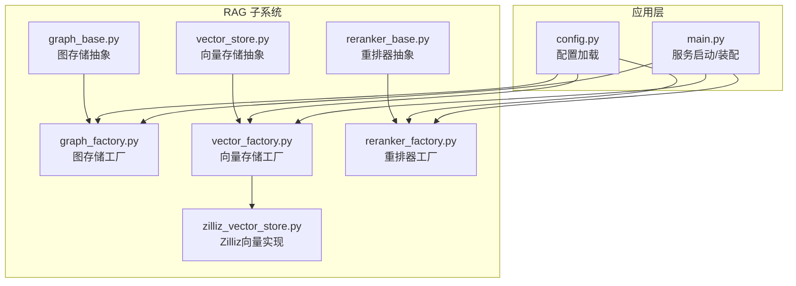
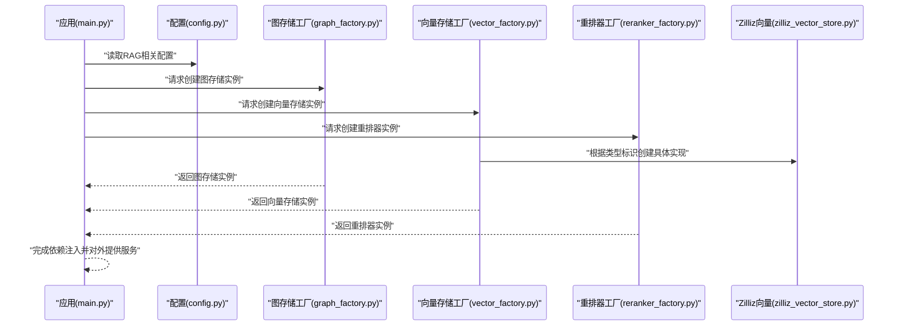
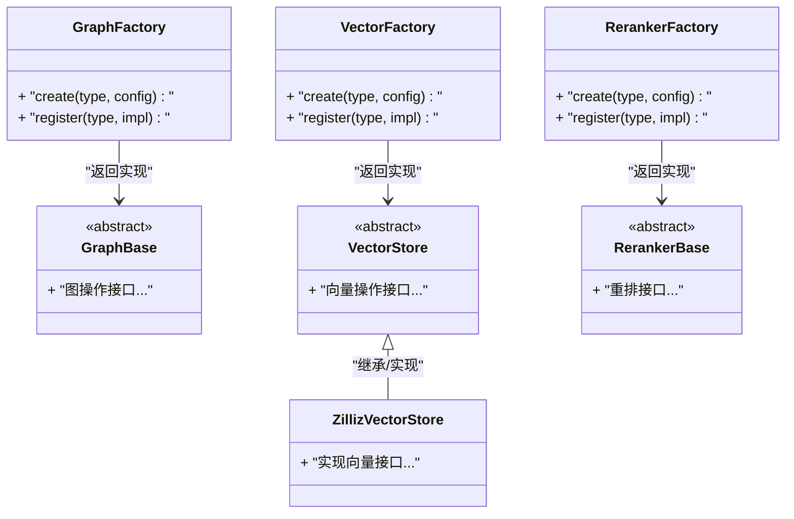
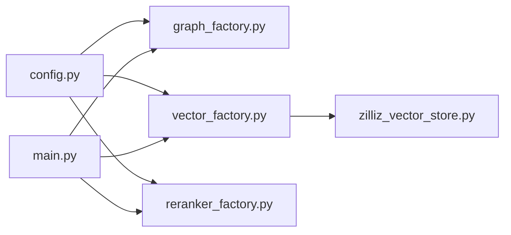
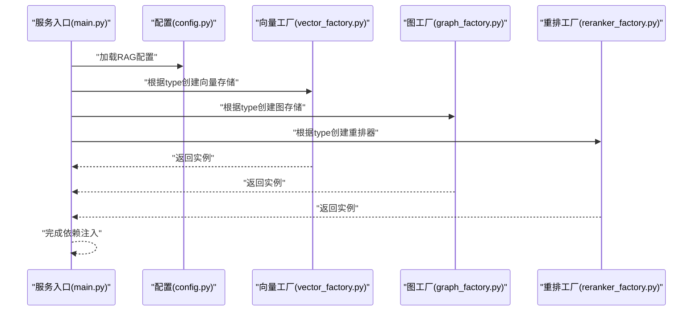

# 存储工厂模式实现

<cite>
**本文引用的文件**   
- [backend_design/nexus/rag/graph_factory.py](file://backend_design/nexus/rag/graph_factory.py)
- [backend_design/nexus/rag/vector_factory.py](file://backend_design/nexus/rag/vector_factory.py)
- [backend_design/nexus/rag/reranker_factory.py](file://backend_design/nexus/rag/reranker_factory.py)
- [backend_design/nexus/rag/graph_base.py](file://backend_design/nexus/rag/graph_base.py)
- [backend_design/nexus/rag/vector_store.py](file://backend_design/nexus/rag/vector_store.py)
- [backend_design/nexus/rag/reranker_base.py](file://backend_design/nexus/rag/reranker_base.py)
- [backend_design/nexus/rag/zilliz_vector_store.py](file://backend_design/nexus/rag/zilliz_vector_store.py)
- [backend_design/nexus/config.py](file://backend_design/nexus/config.py)
- [backend_design/nexus/main.py](file://backend_design/nexus/main.py)
</cite>

## 目录
1. [简介](#简介)
2. [项目结构](#项目结构)
3. [核心组件](#核心组件)
4. [架构总览](#架构总览)
5. [详细组件分析](#详细组件分析)
6. [依赖关系分析](#依赖关系分析)
7. [性能与扩展性](#性能与扩展性)
8. [故障排查指南](#故障排查指南)
9. [结论](#结论)
10. [附录：配置与使用示例](#附录配置与使用示例)

## 简介
本文件面向NexusCockpit系统的“存储工厂模式”实现，聚焦RAG子系统中的图存储、向量存储与重排序器三大后端的统一抽象与工厂化创建。文档覆盖以下要点：
- 抽象接口定义与产品族设计
- 具体工厂类实现与注册机制
- 动态加载与运行时切换（含配置驱动）
- 依赖注入与生命周期管理（初始化、清理、异常处理）
- 多后端配置、条件路由、负载均衡等高级用法
- 测试策略（Mock、单测、集成测试）
- 工程化考虑（配置管理、版本兼容、向后兼容）

## 项目结构
与存储工厂相关的代码集中在RAG模块中，采用“按能力分层 + 工厂解耦”的组织方式：
- 抽象层：定义统一的存储/检索/重排接口
- 工厂层：根据配置或上下文选择并创建具体实现
- 实现层：提供多种后端的具体实现（如Zilliz向量库）
- 配置与启动：集中读取配置，完成工厂与实例的装配

图表来源
- [backend_design/nexus/rag/graph_base.py](file://backend_design/nexus/rag/graph_base.py)
- [backend_design/nexus/rag/vector_store.py](file://backend_design/nexus/rag/vector_store.py)
- [backend_design/nexus/rag/reranker_base.py](file://backend_design/nexus/rag/reranker_base.py)
- [backend_design/nexus/rag/graph_factory.py](file://backend_design/nexus/rag/graph_factory.py)
- [backend_design/nexus/rag/vector_factory.py](file://backend_design/nexus/rag/vector_factory.py)
- [backend_design/nexus/rag/reranker_factory.py](file://backend_design/nexus/rag/reranker_factory.py)
- [backend_design/nexus/rag/zilliz_vector_store.py](file://backend_design/nexus/rag/zilliz_vector_store.py)
- [backend_design/nexus/config.py](file://backend_design/nexus/config.py)
- [backend_design/nexus/main.py](file://backend_design/nexus/main.py)

章节来源
- [backend_design/nexus/rag/graph_factory.py](file://backend_design/nexus/rag/graph_factory.py)
- [backend_design/nexus/rag/vector_factory.py](file://backend_design/nexus/rag/vector_factory.py)
- [backend_design/nexus/rag/reranker_factory.py](file://backend_design/nexus/rag/reranker_factory.py)
- [backend_design/nexus/rag/graph_base.py](file://backend_design/nexus/rag/graph_base.py)
- [backend_design/nexus/rag/vector_store.py](file://backend_design/nexus/rag/vector_store.py)
- [backend_design/nexus/rag/reranker_base.py](file://backend_design/nexus/rag/reranker_base.py)
- [backend_design/nexus/rag/zilliz_vector_store.py](file://backend_design/nexus/rag/zilliz_vector_store.py)
- [backend_design/nexus/config.py](file://backend_design/nexus/config.py)
- [backend_design/nexus/main.py](file://backend_design/nexus/main.py)

## 核心组件
- 抽象接口族
  - 图存储抽象：定义图谱增删改查、查询、事务等通用方法
  - 向量存储抽象：定义索引构建、向量写入/更新/删除、相似度检索等
  - 重排器抽象：定义对候选结果进行重排序的统一接口
- 工厂类
  - 图存储工厂：依据配置或类型标识创建对应图存储实现
  - 向量存储工厂：依据配置或类型标识创建对应向量存储实现
  - 重排器工厂：依据配置或类型标识创建对应重排器实现
- 具体产品
  - 向量存储：例如基于Zilliz的实现
  - 其他实现可按需扩展（如本地内存、Milvus、Elastic等）
- 配置与装配
  - 从配置中心/配置文件读取后端类型与连接参数
  - 在应用启动时完成工厂与实例的装配，暴露给上层调用

章节来源
- [backend_design/nexus/rag/graph_base.py](file://backend_design/nexus/rag/graph_base.py)
- [backend_design/nexus/rag/vector_store.py](file://backend_design/nexus/rag/vector_store.py)
- [backend_design/nexus/rag/reranker_base.py](file://backend_design/nexus/rag/reranker_base.py)
- [backend_design/nexus/rag/graph_factory.py](file://backend_design/nexus/rag/graph_factory.py)
- [backend_design/nexus/rag/vector_factory.py](file://backend_design/nexus/rag/vector_factory.py)
- [backend_design/nexus/rag/reranker_factory.py](file://backend_design/nexus/rag/reranker_factory.py)
- [backend_design/nexus/rag/zilliz_vector_store.py](file://backend_design/nexus/rag/zilliz_vector_store.py)
- [backend_design/nexus/config.py](file://backend_design/nexus/config.py)
- [backend_design/nexus/main.py](file://backend_design/nexus/main.py)

## 架构总览
下图展示“配置驱动 + 工厂创建 + 依赖注入”的整体流程：

图表来源
- [backend_design/nexus/main.py](file://backend_design/nexus/main.py)
- [backend_design/nexus/config.py](file://backend_design/nexus/config.py)
- [backend_design/nexus/rag/graph_factory.py](file://backend_design/nexus/rag/graph_factory.py)
- [backend_design/nexus/rag/vector_factory.py](file://backend_design/nexus/rag/vector_factory.py)
- [backend_design/nexus/rag/reranker_factory.py](file://backend_design/nexus/rag/reranker_factory.py)
- [backend_design/nexus/rag/zilliz_vector_store.py](file://backend_design/nexus/rag/zilliz_vector_store.py)

## 详细组件分析

### 抽象接口族（图/向量/重排）
- 设计目标
  - 通过统一接口屏蔽不同后端的差异，使上层业务无需关心具体实现
  - 为工厂模式提供稳定的契约，确保可插拔与可替换
- 关键职责
  - 图存储：节点/边操作、图遍历、事务与一致性保障
  - 向量存储：高维向量索引、批量写入、近似最近邻检索、元数据过滤
  - 重排器：对召回结果进行相关性打分与排序
- 复杂度与约束
  - 接口方法应尽量幂等；对资源密集型操作提供异步/分页支持
  - 错误语义标准化（网络异常、认证失败、限流、容量不足等）

章节来源
- [backend_design/nexus/rag/graph_base.py](file://backend_design/nexus/rag/graph_base.py)
- [backend_design/nexus/rag/vector_store.py](file://backend_design/nexus/rag/vector_store.py)
- [backend_design/nexus/rag/reranker_base.py](file://backend_design/nexus/rag/reranker_base.py)

### 工厂类（图/向量/重排）
- 设计要点
  - 以“类型标识 + 配置参数”作为入参，返回符合抽象接口的实例
  - 内部维护“类型到实现类”的映射表，支持运行时注册新实现
  - 对无效类型或缺失配置给出明确错误信息，便于快速定位问题
- 典型流程
  - 解析配置中的后端类型与连接参数
  - 查找已注册的实现类
  - 构造并返回实例（必要时执行初始化）
- 扩展点
  - 新增后端只需实现抽象接口并在工厂中注册即可

章节来源
- [backend_design/nexus/rag/graph_factory.py](file://backend_design/nexus/rag/graph_factory.py)
- [backend_design/nexus/rag/vector_factory.py](file://backend_design/nexus/rag/vector_factory.py)
- [backend_design/nexus/rag/reranker_factory.py](file://backend_design/nexus/rag/reranker_factory.py)

### 具体产品（以Zilliz向量为例）
- 职责边界
  - 负责与Zilliz集群建立连接、管理集合/索引、执行写入与检索
  - 将底层SDK异常转换为系统级异常，保证上层一致的错误处理
- 性能考量
  - 连接池复用、批量写入、分片感知、重试与退避策略
  - 指标埋点（延迟、吞吐、错误率）便于观测与调优

章节来源
- [backend_design/nexus/rag/zilliz_vector_store.py](file://backend_design/nexus/rag/zilliz_vector_store.py)

### 配置与装配（配置驱动与启动流程）
- 配置来源
  - 环境变量、配置文件、配置中心等
- 装配时机
  - 应用启动阶段读取配置，调用各工厂创建实例，完成依赖注入
- 热重载建议
  - 监听配置变更事件，按需重建受影响的实例并平滑切换

章节来源
- [backend_design/nexus/config.py](file://backend_design/nexus/config.py)
- [backend_design/nexus/main.py](file://backend_design/nexus/main.py)

#### 类关系图（抽象与工厂）

图表来源
- [backend_design/nexus/rag/graph_base.py](file://backend_design/nexus/rag/graph_base.py)
- [backend_design/nexus/rag/vector_store.py](file://backend_design/nexus/rag/vector_store.py)
- [backend_design/nexus/rag/reranker_base.py](file://backend_design/nexus/rag/reranker_base.py)
- [backend_design/nexus/rag/graph_factory.py](file://backend_design/nexus/rag/graph_factory.py)
- [backend_design/nexus/rag/vector_factory.py](file://backend_design/nexus/rag/vector_factory.py)
- [backend_design/nexus/rag/reranker_factory.py](file://backend_design/nexus/rag/reranker_factory.py)
- [backend_design/nexus/rag/zilliz_vector_store.py](file://backend_design/nexus/rag/zilliz_vector_store.py)

## 依赖关系分析
- 耦合与内聚
  - 工厂与抽象低耦合，具体实现仅依赖抽象接口，提升可替换性
  - 配置与装配集中在启动期，避免运行时散乱依赖
- 外部依赖
  - 向量/图/重排的后端SDK（如Zilliz SDK），应通过工厂隔离
- 潜在循环依赖
  - 工厂不应反向依赖具体实现，避免循环引用

图表来源
- [backend_design/nexus/config.py](file://backend_design/nexus/config.py)
- [backend_design/nexus/main.py](file://backend_design/nexus/main.py)
- [backend_design/nexus/rag/graph_factory.py](file://backend_design/nexus/rag/graph_factory.py)
- [backend_design/nexus/rag/vector_factory.py](file://backend_design/nexus/rag/vector_factory.py)
- [backend_design/nexus/rag/reranker_factory.py](file://backend_design/nexus/rag/reranker_factory.py)
- [backend_design/nexus/rag/zilliz_vector_store.py](file://backend_design/nexus/rag/zilliz_vector_store.py)

章节来源
- [backend_design/nexus/config.py](file://backend_design/nexus/config.py)
- [backend_design/nexus/main.py](file://backend_design/nexus/main.py)
- [backend_design/nexus/rag/graph_factory.py](file://backend_design/nexus/rag/graph_factory.py)
- [backend_design/nexus/rag/vector_factory.py](file://backend_design/nexus/rag/vector_factory.py)
- [backend_design/nexus/rag/reranker_factory.py](file://backend_design/nexus/rag/reranker_factory.py)
- [backend_design/nexus/rag/zilliz_vector_store.py](file://backend_design/nexus/rag/zilliz_vector_store.py)

## 性能与扩展性
- 连接与并发
  - 复用客户端连接，合理设置并发度与超时
  - 对大对象写入采用批处理与压缩
- 容错与降级
  - 重试与指数退避、熔断与短路、只读降级
- 可观测性
  - 指标埋点（QPS、P99延迟、错误率）、链路追踪、结构化日志
- 扩展路径
  - 新增后端仅需实现抽象接口并在工厂注册，零侵入升级

[本节为通用指导，不直接分析具体文件]

## 故障排查指南
- 常见问题
  - 配置缺失或类型非法：检查配置键名与取值范围
  - 连接失败：核对地址、端口、鉴权信息与网络连通性
  - 索引/集合不存在：确认初始化脚本是否执行
  - 限流/配额不足：调整配额或扩容
- 定位手段
  - 查看工厂创建日志与异常堆栈
  - 开启调试日志，观察重试与回退行为
  - 使用健康检查接口验证后端可用性

章节来源
- [backend_design/nexus/rag/graph_factory.py](file://backend_design/nexus/rag/graph_factory.py)
- [backend_design/nexus/rag/vector_factory.py](file://backend_design/nexus/rag/vector_factory.py)
- [backend_design/nexus/rag/reranker_factory.py](file://backend_design/nexus/rag/reranker_factory.py)
- [backend_design/nexus/rag/zilliz_vector_store.py](file://backend_design/nexus/rag/zilliz_vector_store.py)

## 结论
通过抽象接口+工厂模式的组合，NexusCockpit的RAG存储层实现了良好的可插拔性与可演进性。配合配置驱动与依赖注入，系统在保持简洁的同时具备强大的扩展能力。建议在后续迭代中完善热重载、灰度发布与更丰富的可观测性指标，进一步提升稳定性与可运维性。

[本节为总结性内容，不直接分析具体文件]

## 附录：配置与使用示例

### 配置项建议
- 通用字段
  - type：后端类型标识（字符串）
  - name：逻辑名称（用于监控与路由）
  - enabled：是否启用
- 连接参数
  - host/port、用户名/密码、命名空间/数据库、集合/索引名等
- 行为参数
  - 超时、重试次数、最大并发、批大小、权重（用于负载均衡）

章节来源
- [backend_design/nexus/config.py](file://backend_design/nexus/config.py)

### 启动装配流程（序列图）

图表来源
- [backend_design/nexus/main.py](file://backend_design/nexus/main.py)
- [backend_design/nexus/config.py](file://backend_design/nexus/config.py)
- [backend_design/nexus/rag/vector_factory.py](file://backend_design/nexus/rag/vector_factory.py)
- [backend_design/nexus/rag/graph_factory.py](file://backend_design/nexus/rag/graph_factory.py)
- [backend_design/nexus/rag/reranker_factory.py](file://backend_design/nexus/rag/reranker_factory.py)

### 高级用法
- 多存储后端配置
  - 为不同租户/环境配置不同的type与连接参数
- 条件路由
  - 根据请求特征（如领域、语言、质量阈值）选择不同后端
- 负载均衡
  - 同类型多个实例，按权重轮询或最少连接数分配
- 热重载
  - 监听配置变更，重建受影响实例并平滑切换

章节来源
- [backend_design/nexus/config.py](file://backend_design/nexus/config.py)
- [backend_design/nexus/main.py](file://backend_design/nexus/main.py)

### 测试策略
- Mock实现
  - 针对抽象接口编写轻量Mock，断言调用参数与返回值
- 单元测试
  - 覆盖工厂注册、类型校验、默认值与异常分支
- 集成测试
  - 使用测试环境的真实后端（如本地Zilliz/Milvus），验证端到端流程
- 混沌与回归
  - 模拟网络抖动、限流、配额不足等场景，验证降级与恢复

章节来源
- [backend_design/nexus/rag/vector_factory.py](file://backend_design/nexus/rag/vector_factory.py)
- [backend_design/nexus/rag/graph_factory.py](file://backend_design/nexus/rag/graph_factory.py)
- [backend_design/nexus/rag/reranker_factory.py](file://backend_design/nexus/rag/reranker_factory.py)

### 工程化考虑
- 配置管理
  - 集中式配置、敏感信息加密、配置校验与默认值
- 版本兼容
  - 接口版本化、向后兼容迁移脚本、弃用告警
- 可观测性
  - 指标、日志、追踪三件套，结合告警规则快速定位问题

章节来源
- [backend_design/nexus/config.py](file://backend_design/nexus/config.py)
- [backend_design/nexus/main.py](file://backend_design/nexus/main.py)