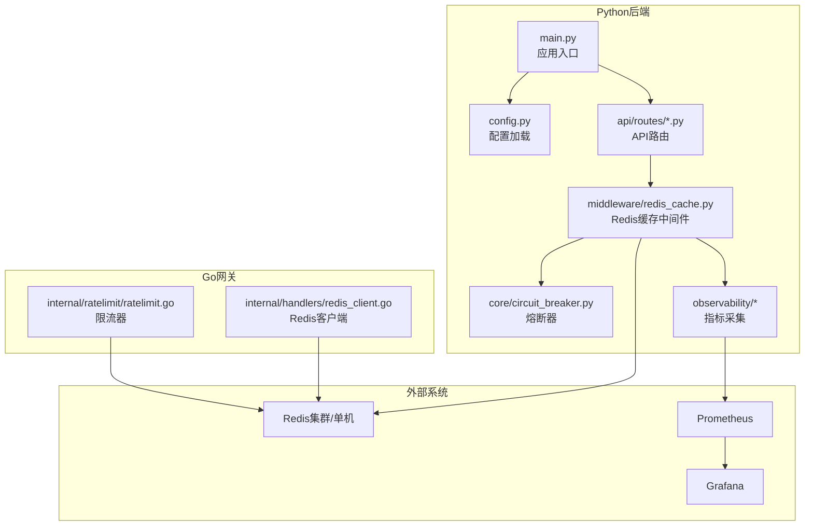
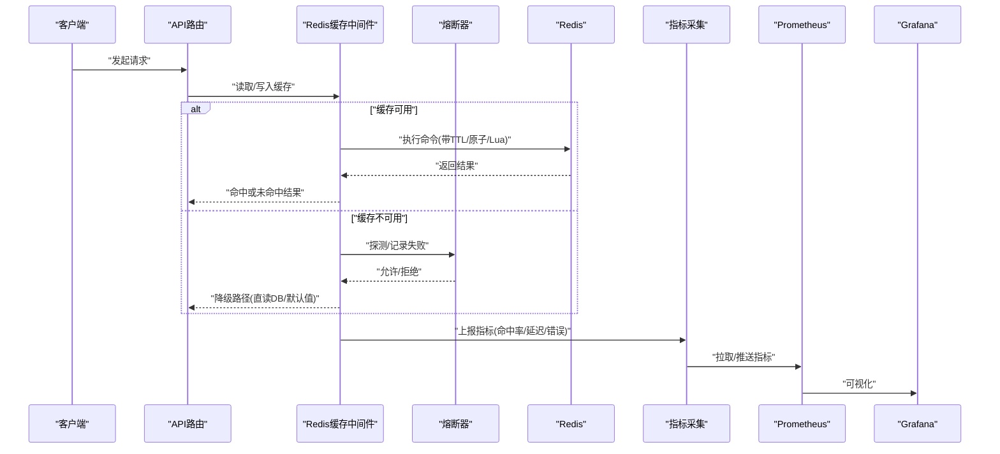
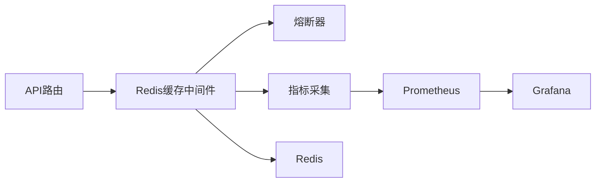
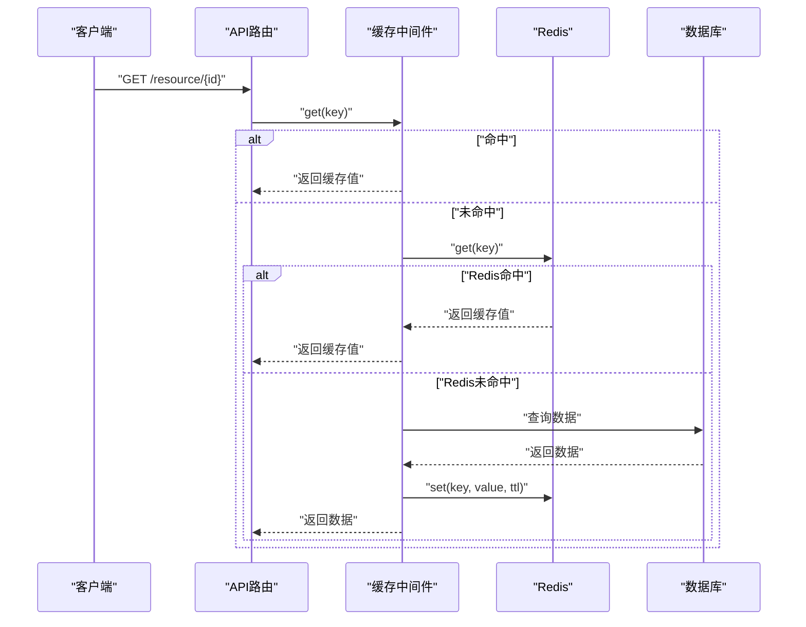
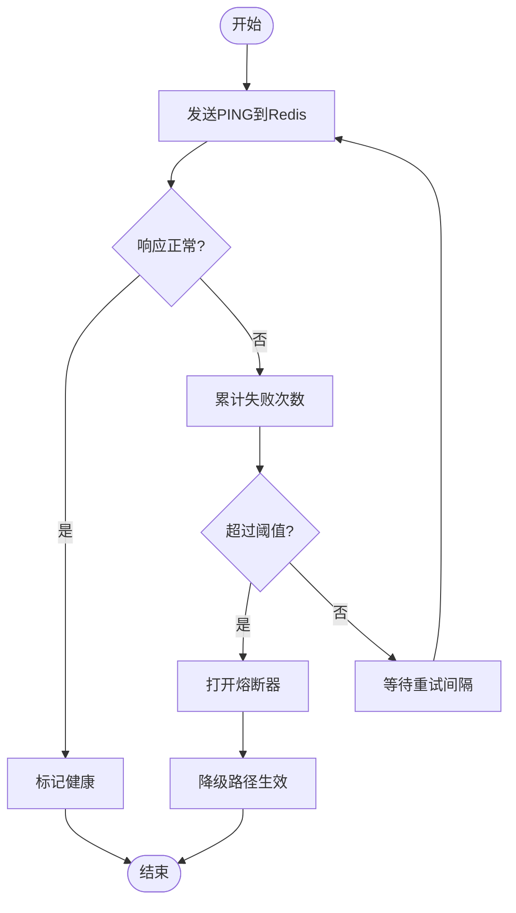

# 缓存存储后端扩展

<cite>
**本文引用的文件**   
- [backend_design/nexus/middleware/redis_cache.py](file://backend_design/nexus/middleware/redis_cache.py)
- [backend_design/nexus/core/circuit_breaker.py](file://backend_design/nexus/core/circuit_breaker.py)
- [backend_design/nexus/observability/cockpit_metrics.py](file://backend_design/nexus/observability/cockpit_metrics.py)
- [backend_design/nexus/observability/metrics.py](file://backend_design/nexus/observability/metrics.py)
- [backend_design/nexus/config.py](file://backend_design/nexus/config.py)
- [backend_design/nexus/main.py](file://backend_design/nexus/main.py)
- [backend_design/nexus/api/routes/settings.py](file://backend_design/nexus/api/routes/settings.py)
- [backend_design/nexus/api/routes/health.py](file://backend_design/nexus/api/routes/health.py)
- [backend_design/nexus_gate/internal/handlers/redis_client.go](file://backend_design/nexus_gate/internal/handlers/redis_client.go)
- [backend_design/nexus_gate/internal/ratelimit/ratelimit.go](file://backend_design/nexus_gate/internal/ratelimit/ratelimit.go)
- [config/prometheus/prometheus.yml](file://config/prometheus/prometheus.yml)
- [config/grafana/provisioning/dashboards/nexuscockpit-overview.json](file://config/grafana/provisioning/dashboards/nexuscockpit-overview.json)
</cite>

## 目录
1. [简介](#简介)
2. [项目结构](#项目结构)
3. [核心组件](#核心组件)
4. [架构总览](#架构总览)
5. [详细组件分析](#详细组件分析)
6. [依赖分析](#依赖分析)
7. [性能考虑](#性能考虑)
8. [故障排查指南](#故障排查指南)
9. [结论](#结论)
10. [附录](#附录)

## 简介
本文件面向NexusCockpit系统的“缓存存储后端扩展”，目标是：
- 定义统一的缓存存储接口（键值操作、过期时间、批量与原子操作等）
- 基于现有Redis中间件，给出可扩展的缓存策略与一致性方案
- 提供多级缓存（本地+Redis集群/Memcached）的实现思路与最佳实践
- 覆盖生产特性：连接池、序列化优化、压缩、分布式锁、监控指标、健康检查与故障转移

说明：本文档以仓库中已实现的Redis中间件与可观测性能力为基础，结合业界通用模式，给出完整的设计与落地建议。

## 项目结构
与缓存相关的代码主要分布在以下位置：
- Python后端
  - 中间件层：Redis缓存实现
  - 核心层：熔断器（用于降级保护）
  - 可观测性：指标采集与导出
  - 配置与入口：服务启动、配置加载、路由注册
- Go网关层
  - Redis客户端封装
  - 限流器（使用Redis作为计数源）
- 配置与监控
  - Prometheus抓取配置
  - Grafana仪表盘定义

图表来源
- [backend_design/nexus/main.py](file://backend_design/nexus/main.py)
- [backend_design/nexus/config.py](file://backend_design/nexus/config.py)
- [backend_design/nexus/middleware/redis_cache.py](file://backend_design/nexus/middleware/redis_cache.py)
- [backend_design/nexus/core/circuit_breaker.py](file://backend_design/nexus/core/circuit_breaker.py)
- [backend_design/nexus/observability/cockpit_metrics.py](file://backend_design/nexus/observability/cockpit_metrics.py)
- [backend_design/nexus/observability/metrics.py](file://backend_design/nexus/observability/metrics.py)
- [backend_design/nexus_gate/internal/handlers/redis_client.go](file://backend_design/nexus_gate/internal/handlers/redis_client.go)
- [backend_design/nexus_gate/internal/ratelimit/ratelimit.go](file://backend_design/nexus_gate/internal/ratelimit/ratelimit.go)
- [config/prometheus/prometheus.yml](file://config/prometheus/prometheus.yml)
- [config/grafana/provisioning/dashboards/nexuscockpit-overview.json](file://config/grafana/provisioning/dashboards/nexuscockpit-overview.json)

章节来源
- [backend_design/nexus/main.py](file://backend_design/nexus/main.py)
- [backend_design/nexus/config.py](file://backend_design/nexus/config.py)
- [backend_design/nexus/middleware/redis_cache.py](file://backend_design/nexus/middleware/redis_cache.py)
- [backend_design/nexus/core/circuit_breaker.py](file://backend_design/nexus/core/circuit_breaker.py)
- [backend_design/nexus/observability/cockpit_metrics.py](file://backend_design/nexus/observability/cockpit_metrics.py)
- [backend_design/nexus/observability/metrics.py](file://backend_design/nexus/observability/metrics.py)
- [backend_design/nexus_gate/internal/handlers/redis_client.go](file://backend_design/nexus_gate/internal/handlers/redis_client.go)
- [backend_design/nexus_gate/internal/ratelimit/ratelimit.go](file://backend_design/nexus_gate/internal/ratelimit/ratelimit.go)
- [config/prometheus/prometheus.yml](file://config/prometheus/prometheus.yml)
- [config/grafana/provisioning/dashboards/nexuscockpit-overview.json](file://config/grafana/provisioning/dashboards/nexuscockpit-overview.json)

## 核心组件
- 缓存中间件（Redis）
  - 职责：为业务模块提供统一的缓存访问能力，包括读写、过期控制、批量与原子操作、错误处理与降级。
  - 关键能力：
    - 键值操作：get/set/delete
    - 过期时间：支持秒级TTL
    - 批量操作：mget/mset/mexists等
    - 原子操作：incr/decr/incrby/decrby、Lua脚本保证复合操作的原子性
    - 事务与管道：提升吞吐、减少RTT
    - 错误处理与熔断：异常捕获、快速失败、回退到直读或默认值
- 熔断器
  - 职责：在缓存不可用时进行快速失败与降级，避免雪崩放大。
- 指标与可观测性
  - 职责：采集缓存命中率、延迟、错误率、连接状态等指标，并暴露给Prometheus/Grafana。

章节来源
- [backend_design/nexus/middleware/redis_cache.py](file://backend_design/nexus/middleware/redis_cache.py)
- [backend_design/nexus/core/circuit_breaker.py](file://backend_design/nexus/core/circuit_breaker.py)
- [backend_design/nexus/observability/cockpit_metrics.py](file://backend_design/nexus/observability/cockpit_metrics.py)
- [backend_design/nexus/observability/metrics.py](file://backend_design/nexus/observability/metrics.py)

## 架构总览
下图展示了请求从API进入，经缓存中间件访问Redis，并在异常时走熔断降级的整体流程；同时展示指标上报链路。

图表来源
- [backend_design/nexus/middleware/redis_cache.py](file://backend_design/nexus/middleware/redis_cache.py)
- [backend_design/nexus/core/circuit_breaker.py](file://backend_design/nexus/core/circuit_breaker.py)
- [backend_design/nexus/observability/cockpit_metrics.py](file://backend_design/nexus/observability/cockpit_metrics.py)
- [backend_design/nexus/observability/metrics.py](file://backend_design/nexus/observability/metrics.py)
- [config/prometheus/prometheus.yml](file://config/prometheus/prometheus.yml)
- [config/grafana/provisioning/dashboards/nexuscockpit-overview.json](file://config/grafana/provisioning/dashboards/nexuscockpit-overview.json)

## 详细组件分析

### 缓存存储接口设计（统一抽象）
目标：为不同后端（Redis、Memcached、本地缓存）提供一致的API，便于替换与组合。

- 基础键值操作
  - get(key): 返回value或None
  - set(key, value, ttl=None): 设置键值，可选过期时间
  - delete(key): 删除键
  - exists(key): 判断是否存在
- 过期时间
  - TTL语义：秒为单位；支持相对时间与绝对时间两种表达
  - 原子更新：通过incr/decr/incrby/decrby实现计数器
- 批量操作
  - mget(keys): 批量获取
  - mset(mapping): 批量设置
  - mdelete(keys): 批量删除
  - mexists(keys): 批量存在性检测
- 原子与复合操作
  - Lua脚本：确保多步操作的原子性与一致性
  - 事务：pipeline/transaction，降低网络往返
- 高级能力
  - 命名空间与Key前缀：隔离租户/环境
  - 序列化/反序列化：JSON/MessagePack/Protobuf等
  - 压缩：对大对象启用zstd/lz4
  - 重试与超时：可配置的重试次数、超时阈值
  - 容错：熔断、短路、回退

章节来源
- [backend_design/nexus/middleware/redis_cache.py](file://backend_design/nexus/middleware/redis_cache.py)

### Redis缓存策略实现
- 淘汰策略
  - LRU/LFU/TTL：由Redis服务端策略决定，可通过配置选择；对于热点数据，建议在应用层做预取与分层缓存
  - 过期策略：TTL到期后惰性删除+定期扫描
- 穿透防护
  - 布隆过滤器：在查询前先过滤不存在的key
  - 空值缓存：对不存在的数据缓存短TTL的空值，防止击穿热点
- 击穿防护
  - 互斥锁：对热点key加分布式锁，单点重建缓存
  - 逻辑过期：数据内部携带过期时间，后台异步刷新
- 雪崩防护
  - 随机化TTL：在基准TTL上叠加抖动
  - 预热：服务启动时主动加载热点数据
  - 熔断降级：当缓存不可用时快速失败，避免放大后端压力

章节来源
- [backend_design/nexus/middleware/redis_cache.py](file://backend_design/nexus/middleware/redis_cache.py)
- [backend_design/nexus/core/circuit_breaker.py](file://backend_design/nexus/core/circuit_breaker.py)

### 缓存一致性保证方案
- 读写穿透
  - 写穿：先写DB，再删缓存（或更新缓存），保证后续读命中最新数据
  - 读穿透：读不到则回源DB并回填缓存
- 双写一致性
  - 强一致场景：使用分布式锁串行化写路径，或采用数据库主从复制+binlog订阅变更
- 延迟双删
  - 先删缓存，再写DB，延时再删一次缓存，降低并发不一致窗口
- 最终一致性
  - 基于消息队列的异步同步，配合幂等与重试机制

章节来源
- [backend_design/nexus/middleware/redis_cache.py](file://backend_design/nexus/middleware/redis_cache.py)

### 自定义缓存后端示例（多级缓存）
- 多级架构
  - L1：进程内本地缓存（如内存字典/线程安全容器），极低延迟，容量有限
  - L2：分布式缓存（Redis集群/Memcached），高吞吐与共享
  - 策略：L1未命中则查L2，L2未命中则回源DB并回填两级
- 失效传播
  - 写路径：先更新DB，再按策略失效L1/L2（或延迟双删）
  - 读路径：若发现L1/L2陈旧，触发异步刷新
- 示例要点
  - 统一接口适配：为Redis/Memcached/本地缓存分别实现适配器
  - 热键优先：热点数据常驻L1，冷数据下沉至L2
  - 容量与淘汰：L1使用LRU，L2使用Redis策略

章节来源
- [backend_design/nexus/middleware/redis_cache.py](file://backend_design/nexus/middleware/redis_cache.py)

### 性能优化技术
- 连接池
  - 合理设置最大连接数、空闲回收、超时与重试
  - 分池策略：按租户/业务域拆分连接池，避免相互影响
- 序列化优化
  - 小对象用JSON，大对象用MessagePack/Protobuf
  - 开启压缩：对大于阈值的对象启用zstd/lz4
- 批处理与流水线
  - 使用pipeline批量提交命令，减少RTT
  - 合并多次小写为一次批量写
- 分布式锁
  - 使用Redis SETNX/Redlock实现细粒度锁，避免热点竞争
- 监控与调优
  - 关注命中率、P99延迟、错误率、连接池利用率
  - 根据指标动态调整TTL、批量大小、连接池参数

章节来源
- [backend_design/nexus/middleware/redis_cache.py](file://backend_design/nexus/middleware/redis_cache.py)
- [backend_design/nexus/observability/cockpit_metrics.py](file://backend_design/nexus/observability/cockpit_metrics.py)
- [backend_design/nexus/observability/metrics.py](file://backend_design/nexus/observability/metrics.py)

### 监控指标与健康检查
- 指标项
  - 命中率、未命中率、延迟分布（P50/P95/P99）、错误率、超时次数
  - 连接池活跃/空闲、重连次数、Lua脚本执行耗时
- 健康检查
  - 连通性探测：ping/cluster info
  - 可用性判定：连续失败阈值触发熔断
- 告警与可视化
  - Prometheus抓取，Grafana看板展示
  - 关键阈值告警：命中率骤降、延迟飙升、错误率上升

章节来源
- [backend_design/nexus/observability/cockpit_metrics.py](file://backend_design/nexus/observability/cockpit_metrics.py)
- [backend_design/nexus/observability/metrics.py](file://backend_design/nexus/observability/metrics.py)
- [config/prometheus/prometheus.yml](file://config/prometheus/prometheus.yml)
- [config/grafana/provisioning/dashboards/nexuscockpit-overview.json](file://config/grafana/provisioning/dashboards/nexuscockpit-overview.json)

### 网关侧Redis使用（Go）
- Redis客户端封装
  - 负责连接管理、重试、超时、错误分类
- 限流器
  - 基于Redis计数器实现滑动窗口/固定窗口限流
  - 与缓存联动：限流状态可落盘到Redis，供多实例共享

章节来源
- [backend_design/nexus_gate/internal/handlers/redis_client.go](file://backend_design/nexus_gate/internal/handlers/redis_client.go)
- [backend_design/nexus_gate/internal/ratelimit/ratelimit.go](file://backend_design/nexus_gate/internal/ratelimit/ratelimit.go)

## 依赖分析
- 模块耦合
  - API路由依赖缓存中间件
  - 缓存中间件依赖Redis客户端、熔断器、指标采集
  - 指标采集依赖Prometheus/Grafana配置
- 外部依赖
  - Redis集群/单机
  - Prometheus与Grafana

图表来源
- [backend_design/nexus/middleware/redis_cache.py](file://backend_design/nexus/middleware/redis_cache.py)
- [backend_design/nexus/core/circuit_breaker.py](file://backend_design/nexus/core/circuit_breaker.py)
- [backend_design/nexus/observability/cockpit_metrics.py](file://backend_design/nexus/observability/cockpit_metrics.py)
- [backend_design/nexus/observability/metrics.py](file://backend_design/nexus/observability/metrics.py)
- [config/prometheus/prometheus.yml](file://config/prometheus/prometheus.yml)
- [config/grafana/provisioning/dashboards/nexuscockpit-overview.json](file://config/grafana/provisioning/dashboards/nexuscockpit-overview.json)

章节来源
- [backend_design/nexus/middleware/redis_cache.py](file://backend_design/nexus/middleware/redis_cache.py)
- [backend_design/nexus/core/circuit_breaker.py](file://backend_design/nexus/core/circuit_breaker.py)
- [backend_design/nexus/observability/cockpit_metrics.py](file://backend_design/nexus/observability/cockpit_metrics.py)
- [backend_design/nexus/observability/metrics.py](file://backend_design/nexus/observability/metrics.py)
- [config/prometheus/prometheus.yml](file://config/prometheus/prometheus.yml)
- [config/grafana/provisioning/dashboards/nexuscockpit-overview.json](file://config/grafana/provisioning/dashboards/nexuscockpit-overview.json)

## 性能考虑
- 连接池与超时
  - 根据QPS与CPU核数估算连接数，避免过多上下文切换
  - 设置合理的读写超时与重试上限
- 序列化与压缩
  - 小对象禁用压缩，大对象启用压缩，权衡CPU与带宽
- 批处理与流水线
  - 将多次小操作合并，减少网络往返
- 热点与预取
  - 热点数据提前预热，降低突发流量冲击
- 锁粒度与竞争
  - 缩小锁范围，避免长事务占用锁
- 监控驱动调优
  - 基于命中率与延迟曲线持续优化参数

[本节为通用指导，无需特定文件引用]

## 故障排查指南
- 常见问题
  - 命中率低：检查Key设计、TTL策略、是否频繁失效
  - 延迟升高：检查连接池、序列化/压缩开销、网络抖动
  - 错误率上升：检查Redis可用性、重试与熔断配置
- 定位步骤
  - 查看指标：命中率、延迟、错误率、连接池状态
  - 检查熔断器：是否频繁打开/关闭
  - 观察日志：异常堆栈、慢查询、Lua脚本错误
- 恢复策略
  - 临时扩容Redis节点或提高连接池上限
  - 降低TTL或关闭非关键缓存
  - 启用降级：直读DB或返回默认值

章节来源
- [backend_design/nexus/core/circuit_breaker.py](file://backend_design/nexus/core/circuit_breaker.py)
- [backend_design/nexus/observability/cockpit_metrics.py](file://backend_design/nexus/observability/cockpit_metrics.py)
- [backend_design/nexus/observability/metrics.py](file://backend_design/nexus/observability/metrics.py)

## 结论
通过统一的缓存接口设计与Redis中间件，NexusCockpit实现了高性能、可扩展的缓存能力。结合熔断、指标与健康检查，可在生产环境中稳定运行。建议在生产部署中完善多级缓存、一致性策略与监控告警，持续提升系统韧性与性能。

[本节为总结，无需特定文件引用]

## 附录

### 典型API调用序列（读路径）

图表来源
- [backend_design/nexus/middleware/redis_cache.py](file://backend_design/nexus/middleware/redis_cache.py)

### 健康检查流程

图表来源
- [backend_design/nexus/core/circuit_breaker.py](file://backend_design/nexus/core/circuit_breaker.py)
- [backend_design/nexus/middleware/redis_cache.py](file://backend_design/nexus/middleware/redis_cache.py)