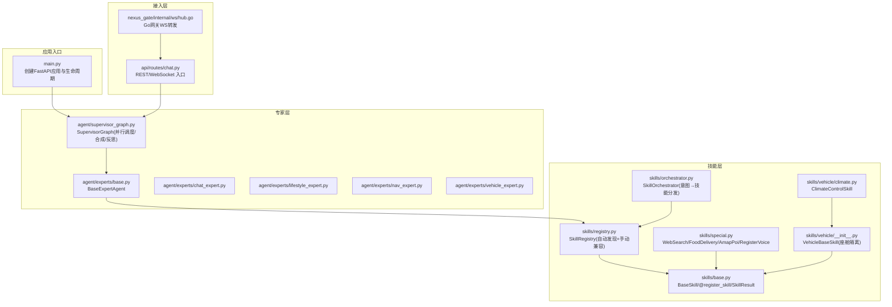
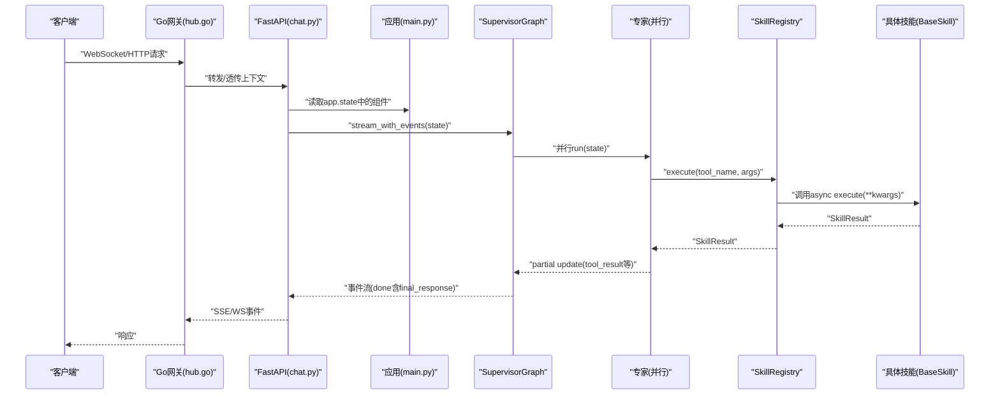
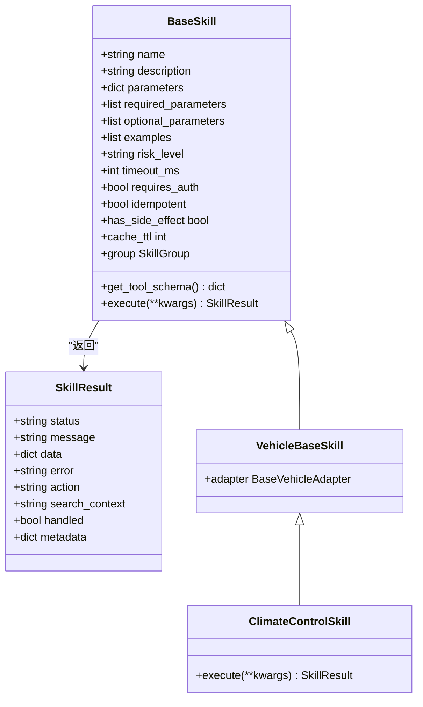
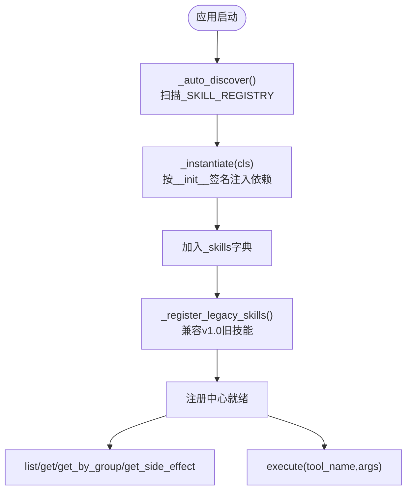
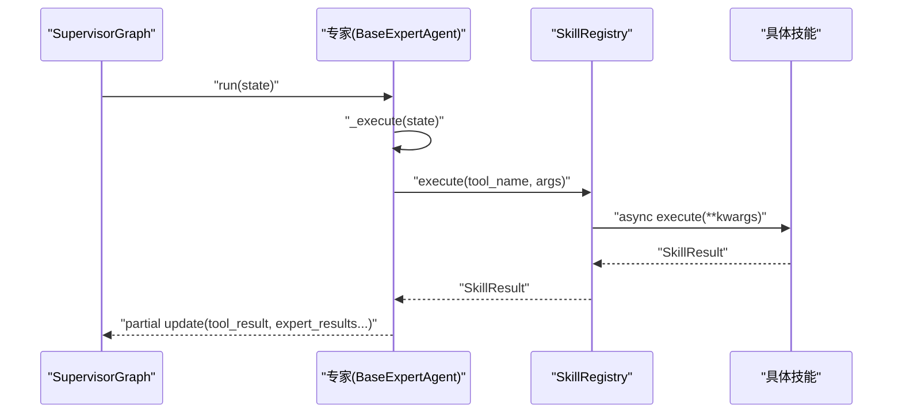
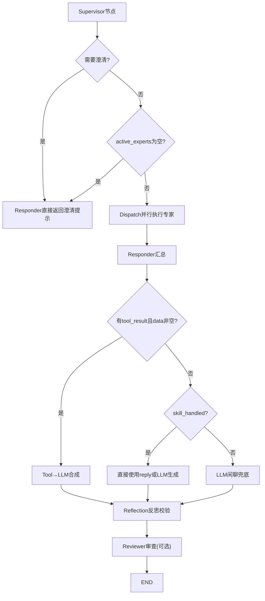
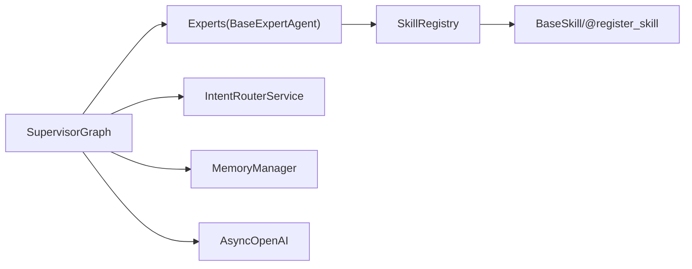

# 扩展开发

<cite>
**本文引用的文件**   
- [backend_design/nexus/skills/base.py](file://backend_design/nexus/skills/base.py)
- [backend_design/nexus/skills/registry.py](file://backend_design/nexus/skills/registry.py)
- [backend_design/nexus/skills/orchestrator.py](file://backend_design/nexus/skills/orchestrator.py)
- [backend_design/nexus/skills/special.py](file://backend_design/nexus/skills/special.py)
- [backend_design/nexus/skills/vehicle/__init__.py](file://backend_design/nexus/skills/vehicle/__init__.py)
- [backend_design/nexus/skills/vehicle/climate.py](file://backend_design/nexus/skills/vehicle/climate.py)
- [backend_design/nexus/agent/experts/base.py](file://backend_design/nexus/agent/experts/base.py)
- [backend_design/nexus/agent/experts/chat_expert.py](file://backend_design/nexus/agent/experts/chat_expert.py)
- [backend_design/nexus/agent/experts/lifestyle_expert.py](file://backend_design/nexus/agent/experts/lifestyle_expert.py)
- [backend_design/nexus/agent/experts/nav_expert.py](file://backend_design/nexus/agent/experts/nav_expert.py)
- [backend_design/nexus/agent/experts/vehicle_expert.py](file://backend_design/nexus/agent/experts/vehicle_expert.py)
- [backend_design/nexus/agent/supervisor_graph.py](file://backend_design/nexus/agent/supervisor_graph.py)
- [backend_design/nexus/main.py](file://backend_design/nexus/main.py)
- [backend_design/nexus/api/routes/chat.py](file://backend_design/nexus/api/routes/chat.py)
- [backend_design/nexus_gate/internal/ws/hub.go](file://backend_design/nexus_gate/internal/ws/hub.go)
</cite>

## 目录
1. [简介](#简介)
2. [项目结构](#项目结构)
3. [核心组件](#核心组件)
4. [架构总览](#架构总览)
5. [详细组件分析](#详细组件分析)
6. [依赖关系分析](#依赖关系分析)
7. [性能与缓存特性](#性能与缓存特性)
8. [第三方系统集成指南](#第三方系统集成指南)
9. [测试与调试](#测试与调试)
10. [部署与配置](#部署与配置)
11. [最佳实践与建议](#最佳实践与建议)
12. [故障排查](#故障排查)
13. [结论](#结论)

## 简介
本指南面向希望在 NexusCockpit 中扩展能力的开发者，系统阐述插件化架构与扩展机制：技能注册中心、装饰器自动发现、动态加载；自定义专家 Agent 的开发流程；新技能的规范与实现要点；以及第三方系统集成（HTTP API、消息队列、数据库）的方法。文档同时提供端到端示例路径、测试方法与部署配置建议，帮助快速构建稳定可扩展的扩展生态。

## 项目结构
NexusCockpit 后端采用 FastAPI + LangGraph 多智能体工作流，核心扩展点集中在 skills 与 agent/experts 两个层次：
- 技能层（skills）：以 BaseSkill 为基类，通过 @register_skill 装饰器自动注册到全局表，由 SkillRegistry 统一管理与执行。
- 专家层（agent/experts）：继承 BaseExpertAgent，封装一组相关技能，由 SupervisorGraph 并行调度。
- 编排层（supervisor_graph）：基于 LangGraph StateGraph 构建 Supervisor → Experts → Responder → Reviewer 的工作流。
- 应用入口（main.py）：在启动时初始化各子系统并注入到 app.state，供路由与中间件使用。

图表来源
- [backend_design/nexus/main.py](file://backend_design/nexus/main.py)
- [backend_design/nexus/agent/supervisor_graph.py](file://backend_design/nexus/agent/supervisor_graph.py)
- [backend_design/nexus/skills/base.py](file://backend_design/nexus/skills/base.py)
- [backend_design/nexus/skills/registry.py](file://backend_design/nexus/skills/registry.py)
- [backend_design/nexus/skills/orchestrator.py](file://backend_design/nexus/skills/orchestrator.py)
- [backend_design/nexus/skills/special.py](file://backend_design/nexus/skills/special.py)
- [backend_design/nexus/skills/vehicle/__init__.py](file://backend_design/nexus/skills/vehicle/__init__.py)
- [backend_design/nexus/skills/vehicle/climate.py](file://backend_design/nexus/skills/vehicle/climate.py)
- [backend_design/nexus/agent/experts/base.py](file://backend_design/nexus/agent/experts/base.py)
- [backend_design/nexus/agent/experts/chat_expert.py](file://backend_design/nexus/agent/experts/chat_expert.py)
- [backend_design/nexus/agent/experts/lifestyle_expert.py](file://backend_design/nexus/agent/experts/lifestyle_expert.py)
- [backend_design/nexus/agent/experts/nav_expert.py](file://backend_design/nexus/agent/experts/nav_expert.py)
- [backend_design/nexus/agent/experts/vehicle_expert.py](file://backend_design/nexus/agent/experts/vehicle_expert.py)
- [backend_design/nexus/api/routes/chat.py](file://backend_design/nexus/api/routes/chat.py)
- [backend_design/nexus_gate/internal/ws/hub.go](file://backend_design/nexus_gate/internal/ws/hub.go)

章节来源
- [backend_design/nexus/main.py](file://backend_design/nexus/main.py)
- [backend_design/nexus/agent/supervisor_graph.py](file://backend_design/nexus/agent/supervisor_graph.py)

## 核心组件
- 技能基类与结果模型
  - BaseSkill：定义 name/description/parameters/required_parameters/optional_parameters/examples/risk_level/timeout_ms/requires_auth/idempotent 等元数据，并提供 get_tool_schema() 生成 OpenAI Function Calling 格式的工具描述。
  - SkillResult：统一返回结构，包含 status/message/data/error/action/search_context/handled/metadata。
  - register_skill 装饰器：将类标记为可发现，写入全局 _SKILL_REGISTRY，支持 has_side_effect/cache_ttl 控制缓存策略。
- 技能注册中心
  - SkillRegistry：启动时扫描 _SKILL_REGISTRY 完成自动注册，支持按 SkillGroup 分组查询、副作用技能列表获取、execute(tool_name, arguments) 执行。
  - 兼容 v1.0 手动注册与旧模块导入注册。
- 专家 Agent 基类
  - BaseExpertAgent：封装 run(state) 节点函数，内部调用 _execute(state)，并通过 _build_expert_result 构造 partial update，支持 tool_result 提升以便 Responder 合成。
- 编排与工作流
  - SupervisorGraph：构建 Supervisor → Experts → Responder → Reflection → Reviewer 的图，支持并行执行活跃专家、Tool→LLM 合成、反思校验。
- 应用生命周期
  - main.py：在 lifespan 中初始化 Embedding、向量/图谱存储、车控适配器、语义缓存、限流、会话存储、Langfuse、Checkpoint、记忆管理、意图路由、SkillRegistry、SupervisorGraph 等，并挂载路由与静态资源。

章节来源
- [backend_design/nexus/skills/base.py](file://backend_design/nexus/skills/base.py)
- [backend_design/nexus/skills/registry.py](file://backend_design/nexus/skills/registry.py)
- [backend_design/nexus/agent/experts/base.py](file://backend_design/nexus/agent/experts/base.py)
- [backend_design/nexus/agent/supervisor_graph.py](file://backend_design/nexus/agent/supervisor_graph.py)
- [backend_design/nexus/main.py](file://backend_design/nexus/main.py)

## 架构总览
NexusCockpit 的扩展架构围绕“技能即工具”的理念展开：
- 技能通过装饰器声明式注册，注册中心负责实例化与参数注入。
- 专家 Agent 聚合一组相关技能，Supervisor 根据意图路由决定激活哪些专家。
- 所有活跃专家并行执行，结果汇聚至 Responder，必要时进行 Tool→LLM 合成与反思校验。
- 外部请求经 REST 或 WebSocket 进入，最终落到 SupervisorGraph 的执行流。

图表来源
- [backend_design/nexus_gate/internal/ws/hub.go](file://backend_design/nexus_gate/internal/ws/hub.go)
- [backend_design/nexus/api/routes/chat.py](file://backend_design/nexus/api/routes/chat.py)
- [backend_design/nexus/main.py](file://backend_design/nexus/main.py)
- [backend_design/nexus/agent/supervisor_graph.py](file://backend_design/nexus/agent/supervisor_graph.py)
- [backend_design/nexus/skills/registry.py](file://backend_design/nexus/skills/registry.py)
- [backend_design/nexus/skills/base.py](file://backend_design/nexus/skills/base.py)

## 详细组件分析

### 技能基类与装饰器自动注册
- 设计要点
  - 通过 @register_skill(name, group, description, has_side_effect, cache_ttl) 对技能类进行标记，自动写入 _SKILL_REGISTRY。
  - BaseSkill.get_tool_schema() 输出 OpenAI Function Calling 格式的 schema，便于 LLM 识别与调用。
  - SkillResult 作为统一返回，确保上层编排一致处理。
- 关键属性与行为
  - has_side_effect：用于标识是否修改外部状态（如车控），配合缓存层禁用缓存。
  - cache_ttl：控制缓存过期时间。
  - group：归属专家分组，便于按组筛选。
- 典型用法路径
  - 参考车载空调技能：[climate.py](file://backend_design/nexus/skills/vehicle/climate.py)
  - 参考通用技能：[special.py](file://backend_design/nexus/skills/special.py)

图表来源
- [backend_design/nexus/skills/base.py](file://backend_design/nexus/skills/base.py)
- [backend_design/nexus/skills/vehicle/__init__.py](file://backend_design/nexus/skills/vehicle/__init__.py)
- [backend_design/nexus/skills/vehicle/climate.py](file://backend_design/nexus/skills/vehicle/climate.py)

章节来源
- [backend_design/nexus/skills/base.py](file://backend_design/nexus/skills/base.py)
- [backend_design/nexus/skills/vehicle/__init__.py](file://backend_design/nexus/skills/vehicle/__init__.py)
- [backend_design/nexus/skills/vehicle/climate.py](file://backend_design/nexus/skills/vehicle/climate.py)

### 技能注册中心与动态加载
- 自动发现
  - 启动时遍历 _SKILL_REGISTRY，按类签名智能注入 graph_store / vehicle_adapter 等依赖，避免硬编码。
- 兼容模式
  - 保留 v1.0 的手动注册与旧模块导入注册，确保平滑升级。
- 查询与执行
  - list_skills()/get_all_tools() 暴露工具目录给意图路由。
  - get_skills_by_group() 供专家按组筛选。
  - get_side_effect_skills() 供缓存层禁用副作用技能缓存。
  - execute(tool_name, arguments) 统一执行并捕获异常，返回 SkillResult。

图表来源
- [backend_design/nexus/skills/registry.py](file://backend_design/nexus/skills/registry.py)
- [backend_design/nexus/skills/base.py](file://backend_design/nexus/skills/base.py)

章节来源
- [backend_design/nexus/skills/registry.py](file://backend_design/nexus/skills/registry.py)

### 专家 Agent 开发与集成
- 基类能力
  - BaseExpertAgent.run(state) 负责活跃判断、计时、异常处理与 partial update 构建。
  - _build_expert_result 统一封装 expert_results、skill_action、skill_handled、search_context、tool_result 等字段。
- 典型专家
  - ChatExpert：声纹注册与闲聊兜底。
  - LifestyleExpert：POI搜索、联网搜索、点餐。
  - NavExpert：导航动作，位置查询时注入缓存 GPS。
  - VehicleExpert：车控动作映射到对应技能。
- 集成方式
  - 在 SupervisorGraph 中注册专家节点，并在 _determine_experts 中依据意图字段选择活跃专家。

图表来源
- [backend_design/nexus/agent/experts/base.py](file://backend_design/nexus/agent/experts/base.py)
- [backend_design/nexus/agent/experts/chat_expert.py](file://backend_design/nexus/agent/experts/chat_expert.py)
- [backend_design/nexus/agent/experts/lifestyle_expert.py](file://backend_design/nexus/agent/experts/lifestyle_expert.py)
- [backend_design/nexus/agent/experts/nav_expert.py](file://backend_design/nexus/agent/experts/nav_expert.py)
- [backend_design/nexus/agent/experts/vehicle_expert.py](file://backend_design/nexus/agent/experts/vehicle_expert.py)
- [backend_design/nexus/agent/supervisor_graph.py](file://backend_design/nexus/agent/supervisor_graph.py)
- [backend_design/nexus/skills/registry.py](file://backend_design/nexus/skills/registry.py)

章节来源
- [backend_design/nexus/agent/experts/base.py](file://backend_design/nexus/agent/experts/base.py)
- [backend_design/nexus/agent/experts/chat_expert.py](file://backend_design/nexus/agent/experts/chat_expert.py)
- [backend_design/nexus/agent/experts/lifestyle_expert.py](file://backend_design/nexus/agent/experts/lifestyle_expert.py)
- [backend_design/nexus/agent/experts/nav_expert.py](file://backend_design/nexus/agent/experts/nav_expert.py)
- [backend_design/nexus/agent/experts/vehicle_expert.py](file://backend_design/nexus/agent/experts/vehicle_expert.py)
- [backend_design/nexus/agent/supervisor_graph.py](file://backend_design/nexus/agent/supervisor_graph.py)

### 工作流编排与响应合成
- SupervisorGraph 职责
  - 记忆召回、用户画像加载、意图路由、专家分派决策。
  - 并行执行活跃专家，合并 partial updates。
  - Responder 分支：澄清提示、工具结果合成、简单指令直返。
  - Reflection 反思：事实性/一致性/无幻觉检查，必要时修正回复。
- Tool→LLM 合成
  - 当工具返回结构化数据时，将结果回传 LLM 生成自然语言回复，严格约束不编造信息。
- 反思校验
  - 针对工具数据与搜索结果分别定制反思提示词，输出 JSON 判定与可选修正建议。

图表来源
- [backend_design/nexus/agent/supervisor_graph.py](file://backend_design/nexus/agent/supervisor_graph.py)

章节来源
- [backend_design/nexus/agent/supervisor_graph.py](file://backend_design/nexus/agent/supervisor_graph.py)

### 第三方系统集成方法
- HTTP API 对接
  - 在技能 execute 中使用 httpx 发起异步请求，注意超时与错误码处理，返回 SkillResult。
  - 示例：高德 POI 周边搜索（AmapPoiSearchSkill）。
- 消息队列集成
  - 可在专家或技能层引入异步队列（如 Redis/RabbitMQ），将耗时任务入队，通过回调或轮询更新 state。
  - 结合 WebSocket 通道（Go 网关 hub.go）向客户端推送进度与结果。
- 数据库连接
  - 通过注册中心注入 graph_store / vector_store 等依赖，或在技能 __init__ 中按需获取。
  - 注意连接池与生命周期管理，遵循 main.py 的生命周期初始化模式。

章节来源
- [backend_design/nexus/skills/special.py](file://backend_design/nexus/skills/special.py)
- [backend_design/nexus_gate/internal/ws/hub.go](file://backend_design/nexus_gate/internal/ws/hub.go)
- [backend_design/nexus/main.py](file://backend_design/nexus/main.py)

## 依赖关系分析
- 组件耦合
  - 专家强依赖 SkillRegistry，通过 registry.execute 调用具体技能。
  - 注册中心依赖 BaseSkill 与装饰器全局表，解耦具体技能实现。
  - SupervisorGraph 依赖 IntentRouterService、MemoryManager、SkillRegistry 与 LLM 客户端。
- 外部依赖
  - LLM 客户端（OpenAI 兼容）、向量/图谱存储、Redis 缓存、MySQL 日志、Prometheus/Langfuse 监控。
- 潜在循环依赖
  - 通过延迟导入（在方法内 import）避免模块级循环引用。

图表来源
- [backend_design/nexus/agent/supervisor_graph.py](file://backend_design/nexus/agent/supervisor_graph.py)
- [backend_design/nexus/agent/experts/base.py](file://backend_design/nexus/agent/experts/base.py)
- [backend_design/nexus/skills/registry.py](file://backend_design/nexus/skills/registry.py)
- [backend_design/nexus/skills/base.py](file://backend_design/nexus/skills/base.py)

章节来源
- [backend_design/nexus/agent/supervisor_graph.py](file://backend_design/nexus/agent/supervisor_graph.py)
- [backend_design/nexus/agent/experts/base.py](file://backend_design/nexus/agent/experts/base.py)
- [backend_design/nexus/skills/registry.py](file://backend_design/nexus/skills/registry.py)
- [backend_design/nexus/skills/base.py](file://backend_design/nexus/skills/base.py)

## 性能与缓存特性
- 副作用与缓存
  - has_side_effect=True 的技能（如车控）禁止缓存，避免重复执行导致副作用累积。
  - cache_ttl 控制缓存 TTL，0 表示不缓存。
- 并行执行
  - 活跃专家通过 asyncio.gather 并行执行，显著降低端到端延迟。
- 语义缓存
  - 在 API 层启用 SemanticCache，命中则直接返回，减少 LLM 调用。
- 指标与追踪
  - Prometheus 指标采集与 Langfuse 链路追踪贯穿请求生命周期，便于定位瓶颈。

章节来源
- [backend_design/nexus/skills/base.py](file://backend_design/nexus/skills/base.py)
- [backend_design/nexus/agent/supervisor_graph.py](file://backend_design/nexus/agent/supervisor_graph.py)
- [backend_design/nexus/api/routes/chat.py](file://backend_design/nexus/api/routes/chat.py)
- [backend_design/nexus/main.py](file://backend_design/nexus/main.py)

## 第三方系统集成指南
- HTTP API 对接
  - 在技能中通过 httpx 发起请求，设置合理超时与重试策略，解析响应并构造 SkillResult。
  - 示例路径：[AmapPoiSearchSkill.execute](file://backend_design/nexus/skills/special.py)
- 消息队列集成
  - 在专家或技能中异步入队任务，结合 WebSocket 推送进度；失败时记录错误并降级。
  - 参考 Go 网关 WS 转发逻辑：[hub.go](file://backend_design/nexus_gate/internal/ws/hub.go)
- 数据库连接
  - 通过注册中心注入 graph_store/vector_store，或在技能构造时按需获取。
  - 遵循 main.py 生命周期，确保连接池正确关闭。

章节来源
- [backend_design/nexus/skills/special.py](file://backend_design/nexus/skills/special.py)
- [backend_design/nexus_gate/internal/ws/hub.go](file://backend_design/nexus_gate/internal/ws/hub.go)
- [backend_design/nexus/main.py](file://backend_design/nexus/main.py)

## 测试与调试
- 单元测试
  - 针对技能 execute 编写用例，覆盖正常路径与异常分支，验证 SkillResult 结构与字段。
  - 使用 pytest 异步测试框架，模拟外部依赖（httpx、LLM、存储）。
- 集成测试
  - 通过 chat API 触发完整流程，断言 final_response 与 metadata 字段。
  - 使用 stream_with_events 验证事件流顺序与 done 事件内容。
- 调试技巧
  - 开启 Langfuse 追踪，查看节点耗时与输入输出。
  - 利用反射开关 REFLECTION_ENABLED=false 快速定位问题。
  - 打印 SkillRegistry.list_skills() 确认自动发现是否生效。

章节来源
- [backend_design/nexus/api/routes/chat.py](file://backend_design/nexus/api/routes/chat.py)
- [backend_design/nexus/agent/supervisor_graph.py](file://backend_design/nexus/agent/supervisor_graph.py)
- [backend_design/nexus/skills/registry.py](file://backend_design/nexus/skills/registry.py)

## 部署与配置
- 启动方式
  - 直接运行：python -m nexus.main
  - 或通过 Makefile 命令启动开发环境。
- 环境变量
  - ARK_API_KEY、ARK_BASE_URL、LLM_MODEL 等 LLM 配置。
  - AMAP_KEY 高德地图 Key（用于 POI 搜索）。
  - TAVILY_API_KEY 联网搜索密钥（可选）。
- 组件初始化
  - main.py lifespan 中依次初始化 Embedding、向量/图谱存储、车控适配器、语义缓存、限流、会话存储、Langfuse、Checkpoint、记忆管理、意图路由、SkillRegistry、SupervisorGraph 等。
- 静态资源
  - 挂载 /audio 静态目录，供媒体播放功能使用。

章节来源
- [backend_design/nexus/main.py](file://backend_design/nexus/main.py)

## 最佳实践与建议
- 技能设计
  - 明确 has_side_effect 与 cache_ttl，避免副作用被缓存。
  - 完善 parameters/required_parameters/examples，提升 LLM 调用准确率。
  - 统一错误处理，返回明确的 status/message/error，便于上层降级。
- 专家设计
  - 每个专家聚焦一类领域，保持低耦合高内聚。
  - 合理使用 _build_expert_result 提升 tool_result，利于 Responder 合成。
- 编排优化
  - 在 Supervisor 阶段并行执行记忆召回、画像加载、意图路由，缩短首字延迟。
  - 反思开关可按环境灵活配置，生产环境建议开启以提升质量。
- 扩展生态
  - 优先使用装饰器自动注册，减少硬编码。
  - 通过 SkillGroup 分类管理，便于按专家维度扩展与维护。

[本节为概念性指导，无需列出具体文件来源]

## 故障排查
- 常见问题
  - 技能未注册：检查 @register_skill 是否正确标注，确认 SkillRegistry 已扫描 _SKILL_REGISTRY。
  - 副作用被缓存：确认 has_side_effect=True 的技能未被缓存。
  - 位置查询失败：NavExpert 会从 adapter 缓存注入 GPS，若仍失败，检查前端授权与缓存更新。
  - 反思失败：查看 reflection_result 与 reflection_reason，必要时关闭反思开关定位问题。
- 日志与指标
  - 关注 Expert 与 Skill 执行日志，结合 Prometheus 指标与 Langfuse 追踪定位瓶颈。

章节来源
- [backend_design/nexus/agent/experts/nav_expert.py](file://backend_design/nexus/agent/experts/nav_expert.py)
- [backend_design/nexus/agent/supervisor_graph.py](file://backend_design/nexus/agent/supervisor_graph.py)
- [backend_design/nexus/skills/registry.py](file://backend_design/nexus/skills/registry.py)

## 结论
NexusCockpit 的扩展体系以“技能即工具”为核心，通过装饰器自动发现与注册中心统一管理，结合专家 Agent 的并行调度与 Responder 的合成反思，形成高扩展、高性能、可观测的多智能体平台。遵循本文规范与最佳实践，开发者可快速构建稳定的自定义技能与专家，并安全地集成第三方服务，持续丰富扩展生态。