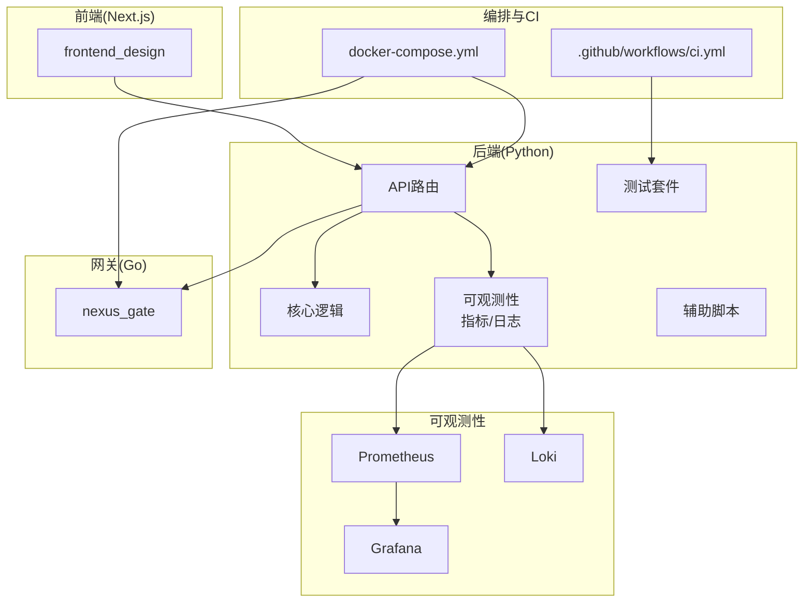
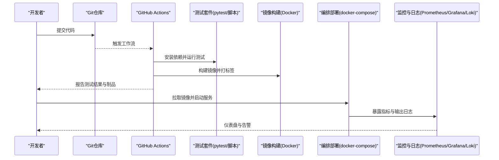
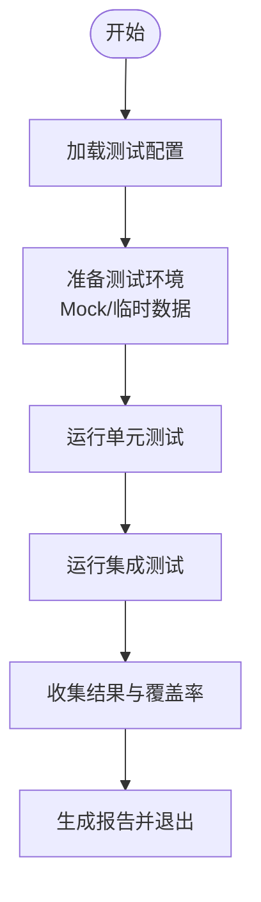
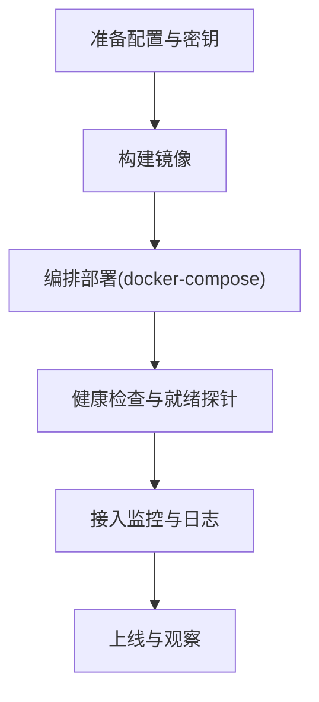
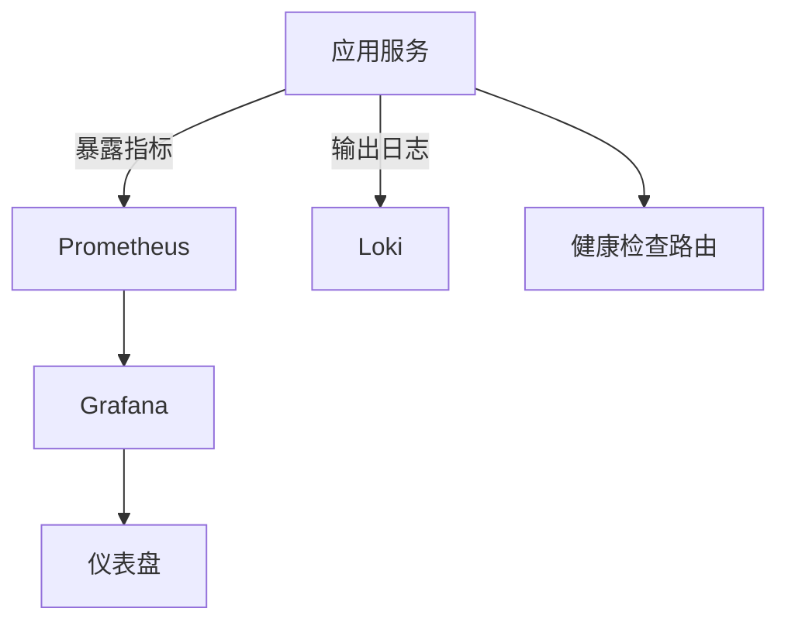
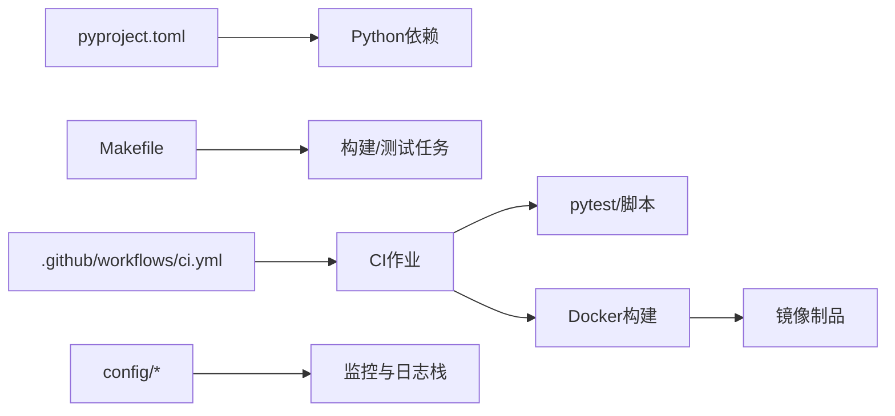

# 扩展测试与部署

<cite>
**本文引用的文件**   
- [backend_design/tests/test_api.py](file://backend_design/tests/test_api.py)
- [backend_design/tests/test_core.py](file://backend_design/tests/test_core.py)
- [backend_design/tests/test_v21.py](file://backend_design/tests/test_v21.py)
- [backend_design/scripts/test_api.py](file://backend_design/scripts/test_api.py)
- [backend_design/scripts/test_db.py](file://backend_design/scripts/test_db.py)
- [backend_design/scripts/test_metrics.py](file://backend_design/scripts/test_metrics.py)
- [backend_design/scripts/chaos_test.py](file://backend_design/scripts/chaos_test.py)
- [backend_design/pyproject.toml](file://backend_design/pyproject.toml)
- [backend_design/Dockerfile](file://backend_design/Dockerfile)
- [docker-compose.yml](file://docker-compose.yml)
- [config/prometheus/prometheus.yml](file://config/prometheus/prometheus.yml)
- [config/grafana/provisioning/datasources/prometheus.yml](file://config/grafana/provisioning/datasources/prometheus.yml)
- [config/grafana/provisioning/dashboards/dashboards.yml](file://config/grafana/provisioning/dashboards/dashboards.yml)
- [config/grafana/provisioning/dashboards/nexuscockpit-overview.json](file://config/grafana/provisioning/dashboards/nexuscockpit-overview.json)
- [config/loki/loki-config.yml](file://config/loki/loki-config.yml)
- [backend_design/backend_design/nexus/observability/metrics.py](file://backend_design/nexus/observability/metrics.py)
- [backend_design/backend_design/nexus/observability/cockpit_metrics.py](file://backend_design/nexus/observability/cockpit_metrics.py)
- [backend_design/backend_design/nexus/core/logger.py](file://backend_design/nexus/core/logger.py)
- [backend_design/backend_design/nexus/api/routes/health.py](file://backend_design/nexus/api/routes/health.py)
- [backend_design/backend_design/nexus/config.py](file://backend_design/nexus/config.py)
- [Makefile](file://Makefile)
- [.github/workflows/ci.yml](file://.github/workflows/ci.yml)
</cite>

## 目录
1. [简介](#简介)
2. [项目结构](#项目结构)
3. [核心组件](#核心组件)
4. [架构总览](#架构总览)
5. [详细组件分析](#详细组件分析)
6. [依赖分析](#依赖分析)
7. [性能考虑](#性能考虑)
8. [故障排查指南](#故障排查指南)
9. [结论](#结论)
10. [附录](#附录)

## 简介
本文件面向NexusCockpit系统的扩展开发与运维，聚焦“扩展测试与部署”主题。内容覆盖：
- 单元测试、集成测试与混沌测试的编写与实践
- 模拟对象设计与最佳实践
- 性能测试（压力、负载、基准）方法与工具建议
- 打包与分发（Python包、Docker镜像、版本发布流程）
- 完整部署指南（开发、测试、生产）
- 监控与日志收集（错误追踪、性能监控、健康检查）

## 项目结构
仓库采用前后端分离与多语言服务组合：
- Python后端位于 backend_design 下，包含业务模块、API路由、可观测性、中间件等
- Go网关位于 backend_design/nexus_gate
- 前端位于 frontend_design
- 配置集中在 config 目录（Prometheus、Grafana、Loki）
- 脚本与测试集中于 backend_design/scripts 与 backend_design/tests
- CI流水线在 .github/workflows/ci.yml
- Docker编排与构建由 docker-compose.yml 与 Dockerfile 管理

图表来源
- [docker-compose.yml](file://docker-compose.yml)
- [backend_design/Dockerfile](file://backend_design/Dockerfile)
- [.github/workflows/ci.yml](file://.github/workflows/ci.yml)

章节来源
- [docker-compose.yml](file://docker-compose.yml)
- [backend_design/Dockerfile](file://backend_design/Dockerfile)
- [.github/workflows/ci.yml](file://.github/workflows/ci.yml)

## 核心组件
- 测试框架与用例
  - pytest为Python测试框架，用例位于 backend_design/tests
  - 集成与端到端脚本位于 backend_design/scripts
- 可观测性
  - Prometheus抓取指标，Grafana可视化，Loki聚合日志
- 构建与编排
  - Dockerfile定义Python服务镜像
  - docker-compose统一编排后端、网关、可观测性栈
- 持续集成
  - GitHub Actions执行CI任务（构建、测试、扫描等）

章节来源
- [backend_design/tests/test_api.py](file://backend_design/tests/test_api.py)
- [backend_design/tests/test_core.py](file://backend_design/tests/test_core.py)
- [backend_design/tests/test_v21.py](file://backend_design/tests/test_v21.py)
- [backend_design/scripts/test_api.py](file://backend_design/scripts/test_api.py)
- [backend_design/scripts/test_db.py](file://backend_design/scripts/test_db.py)
- [backend_design/scripts/test_metrics.py](file://backend_design/scripts/test_metrics.py)
- [backend_design/scripts/chaos_test.py](file://backend_design/scripts/chaos_test.py)
- [config/prometheus/prometheus.yml](file://config/prometheus/prometheus.yml)
- [config/grafana/provisioning/datasources/prometheus.yml](file://config/grafana/provisioning/datasources/prometheus.yml)
- [config/grafana/provisioning/dashboards/dashboards.yml](file://config/grafana/provisioning/dashboards/dashboards.yml)
- [config/grafana/provisioning/dashboards/nexuscockpit-overview.json](file://config/grafana/provisioning/dashboards/nexuscockpit-overview.json)
- [config/loki/loki-config.yml](file://config/loki/loki-config.yml)
- [backend_design/pyproject.toml](file://backend_design/pyproject.toml)
- [backend_design/Dockerfile](file://backend_design/Dockerfile)
- [docker-compose.yml](file://docker-compose.yml)
- [.github/workflows/ci.yml](file://.github/workflows/ci.yml)

## 架构总览
下图展示扩展测试与部署的关键路径：从代码提交到CI触发，运行测试与质量门禁，构建镜像并推送，最终通过编排部署到目标环境；同时采集指标与日志用于监控与排障。

图表来源
- [.github/workflows/ci.yml](file://.github/workflows/ci.yml)
- [backend_design/Dockerfile](file://backend_design/Dockerfile)
- [docker-compose.yml](file://docker-compose.yml)
- [config/prometheus/prometheus.yml](file://config/prometheus/prometheus.yml)
- [config/grafana/provisioning/datasources/prometheus.yml](file://config/grafana/provisioning/datasources/prometheus.yml)
- [config/grafana/provisioning/dashboards/dashboards.yml](file://config/grafana/provisioning/dashboards/dashboards.yml)
- [config/grafana/provisioning/dashboards/nexuscockpit-overview.json](file://config/grafana/provisioning/dashboards/nexuscockpit-overview.json)
- [config/loki/loki-config.yml](file://config/loki/loki-config.yml)

## 详细组件分析

### 单元测试与集成测试
- 测试组织
  - 单元测试：针对核心逻辑与模型，位于 backend_design/tests
  - 集成测试：调用API或数据库，位于 backend_design/scripts 与 tests
- 推荐实践
  - 使用pytest参数化与fixture管理测试数据与环境
  - 对HTTP接口使用轻量客户端进行请求构造与断言
  - 对第三方依赖使用mock/patch隔离外部系统
  - 将数据库相关用例放入独立集合，必要时使用临时库或内存库
- 关键文件
  - API集成测试入口与用例组织
  - 核心逻辑测试入口
  - 迁移与兼容性测试入口
  - 脚本类集成测试（API、DB、指标）

图表来源
- [backend_design/tests/test_api.py](file://backend_design/tests/test_api.py)
- [backend_design/tests/test_core.py](file://backend_design/tests/test_core.py)
- [backend_design/tests/test_v21.py](file://backend_design/tests/test_v21.py)
- [backend_design/scripts/test_api.py](file://backend_design/scripts/test_api.py)
- [backend_design/scripts/test_db.py](file://backend_design/scripts/test_db.py)
- [backend_design/scripts/test_metrics.py](file://backend_design/scripts/test_metrics.py)

章节来源
- [backend_design/tests/test_api.py](file://backend_design/tests/test_api.py)
- [backend_design/tests/test_core.py](file://backend_design/tests/test_core.py)
- [backend_design/tests/test_v21.py](file://backend_design/tests/test_v21.py)
- [backend_design/scripts/test_api.py](file://backend_design/scripts/test_api.py)
- [backend_design/scripts/test_db.py](file://backend_design/scripts/test_db.py)
- [backend_design/scripts/test_metrics.py](file://backend_design/scripts/test_metrics.py)

### 模拟对象设计
- 策略
  - HTTP层：使用测试客户端或HTTP Mock拦截器，避免真实网络调用
  - 存储层：使用内存实现或SQLite/内存Redis替代
  - LLM/ASR/TTS：提供本地Mock引擎或返回固定响应
  - 认证与鉴权：注入固定Token或跳过校验
- 注意事项
  - 保持Mock契约与真实实现一致，减少回归风险
  - 对异步与并发场景，确保Mock具备线程安全与超时控制
  - 记录Mock行为以便审计与复现问题

[本节为通用方法论，不直接分析具体文件]

### 性能测试方法
- 目标
  - 验证系统在预期负载下的吞吐、延迟与资源占用
  - 识别瓶颈与容量上限，指导扩缩容与优化
- 常用技术
  - 压测：高并发请求，观察P95/P99延迟与错误率
  - 负载：阶梯式增加并发，寻找拐点
  - 基准：固定场景对比不同版本差异
- 工具建议
  - 基于HTTP的压测工具（如wrk、locust、k6）
  - 结合Prometheus导出指标，评估系统表现
  - 使用容器化环境保证一致性

[本节为通用方法论，不直接分析具体文件]

### 打包与分发机制
- Python包
  - 使用pyproject.toml声明依赖与元信息
  - 支持pip安装与本地开发调试
- Docker镜像
  - 使用Dockerfile定义构建步骤与运行时环境
  - 多阶段构建以减小镜像体积
- 版本发布
  - 通过CI生成镜像标签（语义化版本）
  - 推送至镜像仓库后，由编排或部署脚本拉取

章节来源
- [backend_design/pyproject.toml](file://backend_design/pyproject.toml)
- [backend_design/Dockerfile](file://backend_design/Dockerfile)
- [.github/workflows/ci.yml](file://.github/workflows/ci.yml)

### 部署指南
- 开发环境
  - 本地启动后端、网关与可观测性栈
  - 使用环境变量或配置文件注入密钥与端点
- 测试环境
  - 使用docker-compose一键拉起
  - 运行集成测试与冒烟测试
- 生产环境
  - 镜像签名与漏洞扫描
  - 灰度发布与回滚策略
  - 资源配额与限流熔断

图表来源
- [docker-compose.yml](file://docker-compose.yml)
- [backend_design/Dockerfile](file://backend_design/Dockerfile)
- [backend_design/nexus/api/routes/health.py](file://backend_design/nexus/api/routes/health.py)

章节来源
- [docker-compose.yml](file://docker-compose.yml)
- [backend_design/Dockerfile](file://backend_design/Dockerfile)
- [backend_design/nexus/api/routes/health.py](file://backend_design/nexus/api/routes/health.py)

### 监控与日志收集
- 指标采集
  - 应用侧暴露Prometheus指标端点
  - Prometheus按配置抓取，Grafana提供可视化面板
- 日志聚合
  - 应用输出结构化日志
  - Loki采集与索引，便于检索与关联
- 健康检查
  - 提供健康检查路由，供编排系统与负载均衡探测

图表来源
- [config/prometheus/prometheus.yml](file://config/prometheus/prometheus.yml)
- [config/grafana/provisioning/datasources/prometheus.yml](file://config/grafana/provisioning/datasources/prometheus.yml)
- [config/grafana/provisioning/dashboards/dashboards.yml](file://config/grafana/provisioning/dashboards/dashboards.yml)
- [config/grafana/provisioning/dashboards/nexuscockpit-overview.json](file://config/grafana/provisioning/dashboards/nexuscockpit-overview.json)
- [config/loki/loki-config.yml](file://config/loki/loki-config.yml)
- [backend_design/nexus/observability/metrics.py](file://backend_design/nexus/observability/metrics.py)
- [backend_design/nexus/observability/cockpit_metrics.py](file://backend_design/nexus/observability/cockpit_metrics.py)
- [backend_design/nexus/core/logger.py](file://backend_design/nexus/core/logger.py)
- [backend_design/nexus/api/routes/health.py](file://backend_design/nexus/api/routes/health.py)

章节来源
- [config/prometheus/prometheus.yml](file://config/prometheus/prometheus.yml)
- [config/grafana/provisioning/datasources/prometheus.yml](file://config/grafana/provisioning/datasources/prometheus.yml)
- [config/grafana/provisioning/dashboards/dashboards.yml](file://config/grafana/provisioning/dashboards/dashboards.yml)
- [config/grafana/provisioning/dashboards/nexuscockpit-overview.json](file://config/grafana/provisioning/dashboards/nexuscockpit-overview.json)
- [config/loki/loki-config.yml](file://config/loki/loki-config.yml)
- [backend_design/nexus/observability/metrics.py](file://backend_design/nexus/observability/metrics.py)
- [backend_design/nexus/observability/cockpit_metrics.py](file://backend_design/nexus/observability/cockpit_metrics.py)
- [backend_design/nexus/core/logger.py](file://backend_design/nexus/core/logger.py)
- [backend_design/nexus/api/routes/health.py](file://backend_design/nexus/api/routes/health.py)

### 混沌与稳定性测试
- 目的
  - 验证系统在异常条件下的鲁棒性与恢复能力
- 方法
  - 注入网络抖动、进程重启、依赖不可用等故障
  - 观察降级、重试、熔断与自愈效果
- 参考脚本
  - chaos_test.py 作为混沌测试入口

章节来源
- [backend_design/scripts/chaos_test.py](file://backend_design/scripts/chaos_test.py)

## 依赖分析
- 测试与构建依赖
  - pyproject.toml声明Python依赖与工具链
  - Makefile封装常用命令（构建、测试、格式化等）
- CI依赖
  - GitHub Actions工作流驱动测试与构建
- 可观测性依赖
  - Prometheus与Grafana配置集中管理

图表来源
- [backend_design/pyproject.toml](file://backend_design/pyproject.toml)
- [Makefile](file://Makefile)
- [.github/workflows/ci.yml](file://.github/workflows/ci.yml)
- [config/prometheus/prometheus.yml](file://config/prometheus/prometheus.yml)
- [config/grafana/provisioning/datasources/prometheus.yml](file://config/grafana/provisioning/datasources/prometheus.yml)
- [config/grafana/provisioning/dashboards/dashboards.yml](file://config/grafana/provisioning/dashboards/dashboards.yml)
- [config/grafana/provisioning/dashboards/nexuscockpit-overview.json](file://config/grafana/provisioning/dashboards/nexuscockpit-overview.json)
- [config/loki/loki-config.yml](file://config/loki/loki-config.yml)

章节来源
- [backend_design/pyproject.toml](file://backend_design/pyproject.toml)
- [Makefile](file://Makefile)
- [.github/workflows/ci.yml](file://.github/workflows/ci.yml)
- [config/prometheus/prometheus.yml](file://config/prometheus/prometheus.yml)
- [config/grafana/provisioning/datasources/prometheus.yml](file://config/grafana/provisioning/datasources/prometheus.yml)
- [config/grafana/provisioning/dashboards/dashboards.yml](file://config/grafana/provisioning/dashboards/dashboards.yml)
- [config/grafana/provisioning/dashboards/nexuscockpit-overview.json](file://config/grafana/provisioning/dashboards/nexuscockpit-overview.json)
- [config/loki/loki-config.yml](file://config/loki/loki-config.yml)

## 性能考虑
- 指标维度
  - 请求量、延迟分布、错误率、资源利用率（CPU/内存/IO）
- 容量规划
  - 基于压测结果确定副本数与资源配额
- 优化方向
  - 缓存热点数据、异步处理耗时任务、连接池调优
  - 合理设置超时与重试，避免雪崩

[本节为通用方法论，不直接分析具体文件]

## 故障排查指南
- 常见问题定位
  - 健康检查失败：检查健康路由与依赖状态
  - 指标缺失：确认Prometheus抓取配置与端点可达
  - 日志缺失：检查Loki配置与应用日志输出格式
- 快速自检清单
  - 端口与网络连通性
  - 环境变量与密钥注入
  - 磁盘空间与容器资源限制
  - 依赖服务可用性（数据库、向量库、消息队列等）

章节来源
- [backend_design/nexus/api/routes/health.py](file://backend_design/nexus/api/routes/health.py)
- [config/prometheus/prometheus.yml](file://config/prometheus/prometheus.yml)
- [config/grafana/provisioning/datasources/prometheus.yml](file://config/grafana/provisioning/datasources/prometheus.yml)
- [config/grafana/provisioning/dashboards/dashboards.yml](file://config/grafana/provisioning/dashboards/dashboards.yml)
- [config/grafana/provisioning/dashboards/nexuscockpit-overview.json](file://config/grafana/provisioning/dashboards/nexuscockpit-overview.json)
- [config/loki/loki-config.yml](file://config/loki/loki-config.yml)
- [backend_design/nexus/core/logger.py](file://backend_design/nexus/core/logger.py)
- [backend_design/nexus/observability/metrics.py](file://backend_design/nexus/observability/metrics.py)
- [backend_design/nexus/observability/cockpit_metrics.py](file://backend_design/nexus/observability/cockpit_metrics.py)
- [backend_design/nexus/config.py](file://backend_design/nexus/config.py)

## 结论
通过完善的测试体系、规范的打包与发布流程、可靠的部署方案以及全面的监控与日志能力，NexusCockpit的扩展可以稳定演进并在生产环境中获得良好的可观测性与可维护性。建议在每次变更中坚持“先测后发、可观测先行”的原则，持续提升系统质量与交付效率。

## 附录
- 常用命令
  - 运行测试：参考Makefile中的测试任务
  - 构建镜像：参考Dockerfile与CI工作流
  - 启动编排：参考docker-compose.yml
- 参考文档
  - 部署与验证文档位于 docs/deployment
  - 测试文档位于 docs/testing

章节来源
- [Makefile](file://Makefile)
- [backend_design/Dockerfile](file://backend_design/Dockerfile)
- [docker-compose.yml](file://docker-compose.yml)
- [.github/workflows/ci.yml](file://.github/workflows/ci.yml)