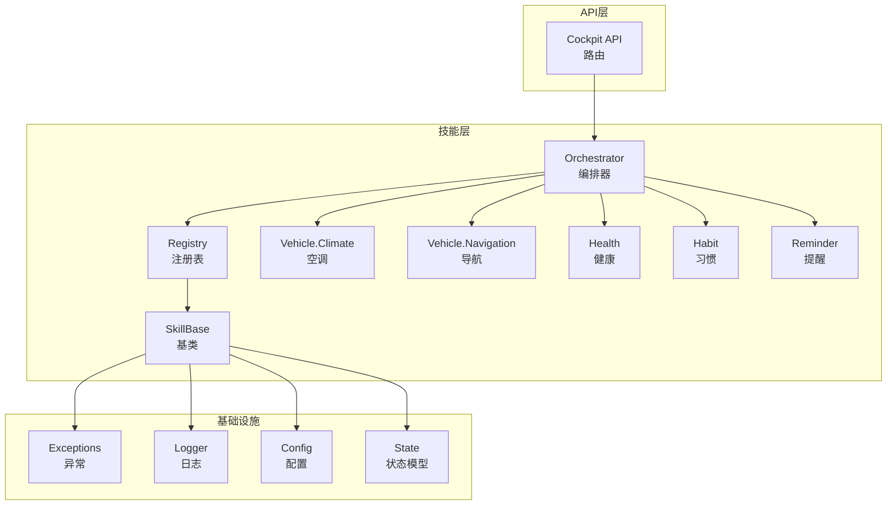
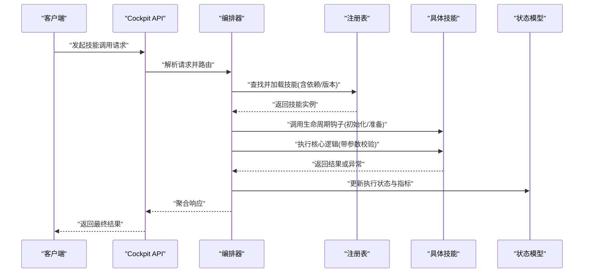
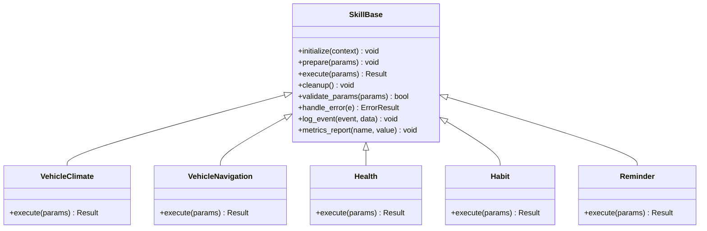
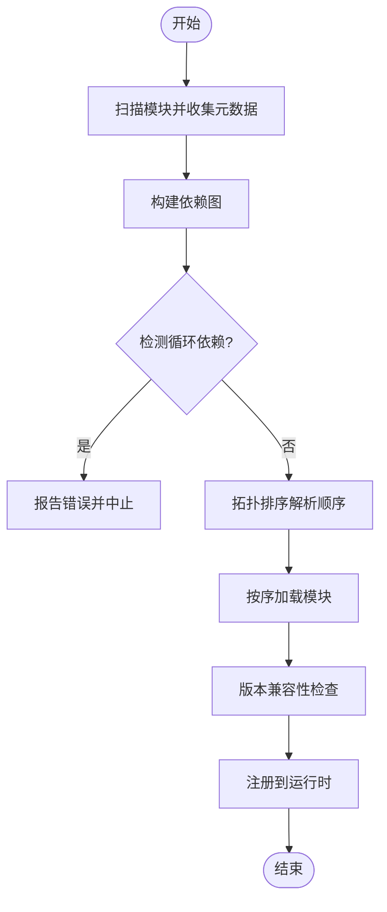
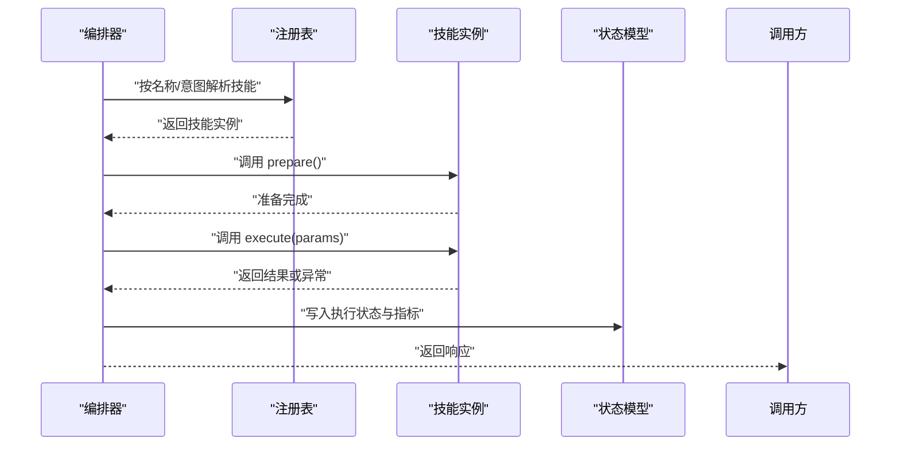
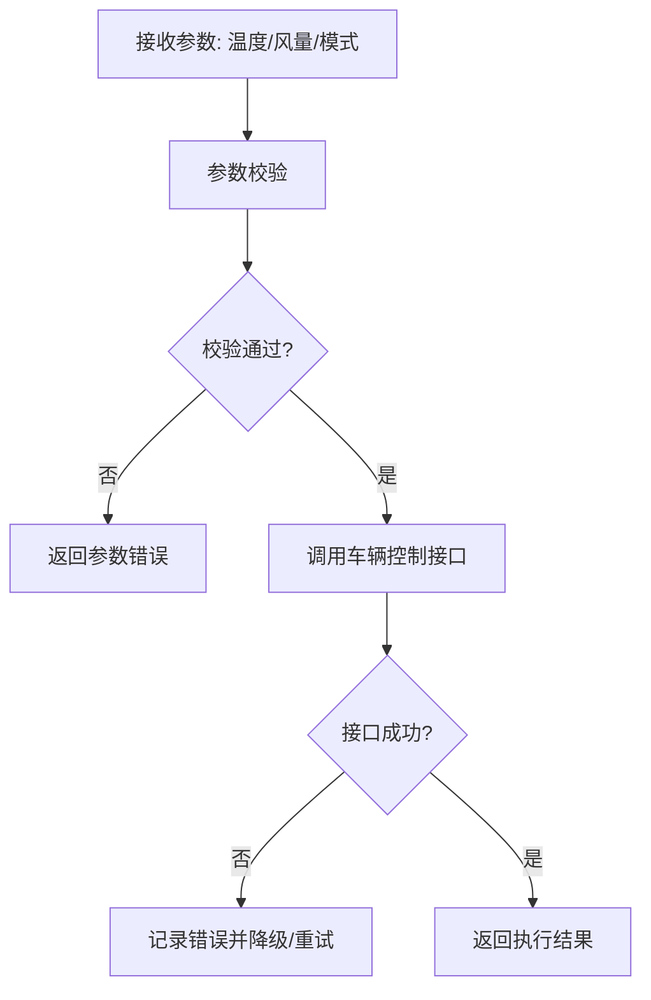
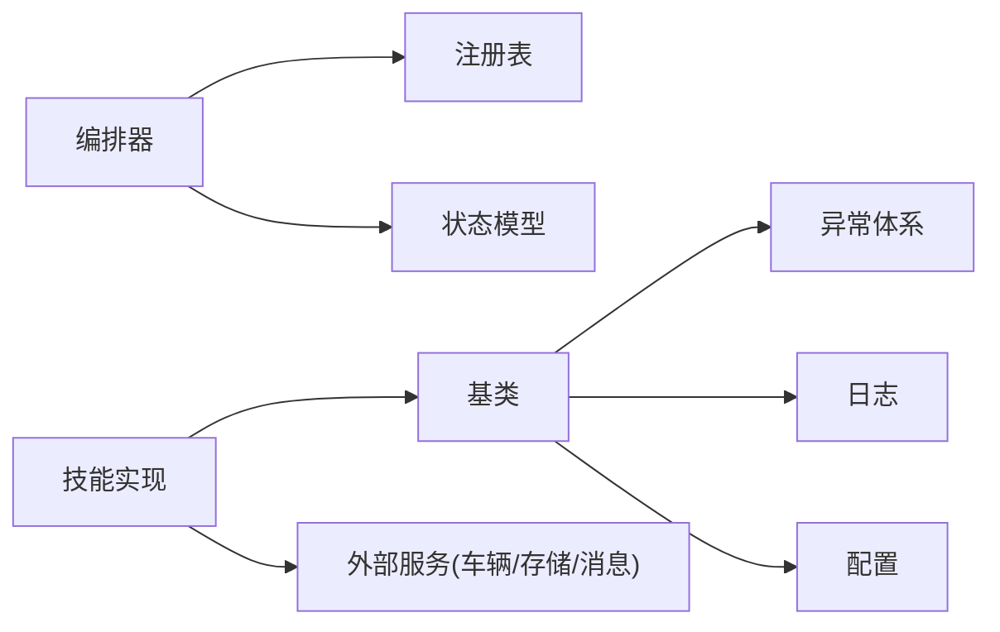

# 技能插件开发

<cite>
**本文引用的文件**   
- [backend_design/nexus/skills/base.py](file://backend_design/nexus/skills/base.py)
- [backend_design/nexus/skills/registry.py](file://backend_design/nexus/skills/registry.py)
- [backend_design/nexus/skills/orchestrator.py](file://backend_design/nexus/skills/orchestrator.py)
- [backend_design/nexus/skills/vehicle/climate.py](file://backend_design/nexus/skills/vehicle/climate.py)
- [backend_design/nexus/skills/vehicle/navigation.py](file://backend_design/nexus/skills/vehicle/navigation.py)
- [backend_design/nexus/skills/health.py](file://backend_design/nexus/skills/health.py)
- [backend_design/nexus/skills/habit.py](file://backend_design/nexus/skills/habit.py)
- [backend_design/nexus/skills/reminder.py](file://backend_design/nexus/skills/reminder.py)
- [backend_design/nexus/core/exceptions.py](file://backend_design/nexus/core/exceptions.py)
- [backend_design/nexus/core/logger.py](file://backend_design/nexus/core/logger.py)
- [backend_design/nexus/config.py](file://backend_design/nexus/config.py)
- [backend_design/nexus/api/routes/cockpit.py](file://backend_design/nexus/api/routes/cockpit.py)
- [backend_design/nexus/models/state.py](file://backend_design/nexus/models/state.py)
- [backend_design/tests/test_core.py](file://backend_design/tests/test_core.py)
</cite>

## 目录
1. [简介](#简介)
2. [项目结构](#项目结构)
3. [核心组件](#核心组件)
4. [架构总览](#架构总览)
5. [详细组件分析](#详细组件分析)
6. [依赖关系分析](#依赖关系分析)
7. [性能考虑](#性能考虑)
8. [故障排查指南](#故障排查指南)
9. [结论](#结论)
10. [附录](#附录)

## 简介
本文件面向希望在 NexusCockpit 系统中开发“技能插件”的工程师，系统性讲解如何基于技能基类进行扩展、如何实现生命周期管理、参数校验与错误处理，以及如何通过注册系统完成动态加载、依赖管理与版本控制。文档同时提供车辆控制、健康管理、习惯提醒等典型技能的实现思路与最佳实践，并给出测试方法与调试技巧，以及性能优化策略与资源管理建议。

## 项目结构
NexusCockpit 的技能子系统位于 backend_design/nexus/skills 目录下，采用分层与按领域组织相结合的结构：
- base.py：定义技能基类与通用能力（生命周期钩子、参数校验、错误处理、日志与指标上报等）
- registry.py：技能注册表与发现机制（动态加载、依赖声明、版本约束）
- orchestrator.py：技能编排器（路由、调度、上下文传递、超时与熔断）
- vehicle/*：车辆相关技能（空调、导航、座椅、车窗、媒体、状态等）
- health.py / habit.py / reminder.py：健康、习惯、提醒等通用技能
- core/*：异常、日志、配置等基础设施
- api/routes/cockpit.py：对外暴露的技能调用入口（HTTP/WebSocket）
- models/state.py：会话与执行状态模型

图表来源
- [backend_design/nexus/skills/base.py](file://backend_design/nexus/skills/base.py)
- [backend_design/nexus/skills/registry.py](file://backend_design/nexus/skills/registry.py)
- [backend_design/nexus/skills/orchestrator.py](file://backend_design/nexus/skills/orchestrator.py)
- [backend_design/nexus/skills/vehicle/climate.py](file://backend_design/nexus/skills/vehicle/climate.py)
- [backend_design/nexus/skills/vehicle/navigation.py](file://backend_design/nexus/skills/vehicle/navigation.py)
- [backend_design/nexus/skills/health.py](file://backend_design/nexus/skills/health.py)
- [backend_design/nexus/skills/habit.py](file://backend_design/nexus/skills/habit.py)
- [backend_design/nexus/skills/reminder.py](file://backend_design/nexus/skills/reminder.py)
- [backend_design/nexus/core/exceptions.py](file://backend_design/nexus/core/exceptions.py)
- [backend_design/nexus/core/logger.py](file://backend_design/nexus/core/logger.py)
- [backend_design/nexus/core/config.py](file://backend_design/nexus/config.py)
- [backend_design/nexus/models/state.py](file://backend_design/nexus/models/state.py)
- [backend_design/nexus/api/routes/cockpit.py](file://backend_design/nexus/api/routes/cockpit.py)

章节来源
- [backend_design/nexus/skills/base.py](file://backend_design/nexus/skills/base.py)
- [backend_design/nexus/skills/registry.py](file://backend_design/nexus/skills/registry.py)
- [backend_design/nexus/skills/orchestrator.py](file://backend_design/nexus/skills/orchestrator.py)
- [backend_design/nexus/api/routes/cockpit.py](file://backend_design/nexus/api/routes/cockpit.py)

## 核心组件
本节聚焦技能系统的三大核心：基类、注册表与编排器，说明其职责边界与交互方式。

- 技能基类（SkillBase）
  - 统一的生命周期钩子：初始化、准备、执行、清理
  - 参数校验框架：声明式字段校验、类型转换、默认值、必填项
  - 错误处理：标准化异常、降级策略、重试与回退
  - 可观测性：结构化日志、指标埋点、追踪ID透传
  - 上下文访问：用户、租户、会话、设备信息

- 注册表（Registry）
  - 动态发现：扫描模块、自动注册
  - 依赖管理：声明式依赖解析、循环依赖检测
  - 版本控制：语义化版本、兼容性检查、热插拔
  - 元数据：描述、标签、权限、限流策略

- 编排器（Orchestrator）
  - 路由与分发：根据意图或名称选择技能
  - 并发与超时：并行执行、超时控制、熔断保护
  - 状态同步：将执行结果写入状态模型
  - 中间件：鉴权、限流、缓存、审计

章节来源
- [backend_design/nexus/skills/base.py](file://backend_design/nexus/skills/base.py)
- [backend_design/nexus/skills/registry.py](file://backend_design/nexus/skills/registry.py)
- [backend_design/nexus/skills/orchestrator.py](file://backend_design/nexus/skills/orchestrator.py)

## 架构总览
下图展示从 API 到具体技能执行的端到端流程，包括注册、编排、执行与结果回写。

图表来源
- [backend_design/nexus/api/routes/cockpit.py](file://backend_design/nexus/api/routes/cockpit.py)
- [backend_design/nexus/skills/orchestrator.py](file://backend_design/nexus/skills/orchestrator.py)
- [backend_design/nexus/skills/registry.py](file://backend_design/nexus/skills/registry.py)
- [backend_design/nexus/models/state.py](file://backend_design/nexus/models/state.py)

## 详细组件分析

### 技能基类（SkillBase）分析与实现要点
- 设计目标
  - 为所有技能提供统一的接口与行为契约
  - 屏蔽底层差异，使上层编排器无需关心具体实现细节
- 关键能力
  - 生命周期钩子：init、prepare、execute、cleanup
  - 参数校验：支持声明式字段、类型、范围、枚举、自定义校验器
  - 错误处理：抛出领域异常、捕获外部错误、转换为标准响应
  - 可观测性：记录结构化日志、上报指标、注入追踪ID
  - 上下文：读取用户偏好、租户隔离、会话变量
- 继承与扩展
  - 子类仅需实现 execute 及必要的 prepare/cleanup
  - 通过装饰器或元数据声明依赖、版本、权限、限流等

图表来源
- [backend_design/nexus/skills/base.py](file://backend_design/nexus/skills/base.py)
- [backend_design/nexus/skills/vehicle/climate.py](file://backend_design/nexus/skills/vehicle/climate.py)
- [backend_design/nexus/skills/vehicle/navigation.py](file://backend_design/nexus/skills/vehicle/navigation.py)
- [backend_design/nexus/skills/health.py](file://backend_design/nexus/skills/health.py)
- [backend_design/nexus/skills/habit.py](file://backend_design/nexus/skills/habit.py)
- [backend_design/nexus/skills/reminder.py](file://backend_design/nexus/skills/reminder.py)

章节来源
- [backend_design/nexus/skills/base.py](file://backend_design/nexus/skills/base.py)

### 注册系统（Registry）：动态加载、依赖管理与版本控制
- 动态加载
  - 扫描指定包路径，发现实现了基类的模块并自动注册
  - 支持按需延迟加载，减少启动开销
- 依赖管理
  - 声明式依赖图，拓扑排序解析
  - 循环依赖检测与告警
  - 可选依赖与条件加载
- 版本控制
  - 语义化版本比较，兼容性与破坏性变更检查
  - 多版本并存与灰度切换
- 元数据与策略
  - 权限、限流、缓存、重试策略等元数据驱动

图表来源
- [backend_design/nexus/skills/registry.py](file://backend_design/nexus/skills/registry.py)

章节来源
- [backend_design/nexus/skills/registry.py](file://backend_design/nexus/skills/registry.py)

### 编排器（Orchestrator）：路由、调度与状态同步
- 路由与分发
  - 基于意图识别或显式名称匹配到具体技能
  - 支持别名与分组路由
- 调度与并发
  - 串行/并行执行策略
  - 超时控制、重试与熔断
- 状态与可观测性
  - 将执行状态写入状态模型
  - 指标采集与链路追踪贯穿全流程

图表来源
- [backend_design/nexus/skills/orchestrator.py](file://backend_design/nexus/skills/orchestrator.py)
- [backend_design/nexus/skills/registry.py](file://backend_design/nexus/skills/registry.py)
- [backend_design/nexus/models/state.py](file://backend_design/nexus/models/state.py)

章节来源
- [backend_design/nexus/skills/orchestrator.py](file://backend_design/nexus/skills/orchestrator.py)

### 示例一：车辆控制技能（以空调为例）
- 需求概述
  - 设置车内温度、风量、模式（制冷/制热/自动）
  - 支持查询当前空调状态
- 实现要点
  - 继承基类，实现 execute 方法
  - 使用参数校验确保输入合法
  - 调用车辆控制接口（HTTP/MCP/本地总线），并处理异常
  - 记录日志与指标，便于监控与排障
- 集成方式
  - 通过注册表自动发现并注册
  - 编排器根据意图或名称路由到该技能

图表来源
- [backend_design/nexus/skills/vehicle/climate.py](file://backend_design/nexus/skills/vehicle/climate.py)
- [backend_design/nexus/skills/base.py](file://backend_design/nexus/skills/base.py)

章节来源
- [backend_design/nexus/skills/vehicle/climate.py](file://backend_design/nexus/skills/vehicle/climate.py)

### 示例二：导航技能
- 功能范围
  - 设置目的地、规划路线、实时导航控制
- 关键点
  - 位置与地图服务依赖管理
  - 大对象（如地图数据）懒加载与缓存
  - 失败回退（离线提示或推荐备选方案）

章节来源
- [backend_design/nexus/skills/vehicle/navigation.py](file://backend_design/nexus/skills/vehicle/navigation.py)

### 示例三：健康管理技能
- 功能范围
  - 健康数据采集与分析、健康建议生成
- 关键点
  - 数据隐私与合规校验
  - 异步任务与批处理
  - 指标上报与健康阈值告警

章节来源
- [backend_design/nexus/skills/health.py](file://backend_design/nexus/skills/health.py)

### 示例四：习惯与提醒技能
- 功能范围
  - 习惯跟踪、规则引擎触发、定时提醒
- 关键点
  - 事件驱动与时间轮调度
  - 去重与幂等处理
  - 用户偏好与个性化策略

章节来源
- [backend_design/nexus/skills/habit.py](file://backend_design/nexus/skills/habit.py)
- [backend_design/nexus/skills/reminder.py](file://backend_design/nexus/skills/reminder.py)

## 依赖关系分析
- 组件耦合
  - 编排器强依赖注册表与状态模型
  - 技能对基类强依赖，对第三方库弱依赖（通过适配器或封装）
- 外部依赖
  - 车辆控制接口（HTTP/MCP）、消息队列、存储后端
- 潜在风险
  - 循环依赖需由注册表检测
  - 版本不兼容需在加载阶段阻断

图表来源
- [backend_design/nexus/skills/orchestrator.py](file://backend_design/nexus/skills/orchestrator.py)
- [backend_design/nexus/skills/registry.py](file://backend_design/nexus/skills/registry.py)
- [backend_design/nexus/skills/base.py](file://backend_design/nexus/skills/base.py)
- [backend_design/nexus/core/exceptions.py](file://backend_design/nexus/core/exceptions.py)
- [backend_design/nexus/core/logger.py](file://backend_design/nexus/core/logger.py)
- [backend_design/nexus/config.py](file://backend_design/nexus/config.py)
- [backend_design/nexus/models/state.py](file://backend_design/nexus/models/state.py)

章节来源
- [backend_design/nexus/skills/orchestrator.py](file://backend_design/nexus/skills/orchestrator.py)
- [backend_design/nexus/skills/registry.py](file://backend_design/nexus/skills/registry.py)
- [backend_design/nexus/skills/base.py](file://backend_design/nexus/skills/base.py)

## 性能考虑
- 启动与加载
  - 延迟加载与按需发现，避免全量扫描带来的冷启动开销
  - 预编译依赖图与缓存注册表索引
- 执行期优化
  - 并行执行无副作用技能，串行执行有状态操作
  - 连接池复用、对象池与内存复用
  - 大对象缓存与失效策略（LRU/TTL）
- 容错与稳定性
  - 超时与熔断防止雪崩
  - 重试退避与幂等键保障
- 可观测性
  - 指标采样与降采样，避免高基数导致开销过大
  - 结构化日志分级输出，避免频繁 I/O

[本节为通用指导，不涉及具体文件分析]

## 故障排查指南
- 常见问题定位
  - 参数校验失败：检查声明式字段与类型约束
  - 依赖缺失或版本冲突：查看注册表加载日志与版本兼容性检查
  - 外部服务不可用：确认熔断与重试策略是否生效
  - 状态不一致：核对状态模型写入与事务边界
- 调试技巧
  - 开启详细日志与追踪ID透传
  - 使用单元测试模拟外部依赖
  - 集成测试覆盖端到端流程
- 参考测试用例
  - 基础能力与异常路径验证

章节来源
- [backend_design/nexus/core/exceptions.py](file://backend_design/nexus/core/exceptions.py)
- [backend_design/nexus/core/logger.py](file://backend_design/nexus/core/logger.py)
- [backend_design/tests/test_core.py](file://backend_design/tests/test_core.py)

## 结论
通过统一的技能基类、完善的注册系统与编排器，NexusCockpit 提供了可扩展、可观测、可治理的技能插件体系。开发者只需关注业务逻辑实现，即可快速接入车辆控制、健康管理、习惯提醒等场景。配合严格的参数校验、错误处理与性能优化策略，能够保证系统在复杂环境下的稳定与高效。

[本节为总结性内容，不涉及具体文件分析]

## 附录
- 最佳实践清单
  - 在 prepare 中完成昂贵资源的预热与校验
  - 在 execute 中保持幂等与短耗时
  - 在 cleanup 中释放资源与清理临时状态
  - 使用结构化日志与指标埋点，便于问题定位
  - 通过注册表声明依赖与版本，避免运行时不确定性
- 参考入口
  - API 路由：用于外部调用与集成
  - 状态模型：用于持久化执行上下文与结果

章节来源
- [backend_design/nexus/api/routes/cockpit.py](file://backend_design/nexus/api/routes/cockpit.py)
- [backend_design/nexus/models/state.py](file://backend_design/nexus/models/state.py)