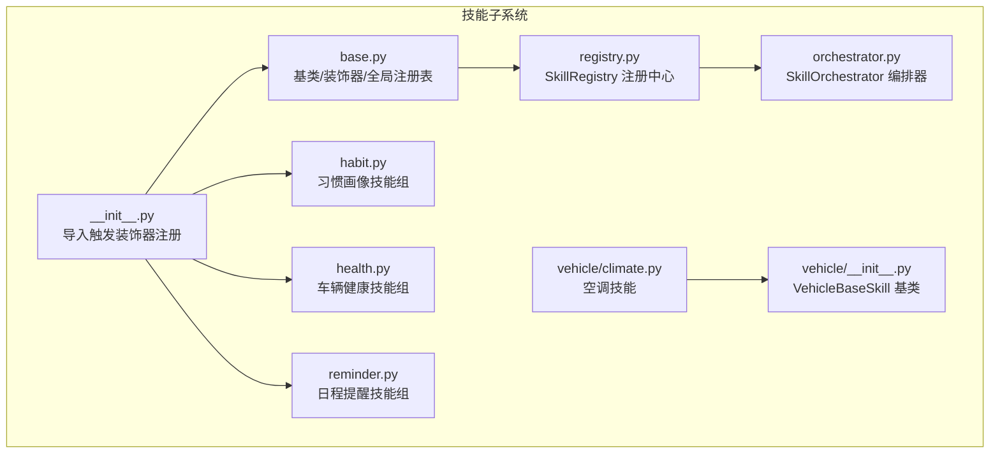
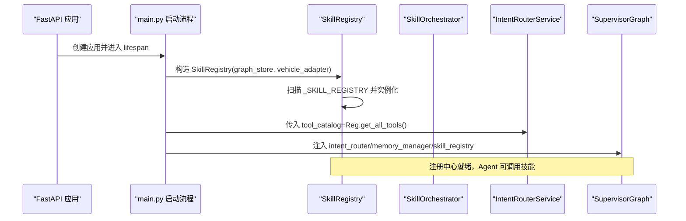
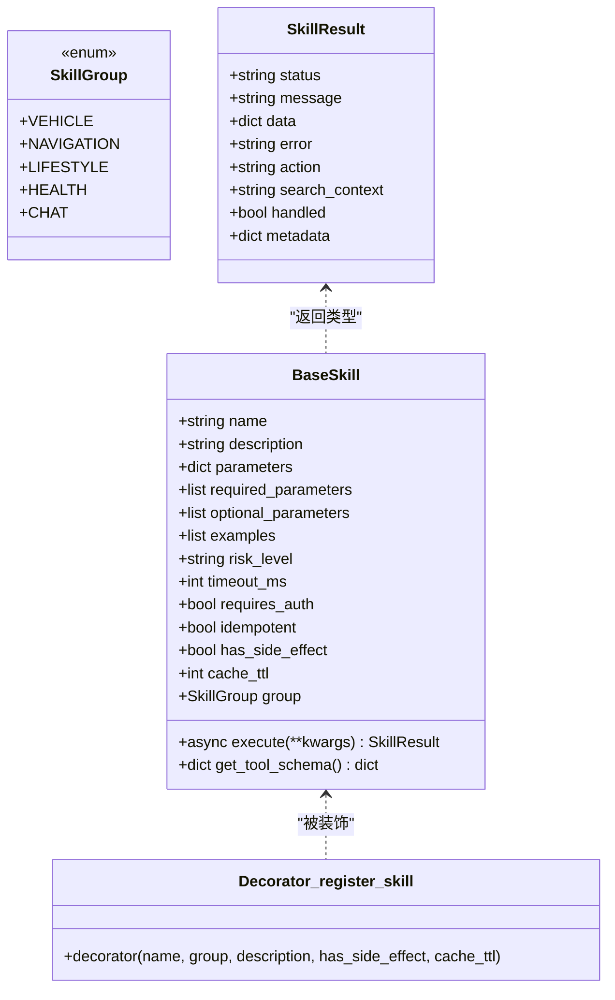
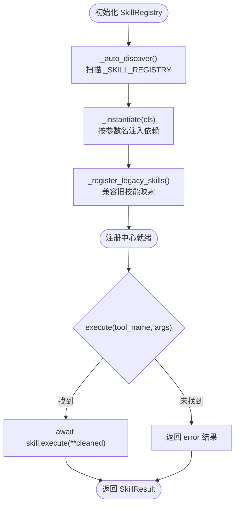
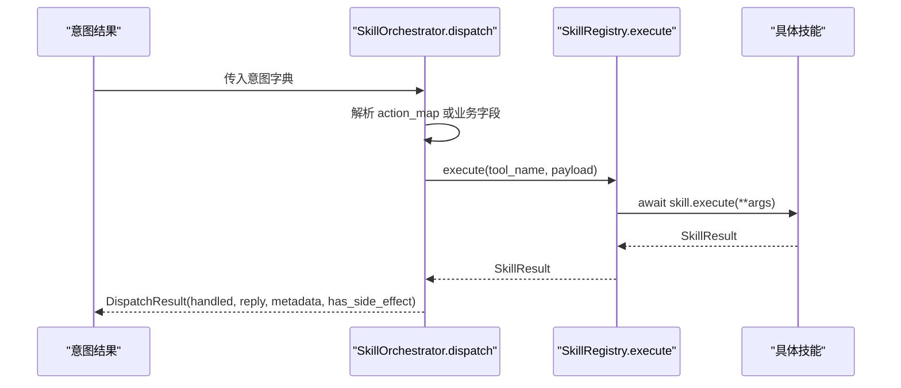
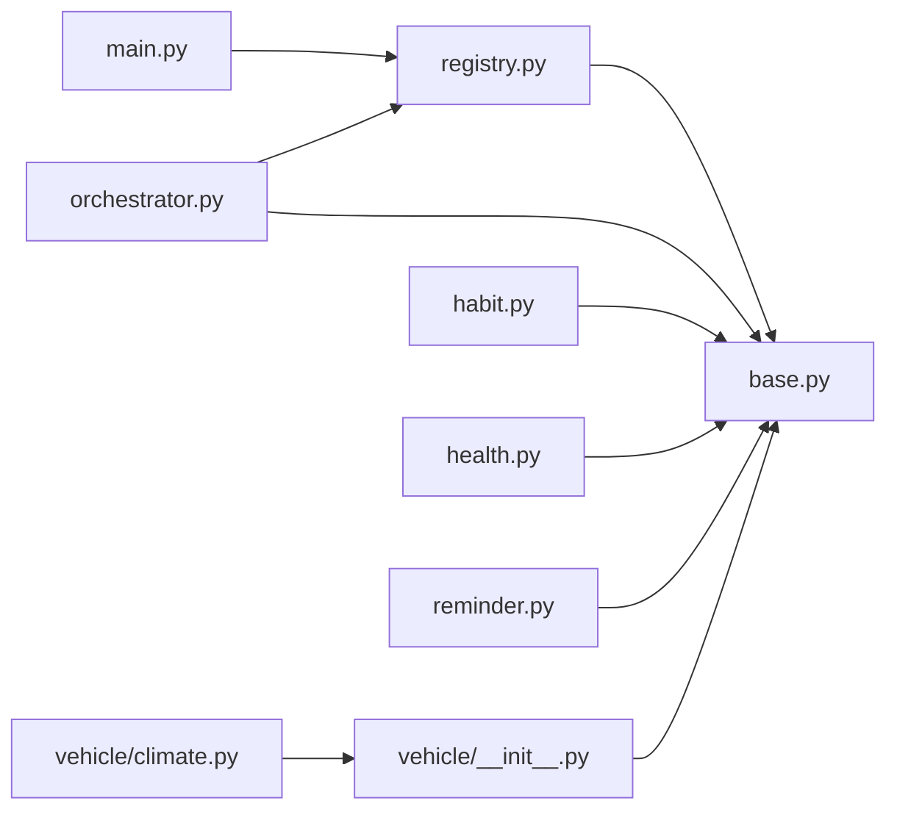

# 插件架构设计

<cite>
**本文引用的文件**   
- [backend_design/nexus/skills/base.py](file://backend_design/nexus/skills/base.py)
- [backend_design/nexus/skills/registry.py](file://backend_design/nexus/skills/registry.py)
- [backend_design/nexus/skills/orchestrator.py](file://backend_design/nexus/skills/orchestrator.py)
- [backend_design/nexus/skills/__init__.py](file://backend_design/nexus/skills/__init__.py)
- [backend_design/nexus/skills/habit.py](file://backend_design/nexus/skills/habit.py)
- [backend_design/nexus/skills/health.py](file://backend_design/nexus/skills/health.py)
- [backend_design/nexus/skills/reminder.py](file://backend_design/nexus/skills/reminder.py)
- [backend_design/nexus/skills/vehicle/climate.py](file://backend_design/nexus/skills/vehicle/climate.py)
- [backend_design/nexus/skills/vehicle/__init__.py](file://backend_design/nexus/skills/vehicle/__init__.py)
- [backend_design/nexus/main.py](file://backend_design/nexus/main.py)
</cite>

## 目录
1. [引言](#引言)
2. [项目结构](#项目结构)
3. [核心组件](#核心组件)
4. [架构总览](#架构总览)
5. [详细组件分析](#详细组件分析)
6. [依赖关系分析](#依赖关系分析)
7. [性能考虑](#性能考虑)
8. [故障排查指南](#故障排查指南)
9. [结论](#结论)
10. [附录：开发可插拔技能模块的完整示例](#附录开发可插拔技能模块的完整示例)

## 引言
本文件系统性阐述 NexusCockpit 的插件化“技能”架构，重点围绕技能注册中心（SkillRegistry）的工作原理展开，包括装饰器自动发现机制、动态加载与依赖注入、全局注册表维护与实例化流程、手动注册与自动注册的兼容策略、v1.0 到 v2.0 的迁移方案，以及插件生命周期管理、错误处理与性能优化。文末提供完整的开发示例路径，帮助读者快速实现一个可插拔的技能模块。

## 项目结构
NexusCockpit 的技能体系位于 backend_design/nexus/skills 目录下，采用“基类 + 装饰器 + 注册中心 + 编排器”的分层组织方式：
- base.py：定义技能基类、分组枚举、统一结果模型与 @register_skill 装饰器，维护全局 _SKILL_REGISTRY 表
- registry.py：实现 SkillRegistry，负责扫描全局表、实例化并注入依赖、兼容旧版手动注册
- orchestrator.py：实现 SkillOrchestrator，根据意图将请求分发到具体技能执行
- __init__.py：导入新技能模块以触发装饰器注册
- habit.py / health.py / reminder.py：v2.0 新增技能组（习惯画像、车辆健康、日程提醒）
- vehicle/*：车载技能及通用 VehicleBaseSkill 基类

图表来源
- [backend_design/nexus/skills/base.py:1-186](file://backend_design/nexus/skills/base.py#L1-L186)
- [backend_design/nexus/skills/registry.py:1-196](file://backend_design/nexus/skills/registry.py#L1-L196)
- [backend_design/nexus/skills/orchestrator.py:1-131](file://backend_design/nexus/skills/orchestrator.py#L1-L131)
- [backend_design/nexus/skills/__init__.py:1-22](file://backend_design/nexus/skills/__init__.py#L1-L22)
- [backend_design/nexus/skills/habit.py:1-215](file://backend_design/nexus/skills/habit.py#L1-L215)
- [backend_design/nexus/skills/health.py:1-209](file://backend_design/nexus/skills/health.py#L1-L209)
- [backend_design/nexus/skills/reminder.py:1-294](file://backend_design/nexus/skills/reminder.py#L1-L294)
- [backend_design/nexus/skills/vehicle/climate.py:1-35](file://backend_design/nexus/skills/vehicle/climate.py#L1-L35)
- [backend_design/nexus/skills/vehicle/__init__.py:1-55](file://backend_design/nexus/skills/vehicle/__init__.py#L1-L55)

章节来源
- [backend_design/nexus/skills/base.py:1-186](file://backend_design/nexus/skills/base.py#L1-L186)
- [backend_design/nexus/skills/registry.py:1-196](file://backend_design/nexus/skills/registry.py#L1-L196)
- [backend_design/nexus/skills/orchestrator.py:1-131](file://backend_design/nexus/skills/orchestrator.py#L1-L131)
- [backend_design/nexus/skills/__init__.py:1-22](file://backend_design/nexus/skills/__init__.py#L1-L22)

## 核心组件
- 技能基类与装饰器（base.py）
  - BaseSkill：定义统一的 execute 接口、Tool Schema 生成、副作用与缓存 TTL 属性
  - register_skill：装饰器在类上打标记并写入全局 _SKILL_REGISTRY
  - SkillGroup：按专家维度划分（车控、导航、生活、健康、闲聊）
  - SkillResult：统一返回结构，便于上层编排与缓存控制
- 注册中心（registry.py）
  - 自动发现：启动时遍历 _SKILL_REGISTRY，调用 _instantiate 智能注入依赖
  - 兼容 v1.0：对未使用装饰器的旧技能进行映射与分组设置
  - 查询能力：按分组获取、副作用列表、Tool Schema 集合等
- 编排器（orchestrator.py）
  - 根据意图字段映射到工具名，执行并封装为 DispatchResult
  - 记录耗时、副作用标记，供缓存层决策

章节来源
- [backend_design/nexus/skills/base.py:1-186](file://backend_design/nexus/skills/base.py#L1-L186)
- [backend_design/nexus/skills/registry.py:1-196](file://backend_design/nexus/skills/registry.py#L1-L196)
- [backend_design/nexus/skills/orchestrator.py:1-131](file://backend_design/nexus/skills/orchestrator.py#L1-L131)

## 架构总览
应用启动时创建 FastAPI 应用，初始化图存储、向量存储、车控适配器、语义缓存、限流器等；随后构建 SkillRegistry，传入 graph_store 与 vehicle_adapter 作为依赖源，完成所有技能的自动发现与实例化；IntentRouterService 基于 Tool Schema 进行意图路由；SupervisorGraph 协调各专家 Agent 工作流。

图表来源
- [backend_design/nexus/main.py:145-213](file://backend_design/nexus/main.py#L145-L213)
- [backend_design/nexus/skills/registry.py:48-61](file://backend_design/nexus/skills/registry.py#L48-L61)

章节来源
- [backend_design/nexus/main.py:145-213](file://backend_design/nexus/main.py#L145-L213)

## 详细组件分析

### 技能基类与装饰器（base.py）
- 关键职责
  - 定义技能元数据（name/description/parameters/required_parameters/optional_parameters/examples/risk_level/timeout_ms/requires_auth/idempotent）
  - 通过 get_tool_schema 生成 OpenAI Function Calling 格式的工具描述
  - 暴露 has_side_effect/cache_ttl/group 属性，供缓存与编排层决策
  - register_skill 装饰器：在类上设置 _skill_name/_skill_group/_skill_has_side_effect/_skill_cache_ttl，并写入全局 _SKILL_REGISTRY
- 复杂度与性能
  - 装饰器在模块导入时执行，时间复杂度 O(1)，空间复杂度 O(1)
  - get_tool_schema 每次调用均为轻量级字典构造，适合高频场景
- 错误处理
  - 装饰器内部无外部 I/O，异常概率低；若 description 覆盖失败，仅影响元数据展示

图表来源
- [backend_design/nexus/skills/base.py:28-82](file://backend_design/nexus/skills/base.py#L28-L82)
- [backend_design/nexus/skills/base.py:85-186](file://backend_design/nexus/skills/base.py#L85-L186)

章节来源
- [backend_design/nexus/skills/base.py:1-186](file://backend_design/nexus/skills/base.py#L1-L186)

### 注册中心（registry.py）
- 自动发现与实例化
  - _auto_discover：遍历 _SKILL_REGISTRY，调用 _instantiate 注入依赖
  - _instantiate：基于 inspect.signature 匹配参数名，从 self._deps 中注入 graph_store/vehicle_adapter；默认值参数跳过；缺失参数由 Python 抛出 TypeError
- 兼容 v1.0
  - _register_legacy_skills：对未装饰的旧技能进行映射与分组设置，如 vehicle_* 归入 VEHICLE 并标记副作用与 TTL=0
- 查询与执行
  - get_skills_by_group：按专家分组筛选
  - get_side_effect_skills：返回有副作用的技能名列表
  - execute：统一捕获异常，返回 SkillResult(status="error")

图表来源
- [backend_design/nexus/skills/registry.py:48-140](file://backend_design/nexus/skills/registry.py#L48-L140)
- [backend_design/nexus/skills/registry.py:171-196](file://backend_design/nexus/skills/registry.py#L171-L196)

章节来源
- [backend_design/nexus/skills/registry.py:1-196](file://backend_design/nexus/skills/registry.py#L1-L196)

### 编排器（orchestrator.py）
- 分发逻辑
  - 车控动作映射：Climate/Window/Seat/Navigation/Media/Status -> vehicle_*
  - 点餐：Call_elm -> order_food
  - 搜索：Need_Search -> web_search
  - 声纹注册：Register_Action -> register_voice
  - 无匹配：handled=False，交由 LLM 兜底
- 计时与副作用
  - _timed_execute 记录工具耗时
  - 车控指令强制 has_side_effect=True，禁止缓存

图表来源
- [backend_design/nexus/skills/orchestrator.py:54-131](file://backend_design/nexus/skills/orchestrator.py#L54-L131)
- [backend_design/nexus/skills/registry.py:171-196](file://backend_design/nexus/skills/registry.py#L171-L196)

章节来源
- [backend_design/nexus/skills/orchestrator.py:1-131](file://backend_design/nexus/skills/orchestrator.py#L1-L131)

### 车载技能基类（vehicle/__init__.py）
- VehicleBaseSkill
  - 统一通过 adapter.invoke_command 调用车控总线
  - 支持多座舱隔离：运行时优先取 cockpit_id 对应的适配器，否则回退默认单例
  - _invoke 将适配器返回包装为 SkillResult

章节来源
- [backend_design/nexus/skills/vehicle/__init__.py:1-55](file://backend_design/nexus/skills/vehicle/__init__.py#L1-L55)

### 典型技能示例
- 空调技能（vehicle/climate.py）
  - 继承 VehicleBaseSkill，声明参数与示例，execute 委托给 _invoke
- 习惯画像（habit.py）
  - habit_record：记录偏好到 Neo4j（可选），TTL=0
  - habit_recommend：读取用户习惯并推荐，TTL=3600
  - habit_adjust：批量下发车控指令，has_side_effect=True，TTL=0
- 车辆健康（health.py）
  - diagnose_vehicle：结合车辆状态与知识库检索
  - decode_dtc：故障码速查（未来接入 Cherry KB）
  - maintenance_advice：里程/时间规则生成建议
- 日程提醒（reminder.py）
  - set_reminder/query_reminder/cancel_reminder：基于 Redis Sorted Set 持久化与查询

章节来源
- [backend_design/nexus/skills/vehicle/climate.py:1-35](file://backend_design/nexus/skills/vehicle/climate.py#L1-L35)
- [backend_design/nexus/skills/habit.py:1-215](file://backend_design/nexus/skills/habit.py#L1-L215)
- [backend_design/nexus/skills/health.py:1-209](file://backend_design/nexus/skills/health.py#L1-L209)
- [backend_design/nexus/skills/reminder.py:1-294](file://backend_design/nexus/skills/reminder.py#L1-L294)

## 依赖关系分析
- 应用入口（main.py）
  - 在 lifespan 中构建 SkillRegistry(graph_store, vehicle_adapter)
  - 将 SkillRegistry 注入 SupervisorGraph 与 IntentRouterService
- 注册中心（registry.py）
  - 依赖 base.py 中的 BaseSkill/SkillGroup/SkillResult/_SKILL_REGISTRY/register_skill
  - 依赖 core.logger 用于日志
- 编排器（orchestrator.py）
  - 依赖 registry.py 的 SkillRegistry 与 base.py 的 SkillResult
- 技能模块（habit/health/reminder/vehicle/*）
  - 通过 @register_skill 装饰器注册，并在 __init__.py 中导入以触发装饰器执行

图表来源
- [backend_design/nexus/main.py:145-213](file://backend_design/nexus/main.py#L145-L213)
- [backend_design/nexus/skills/registry.py:1-196](file://backend_design/nexus/skills/registry.py#L1-L196)
- [backend_design/nexus/skills/orchestrator.py:1-131](file://backend_design/nexus/skills/orchestrator.py#L1-L131)
- [backend_design/nexus/skills/base.py:1-186](file://backend_design/nexus/skills/base.py#L1-L186)
- [backend_design/nexus/skills/habit.py:1-215](file://backend_design/nexus/skills/habit.py#L1-L215)
- [backend_design/nexus/skills/health.py:1-209](file://backend_design/nexus/skills/health.py#L1-L209)
- [backend_design/nexus/skills/reminder.py:1-294](file://backend_design/nexus/skills/reminder.py#L1-L294)
- [backend_design/nexus/skills/vehicle/climate.py:1-35](file://backend_design/nexus/skills/vehicle/climate.py#L1-L35)
- [backend_design/nexus/skills/vehicle/__init__.py:1-55](file://backend_design/nexus/skills/vehicle/__init__.py#L1-L55)

章节来源
- [backend_design/nexus/main.py:145-213](file://backend_design/nexus/main.py#L145-L213)
- [backend_design/nexus/skills/registry.py:1-196](file://backend_design/nexus/skills/registry.py#L1-L196)
- [backend_design/nexus/skills/orchestrator.py:1-131](file://backend_design/nexus/skills/orchestrator.py#L1-L131)
- [backend_design/nexus/skills/base.py:1-186](file://backend_design/nexus/skills/base.py#L1-L186)

## 性能考虑
- 装饰器自动发现
  - 仅在模块导入时执行一次，开销极小；避免重复注册（已存在则跳过）
- 依赖注入
  - 基于签名反射的参数匹配，O(n) 于参数个数，通常 n≤3，开销可忽略
- 执行路径
  - 编排器记录耗时，便于监控与定位瓶颈
  - 副作用标记与 TTL 控制缓存命中，减少重复计算与外部调用
- 资源隔离
  - 车载技能通过 VehicleBaseSkill 的多座舱适配器选择，避免跨座舱干扰
- 建议
  - 合理设置 cache_ttl：读多写少且幂等的技能可设较长 TTL；有副作用或强实时性设为 0
  - 对高延迟外部依赖（Redis/Neo4j/车控总线）增加超时与降级策略

[本节为通用性能指导，不直接分析具体文件]

## 故障排查指南
- 常见错误
  - 未知技能：execute 找不到 tool_name，返回 error 并附带 skill_not_found 信息
  - 依赖注入失败：技能 __init__ 缺少必需参数且无法注入，Python 抛出 TypeError
  - 外部依赖不可用：Redis/Neo4j/车控适配器异常，应记录警告并降级返回
- 定位方法
  - 查看注册中心日志：自动注册失败、旧技能映射失败、执行异常
  - 检查 Tool Schema：确认意图路由能正确识别参数
  - 验证副作用与 TTL：确保缓存策略符合预期

章节来源
- [backend_design/nexus/skills/registry.py:171-196](file://backend_design/nexus/skills/registry.py#L171-L196)
- [backend_design/nexus/skills/registry.py:63-95](file://backend_design/nexus/skills/registry.py#L63-L95)

## 结论
NexusCockpit 的技能插件架构通过装饰器自动发现与注册中心集中管理，实现了高内聚、低耦合的可插拔扩展能力。配合编排器与意图路由，系统能够灵活地将自然语言意图转化为结构化工具调用，并通过副作用与 TTL 控制缓存策略，兼顾一致性与性能。v1.0 到 v2.0 的迁移方案保证了平滑过渡，开发者只需遵循基类与装饰器约定即可快速扩展新技能。

[本节为总结性内容，不直接分析具体文件]

## 附录：开发可插拔技能模块的完整示例
以下给出一个最小化的“天气查询”技能示例步骤（不含代码正文，仅提供路径参考）：
- 新建模块 weather.py，定义 WeatherQuerySkill 继承 BaseSkill
  - 使用 @register_skill("weather_query", SkillGroup.LIFESTYLE, description="...", has_side_effect=False, cache_ttl=300) 装饰
  - 实现 execute 方法，返回 SkillResult
  - 如需外部依赖，在 __init__(self, some_dep=None) 中声明，注册中心将自动注入
- 在 skills/__init__.py 中导入 weather 模块以触发装饰器注册
- 运行服务后，SkillRegistry 会自动发现并实例化该技能
- 通过 IntentRouterService 的 Tool Schema 进行意图路由，编排器将调用对应技能

参考路径
- [backend_design/nexus/skills/base.py:43-82](file://backend_design/nexus/skills/base.py#L43-L82)
- [backend_design/nexus/skills/registry.py:63-95](file://backend_design/nexus/skills/registry.py#L63-L95)
- [backend_design/nexus/skills/__init__.py:18-22](file://backend_design/nexus/skills/__init__.py#L18-L22)

章节来源
- [backend_design/nexus/skills/base.py:43-82](file://backend_design/nexus/skills/base.py#L43-L82)
- [backend_design/nexus/skills/registry.py:63-95](file://backend_design/nexus/skills/registry.py#L63-L95)
- [backend_design/nexus/skills/__init__.py:18-22](file://backend_design/nexus/skills/__init__.py#L18-L22)