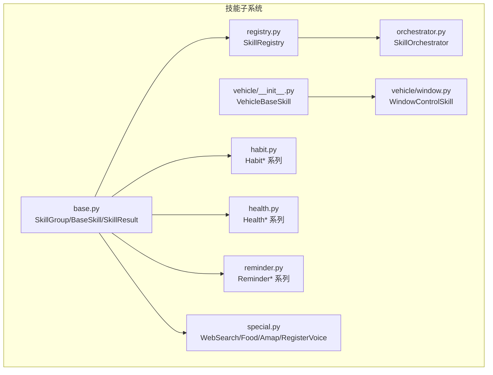
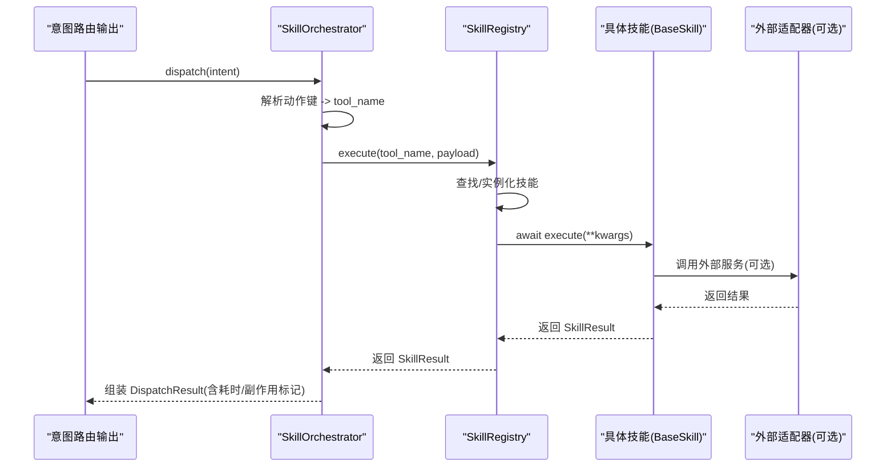
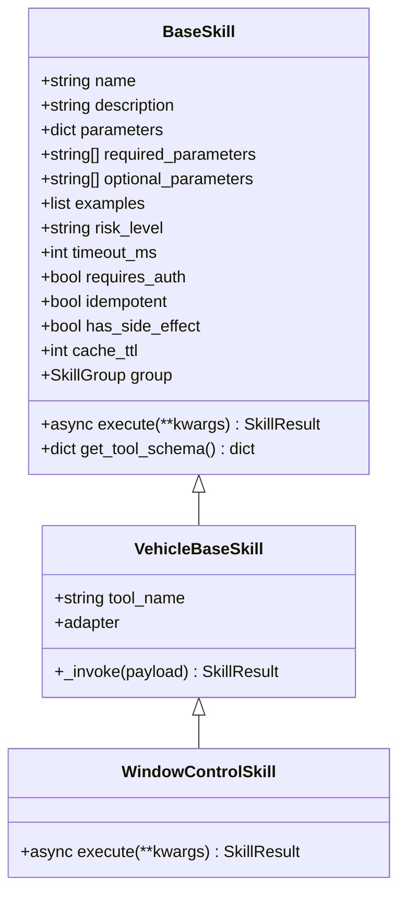
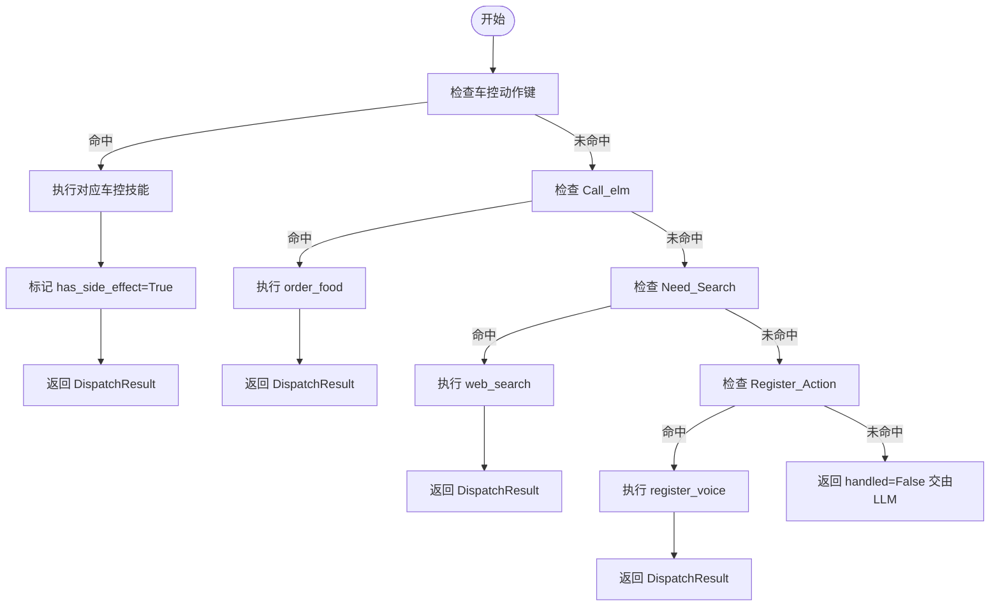
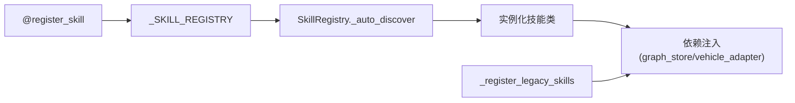

# 新技能开发指南

<cite>
**本文引用的文件列表**
- [backend_design/nexus/skills/base.py](file://backend_design/nexus/skills/base.py)
- [backend_design/nexus/skills/registry.py](file://backend_design/nexus/skills/registry.py)
- [backend_design/nexus/skills/orchestrator.py](file://backend_design/nexus/skills/orchestrator.py)
- [backend_design/nexus/skills/vehicle/__init__.py](file://backend_design/nexus/skills/vehicle/__init__.py)
- [backend_design/nexus/skills/vehicle/window.py](file://backend_design/nexus/skills/vehicle/window.py)
- [backend_design/nexus/skills/habit.py](file://backend_design/nexus/skills/habit.py)
- [backend_design/nexus/skills/health.py](file://backend_design/nexus/skills/health.py)
- [backend_design/nexus/skills/reminder.py](file://backend_design/nexus/skills/reminder.py)
- [backend_design/nexus/skills/special.py](file://backend_design/nexus/skills/special.py)
- [backend_design/tests/test_core.py](file://backend_design/tests/test_core.py)
- [docs/testing/TESTING.md](file://docs/testing/TESTING.md)
- [backend_design/nexus/observability/metrics.py](file://backend_design/nexus/observability/metrics.py)
</cite>

## 目录
1. [引言](#引言)
2. [项目结构](#项目结构)
3. [核心组件](#核心组件)
4. [架构总览](#架构总览)
5. [详细组件分析](#详细组件分析)
6. [依赖关系分析](#依赖关系分析)
7. [性能与缓存策略](#性能与缓存策略)
8. [故障排查指南](#故障排查指南)
9. [结论](#结论)
10. [附录：完整开发示例与测试方法](#附录完整开发示例与测试方法)

## 引言
本指南面向希望为系统新增“技能”的开发者，围绕 BaseSkill 基类接口、SkillResult 数据结构、SkillGroup 分组机制、副作用与缓存控制、以及 SkillOrchestrator 编排流程进行系统化说明。文档同时提供常见场景（HTTP API、数据库/图谱、文件处理等）的开发范式与测试方法，帮助快速落地高质量技能。

## 项目结构
技能子系统位于 backend_design/nexus/skills 目录下，采用“基类 + 装饰器自动注册 + 注册中心 + 编排器”的分层设计：
- base.py：定义 SkillGroup、register_skill 装饰器、BaseSkill 基类、SkillResult 统一结果
- registry.py：全局注册中心，支持装饰器自动发现与手动兼容注册，提供按组查询、副作用查询、执行入口
- orchestrator.py：根据意图分发到具体技能，封装计时与副作用标记
- vehicle/*：车载技能基类与具体实现（如车窗控制）
- habit.py / health.py / reminder.py / special.py：非车控领域技能（习惯画像、健康诊断、提醒、搜索/点餐/地图/声纹注册等）

图表来源
- [backend_design/nexus/skills/base.py:1-186](file://backend_design/nexus/skills/base.py#L1-L186)
- [backend_design/nexus/skills/registry.py:1-196](file://backend_design/nexus/skills/registry.py#L1-L196)
- [backend_design/nexus/skills/orchestrator.py:1-131](file://backend_design/nexus/skills/orchestrator.py#L1-L131)
- [backend_design/nexus/skills/vehicle/__init__.py:1-55](file://backend_design/nexus/skills/vehicle/__init__.py#L1-L55)
- [backend_design/nexus/skills/vehicle/window.py:1-31](file://backend_design/nexus/skills/vehicle/window.py#L1-L31)
- [backend_design/nexus/skills/habit.py:1-215](file://backend_design/nexus/skills/habit.py#L1-L215)
- [backend_design/nexus/skills/health.py:1-209](file://backend_design/nexus/skills/health.py#L1-L209)
- [backend_design/nexus/skills/reminder.py:1-294](file://backend_design/nexus/skills/reminder.py#L1-L294)
- [backend_design/nexus/skills/special.py:1-410](file://backend_design/nexus/skills/special.py#L1-L410)

章节来源
- [backend_design/nexus/skills/base.py:1-186](file://backend_design/nexus/skills/base.py#L1-L186)
- [backend_design/nexus/skills/registry.py:1-196](file://backend_design/nexus/skills/registry.py#L1-L196)
- [backend_design/nexus/skills/orchestrator.py:1-131](file://backend_design/nexus/skills/orchestrator.py#L1-L131)

## 核心组件
- 技能分组与装饰器
  - SkillGroup：定义五大专家分组（车辆、导航、生活、健康、闲聊），用于权限与访问策略控制
  - register_skill：装饰器将类名、分组、副作用标志、TTL 写入全局表，供注册中心自动发现
- 基类与工具描述
  - BaseSkill：抽象出 execute 异步方法；get_tool_schema 生成 OpenAI Function Calling 格式的工具描述；暴露 has_side_effect、cache_ttl、group 属性
- 统一结果
  - SkillResult：包含 status、message、data、error、action、search_context、handled、metadata 等字段，贯穿所有技能的返回
- 注册中心
  - SkillRegistry：自动扫描装饰器注册的技能并实例化；兼容旧版手动注册；提供 list_skills、get_all_tools、get_skills_by_group、get_side_effect_skills、execute 等能力
- 编排器
  - SkillOrchestrator：根据意图中的动作键映射到具体 tool_name，调用注册中心执行，记录耗时，设置 has_side_effect 标记

章节来源
- [backend_design/nexus/skills/base.py:28-186](file://backend_design/nexus/skills/base.py#L28-L186)
- [backend_design/nexus/skills/registry.py:35-196](file://backend_design/nexus/skills/registry.py#L35-L196)
- [backend_design/nexus/skills/orchestrator.py:44-131](file://backend_design/nexus/skills/orchestrator.py#L44-L131)

## 架构总览
下图展示从意图到技能执行的端到端流程，包括注册、分发、执行与结果合并的关键路径。

图表来源
- [backend_design/nexus/skills/orchestrator.py:54-131](file://backend_design/nexus/skills/orchestrator.py#L54-L131)
- [backend_design/nexus/skills/registry.py:171-196](file://backend_design/nexus/skills/registry.py#L171-L196)
- [backend_design/nexus/skills/vehicle/__init__.py:44-55](file://backend_design/nexus/skills/vehicle/__init__.py#L44-L55)

## 详细组件分析

### BaseSkill 基类与 Tool Schema
- 关键属性
  - name/description/parameters/required_parameters/optional_parameters/examples/risk_level/timeout_ms/requires_auth/idempotent
  - _skill_name/_skill_group/_skill_has_side_effect/_skill_cache_ttl（由装饰器注入）
- 关键方法
  - execute(**kwargs): 必须实现的异步方法，返回 SkillResult
  - get_tool_schema(): 生成 OpenAI Function Calling 格式的 schema，包含 required/optional/examples 提示
- 关键属性访问器
  - has_side_effect: 是否禁止缓存
  - cache_ttl: 缓存 TTL（秒），0 表示不缓存
  - group: 归属专家分组

图表来源
- [backend_design/nexus/skills/base.py:109-186](file://backend_design/nexus/skills/base.py#L109-L186)
- [backend_design/nexus/skills/vehicle/__init__.py:21-55](file://backend_design/nexus/skills/vehicle/__init__.py#L21-L55)
- [backend_design/nexus/skills/vehicle/window.py:13-31](file://backend_design/nexus/skills/vehicle/window.py#L13-L31)

章节来源
- [backend_design/nexus/skills/base.py:109-186](file://backend_design/nexus/skills/base.py#L109-L186)
- [backend_design/nexus/skills/vehicle/__init__.py:21-55](file://backend_design/nexus/skills/vehicle/__init__.py#L21-L55)
- [backend_design/nexus/skills/vehicle/window.py:13-31](file://backend_design/nexus/skills/vehicle/window.py#L13-L31)

### SkillResult 数据结构与状态码
- 字段说明
  - status: “ok”或“error”，表示成功或失败
  - message: 人类可读的描述
  - data: 结构化数据（字典）
  - error: 错误详情字符串
  - action: 技能动作标识（如 vehicle_window）
  - search_context: 检索上下文（搜索/知识类使用）
  - handled: 是否被技能处理（False 表示无匹配）
  - metadata: 扩展元信息（如耗时、计数等）
- 使用建议
  - 成功时设置 status="ok"，在 message 中给出友好提示，必要时填充 data 与 metadata
  - 失败时设置 status="error"，在 error 中记录异常原因，便于上层统计与排障
  - 搜索类技能可将摘要放入 search_context，便于上层 LLM 二次加工

章节来源
- [backend_design/nexus/skills/base.py:85-107](file://backend_design/nexus/skills/base.py#L85-L107)

### 技能分组机制（SkillGroup）与访问策略
- 分组枚举
  - VEHICLE（车控）、NAVIGATION（导航）、LIFESTYLE（生活推荐）、HEALTH（健康）、CHAT（闲聊）
- 访问策略
  - 通过 SkillRegistry.get_skills_by_group(group) 获取某专家可用的技能集合
  - 编排器对车控类动作强制标记 has_side_effect=True，避免缓存
  - 旧版未装饰器的车控技能会被注册中心自动赋予 VEHICLE 分组与副作用标记

章节来源
- [backend_design/nexus/skills/base.py:28-35](file://backend_design/nexus/skills/base.py#L28-L35)
- [backend_design/nexus/skills/registry.py:157-169](file://backend_design/nexus/skills/registry.py#L157-L169)
- [backend_design/nexus/skills/registry.py:128-139](file://backend_design/nexus/skills/registry.py#L128-L139)
- [backend_design/nexus/skills/orchestrator.py:66-91](file://backend_design/nexus/skills/orchestrator.py#L66-L91)

### 副作用管理（_skill_has_side_effect）与缓存策略（_skill_cache_ttl）
- 副作用
  - 车控类、取消提醒等会改变外部状态的操作用 has_side_effect=True 标记
  - 注册中心提供 get_side_effect_skills() 供缓存层过滤
- 缓存 TTL
  - 通过 @register_skill(cache_ttl=...) 指定，0 表示禁用缓存
  - 编排器对车控动作直接标记 has_side_effect=True，确保不被缓存

章节来源
- [backend_design/nexus/skills/base.py:169-177](file://backend_design/nexus/skills/base.py#L169-L177)
- [backend_design/nexus/skills/registry.py:164-169](file://backend_design/nexus/skills/registry.py#L164-L169)
- [backend_design/nexus/skills/orchestrator.py:88-91](file://backend_design/nexus/skills/orchestrator.py#L88-L91)

### 技能编排器（SkillOrchestrator）工作流程
- 分发逻辑
  - 车控类：根据 Climate_Action/Window_Action/Seat_Action/Navigation_Action/Media_Action/Vehicle_Status_Action 映射到对应 tool_name
  - 点餐：Call_elm 存在则执行 order_food
  - 联网搜索：Need_Search 存在则执行 web_search
  - 声纹注册：Register_Action 存在则执行 register_voice
  - 无匹配：返回 handled=False，交由 LLM 兜底
- 计时与副作用
  - 内部 _timed_execute 记录执行耗时，并在 DispatchResult.metadata 中携带
  - 车控类动作强制 has_side_effect=True

图表来源
- [backend_design/nexus/skills/orchestrator.py:61-131](file://backend_design/nexus/skills/orchestrator.py#L61-L131)

章节来源
- [backend_design/nexus/skills/orchestrator.py:44-131](file://backend_design/nexus/skills/orchestrator.py#L44-L131)

### 典型技能实现范式

#### 车载技能（以车窗为例）
- 继承 VehicleBaseSkill，声明 tool_name 与参数描述
- execute 委托给 _invoke，最终通过 vehicle adapter 下发指令
- 副作用与缓存：由注册中心对 vehicle_* 前缀自动设置为有副作用且 TTL=0

章节来源
- [backend_design/nexus/skills/vehicle/window.py:13-31](file://backend_design/nexus/skills/vehicle/window.py#L13-L31)
- [backend_design/nexus/skills/vehicle/__init__.py:44-55](file://backend_design/nexus/skills/vehicle/__init__.py#L44-L55)
- [backend_design/nexus/skills/registry.py:128-139](file://backend_design/nexus/skills/registry.py#L128-L139)

#### 习惯画像（记录/推荐/调整）
- 记录：habit_record，写入 Neo4j HABIT 关系
- 推荐：habit_recommend，读取用户习惯并按触发场景构建话术
- 调整：habit_adjust，读取画像后批量下发车控指令（副作用）

章节来源
- [backend_design/nexus/skills/habit.py:26-75](file://backend_design/nexus/skills/habit.py#L26-L75)
- [backend_design/nexus/skills/habit.py:78-139](file://backend_design/nexus/skills/habit.py#L78-L139)
- [backend_design/nexus/skills/habit.py:141-215](file://backend_design/nexus/skills/habit.py#L141-L215)

#### 健康诊断（诊断/解码/保养建议）
- diagnose_vehicle：调取车辆状态 + 知识库检索（预留 Cherry KB）
- decode_dtc：本地速查表 + 未来接入知识库
- maintenance_advice：基于里程/时间生成建议

章节来源
- [backend_design/nexus/skills/health.py:26-87](file://backend_design/nexus/skills/health.py#L26-L87)
- [backend_design/nexus/skills/health.py:89-144](file://backend_design/nexus/skills/health.py#L89-L144)
- [backend_design/nexus/skills/health.py:146-209](file://backend_design/nexus/skills/health.py#L146-L209)

#### 日程提醒（设置/查询/取消）
- set_reminder：解析时间并存入 Redis Sorted Set
- query_reminder：读取未过期提醒并格式化
- cancel_reminder：按关键词删除提醒（副作用）

章节来源
- [backend_design/nexus/skills/reminder.py:49-143](file://backend_design/nexus/skills/reminder.py#L49-L143)
- [backend_design/nexus/skills/reminder.py:145-216](file://backend_design/nexus/skills/reminder.py#L145-L216)
- [backend_design/nexus/skills/reminder.py:218-294](file://backend_design/nexus/skills/reminder.py#L218-L294)

#### 通用技能（搜索/点餐/高德POI/声纹注册）
- WebSearchSkill：增强查询（注入当前时间），返回 search_context
- FoodDeliverySkill：结合图谱菜单匹配
- AmapPoiSearchSkill：调用高德 POI API，支持多种类型与半径
- RegisterVoiceSkill：返回特定 ACTION_REGISTER 消息

章节来源
- [backend_design/nexus/skills/special.py:29-113](file://backend_design/nexus/skills/special.py#L29-L113)
- [backend_design/nexus/skills/special.py:115-156](file://backend_design/nexus/skills/special.py#L115-L156)
- [backend_design/nexus/skills/special.py:158-381](file://backend_design/nexus/skills/special.py#L158-L381)
- [backend_design/nexus/skills/special.py:383-410](file://backend_design/nexus/skills/special.py#L383-L410)

## 依赖关系分析
- 装饰器与注册表
  - register_skill 将类信息与元数据写入全局 _SKILL_REGISTRY
  - SkillRegistry._auto_discover 扫描该表并实例化
- 依赖注入
  - 注册中心根据 __init__ 签名智能注入 graph_store、vehicle_adapter 等依赖
- 旧版兼容
  - _register_legacy_skills 为未装饰器的旧技能补充分组与副作用标记

图表来源
- [backend_design/nexus/skills/base.py:43-82](file://backend_design/nexus/skills/base.py#L43-L82)
- [backend_design/nexus/skills/registry.py:63-95](file://backend_design/nexus/skills/registry.py#L63-L95)
- [backend_design/nexus/skills/registry.py:97-139](file://backend_design/nexus/skills/registry.py#L97-L139)

章节来源
- [backend_design/nexus/skills/base.py:43-82](file://backend_design/nexus/skills/base.py#L43-L82)
- [backend_design/nexus/skills/registry.py:63-139](file://backend_design/nexus/skills/registry.py#L63-L139)

## 性能与缓存策略
- 执行计时
  - 编排器 _timed_execute 使用 perf_counter 记录毫秒级耗时，并回传至 metadata
- 指标采集
  - 观测模块定义了技能执行总数、缓存命中/未命中、RAG 延迟、LLM 调用等指标
- 缓存建议
  - 副作用技能（车控、取消提醒等）应设置 has_side_effect=True 且 cache_ttl=0
  - 读多写少、幂等的技能可设置合理 TTL（如 60s/3600s/86400s）

章节来源
- [backend_design/nexus/skills/orchestrator.py:54-59](file://backend_design/nexus/skills/orchestrator.py#L54-L59)
- [backend_design/nexus/observability/metrics.py:50-112](file://backend_design/nexus/observability/metrics.py#L50-L112)

## 故障排查指南
- 未知技能
  - 当 tool_name 不存在时，注册中心返回 status="error" 与 skill_not_found 错误码
- 执行异常
  - 捕获异常并返回 error 信息，便于日志追踪
- 外部依赖不可用
  - 如高德 API Key 缺失、Redis 连接失败等，应降级返回友好提示
- 日志定位
  - 各技能均使用 logger 记录关键步骤与异常，可通过日志关键字快速定位

章节来源
- [backend_design/nexus/skills/registry.py:171-196](file://backend_design/nexus/skills/registry.py#L171-L196)
- [backend_design/nexus/skills/special.py:223-230](file://backend_design/nexus/skills/special.py#L223-L230)
- [backend_design/nexus/skills/reminder.py:93-119](file://backend_design/nexus/skills/reminder.py#L93-L119)

## 结论
通过统一的基类与结果模型、装饰器驱动的自动注册、按分组的访问控制、副作用与缓存策略、以及编排器的集中分发，技能体系具备高内聚、低耦合、易扩展的特点。遵循本文规范可实现 HTTP 调用、图谱/数据库操作、文件处理等多种场景的快速落地，并通过完善的测试与指标保障质量与稳定性。

## 附录：完整开发示例与测试方法

### 开发步骤清单
- 定义技能类
  - 继承 BaseSkill 或 VehicleBaseSkill
  - 声明 name、description、parameters、required/optional_parameters、examples
  - 使用 @register_skill(name, group, description, has_side_effect, cache_ttl) 装饰
- 实现 execute 异步方法
  - 校验参数，调用外部服务（HTTP/DB/文件/适配器等）
  - 返回 SkillResult，正确设置 status/message/data/error/search_context/metadata/action/handled
- 注册与运行
  - 启动时由 SkillRegistry 自动发现并实例化
  - 编排器根据意图分发执行

章节来源
- [backend_design/nexus/skills/base.py:43-82](file://backend_design/nexus/skills/base.py#L43-L82)
- [backend_design/nexus/skills/registry.py:63-95](file://backend_design/nexus/skills/registry.py#L63-95)

### 单元测试编写
- 注册中心测试
  - 验证 list_skills 包含预期技能
  - 验证 get_all_tools 数量满足要求
  - 异步执行已知/未知技能，断言 status 与 action
- 参考用例
  - test_list_skills、test_get_all_tools、test_execute_climate、test_execute_unknown

章节来源
- [backend_design/tests/test_core.py:115-135](file://backend_design/tests/test_core.py#L115-L135)
- [docs/testing/TESTING.md:68-106](file://docs/testing/TESTING.md#L68-L106)

### 集成测试要点
- 覆盖 API 层与编排链路
  - 根路径与健康检查
  - 管理员技能列表
  - 车辆状态与命令下发
- 运行方式
  - 在 backend_design 下执行 pytest tests/test_api.py

章节来源
- [docs/testing/TESTING.md:86-106](file://docs/testing/TESTING.md#L86-L106)

### 性能基准测试建议
- 指标埋点
  - 使用 metrics 模块的计数器与直方图记录技能执行次数、缓存命中率、RAG/LLM 延迟
- 压测方法
  - 针对高频读技能（如 habit_recommend、query_reminder）设置合理 TTL，观察缓存命中提升
  - 对车控类技能确认 has_side_effect=True 且未被缓存
- 监控面板
  - Prometheus 抓取 /metrics，结合 Grafana 看板观察趋势

章节来源
- [backend_design/nexus/observability/metrics.py:50-112](file://backend_design/nexus/observability/metrics.py#L50-L112)