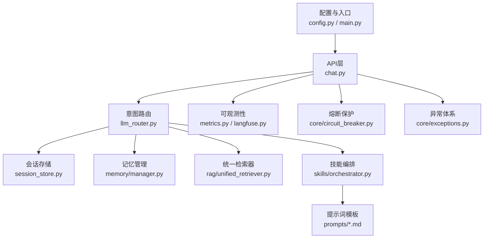
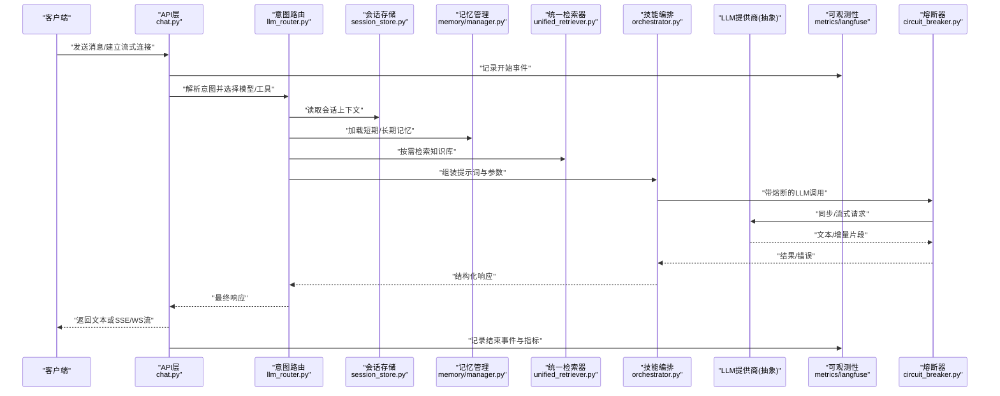
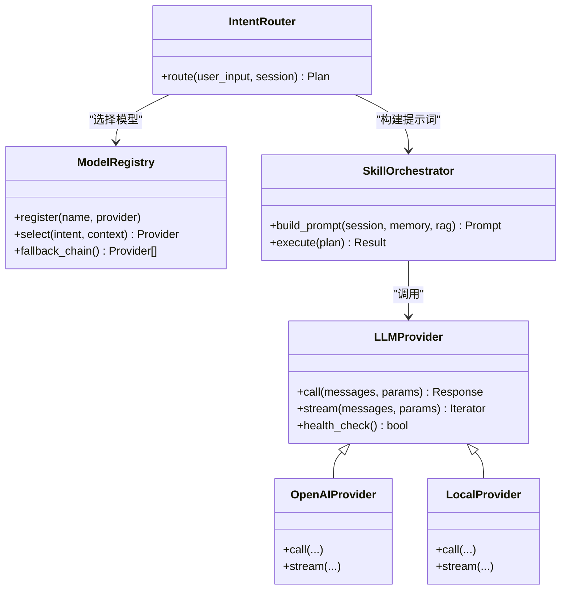
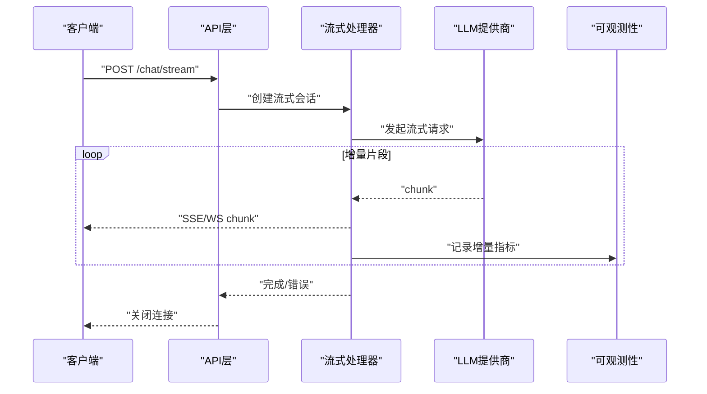
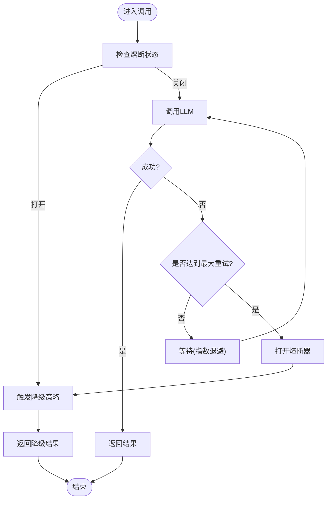
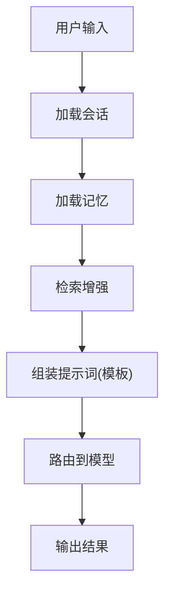
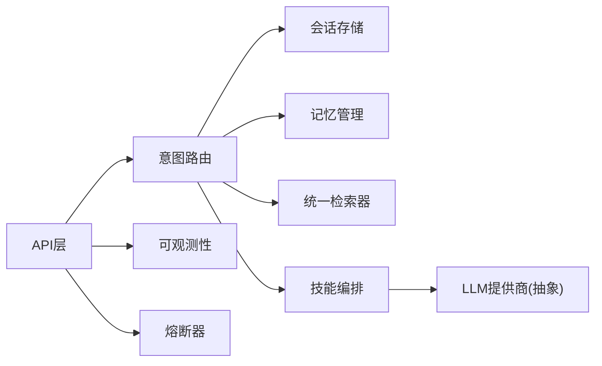

# LLM模型集成

<cite>
**本文引用的文件**   
- [backend_design/nexus/config.py](file://backend_design/nexus/config.py)
- [backend_design/nexus/main.py](file://backend_design/nexus/main.py)
- [backend_design/nexus/core/exceptions.py](file://backend_design/nexus/core/exceptions.py)
- [backend_design/nexus/core/circuit_breaker.py](file://backend_design/nexus/core/circuit_breaker.py)
- [backend_design/nexus/intent/llm_router.py](file://backend_design/nexus/intent/llm_router.py)
- [backend_design/nexus/api/routes/chat.py](file://backend_design/nexus/api/routes/chat.py)
- [backend_design/nexus/middleware/session_store.py](file://backend_design/nexus/middleware/session_store.py)
- [backend_design/nexus/memory/manager.py](file://backend_design/nexus/memory/manager.py)
- [backend_design/nexus/observability/metrics.py](file://backend_design/nexus/observability/metrics.py)
- [backend_design/nexus/observability/langfuse.py](file://backend_design/nexus/observability/langfuse.py)
- [backend_design/nexus/rag/unified_retriever.py](file://backend_design/nexus/rag/unified_retriever.py)
- [backend_design/nexus/skills/orchestrator.py](file://backend_design/nexus/skills/orchestrator.py)
- [backend_design/nexus/prompts/chat.md](file://backend_design/nexus/prompts/chat.md)
- [backend_design/nexus/prompts/clarification.md](file://backend_design/nexus/prompts/clarification.md)
- [backend_design/nexus/prompts/memory_extract.md](file://backend_design/nexus/prompts/memory_extract.md)
- [backend_design/nexus/prompts/vehicle.md](file://backend_design/nexus/prompts/vehicle.md)
- [docs/deployment/LLM_FALLBACK.md](file://docs/deployment/LLM_FALLBACK.md)
- [docs/model-selection-guide.md](file://docs/model-selection-guide.md)
</cite>

## 目录
1. [简介](#简介)
2. [项目结构](#项目结构)
3. [核心组件](#核心组件)
4. [架构总览](#架构总览)
5. [详细组件分析](#详细组件分析)
6. [依赖关系分析](#依赖关系分析)
7. [性能与可观测性](#性能与可观测性)
8. [故障排查指南](#故障排查指南)
9. [结论](#结论)
10. [附录：配置与示例](#附录配置与示例)

## 简介
本文件面向NexusCockpit系统的LLM模型集成，系统性阐述大语言模型的接入架构、抽象接口设计、多模型切换机制、流式响应处理、错误重试与降级策略、上下文与提示词工程、版本管理与热更新、以及性能监控与可观测性。文档同时提供完整的集成示例路径与配置文件说明，帮助开发者快速落地OpenAI API、本地模型部署与自定义提供商的实现。

## 项目结构
与LLM集成相关的代码主要分布在后端Python服务中，围绕“意图路由—会话管理—记忆与RAG—技能编排—可观测性”的链路组织。关键目录与职责如下：
- 配置与入口：系统配置加载、应用启动与生命周期管理
- 意图与路由：根据用户意图选择具体LLM或工具链
- API层：对话接口、WebSocket流式输出
- 中间件：会话存储、限流等
- 记忆与RAG：对话记忆、检索增强生成
- 技能编排：将LLM与车辆控制、健康、导航等能力组合
- 可观测性：指标采集、分布式追踪、Langfuse集成
- 提示词工程：模板化提示词管理

图表来源
- [backend_design/nexus/api/routes/chat.py](file://backend_design/nexus/api/routes/chat.py)
- [backend_design/nexus/intent/llm_router.py](file://backend_design/nexus/intent/llm_router.py)
- [backend_design/nexus/middleware/session_store.py](file://backend_design/nexus/middleware/session_store.py)
- [backend_design/nexus/memory/manager.py](file://backend_design/nexus/memory/manager.py)
- [backend_design/nexus/rag/unified_retriever.py](file://backend_design/nexus/rag/unified_retriever.py)
- [backend_design/nexus/skills/orchestrator.py](file://backend_design/nexus/skills/orchestrator.py)
- [backend_design/nexus/observability/metrics.py](file://backend_design/nexus/observability/metrics.py)
- [backend_design/nexus/observability/langfuse.py](file://backend_design/nexus/observability/langfuse.py)
- [backend_design/nexus/core/circuit_breaker.py](file://backend_design/nexus/core/circuit_breaker.py)
- [backend_design/nexus/core/exceptions.py](file://backend_design/nexus/core/exceptions.py)
- [backend_design/nexus/config.py](file://backend_design/nexus/config.py)
- [backend_design/nexus/main.py](file://backend_design/nexus/main.py)

章节来源
- [backend_design/nexus/config.py](file://backend_design/nexus/config.py)
- [backend_design/nexus/main.py](file://backend_design/nexus/main.py)

## 核心组件
- 配置与入口
  - 负责加载LLM相关配置（如提供商、模型名、超时、并发、重试、熔断阈值等），并在应用启动时初始化全局资源。
- 意图与LLM路由
  - 基于用户输入与上下文，决定调用哪个LLM或工具链；支持多模型切换与回退。
- API层
  - 暴露REST/WebSocket接口，接收消息并返回文本或流式增量。
- 会话与记忆
  - 维护会话状态、历史消息、用户偏好与长期记忆，为提示词注入上下文。
- RAG与检索
  - 通过统一检索器对接向量库/图数据库，增强LLM回答的事实性与时效性。
- 技能编排
  - 将LLM与领域技能（车辆、健康、导航等）组合，形成复杂任务执行流程。
- 可观测性
  - 采集延迟、吞吐、错误率、Token用量等指标，并通过Langfuse进行追踪与采样。
- 熔断与异常
  - 对下游LLM调用进行熔断保护，定义统一的异常类型与错误码。

章节来源
- [backend_design/nexus/config.py](file://backend_design/nexus/config.py)
- [backend_design/nexus/intent/llm_router.py](file://backend_design/nexus/intent/llm_router.py)
- [backend_design/nexus/api/routes/chat.py](file://backend_design/nexus/api/routes/chat.py)
- [backend_design/nexus/middleware/session_store.py](file://backend_design/nexus/middleware/session_store.py)
- [backend_design/nexus/memory/manager.py](file://backend_design/nexus/memory/manager.py)
- [backend_design/nexus/rag/unified_retriever.py](file://backend_design/nexus/rag/unified_retriever.py)
- [backend_design/nexus/skills/orchestrator.py](file://backend_design/nexus/skills/orchestrator.py)
- [backend_design/nexus/observability/metrics.py](file://backend_design/nexus/observability/metrics.py)
- [backend_design/nexus/observability/langfuse.py](file://backend_design/nexus/observability/langfuse.py)
- [backend_design/nexus/core/circuit_breaker.py](file://backend_design/nexus/core/circuit_breaker.py)
- [backend_design/nexus/core/exceptions.py](file://backend_design/nexus/core/exceptions.py)

## 架构总览
下图展示了从请求进入到响应输出的完整链路，包括多模型切换、流式输出、RAG增强、记忆注入、可观测性与熔断保护。

图表来源
- [backend_design/nexus/api/routes/chat.py](file://backend_design/nexus/api/routes/chat.py)
- [backend_design/nexus/intent/llm_router.py](file://backend_design/nexus/intent/llm_router.py)
- [backend_design/nexus/middleware/session_store.py](file://backend_design/nexus/middleware/session_store.py)
- [backend_design/nexus/memory/manager.py](file://backend_design/nexus/memory/manager.py)
- [backend_design/nexus/rag/unified_retriever.py](file://backend_design/nexus/rag/unified_retriever.py)
- [backend_design/nexus/skills/orchestrator.py](file://backend_design/nexus/skills/orchestrator.py)
- [backend_design/nexus/observability/metrics.py](file://backend_design/nexus/observability/metrics.py)
- [backend_design/nexus/observability/langfuse.py](file://backend_design/nexus/observability/langfuse.py)
- [backend_design/nexus/core/circuit_breaker.py](file://backend_design/nexus/core/circuit_breaker.py)

## 详细组件分析

### 组件A：LLM提供商抽象与多模型切换
- 目标
  - 统一不同LLM提供商（如OpenAI、本地推理服务、第三方平台）的调用方式，屏蔽差异。
  - 支持运行时按意图/租户/成本/质量策略动态选择模型。
- 关键设计
  - 抽象接口：定义统一的对话方法、流式迭代方法、错误语义与元数据返回。
  - 多模型注册表：集中管理可用模型、版本、能力标签与权重。
  - 路由策略：基于规则或学习到的策略选择最佳模型，失败时自动降级。
- 实现要点
  - 在意图路由层完成模型选择与参数拼装。
  - 在编排层封装提示词、上下文与RAG结果。
  - 在熔断器内执行调用，确保稳定性。
- 扩展点
  - 新增提供商只需实现抽象接口并注册到路由表。
  - 可通过配置开关启用/禁用某模型或调整优先级。

图表来源
- [backend_design/nexus/intent/llm_router.py](file://backend_design/nexus/intent/llm_router.py)
- [backend_design/nexus/skills/orchestrator.py](file://backend_design/nexus/skills/orchestrator.py)

章节来源
- [backend_design/nexus/intent/llm_router.py](file://backend_design/nexus/intent/llt_router.py)
- [backend_design/nexus/skills/orchestrator.py](file://backend_design/nexus/skills/orchestrator.py)

### 组件B：流式响应与WebSocket/SSE
- 目标
  - 提供低延迟的用户体验，边生成边推送。
- 关键设计
  - API层支持SSE或WebSocket通道，订阅增量片段。
  - 流式迭代器由LLM提供商实现，上游按帧转发。
  - 结合会话与记忆，保证流式过程中的上下文一致性。
- 实现要点
  - 在API层建立长连接，逐块写入响应头与数据体。
  - 在可观测性层记录首字节时间、平均增量间隔、总时长。
  - 在熔断器中支持流式调用的中断与清理。

图表来源
- [backend_design/nexus/api/routes/chat.py](file://backend_design/nexus/api/routes/chat.py)
- [backend_design/nexus/observability/metrics.py](file://backend_design/nexus/observability/metrics.py)

章节来源
- [backend_design/nexus/api/routes/chat.py](file://backend_design/nexus/api/routes/chat.py)
- [backend_design/nexus/observability/metrics.py](file://backend_design/nexus/observability/metrics.py)

### 组件C：错误重试与熔断降级
- 目标
  - 提高可用性，避免雪崩效应。
- 关键设计
  - 指数退避重试：针对瞬时错误（网络抖动、限流）进行有限次重试。
  - 熔断器：当错误率或延迟超过阈值时快速失败，降低下游压力。
  - 降级策略：主模型不可用时切换到备用模型或缓存/规则回复。
- 流程图

图表来源
- [backend_design/nexus/core/circuit_breaker.py](file://backend_design/nexus/core/circuit_breaker.py)
- [docs/deployment/LLM_FALLBACK.md](file://docs/deployment/LLM_FALLBACK.md)

章节来源
- [backend_design/nexus/core/circuit_breaker.py](file://backend_design/nexus/core/circuit_breaker.py)
- [docs/deployment/LLM_FALLBACK.md](file://docs/deployment/LLM_FALLBACK.md)

### 组件D：上下文管理与提示词工程
- 目标
  - 将会话历史、记忆、RAG检索结果与系统指令有机融合，提升回答质量。
- 关键设计
  - 会话存储：持久化每轮对话、用户偏好与设备信息。
  - 记忆管理：短期窗口与长期摘要，支持冲突合并与压缩。
  - 提示词模板：按场景（聊天、澄清、记忆抽取、车辆控制）使用Markdown模板。
- 数据流

图表来源
- [backend_design/nexus/middleware/session_store.py](file://backend_design/nexus/middleware/session_store.py)
- [backend_design/nexus/memory/manager.py](file://backend_design/nexus/memory/manager.py)
- [backend_design/nexus/rag/unified_retriever.py](file://backend_design/nexus/rag/unified_retriever.py)
- [backend_design/nexus/prompts/chat.md](file://backend_design/nexus/prompts/chat.md)
- [backend_design/nexus/prompts/clarification.md](file://backend_design/nexus/prompts/clarification.md)
- [backend_design/nexus/prompts/memory_extract.md](file://backend_design/nexus/prompts/memory_extract.md)
- [backend_design/nexus/prompts/vehicle.md](file://backend_design/nexus/prompts/vehicle.md)

章节来源
- [backend_design/nexus/middleware/session_store.py](file://backend_design/nexus/middleware/session_store.py)
- [backend_design/nexus/memory/manager.py](file://backend_design/nexus/memory/manager.py)
- [backend_design/nexus/rag/unified_retriever.py](file://backend_design/nexus/rag/unified_retriever.py)
- [backend_design/nexus/prompts/chat.md](file://backend_design/nexus/prompts/chat.md)
- [backend_design/nexus/prompts/clarification.md](file://backend_design/nexus/prompts/clarification.md)
- [backend_design/nexus/prompts/memory_extract.md](file://backend_design/nexus/prompts/memory_extract.md)
- [backend_design/nexus/prompts/vehicle.md](file://backend_design/nexus/prompts/vehicle.md)

### 组件E：可观测性与追踪
- 目标
  - 全面度量LLM调用质量与成本，支撑排障与优化。
- 关键设计
  - 指标采集：延迟、吞吐、错误率、Token计数、重试次数、熔断状态。
  - 分布式追踪：以Langfuse为核心，记录端到端Trace与Span。
  - 告警与看板：结合Prometheus/Grafana展示关键指标。
- 典型指标
  - 首字节时间、增量间隔分布、总耗时分位、错误分类占比、模型切换次数。

章节来源
- [backend_design/nexus/observability/metrics.py](file://backend_design/nexus/observability/metrics.py)
- [backend_design/nexus/observability/langfuse.py](file://backend_design/nexus/observability/langfuse.py)

## 依赖关系分析
- 耦合与内聚
  - API层仅依赖路由与可观测性，保持高内聚。
  - 路由层聚合会话、记忆、RAG与编排，承担编排职责。
  - 熔断器作为横切关注点，被API与编排层共同使用。
- 外部依赖
  - LLM提供商SDK（如OpenAI）、向量/图数据库、Redis/内存缓存、日志与追踪系统。
- 潜在循环依赖
  - 通过分层与接口隔离避免循环；若出现，应引入事件总线或回调解耦。

图表来源
- [backend_design/nexus/api/routes/chat.py](file://backend_design/nexus/api/routes/chat.py)
- [backend_design/nexus/intent/llm_router.py](file://backend_design/nexus/intent/llm_router.py)
- [backend_design/nexus/middleware/session_store.py](file://backend_design/nexus/middleware/session_store.py)
- [backend_design/nexus/memory/manager.py](file://backend_design/nexus/memory/manager.py)
- [backend_design/nexus/rag/unified_retriever.py](file://backend_design/nexus/rag/unified_retriever.py)
- [backend_design/nexus/skills/orchestrator.py](file://backend_design/nexus/skills/orchestrator.py)
- [backend_design/nexus/observability/metrics.py](file://backend_design/nexus/observability/metrics.py)
- [backend_design/nexus/core/circuit_breaker.py](file://backend_design/nexus/core/circuit_breaker.py)

章节来源
- [backend_design/nexus/api/routes/chat.py](file://backend_design/nexus/api/routes/chat.py)
- [backend_design/nexus/intent/llm_router.py](file://backend_design/nexus/intent/llm_router.py)
- [backend_design/nexus/core/circuit_breaker.py](file://backend_design/nexus/core/circuit_breaker.py)

## 性能与可观测性
- 性能优化建议
  - 合理设置并发与批大小，避免下游限流。
  - 使用流式输出减少首字节延迟。
  - 对高频查询启用缓存与RAG预取。
  - 控制上下文长度，采用记忆压缩与摘要。
- 可观测性实践
  - 为每次LLM调用记录TraceID，关联日志与指标。
  - 对关键路径埋点：路由决策、提示词构建、RAG检索、模型调用、流式传输。
  - 设定SLO与告警：P95/P99延迟、错误率、降级触发率。

[本节为通用指导，不直接分析具体文件]

## 故障排查指南
- 常见问题
  - 模型不可用：检查熔断器状态与降级策略是否生效。
  - 流式中断：确认网络与代理配置，检查服务端心跳与超时。
  - 上下文过长：评估记忆窗口与RAG召回数量，必要时裁剪。
  - Token超限：拆分请求或使用更短提示词模板。
- 定位步骤
  - 查看Trace与Span，定位慢节点。
  - 核对重试与熔断日志，确认错误分类。
  - 对比不同模型的性能与质量指标，评估切换策略。

章节来源
- [backend_design/nexus/core/exceptions.py](file://backend_design/nexus/core/exceptions.py)
- [backend_design/nexus/core/circuit_breaker.py](file://backend_design/nexus/core/circuit_breaker.py)
- [docs/deployment/LLM_FALLBACK.md](file://docs/deployment/LLM_FALLBACK.md)

## 结论
通过抽象接口、多模型路由、流式传输、熔断降级、记忆与RAG增强、以及完善的可观测性，NexusCockpit实现了稳定、可扩展且可运维的LLM集成方案。该架构既支持云端API，也兼容本地模型部署，便于在不同业务场景下灵活选型与演进。

[本节为总结性内容，不直接分析具体文件]

## 附录：配置与示例

### 配置项说明（示例字段）
- 提供商与模型
  - providers：列表，包含名称、类型、基础URL、鉴权方式、默认模型。
  - models：模型清单，含版本、能力标签、权重、价格系数。
- 调用策略
  - timeout：单次调用超时。
  - max_retries：最大重试次数。
  - retry_backoff：退避策略参数。
  - circuit_breaker：熔断阈值、恢复周期。
- 流式与并发
  - stream_enabled：是否启用流式。
  - concurrency：并发度限制。
- 可观测性
  - metrics_enabled：是否采集指标。
  - tracing_provider：追踪提供者（如Langfuse）。
- 上下文与RAG
  - memory_window：记忆窗口大小。
  - rag_top_k：检索条数。
  - rerank_enabled：是否重排序。

章节来源
- [backend_design/nexus/config.py](file://backend_design/nexus/config.py)

### 集成示例路径
- 自定义LLM提供商实现
  - 参考路径：在意图路由与编排层基础上，新增提供商类并注册至模型注册表。
  - 参考文件：
    - [backend_design/nexus/intent/llm_router.py](file://backend_design/nexus/intent/llm_router.py)
    - [backend_design/nexus/skills/orchestrator.py](file://backend_design/nexus/skills/orchestrator.py)
- 模型参数配置
  - 参考路径：在配置文件中声明providers与models，并在启动时加载。
  - 参考文件：
    - [backend_design/nexus/config.py](file://backend_design/nexus/config.py)
    - [backend_design/nexus/main.py](file://backend_design/nexus/main.py)
- 上下文管理
  - 参考路径：会话存储与记忆管理器协同工作，RAG检索结果注入提示词。
  - 参考文件：
    - [backend_design/nexus/middleware/session_store.py](file://backend_design/nexus/middleware/session_store.py)
    - [backend_design/nexus/memory/manager.py](file://backend_design/nexus/memory/manager.py)
    - [backend_design/nexus/rag/unified_retriever.py](file://backend_design/nexus/rag/unified_retriever.py)
- 提示词工程
  - 参考路径：使用Markdown模板管理不同场景的提示词。
  - 参考文件：
    - [backend_design/nexus/prompts/chat.md](file://backend_design/nexus/prompts/chat.md)
    - [backend_design/nexus/prompts/clarification.md](file://backend_design/nexus/prompts/clarification.md)
    - [backend_design/nexus/prompts/memory_extract.md](file://backend_design/nexus/prompts/memory_extract.md)
    - [backend_design/nexus/prompts/vehicle.md](file://backend_design/nexus/prompts/vehicle.md)
- 流式响应
  - 参考路径：API层建立流式通道，逐块转发LLM增量。
  - 参考文件：
    - [backend_design/nexus/api/routes/chat.py](file://backend_design/nexus/api/routes/chat.py)
- 错误重试与降级
  - 参考路径：熔断器与降级策略文档配合使用。
  - 参考文件：
    - [backend_design/nexus/core/circuit_breaker.py](file://backend_design/nexus/core/circuit_breaker.py)
    - [docs/deployment/LLM_FALLBACK.md](file://docs/deployment/LLM_FALLBACK.md)
- 性能监控与追踪
  - 参考路径：指标采集与Langfuse集成。
  - 参考文件：
    - [backend_design/nexus/observability/metrics.py](file://backend_design/nexus/observability/metrics.py)
    - [backend_design/nexus/observability/langfuse.py](file://backend_design/nexus/observability/langfuse.py)
- 模型选择与版本管理
  - 参考路径：模型选择指南与路由策略。
  - 参考文件：
    - [docs/model-selection-guide.md](file://docs/model-selection-guide.md)
    - [backend_design/nexus/intent/llm_router.py](file://backend_design/nexus/intent/llm_router.py)