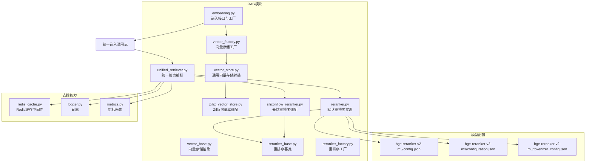
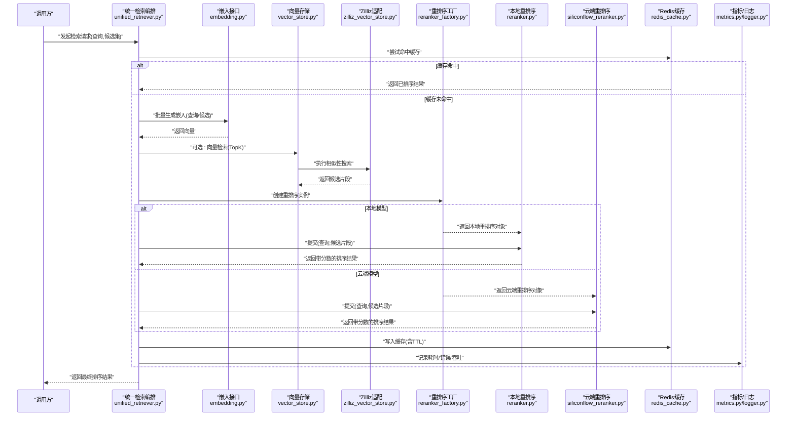
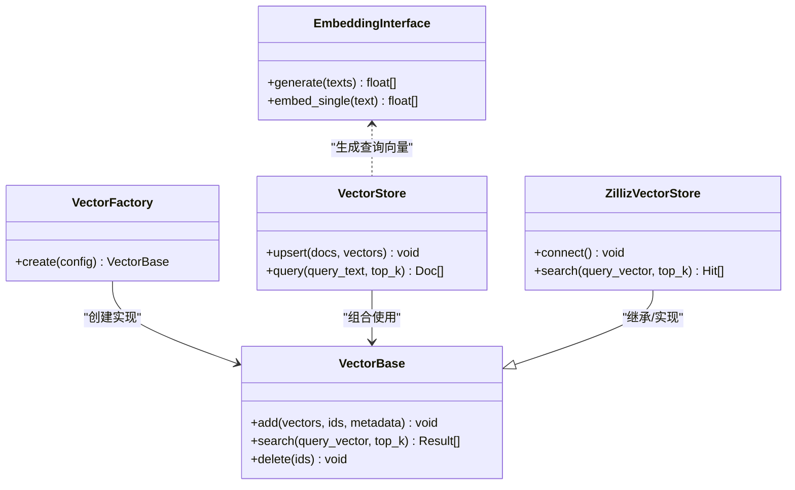
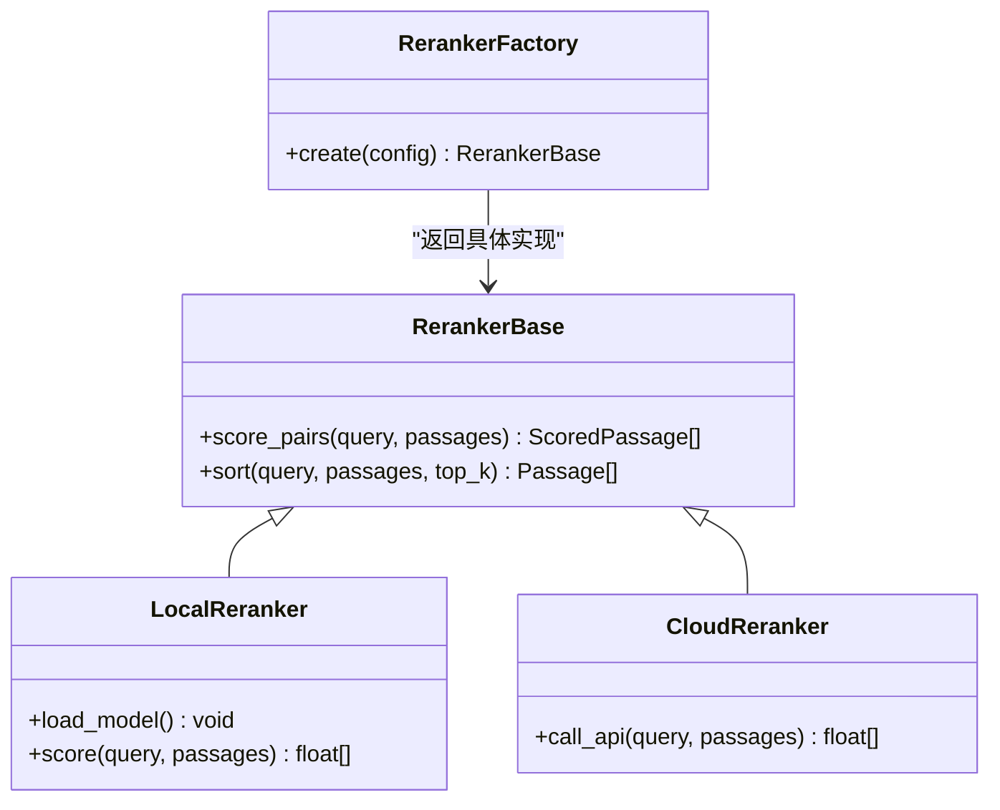
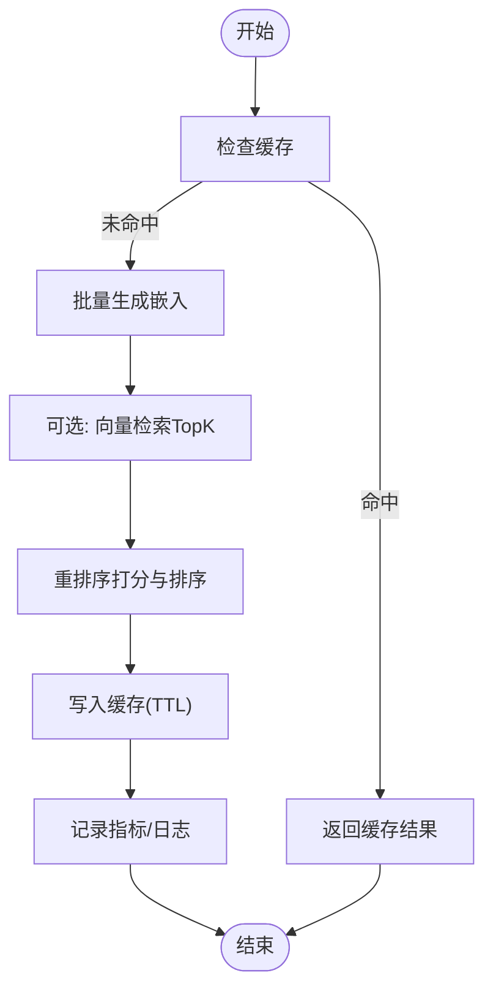
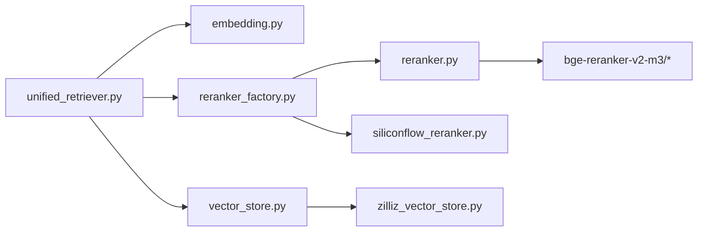

# 嵌入和重排序模型

<cite>
**本文引用的文件**   
- [backend_design/nexus/rag/embedding.py](file://backend_design/nexus/rag/embedding.py)
- [backend_design/nexus/rag/reranker.py](file://backend_design/nexus/rag/reranker.py)
- [backend_design/nexus/rag/reranker_base.py](file://backend_design/nexus/rag/reranker_base.py)
- [backend_design/nexus/rag/reranker_factory.py](file://backend_design/nexus/rag/reranker_factory.py)
- [backend_design/nexus/rag/siliconflow_reranker.py](file://backend_design/nexus/rag/siliconflow_reranker.py)
- [backend_design/nexus/rag/unified_retriever.py](file://backend_design/nexus/rag/unified_retriever.py)
- [backend_design/nexus/rag/vector_base.py](file://backend_design/nexus/rag/vector_base.py)
- [backend_design/nexus/rag/vector_factory.py](file://backend_design/nexus/rag/vector_factory.py)
- [backend_design/nexus/rag/vector_store.py](file://backend_design/nexus/rag/vector_store.py)
- [backend_design/nexus/rag/zilliz_vector_store.py](file://backend_design/nexus/rag/zilliz_vector_store.py)
- [models/reranker/bge-reranker-v2-m3/config.json](file://models/reranker/bge-reranker-v2-m3/config.json)
- [models/reranker/bge-reranker-v2-m3/configuration.json](file://models/reranker/bge-reranker-v2-m3/configuration.json)
- [models/reranker/bge-reranker-v2-m3/tokenizer_config.json](file://models/reranker/bge-reranker-v2-m3/tokenizer_config.json)
- [backend_design/nexus/middleware/redis_cache.py](file://backend_design/nexus/middleware/redis_cache.py)
- [backend_design/nexus/core/logger.py](file://backend_design/nexus/core/logger.py)
- [backend_design/nexus/observability/metrics.py](file://backend_design/nexus/observability/metrics.py)
</cite>

## 目录
1. [简介](#简介)
2. [项目结构](#项目结构)
3. [核心组件](#核心组件)
4. [架构总览](#架构总览)
5. [详细组件分析](#详细组件分析)
6. [依赖关系分析](#依赖关系分析)
7. [性能考量](#性能考量)
8. [故障排查指南](#故障排查指南)
9. [结论](#结论)
10. [附录](#附录)

## 简介
本文件面向NexusCockpit系统的RAG（检索增强生成）链路，聚焦“文本嵌入”与“重排序”两大关键能力：
- 嵌入模型集成：提供向量生成、语义相似度计算、批量嵌入处理等能力，支持多后端与可插拔实现。
- 重排序模型集成：以BGE-Reranker为核心示例，说明部署方式、相关性评分、结果排序与性能调优；同时提供云端API接入的备选方案。
- 运维与治理：涵盖模型版本管理、A/B测试、灰度发布、缓存策略与分布式部署建议。

## 项目结构
与嵌入和重排序相关的代码主要位于 backend_design/nexus/rag 目录，配套本地模型配置位于 models/reranker/bge-reranker-v2-m3。

图表来源
- [backend_design/nexus/rag/embedding.py](file://backend_design/nexus/rag/embedding.py)
- [backend_design/nexus/rag/vector_base.py](file://backend_design/nexus/rag/vector_base.py)
- [backend_design/nexus/rag/vector_factory.py](file://backend_design/nexus/rag/vector_factory.py)
- [backend_design/nexus/rag/vector_store.py](file://backend_design/nexus/rag/vector_store.py)
- [backend_design/nexus/rag/zilliz_vector_store.py](file://backend_design/nexus/rag/zilliz_vector_store.py)
- [backend_design/nexus/rag/reranker_base.py](file://backend_design/nexus/rag/reranker_base.py)
- [backend_design/nexus/rag/reranker_factory.py](file://backend_design/nexus/rag/reranker_factory.py)
- [backend_design/nexus/rag/reranker.py](file://backend_design/nexus/rag/reranker.py)
- [backend_design/nexus/rag/siliconflow_reranker.py](file://backend_design/nexus/rag/siliconflow_reranker.py)
- [backend_design/nexus/rag/unified_retriever.py](file://backend_design/nexus/rag/unified_retriever.py)
- [models/reranker/bge-reranker-v2-m3/config.json](file://models/reranker/bge-reranker-v2-m3/config.json)
- [models/reranker/bge-reranker-v2-m3/configuration.json](file://models/reranker/bge-reranker-v2-m3/configuration.json)
- [models/reranker/bge-reranker-v2-m3/tokenizer_config.json](file://models/reranker/bge-reranker-v2-m3/tokenizer_config.json)
- [backend_design/nexus/middleware/redis_cache.py](file://backend_design/nexus/middleware/redis_cache.py)
- [backend_design/nexus/core/logger.py](file://backend_design/nexus/core/logger.py)
- [backend_design/nexus/observability/metrics.py](file://backend_design/nexus/observability/metrics.py)

章节来源
- [backend_design/nexus/rag/embedding.py](file://backend_design/nexus/rag/embedding.py)
- [backend_design/nexus/rag/reranker.py](file://backend_design/nexus/rag/reranker.py)
- [backend_design/nexus/rag/reranker_base.py](file://backend_design/nexus/rag/reranker_base.py)
- [backend_design/nexus/rag/reranker_factory.py](file://backend_design/nexus/rag/reranker_factory.py)
- [backend_design/nexus/rag/siliconflow_reranker.py](file://backend_design/nexus/rag/siliconflow_reranker.py)
- [backend_design/nexus/rag/unified_retriever.py](file://backend_design/nexus/rag/unified_retriever.py)
- [backend_design/nexus/rag/vector_base.py](file://backend_design/nexus/rag/vector_base.py)
- [backend_design/nexus/rag/vector_factory.py](file://backend_design/nexus/rag/vector_factory.py)
- [backend_design/nexus/rag/vector_store.py](file://backend_design/nexus/rag/vector_store.py)
- [backend_design/nexus/rag/zilliz_vector_store.py](file://backend_design/nexus/rag/zilliz_vector_store.py)
- [models/reranker/bge-reranker-v2-m3/config.json](file://models/reranker/bge-reranker-v2-m3/config.json)
- [models/reranker/bge-reranker-v2-m3/configuration.json](file://models/reranker/bge-reranker-v2-m3/configuration.json)
- [models/reranker/bge-reranker-v2-m3/tokenizer_config.json](file://models/reranker/bge-reranker/v2-m3/tokenizer_config.json)
- [backend_design/nexus/middleware/redis_cache.py](file://backend_design/nexus/middleware/redis_cache.py)
- [backend_design/nexus/core/logger.py](file://backend_design/nexus/core/logger.py)
- [backend_design/nexus/observability/metrics.py](file://backend_design/nexus/observability/metrics.py)

## 核心组件
- 嵌入层
  - embedding.py：定义嵌入模型的统一接口与工厂方法，屏蔽不同后端差异，暴露批量生成与单条生成的能力。
  - vector_base.py / vector_factory.py / vector_store.py / zilliz_vector_store.py：提供向量存储抽象与具体实现，用于持久化与检索向量。
- 重排序层
  - reranker_base.py：定义重排序基类与通用流程（输入校验、评分、排序、截断）。
  - reranker_factory.py：按配置选择本地或云端重排序实现。
  - reranker.py：基于本地BGE-Reranker的实现，加载模型与分词器，进行相关性打分与排序。
  - siliconflow_reranker.py：通过HTTP调用云端重排序服务，适合无GPU环境或弹性扩缩容场景。
- 统一编排
  - unified_retriever.py：串联“召回→嵌入→可选向量检索→重排序→输出”，并提供缓存、指标与日志埋点。

章节来源
- [backend_design/nexus/rag/embedding.py](file://backend_design/nexus/rag/embedding.py)
- [backend_design/nexus/rag/vector_base.py](file://backend_design/nexus/rag/vector_base.py)
- [backend_design/nexus/rag/vector_factory.py](file://backend_design/nexus/rag/vector_factory.py)
- [backend_design/nexus/rag/vector_store.py](file://backend_design/nexus/rag/vector_store.py)
- [backend_design/nexus/rag/zilliz_vector_store.py](file://backend_design/nexus/rag/zilliz_vector_store.py)
- [backend_design/nexus/rag/reranker_base.py](file://backend_design/nexus/rag/reranker_base.py)
- [backend_design/nexus/rag/reranker_factory.py](file://backend_design/nexus/rag/reranker_factory.py)
- [backend_design/nexus/rag/reranker.py](file://backend_design/nexus/rag/reranker.py)
- [backend_design/nexus/rag/siliconflow_reranker.py](file://backend_design/nexus/rag/siliconflow_reranker.py)
- [backend_design/nexus/rag/unified_retriever.py](file://backend_design/nexus/rag/unified_retriever.py)

## 架构总览
下图展示从查询到最终结果的端到端流程，包括嵌入生成、向量检索（可选）、重排序与缓存/观测。

图表来源
- [backend_design/nexus/rag/unified_retriever.py](file://backend_design/nexus/rag/unified_retriever.py)
- [backend_design/nexus/rag/embedding.py](file://backend_design/nexus/rag/embedding.py)
- [backend_design/nexus/rag/vector_store.py](file://backend_design/nexus/rag/vector_store.py)
- [backend_design/nexus/rag/zilliz_vector_store.py](file://backend_design/nexus/rag/zilliz_vector_store.py)
- [backend_design/nexus/rag/reranker_factory.py](file://backend_design/nexus/rag/reranker_factory.py)
- [backend_design/nexus/rag/reranker.py](file://backend_design/nexus/rag/reranker.py)
- [backend_design/nexus/rag/siliconflow_reranker.py](file://backend_design/nexus/rag/siliconflow_reranker.py)
- [backend_design/nexus/middleware/redis_cache.py](file://backend_design/nexus/middleware/redis_cache.py)
- [backend_design/nexus/observability/metrics.py](file://backend_design/nexus/observability/metrics.py)
- [backend_design/nexus/core/logger.py](file://backend_design/nexus/core/logger.py)

## 详细组件分析

### 嵌入模型集成
- 统一接口与工厂
  - embedding.py 提供统一的嵌入接口与工厂方法，屏蔽不同后端差异，支持批量生成与单条生成。
  - 典型用法：通过工厂获取嵌入实例，传入文本列表，得到对应向量矩阵。
- 向量存储与检索
  - vector_base.py 定义向量存储抽象；vector_factory.py 负责根据配置创建具体存储；vector_store.py 提供通用封装；zilliz_vector_store.py 对接Zilliz向量数据库。
  - 支持添加/更新/删除向量、按查询向量进行TopK相似检索。
- 语义相似度计算
  - 在向量空间内使用余弦相似度或内积进行近似最近邻搜索，由底层向量库实现。
- 批量嵌入处理
  - 通过批量接口一次性生成多条文本的向量，减少网络往返与模型预热开销。

图表来源
- [backend_design/nexus/rag/embedding.py](file://backend_design/nexus/rag/embedding.py)
- [backend_design/nexus/rag/vector_base.py](file://backend_design/nexus/rag/vector_base.py)
- [backend_design/nexus/rag/vector_factory.py](file://backend_design/nexus/rag/vector_factory.py)
- [backend_design/nexus/rag/vector_store.py](file://backend_design/nexus/rag/vector_store.py)
- [backend_design/nexus/rag/zilliz_vector_store.py](file://backend_design/nexus/rag/zilliz_vector_store.py)

章节来源
- [backend_design/nexus/rag/embedding.py](file://backend_design/nexus/rag/embedding.py)
- [backend_design/nexus/rag/vector_base.py](file://backend_design/nexus/rag/vector_base.py)
- [backend_design/nexus/rag/vector_factory.py](file://backend_design/nexus/rag/vector_factory.py)
- [backend_design/nexus/rag/vector_store.py](file://backend_design/nexus/rag/vector_store.py)
- [backend_design/nexus/rag/zilliz_vector_store.py](file://backend_design/nexus/rag/zilliz_vector_store.py)

### 重排序模型集成（BGE-Reranker）
- 本地模型部署
  - reranker.py 基于本地BGE-Reranker模型，读取模型配置文件与分词器配置，对候选片段进行相关性打分并排序。
  - 模型配置文件位于 models/reranker/bge-reranker-v2-m3 下，包含config.json、configuration.json、tokenizer_config.json等。
- 云端模型接入
  - siliconflow_reranker.py 通过HTTP调用云端重排序服务，适用于无GPU或需要弹性伸缩的场景。
- 工厂与基类
  - reranker_factory.py 根据配置动态选择本地或云端实现；reranker_base.py 定义统一的重排序接口与通用流程。

图表来源
- [backend_design/nexus/rag/reranker_base.py](file://backend_design/nexus/rag/reranker_base.py)
- [backend_design/nexus/rag/reranker.py](file://backend_design/nexus/rag/reranker.py)
- [backend_design/nexus/rag/siliconflow_reranker.py](file://backend_design/nexus/rag/siliconflow_reranker.py)
- [backend_design/nexus/rag/reranker_factory.py](file://backend_design/nexus/rag/reranker_factory.py)

章节来源
- [backend_design/nexus/rag/reranker_base.py](file://backend_design/nexus/rag/reranker_base.py)
- [backend_design/nexus/rag/reranker.py](file://backend_design/nexus/rag/reranker.py)
- [backend_design/nexus/rag/siliconflow_reranker.py](file://backend_design/nexus/rag/siliconflow_reranker.py)
- [backend_design/nexus/rag/reranker_factory.py](file://backend_design/nexus/rag/reranker_factory.py)
- [models/reranker/bge-reranker-v2-m3/config.json](file://models/reranker/bge-reranker-v2-m3/config.json)
- [models/reranker/bge-reranker-v2-m3/configuration.json](file://models/reranker/bge-reranker-v2-m3/configuration.json)
- [models/reranker/bge-reranker-v2-m3/tokenizer_config.json](file://models/reranker/bge-reranker-v2-m3/tokenizer_config.json)

### 统一检索编排
- unified_retriever.py 将“召回→嵌入→可选向量检索→重排序→输出”串联起来，并内置缓存、指标与日志埋点。
- 典型流程：
  - 先查缓存，命中则直接返回。
  - 未命中则批量生成查询与候选的嵌入向量。
  - 可选地通过向量库做TopK召回。
  - 使用重排序模型对候选进行精细打分与排序。
  - 写回缓存并上报指标。

图表来源
- [backend_design/nexus/rag/unified_retriever.py](file://backend_design/nexus/rag/unified_retriever.py)
- [backend_design/nexus/middleware/redis_cache.py](file://backend_design/nexus/middleware/redis_cache.py)
- [backend_design/nexus/observability/metrics.py](file://backend_design/nexus/observability/metrics.py)
- [backend_design/nexus/core/logger.py](file://backend_design/nexus/core/logger.py)

章节来源
- [backend_design/nexus/rag/unified_retriever.py](file://backend_design/nexus/rag/unified_retriever.py)
- [backend_design/nexus/middleware/redis_cache.py](file://backend_design/nexus/middleware/redis_cache.py)
- [backend_design/nexus/observability/metrics.py](file://backend_design/nexus/observability/metrics.py)
- [backend_design/nexus/core/logger.py](file://backend_design/nexus/core/logger.py)

## 依赖关系分析
- 组件耦合
  - unified_retriever.py 作为编排中心，依赖嵌入、向量存储与重排序三个子系统。
  - reranker_factory.py 与 embedding.py 均遵循“工厂+抽象”模式，降低耦合度，便于替换实现。
- 外部依赖
  - 本地重排序依赖BGE-Reranker模型与分词器配置。
  - 云端重排序依赖HTTP客户端与鉴权配置。
  - 向量存储依赖Zilliz或其他向量数据库。
- 潜在循环依赖
  - 当前设计通过抽象与工厂解耦，未见明显循环依赖。

图表来源
- [backend_design/nexus/rag/unified_retriever.py](file://backend_design/nexus/rag/unified_retriever.py)
- [backend_design/nexus/rag/embedding.py](file://backend_design/nexus/rag/embedding.py)
- [backend_design/nexus/rag/vector_store.py](file://backend_design/nexus/rag/vector_store.py)
- [backend_design/nexus/rag/zilliz_vector_store.py](file://backend_design/nexus/rag/zilliz_vector_store.py)
- [backend_design/nexus/rag/reranker_factory.py](file://backend_design/nexus/rag/reranker_factory.py)
- [backend_design/nexus/rag/reranker.py](file://backend_design/nexus/rag/reranker.py)
- [backend_design/nexus/rag/siliconflow_reranker.py](file://backend_design/nexus/rag/siliconflow_reranker.py)
- [models/reranker/bge-reranker-v2-m3/config.json](file://models/reranker/bge-reranker-v2-m3/config.json)
- [models/reranker/bge-reranker-v2-m3/configuration.json](file://models/reranker/bge-reranker-v2-m3/configuration.json)
- [models/reranker/bge-reranker-v2-m3/tokenizer_config.json](file://models/reranker/bge-reranker/v2-m3/tokenizer_config.json)

章节来源
- [backend_design/nexus/rag/unified_retriever.py](file://backend_design/nexus/rag/unified_retriever.py)
- [backend_design/nexus/rag/embedding.py](file://backend_design/nexus/rag/embedding.py)
- [backend_design/nexus/rag/vector_store.py](file://backend_design/nexus/rag/vector_store.py)
- [backend_design/nexus/rag/zilliz_vector_store.py](file://backend_design/nexus/rag/zilliz_vector_store.py)
- [backend_design/nexus/rag/reranker_factory.py](file://backend_design/nexus/rag/reranker_factory.py)
- [backend_design/nexus/rag/reranker.py](file://backend_design/nexus/rag/reranker.py)
- [backend_design/nexus/rag/siliconflow_reranker.py](file://backend_design/nexus/rag/siliconflow_reranker.py)
- [models/reranker/bge-reranker-v2-m3/config.json](file://models/reranker/bge-reranker-v2-m3/config.json)
- [models/reranker/bge-reranker-v2-m3/configuration.json](file://models/reranker/bge-reranker-v2-m3/configuration.json)
- [models/reranker/bge-reranker-v2-m3/tokenizer_config.json](file://models/reranker/bge-reranker/v2-m3/tokenizer_config.json)

## 性能考量
- 嵌入维度与内存占用
  - 不同嵌入模型维度不同，直接影响向量存储大小与检索延迟。建议在业务需求与资源约束之间权衡，优先选择满足精度要求的最低维度模型。
- 推理速度优化
  - 批量嵌入：尽量合并请求，减少模型加载与上下文切换成本。
  - 本地重排序：启用批处理与量化（若可用），合理设置top_k以减少计算量。
  - 云端重排序：利用连接池与超时控制，避免长尾延迟。
- 缓存策略
  - 对高频查询与稳定文档集合，结合Redis缓存缩短响应时间，注意设置合理的TTL与失效策略。
- 分布式部署
  - 将嵌入与重排序服务水平扩展，配合负载均衡与队列削峰；向量库采用集群模式提升吞吐与可用性。

[本节为通用指导，不直接分析具体文件]

## 故障排查指南
- 常见问题定位
  - 缓存异常：检查Redis连通性与键空间是否被清理；确认TTL设置是否过短。
  - 模型加载失败：核对BGE-Reranker模型路径与配置文件完整性；确认分词器配置一致。
  - 云端调用失败：检查网络可达、鉴权令牌与服务状态；关注重试与熔断策略。
  - 向量检索超时：评估索引规模与查询负载，调整top_k与并发度。
- 观测与日志
  - 使用metrics.py与logger.py记录关键指标（延迟、错误率、吞吐）与结构化日志，便于快速定位问题。

章节来源
- [backend_design/nexus/middleware/redis_cache.py](file://backend_design/nexus/middleware/redis_cache.py)
- [backend_design/nexus/observability/metrics.py](file://backend_design/nexus/observability/metrics.py)
- [backend_design/nexus/core/logger.py](file://backend_design/nexus/core/logger.py)

## 结论
通过统一的嵌入与重排序抽象、工厂模式与统一编排，NexusCockpit实现了灵活可扩展的RAG链路。本地BGE-Reranker与云端重排序并存，满足不同部署场景；结合向量存储与缓存机制，可在保证效果的同时获得良好的性能与稳定性。后续可在模型版本管理、A/B测试与灰度发布方面进一步完善，以提升运维可控性与迭代效率。

[本节为总结性内容，不直接分析具体文件]

## 附录

### 嵌入模型选择策略
- 维度对比
  - 低维模型：内存与带宽占用小，检索更快，但可能牺牲部分精度。
  - 高维模型：精度更高，但资源消耗更大，需评估硬件预算。
- 内存占用分析
  - 估算公式：向量数量 × 维度 × 字节数（如float32=4B）。据此规划向量库容量与节点规格。
- 推理速度优化
  - 批量处理、模型预热、批大小调优、GPU显存限制下的分片推理。

[本节为通用指导，不直接分析具体文件]

### 完整集成示例（步骤指引）
- 自定义嵌入模型接入
  - 在 embedding.py 中新增后端实现，并在工厂中注册。
  - 在 vector_store.py 中完成向量的增删改查与相似检索。
- 批量数据处理
  - 使用批量嵌入接口，结合任务队列与分页处理，避免单次请求过大。
- 缓存策略
  - 在统一检索编排中增加缓存读写逻辑，设置合适的TTL与键命名规范。
- 分布式部署
  - 将嵌入与重排序服务独立部署，使用容器编排与负载均衡；向量库采用集群模式。

[本节为通用指导，不直接分析具体文件]

### 模型版本管理与A/B测试
- 版本管理
  - 通过配置项指定模型版本（如BGE-Reranker v2.x），在启动时加载对应权重与分词器配置。
- A/B测试
  - 在 reranker_factory.py 中按流量比例路由至不同实现（本地v1 vs 云端v2），统计指标对比。
- 灰度发布
  - 逐步放量新版本，结合熔断与回滚策略，确保稳定性。

[本节为通用指导，不直接分析具体文件]