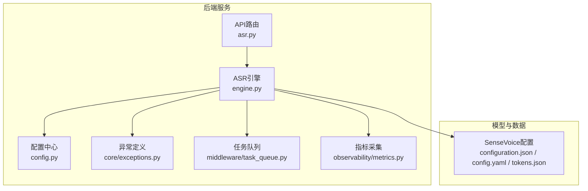
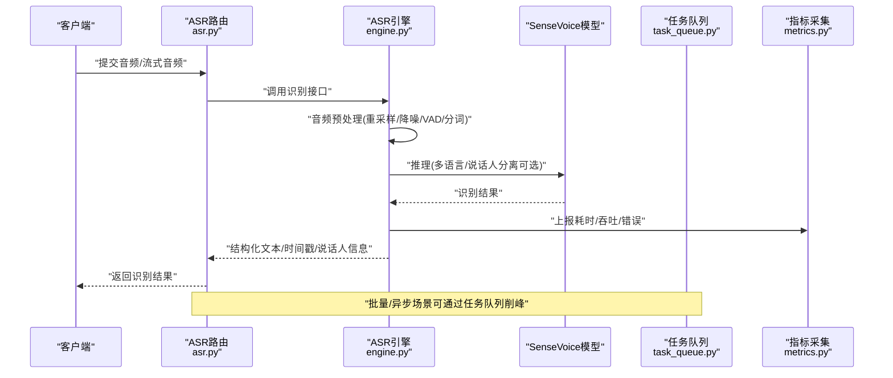
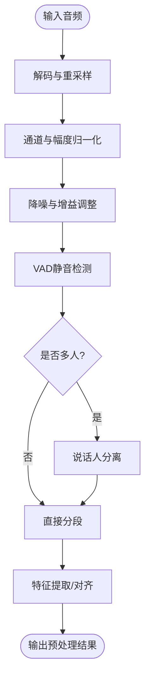
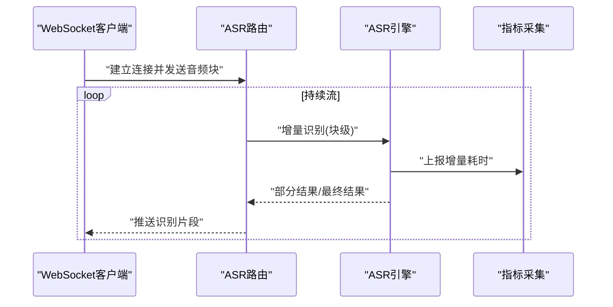
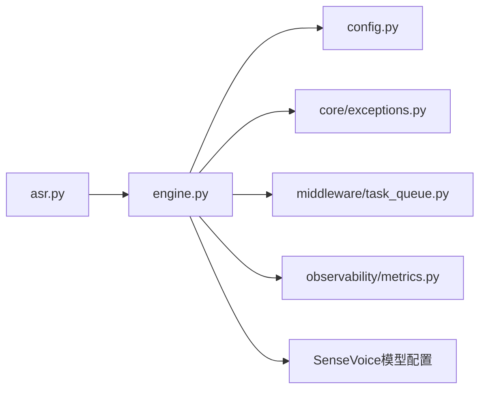

# ASR语音识别模型集成

<cite>
**本文引用的文件**   
- [backend_design/nexus/asr/engine.py](file://backend_design/nexus/asr/engine.py)
- [backend_design/nexus/api/routes/asr.py](file://backend_design/nexus/api/routes/asr.py)
- [backend_design/nexus/config.py](file://backend_design/nexus/config.py)
- [backend_design/nexus/core/exceptions.py](file://backend_design/nexus/core/exceptions.py)
- [backend_design/nexus/middleware/task_queue.py](file://backend_design/nexus/middleware/task_queue.py)
- [backend_design/nexus/observability/metrics.py](file://backend_design/nexus/observability/metrics.py)
- [models/asr/sensevoice/configuration.json](file://models/asr/sensevoice/configuration.json)
- [models/asr/sensevoice/tokens.json](file://models/asr/sensevoice/tokens.json)
- [models/asr/sensevoice/config.yaml](file://models/asr/sensevoice/config.yaml)
- [docs/voice/asr-guide.md](file://docs/voice/asr-guide.md)
- [docs/voice/audio-pipeline-guide.md](file://docs/voice/audio-pipeline-guide.md)
</cite>

## 目录
1. [简介](#简介)
2. [项目结构](#项目结构)
3. [核心组件](#核心组件)
4. [架构总览](#架构总览)
5. [详细组件分析](#详细组件分析)
6. [依赖关系分析](#依赖关系分析)
7. [性能考虑](#性能考虑)
8. [故障排查指南](#故障排查指南)
9. [结论](#结论)
10. [附录](#附录)

## 简介
本文件面向NexusCockpit系统的ASR（自动语音识别）模块，聚焦SenseVoice模型的部署与集成。文档覆盖以下主题：
- SenseVoice模型部署与配置要点
- 音频预处理流程（格式转换、降噪、VAD检测、说话人分离）
- 实时语音识别实现（流式识别、批量处理）
- 多语言支持能力
- ASR引擎API集成示例（含错误重试、监控指标）
- 缓存策略、并发控制与资源管理
- 常见问题排查与性能优化建议

## 项目结构
与ASR相关的后端代码主要位于 backend_design/nexus 下，包含路由层、ASR引擎、配置、异常、任务队列与可观测性模块；模型文件位于 models/asr/sensevoice；相关使用指南位于 docs/voice。

图表来源
- [backend_design/nexus/api/routes/asr.py](file://backend_design/nexus/api/routes/asr.py)
- [backend_design/nexus/asr/engine.py](file://backend_design/nexus/asr/engine.py)
- [backend_design/nexus/config.py](file://backend_design/nexus/config.py)
- [backend_design/nexus/core/exceptions.py](file://backend_design/nexus/core/exceptions.py)
- [backend_design/nexus/middleware/task_queue.py](file://backend_design/nexus/middleware/task_queue.py)
- [backend_design/nexus/observability/metrics.py](file://backend_design/nexus/observability/metrics.py)
- [models/asr/sensevoice/configuration.json](file://models/asr/sensevoice/configuration.json)
- [models/asr/sensevoice/config.yaml](file://models/asr/sensevoice/config.yaml)
- [models/asr/sensevoice/tokens.json](file://models/asr/sensevoice/tokens.json)

章节来源
- [backend_design/nexus/asr/engine.py](file://backend_design/nexus/asr/engine.py)
- [backend_design/nexus/api/routes/asr.py](file://backend_design/nexus/api/routes/asr.py)
- [backend_design/nexus/config.py](file://backend_design/nexus/config.py)
- [backend_design/nexus/core/exceptions.py](file://backend_design/nexus/core/exceptions.py)
- [backend_design/nexus/middleware/task_queue.py](file://backend_design/nexus/middleware/task_queue.py)
- [backend_design/nexus/observability/metrics.py](file://backend_design/nexus/observability/metrics.py)
- [models/asr/sensevoice/configuration.json](file://models/asr/sensevoice/configuration.json)
- [models/asr/sensevoice/config.yaml](file://models/asr/sensevoice/config.yaml)
- [models/asr/sensevoice/tokens.json](file://models/asr/sensevoice/tokens.json)

## 核心组件
- ASR引擎（engine.py）
  - 负责加载SenseVoice模型与配置，提供统一推理接口，封装音频预处理、识别结果后处理、指标上报与异常处理。
- ASR路由（api/routes/asr.py）
  - 暴露HTTP/WebSocket接口，接收音频或流式音频片段，调度引擎进行识别，返回结构化结果。
- 配置（config.py）
  - 集中管理ASR相关参数（如模型路径、采样率、语言、并发度、超时等）。
- 异常（core/exceptions.py）
  - 定义ASR领域异常类型，便于上层统一捕获与降级。
- 任务队列（middleware/task_queue.py）
  - 用于异步批处理与削峰填谷，避免瞬时高并发导致引擎过载。
- 指标（observability/metrics.py）
  - 记录识别耗时、吞吐、错误率等关键指标，支撑监控与告警。

章节来源
- [backend_design/nexus/asr/engine.py](file://backend_design/nexus/asr/engine.py)
- [backend_design/nexus/api/routes/asr.py](file://backend_design/nexus/api/routes/asr.py)
- [backend_design/nexus/config.py](file://backend_design/nexus/config.py)
- [backend_design/nexus/core/exceptions.py](file://backend_design/nexus/core/exceptions.py)
- [backend_design/nexus/middleware/task_queue.py](file://backend_design/nexus/middleware/task_queue.py)
- [backend_design/nexus/observability/metrics.py](file://backend_design/nexus/observability/metrics.py)

## 架构总览
下图展示从客户端到SenseVoice模型的端到端调用链路，包括预处理、识别、后处理与监控。

图表来源
- [backend_design/nexus/api/routes/asr.py](file://backend_design/nexus/api/routes/asr.py)
- [backend_design/nexus/asr/engine.py](file://backend_design/nexus/asr/engine.py)
- [backend_design/nexus/middleware/task_queue.py](file://backend_design/nexus/middleware/task_queue.py)
- [backend_design/nexus/observability/metrics.py](file://backend_design/nexus/observability/metrics.py)
- [models/asr/sensevoice/configuration.json](file://models/asr/sensevoice/configuration.json)
- [models/asr/sensevoice/config.yaml](file://models/asr/sensevoice/config.yaml)
- [models/asr/sensevoice/tokens.json](file://models/asr/sensevoice/tokens.json)

## 详细组件分析

### SenseVoice模型部署与配置
- 配置文件
  - configuration.json：模型运行时配置（设备、精度、线程数等）
  - config.yaml：声学/解码器参数（如语言、词汇表、束宽、静音阈值等）
  - tokens.json：词表与特殊token映射
- 部署要点
  - 将模型目录放置于 models/asr/sensevoice，并在配置中指定路径
  - 根据硬件选择CPU/GPU执行后端，合理设置线程与批大小
  - 初始化时校验tokens.json与config.yaml一致性，避免解码失败

章节来源
- [models/asr/sensevoice/configuration.json](file://models/asr/sensevoice/configuration.json)
- [models/asr/sensevoice/config.yaml](file://models/asr/sensevoice/config.yaml)
- [models/asr/sensevoice/tokens.json](file://models/asr/sensevoice/tokens.json)

### 音频预处理流程
- 格式转换
  - 统一重采样至模型期望采样率（如16kHz），通道数归一化
  - 支持常见容器格式（wav/flac/mp3等）的解码与标准化
- 噪声处理
  - 前端降噪与增益控制，降低环境噪声对识别的影响
- VAD检测
  - 基于能量/谱特征的人声活动检测，剔除静音段，减少无效推理
- 说话人分离
  - 在多人场景下按时间片切分并标注说话人ID，便于后续转写与检索

章节来源
- [docs/voice/audio-pipeline-guide.md](file://docs/voice/audio-pipeline-guide.md)

### 实时语音识别实现
- 流式识别
  - 通过WebSocket或长连接持续推送音频块
  - 引擎维护滑动窗口与增量解码，逐步输出中间结果
- 批量处理
  - 通过任务队列聚合短时音频片段，提升吞吐
- 错误重试
  - 针对网络抖动或临时资源不足，采用指数退避重试
- 性能监控
  - 记录首包延迟、端到端延迟、吞吐、错误率等指标

图表来源
- [backend_design/nexus/api/routes/asr.py](file://backend_design/nexus/api/routes/asr.py)
- [backend_design/nexus/asr/engine.py](file://backend_design/nexus/asr/engine.py)
- [backend_design/nexus/observability/metrics.py](file://backend_design/nexus/observability/metrics.py)

### 多语言支持功能
- 语言选择
  - 通过配置指定目标语言或启用自动语言检测
- 词表适配
  - 依据tokens.json中的多语言词表进行解码
- 语料与提示
  - 结合业务Prompt与领域术语，提高专有名词识别准确率

章节来源
- [models/asr/sensevoice/config.yaml](file://models/asr/sensevoice/config.yaml)
- [models/asr/sensevoice/tokens.json](file://models/asr/sensevoice/tokens.json)
- [docs/voice/asr-guide.md](file://docs/voice/asr-guide.md)

### ASR引擎集成示例（概念说明）
- 同步接口
  - 传入音频文件或字节流，返回文本与元数据（时间戳、说话人、置信度）
- 异步接口
  - 提交任务ID，轮询或回调获取结果
- 重试与熔断
  - 对不可用下游或资源紧张场景进行快速失败与限流
- 监控埋点
  - 在关键路径上报指标，便于可视化与告警

章节来源
- [backend_design/nexus/asr/engine.py](file://backend_design/nexus/asr/engine.py)
- [backend_design/nexus/core/exceptions.py](file://backend_design/nexus/core/exceptions.py)
- [backend_design/nexus/observability/metrics.py](file://backend_design/nexus/observability/metrics.py)

## 依赖关系分析
- 耦合关系
  - 路由层仅负责协议适配与参数校验，核心逻辑集中在引擎
  - 引擎依赖配置、异常、任务队列与指标模块
- 外部依赖
  - SenseVoice模型及其配置文件
  - 音频编解码库（由引擎内部封装）
- 潜在循环依赖
  - 当前分层清晰，未见明显循环导入风险

图表来源
- [backend_design/nexus/api/routes/asr.py](file://backend_design/nexus/api/routes/asr.py)
- [backend_design/nexus/asr/engine.py](file://backend_design/nexus/asr/engine.py)
- [backend_design/nexus/config.py](file://backend_design/nexus/config.py)
- [backend_design/nexus/core/exceptions.py](file://backend_design/nexus/core/exceptions.py)
- [backend_design/nexus/middleware/task_queue.py](file://backend_design/nexus/middleware/task_queue.py)
- [backend_design/nexus/observability/metrics.py](file://backend_design/nexus/observability/metrics.py)
- [models/asr/sensevoice/configuration.json](file://models/asr/sensevoice/configuration.json)
- [models/asr/sensevoice/config.yaml](file://models/asr/sensevoice/config.yaml)
- [models/asr/sensevoice/tokens.json](file://models/asr/sensevoice/tokens.json)

章节来源
- [backend_design/nexus/asr/engine.py](file://backend_design/nexus/asr/engine.py)
- [backend_design/nexus/api/routes/asr.py](file://backend_design/nexus/api/routes/asr.py)
- [backend_design/nexus/config.py](file://backend_design/nexus/config.py)
- [backend_design/nexus/core/exceptions.py](file://backend_design/nexus/core/exceptions.py)
- [backend_design/nexus/middleware/task_queue.py](file://backend_design/nexus/middleware/task_queue.py)
- [backend_design/nexus/observability/metrics.py](file://backend_design/nexus/observability/metrics.py)
- [models/asr/sensevoice/configuration.json](file://models/asr/sensevoice/configuration.json)
- [models/asr/sensevoice/config.yaml](file://models/asr/sensevoice/config.yaml)
- [models/asr/sensevoice/tokens.json](file://models/asr/sensevoice/tokens.json)

## 性能考虑
- 预处理优化
  - 合理设置重采样与降噪参数，避免过度计算
  - 使用VAD裁剪静音段，减少无效推理
- 推理加速
  - 启用批处理与动态批大小，结合GPU内存上限调优
  - 预热模型与缓存常用配置，缩短冷启动时间
- 并发与资源
  - 限制最大并发请求数，防止OOM
  - 为不同租户或业务线分配独立队列与资源池
- 监控与告警
  - 关注P95/P99延迟、吞吐、错误率与资源利用率
  - 设置阈值告警，及时扩容或降级

[本节为通用指导，不直接分析具体文件]

## 故障排查指南
- 常见问题
  - 模型加载失败：检查模型路径、配置文件完整性与权限
  - 音频格式不支持：确认编码器可用并重采样至目标采样率
  - 识别结果为空：检查VAD阈值与降噪强度，必要时放宽条件
  - 多语言识别不准：核对tokens.json与config.yaml的语言设置
  - 流式卡顿：检查网络带宽与客户端推送频率
- 定位方法
  - 查看指标面板（延迟、吞吐、错误率）
  - 开启调试日志，记录预处理与推理阶段的关键状态
  - 复现最小用例，隔离问题域

章节来源
- [backend_design/nexus/core/exceptions.py](file://backend_design/nexus/core/exceptions.py)
- [backend_design/nexus/observability/metrics.py](file://backend_design/nexus/observability/metrics.py)
- [docs/voice/asr-guide.md](file://docs/voice/asr-guide.md)

## 结论
通过将SenseVoice模型与NexusCockpit后端深度集成，系统实现了从音频预处理、实时识别到多语言支持与监控的全链路能力。合理的配置与工程实践（VAD、降噪、任务队列、指标采集）显著提升了稳定性与性能。建议在上线前完成容量规划与压测，并结合业务场景持续优化。

[本节为总结性内容，不直接分析具体文件]

## 附录
- 参考指南
  - ASR使用指南：[docs/voice/asr-guide.md](file://docs/voice/asr-guide.md)
  - 音频处理流水线指南：[docs/voice/audio-pipeline-guide.md](file://docs/voice/audio-pipeline-guide.md)
- 模型配置清单
  - configuration.json、config.yaml、tokens.json 存放于 models/asr/sensevoice

章节来源
- [docs/voice/asr-guide.md](file://docs/voice/asr-guide.md)
- [docs/voice/audio-pipeline-guide.md](file://docs/voice/audio-pipeline-guide.md)
- [models/asr/sensevoice/configuration.json](file://models/asr/sensevoice/configuration.json)
- [models/asr/sensevoice/config.yaml](file://models/asr/sensevoice/config.yaml)
- [models/asr/sensevoice/tokens.json](file://models/asr/sensevoice/tokens.json)