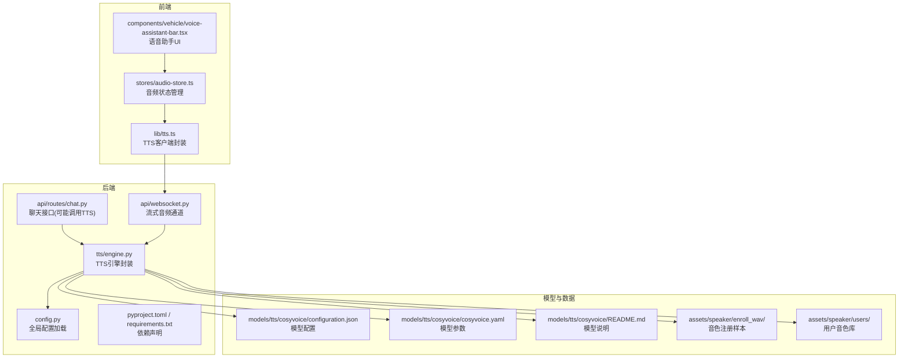
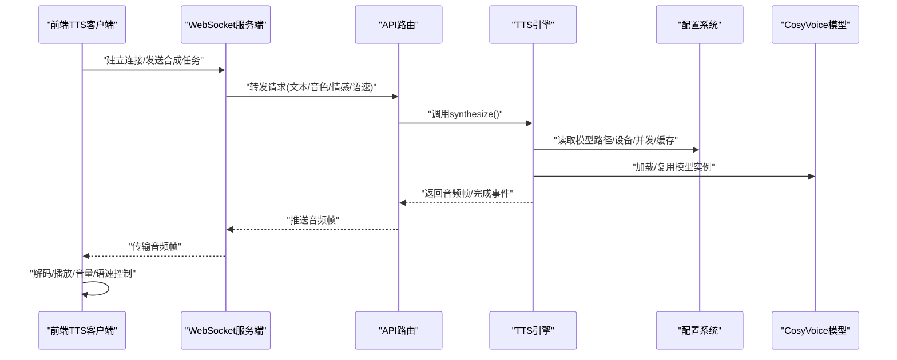
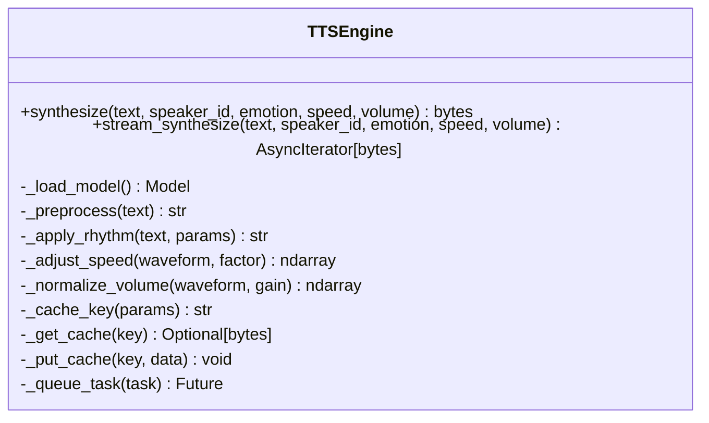
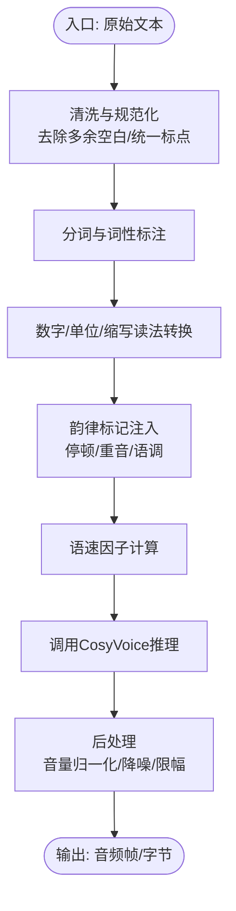
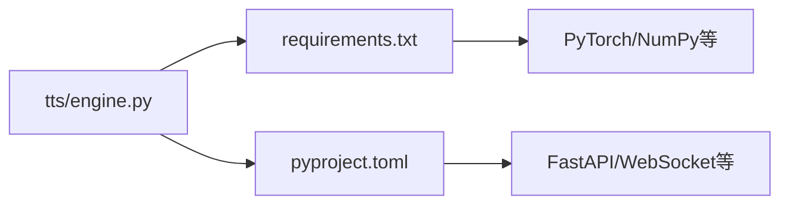

# TTS语音合成模型集成

<cite>
**本文引用的文件**   
- [backend_design/nexus/tts/engine.py](file://backend_design/nexus/tts/engine.py)
- [backend_design/nexus/config.py](file://backend_design/nexus/config.py)
- [backend_design/nexus/api/routes/chat.py](file://backend_design/nexus/api/routes/chat.py)
- [backend_design/nexus/api/websocket.py](file://backend_design/nexus/api/websocket.py)
- [models/tts/cosyvoice/configuration.json](file://models/tts/cosyvoice/configuration.json)
- [models/tts/cosyvoice/cosyvoice.yaml](file://models/tts/cosyvoice/cosyvoice.yaml)
- [models/tts/cosyvoice/README.md](file://models/tts/cosyvoice/README.md)
- [assets/speaker/enroll_wav/README.md](file://assets/speaker/enroll_wav/README.md)
- [assets/speaker/users/cockpit-01/nexus_dev/README.md](file://assets/speaker/users/cockpit-01/nexus_dev/README.md)
- [assets/speaker/users/cockpit-02/nexus_dev/README.md](file://assets/speaker/users/cockpit-02/nexus_dev/README.md)
- [frontend_design/src/lib/tts.ts](file://frontend_design/src/lib/tts.ts)
- [frontend_design/src/stores/audio-store.ts](file://frontend_design/src/stores/audio-store.ts)
- [frontend_design/src/components/vehicle/voice-assistant-bar.tsx](file://frontend_design/src/components/vehicle/voice-assistant-bar.tsx)
- [docs/voice/tts-guide.md](file://docs/voice/tts-guide.md)
- [docs/voice/audio-pipeline-guide.md](file://docs/voice/audio-pipeline-guide.md)
- [backend_design/pyproject.toml](file://backend_design/pyproject.toml)
- [backend_design/requirements.txt](file://backend_design/requirements.txt)
</cite>

## 目录
1. [简介](#简介)
2. [项目结构](#项目结构)
3. [核心组件](#核心组件)
4. [架构总览](#架构总览)
5. [详细组件分析](#详细组件分析)
6. [依赖分析](#依赖分析)
7. [性能考虑](#性能考虑)
8. [故障排查指南](#故障排查指南)
9. [结论](#结论)
10. [附录](#附录)

## 简介
本文件面向NexusCockpit系统的TTS语音合成模块，聚焦CosyVoice模型的部署与集成。文档覆盖以下关键主题：
- CosyVoice模型部署与配置
- 音色控制机制（含用户自注册音色）
- 情感合成算法与参数化表达
- 流式语音输出实现（WebSocket + 前端播放）
- 文本预处理、韵律控制、语速调节、音量管理
- 完整TTS引擎集成示例（多音色切换、情感表达、实时合成、音频后处理）
- 高级特性：缓存策略、批量生成、并发控制、内存管理
- 音质优化与延迟优化最佳实践

## 项目结构
TTS相关代码主要分布在后端Python服务与前端TypeScript客户端中，同时包含CosyVoice模型配置文件与音色资源目录。

图表来源
- [backend_design/nexus/tts/engine.py](file://backend_design/nexus/tts/engine.py)
- [backend_design/nexus/config.py](file://backend_design/nexus/config.py)
- [backend_design/nexus/api/routes/chat.py](file://backend_design/nexus/api/routes/chat.py)
- [backend_design/nexus/api/websocket.py](file://backend_design/nexus/api/websocket.py)
- [models/tts/cosyvoice/configuration.json](file://models/tts/cosyvoice/configuration.json)
- [models/tts/cosyvoice/cosyvoice.yaml](file://models/tts/cosyvoice/cosyvoice.yaml)
- [models/tts/cosyvoice/README.md](file://models/tts/cosyvoice/README.md)
- [assets/speaker/enroll_wav/README.md](file://assets/speaker/enroll_wav/README.md)
- [assets/speaker/users/cockpit-01/nexus_dev/README.md](file://assets/speaker/users/cockpit-01/nexus_dev/README.md)
- [assets/speaker/users/cockpit-02/nexus_dev/README.md](file://assets/speaker/users/cockpit-02/nexus_dev/README.md)
- [frontend_design/src/lib/tts.ts](file://frontend_design/src/lib/tts.ts)
- [frontend_design/src/stores/audio-store.ts](file://frontend_design/src/stores/audio-store.ts)
- [frontend_design/src/components/vehicle/voice-assistant-bar.tsx](file://frontend_design/src/components/vehicle/voice-assistant-bar.tsx)

章节来源
- [backend_design/nexus/tts/engine.py](file://backend_design/nexus/tts/engine.py)
- [backend_design/nexus/config.py](file://backend_design/nexus/config.py)
- [backend_design/nexus/api/routes/chat.py](file://backend_design/nexus/api/routes/chat.py)
- [backend_design/nexus/api/websocket.py](file://backend_design/nexus/api/websocket.py)
- [models/tts/cosyvoice/configuration.json](file://models/tts/cosyvoice/configuration.json)
- [models/tts/cosyvoice/cosyvoice.yaml](file://models/tts/cosyvoice/cosyvoice.yaml)
- [models/tts/cosyvoice/README.md](file://models/tts/cosyvoice/README.md)
- [assets/speaker/enroll_wav/README.md](file://assets/speaker/enroll_wav/README.md)
- [assets/speaker/users/cockpit-01/nexus_dev/README.md](file://assets/speaker/users/cockpit-01/nexus_dev/README.md)
- [assets/speaker/users/cockpit-02/nexus_dev/README.md](file://assets/speaker/users/cockpit-02/nexus_dev/README.md)
- [frontend_design/src/lib/tts.ts](file://frontend_design/src/lib/tts.ts)
- [frontend_design/src/stores/audio-store.ts](file://frontend_design/src/stores/audio-store.ts)
- [frontend_design/src/components/vehicle/voice-assistant-bar.tsx](file://frontend_design/src/components/vehicle/voice-assistant-bar.tsx)

## 核心组件
- TTS引擎封装：提供统一的文本到语音合成接口，支持同步与流式两种模式，内部负责模型加载、推理调度与音频后处理。
- 配置系统：集中管理CosyVoice模型路径、设备选择、并发与缓存等参数。
- API路由：将业务请求（如聊天回复）接入TTS引擎，并返回音频或流式片段。
- WebSocket通道：承载流式音频帧，降低首包延迟，提升交互体验。
- 前端TTS客户端：封装WebSocket连接、音频解码与播放控制，提供音量、语速、音色切换等能力。
- 模型与音色资源：CosyVoice模型配置与用户音色样本，支撑多音色与个性化合成。

章节来源
- [backend_design/nexus/tts/engine.py](file://backend_design/nexus/tts/engine.py)
- [backend_design/nexus/config.py](file://backend_design/nexus/config.py)
- [backend_design/nexus/api/routes/chat.py](file://backend_design/nexus/api/routes/chat.py)
- [backend_design/nexus/api/websocket.py](file://backend_design/nexus/api/websocket.py)
- [frontend_design/src/lib/tts.ts](file://frontend_design/src/lib/tts.ts)
- [frontend_design/src/stores/audio-store.ts](file://frontend_design/src/stores/audio-store.ts)
- [models/tts/cosyvoice/configuration.json](file://models/tts/cosyvoice/configuration.json)
- [models/tts/cosyvoice/cosyvoice.yaml](file://models/tts/cosyvoice/cosyvoice.yaml)
- [models/tts/cosyvoice/README.md](file://models/tts/cosyvoice/README.md)
- [assets/speaker/enroll_wav/README.md](file://assets/speaker/enroll_wav/README.md)
- [assets/speaker/users/cockpit-01/nexus_dev/README.md](file://assets/speaker/users/cockpit-01/nexus_dev/README.md)
- [assets/speaker/users/cockpit-02/nexus_dev/README.md](file://assets/speaker/users/cockpit-02/nexus_dev/README.md)

## 架构总览
整体流程从前端发起合成请求开始，经API路由进入TTS引擎，引擎根据配置加载CosyVoice模型进行推理，并通过WebSocket将音频帧流式推送至前端播放。

图表来源
- [backend_design/nexus/api/websocket.py](file://backend_design/nexus/api/websocket.py)
- [backend_design/nexus/api/routes/chat.py](file://backend_design/nexus/api/routes/chat.py)
- [backend_design/nexus/tts/engine.py](file://backend_design/nexus/tts/engine.py)
- [backend_design/nexus/config.py](file://backend_design/nexus/config.py)
- [models/tts/cosyvoice/configuration.json](file://models/tts/cosyvoice/configuration.json)
- [models/tts/cosyvoice/cosyvoice.yaml](file://models/tts/cosyvoice/cosyvoice.yaml)
- [frontend_design/src/lib/tts.ts](file://frontend_design/src/lib/tts.ts)

## 详细组件分析

### TTS引擎（engine.py）
职责与能力
- 统一接口：提供同步与流式两种合成方法，屏蔽底层模型差异。
- 文本预处理：分词、标点规范化、数字读法转换、特殊符号处理。
- 韵律控制：通过韵律标记或参数影响停顿、重音、语调。
- 语速调节：在推理前后对时长进行缩放，保持自然度。
- 音量管理：对输出波形进行增益控制，避免削波。
- 音色控制：支持内置音色与用户自定义音色（参考enroll_wav与users目录）。
- 情感合成：基于情感标签或连续向量驱动情感强度与风格。
- 流式输出：按chunk返回音频帧，减少首包延迟。
- 缓存策略：对相同文本+音色+参数的结果进行缓存，命中直接返回。
- 并发控制：限制GPU/CPU并发数，避免OOM；队列化任务。
- 内存管理：模型懒加载、显存回收、音频缓冲池。

图表来源
- [backend_design/nexus/tts/engine.py](file://backend_design/nexus/tts/engine.py)

章节来源
- [backend_design/nexus/tts/engine.py](file://backend_design/nexus/tts/engine.py)

### 配置系统（config.py）
职责与能力
- 加载CosyVoice模型路径、设备类型（CPU/GPU）、批大小、最大并发。
- 定义默认音色、默认情感、默认语速与音量范围。
- 暴露缓存开关、缓存容量、过期时间等策略参数。
- 提供运行时热更新能力（可选），便于动态调整。

章节来源
- [backend_design/nexus/config.py](file://backend_design/nexus/config.py)

### API路由（chat.py）
职责与能力
- 接收聊天消息，调用TTS引擎生成语音。
- 支持同步返回音频字节或错误信息。
- 为流式场景预留扩展点（可结合websocket.py）。

章节来源
- [backend_design/nexus/api/routes/chat.py](file://backend_design/nexus/api/routes/chat.py)

### WebSocket通道（websocket.py）
职责与能力
- 维护长连接，处理TTS流式任务。
- 将TTS引擎的音频帧按协议打包下发。
- 支持任务取消、超时与心跳保活。

章节来源
- [backend_design/nexus/api/websocket.py](file://backend_design/nexus/api/websocket.py)

### 前端TTS客户端（tts.ts）
职责与能力
- 建立WebSocket连接，发送合成任务参数（文本、音色、情感、语速、音量）。
- 接收音频帧，解码并送入Web Audio API播放。
- 提供播放控制（暂停/继续/停止）、音量调节、语速映射。
- 错误重试与断线重连。

章节来源
- [frontend_design/src/lib/tts.ts](file://frontend_design/src/lib/tts.ts)

### 音频状态管理（audio-store.ts）
职责与能力
- 集中管理当前播放状态、队列、音量、语速、音色。
- 与TTS客户端协作，保证播放一致性。

章节来源
- [frontend_design/src/stores/audio-store.ts](file://frontend_design/src/stores/audio-store.ts)

### 语音助手UI（voice-assistant-bar.tsx）
职责与能力
- 展示播放进度、控制按钮、音色/情感选择器。
- 触发前端TTS客户端的合成与播放流程。

章节来源
- [frontend_design/src/components/vehicle/voice-assistant-bar.tsx](file://frontend_design/src/components/vehicle/voice-assistant-bar.tsx)

### CosyVoice模型配置（configuration.json / cosyvoice.yaml / README.md）
职责与能力
- configuration.json：模型版本、输入输出格式、采样率、声道数等元数据。
- cosyvoice.yaml：模型超参、训练/推理配置、特征维度等。
- README.md：模型使用说明、注意事项、已知限制。

章节来源
- [models/tts/cosyvoice/configuration.json](file://models/tts/cosyvoice/configuration.json)
- [models/tts/cosyvoice/cosyvoice.yaml](file://models/tts/cosyvoice/cosyvoice.yaml)
- [models/tts/cosyvoice/README.md](file://models/tts/cosyvoice/README.md)

### 音色资源（enroll_wav / users）
职责与能力
- enroll_wav：用于音色注册的样本音频集合。
- users：按租户/用户组织音色库，支持多音色切换与个性化。

章节来源
- [assets/speaker/enroll_wav/README.md](file://assets/speaker/enroll_wav/README.md)
- [assets/speaker/users/cockpit-01/nexus_dev/README.md](file://assets/speaker/users/cockpit-01/nexus_dev/README.md)
- [assets/speaker/users/cockpit-02/nexus_dev/README.md](file://assets/speaker/users/cockpit-02/nexus_dev/README.md)

### 文本预处理与韵律控制流程图

图表来源
- [backend_design/nexus/tts/engine.py](file://backend_design/nexus/tts/engine.py)
- [models/tts/cosyvoice/configuration.json](file://models/tts/cosyvoice/configuration.json)
- [models/tts/cosyvoice/cosyvoice.yaml](file://models/tts/cosyvoice/cosyvoice.yaml)

## 依赖分析
后端依赖由pyproject.toml与requirements.txt声明，确保TTS引擎与CosyVoice运行环境一致。

图表来源
- [backend_design/requirements.txt](file://backend_design/requirements.txt)
- [backend_design/pyproject.toml](file://backend_design/pyproject.toml)
- [backend_design/nexus/tts/engine.py](file://backend_design/nexus/tts/engine.py)

章节来源
- [backend_design/requirements.txt](file://backend_design/requirements.txt)
- [backend_design/pyproject.toml](file://backend_design/pyproject.toml)

## 性能考虑
- 模型加载与复用
  - 启动时按需加载CosyVoice模型，避免重复初始化开销。
  - 使用进程内单例或线程安全池管理模型实例。
- 并发与批处理
  - 设置最大并发数，防止显存溢出。
  - 对短文本进行微批合并，提高吞吐。
- 流式输出
  - 以固定大小的chunk推送音频帧，降低首包延迟。
  - 前端采用环形缓冲与预加载策略，减少卡顿。
- 缓存策略
  - 对“文本+音色+情感+语速”组合生成哈希键，命中直接返回。
  - 设置LRU容量与过期时间，平衡命中率与内存占用。
- 内存管理
  - 及时释放中间张量，启用梯度关闭。
  - 音频缓冲池复用，避免频繁分配。
- 音质与延迟优化
  - 合理设置采样率与比特深度，兼顾质量与带宽。
  - 后处理加入轻量限幅与去噪，避免失真。
  - 端到端监控首包时间与播放延迟，定位瓶颈。

[本节为通用指导，不直接分析具体文件]

## 故障排查指南
常见问题与定位步骤
- 模型加载失败
  - 检查模型路径与配置文件是否匹配。
  - 确认设备类型（CPU/GPU）与可用显存。
- 音色不存在或无效
  - 校验enroll_wav与users目录结构。
  - 确认音色ID与用户上下文一致。
- 流式中断或卡顿
  - 检查WebSocket心跳与超时配置。
  - 观察前端缓冲与解码耗时。
- 并发导致OOM
  - 降低并发上限，增加批处理大小。
  - 监控显存峰值，调整模型精度（如半精度）。
- 音质问题
  - 检查音量归一化阈值与限幅参数。
  - 对比不同采样率与后处理效果。

章节来源
- [backend_design/nexus/tts/engine.py](file://backend_design/nexus/tts/engine.py)
- [backend_design/nexus/config.py](file://backend_design/nexus/config.py)
- [backend_design/nexus/api/websocket.py](file://backend_design/nexus/api/websocket.py)
- [models/tts/cosyvoice/README.md](file://models/tts/cosyvoice/README.md)

## 结论
通过将CosyVoice模型与NexusCockpit系统集成，实现了高质量、低延迟、可控的TTS能力。借助统一的引擎封装、完善的配置体系、流式通道与前端播放控制，系统在多音色、情感表达、语速与音量管理等方面具备良好扩展性与稳定性。配合缓存、并发与内存管理策略，可在生产环境中获得更优的性能与用户体验。

[本节为总结性内容，不直接分析具体文件]

## 附录

### 集成示例清单（路径指引）
- 多音色切换
  - 后端：[backend_design/nexus/tts/engine.py](file://backend_design/nexus/tts/engine.py)
  - 前端：[frontend_design/src/lib/tts.ts](file://frontend_design/src/lib/tts.ts)、[frontend_design/src/stores/audio-store.ts](file://frontend_design/src/stores/audio-store.ts)
- 情感表达
  - 后端：[backend_design/nexus/tts/engine.py](file://backend_design/nexus/tts/engine.py)
  - 模型：[models/tts/cosyvoice/configuration.json](file://models/tts/cosyvoice/configuration.json)、[models/tts/cosyvoice/cosyvoice.yaml](file://models/tts/cosyvoice/cosyvoice.yaml)
- 实时合成（流式）
  - 后端：[backend_design/nexus/api/websocket.py](file://backend_design/nexus/api/websocket.py)
  - 前端：[frontend_design/src/lib/tts.ts](file://frontend_design/src/lib/tts.ts)
- 音频后处理
  - 后端：[backend_design/nexus/tts/engine.py](file://backend_design/nexus/tts/engine.py)
- 音色注册与管理
  - 资源：[assets/speaker/enroll_wav/README.md](file://assets/speaker/enroll_wav/README.md)、[assets/speaker/users/cockpit-01/nexus_dev/README.md](file://assets/speaker/users/cockpit-01/nexus_dev/README.md)、[assets/speaker/users/cockpit-02/nexus_dev/README.md](file://assets/speaker/users/cockpit-02/nexus_dev/README.md)

### 文档与指南
- TTS使用指南：[docs/voice/tts-guide.md](file://docs/voice/tts-guide.md)
- 音频管线指南：[docs/voice/audio-pipeline-guide.md](file://docs/voice/audio-pipeline-guide.md)