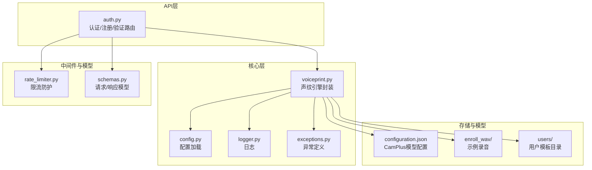
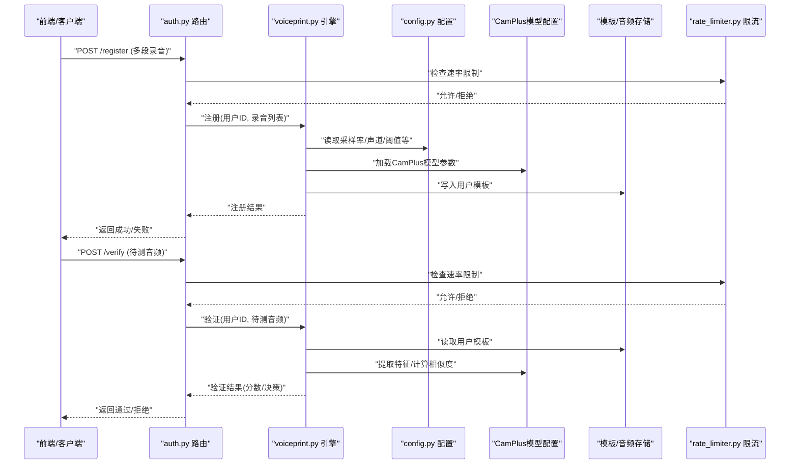
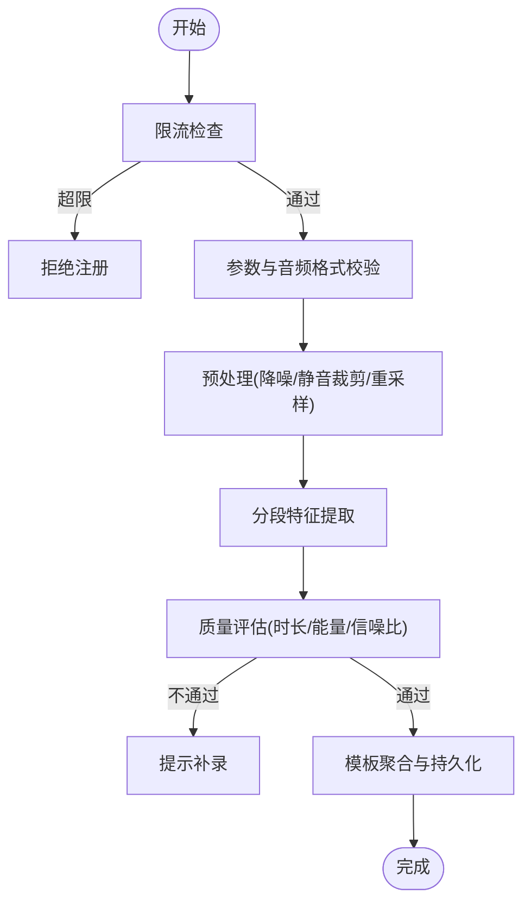
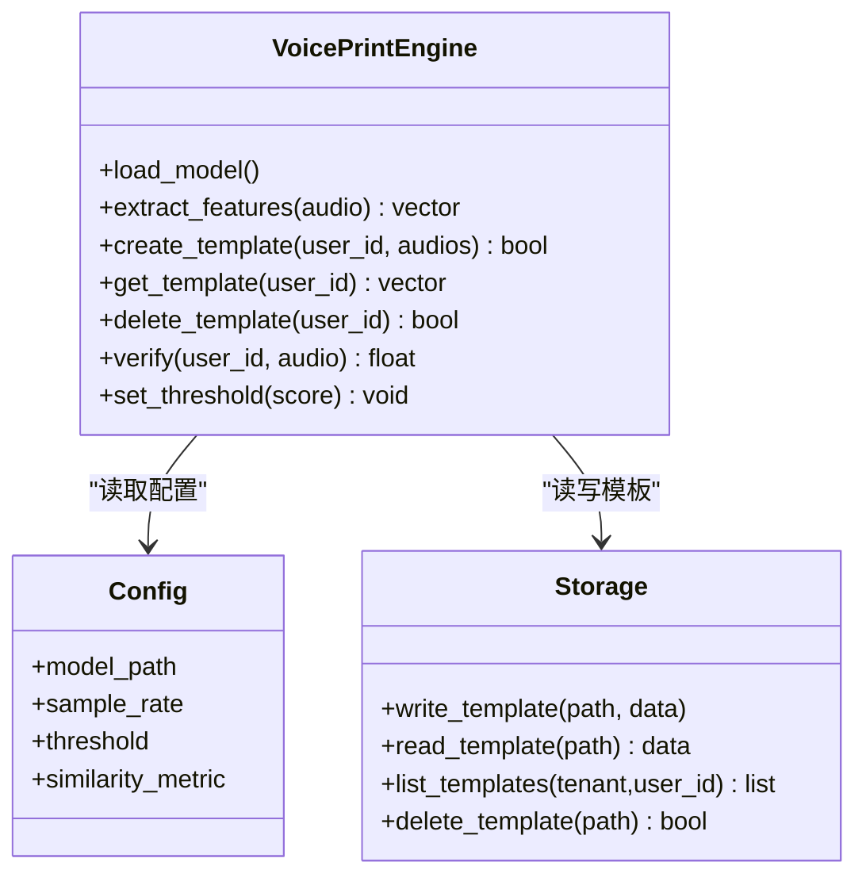
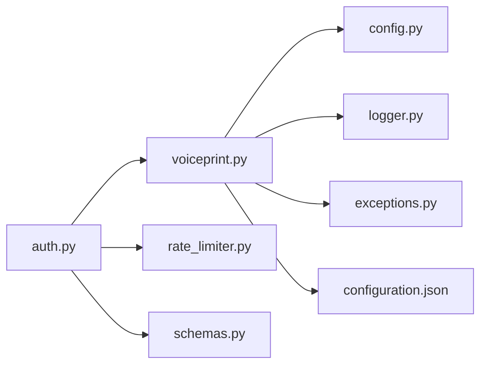

# 声纹识别模型集成

<cite>
**本文引用的文件**   
- [backend_design/nexus/core/voiceprint.py](file://backend_design/nexus/core/voiceprint.py)
- [backend_design/nexus/api/routes/auth.py](file://backend_design/nexus/api/routes/auth.py)
- [backend_design/nexus/config.py](file://backend_design/nexus/config.py)
- [models/sv/cam_plus/configuration.json](file://models/sv/cam_plus/configuration.json)
- [assets/speaker/enroll_wav/README.md](file://assets/speaker/enroll_wav/README.md)
- [assets/speaker/users/cockpit-01/nexus_dev/README.md](file://assets/speaker/users/cockpit-01/nexus_dev/README.md)
- [docs/voice/voiceprint-guide.md](file://docs/voice/voiceprint-guide.md)
- [backend_design/nexus/core/logger.py](file://backend_design/nexus/core/logger.py)
- [backend_design/nexus/core/exceptions.py](file://backend_design/nexus/core/exceptions.py)
- [backend_design/nexus/middleware/rate_limiter.py](file://backend_design/nexus/middleware/rate_limiter.py)
- [backend_design/nexus/models/schemas.py](file://backend_design/nexus/models/schemas.py)
</cite>

## 目录
1. [简介](#简介)
2. [项目结构](#项目结构)
3. [核心组件](#核心组件)
4. [架构总览](#架构总览)
5. [详细组件分析](#详细组件分析)
6. [依赖关系分析](#依赖关系分析)
7. [性能与优化](#性能与优化)
8. [故障排查指南](#故障排查指南)
9. [结论](#结论)
10. [附录](#附录)

## 简介
本文件面向NexusCockpit系统的CamPlus声纹识别模型集成，覆盖部署配置、用户注册流程、特征提取、身份验证算法、模板管理、相似度计算、阈值调优、防攻击机制、质量评估与误识率控制等主题。文档同时提供端到端集成示例（采集、批量注册、实时验证、库管理）以及安全与隐私保护建议，帮助读者快速落地并稳定运行生产级声纹服务。

## 项目结构
与声纹识别相关的代码与资源主要分布在以下位置：
- 后端核心逻辑：backend_design/nexus/core/voiceprint.py
- API路由：backend_design/nexus/api/routes/auth.py
- 配置入口：backend_design/nexus/config.py
- CamPlus模型配置：models/sv/cam_plus/configuration.json
- 示例音频与用户模板目录：assets/speaker/enroll_wav、assets/speaker/users
- 文档说明：docs/voice/voiceprint-guide.md
- 日志与异常：backend_design/nexus/core/logger.py、backend_design/nexus/core/exceptions.py
- 限流中间件：backend_design/nexus/middleware/rate_limiter.py
- 数据模型：backend_design/nexus/models/schemas.py

图表来源
- [backend_design/nexus/api/routes/auth.py](file://backend_design/nexus/api/routes/auth.py)
- [backend_design/nexus/core/voiceprint.py](file://backend_design/nexus/core/voiceprint.py)
- [backend_design/nexus/config.py](file://backend_design/nexus/config.py)
- [backend_design/nexus/core/logger.py](file://backend_design/nexus/core/logger.py)
- [backend_design/nexus/core/exceptions.py](file://backend_design/nexus/core/exceptions.py)
- [models/sv/cam_plus/configuration.json](file://models/sv/cam_plus/configuration.json)
- [assets/speaker/enroll_wav/README.md](file://assets/speaker/enroll_wav/README.md)
- [assets/speaker/users/cockpit-01/nexus_dev/README.md](file://assets/speaker/users/cockpit-01/nexus_dev/README.md)
- [backend_design/nexus/middleware/rate_limiter.py](file://backend_design/nexus/middleware/rate_limiter.py)
- [backend_design/nexus/models/schemas.py](file://backend_design/nexus/models/schemas.py)

章节来源
- [backend_design/nexus/core/voiceprint.py](file://backend_design/nexus/core/voiceprint.py)
- [backend_design/nexus/api/routes/auth.py](file://backend_design/nexus/api/routes/auth.py)
- [backend_design/nexus/config.py](file://backend_design/nexus/config.py)
- [models/sv/cam_plus/configuration.json](file://models/sv/cam_plus/configuration.json)
- [docs/voice/voiceprint-guide.md](file://docs/voice/voiceprint-guide.md)

## 核心组件
- 声纹引擎封装（voiceprint.py）
  - 负责CamPlus模型的加载、初始化、特征提取、模板写入/读取、相似度计算与阈值判定。
  - 对外暴露注册、验证、查询、删除等接口方法，内部统一处理音频预处理、质量控制与错误上报。
- 认证路由（auth.py）
  - 提供REST接口：用户注册（上传多段录音）、声纹验证（上传待测音频）、模板管理（列出/删除）。
  - 与限流中间件配合，防止恶意调用；与日志/异常模块协作，保证可观测性与健壮性。
- 配置（config.py）
  - 集中管理CamPlus模型路径、采样率、声道数、特征维度、相似度度量、阈值、缓存策略等。
- 模型配置（configuration.json）
  - 描述CamPlus模型元信息、输入输出规范、量化/加速参数等。
- 示例数据与模板目录
  - enroll_wav：用于演示的录音样本。
  - users：按租户/用户组织模板文件，便于权限隔离与检索。
- 中间件与模型
  - rate_limiter.py：对注册/验证接口进行速率限制，降低重放与暴力破解风险。
  - schemas.py：定义统一的请求/响应结构，确保前后端契约一致。

章节来源
- [backend_design/nexus/core/voiceprint.py](file://backend_design/nexus/core/voiceprint.py)
- [backend_design/nexus/api/routes/auth.py](file://backend_design/nexus/api/routes/auth.py)
- [backend_design/nexus/config.py](file://backend_design/nexus/config.py)
- [models/sv/cam_plus/configuration.json](file://models/sv/cam_plus/configuration.json)
- [assets/speaker/enroll_wav/README.md](file://assets/speaker/enroll_wav/README.md)
- [assets/speaker/users/cockpit-01/nexus_dev/README.md](file://assets/speaker/users/cockpit-01/nexus_dev/README.md)
- [backend_design/nexus/middleware/rate_limiter.py](file://backend_design/nexus/middleware/rate_limiter.py)
- [backend_design/nexus/models/schemas.py](file://backend_design/nexus/models/schemas.py)

## 架构总览
整体采用“API层 + 核心引擎 + 模型/存储”的分层架构。API层接收前端请求，校验参数并调用核心引擎；核心引擎负责音频预处理、特征提取、模板管理与相似度计算；模型与存储分别由CamPlus配置与本地文件系统承载。

图表来源
- [backend_design/nexus/api/routes/auth.py](file://backend_design/nexus/api/routes/auth.py)
- [backend_design/nexus/core/voiceprint.py](file://backend_design/nexus/core/voiceprint.py)
- [backend_design/nexus/config.py](file://backend_design/nexus/config.py)
- [models/sv/cam_plus/configuration.json](file://models/sv/cam_plus/configuration.json)
- [backend_design/nexus/middleware/rate_limiter.py](file://backend_design/nexus/middleware/rate_limiter.py)

## 详细组件分析

### CamPlus模型部署与配置
- 模型位置与元信息
  - 模型配置文件位于 models/sv/cam_plus/configuration.json，包含模型版本、输入格式、特征维度、量化与加速参数等。
- 运行时配置
  - config.py 中集中管理模型路径、音频采样率、声道数、特征归一化、相似度度量方式、默认阈值、缓存策略等。
- 加载流程
  - 启动时根据配置加载CamPlus模型权重与参数，建立特征提取器与相似度计算器实例。
- 兼容性要求
  - 确保音频输入符合模型期望（采样率、位深、声道），否则在预处理阶段进行重采样与单声道转换。

章节来源
- [models/sv/cam_plus/configuration.json](file://models/sv/cam_plus/configuration.json)
- [backend_design/nexus/config.py](file://backend_design/nexus/config.py)

### 用户注册流程
- 输入要求
  - 至少两段高质量录音（建议不同语句/环境），以增强鲁棒性。
- 处理步骤
  - 参数校验与限流检查 → 音频预处理（降噪/静音裁剪/重采样）→ 分段特征提取 → 模板聚合与持久化 → 返回注册结果。
- 模板组织
  - 模板按用户ID存放于 assets/speaker/users/{tenant}/{user_id}，便于多租户隔离与检索。
- 质量门禁
  - 每段录音需通过质量评估（信噪比、时长、能量分布等），不达标则提示补录。

图表来源
- [backend_design/nexus/api/routes/auth.py](file://backend_design/nexus/api/routes/auth.py)
- [backend_design/nexus/core/voiceprint.py](file://backend_design/nexus/core/voiceprint.py)
- [backend_design/nexus/middleware/rate_limiter.py](file://backend_design/nexus/middleware/rate_limiter.py)
- [assets/speaker/users/cockpit-01/nexus_dev/README.md](file://assets/speaker/users/cockpit-01/nexus_dev/README.md)

章节来源
- [backend_design/nexus/api/routes/auth.py](file://backend_design/nexus/api/routes/auth.py)
- [backend_design/nexus/core/voiceprint.py](file://backend_design/nexus/core/voiceprint.py)
- [backend_design/nexus/middleware/rate_limiter.py](file://backend_design/nexus/middleware/rate_limiter.py)
- [assets/speaker/users/cockpit-01/nexus_dev/README.md](file://assets/speaker/users/cockpit-01/nexus_dev/README.md)

### 声纹特征提取与模板管理
- 特征提取
  - 基于CamPlus模型将音频映射为固定维度的声纹向量；支持分片提取与融合策略，提升稳定性。
- 模板管理
  - 提供创建、更新、删除、查询接口；模板文件命名遵循用户ID与时间戳组合，便于版本回溯。
- 存储策略
  - 本地文件系统为主，可按需扩展至对象存储或数据库；建议开启备份与增量同步。

章节来源
- [backend_design/nexus/core/voiceprint.py](file://backend_design/nexus/core/voiceprint.py)
- [backend_design/nexus/models/schemas.py](file://backend_design/nexus/models/schemas.py)

### 身份验证算法与相似度计算
- 相似度度量
  - 使用余弦相似度或内积距离（依据配置选择），对测试音频特征与用户模板特征进行比较。
- 阈值决策
  - 根据业务场景设定阈值；可通过ROC曲线与EER点分析进行调优。
- 输出结果
  - 返回相似度分数与二元决策（通过/拒绝），并提供置信度与质量评分供上层风控参考。

图表来源
- [backend_design/nexus/core/voiceprint.py](file://backend_design/nexus/core/voiceprint.py)
- [backend_design/nexus/config.py](file://backend_design/nexus/config.py)

章节来源
- [backend_design/nexus/core/voiceprint.py](file://backend_design/nexus/core/voiceprint.py)
- [backend_design/nexus/config.py](file://backend_design/nexus/config.py)

### 阈值调优与误识率控制
- 指标体系
  - FAR（误识率）、FRR（拒识率）、EER（等错误率）、APCER/BPCER（反/正常攻击错误率）。
- 调参方法
  - 基于验证集绘制ROC/DET曲线，选取目标FAR下的最佳阈值；结合质量评分做动态阈值。
- 实践建议
  - 在线A/B测试不同阈值对转化率的影响；对高风险操作提高阈值并引入二次验证。

章节来源
- [docs/voice/voiceprint-guide.md](file://docs/voice/voiceprint-guide.md)
- [backend_design/nexus/core/voiceprint.py](file://backend_design/nexus/core/voiceprint.py)

### 防攻击机制
- 重放检测
  - 通过随机口令/挑战应答、频谱一致性检查、重复片段检测等手段识别重放攻击。
- 活体检测
  - 结合文本无关/相关双通道、唇动/微表情（若可用）或多模态信号增强鲁棒性。
- 速率限制与黑名单
  - 对注册/验证接口实施严格限流；对异常IP/用户加入临时黑名单。
- 审计与告警
  - 记录关键事件（注册、验证失败、阈值变更），触发告警与人工复核。

章节来源
- [backend_design/nexus/middleware/rate_limiter.py](file://backend_design/nexus/middleware/rate_limiter.py)
- [backend_design/nexus/core/logger.py](file://backend_design/nexus/core/logger.py)
- [backend_design/nexus/core/exceptions.py](file://backend_design/nexus/core/exceptions.py)

### 质量评估与入库标准
- 质量维度
  - 时长（≥X秒）、能量分布、信噪比、静音占比、频带完整性。
- 入库规则
  - 多段录音均达标方可入库；不合格录音提示重新录制并给出改进建议。
- 监控与回滚
  - 对入库质量分布进行监控，出现退化趋势时触发回滚与再训练计划。

章节来源
- [assets/speaker/enroll_wav/README.md](file://assets/speaker/enroll_wav/README.md)
- [backend_design/nexus/core/voiceprint.py](file://backend_design/nexus/core/voiceprint.py)

### 集成示例

#### 示例一：用户声纹采集与注册
- 步骤
  - 前端引导用户朗读指定文本或自由说话，采集多段录音。
  - 调用注册接口提交录音列表，服务端执行预处理、质量评估与模板生成。
- 关键点
  - 录音时长与清晰度直接影响模板质量；建议在安静环境下采集。
  - 首次注册建议采集3-5段不同语句以提升鲁棒性。

章节来源
- [backend_design/nexus/api/routes/auth.py](file://backend_design/nexus/api/routes/auth.py)
- [backend_design/nexus/core/voiceprint.py](file://backend_design/nexus/core/voiceprint.py)

#### 示例二：批量注册
- 适用场景
  - 企业/车队预注册用户声纹，导入历史录音。
- 实现要点
  - 分批提交，避免单次过大负载；失败重试与幂等设计；进度回调与错误汇总。
  - 批量任务异步执行，提供任务状态查询与结果下载。

章节来源
- [backend_design/nexus/api/routes/auth.py](file://backend_design/nexus/api/routes/auth.py)
- [backend_design/nexus/core/voiceprint.py](file://backend_design/nexus/core/voiceprint.py)

#### 示例三：实时验证
- 流程
  - 用户发起语音指令，系统先进行声纹验证，通过后执行业务逻辑。
- 优化
  - 短音频快速验证；缓存热门用户模板；失败快速返回以降低延迟。

章节来源
- [backend_design/nexus/api/routes/auth.py](file://backend_design/nexus/api/routes/auth.py)
- [backend_design/nexus/core/voiceprint.py](file://backend_design/nexus/core/voiceprint.py)

#### 示例四：声纹库管理
- 功能
  - 列出某用户所有模板、删除旧模板、合并多源模板、导出/归档。
- 安全
  - 仅授权管理员可操作；操作留痕并可审计。

章节来源
- [backend_design/nexus/api/routes/auth.py](file://backend_design/nexus/api/routes/auth.py)
- [backend_design/nexus/core/voiceprint.py](file://backend_design/nexus/core/voiceprint.py)

## 依赖关系分析
- 组件耦合
  - API层依赖核心引擎与中间件；核心引擎依赖配置、模型与存储；中间件独立作用于API层。
- 外部依赖
  - CamPlus模型配置与权重；可选的对象存储/数据库用于模板持久化。
- 潜在循环依赖
  - 当前分层清晰，未见循环依赖；保持API与引擎解耦，避免直接访问存储。

图表来源
- [backend_design/nexus/api/routes/auth.py](file://backend_design/nexus/api/routes/auth.py)
- [backend_design/nexus/core/voiceprint.py](file://backend_design/nexus/core/voiceprint.py)
- [backend_design/nexus/config.py](file://backend_design/nexus/config.py)
- [backend_design/nexus/core/logger.py](file://backend_design/nexus/core/logger.py)
- [backend_design/nexus/core/exceptions.py](file://backend_design/nexus/core/exceptions.py)
- [models/sv/cam_plus/configuration.json](file://models/sv/cam_plus/configuration.json)
- [backend_design/nexus/middleware/rate_limiter.py](file://backend_design/nexus/middleware/rate_limiter.py)
- [backend_design/nexus/models/schemas.py](file://backend_design/nexus/models/schemas.py)

章节来源
- [backend_design/nexus/api/routes/auth.py](file://backend_design/nexus/api/routes/auth.py)
- [backend_design/nexus/core/voiceprint.py](file://backend_design/nexus/core/voiceprint.py)
- [backend_design/nexus/config.py](file://backend_design/nexus/config.py)
- [backend_design/nexus/middleware/rate_limiter.py](file://backend_design/nexus/middleware/rate_limiter.py)
- [backend_design/nexus/models/schemas.py](file://backend_design/nexus/models/schemas.py)

## 性能与优化
- 模型推理
  - 启用INT8/FP16量化（若模型支持）；批处理特征提取；GPU/CPU亲和设置。
- 缓存策略
  - 热点用户模板内存缓存；TTL与失效策略；跨进程共享缓存（如Redis）。
- I/O优化
  - 模板文件压缩与索引；顺序读取与并行I/O；对象存储分片下载。
- 并发与限流
  - 线程池/协程池控制并发度；接口级限流与熔断降级。
- 监控与追踪
  - 记录P95/P99延迟、QPS、错误率；链路追踪定位瓶颈。

[本节为通用指导，无需特定文件引用]

## 故障排查指南
- 常见问题
  - 模型加载失败：检查模型路径与权限、依赖库版本。
  - 音频格式不符：确认采样率、声道数、位深；必要时自动重采样。
  - 阈值不当导致高误识/拒识：调整阈值并观察EER变化。
  - 限流过严：放宽速率限制或增加白名单。
- 日志与异常
  - 查看结构化日志与异常堆栈，定位具体环节（预处理/提取/相似度/存储）。
- 恢复策略
  - 模板回滚、阈值回退、服务重启与灰度发布。

章节来源
- [backend_design/nexus/core/logger.py](file://backend_design/nexus/core/logger.py)
- [backend_design/nexus/core/exceptions.py](file://backend_design/nexus/core/exceptions.py)
- [backend_design/nexus/middleware/rate_limiter.py](file://backend_design/nexus/middleware/rate_limiter.py)

## 结论
通过分层架构与模块化设计，NexusCockpit将CamPlus声纹识别能力以标准化API形式对外提供服务。借助完善的配置管理、质量评估、阈值调优与防攻击机制，可在保障安全与隐私的前提下实现高可用的声纹识别体验。建议在生产环境中持续监控质量与性能指标，定期评估阈值与模型版本，确保长期稳定与演进。

[本节为总结性内容，无需特定文件引用]

## 附录
- 术语
  - FAR/FRR/EER/APCER/BPCER：声纹识别常用评估指标。
  - 模板：用户声纹特征的持久化表示。
  - 阈值：相似度判定边界，影响通过率与安全性。
- 参考文档
  - docs/voice/voiceprint-guide.md：声纹识别指南与最佳实践。

章节来源
- [docs/voice/voiceprint-guide.md](file://docs/voice/voiceprint-guide.md)