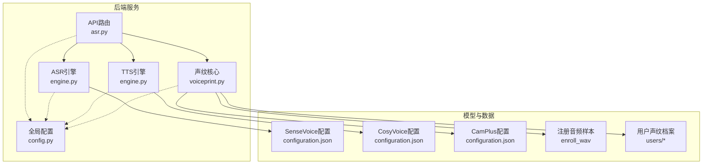
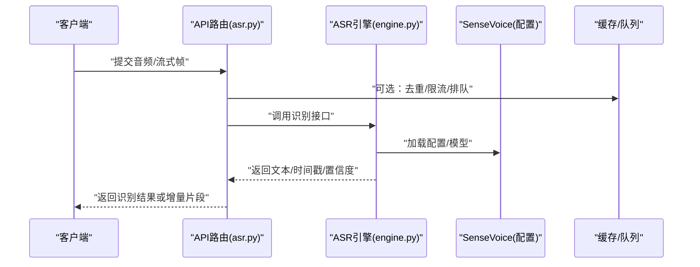
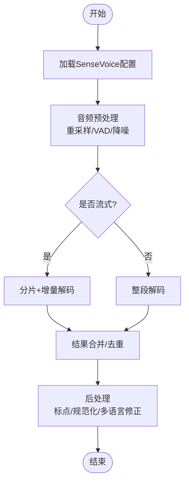
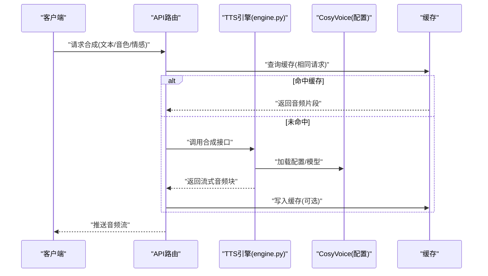
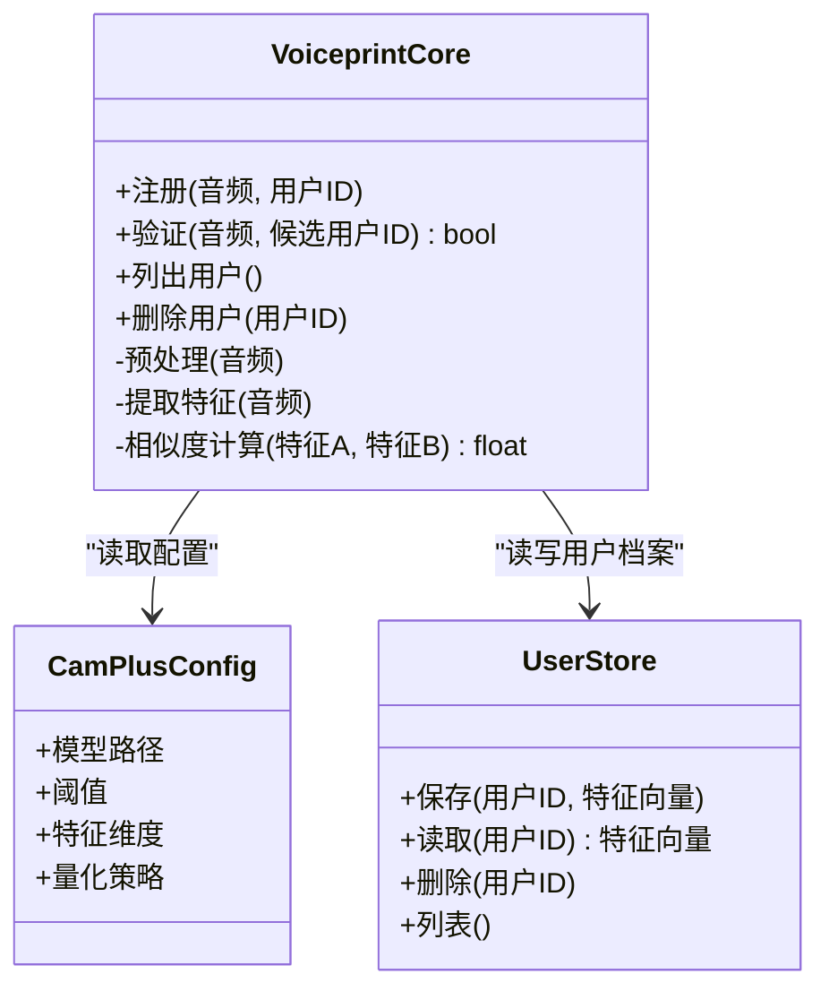
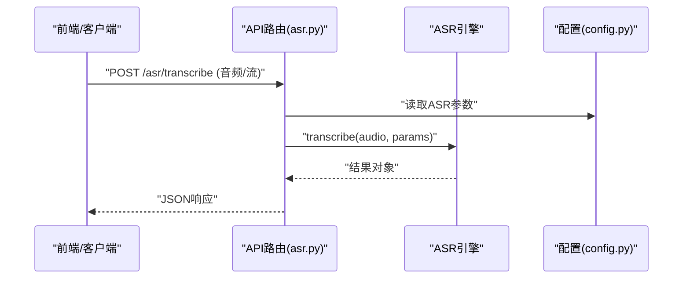
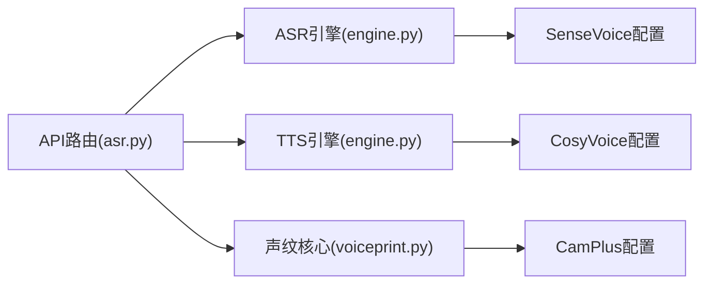

# 语音模型集成

<cite>
**本文引用的文件**   
- [backend_design/nexus/asr/engine.py](file://backend_design/nexus/asr/engine.py)
- [backend_design/nexus/tts/engine.py](file://backend_design/nexus/tts/engine.py)
- [backend_design/nexus/core/voiceprint.py](file://backend_design/nexus/core/voiceprint.py)
- [backend_design/nexus/api/routes/asr.py](file://backend_design/nexus/api/routes/asr.py)
- [backend_design/nexus/config.py](file://backend_design/nexus/config.py)
- [models/asr/sensevoice/configuration.json](file://models/asr/sensevoice/configuration.json)
- [models/tts/cosyvoice/configuration.json](file://models/tts/cosyvoice/configuration.json)
- [models/sv/cam_plus/configuration.json](file://models/sv/cam_plus/configuration.json)
- [assets/speaker/enroll_wav/README.md](file://assets/speaker/enroll_wav/README.md)
- [assets/speaker/users/cockpit-01/nexus_dev/README.md](file://assets/speaker/users/cockpit-01/nexus_dev/README.md)
- [docs/voice/asr-guide.md](file://docs/voice/asr-guide.md)
- [docs/voice/tts-guide.md](file://docs/voice/tts-guide.md)
- [docs/voice/voiceprint-guide.md](file://docs/voice/voiceprint-guide.md)
- [docs/voice/audio-pipeline-guide.md](file://docs/voice/audio-pipeline-guide.md)
</cite>

## 目录
1. [简介](#简介)
2. [项目结构](#项目结构)
3. [核心组件](#核心组件)
4. [架构总览](#架构总览)
5. [详细组件分析](#详细组件分析)
6. [依赖关系分析](#依赖关系分析)
7. [性能与并发](#性能与并发)
8. [故障排查指南](#故障排查指南)
9. [结论](#结论)
10. [附录](#附录)

## 简介
本文件面向NexusCockpit系统的语音能力集成，覆盖ASR（自动语音识别）、TTS（文本转语音）与声纹识别三大模块。重点说明：
- ASR：SenseVoice模型的部署、音频预处理、实时识别与多语言支持
- TTS：CosyVoice模型的配置、音色控制、情感合成与流式输出
- 声纹识别：CamPlus模型的训练、注册、验证与用户管理
并提供完整的集成示例、缓存策略、批量处理与并发控制等高级能力建议。

## 项目结构
与语音模型相关的后端代码主要位于 backend_design/nexus 下，模型权重与配置位于 models 目录，文档位于 docs/voice。

图表来源
- [backend_design/nexus/api/routes/asr.py](file://backend_design/nexus/api/routes/asr.py)
- [backend_design/nexus/asr/engine.py](file://backend_design/nexus/asr/engine.py)
- [backend_design/nexus/tts/engine.py](file://backend_design/nexus/tts/engine.py)
- [backend_design/nexus/core/voiceprint.py](file://backend_design/nexus/core/voiceprint.py)
- [backend_design/nexus/config.py](file://backend_design/nexus/config.py)
- [models/asr/sensevoice/configuration.json](file://models/asr/sensevoice/configuration.json)
- [models/tts/cosyvoice/configuration.json](file://models/tts/cosyvoice/configuration.json)
- [models/sv/cam_plus/configuration.json](file://models/sv/cam_plus/configuration.json)
- [assets/speaker/enroll_wav/README.md](file://assets/speaker/enroll_wav/README.md)
- [assets/speaker/users/cockpit-01/nexus_dev/README.md](file://assets/speaker/users/cockpit-01/nexus_dev/README.md)

章节来源
- [backend_design/nexus/asr/engine.py](file://backend_design/nexus/asr/engine.py)
- [backend_design/nexus/tts/engine.py](file://backend_design/nexus/tts/engine.py)
- [backend_design/nexus/core/voiceprint.py](file://backend_design/nexus/core/voiceprint.py)
- [backend_design/nexus/api/routes/asr.py](file://backend_design/nexus/api/routes/asr.py)
- [backend_design/nexus/config.py](file://backend_design/nexus/config.py)
- [models/asr/sensevoice/configuration.json](file://models/asr/sensevoice/configuration.json)
- [models/tts/cosyvoice/configuration.json](file://models/tts/cosyvoice/configuration.json)
- [models/sv/cam_plus/configuration.json](file://models/sv/cam_plus/configuration.json)
- [assets/speaker/enroll_wav/README.md](file://assets/speaker/enroll_wav/README.md)
- [assets/speaker/users/cockpit-01/nexus_dev/README.md](file://assets/speaker/users/cockpit-01/nexus_dev/README.md)

## 核心组件
- ASR引擎：封装SenseVoice推理流程，提供音频预处理、分片/流式识别、结果拼接与多语言支持。
- TTS引擎：封装CosyVoice推理流程，提供音色选择、情感控制、流式音频输出与缓存。
- 声纹核心：封装CamPlus特征提取、注册、比对与用户管理，提供阈值策略与质量评估。
- API路由：暴露REST/WebSocket接口，统一鉴权、限流、日志与错误码。
- 配置中心：集中管理模型路径、设备、采样率、批大小、超时等参数。

章节来源
- [backend_design/nexus/asr/engine.py](file://backend_design/nexus/asr/engine.py)
- [backend_design/nexus/tts/engine.py](file://backend_design/nexus/tts/engine.py)
- [backend_design/nexus/core/voiceprint.py](file://backend_design/nexus/core/voiceprint.py)
- [backend_design/nexus/api/routes/asr.py](file://backend_design/nexus/api/routes/asr.py)
- [backend_design/nexus/config.py](file://backend_design/nexus/config.py)

## 架构总览
整体采用“API层 + 引擎层 + 模型配置”的分层设计，通过配置驱动加载不同模型与参数，便于扩展新模型与切换后端。

图表来源
- [backend_design/nexus/api/routes/asr.py](file://backend_design/nexus/api/routes/asr.py)
- [backend_design/nexus/asr/engine.py](file://backend_design/nexus/asr/engine.py)
- [models/asr/sensevoice/configuration.json](file://models/asr/sensevoice/configuration.json)

## 详细组件分析

### ASR（SenseVoice）集成
- 部署要点
  - 使用SenseVoice配置文件定义模型路径、语言集、采样率、分词器等关键参数。
  - 根据设备资源调整batch_size、chunk_size、beam_search等推理参数。
- 音频预处理
  - 统一采样率、声道数、位深；静音检测与VAD裁剪；噪声抑制与增益归一化。
- 实时识别
  - 支持流式输入：按固定时长切片，增量解码并合并结果；维护上下文窗口避免重复。
- 多语言支持
  - 依据配置的语言列表进行语种自适应或显式指定；对混合语种场景采用后处理规则。

图表来源
- [backend_design/nexus/asr/engine.py](file://backend_design/nexus/asr/engine.py)
- [models/asr/sensevoice/configuration.json](file://models/asr/sensevoice/configuration.json)

章节来源
- [backend_design/nexus/asr/engine.py](file://backend_design/nexus/asr/engine.py)
- [models/asr/sensevoice/configuration.json](file://models/asr/sensevoice/configuration.json)
- [docs/voice/asr-guide.md](file://docs/voice/asr-guide.md)

### TTS（CosyVoice）集成
- 配置要点
  - 通过CosyVoice配置文件指定模型路径、默认音色、采样率、编码格式、流式块大小等。
- 音色控制
  - 支持多音色切换与风格参数调节；可结合用户偏好持久化。
- 情感合成
  - 通过情感标签或提示词控制语调、语速与能量，适配不同交互场景。
- 流式输出
  - 将长文本切分为句子/短语，逐块生成音频并即时播放，降低首包延迟。

图表来源
- [backend_design/nexus/tts/engine.py](file://backend_design/nexus/tts/engine.py)
- [models/tts/cosyvoice/configuration.json](file://models/tts/cosyvoice/configuration.json)

章节来源
- [backend_design/nexus/tts/engine.py](file://backend_design/nexus/tts/engine.py)
- [models/tts/cosyvoice/configuration.json](file://models/tts/cosyvoice/configuration.json)
- [docs/voice/tts-guide.md](file://docs/voice/tts-guide.md)

### 声纹识别（CamPlus）集成
- 训练与导出
  - 基于CamPlus配置初始化模型与数据集，完成训练与校验，导出特征提取器与分类器。
- 注册流程
  - 采集用户注册音频，执行预处理与特征提取，存储至用户目录，建立索引。
- 验证流程
  - 在线音频经预处理后提取特征，与已注册用户特征库进行相似度计算，判定阈值由配置决定。
- 用户管理
  - 提供用户的增删改查、版本管理与回滚策略，确保审计与一致性。

图表来源
- [backend_design/nexus/core/voiceprint.py](file://backend_design/nexus/core/voiceprint.py)
- [models/sv/cam_plus/configuration.json](file://models/sv/cam_plus/configuration.json)
- [assets/speaker/enroll_wav/README.md](file://assets/speaker/enroll_wav/README.md)
- [assets/speaker/users/cockpit-01/nexus_dev/README.md](file://assets/speaker/users/cockpit-01/nexus_dev/README.md)

章节来源
- [backend_design/nexus/core/voiceprint.py](file://backend_design/nexus/core/voiceprint.py)
- [models/sv/cam_plus/configuration.json](file://models/sv/cam_plus/configuration.json)
- [assets/speaker/enroll_wav/README.md](file://assets/speaker/enroll_wav/README.md)
- [assets/speaker/users/cockpit-01/nexus_dev/README.md](file://assets/speaker/users/cockpit-01/nexus_dev/README.md)
- [docs/voice/voiceprint-guide.md](file://docs/voice/voiceprint-guide.md)

### API与路由（以ASR为例）
- 接口职责
  - 接收音频文件或流式帧，调用ASR引擎，返回文本、时间戳与置信度。
- 中间件
  - 鉴权、限流、日志、错误码标准化。
- WebSocket
  - 支持双向流式传输，适合低延迟实时对话。

图表来源
- [backend_design/nexus/api/routes/asr.py](file://backend_design/nexus/api/routes/asr.py)
- [backend_design/nexus/asr/engine.py](file://backend_design/nexus/asr/engine.py)
- [backend_design/nexus/config.py](file://backend_design/nexus/config.py)

章节来源
- [backend_design/nexus/api/routes/asr.py](file://backend_design/nexus/api/routes/asr.py)
- [backend_design/nexus/config.py](file://backend_design/nexus/config.py)

## 依赖关系分析
- 组件耦合
  - API路由仅依赖引擎抽象与配置，不直接感知模型实现细节，利于替换与扩展。
  - 引擎层依赖各自模型配置，保持高内聚。
- 外部依赖
  - 模型配置文件作为唯一契约，便于容器化与热更新。
  - 文件系统用于存放模型权重与用户数据。

图表来源
- [backend_design/nexus/api/routes/asr.py](file://backend_design/nexus/api/routes/asr.py)
- [backend_design/nexus/asr/engine.py](file://backend_design/nexus/asr/engine.py)
- [backend_design/nexus/tts/engine.py](file://backend_design/nexus/tts/engine.py)
- [backend_design/nexus/core/voiceprint.py](file://backend_design/nexus/core/voiceprint.py)
- [models/asr/sensevoice/configuration.json](file://models/asr/sensevoice/configuration.json)
- [models/tts/cosyvoice/configuration.json](file://models/tts/cosyvoice/configuration.json)
- [models/sv/cam_plus/configuration.json](file://models/sv/cam_plus/configuration.json)

## 性能与并发
- 缓存策略
  - TTS短文本结果缓存，键包含文本、音色、情感与采样率；设置过期时间与容量上限。
  - ASR可考虑短时音频指纹去重，减少重复推理。
- 批量处理
  - ASR/TTS均支持批大小参数，在GPU内存允许范围内提升吞吐。
- 并发控制
  - 使用线程池/进程池隔离不同任务类型；为I/O密集与CPU密集分别调度。
  - 引入令牌桶/滑动窗口限流，保护下游模型服务。
- 流式优化
  - 小粒度音频块（如20-50ms）推进解码；服务端维持滑动上下文窗口，避免重复计算。
- 资源监控
  - 记录QPS、延迟分布、错误率与资源占用，结合告警阈值动态降级。

[本节为通用指导，无需源码引用]

## 故障排查指南
- 常见问题定位
  - 模型加载失败：检查模型路径、权限与配置文件完整性。
  - 音频格式异常：确认采样率、声道数、位深是否符合要求；必要时增加格式转换与校验。
  - 识别/合成超时：调整chunk_size、batch_size与超时阈值；观察GPU/CPU利用率。
  - 声纹误识/拒识：调优阈值、扩充注册样本、检查环境噪声与麦克风质量。
- 日志与指标
  - 统一结构化日志，记录请求ID、耗时、错误码与堆栈摘要。
  - 暴露Prometheus指标，便于可视化与告警。

章节来源
- [backend_design/nexus/asr/engine.py](file://backend_design/nexus/asr/engine.py)
- [backend_design/nexus/tts/engine.py](file://backend_design/nexus/tts/engine.py)
- [backend_design/nexus/core/voiceprint.py](file://backend_design/nexus/core/voiceprint.py)
- [backend_design/nexus/config.py](file://backend_design/nexus/config.py)

## 结论
通过分层架构与配置驱动的模型接入方式，NexusCockpit实现了ASR、TTS与声纹识别的统一集成。借助流式处理、缓存与并发控制，系统在低延迟与高吞吐之间取得平衡。后续可按需扩展更多模型与能力，持续完善观测与稳定性保障。

## 附录
- 参考文档
  - ASR指南：[docs/voice/asr-guide.md](file://docs/voice/asr-guide.md)
  - TTS指南：[docs/voice/tts-guide.md](file://docs/voice/tts-guide.md)
  - 声纹指南：[docs/voice/voiceprint-guide.md](file://docs/voice/voiceprint-guide.md)
  - 音频管线指南：[docs/voice/audio-pipeline-guide.md](file://docs/voice/audio-pipeline-guide.md)