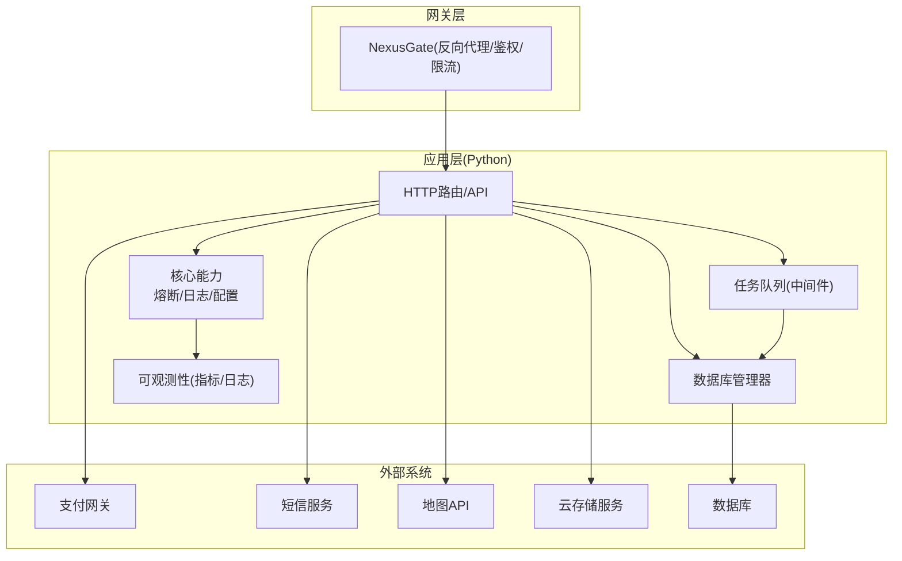
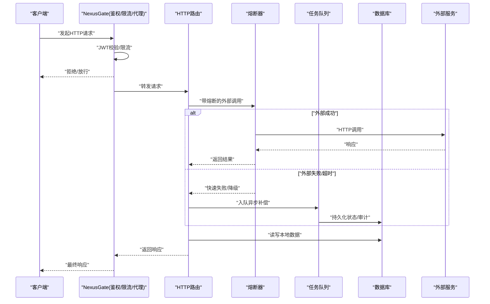
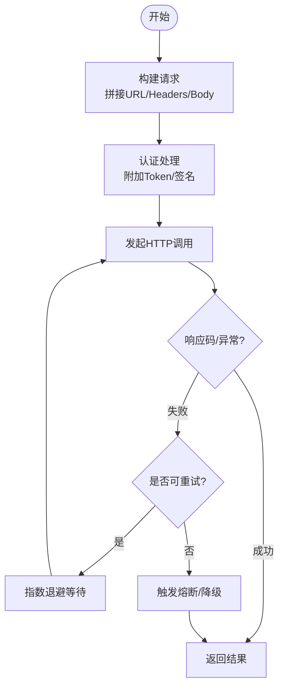
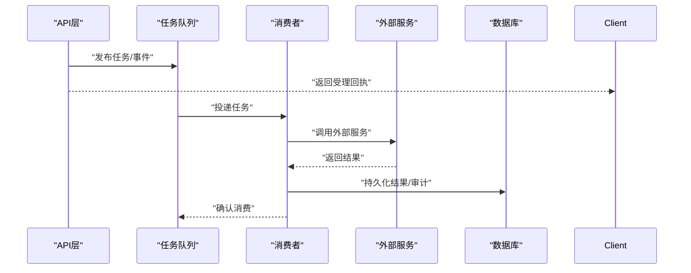
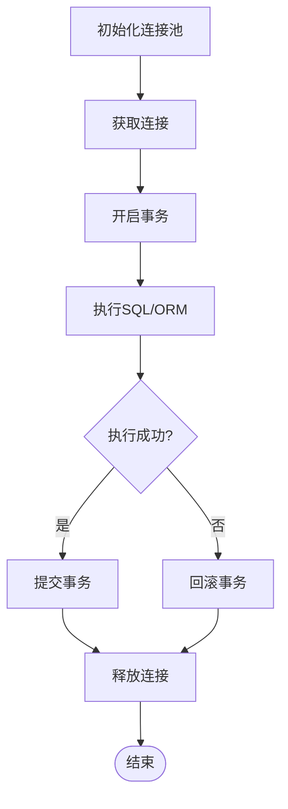
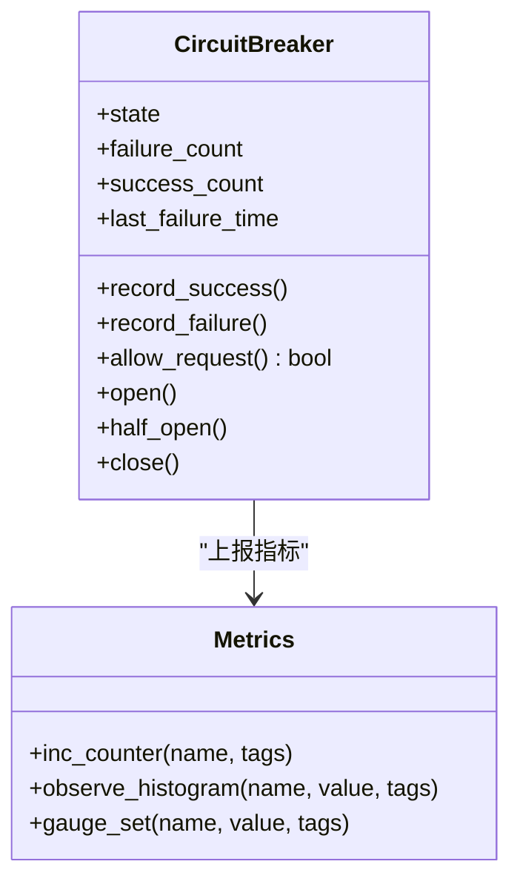
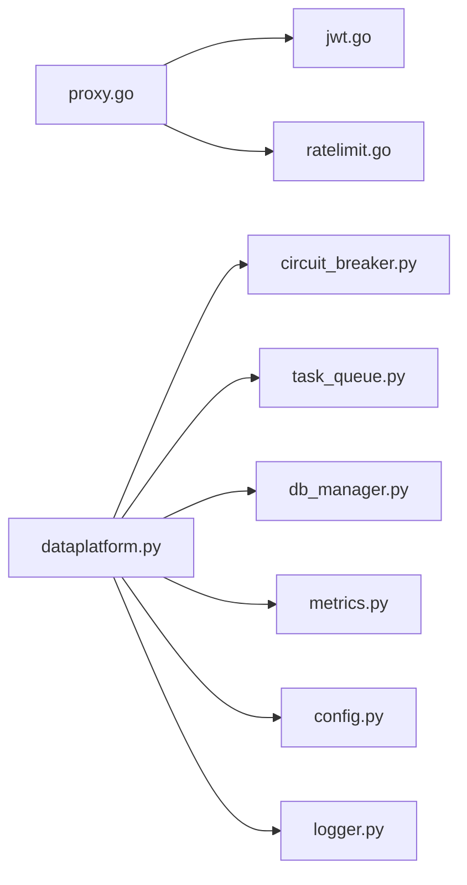

# 第三方系统集成

<cite>
**本文引用的文件**   
- [backend_design/nexus/core/circuit_breaker.py](file://backend_design/nexus/core/circuit_breaker.py)
- [backend_design/nexus/core/db_manager.py](file://backend_design/nexus/core/db_manager.py)
- [backend_design/nexus/middleware/task_queue.py](file://backend_design/nexus/middleware/task_queue.py)
- [backend_design/nexus/vehicle/http.py](file://backend_design/nexus/vehicle/http.py)
- [backend_design/nexus/api/routes/dataplatform.py](file://backend_design/nexus/api/routes/dataplatform.py)
- [backend_design/nexus/config.py](file://backend_design/nexus/config.py)
- [backend_design/nexus/core/logger.py](file://backend_design/nexus/core/logger.py)
- [backend_design/nexus/observability/metrics.py](file://backend_design/nexus/observability/metrics.py)
- [backend_design/nexus_gate/internal/proxy/proxy.go](file://backend_design/nexus_gate/internal/proxy/proxy.go)
- [backend_design/nexus_gate/internal/auth/jwt.go](file://backend_design/nexus_gate/internal/auth/jwt.go)
- [backend_design/nexus_gate/internal/ratelimit/ratelimit.go](file://backend_design/nexus_gate/internal/ratelimit/ratelimit.go)
- [backend_design/scripts/v2.1_migration.sql](file://backend_design/scripts/v2.1_migration.sql)
</cite>

## 目录
1. [简介](#简介)
2. [项目结构](#项目结构)
3. [核心组件](#核心组件)
4. [架构总览](#架构总览)
5. [详细组件分析](#详细组件分析)
6. [依赖关系分析](#依赖关系分析)
7. [性能考虑](#性能考虑)
8. [故障排查指南](#故障排查指南)
9. [结论](#结论)
10. [附录](#附录)

## 简介
本指南面向需要与本项目进行第三方系统集成的开发者，围绕以下主题提供可落地的实践建议：
- HTTP API对接：请求构建、认证处理、错误重试、超时控制
- 消息队列集成：异步任务处理、事件驱动架构、消息格式定义
- 数据库连接最佳实践：连接池管理、事务处理、数据迁移
- 外部服务容错：熔断器模式、降级策略、监控告警
- 典型集成示例：支付网关、短信服务、地图API、云存储（以接口与流程说明为主）
- 安全考量：密钥管理、数据加密、访问控制
- 性能优化：连接复用、批量处理、缓存策略

## 项目结构
本项目采用前后端分离与多语言微服务组合的架构。后端Python服务负责业务编排、外部服务调用、中间件能力；Go侧网关负责鉴权、限流、反向代理等通用能力。

图表来源
- [backend_design/nexus_gate/internal/proxy/proxy.go](file://backend_design/nexus_gate/internal/proxy/proxy.go)
- [backend_design/nexus_gate/internal/auth/jwt.go](file://backend_design/nexus_gate/internal/auth/jwt.go)
- [backend_design/nexus_gate/internal/ratelimit/ratelimit.go](file://backend_design/nexus_gate/internal/ratelimit/ratelimit.go)
- [backend_design/nexus/api/routes/dataplatform.py](file://backend_design/nexus/api/routes/dataplatform.py)
- [backend_design/nexus/core/circuit_breaker.py](file://backend_design/nexus/core/circuit_breaker.py)
- [backend_design/nexus/middleware/task_queue.py](file://backend_design/nexus/middleware/task_queue.py)
- [backend_design/nexus/core/db_manager.py](file://backend_design/nexus/core/db_manager.py)
- [backend_design/nexus/observability/metrics.py](file://backend_design/nexus/observability/metrics.py)

章节来源
- [backend_design/nexus/api/routes/dataplatform.py](file://backend_design/nexus/api/routes/dataplatform.py)
- [backend_design/nexus/core/circuit_breaker.py](file://backend_design/nexus/core/circuit_breaker.py)
- [backend_design/nexus/middleware/task_queue.py](file://backend_design/nexus/middleware/task_queue.py)
- [backend_design/nexus/core/db_manager.py](file://backend_design/nexus/core/db_manager.py)
- [backend_design/nexus/observability/metrics.py](file://backend_design/nexus/observability/metrics.py)
- [backend_design/nexus_gate/internal/proxy/proxy.go](file://backend_design/nexus_gate/internal/proxy/proxy.go)
- [backend_design/nexus_gate/internal/auth/jwt.go](file://backend_design/nexus_gate/internal/auth/jwt.go)
- [backend_design/nexus_gate/internal/ratelimit/ratelimit.go](file://backend_design/nexus_gate/internal/ratelimit/ratelimit.go)

## 核心组件
- 熔断器：对外部HTTP调用的失败率与延迟进行统计，达到阈值后快速失败，避免雪崩。
- 任务队列：将耗时或不可靠的外部调用异步化，提升吞吐与用户体验。
- 数据库管理器：封装连接池、事务、迁移脚本执行等能力。
- 网关鉴权与限流：统一JWT校验、令牌签发/验证、速率限制。
- 可观测性：指标采集与结构化日志，支撑告警与排障。

章节来源
- [backend_design/nexus/core/circuit_breaker.py](file://backend_design/nexus/core/circuit_breaker.py)
- [backend_design/nexus/middleware/task_queue.py](file://backend_design/nexus/middleware/task_queue.py)
- [backend_design/nexus/core/db_manager.py](file://backend_design/nexus/core/db_manager.py)
- [backend_design/nexus_gate/internal/auth/jwt.go](file://backend_design/nexus_gate/internal/auth/jwt.go)
- [backend_design/nexus_gate/internal/ratelimit/ratelimit.go](file://backend_design/nexus_gate/internal/ratelimit/ratelimit.go)
- [backend_design/nexus/observability/metrics.py](file://backend_design/nexus/observability/metrics.py)

## 架构总览
下图展示从网关到业务服务再到外部系统的整体调用链，以及关键横切能力（鉴权、限流、熔断、异步、可观测性）的接入点。

图表来源
- [backend_design/nexus_gate/internal/proxy/proxy.go](file://backend_design/nexus_gate/internal/proxy/proxy.go)
- [backend_design/nexus_gate/internal/auth/jwt.go](file://backend_design/nexus_gate/internal/auth/jwt.go)
- [backend_design/nexus_gate/internal/ratelimit/ratelimit.go](file://backend_design/nexus_gate/internal/ratelimit/ratelimit.go)
- [backend_design/nexus/api/routes/dataplatform.py](file://backend_design/nexus/api/routes/dataplatform.py)
- [backend_design/nexus/core/circuit_breaker.py](file://backend_design/nexus/core/circuit_breaker.py)
- [backend_design/nexus/middleware/task_queue.py](file://backend_design/nexus/middleware/task_queue.py)
- [backend_design/nexus/core/db_manager.py](file://backend_design/nexus/core/db_manager.py)

## 详细组件分析

### HTTP API对接实现模式
- 请求构建
  - 使用统一的HTTP客户端封装，集中设置基础URL、默认头、超时、重试策略。
  - 对敏感参数进行签名或加密后再发送。
- 认证处理
  - 网关层统一JWT校验与鉴权，业务层按需附加Token或签名。
  - 支持动态刷新令牌与失败重试。
- 错误重试
  - 针对幂等请求实施指数退避重试；非幂等请求谨慎重试并记录审计。
  - 结合熔断器，在外部不稳定时快速失败，避免放大故障。
- 超时控制
  - 区分连接超时、读超时、写超时；为不同外部服务设置差异化超时。
  - 通过网关与业务层双重超时保护。

图表来源
- [backend_design/nexus/vehicle/http.py](file://backend_design/nexus/vehicle/http.py)
- [backend_design/nexus/core/circuit_breaker.py](file://backend_design/nexus/core/circuit_breaker.py)
- [backend_design/nexus_gate/internal/auth/jwt.go](file://backend_design/nexus_gate/internal/auth/jwt.go)

章节来源
- [backend_design/nexus/vehicle/http.py](file://backend_design/nexus/vehicle/http.py)
- [backend_design/nexus/core/circuit_breaker.py](file://backend_design/nexus/core/circuit_breaker.py)
- [backend_design/nexus_gate/internal/auth/jwt.go](file://backend_design/nexus_gate/internal/auth/jwt.go)

### 消息队列集成方法
- 异步任务处理
  - 将耗时或易失败的外部调用放入队列，立即返回“已受理”，后续由消费者完成。
  - 消费者具备重试、死信队列、幂等去重能力。
- 事件驱动架构
  - 基于事件总线/队列解耦生产与消费，支持横向扩展。
  - 事件包含必要上下文与追踪ID，便于链路追踪与问题定位。
- 消息格式定义
  - 明确版本字段、必需字段、可选字段、枚举值与约束。
  - 提供向后兼容策略，新增字段保持默认行为不变。

图表来源
- [backend_design/nexus/middleware/task_queue.py](file://backend_design/nexus/middleware/task_queue.py)

章节来源
- [backend_design/nexus/middleware/task_queue.py](file://backend_design/nexus/middleware/task_queue.py)

### 数据库连接最佳实践
- 连接池管理
  - 合理设置最大连接数、空闲回收、最小存活时间，避免连接泄漏。
  - 按租户或业务域隔离连接池，防止资源争用。
- 事务处理
  - 短事务优先，明确边界；跨服务操作使用Saga或补偿机制。
  - 严格处理回滚与异常分支，确保一致性。
- 数据迁移
  - 使用版本化迁移脚本，保证幂等与可回滚。
  - 上线前在预发环境验证，灰度发布降低风险。

图表来源
- [backend_design/nexus/core/db_manager.py](file://backend_design/nexus/core/db_manager.py)
- [backend_design/scripts/v2.1_migration.sql](file://backend_design/scripts/v2.1_migration.sql)

章节来源
- [backend_design/nexus/core/db_manager.py](file://backend_design/nexus/core/db_manager.py)
- [backend_design/scripts/v2.1_migration.sql](file://backend_design/scripts/v2.1_migration.sql)

### 外部服务调用的容错机制
- 熔断器模式
  - 基于失败率/慢调用比例/连续失败次数判定打开熔断，半开探测恢复。
  - 配合指标上报，可视化熔断状态。
- 降级策略
  - 返回缓存/默认值/只读副本，保障核心链路可用。
  - 用户可见提示与补偿入口。
- 监控告警
  - 暴露成功率、延迟分位、熔断状态、队列积压等指标。
  - 设定阈值触发告警，联动工单与自愈。

图表来源
- [backend_design/nexus/core/circuit_breaker.py](file://backend_design/nexus/core/circuit_breaker.py)
- [backend_design/nexus/observability/metrics.py](file://backend_design/nexus/observability/metrics.py)

章节来源
- [backend_design/nexus/core/circuit_breaker.py](file://backend_design/nexus/core/circuit_breaker.py)
- [backend_design/nexus/observability/metrics.py](file://backend_design/nexus/observability/metrics.py)

### 典型集成示例（流程与要点）
- 支付网关
  - 使用幂等键防重放；回调验签与金额二次校验；失败走异步补偿。
  - 结合熔断与重试，支付结果以最终一致为目标。
- 短信服务
  - 模板变量替换与签名；失败重试+退避；限频与配额控制。
  - 发送结果写入审计表，支持查询与对账。
- 地图API
  - 坐标转换与地理编码缓存；失败降级至离线数据或默认位置。
  - 并发请求合并与批量接口优先。
- 云存储服务
  - 分片上传与断点续传；服务端签名直传减少带宽占用。
  - 生命周期管理与冷热分层，降低成本。

[本节为概念性说明，不直接分析具体文件]

### 安全考虑
- 密钥管理
  - 使用配置中心或KMS管理密钥，禁止硬编码；运行时注入。
  - 定期轮换与最小权限原则。
- 数据加密
  - 传输层强制TLS；敏感字段落地前加密；脱敏展示。
- 访问控制
  - 网关层统一鉴权与授权；细粒度RBAC；审计日志留存。

章节来源
- [backend_design/nexus/config.py](file://backend_design/nexus/config.py)
- [backend_design/nexus_gate/internal/auth/jwt.go](file://backend_design/nexus_gate/internal/auth/jwt.go)
- [backend_design/nexus/core/logger.py](file://backend_design/nexus/core/logger.py)

### 性能优化技巧
- 连接复用
  - HTTP Keep-Alive；数据库连接池复用；DNS缓存。
- 批量处理
  - 聚合写入与批量查询；消息批量消费与批处理逻辑。
- 缓存策略
  - 多级缓存（本地+分布式）；热点数据TTL与失效策略；缓存穿透/击穿防护。
- 限流与削峰
  - 网关层限流；队列缓冲；自适应背压。

章节来源
- [backend_design/nexus_gate/internal/ratelimit/ratelimit.go](file://backend_design/nexus_gate/internal/ratelimit/ratelimit.go)
- [backend_design/nexus/middleware/task_queue.py](file://backend_design/nexus/middleware/task_queue.py)
- [backend_design/nexus/core/db_manager.py](file://backend_design/nexus/core/db_manager.py)

## 依赖关系分析
- 网关依赖鉴权与限流模块，统一拦截与转发。
- 业务API依赖熔断器、任务队列、数据库管理器与可观测性组件。
- 外部服务调用受熔断与重试策略保护，并通过指标上报与日志追踪。

图表来源
- [backend_design/nexus_gate/internal/proxy/proxy.go](file://backend_design/nexus_gate/internal/proxy/proxy.go)
- [backend_design/nexus_gate/internal/auth/jwt.go](file://backend_design/nexus_gate/internal/auth/jwt.go)
- [backend_design/nexus_gate/internal/ratelimit/ratelimit.go](file://backend_design/nexus_gate/internal/ratelimit/ratelimit.go)
- [backend_design/nexus/api/routes/dataplatform.py](file://backend_design/nexus/api/routes/dataplatform.py)
- [backend_design/nexus/core/circuit_breaker.py](file://backend_design/nexus/core/circuit_breaker.py)
- [backend_design/nexus/middleware/task_queue.py](file://backend_design/nexus/middleware/task_queue.py)
- [backend_design/nexus/core/db_manager.py](file://backend_design/nexus/core/db_manager.py)
- [backend_design/nexus/observability/metrics.py](file://backend_design/nexus/observability/metrics.py)
- [backend_design/nexus/config.py](file://backend_design/nexus/config.py)
- [backend_design/nexus/core/logger.py](file://backend_design/nexus/core/logger.py)

章节来源
- [backend_design/nexus_gate/internal/proxy/proxy.go](file://backend_design/nexus_gate/internal/proxy/proxy.go)
- [backend_design/nexus_gate/internal/auth/jwt.go](file://backend_design/nexus_gate/internal/auth/jwt.go)
- [backend_design/nexus_gate/internal/ratelimit/ratelimit.go](file://backend_design/nexus_gate/internal/ratelimit/ratelimit.go)
- [backend_design/nexus/api/routes/dataplatform.py](file://backend_design/nexus/api/routes/dataplatform.py)
- [backend_design/nexus/core/circuit_breaker.py](file://backend_design/nexus/core/circuit_breaker.py)
- [backend_design/nexus/middleware/task_queue.py](file://backend_design/nexus/middleware/task_queue.py)
- [backend_design/nexus/core/db_manager.py](file://backend_design/nexus/core/db_manager.py)
- [backend_design/nexus/observability/metrics.py](file://backend_design/nexus/observability/metrics.py)
- [backend_design/nexus/config.py](file://backend_design/nexus/config.py)
- [backend_design/nexus/core/logger.py](file://backend_design/nexus/core/logger.py)

## 性能考虑
- 合理设置超时与重试，避免尾部延迟放大。
- 使用连接池与Keep-Alive减少握手开销。
- 对热点数据采用缓存与CDN，降低源站压力。
- 通过指标与日志定位瓶颈，持续优化。

[本节为通用指导，不直接分析具体文件]

## 故障排查指南
- 常见问题
  - 外部服务频繁失败：检查熔断状态、重试次数、退避策略与下游健康。
  - 队列堆积：观察消费者吞吐、重试风暴、死信队列。
  - 数据库连接耗尽：检查连接池上限、长事务、未释放连接。
  - 鉴权失败：核对JWT算法、密钥、过期时间与网关配置。
- 定位手段
  - 查看指标面板与告警信息，定位异常时段与影响面。
  - 检索结构化日志中的追踪ID，串联端到端调用链。
  - 复现路径：最小化用例+开关降级，逐步缩小范围。

章节来源
- [backend_design/nexus/core/circuit_breaker.py](file://backend_design/nexus/core/circuit_breaker.py)
- [backend_design/nexus/middleware/task_queue.py](file://backend_design/nexus/middleware/task_queue.py)
- [backend_design/nexus/core/db_manager.py](file://backend_design/nexus/core/db_manager.py)
- [backend_design/nexus/observability/metrics.py](file://backend_design/nexus/observability/metrics.py)
- [backend_design/nexus/core/logger.py](file://backend_design/nexus/core/logger.py)
- [backend_design/nexus_gate/internal/auth/jwt.go](file://backend_design/nexus_gate/internal/auth/jwt.go)

## 结论
通过统一的网关鉴权与限流、熔断与重试、异步队列与可观测性体系，本项目能够稳定地集成各类第三方系统。建议在接入新服务时遵循本文的模式与最佳实践，确保安全性、可靠性与可扩展性。

[本节为总结性内容，不直接分析具体文件]

## 附录
- 配置项参考
  - 外部服务地址、超时、重试、熔断阈值、队列参数、数据库连接池大小等，均通过配置文件集中管理。
- 迁移脚本
  - 使用版本化SQL脚本进行数据库变更，确保幂等与可回滚。

章节来源
- [backend_design/nexus/config.py](file://backend_design/nexus/config.py)
- [backend_design/scripts/v2.1_migration.sql](file://backend_design/scripts/v2.1_migration.sql)