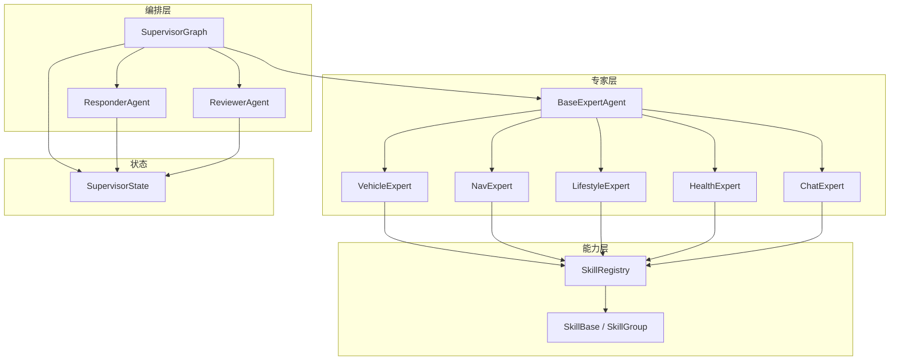
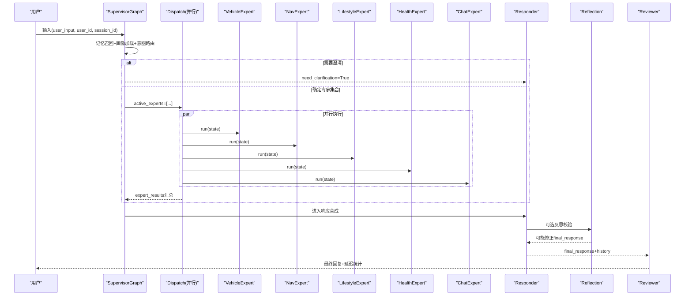
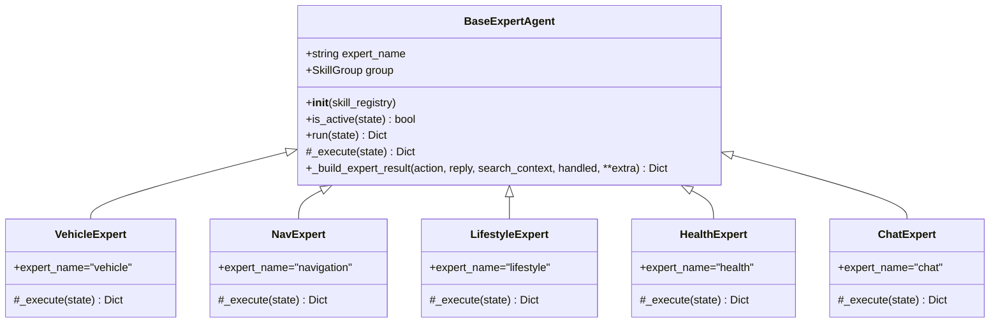
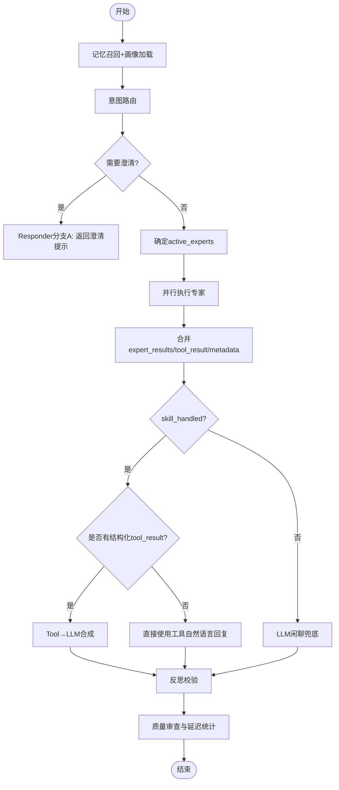
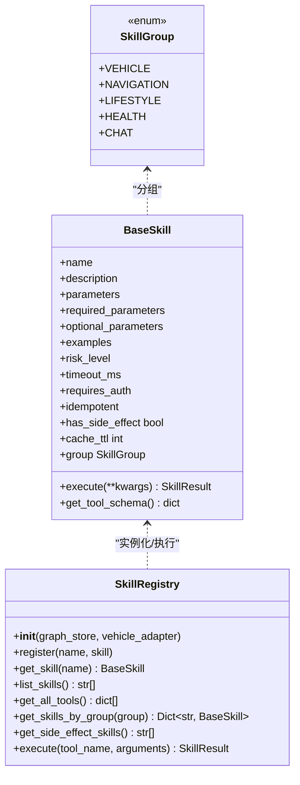
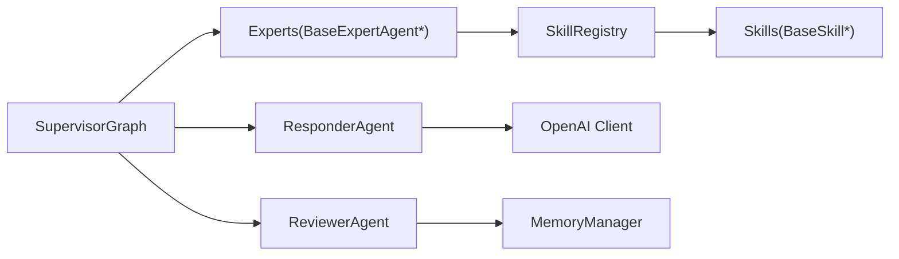

# 自定义专家Agent开发

<cite>
**本文引用的文件**   
- [base.py](file://backend_design/nexus/agent/experts/base.py)
- [chat_expert.py](file://backend_design/nexus/agent/experts/chat_expert.py)
- [health_expert.py](file://backend_design/nexus/agent/experts/health_expert.py)
- [nav_expert.py](file://backend_design/nexus/agent/experts/nav_expert.py)
- [vehicle_expert.py](file://backend_design/nexus/agent/experts/vehicle_expert.py)
- [lifestyle_expert.py](file://backend_design/nexus/agent/experts/lifestyle_expert.py)
- [supervisor_graph.py](file://backend_design/nexus/agent/supervisor_graph.py)
- [responder.py](file://backend_design/nexus/agent/responder.py)
- [reviewer.py](file://backend_design/nexus/agent/reviewer.py)
- [state.py](file://backend_design/nexus/models/state.py)
- [base.py](file://backend_design/nexus/skills/base.py)
- [registry.py](file://backend_design/nexus/skills/registry.py)
- [test_core.py](file://backend_design/tests/test_core.py)
</cite>

## 目录
1. [引言](#引言)
2. [项目结构](#项目结构)
3. [核心组件](#核心组件)
4. [架构总览](#架构总览)
5. [详细组件分析](#详细组件分析)
6. [依赖关系分析](#依赖关系分析)
7. [性能与优化](#性能与优化)
8. [故障排查指南](#故障排查指南)
9. [结论](#结论)
10. [附录：实战案例与最佳实践](#附录实战案例与最佳实践)

## 引言
本指南面向希望基于现有框架扩展“专家Agent”的开发者，系统讲解BaseExpertAgent抽象类的设计模式与接口规范、专家生命周期管理（从意图识别到结果返回）、配置选项（工具集绑定、提示词模板、重试策略、超时设置）、以及Supervisor多专家协作机制。文档同时提供车辆控制、导航、健康咨询等完整实现路径与测试方法、调试技巧与性能优化建议，帮助读者快速构建高质量、可观测、可扩展的专家Agent。

## 项目结构
围绕“专家Agent”的核心代码位于后端nexus模块中，关键目录与职责如下：
- agent/experts：专家基类与各领域专家实现（车控、导航、生活、健康、闲聊）
- agent：工作流编排（SupervisorGraph）、响应生成（Responder）、质量审查（Reviewer）
- models/state：多智能体共享状态定义与reducer语义
- skills：技能基类、注册中心与分组枚举
- tests：单元测试覆盖Mock总线、路由、注册中心等

图表来源
- [supervisor_graph.py:127-173](file://backend_design/nexus/agent/supervisor_graph.py#L127-L173)
- [base.py:26-133](file://backend_design/nexus/agent/experts/base.py#L26-L133)
- [vehicle_expert.py:33-63](file://backend_design/nexus/agent/experts/vehicle_expert.py#L33-L63)
- [nav_expert.py:27-74](file://backend_design/nexus/agent/experts/nav_expert.py#L27-L74)
- [lifestyle_expert.py:23-78](file://backend_design/nexus/agent/experts/lifestyle_expert.py#L23-L78)
- [health_expert.py:24-53](file://backend_design/nexus/agent/experts/health_expert.py#L24-L53)
- [chat_expert.py:24-56](file://backend_design/nexus/agent/experts/chat_expert.py#L24-L56)
- [registry.py:35-196](file://backend_design/nexus/skills/registry.py#L35-L196)
- [base.py:28-186](file://backend_design/nexus/skills/base.py#L28-L186)
- [state.py:38-161](file://backend_design/nexus/models/state.py#L38-L161)

章节来源
- [supervisor_graph.py:127-173](file://backend_design/nexus/agent/supervisor_graph.py#L127-L173)
- [state.py:38-161](file://backend_design/nexus/models/state.py#L38-L161)

## 核心组件
- BaseExpertAgent：专家抽象基类，统一执行入口run()、活跃判断is_active()、结果封装_build_expert_result()，并记录延迟与错误元数据。子类需实现_execute(state)以完成具体业务逻辑。
- 领域专家：VehicleExpert、NavExpert、LifestyleExpert、HealthExpert、ChatExpert，分别处理车控、导航、生活推荐、健康咨询、闲聊/声纹注册。
- SupervisorGraph：LangGraph有向图编排器，负责记忆召回、用户画像加载、意图路由、专家分派、并行执行、结果汇聚、反思校验与最终回复合成。
- ResponderAgent：根据分支（澄清/已处理/闲聊）生成最终回复，支持非流式与流式输出，具备云端LLM失败降级到本地LLM的能力。
- ReviewerAgent：最终质量检查、异步记忆存储、整体延迟统计。
- Skill体系：SkillGroup分组、@register_skill装饰器自动注册、SkillRegistry按名查找与执行、SkillResult统一返回结构。
- SupervisorState：TypedDict状态模型，使用Annotated reducer实现列表拼接与字典合并，保证多节点并行写入一致性。

章节来源
- [base.py:26-133](file://backend_design/nexus/agent/experts/base.py#L26-L133)
- [vehicle_expert.py:33-63](file://backend_design/nexus/agent/experts/vehicle_expert.py#L33-L63)
- [nav_expert.py:27-74](file://backend_design/nexus/agent/experts/nav_expert.py#L27-L74)
- [lifestyle_expert.py:23-78](file://backend_design/nexus/agent/experts/lifestyle_expert.py#L23-L78)
- [health_expert.py:24-53](file://backend_design/nexus/agent/experts/health_expert.py#L24-L53)
- [chat_expert.py:24-56](file://backend_design/nexus/agent/experts/chat_expert.py#L24-L56)
- [supervisor_graph.py:127-173](file://backend_design/nexus/agent/supervisor_graph.py#L127-L173)
- [responder.py:35-265](file://backend_design/nexus/agent/responder.py#L35-L265)
- [reviewer.py:26-79](file://backend_design/nexus/agent/reviewer.py#L26-L79)
- [base.py:28-186](file://backend_design/nexus/skills/base.py#L28-L186)
- [registry.py:35-196](file://backend_design/nexus/skills/registry.py#L35-L196)
- [state.py:38-161](file://backend_design/nexus/models/state.py#L38-L161)

## 架构总览
SupervisorGraph通过LangGraph构建工作流：
- 入口：supervisor节点进行记忆召回、用户画像加载、意图路由，决定active_experts或是否需要澄清。
- 并行专家：dispatch节点并行调用所有活跃专家的run()，expert_results通过reducer累加。
- 响应合成：responder节点根据skill_handled/tool_result/search_context选择分支，必要时进行Tool→LLM合成。
- 反思校验：reflection节点对LLM输出做事实性/无幻觉/相关性检查，必要时修正。
- 质量审查：reviewer节点进行兜底填充、异步记忆存储与总耗时统计。

图表来源
- [supervisor_graph.py:127-173](file://backend_design/nexus/agent/supervisor_graph.py#L127-L173)
- [supervisor_graph.py:326-399](file://backend_design/nexus/agent/supervisor_graph.py#L326-L399)
- [supervisor_graph.py:401-450](file://backend_design/nexus/agent/supervisor_graph.py#L401-L450)
- [supervisor_graph.py:534-675](file://backend_design/nexus/agent/supervisor_graph.py#L534-L675)
- [reviewer.py:36-79](file://backend_design/nexus/agent/reviewer.py#L36-L79)

## 详细组件分析

### BaseExpertAgent 抽象类与接口规范
- 设计要点
  - 统一入口run(state)：若不在active_experts则直接返回空更新；否则执行_execute(state)，记录latency_ms与异常元数据。
  - 结果封装_build_expert_result(action, reply, search_context, handled, **extra)：构造expert_results条目，兼容v1.0字段，并在handled且存在tool_data或reply时提升tool_result供后续合成与反思。
  - is_active(state)：基于state.active_experts判断是否参与本轮执行。
- 关键约定
  - 子类仅实现_execute(state)，返回partial update字典。
  - 通过registry.execute(tool_name, args)调用具体技能，统一返回SkillResult。
  - 所有异常被捕获并记录为metadata，避免中断整个流程。

图表来源
- [base.py:26-133](file://backend_design/nexus/agent/experts/base.py#L26-L133)
- [vehicle_expert.py:33-63](file://backend_design/nexus/agent/experts/vehicle_expert.py#L33-L63)
- [nav_expert.py:27-74](file://backend_design/nexus/agent/experts/nav_expert.py#L27-L74)
- [lifestyle_expert.py:23-78](file://backend_design/nexus/agent/experts/lifestyle_expert.py#L23-L78)
- [health_expert.py:24-53](file://backend_design/nexus/agent/experts/health_expert.py#L24-L53)
- [chat_expert.py:24-56](file://backend_design/nexus/agent/experts/chat_expert.py#L24-L56)

章节来源
- [base.py:26-133](file://backend_design/nexus/agent/experts/base.py#L26-L133)

### 专家生命周期与调度流程
- 生命周期阶段
  - 意图识别：Supervisor节点调用IntentRouterService获取intent，结合记忆与画像。
  - 专家分派：_determine_experts根据intent字段映射到专家集合，写入active_experts。
  - 并行执行：dispatch节点并行调用各专家run()，收集expert_results与tool_result。
  - 响应合成：responder根据分支生成最终回复，必要时进行Tool→LLM合成。
  - 反思校验：reflection对LLM输出进行事实性与无幻觉检查，必要时修正。
  - 质量审查：reviewer兜底填充、异步记忆存储、计算总延迟。
- 关键数据结构
  - SupervisorState：包含user_input、intent、active_experts、expert_results、tool_result、final_response、metadata等字段，并通过Annotated reducer保障并发安全。

图表来源
- [supervisor_graph.py:183-283](file://backend_design/nexus/agent/supervisor_graph.py#L183-L283)
- [supervisor_graph.py:285-324](file://backend_design/nexus/agent/supervisor_graph.py#L285-L324)
- [supervisor_graph.py:326-399](file://backend_design/nexus/agent/supervisor_graph.py#L326-L399)
- [supervisor_graph.py:401-450](file://backend_design/nexus/agent/supervisor_graph.py#L401-L450)
- [supervisor_graph.py:452-532](file://backend_design/nexus/agent/supervisor_graph.py#L452-L532)
- [supervisor_graph.py:534-675](file://backend_design/nexus/agent/supervisor_graph.py#L534-L675)
- [reviewer.py:36-79](file://backend_design/nexus/agent/reviewer.py#L36-L79)
- [state.py:38-161](file://backend_design/nexus/models/state.py#L38-L161)

章节来源
- [supervisor_graph.py:183-283](file://backend_design/nexus/agent/supervisor_graph.py#L183-L283)
- [supervisor_graph.py:285-324](file://backend_design/nexus/agent/supervisor_graph.py#L285-L324)
- [supervisor_graph.py:326-399](file://backend_design/nexus/agent/supervisor_graph.py#L326-L399)
- [supervisor_graph.py:401-450](file://backend_design/nexus/agent/supervisor_graph.py#L401-L450)
- [supervisor_graph.py:452-532](file://backend_design/nexus/agent/supervisor_graph.py#L452-L532)
- [supervisor_graph.py:534-675](file://backend_design/nexus/agent/supervisor_graph.py#L534-L675)
- [reviewer.py:36-79](file://backend_design/nexus/agent/reviewer.py#L36-L79)
- [state.py:38-161](file://backend_design/nexus/models/state.py#L38-L161)

### 工具集绑定与技能注册
- 技能分组与装饰器
  - SkillGroup枚举将技能归属到对应专家（vehicle/navigation/lifestyle/health/chat）。
  - @register_skill(name, group, description, has_side_effect, cache_ttl)自动注册到全局表，初始化时由SkillRegistry扫描实例化。
- 注册中心
  - SkillRegistry支持装饰器自动发现与手动注册兼容，提供get_skill、list_skills、get_all_tools、get_skills_by_group、get_side_effect_skills、execute等接口。
  - execute(tool_name, arguments)统一返回SkillResult，含status/message/data/action/search_context/handled等字段。
- 副作用与缓存
  - 车控类技能标记has_side_effect=True，禁止缓存；cache_ttl=0表示不缓存。
  - 通过get_side_effect_skills供上层缓存策略规避副作用操作命中缓存。

图表来源
- [base.py:28-186](file://backend_design/nexus/skills/base.py#L28-L186)
- [registry.py:35-196](file://backend_design/nexus/skills/registry.py#L35-L196)

章节来源
- [base.py:28-186](file://backend_design/nexus/skills/base.py#L28-L186)
- [registry.py:35-196](file://backend_design/nexus/skills/registry.py#L35-L196)

### 提示词模板与反思校验
- 提示词模板
  - PromptManager动态选择chat/search/vehicle等模板，注入用户画像、习惯、位置状态等上下文。
  - 搜索类提示词强制要求基于搜索结果回答，禁止添加外部信息。
- 反思校验
  - reflection节点对LLM输出进行事实性、完整性、无幻觉、相关性检查，必要时自动修正。
  - 搜索类回复额外进行时效性与数据来源校验。
  - 可通过配置关闭反思以减少LLM调用。

章节来源
- [supervisor_graph.py:754-800](file://backend_design/nexus/agent/supervisor_graph.py#L754-L800)
- [supervisor_graph.py:534-675](file://backend_design/nexus/agent/supervisor_graph.py#L534-L675)
- [supervisor_graph.py:677-752](file://backend_design/nexus/agent/supervisor_graph.py#L677-L752)

### 重试策略与超时设置
- 技能级超时
  - BaseSkill.timeout_ms用于描述技能预期耗时，可作为上层限流/熔断参考。
- 客户端超时
  - ResponderAgent在启用fallback时，可为本地LLM客户端设置timeout。
- 建议策略
  - 对外部API调用增加指数退避重试与熔断保护（如circuit_breaker），避免雪崩。
  - 对高延迟技能设置独立超时阈值，并在metadata中记录实际耗时以便监控。

章节来源
- [base.py:129-132](file://backend_design/nexus/skills/base.py#L129-L132)
- [responder.py:43-65](file://backend_design/nexus/agent/responder.py#L43-L65)

### 专家之间的协作机制（Supervisor调度）
- 决策规则
  - 车控动作→vehicle；导航动作→navigation；搜索/点餐→lifestyle；声纹注册→chat；无匹配→chat兜底。
- 并行执行
  - dispatch节点使用asyncio.gather并行调用所有活跃专家，合并expert_results与metadata。
- 结果汇聚
  - 优先传递tool_result至顶层state，供Responder进行Tool→LLM合成与反思校验。

章节来源
- [supervisor_graph.py:285-324](file://backend_design/nexus/agent/supervisor_graph.py#L285-L324)
- [supervisor_graph.py:326-399](file://backend_design/nexus/agent/supervisor_graph.py#L326-L399)

## 依赖关系分析
- 组件耦合
  - 专家强依赖SkillRegistry；SupervisorGraph聚合专家、Responder、Reviewer；Responder与Reviewer依赖LLM客户端与MemoryManager。
- 外部依赖
  - OpenAI兼容LLM客户端（云端/本地降级）；Neo4j图谱存储（部分技能）；车控适配器（vehicle_adapter）。
- 潜在循环
  - 当前结构无循环依赖；专家→注册中心→技能实例单向依赖。

图表来源
- [supervisor_graph.py:127-173](file://backend_design/nexus/agent/supervisor_graph.py#L127-L173)
- [registry.py:35-196](file://backend_design/nexus/skills/registry.py#L35-L196)
- [responder.py:35-265](file://backend_design/nexus/agent/responder.py#L35-L265)
- [reviewer.py:26-79](file://backend_design/nexus/agent/reviewer.py#L26-L79)

章节来源
- [supervisor_graph.py:127-173](file://backend_design/nexus/agent/supervisor_graph.py#L127-L173)
- [registry.py:35-196](file://backend_design/nexus/skills/registry.py#L35-L196)
- [responder.py:35-265](file://backend_design/nexus/agent/responder.py#L35-L265)
- [reviewer.py:26-79](file://backend_design/nexus/agent/reviewer.py#L26-L79)

## 性能与优化
- 并行化
  - 记忆召回、画像加载、意图路由在Supervisor内并行执行，显著降低端到端延迟。
  - 专家并行执行通过asyncio.gather，最大化吞吐。
- 降级与容错
  - Responder支持云端LLM失败降级到本地LLM；reflection可配置关闭以减少LLM调用。
  - 工具返回失败/未知结果时跳过LLM合成，直接返回原始消息，避免编造。
- 缓存与安全
  - 车控类技能标记has_side_effect=True，禁止缓存；其他技能可按cache_ttl缓存。
  - 副作用操作后禁止命中语义缓存，防止指令未执行的严重问题。
- 可观测性
  - 各节点记录latency_ms与metadata，Reviewer汇总total_latency_ms，便于定位瓶颈。

[本节为通用指导，无需列出具体文件来源]

## 故障排查指南
- 常见问题
  - 专家未执行：检查active_experts是否为空，确认_determine_experts映射是否正确。
  - 工具调用失败：查看SkillRegistry.execute日志与SkillResult.error字段。
  - 位置查询“未知位置”：NavExpert会从adapter缓存注入GPS坐标，确认cockpit_id与adapter.navigation可用。
  - 反思失败：检查reflection_enabled配置与LLM返回JSON解析逻辑。
- 调试技巧
  - 开启详细日志，关注expert_results与metadata中的latency与error字段。
  - 使用tests/test_core.py中的用例验证Mock总线与注册中心行为。
- 恢复策略
  - 对外部服务调用增加重试与熔断；对LLM调用启用fallback与低温度参数确保稳定性。

章节来源
- [nav_expert.py:43-64](file://backend_design/nexus/agent/experts/nav_expert.py#L43-L64)
- [registry.py:171-196](file://backend_design/nexus/skills/registry.py#L171-L196)
- [supervisor_graph.py:534-675](file://backend_design/nexus/agent/supervisor_graph.py#L534-L675)
- [test_core.py:107-135](file://backend_design/tests/test_core.py#L107-L135)

## 结论
通过BaseExpertAgent抽象与SupervisorGraph编排，本项目实现了高内聚、低耦合的多专家协同架构。借助SkillRegistry与@register_skill，新增专家与技能只需遵循统一接口即可无缝接入。配合反思校验、降级策略与完善的可观测性，系统在准确性、鲁棒性与性能之间取得良好平衡。

[本节为总结性内容，无需列出具体文件来源]

## 附录：实战案例与最佳实践

### 车辆控制专家（VehicleExpert）
- 目标：处理空调/车窗/座椅/媒体/状态查询等车控指令。
- 实现要点
  - 从intent中提取Climate_Action/Window_Action/Seat_Action/Media_Action/Vehicle_Status_Action。
  - 过滤None值后调用对应技能，返回统一结果。
- 参考路径
  - [vehicle_expert.py:33-63](file://backend_design/nexus/agent/experts/vehicle_expert.py#L33-L63)
  - [registry.py:109-140](file://backend_design/nexus/skills/registry.py#L109-L140)

章节来源
- [vehicle_expert.py:33-63](file://backend_design/nexus/agent/experts/vehicle_expert.py#L33-L63)
- [registry.py:109-140](file://backend_design/nexus/skills/registry.py#L109-L140)

### 导航专家（NavExpert）
- 目标：处理目的地设置、路线规划、当前位置查询。
- 实现要点
  - 过滤None值；查询位置时从adapter缓存注入GPS坐标，避免IP定位超时导致“未知位置”。
  - 调用vehicle_navigation技能并返回结构化数据。
- 参考路径
  - [nav_expert.py:27-74](file://backend_design/nexus/agent/experts/nav_expert.py#L27-L74)

章节来源
- [nav_expert.py:27-74](file://backend_design/nexus/agent/experts/nav_expert.py#L27-L74)

### 健康咨询专家（HealthExpert）
- 目标：处理故障诊断、故障码翻译、保养建议。
- 实现要点
  - Phase 1骨架：检测diagnose_vehicle技能是否存在，存在则执行并返回结果；否则返回未处理。
  - 未来扩展：集成Cherry知识库与更多健康相关技能。
- 参考路径
  - [health_expert.py:24-53](file://backend_design/nexus/agent/experts/health_expert.py#L24-L53)

章节来源
- [health_expert.py:24-53](file://backend_design/nexus/agent/experts/health_expert.py#L24-L53)

### 闲聊与声纹注册专家（ChatExpert）
- 目标：处理纯LLM闲聊与声纹注册。
- 实现要点
  - 当Register_Action存在时，调用register_voice技能并返回指令供前端处理。
  - 纯闲聊不标记handled，交由Responder走LLM分支。
- 参考路径
  - [chat_expert.py:24-56](file://backend_design/nexus/agent/experts/chat_expert.py#L24-L56)

章节来源
- [chat_expert.py:24-56](file://backend_design/nexus/agent/experts/chat_expert.py#L24-L56)

### 测试方法与断言示例
- Mock车控总线与技能执行
  - 使用pytest与AsyncMock验证车控命令、窗口控制、座椅加热、导航、媒体播放、状态查询等。
  - 验证SkillRegistry.list_skills/get_all_tools/execute行为。
- 参考路径
  - [test_core.py:15-72](file://backend_design/tests/test_core.py#L15-L72)
  - [test_core.py:107-135](file://backend_design/tests/test_core.py#L107-L135)

章节来源
- [test_core.py:15-72](file://backend_design/tests/test_core.py#L15-L72)
- [test_core.py:107-135](file://backend_design/tests/test_core.py#L107-L135)

### 最佳实践清单
- 明确专家边界：每个专家只处理一类意图，避免职责扩散。
- 使用SkillGroup与@register_skill：简化注册与分组查询。
- 谨慎处理副作用：车控类技能必须标记has_side_effect=True，禁用缓存。
- 强化反思校验：对工具结果与搜索结果进行事实性与时效性检查。
- 完善可观测性：在各节点记录latency与metadata，便于定位瓶颈与问题。
- 降级与容错：LLM失败回退本地模型；外部API调用增加重试与熔断。

[本节为通用指导，无需列出具体文件来源]