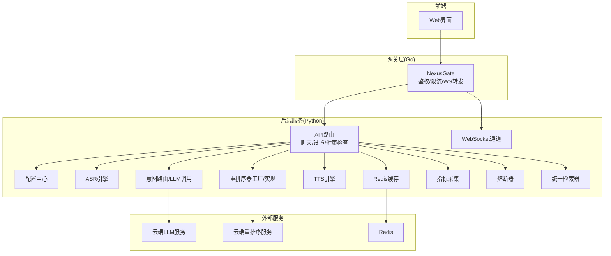
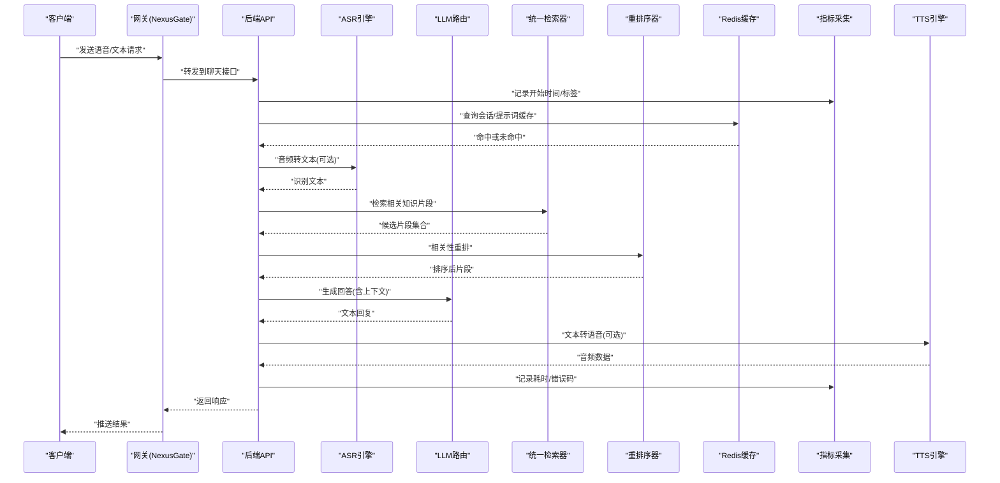
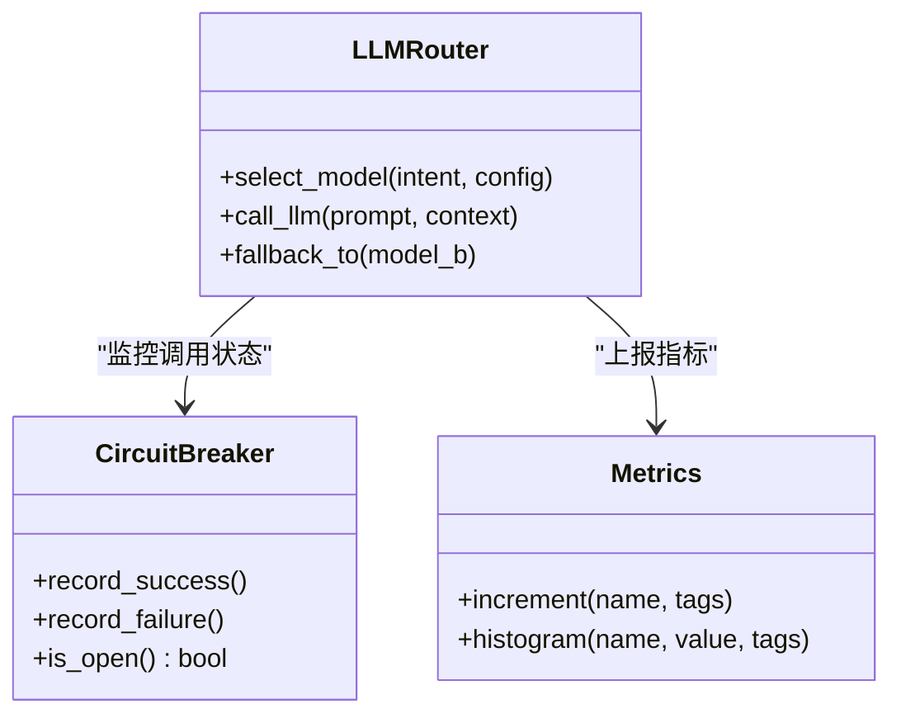
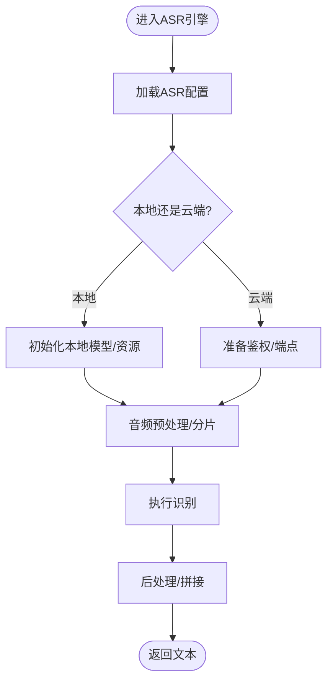
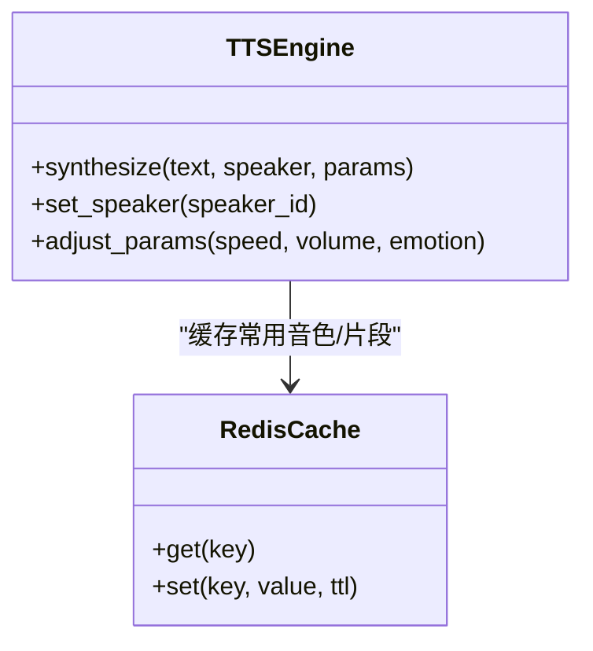
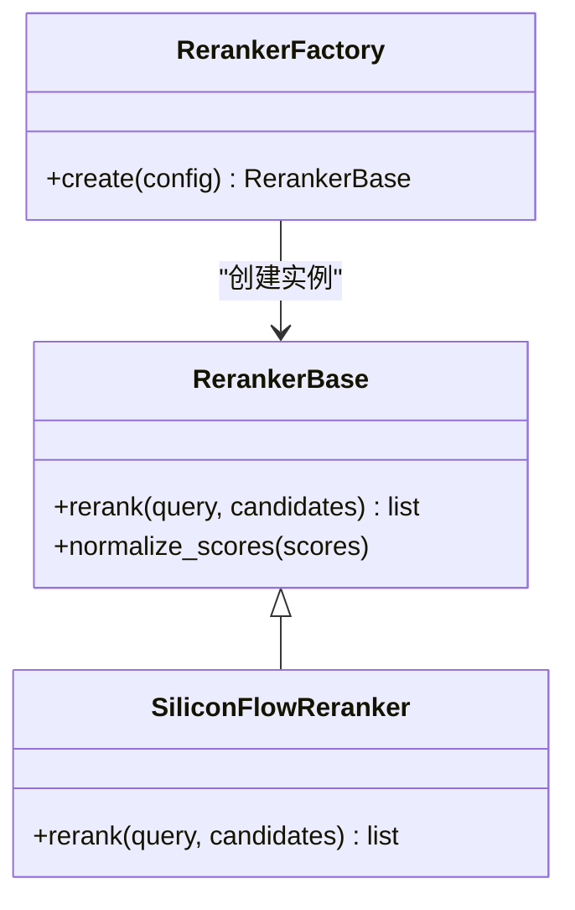
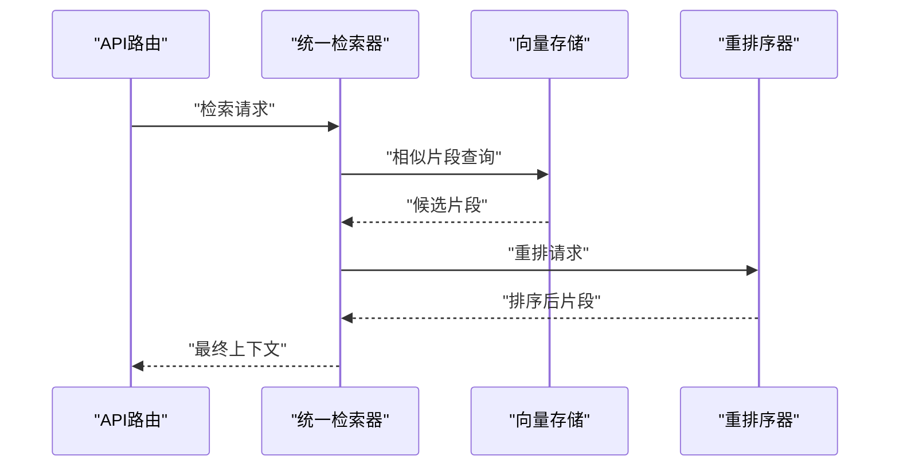
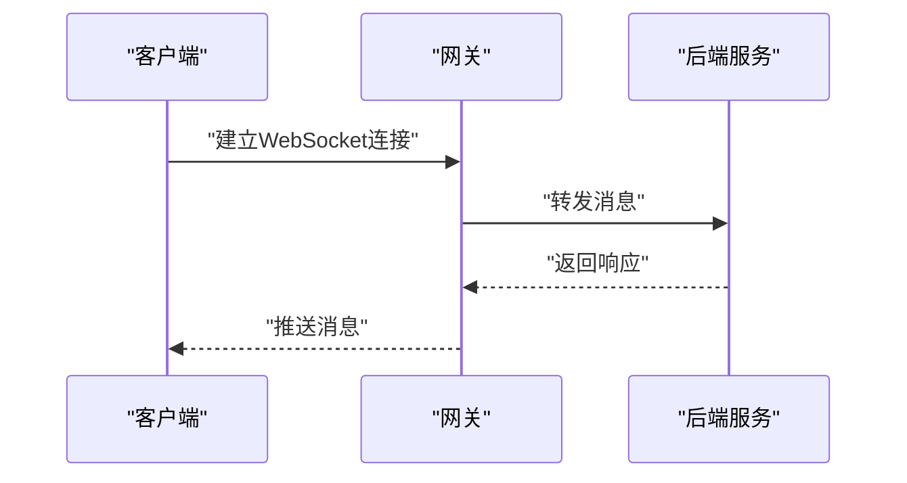
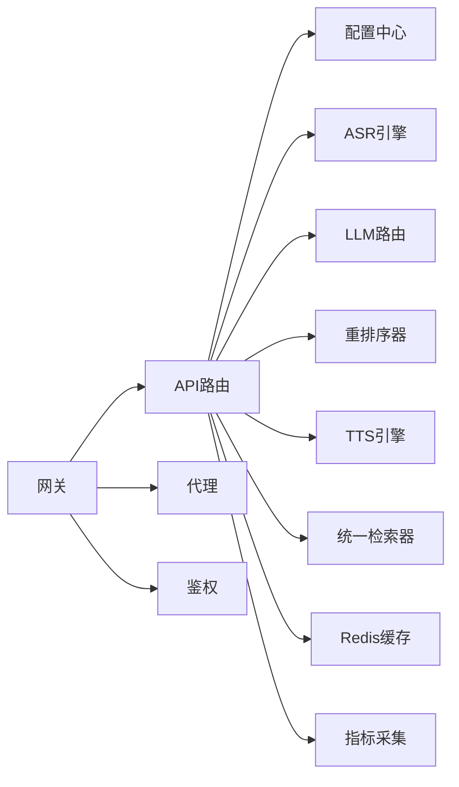

# AI模型定制

<cite>
**本文引用的文件**
- [backend_design/nexus/config.py](file://backend_design/nexus/config.py)
- [backend_design/nexus/main.py](file://backend_design/nexus/main.py)
- [backend_design/nexus/asr/engine.py](file://backend_design/nexus/asr/engine.py)
- [backend_design/nexus/tts/engine.py](file://backend_design/nexus/tts/engine.py)
- [backend_design/nexus/reranker/reranker_base.py](file://backend_design/nexus/reranker/reranker_base.py)
- [backend_design/nexus/reranker/reranker_factory.py](file://backend_design/nexus/reranker/reranker_factory.py)
- [backend_design/nexus/reranker/siliconflow_reranker.py](file://backend_design/nexus/reranker/siliconflow_reranker.py)
- [backend_design/nexus/intent/llm_router.py](file://backend_design/nexus/intent/llm_router.py)
- [backend_design/nexus/middleware/redis_cache.py](file://backend_design/nexus/middleware/redis_cache.py)
- [backend_design/nexus/core/circuit_breaker.py](file://backend_design/nexus/core/circuit_breaker.py)
- [backend_design/nexus/observability/metrics.py](file://backend_design/nexus/observability/metrics.py)
- [backend_design/nexus/rag/unified_retriever.py](file://backend_design/nexus/rag/unified_retriever.py)
- [backend_design/nexus/api/routes/chat.py](file://backend_design/nexus/api/routes/chat.py)
- [backend_design/nexus/api/routes/settings.py](file://backend_design/nexus/api/routes/settings.py)
- [backend_design/nexus/api/websocket.py](file://backend_design/nexus/api/websocket.py)
- [backend_design/nexus_gate/internal/handlers/handlers.go](file://backend_design/nexus_gate/internal/handlers/handlers.go)
- [backend_design/nexus_gate/internal/proxy/proxy.go](file://backend_design/nexus_gate/internal/proxy/proxy.go)
- [backend_design/nexus_gate/proto/nexus.proto](file://backend_design/nexus_gate/proto/nexus.proto)
- [models/llm/llama.cpp/README.md](file://models/llm/llama.cpp/README.md)
- [models/llm/qwen/README.md](file://models/llm/qwen/README.md)
- [models/asr/sensevoice/README.md](file://models/asr/sensevoice/README.md)
- [models/tts/cosyvoice/README.md](file://models/tts/cosyvoice/README.md)
- [models/reranker/bge-reranker-v2-m3/README.md](file://models/reranker/bge-reranker-v2-m3/README.md)
- [docs/model-selection-guide.md](file://docs/model-selection-guide.md)
- [docs/deployment/LLM_FALLBACK.md](file://docs/deployment/LLM_FALLBACK.md)
- [docker-compose.yml](file://docker-compose.yml)
</cite>

## 目录
1. [简介](#简介)
2. [项目结构](#项目结构)
3. [核心组件](#核心组件)
4. [架构总览](#架构总览)
5. [详细组件分析](#详细组件分析)
6. [依赖关系分析](#依赖关系分析)
7. [性能考量](#性能考量)
8. [故障排查指南](#故障排查指南)
9. [结论](#结论)
10. [附录](#附录)

## 简介
本指南面向需要在系统中替换与定制AI模型的工程师与运维人员，覆盖大语言模型（LLM）、语音识别（ASR）、语音合成（TTS）、重排序器（Reranker）等关键模块。文档从配置结构、参数调优、本地部署与云端集成、评估基准、缓存与热更新、版本迁移与最佳实践等方面提供系统化说明，并附带实际替换示例与故障排查方法，帮助快速落地与稳定运行。

## 项目结构
系统采用前后端分离与网关代理的架构：
- 后端服务（Python）负责业务编排、模型调用、中间件与可观测性。
- 网关服务（Go）负责鉴权、限流、WebSocket转发与HTTP代理。
- 模型资源以目录形式组织在 models/ 下，便于本地加载与切换。
- 配置集中于后端配置模块，支持运行时设置与动态刷新。

图表来源
- [backend_design/nexus/main.py](file://backend_design/nexus/main.py)
- [backend_design/nexus/api/routes/chat.py](file://backend_design/nexus/api/routes/chat.py)
- [backend_design/nexus/api/websocket.py](file://backend_design/nexus/api/websocket.py)
- [backend_design/nexus/intent/llm_router.py](file://backend_design/nexus/intent/llm_router.py)
- [backend_design/nexus/reranker/reranker_factory.py](file://backend_design/nexus/reranker/reranker_factory.py)
- [backend_design/nexus/asr/engine.py](file://backend_design/nexus/asr/engine.py)
- [backend_design/nexus/tts/engine.py](file://backend_design/nexus/tts/engine.py)
- [backend_design/nexus/middleware/redis_cache.py](file://backend_design/nexus/middleware/redis_cache.py)
- [backend_design/nexus/observability/metrics.py](file://backend_design/nexus/observability/metrics.py)
- [backend_design/nexus/core/circuit_breaker.py](file://backend_design/nexus/core/circuit_breaker.py)
- [backend_design/nexus/rag/unified_retriever.py](file://backend_design/nexus/rag/unified_retriever.py)
- [backend_design/nexus_gate/internal/handlers/handlers.go](file://backend_design/nexus_gate/internal/handlers/handlers.go)
- [backend_design/nexus_gate/internal/proxy/proxy.go](file://backend_design/nexus_gate/internal/proxy/proxy.go)

章节来源
- [backend_design/nexus/main.py](file://backend_design/nexus/main.py)
- [backend_design/nexus/config.py](file://backend_design/nexus/config.py)
- [docker-compose.yml](file://docker-compose.yml)

## 核心组件
- 配置中心：集中管理模型类型、路径、超时、重试、缓存策略、熔断阈值等。
- ASR引擎：音频转文本，支持本地模型与云端接口。
- LLM路由：根据意图选择不同LLM或回退策略。
- 重排序器：对检索结果进行相关性重排，支持本地与云端实现。
- TTS引擎：文本转语音，支持多音色与参数调节。
- 中间件：Redis缓存、熔断器、指标采集。
- 网关：鉴权、限流、WebSocket转发与HTTP代理。

章节来源
- [backend_design/nexus/config.py](file://backend_design/nexus/config.py)
- [backend_design/nexus/asr/engine.py](file://backend_design/nexus/asr/engine.py)
- [backend_design/nexus/intent/llm_router.py](file://backend_design/nexus/intent/llm_router.py)
- [backend_design/nexus/reranker/reranker_base.py](file://backend_design/nexus/reranker/reranker_base.py)
- [backend_design/nexus/reranker/reranker_factory.py](file://backend_design/nexus/reranker/reranker_factory.py)
- [backend_design/nexus/reranker/siliconflow_reranker.py](file://backend_design/nexus/reranker/siliconflow_reranker.py)
- [backend_design/nexus/tts/engine.py](file://backend_design/nexus/tts/engine.py)
- [backend_design/nexus/middleware/redis_cache.py](file://backend_design/nexus/middleware/redis_cache.py)
- [backend_design/nexus/core/circuit_breaker.py](file://backend_design/nexus/core/circuit_breaker.py)
- [backend_design/nexus/observability/metrics.py](file://backend_design/nexus/observability/metrics.py)
- [backend_design/nexus/rag/unified_retriever.py](file://backend_design/nexus/rag/unified_retriever.py)
- [backend_design/nexus_gate/internal/handlers/handlers.go](file://backend_design/nexus_gate/internal/handlers/handlers.go)
- [backend_design/nexus_gate/internal/proxy/proxy.go](file://backend_design/nexus_gate/internal/proxy/proxy.go)

## 架构总览
下图展示一次“语音对话”端到端流程，涵盖ASR→LLM→Rerank→TTS的关键环节，以及缓存与熔断的介入点。

图表来源
- [backend_design/nexus/api/routes/chat.py](file://backend_design/nexus/api/routes/chat.py)
- [backend_design/nexus/asr/engine.py](file://backend_design/nexus/asr/engine.py)
- [backend_design/nexus/intent/llm_router.py](file://backend_design/nexus/intent/llm_router.py)
- [backend_design/nexus/rag/unified_retriever.py](file://backend_design/nexus/rag/unified_retriever.py)
- [backend_design/nexus/reranker/reranker_factory.py](file://backend_design/nexus/reranker/reranker_factory.py)
- [backend_design/nexus/reranker/siliconflow_reranker.py](file://backend_design/nexus/reranker/siliconflow_reranker.py)
- [backend_design/nexus/tts/engine.py](file://backend_design/nexus/tts/engine.py)
- [backend_design/nexus/middleware/redis_cache.py](file://backend_design/nexus/middleware/redis_cache.py)
- [backend_design/nexus/observability/metrics.py](file://backend_design/nexus/observability/metrics.py)
- [backend_design/nexus_gate/internal/handlers/handlers.go](file://backend_design/nexus_gate/internal/handlers/handlers.go)

## 详细组件分析

### LLM模型替换与定制
- 目标：在不改动上层业务逻辑的前提下，通过配置切换不同LLM后端（本地或云端），并支持回退策略。
- 关键点：
  - 使用意图路由模块选择具体LLM实现；可通过配置指定默认模型、备用模型与调用参数（如温度、最大长度）。
  - 结合熔断器与指标采集，保障异常场景下的稳定性与可观测性。
  - 对于云端LLM，需配置鉴权、超时与重试策略；对于本地模型，需配置模型路径与推理框架参数。
- 推荐步骤：
  - 在配置中新增或修改LLM后端条目，包含类型、地址/路径、鉴权信息、超时与重试。
  - 在路由模块中注册新实现，确保接口契约一致。
  - 启用回退策略，当主模型失败时自动切换到备用模型。
  - 通过指标面板观察延迟、错误率与吞吐变化。

图表来源
- [backend_design/nexus/intent/llm_router.py](file://backend_design/nexus/intent/llm_router.py)
- [backend_design/nexus/core/circuit_breaker.py](file://backend_design/nexus/core/circuit_breaker.py)
- [backend_design/nexus/observability/metrics.py](file://backend_design/nexus/observability/metrics.py)

章节来源
- [backend_design/nexus/intent/llm_router.py](file://backend_design/nexus/intent/llm_router.py)
- [backend_design/nexus/core/circuit_breaker.py](file://backend_design/nexus/core/circuit_breaker.py)
- [backend_design/nexus/observability/metrics.py](file://backend_design/nexus/observability/metrics.py)
- [docs/deployment/LLM_FALLBACK.md](file://docs/deployment/LLM_FALLBACK.md)

### ASR模型替换与定制
- 目标：替换或扩展语音识别模型，支持本地模型与云端接口。
- 关键点：
  - 引擎模块封装统一的识别接口，内部根据配置选择具体实现。
  - 支持音频预处理、采样率适配、分片处理与超时控制。
  - 云端模式需配置鉴权与重试；本地模式需配置模型权重与推理参数。
- 推荐步骤：
  - 在配置中新增ASR后端条目，指定类型与参数。
  - 在引擎中注册新实现，保持输入输出格式一致。
  - 针对长音频增加分片与合并策略，提升鲁棒性。
  - 通过指标面板观察识别准确率与延迟分布。

图表来源
- [backend_design/nexus/asr/engine.py](file://backend_design/nexus/asr/engine.py)

章节来源
- [backend_design/nexus/asr/engine.py](file://backend_design/nexus/asr/engine.py)
- [models/asr/sensevoice/README.md](file://models/asr/sensevoice/README.md)

### TTS模型替换与定制
- 目标：替换或扩展语音合成模型，支持多音色与个性化参数。
- 关键点：
  - 引擎模块封装统一的合成接口，内部根据配置选择具体实现。
  - 支持音色选择、语速、音量、情感等参数调节。
  - 云端模式需配置鉴权与并发限制；本地模式需配置模型权重与推理参数。
- 推荐步骤：
  - 在配置中新增TTS后端条目，指定类型与参数。
  - 在引擎中注册新实现，保持输入输出格式一致。
  - 针对高并发场景启用队列与批处理策略。
  - 通过指标面板观察合成延迟与音质反馈。

图表来源
- [backend_design/nexus/tts/engine.py](file://backend_design/nexus/tts/engine.py)
- [backend_design/nexus/middleware/redis_cache.py](file://backend_design/nexus/middleware/redis_cache.py)

章节来源
- [backend_design/nexus/tts/engine.py](file://backend_design/nexus/tts/engine.py)
- [models/tts/cosyvoice/README.md](file://models/tts/cosyvoice/README.md)
- [backend_design/nexus/middleware/redis_cache.py](file://backend_design/nexus/middleware/redis_cache.py)

### 重排序器替换与定制
- 目标：替换或扩展重排序器，支持本地与云端实现，提高检索结果的相关性。
- 关键点：
  - 通过工厂模式创建具体实现，统一接口契约。
  - 支持批量打分、分数归一化与阈值过滤。
  - 云端实现需配置鉴权、超时与重试；本地实现需配置模型权重与推理参数。
- 推荐步骤：
  - 在配置中新增重排序器后端条目，指定类型与参数。
  - 在工厂中注册新实现，保持输入输出格式一致。
  - 引入熔断器保护，避免下游不可用影响整体链路。
  - 通过指标面板观察重排耗时与效果提升。

图表来源
- [backend_design/nexus/reranker/reranker_base.py](file://backend_design/nexus/reranker/reranker_base.py)
- [backend_design/nexus/reranker/siliconflow_reranker.py](file://backend_design/nexus/reranker/siliconflow_reranker.py)
- [backend_design/nexus/reranker/reranker_factory.py](file://backend_design/nexus/reranker/reranker_factory.py)

章节来源
- [backend_design/nexus/reranker/reranker_base.py](file://backend_design/nexus/reranker/reranker_base.py)
- [backend_design/nexus/reranker/reranker_factory.py](file://backend_design/nexus/reranker/reranker_factory.py)
- [backend_design/nexus/reranker/siliconflow_reranker.py](file://backend_design/nexus/reranker/siliconflow_reranker.py)
- [models/reranker/bge-reranker-v2-m3/README.md](file://models/reranker/bge-reranker-v2-m3/README.md)

### 统一检索器与RAG集成
- 目标：将检索与重排整合为统一入口，简化上层调用。
- 关键点：
  - 统一检索器协调向量检索与重排序器，返回最终上下文。
  - 支持多种向量存储与图数据库后端，通过配置切换。
  - 与LLM路由协作，构建完整的RAG链路。
- 推荐步骤：
  - 在配置中指定检索后端与重排序器后端。
  - 调整相似度阈值与TopK数量，平衡召回与精度。
  - 通过指标面板观察检索命中率与重排效果。

图表来源
- [backend_design/nexus/rag/unified_retriever.py](file://backend_design/nexus/rag/unified_retriever.py)
- [backend_design/nexus/reranker/reranker_factory.py](file://backend_design/nexus/reranker/reranker_factory.py)

章节来源
- [backend_design/nexus/rag/unified_retriever.py](file://backend_design/nexus/rag/unified_retriever.py)

### 网关与WebSocket集成
- 目标：通过网关实现鉴权、限流与WebSocket转发，支撑实时语音交互。
- 关键点：
  - 网关负责鉴权、限流与协议转换，将WebSocket消息转发至后端。
  - 支持HTTP代理与gRPC/Proto定义，便于扩展。
- 推荐步骤：
  - 在网关中配置后端地址与转发规则。
  - 开启鉴权与限流策略，防止滥用。
  - 通过日志与指标面板观察连接数与消息吞吐。

图表来源
- [backend_design/nexus_gate/internal/handlers/handlers.go](file://backend_design/nexus_gate/internal/handlers/handlers.go)
- [backend_design/nexus_gate/internal/proxy/proxy.go](file://backend_design/nexus_gate/internal/proxy/proxy.go)
- [backend_design/nexus_gate/proto/nexus.proto](file://backend_design/nexus_gate/proto/nexus.proto)
- [backend_design/nexus/api/websocket.py](file://backend_design/nexus/api/websocket.py)

章节来源
- [backend_design/nexus_gate/internal/handlers/handlers.go](file://backend_design/nexus_gate/internal/handlers/handlers.go)
- [backend_design/nexus_gate/internal/proxy/proxy.go](file://backend_design/nexus_gate/internal/proxy/proxy.go)
- [backend_design/nexus_gate/proto/nexus.proto](file://backend_design/nexus_gate/proto/nexus.proto)
- [backend_design/nexus/api/websocket.py](file://backend_design/nexus/api/websocket.py)

## 依赖关系分析
- 组件耦合：
  - API路由依赖配置、ASR、LLM路由、重排序器、TTS、检索器、缓存与指标。
  - 网关依赖处理器、代理与限流模块。
- 外部依赖：
  - Redis用于缓存与会话存储。
  - 云端LLM与重排序服务通过HTTP/gRPC接入。
- 潜在循环依赖：
  - 通过工厂与接口抽象避免直接耦合，降低循环风险。

图表来源
- [backend_design/nexus/api/routes/chat.py](file://backend_design/nexus/api/routes/chat.py)
- [backend_design/nexus/config.py](file://backend_design/nexus/config.py)
- [backend_design/nexus/asr/engine.py](file://backend_design/nexus/asr/engine.py)
- [backend_design/nexus/intent/llm_router.py](file://backend_design/nexus/intent/llm_router.py)
- [backend_design/nexus/reranker/reranker_factory.py](file://backend_design/nexus/reranker/reranker_factory.py)
- [backend_design/nexus/tts/engine.py](file://backend_design/nexus/tts/engine.py)
- [backend_design/nexus/rag/unified_retriever.py](file://backend_design/nexus/rag/unified_retriever.py)
- [backend_design/nexus/middleware/redis_cache.py](file://backend_design/nexus/middleware/redis_cache.py)
- [backend_design/nexus/observability/metrics.py](file://backend_design/nexus/observability/metrics.py)
- [backend_design/nexus_gate/internal/handlers/handlers.go](file://backend_design/nexus_gate/internal/handlers/handlers.go)
- [backend_design/nexus_gate/internal/proxy/proxy.go](file://backend_design/nexus_gate/internal/proxy/proxy.go)

章节来源
- [backend_design/nexus/api/routes/chat.py](file://backend_design/nexus/api/routes/chat.py)
- [backend_design/nexus/config.py](file://backend_design/nexus/config.py)
- [backend_design/nexus/asr/engine.py](file://backend_design/nexus/asr/engine.py)
- [backend_design/nexus/intent/llm_router.py](file://backend_design/nexus/intent/llm_router.py)
- [backend_design/nexus/reranker/reranker_factory.py](file://backend_design/nexus/reranker/reranker_factory.py)
- [backend_design/nexus/tts/engine.py](file://backend_design/nexus/tts/engine.py)
- [backend_design/nexus/rag/unified_retriever.py](file://backend_design/nexus/rag/unified_retriever.py)
- [backend_design/nexus/middleware/redis_cache.py](file://backend_design/nexus/middleware/redis_cache.py)
- [backend_design/nexus/observability/metrics.py](file://backend_design/nexus/observability/metrics.py)
- [backend_design/nexus_gate/internal/handlers/handlers.go](file://backend_design/nexus_gate/internal/handlers/handlers.go)
- [backend_design/nexus_gate/internal/proxy/proxy.go](file://backend_design/nexus_gate/internal/proxy/proxy.go)

## 性能考量
- 缓存策略：
  - 使用Redis缓存高频提示词、会话状态与常见TTS片段，减少重复计算与网络开销。
  - 合理设置TTL与失效策略，避免脏读与内存膨胀。
- 熔断与降级：
  - 对LLM与重排序器等外部依赖启用熔断器，快速失败与回退，保障整体可用性。
- 指标与监控：
  - 采集各模块延迟、错误率与吞吐，结合告警策略及时发现瓶颈。
- 并发与批处理：
  - 在高并发场景下，对TTS与ASR启用队列与批处理，提升吞吐与稳定性。

[本节为通用指导，不直接分析具体文件]

## 故障排查指南
- 常见问题定位：
  - 模型加载失败：检查模型路径、权限与依赖库版本。
  - 云端调用超时：调整超时与重试策略，检查网络与鉴权。
  - 缓存未命中：确认Redis连通性与键空间设计。
  - WebSocket断连：检查网关转发与后端心跳机制。
- 诊断工具：
  - 指标面板查看延迟与错误分布。
  - 日志聚合与链路追踪定位问题根因。
  - 熔断器状态观察下游健康度。

章节来源
- [backend_design/nexus/core/circuit_breaker.py](file://backend_design/nexus/core/circuit_breaker.py)
- [backend_design/nexus/observability/metrics.py](file://backend_design/nexus/observability/metrics.py)
- [backend_design/nexus/middleware/redis_cache.py](file://backend_design/nexus/middleware/redis_cache.py)
- [backend_design/nexus/api/websocket.py](file://backend_design/nexus/api/websocket.py)

## 结论
通过模块化设计与工厂模式，系统实现了LLM、ASR、TTS与重排序器的灵活替换与定制。配合配置中心、缓存、熔断与指标采集，可在本地与云端环境中稳定运行。建议在生产环境完善评估基准与灰度发布流程，持续优化模型效果与系统性能。

[本节为总结，不直接分析具体文件]

## 附录

### 模型配置文件结构与参数调优
- 配置项建议：
  - 模型类型与后端地址/路径。
  - 鉴权信息与超时、重试策略。
  - 推理参数（温度、最大长度、TopK等）。
  - 缓存TTL与失效策略。
  - 熔断阈值与回退模型。
- 调优建议：
  - 根据业务需求调整TopK与相似度阈值，平衡召回与精度。
  - 针对长文本与长音频启用分片与批处理。
  - 通过A/B测试对比不同模型的效果与成本。

章节来源
- [backend_design/nexus/config.py](file://backend_design/nexus/config.py)
- [backend_design/nexus/api/routes/settings.py](file://backend_design/nexus/api/routes/settings.py)
- [docs/model-selection-guide.md](file://docs/model-selection-guide.md)

### 本地模型部署与云端模型集成
- 本地部署：
  - 将模型权重放置于models目录，按模块分类管理。
  - 在配置中指定本地后端与推理参数。
- 云端集成：
  - 配置云端端点、鉴权与重试策略。
  - 通过网关统一接入，便于限流与监控。

章节来源
- [models/llm/llama.cpp/README.md](file://models/llm/llama.cpp/README.md)
- [models/llm/qwen/README.md](file://models/llm/qwen/README.md)
- [models/asr/sensevoice/README.md](file://models/asr/sensevoice/README.md)
- [models/tts/cosyvoice/README.md](file://models/tts/cosyvoice/README.md)
- [models/reranker/bge-reranker-v2-m3/README.md](file://models/reranker/bge-reranker-v2-m3/README.md)
- [docker-compose.yml](file://docker-compose.yml)

### 模型性能评估与基准测试
- 评估维度：
  - 延迟（P50/P95/P99）、吞吐（QPS）、错误率。
  - 质量指标（ASR WER、TTS MOS、LLM准确率、重排序NDCG）。
- 测试方法：
  - 构造代表性数据集，模拟真实负载。
  - 使用指标采集与可视化面板对比不同模型表现。
  - 结合熔断与回退策略评估鲁棒性。

章节来源
- [backend_design/nexus/observability/metrics.py](file://backend_design/nexus/observability/metrics.py)
- [docs/model-selection-guide.md](file://docs/model-selection-guide.md)

### 模型缓存策略与热更新机制
- 缓存策略：
  - 对高频提示词、会话状态与TTS片段启用Redis缓存。
  - 设置合理TTL与失效策略，避免脏读。
- 热更新：
  - 通过配置中心动态刷新模型后端与参数。
  - 结合灰度发布与回滚策略，降低变更风险。

章节来源
- [backend_design/nexus/middleware/redis_cache.py](file://backend_design/nexus/middleware/redis_cache.py)
- [backend_design/nexus/config.py](file://backend_design/nexus/config.py)
- [backend_design/nexus/api/routes/settings.py](file://backend_design/nexus/api/routes/settings.py)

### 模型迁移与版本管理最佳实践
- 版本管理：
  - 为每个模型版本建立独立目录与元数据。
  - 在配置中声明当前生效版本与回退版本。
- 迁移流程：
  - 先在预发环境验证新版本效果与性能。
  - 逐步放量至生产，监控指标与用户反馈。
  - 保留回滚能力，确保快速恢复。

章节来源
- [docs/deployment/LLM_FALLBACK.md](file://docs/deployment/LLM_FALLBACK.md)
- [backend_design/nexus/config.py](file://backend_design/nexus/config.py)

### 实际模型替换示例
- 替换LLM：
  - 在配置中新增云端LLM后端，并在路由中注册。
  - 启用回退策略，当云端不可用时切换至备用模型。
- 替换ASR：
  - 在配置中新增本地ASR后端，指定模型路径与推理参数。
  - 针对长音频启用分片与合并策略。
- 替换TTS：
  - 在配置中新增TTS后端，指定音色与参数。
  - 启用缓存以减少重复合成开销。
- 替换重排序器：
  - 在配置中新增重排序器后端，并在工厂中注册。
  - 引入熔断器保护，避免下游不可用影响整体链路。

章节来源
- [backend_design/nexus/intent/llm_router.py](file://backend_design/nexus/intent/llm_router.py)
- [backend_design/nexus/asr/engine.py](file://backend_design/nexus/asr/engine.py)
- [backend_design/nexus/tts/engine.py](file://backend_design/nexus/tts/engine.py)
- [backend_design/nexus/reranker/reranker_factory.py](file://backend_design/nexus/reranker/reranker_factory.py)
- [backend_design/nexus/reranker/siliconflow_reranker.py](file://backend_design/nexus/reranker/siliconflow_reranker.py)