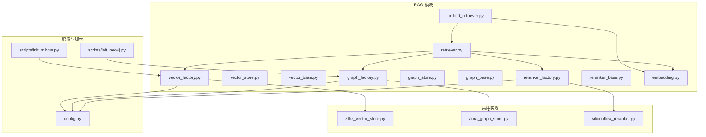
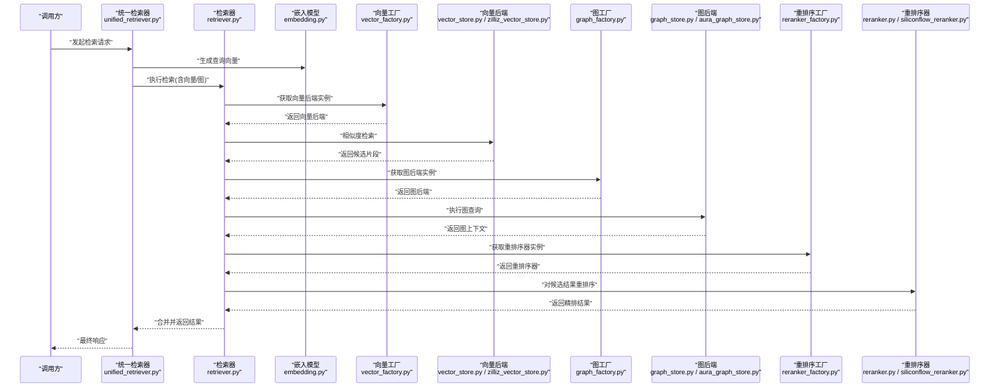
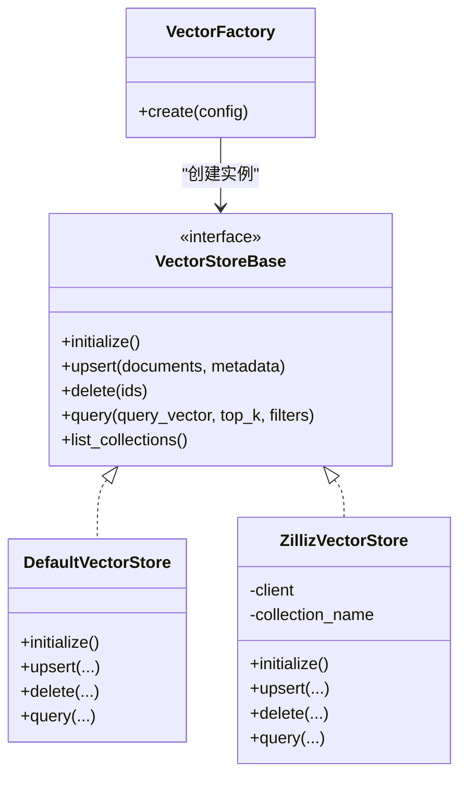
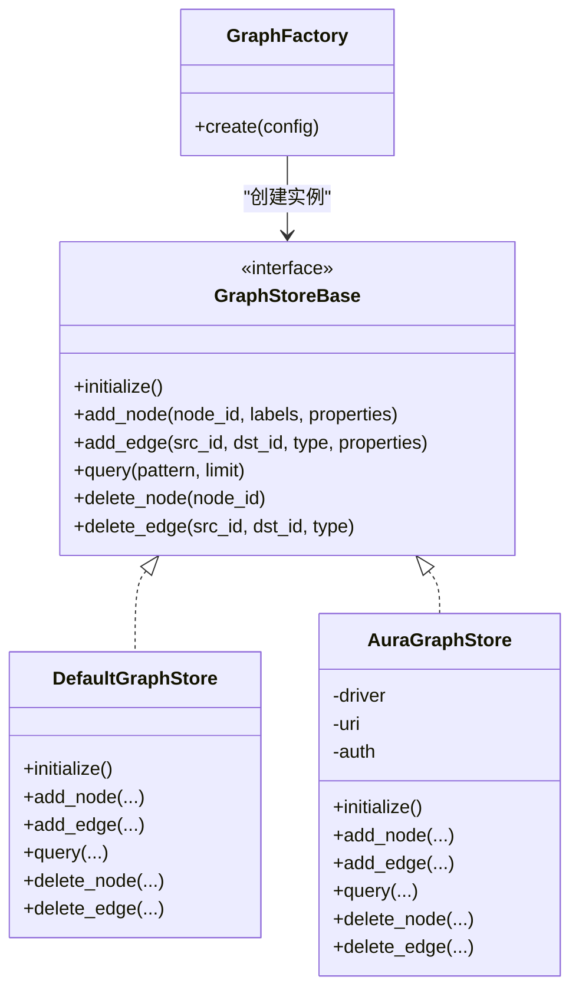
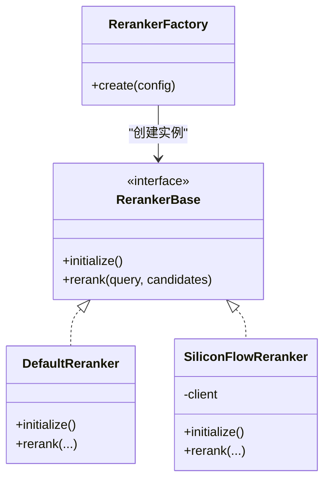
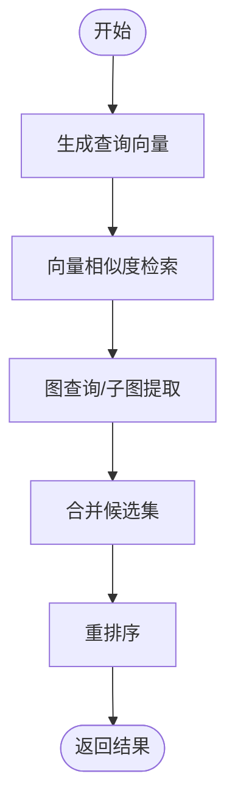
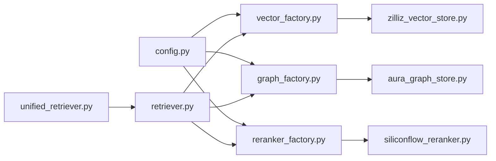

# RAG后端扩展

<cite>
**本文引用的文件**   
- [backend_design/nexus/rag/vector_base.py](file://backend_design/nexus/rag/vector_base.py)
- [backend_design/nexus/rag/vector_store.py](file://backend_design/nexus/rag/vector_store.py)
- [backend_design/nexus/rag/vector_factory.py](file://backend_design/nexus/rag/vector_factory.py)
- [backend_design/nexus/rag/zilliz_vector_store.py](file://backend_design/nexus/rag/zilliz_vector_store.py)
- [backend_design/nexus/rag/graph_base.py](file://backend_design/nexus/rag/graph_base.py)
- [backend_design/nexus/rag/graph_store.py](file://backend_design/nexus/rag/graph_store.py)
- [backend_design/nexus/rag/graph_factory.py](file://backend_design/nexus/rag/graph_factory.py)
- [backend_design/nexus/rag/aura_graph_store.py](file://backend_design/nexus/rag/aura_graph_store.py)
- [backend_design/nexus/rag/reranker_base.py](file://backend_design/nexus/rag/reranker_base.py)
- [backend_design/nexus/rag/reranker.py](file://backend_design/nexus/rag/reranker.py)
- [backend_design/nexus/rag/reranker_factory.py](file://backend_design/nexus/rag/reranker_factory.py)
- [backend_design/nexus/rag/siliconflow_reranker.py](file://backend_design/nexus/rag/siliconflow_reranker.py)
- [backend_design/nexus/rag/embedding.py](file://backend_design/nexus/rag/embedding.py)
- [backend_design/nexus/rag/retriever.py](file://backend_design/nexus/rag/retriever.py)
- [backend_design/nexus/rag/unified_retriever.py](file://backend_design/nexus/rag/unified_retriever.py)
- [backend_design/nexus/config.py](file://backend_design/nexus/config.py)
- [backend_design/scripts/init_milvus.py](file://backend_design/scripts/init_milvus.py)
- [backend_design/scripts/init_neo4j.py](file://backend_design/scripts/init_neo4j.py)
</cite>

## 目录
1. [简介](#简介)
2. [项目结构](#项目结构)
3. [核心组件](#核心组件)
4. [架构总览](#架构总览)
5. [详细组件分析](#详细组件分析)
6. [依赖关系分析](#依赖关系分析)
7. [性能考虑](#性能考虑)
8. [故障排查指南](#故障排查指南)
9. [结论](#结论)
10. [附录](#附录)

## 简介
本指南面向需要在 NexusCockpit 的 RAG（检索增强生成）链路中扩展自定义后端的工程师，覆盖以下目标：
- 实现自定义向量数据库后端、图数据库后端与重排序器
- 明确向量存储接口、图查询接口与重排序接口的定义
- 提供完整后端实现示例，涵盖 Milvus、Neo4j 等第三方服务集成
- 解释嵌入模型集成、索引策略与检索优化
- 说明后端配置管理、连接池管理与错误处理机制
- 给出 RAG 后端的测试方法与性能调优建议

## 项目结构
RAG 相关代码位于 backend_design/nexus/rag 目录下，采用“接口抽象 + 工厂注册 + 多实现”的分层设计：
- 接口层：定义统一的向量存储、图存储、重排序器与嵌入模型接口
- 实现层：提供 Zilliz/Milvus 向量库、Aura Graph Store（兼容 Neo4j）、SiliconFlow 重排序器等具体实现
- 编排层：统一检索器将向量检索、图检索与重排序组合为端到端流程
- 配置与脚本：集中式配置加载与初始化脚本

图表来源
- [backend_design/nexus/rag/vector_factory.py](file://backend_design/nexus/rag/vector_factory.py)
- [backend_design/nexus/rag/vector_store.py](file://backend_design/nexus/rag/vector_store.py)
- [backend_design/nexus/rag/vector_base.py](file://backend_design/nexus/rag/vector_base.py)
- [backend_design/nexus/rag/graph_factory.py](file://backend_design/nexus/rag/graph_factory.py)
- [backend_design/nexus/rag/graph_store.py](file://backend_design/nexus/rag/graph_store.py)
- [backend_design/nexus/rag/graph_base.py](file://backend_design/nexus/rag/graph_base.py)
- [backend_design/nexus/rag/reranker_factory.py](file://backend_design/nexus/rag/reranker_factory.py)
- [backend_design/nexus/rag/reranker_base.py](file://backend_design/nexus/rag/reranker_base.py)
- [backend_design/nexus/rag/retriever.py](file://backend_design/nexus/rag/retriever.py)
- [backend_design/nexus/rag/unified_retriever.py](file://backend_design/nexus/rag/unified_retriever.py)
- [backend_design/nexus/rag/embedding.py](file://backend_design/nexus/rag/embedding.py)
- [backend_design/nexus/rag/zilliz_vector_store.py](file://backend_design/nexus/rag/zilliz_vector_store.py)
- [backend_design/nexus/rag/aura_graph_store.py](file://backend_design/nexus/rag/aura_graph_store.py)
- [backend_design/nexus/rag/siliconflow_reranker.py](file://backend_design/nexus/rag/siliconflow_reranker.py)
- [backend_design/nexus/config.py](file://backend_design/nexus/config.py)
- [backend_design/scripts/init_milvus.py](file://backend_design/scripts/init_milvus.py)
- [backend_design/scripts/init_neo4j.py](file://backend_design/scripts/init_neo4j.py)

章节来源
- [backend_design/nexus/rag/vector_base.py](file://backend_design/nexus/rag/vector_base.py)
- [backend_design/nexus/rag/vector_store.py](file://backend_design/nexus/rag/vector_store.py)
- [backend_design/nexus/rag/vector_factory.py](file://backend_design/nexus/rag/vector_factory.py)
- [backend_design/nexus/rag/graph_base.py](file://backend_design/nexus/rag/graph_base.py)
- [backend_design/nexus/rag/graph_store.py](file://backend_design/nexus/rag/graph_store.py)
- [backend_design/nexus/rag/graph_factory.py](file://backend_design/nexus/rag/graph_factory.py)
- [backend_design/nexus/rag/reranker_base.py](file://backend_design/nexus/rag/reranker_base.py)
- [backend_design/nexus/rag/reranker.py](file://backend_design/nexus/rag/reranker.py)
- [backend_design/nexus/rag/reranker_factory.py](file://backend_design/nexus/rag/reranker_factory.py)
- [backend_design/nexus/rag/siliconflow_reranker.py](file://backend_design/nexus/rag/siliconflow_reranker.py)
- [backend_design/nexus/rag/embedding.py](file://backend_design/nexus/rag/embedding.py)
- [backend_design/nexus/rag/retriever.py](file://backend_design/nexus/rag/retriever.py)
- [backend_design/nexus/rag/unified_retriever.py](file://backend_design/nexus/rag/unified_retriever.py)
- [backend_design/nexus/config.py](file://backend_design/nexus/config.py)
- [backend_design/scripts/init_milvus.py](file://backend_design/scripts/init_milvus.py)
- [backend_design/scripts/init_neo4j.py](file://backend_design/scripts/init_neo4j.py)

## 核心组件
本节聚焦三大可插拔后端及其编排方式：
- 向量存储后端：负责文档向量化入库与相似度检索
- 图数据库后端：负责实体/关系图谱的构建与查询
- 重排序器：对候选结果进行二次精排，提升相关性

关键职责划分：
- 接口定义：在 vector_base、graph_base、reranker_base 中声明统一方法签名
- 工厂注册：通过 vector_factory、graph_factory、reranker_factory 按配置动态创建实例
- 编排调用：retriever 与 unified_retriever 串联向量检索、图检索与重排序
- 嵌入模型：embedding 提供文本到向量转换能力，供向量后端使用

章节来源
- [backend_design/nexus/rag/vector_base.py](file://backend_design/nexus/rag/vector_base.py)
- [backend_design/nexus/rag/graph_base.py](file://backend_design/nexus/rag/graph_base.py)
- [backend_design/nexus/rag/reranker_base.py](file://backend_design/nexus/rag/reranker_base.py)
- [backend_design/nexus/rag/vector_factory.py](file://backend_design/nexus/rag/vector_factory.py)
- [backend_design/nexus/rag/graph_factory.py](file://backend_design/nexus/rag/graph_factory.py)
- [backend_design/nexus/rag/reranker_factory.py](file://backend_design/nexus/rag/reranker_factory.py)
- [backend_design/nexus/rag/retriever.py](file://backend_design/nexus/rag/retriever.py)
- [backend_design/nexus/rag/unified_retriever.py](file://backend_design/nexus/rag/unified_retriever.py)
- [backend_design/nexus/rag/embedding.py](file://backend_design/nexus/rag/embedding.py)

## 架构总览
下图展示 RAG 后端扩展的整体架构与数据流。请求进入统一检索器后，依次触发嵌入模型、向量检索、图检索与重排序，最终返回融合后的结果。

图表来源
- [backend_design/nexus/rag/unified_retriever.py](file://backend_design/nexus/rag/unified_retriever.py)
- [backend_design/nexus/rag/retriever.py](file://backend_design/nexus/rag/retriever.py)
- [backend_design/nexus/rag/embedding.py](file://backend_design/nexus/rag/embedding.py)
- [backend_design/nexus/rag/vector_factory.py](file://backend_design/nexus/rag/vector_factory.py)
- [backend_design/nexus/rag/vector_store.py](file://backend_design/nexus/rag/vector_store.py)
- [backend_design/nexus/rag/zilliz_vector_store.py](file://backend_design/nexus/rag/zilliz_vector_store.py)
- [backend_design/nexus/rag/graph_factory.py](file://backend_design/nexus/rag/graph_factory.py)
- [backend_design/nexus/rag/graph_store.py](file://backend_design/nexus/rag/graph_store.py)
- [backend_design/nexus/rag/aura_graph_store.py](file://backend_design/nexus/rag/aura_graph_store.py)
- [backend_design/nexus/rag/reranker_factory.py](file://backend_design/nexus/rag/reranker_factory.py)
- [backend_design/nexus/rag/reranker.py](file://backend_design/nexus/rag/reranker.py)
- [backend_design/nexus/rag/siliconflow_reranker.py](file://backend_design/nexus/rag/siliconflow_reranker.py)

## 详细组件分析

### 向量存储后端
- 接口定义：在 vector_base 中声明集合/命名空间管理、写入、删除、相似度检索等方法签名
- 默认实现：vector_store 提供通用逻辑与适配层
- 具体实现：zilliz_vector_store 对接 Milvus/Zilliz Cloud，包含连接参数、索引类型、分区策略等
- 工厂注册：vector_factory 根据配置选择具体后端实例

图表来源
- [backend_design/nexus/rag/vector_base.py](file://backend_design/nexus/rag/vector_base.py)
- [backend_design/nexus/rag/vector_store.py](file://backend_design/nexus/rag/vector_store.py)
- [backend_design/nexus/rag/zilliz_vector_store.py](file://backend_design/nexus/rag/zilliz_vector_store.py)
- [backend_design/nexus/rag/vector_factory.py](file://backend_design/nexus/rag/vector_factory.py)

章节来源
- [backend_design/nexus/rag/vector_base.py](file://backend_design/nexus/rag/vector_base.py)
- [backend_design/nexus/rag/vector_store.py](file://backend_design/nexus/rag/vector_store.py)
- [backend_design/nexus/rag/zilliz_vector_store.py](file://backend_design/nexus/rag/zilliz_vector_store.py)
- [backend_design/nexus/rag/vector_factory.py](file://backend_design/nexus/rag/vector_factory.py)

### 图数据库后端
- 接口定义：在 graph_base 中声明节点/边操作、路径查询、子图提取等方法签名
- 默认实现：graph_store 提供通用适配与重试/超时封装
- 具体实现：aura_graph_store 对接 Aura/Neo4j，支持 Bolt 或 HTTP 协议、认证与连接池
- 工厂注册：graph_factory 根据配置选择具体后端实例

图表来源
- [backend_design/nexus/rag/graph_base.py](file://backend_design/nexus/rag/graph_base.py)
- [backend_design/nexus/rag/graph_store.py](file://backend_design/nexus/rag/graph_store.py)
- [backend_design/nexus/rag/aura_graph_store.py](file://backend_design/nexus/rag/aura_graph_store.py)
- [backend_design/nexus/rag/graph_factory.py](file://backend_design/nexus/rag/graph_factory.py)

章节来源
- [backend_design/nexus/rag/graph_base.py](file://backend_design/nexus/rag/graph_base.py)
- [backend_design/nexus/rag/graph_store.py](file://backend_design/nexus/rag/graph_store.py)
- [backend_design/nexus/rag/aura_graph_store.py](file://backend_design/nexus/rag/aura_graph_store.py)
- [backend_design/nexus/rag/graph_factory.py](file://backend_design/nexus/rag/graph_factory.py)

### 重排序器
- 接口定义：在 reranker_base 中声明接收候选列表与查询，返回排序后的结果
- 默认实现：reranker 提供通用逻辑与权重合并策略
- 具体实现：siliconflow_reranker 对接 SiliconFlow 在线重排序服务
- 工厂注册：reranker_factory 根据配置选择具体后端实例

图表来源
- [backend_design/nexus/rag/reranker_base.py](file://backend_design/nexus/rag/reranker_base.py)
- [backend_design/nexus/rag/reranker.py](file://backend_design/nexus/rag/reranker.py)
- [backend_design/nexus/rag/siliconflow_reranker.py](file://backend_design/nexus/rag/siliconflow_reranker.py)
- [backend_design/nexus/rag/reranker_factory.py](file://backend_design/nexus/rag/reranker_factory.py)

章节来源
- [backend_design/nexus/rag/reranker_base.py](file://backend_design/nexus/rag/reranker_base.py)
- [backend_design/nexus/rag/reranker.py](file://backend_design/nexus/rag/reranker.py)
- [backend_design/nexus/rag/siliconflow_reranker.py](file://backend_design/nexus/rag/siliconflow_reranker.py)
- [backend_design/nexus/rag/reranker_factory.py](file://backend_design/nexus/rag/reranker_factory.py)

### 嵌入模型集成
- embedding 模块提供文本到向量的统一入口，供向量后端与检索器使用
- 支持本地模型与远程 API 两种模式，可通过配置切换
- 建议在批量写入前缓存已计算向量，避免重复计算

章节来源
- [backend_design/nexus/rag/embedding.py](file://backend_design/nexus/rag/embedding.py)

### 检索编排与统一检索器
- retriever 串联向量检索与图检索，并将结果传递给重排序器
- unified_retriever 提供更高层的统一入口，屏蔽底层差异，便于上层调用

图表来源
- [backend_design/nexus/rag/retriever.py](file://backend_design/nexus/rag/retriever.py)
- [backend_design/nexus/rag/unified_retriever.py](file://backend_design/nexus/rag/unified_retriever.py)
- [backend_design/nexus/rag/embedding.py](file://backend_design/nexus/rag/embedding.py)

章节来源
- [backend_design/nexus/rag/retriever.py](file://backend_design/nexus/rag/retriever.py)
- [backend_design/nexus/rag/unified_retriever.py](file://backend_design/nexus/rag/unified_retriever.py)

## 依赖关系分析
- 低耦合：各后端通过接口解耦，工厂负责实例化，便于替换与扩展
- 高内聚：每个后端实现内部封装了特定服务的连接、重试与错误处理
- 外部依赖：Milvus/Zilliz、Neo4j/Aura、SiliconFlow 等第三方服务通过各自实现接入

图表来源
- [backend_design/nexus/config.py](file://backend_design/nexus/config.py)
- [backend_design/nexus/rag/vector_factory.py](file://backend_design/nexus/rag/vector_factory.py)
- [backend_design/nexus/rag/graph_factory.py](file://backend_design/nexus/rag/graph_factory.py)
- [backend_design/nexus/rag/reranker_factory.py](file://backend_design/nexus/rag/reranker_factory.py)
- [backend_design/nexus/rag/zilliz_vector_store.py](file://backend_design/nexus/rag/zilliz_vector_store.py)
- [backend_design/nexus/rag/aura_graph_store.py](file://backend_design/nexus/rag/aura_graph_store.py)
- [backend_design/nexus/rag/siliconflow_reranker.py](file://backend_design/nexus/rag/siliconflow_reranker.py)
- [backend_design/nexus/rag/unified_retriever.py](file://backend_design/nexus/rag/unified_retriever.py)
- [backend_design/nexus/rag/retriever.py](file://backend_design/nexus/rag/retriever.py)

章节来源
- [backend_design/nexus/config.py](file://backend_design/nexus/config.py)
- [backend_design/nexus/rag/vector_factory.py](file://backend_design/nexus/rag/vector_factory.py)
- [backend_design/nexus/rag/graph_factory.py](file://backend_design/nexus/rag/graph_factory.py)
- [backend_design/nexus/rag/reranker_factory.py](file://backend_design/nexus/rag/reranker_factory.py)
- [backend_design/nexus/rag/zilliz_vector_store.py](file://backend_design/nexus/rag/zilliz_vector_store.py)
- [backend_design/nexus/rag/aura_graph_store.py](file://backend_design/nexus/rag/aura_graph_store.py)
- [backend_design/nexus/rag/siliconflow_reranker.py](file://backend_design/nexus/rag/siliconflow_reranker.py)
- [backend_design/nexus/rag/unified_retriever.py](file://backend_design/nexus/rag/unified_retriever.py)
- [backend_design/nexus/rag/retriever.py](file://backend_design/nexus/rag/retriever.py)

## 性能考虑
- 向量检索
  - 选择合适的索引类型（如 HNSW、IVF_FLAT），平衡召回率与延迟
  - 合理设置 top_k 与过滤条件，减少不必要的扫描
  - 批量 upsert 时控制批次大小，避免单次过大导致抖动
- 图查询
  - 限制查询深度与返回数量，避免全图遍历
  - 利用标签与属性索引，缩小搜索空间
  - 连接池复用，减少握手开销
- 重排序
  - 仅在必要场景启用在线重排序，必要时降级为规则排序
  - 缓存热门查询的重排序结果，降低网络与模型开销
- 嵌入模型
  - 批量编码与异步并发，提高吞吐
  - 对短文本与长文本分别建模，提升精度与效率

[本节为通用指导，不直接分析具体文件]

## 故障排查指南
- 连接失败
  - 检查向量/图后端配置项（地址、端口、认证信息）
  - 确认网络连通性与防火墙策略
  - 查看初始化脚本是否成功创建集合/Schema
- 超时与重试
  - 调整后端客户端的超时与重试次数
  - 观察日志中的重试与熔断行为
- 资源不足
  - 监控 CPU/GPU/内存占用，评估是否需要扩容
  - 调整批大小与并发度，避免雪崩
- 结果质量
  - 调整 top_k、阈值与重排序权重
  - 检查嵌入模型版本与维度一致性

章节来源
- [backend_design/scripts/init_milvus.py](file://backend_design/scripts/init_milvus.py)
- [backend_design/scripts/init_neo4j.py](file://backend_design/scripts/init_neo4j.py)

## 结论
通过接口抽象与工厂注册，NexusCockpit 的 RAG 后端具备良好的可扩展性。开发者可按需替换向量库、图数据库与重排序器，并通过统一检索器获得一致的调用体验。配合合理的索引策略、连接池与错误处理机制，可在保证性能的同时提升系统稳定性。

[本节为总结性内容，不直接分析具体文件]

## 附录

### 如何添加自定义向量后端
- 步骤
  - 在 vector_base 定义的接口基础上，新建类实现 initialize、upsert、delete、query 等方法
  - 在 vector_factory 中注册新后端名称与构造函数映射
  - 在 config.py 中添加对应配置项（如地址、认证、索引参数）
  - 使用 init_milvus.py 的思路编写对应初始化脚本，确保集合/Schema 存在
- 注意事项
  - 保持方法签名一致，确保检索器无需修改即可工作
  - 做好异常捕获与错误码映射，便于上层统一处理

章节来源
- [backend_design/nexus/rag/vector_base.py](file://backend_design/nexus/rag/vector_base.py)
- [backend_design/nexus/rag/vector_factory.py](file://backend_design/nexus/rag/vector_factory.py)
- [backend_design/nexus/config.py](file://backend_design/nexus/config.py)
- [backend_design/scripts/init_milvus.py](file://backend_design/scripts/init_milvus.py)

### 如何添加自定义图数据库后端
- 步骤
  - 在 graph_base 定义的接口基础上，新建类实现节点/边操作与查询方法
  - 在 graph_factory 中注册新后端名称与构造函数映射
  - 在 config.py 中添加连接参数（URI、用户名、密码、连接池大小等）
  - 参考 init_neo4j.py 编写 Schema 初始化脚本
- 注意事项
  - 注意事务与幂等性，避免重复写入
  - 对大规模图查询增加限流与超时保护

章节来源
- [backend_design/nexus/rag/graph_base.py](file://backend_design/nexus/rag/graph_base.py)
- [backend_design/nexus/rag/graph_factory.py](file://backend_design/nexus/rag/graph_factory.py)
- [backend_design/nexus/config.py](file://backend_design/nexus/config.py)
- [backend_design/scripts/init_neo4j.py](file://backend_design/scripts/init_neo4j.py)

### 如何添加自定义重排序器
- 步骤
  - 在 reranker_base 定义的接口基础上，新建类实现 rerank 方法
  - 在 reranker_factory 中注册新重排序器名称与构造函数映射
  - 在 config.py 中添加重排序器配置（如 API Key、模型名、权重）
- 注意事项
  - 在线重排序需考虑网络抖动与超时，建议加入重试与降级策略
  - 对高频查询做缓存，降低延迟与成本

章节来源
- [backend_design/nexus/rag/reranker_base.py](file://backend_design/nexus/rag/reranker_base.py)
- [backend_design/nexus/rag/reranker_factory.py](file://backend_design/nexus/rag/reranker_factory.py)
- [backend_design/nexus/config.py](file://backend_design/nexus/config.py)

### 测试方法与基准
- 单元测试
  - 针对各后端实现编写最小可用用例，验证 upsert/query/delete 基本流程
  - 模拟网络异常与超时，验证重试与熔断逻辑
- 集成测试
  - 使用 init_milvus.py 与 init_neo4j.py 准备环境
  - 通过 retriever 与 unified_retriever 端到端验证检索链路
- 性能基准
  - 固定数据集与查询分布，测量 P95/P99 延迟与吞吐
  - 对比不同索引、top_k、重排序开关下的指标变化

章节来源
- [backend_design/scripts/init_milvus.py](file://backend_design/scripts/init_milvus.py)
- [backend_design/scripts/init_neo4j.py](file://backend_design/scripts/init_neo4j.py)
- [backend_design/nexus/rag/retriever.py](file://backend_design/nexus/rag/retriever.py)
- [backend_design/nexus/rag/unified_retriever.py](file://backend_design/nexus/rag/unified_retriever.py)