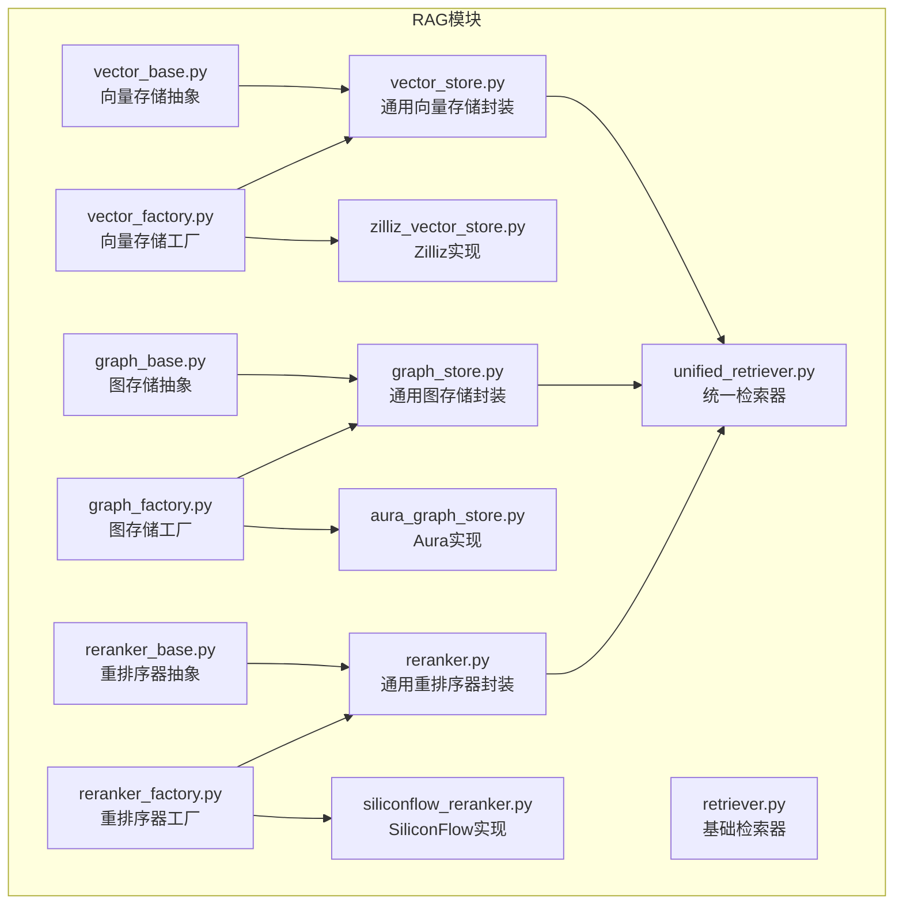
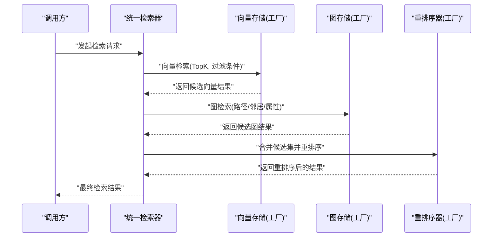
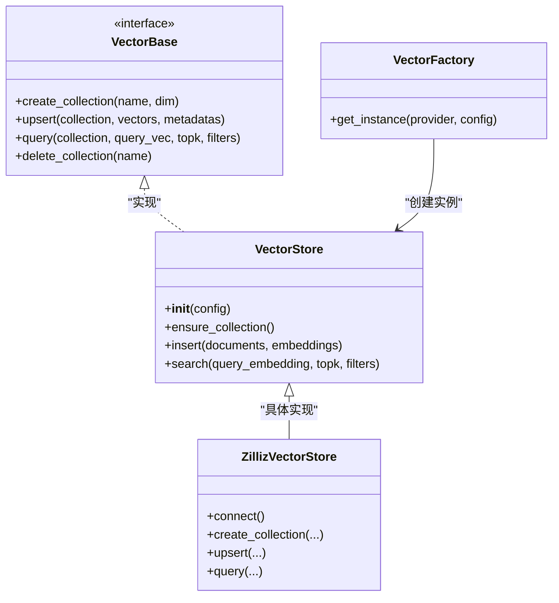
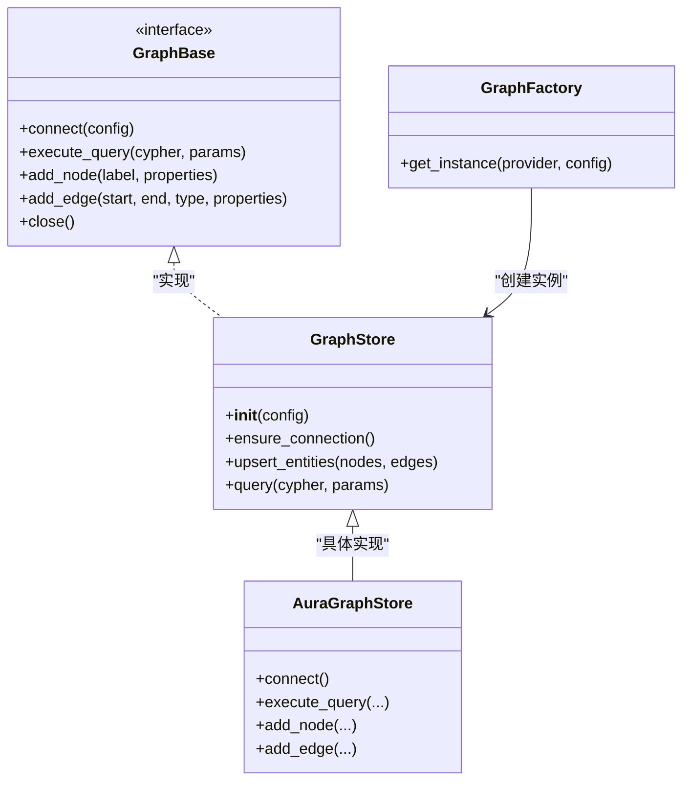
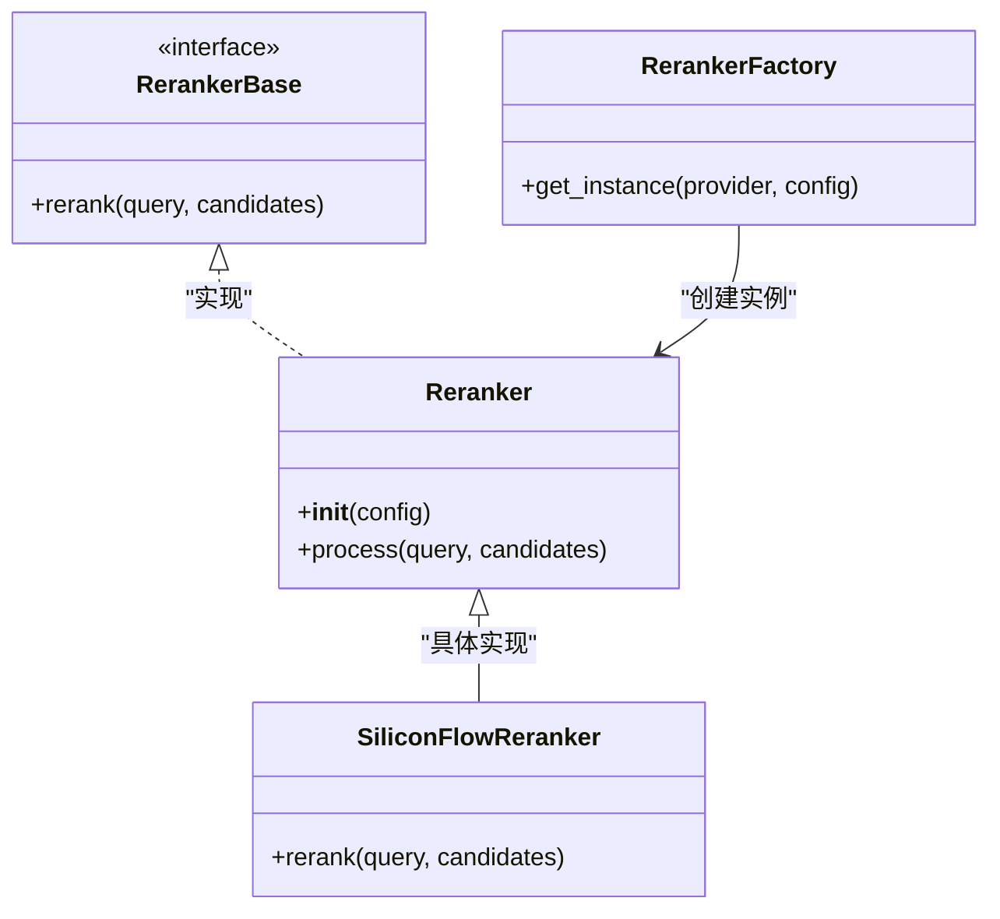
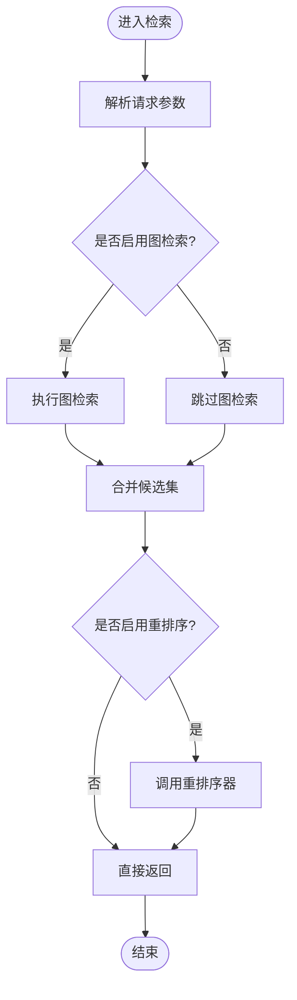
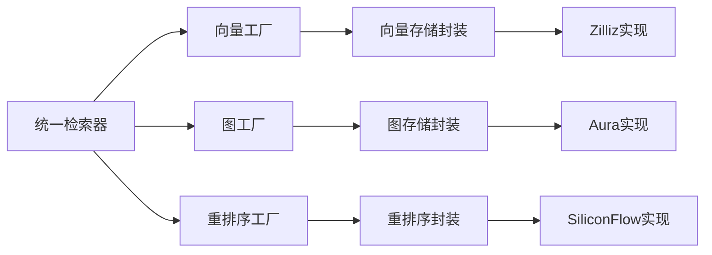

# RAG后端集成

<cite>
**本文引用的文件**   
- [backend_design/nexus/rag/__init__.py](file://backend_design/nexus/rag/__init__.py)
- [backend_design/nexus/rag/vector_base.py](file://backend_design/nexus/rag/vector_base.py)
- [backend_design/nexus/rag/vector_store.py](file://backend_design/nexus/rag/vector_store.py)
- [backend_design/nexus/rag/vector_factory.py](file://backend_design/nexus/rag/vector_factory.py)
- [backend_design/nexus/rag/zilliz_vector_store.py](file://backend_design/nexus/rag/zilliz_vector_store.py)
- [backend_design/nexus/rag/graph_base.py](file://backend_design/nexus/rag/graph_base.py)
- [backend_design/nexus/rag/graph_store.py](file://backend_design/nexus/rag/graph_store.py)
- [backend_design/nexus/rag/graph_factory.py](file://backend_design/nexus/rag/graph_factory.py)
- [backend_design/nexus/rag/aura_graph_store.py](file://backend_design/nexus/rag/aura_graph_store.py)
- [backend_design/nexus/rag/reranker_base.py](file://backend_design/nexus/rag/reranker_base.py)
- [backend_design/nexus/rag/reranker.py](file://backend_design/nexus/rag/reranker.py)
- [backend_design/nexus/rag/reranker_factory.py](file://backend_design/nexus/rag/reranker_factory.py)
- [backend_design/nexus/rag/siliconflow_reranker.py](file://backend_design/nexus/rag/siliconflow_reranker.py)
- [backend_design/nexus/rag/retriever.py](file://backend_design/nexus/rag/retriever.py)
- [backend_design/nexus/rag/unified_retriever.py](file://backend_design/nexus/rag/unified_retriever.py)
- [backend_design/nexus/config.py](file://backend_design/nexus/config.py)
- [backend_design/scripts/init_milvus.py](file://backend_design/scripts/init_milvus.py)
- [backend_design/scripts/init_neo4j.py](file://backend_design/scripts/init_neo4j.py)
</cite>

## 目录
1. [简介](#简介)
2. [项目结构](#项目结构)
3. [核心组件](#核心组件)
4. [架构总览](#架构总览)
5. [详细组件分析](#详细组件分析)
6. [依赖关系分析](#依赖关系分析)
7. [性能考虑](#性能考虑)
8. [故障恢复与容错](#故障恢复与容错)
9. [第三方RAG后端集成指南](#第三方rag后端集成指南)
10. [配置与示例](#配置与示例)
11. [结论](#结论)

## 简介
本指南面向需要在系统中接入不同RAG后端的开发者，围绕向量数据库、图数据库与重排序器的抽象接口设计展开，详细说明工厂模式与动态加载机制的实现原理，并提供从索引构建、检索优化到结果重排序的完整集成流程。文档同时给出不同后端的技术特性与适用场景建议、性能调优与故障恢复策略，以及具体的集成示例与配置方法。

## 项目结构
RAG相关代码集中在 backend_design/nexus/rag 目录下，采用“抽象接口 + 具体实现 + 工厂”的分层组织方式：
- 抽象接口层：定义统一的向量存储、图存储与重排序器接口
- 具体实现层：提供Zilliz向量库、Aura图存储、SiliconFlow重排序器等实现
- 工厂与统一入口：通过工厂类与统一检索器屏蔽底层差异，支持运行时选择与扩展

图表来源
- [backend_design/nexus/rag/vector_base.py](file://backend_design/nexus/rag/vector_base.py)
- [backend_design/nexus/rag/vector_store.py](file://backend_design/nexus/rag/vector_store.py)
- [backend_design/nexus/rag/vector_factory.py](file://backend_design/nexus/rag/vector_factory.py)
- [backend_design/nexus/rag/zilliz_vector_store.py](file://backend_design/nexus/rag/zilliz_vector_store.py)
- [backend_design/nexus/rag/graph_base.py](file://backend_design/nexus/rag/graph_base.py)
- [backend_design/nexus/rag/graph_store.py](file://backend_design/nexus/rag/graph_store.py)
- [backend_design/nexus/rag/graph_factory.py](file://backend_design/nexus/rag/graph_factory.py)
- [backend_design/nexus/rag/aura_graph_store.py](file://backend_design/nexus/rag/aura_graph_store.py)
- [backend_design/nexus/rag/reranker_base.py](file://backend_design/nexus/rag/reranker_base.py)
- [backend_design/nexus/rag/reranker.py](file://backend_design/nexus/rag/reranker.py)
- [backend_design/nexus/rag/reranker_factory.py](file://backend_design/nexus/rag/reranker_factory.py)
- [backend_design/nexus/rag/siliconflow_reranker.py](file://backend_design/nexus/rag/siliconflow_reranker.py)
- [backend_design/nexus/rag/retriever.py](file://backend_design/nexus/rag/retriever.py)
- [backend_design/nexus/rag/unified_retriever.py](file://backend_design/nexus/rag/unified_retriever.py)

章节来源
- [backend_design/nexus/rag/__init__.py](file://backend_design/nexus/rag/__init__.py)

## 核心组件
- 向量存储抽象与实现
  - 抽象接口：定义集合管理、向量化写入、相似度检索等能力
  - 通用封装：提供默认参数、错误处理与日志记录
  - 工厂与动态加载：根据配置选择具体实现（如Zilliz）
- 图存储抽象与实现
  - 抽象接口：定义节点/边操作、查询执行等能力
  - 通用封装：统一连接管理与事务边界
  - 工厂与动态加载：根据配置选择具体实现（如Aura）
- 重排序器抽象与实现
  - 抽象接口：定义对候选结果进行相关性重排的能力
  - 通用封装：统一输入输出格式与异常处理
  - 工厂与动态加载：根据配置选择具体实现（如SiliconFlow）
- 统一检索器
  - 组合向量与图检索，并可选调用重排序器进行最终排序
  - 暴露一致的检索API给上层业务

章节来源
- [backend_design/nexus/rag/vector_base.py](file://backend_design/nexus/rag/vector_base.py)
- [backend_design/nexus/rag/vector_store.py](file://backend_design/nexus/rag/vector_store.py)
- [backend_design/nexus/rag/vector_factory.py](file://backend_design/nexus/rag/vector_factory.py)
- [backend_design/nexus/rag/zilliz_vector_store.py](file://backend_design/nexus/rag/zilliz_vector_store.py)
- [backend_design/nexus/rag/graph_base.py](file://backend_design/nexus/rag/graph_base.py)
- [backend_design/nexus/rag/graph_store.py](file://backend_design/nexus/rag/graph_store.py)
- [backend_design/nexus/rag/graph_factory.py](file://backend_design/nexus/rag/graph_factory.py)
- [backend_design/nexus/rag/aura_graph_store.py](file://backend_design/nexus/rag/aura_graph_store.py)
- [backend_design/nexus/rag/reranker_base.py](file://backend_design/nexus/rag/reranker_base.py)
- [backend_design/nexus/rag/reranker.py](file://backend_design/nexus/rag/reranker.py)
- [backend_design/nexus/rag/reranker_factory.py](file://backend_design/nexus/rag/reranker_factory.py)
- [backend_design/nexus/rag/siliconflow_reranker.py](file://backend_design/nexus/rag/siliconflow_reranker.py)
- [backend_design/nexus/rag/unified_retriever.py](file://backend_design/nexus/rag/unified_retriever.py)

## 架构总览
下图展示了RAG检索链路中各组件的交互关系：统一检索器协调向量与图检索，并在需要时调用重排序器提升最终结果质量。

图表来源
- [backend_design/nexus/rag/unified_retriever.py](file://backend_design/nexus/rag/unified_retriever.py)
- [backend_design/nexus/rag/vector_factory.py](file://backend_design/nexus/rag/vector_factory.py)
- [backend_design/nexus/rag/graph_factory.py](file://backend_design/nexus/rag/graph_factory.py)
- [backend_design/nexus/rag/reranker_factory.py](file://backend_design/nexus/rag/reranker_factory.py)

## 详细组件分析

### 向量存储组件
- 抽象接口
  - 定义集合创建/删除、批量插入、按向量相似度检索、元数据过滤等能力
- 通用封装
  - 提供默认参数校验、重试与超时控制、指标埋点与日志
- 工厂与动态加载
  - 通过配置项选择具体实现；支持在运行时注册新实现
- 典型实现
  - Zilliz向量库：面向大规模高维向量检索，适合海量文档片段与实时在线检索

图表来源
- [backend_design/nexus/rag/vector_base.py](file://backend_design/nexus/rag/vector_base.py)
- [backend_design/nexus/rag/vector_store.py](file://backend_design/nexus/rag/vector_store.py)
- [backend_design/nexus/rag/vector_factory.py](file://backend_design/nexus/rag/vector_factory.py)
- [backend_design/nexus/rag/zilliz_vector_store.py](file://backend_design/nexus/rag/zilliz_vector_store.py)

章节来源
- [backend_design/nexus/rag/vector_base.py](file://backend_design/nexus/rag/vector_base.py)
- [backend_design/nexus/rag/vector_store.py](file://backend_design/nexus/rag/vector_store.py)
- [backend_design/nexus/rag/vector_factory.py](file://backend_design/nexus/rag/vector_factory.py)
- [backend_design/nexus/rag/zilliz_vector_store.py](file://backend_design/nexus/rag/zilliz_vector_store.py)

### 图存储组件
- 抽象接口
  - 定义节点/边增删改查、Cypher或原生查询执行、事务与连接管理
- 通用封装
  - 统一连接池、失败重试、查询超时与结果标准化
- 工厂与动态加载
  - 根据配置选择具体实现；支持热切换
- 典型实现
  - Aura图存储：基于云托管Neo4j服务，适合复杂关系推理与多跳检索

图表来源
- [backend_design/nexus/rag/graph_base.py](file://backend_design/nexus/rag/graph_base.py)
- [backend_design/nexus/rag/graph_store.py](file://backend_design/nexus/rag/graph_store.py)
- [backend_design/nexus/rag/graph_factory.py](file://backend_design/nexus/rag/graph_factory.py)
- [backend_design/nexus/rag/aura_graph_store.py](file://backend_design/nexus/rag/aura_graph_store.py)

章节来源
- [backend_design/nexus/rag/graph_base.py](file://backend_design/nexus/rag/graph_base.py)
- [backend_design/nexus/rag/graph_store.py](file://backend_design/nexus/rag/graph_store.py)
- [backend_design/nexus/rag/graph_factory.py](file://backend_design/nexus/rag/graph_factory.py)
- [backend_design/nexus/rag/aura_graph_store.py](file://backend_design/nexus/rag/aura_graph_store.py)

### 重排序器组件
- 抽象接口
  - 定义对候选结果进行相关性打分与排序的能力
- 通用封装
  - 统一输入输出格式、并发控制与降级策略
- 工厂与动态加载
  - 根据配置选择具体实现；支持按需启用
- 典型实现
  - SiliconFlow重排序器：基于云端模型的重排序服务，适合高精度排序需求

图表来源
- [backend_design/nexus/rag/reranker_base.py](file://backend_design/nexus/rag/reranker_base.py)
- [backend_design/nexus/rag/reranker.py](file://backend_design/nexus/rag/reranker.py)
- [backend_design/nexus/rag/reranker_factory.py](file://backend_design/nexus/rag/reranker_factory.py)
- [backend_design/nexus/rag/siliconflow_reranker.py](file://backend_design/nexus/rag/siliconflow_reranker.py)

章节来源
- [backend_design/nexus/rag/reranker_base.py](file://backend_design/nexus/rag/reranker_base.py)
- [backend_design/nexus/rag/reranker.py](file://backend_design/nexus/rag/reranker.py)
- [backend_design/nexus/rag/reranker_factory.py](file://backend_design/nexus/rag/reranker_factory.py)
- [backend_design/nexus/rag/siliconflow_reranker.py](file://backend_design/nexus/rag/siliconflow_reranker.py)

### 统一检索器
- 职责
  - 协调向量与图检索，合并候选集，调用重排序器进行最终排序
  - 提供一致的上层API，屏蔽底层实现差异
- 关键流程
  - 解析请求参数
  - 并行触发向量与图检索
  - 去重与融合
  - 可选重排序
  - 返回最终结果

图表来源
- [backend_design/nexus/rag/unified_retriever.py](file://backend_design/nexus/rag/unified_retriever.py)

章节来源
- [backend_design/nexus/rag/unified_retriever.py](file://backend_design/nexus/rag/unified_retriever.py)

## 依赖关系分析
- 组件耦合
  - 统一检索器依赖三个工厂：向量、图、重排序器
  - 工厂负责根据配置创建具体实现，降低上层耦合度
- 外部依赖
  - 向量端：Zilliz客户端
  - 图端：Neo4j/Aura客户端
  - 重排序端：SiliconFlow API客户端
- 潜在循环依赖
  - 当前分层清晰，未见循环导入风险

图表来源
- [backend_design/nexus/rag/unified_retriever.py](file://backend_design/nexus/rag/unified_retriever.py)
- [backend_design/nexus/rag/vector_factory.py](file://backend_design/nexus/rag/vector_factory.py)
- [backend_design/nexus/rag/graph_factory.py](file://backend_design/nexus/rag/graph_factory.py)
- [backend_design/nexus/rag/reranker_factory.py](file://backend_design/nexus/rag/reranker_factory.py)

章节来源
- [backend_design/nexus/rag/unified_retriever.py](file://backend_design/nexus/rag/unified_retriever.py)
- [backend_design/nexus/rag/vector_factory.py](file://backend_design/nexus/rag/vector_factory.py)
- [backend_design/nexus/rag/graph_factory.py](file://backend_design/nexus/rag/graph_factory.py)
- [backend_design/nexus/rag/reranker_factory.py](file://backend_design/nexus/rag/reranker_factory.py)

## 性能考虑
- 向量检索
  - 合理设置TopK与过滤条件，减少网络与计算开销
  - 使用批量写入与预建索引，提高吞吐
  - 调整相似度阈值与召回率平衡
- 图检索
  - 限制查询深度与返回规模，避免全图扫描
  - 利用索引与约束加速匹配
- 重排序
  - 仅在必要时启用，避免增加端到端延迟
  - 对候选集进行裁剪后再送入重排序器
- 并发与缓存
  - 向量与图检索可并行执行
  - 对热点查询结果做短期缓存

[本节为通用指导，不直接分析具体文件]

## 故障恢复与容错
- 连接与重试
  - 对向量与图连接建立失败进行指数退避重试
  - 对重排序器网络异常进行快速失败与降级
- 熔断与降级
  - 当重排序器持续失败时自动关闭并重定向至无重排序路径
  - 图检索失败时回退到仅向量检索
- 幂等与一致性
  - 批量写入需具备幂等性，避免重复插入
  - 图事务保证原子性，失败时回滚

章节来源
- [backend_design/nexus/rag/vector_store.py](file://backend_design/nexus/rag/vector_store.py)
- [backend_design/nexus/rag/graph_store.py](file://backend_design/nexus/rag/graph_store.py)
- [backend_design/nexus/rag/reranker.py](file://backend_design/nexus/rag/reranker.py)

## 第三方RAG后端集成指南

### 新增向量存储后端
- 步骤
  - 在抽象接口中确认所需方法签名
  - 实现具体类，遵循通用封装的错误处理与日志规范
  - 在工厂中注册新提供者名称与构造逻辑
  - 更新配置以选择新提供者
- 注意事项
  - 确保维度、集合命名与元数据结构与现有约定一致
  - 提供初始化脚本用于环境准备

章节来源
- [backend_design/nexus/rag/vector_base.py](file://backend_design/nexus/rag/vector_base.py)
- [backend_design/nexus/rag/vector_store.py](file://backend_design/nexus/rag/vector_store.py)
- [backend_design/nexus/rag/vector_factory.py](file://backend_design/nexus/rag/vector_factory.py)
- [backend_design/nexus/rag/zilliz_vector_store.py](file://backend_design/nexus/rag/zilliz_vector_store.py)
- [backend_design/scripts/init_milvus.py](file://backend_design/scripts/init_milvus.py)

### 新增图存储后端
- 步骤
  - 在图抽象接口中补充必要方法
  - 实现具体类，适配目标图数据库驱动
  - 在图工厂中注册新提供者
  - 提供初始化脚本与迁移工具
- 注意事项
  - 注意连接池与事务边界
  - 对Cypher或原生查询进行安全校验

章节来源
- [backend_design/nexus/rag/graph_base.py](file://backend_design/nexus/rag/graph_base.py)
- [backend_design/nexus/rag/graph_store.py](file://backend_design/nexus/rag/graph_store.py)
- [backend_design/nexus/rag/graph_factory.py](file://backend_design/nexus/rag/graph_factory.py)
- [backend_design/nexus/rag/aura_graph_store.py](file://backend_design/nexus/rag/aura_graph_store.py)
- [backend_design/scripts/init_neo4j.py](file://backend_design/scripts/init_neo4j.py)

### 新增重排序器后端
- 步骤
  - 在重排序抽象接口中定义rerank方法
  - 实现具体类，处理鉴权、超时与错误码
  - 在重排序工厂中注册新提供者
  - 在统一检索器中按需启用
- 注意事项
  - 控制候选集大小以降低延迟
  - 提供本地降级策略（如规则排序）

章节来源
- [backend_design/nexus/rag/reranker_base.py](file://backend_design/nexus/rag/reranker_base.py)
- [backend_design/nexus/rag/reranker.py](file://backend_design/nexus/rag/reranker.py)
- [backend_design/nexus/rag/reranker_factory.py](file://backend_design/nexus/rag/reranker_factory.py)
- [backend_design/nexus/rag/siliconflow_reranker.py](file://backend_design/nexus/rag/siliconflow_reranker.py)

### 数据索引与检索优化
- 索引构建
  - 批量写入向量与图实体，建立必要索引
  - 对高频过滤字段建立索引
- 检索优化
  - 调整TopK与相似度阈值
  - 使用预取与并行化
  - 对热点数据进行缓存

章节来源
- [backend_design/nexus/rag/unified_retriever.py](file://backend_design/nexus/rag/unified_retriever.py)
- [backend_design/nexus/rag/vector_store.py](file://backend_design/nexus/rag/vector_store.py)
- [backend_design/nexus/rag/graph_store.py](file://backend_design/nexus/rag/graph_store.py)

### 结果重排序
- 何时启用
  - 对召回质量要求较高且可接受额外延迟的场景
- 如何配置
  - 在配置中指定重排序提供者与参数
  - 在统一检索器中开启重排序开关

章节来源
- [backend_design/nexus/rag/reranker.py](file://backend_design/nexus/rag/reranker.py)
- [backend_design/nexus/rag/unified_retriever.py](file://backend_design/nexus/rag/unified_retriever.py)

### 不同后端的技术特性与适用场景
- 向量存储
  - Zilliz：高吞吐、低延迟、水平扩展，适合海量文档片段检索
- 图存储
  - Aura（Neo4j）：强一致、复杂关系查询，适合知识图谱与多跳推理
- 重排序器
  - SiliconFlow：云端高精度排序，适合对相关性敏感的业务

章节来源
- [backend_design/nexus/rag/zilliz_vector_store.py](file://backend_design/nexus/rag/zilliz_vector_store.py)
- [backend_design/nexus/rag/aura_graph_store.py](file://backend_design/nexus/rag/aura_graph_store.py)
- [backend_design/nexus/rag/siliconflow_reranker.py](file://backend_design/nexus/rag/siliconflow_reranker.py)

## 配置与示例

### 配置要点
- 提供者选择
  - 在配置中指定向量、图与重排序器的提供者名称
- 连接参数
  - 填写地址、认证信息、超时与重试策略
- 功能开关
  - 是否启用图检索与重排序
  - TopK、相似度阈值等检索参数

章节来源
- [backend_design/nexus/config.py](file://backend_design/nexus/config.py)
- [backend_design/nexus/rag/vector_factory.py](file://backend_design/nexus/rag/vector_factory.py)
- [backend_design/nexus/rag/graph_factory.py](file://backend_design/nexus/rag/graph_factory.py)
- [backend_design/nexus/rag/reranker_factory.py](file://backend_design/nexus/rag/reranker_factory.py)

### 初始化脚本
- 向量库初始化
  - 使用脚本创建集合与索引
- 图数据库初始化
  - 使用脚本创建节点、边与索引

章节来源
- [backend_design/scripts/init_milvus.py](file://backend_design/scripts/init_milvus.py)
- [backend_design/scripts/init_neo4j.py](file://backend_design/scripts/init_neo4j.py)

### 集成示例（调用流程）
- 启动应用并加载配置
- 通过统一检索器发起检索
- 观察日志与指标，验证端到端延迟与召回质量

章节来源
- [backend_design/nexus/rag/unified_retriever.py](file://backend_design/nexus/rag/unified_retriever.py)
- [backend_design/nexus/config.py](file://backend_design/nexus/config.py)

## 结论
本指南围绕RAG后端的抽象接口设计与工厂模式展开，提供了向量、图与重排序器的统一接入方案。通过统一检索器屏蔽底层差异，结合配置与动态加载机制，开发者可以灵活替换与扩展后端实现。在生产环境中，应重视性能调优与故障恢复策略，确保系统在高负载与异常条件下的稳定性与可用性。