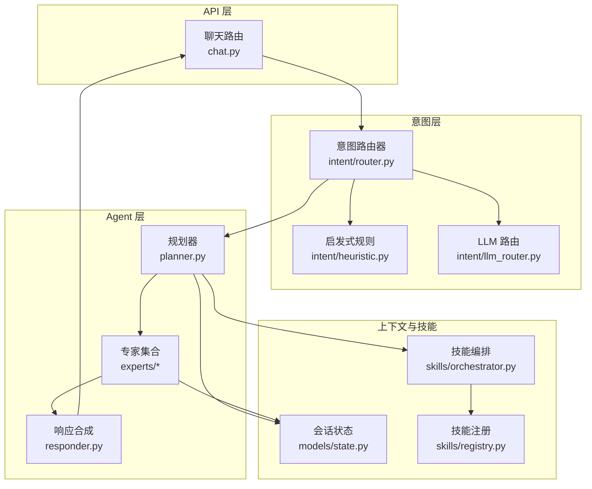
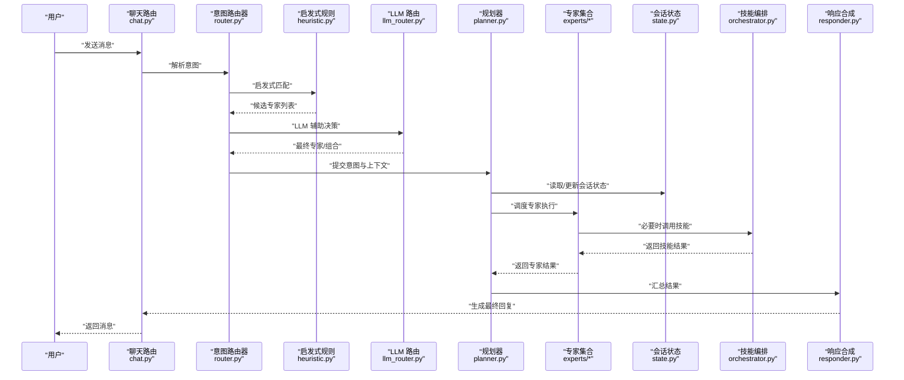
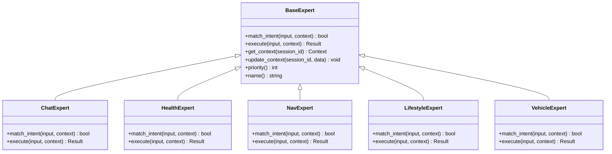
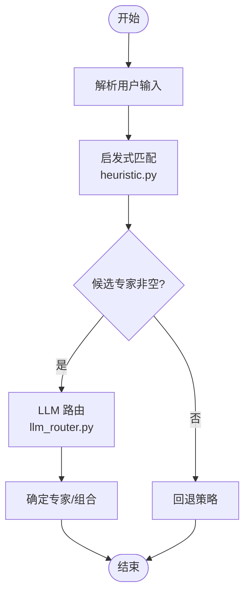
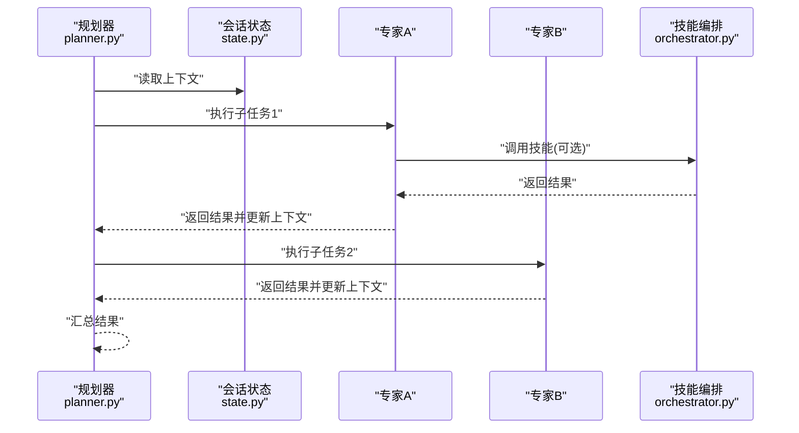
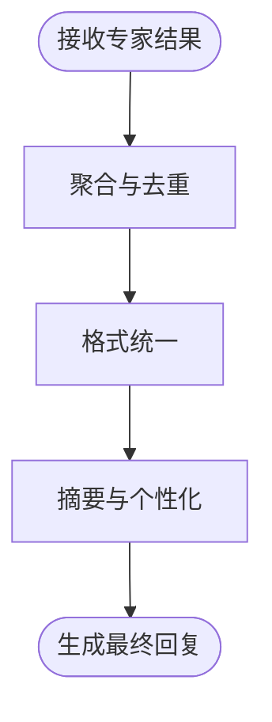
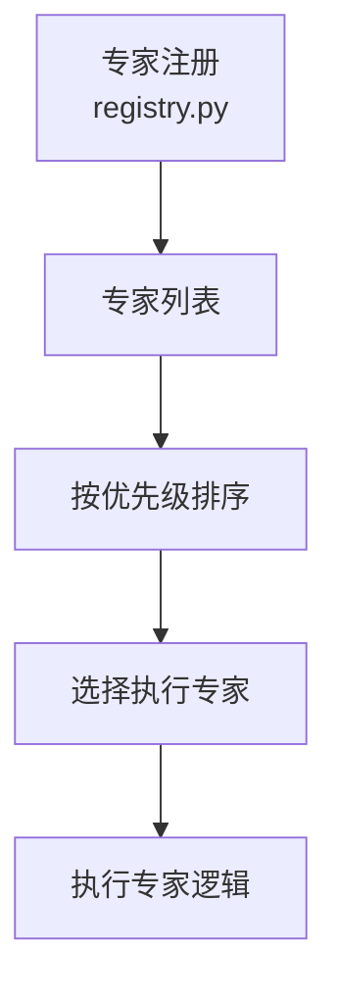
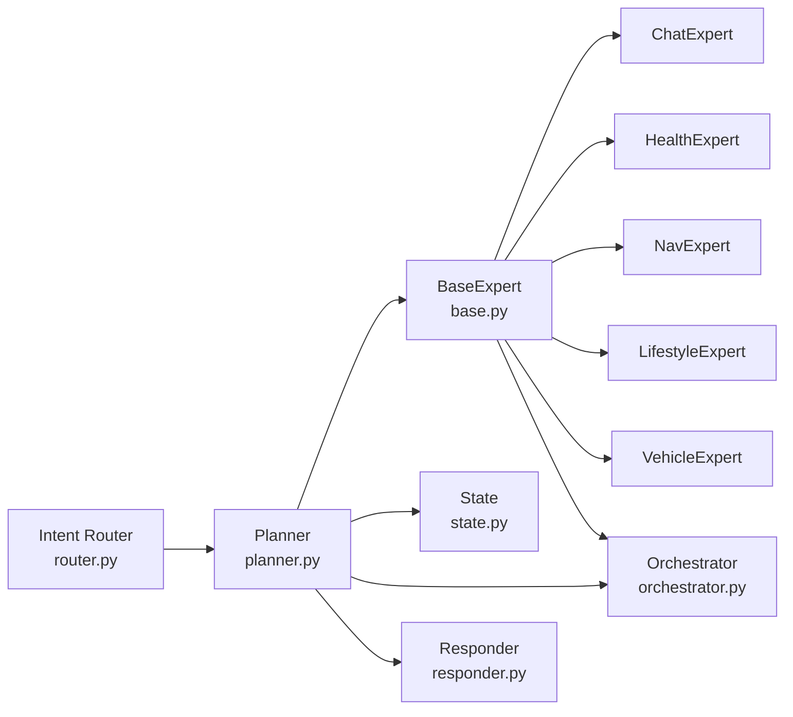

# 专家系统扩展

<cite>
**本文引用的文件**   
- [backend_design/nexus/agent/experts/base.py](file://backend_design/nexus/agent/experts/base.py)
- [backend_design/nexus/agent/experts/chat_expert.py](file://backend_design/nexus/agent/experts/chat_expert.py)
- [backend_design/nexus/agent/experts/health_expert.py](file://backend_design/nexus/agent/experts/health_expert.py)
- [backend_design/nexus/agent/experts/nav_expert.py](file://backend_design/nexus/agent/experts/nav_expert.py)
- [backend_design/nexus/agent/experts/lifestyle_expert.py](file://backend_design/nexus/agent/experts/lifestyle_expert.py)
- [backend_design/nexus/agent/experts/vehicle_expert.py](file://backend_design/nexus/agent/experts/vehicle_expert.py)
- [backend_design/nexus/agent/planner.py](file://backend_design/nexus/agent/planner.py)
- [backend_design/nexus/agent/responder.py](file://backend_design/nexus/agent/responder.py)
- [backend_design/nexus/intent/router.py](file://backend_design/nexus/intent/router.py)
- [backend_design/nexus/intent/heuristic.py](file://backend_design/nexus/intent/heuristic.py)
- [backend_design/nexus/intent/llm_router.py](file://backend_design/nexus/intent/llm_router.py)
- [backend_design/nexus/models/state.py](file://backend_design/nexus/models/state.py)
- [backend_design/nexus/skills/orchestrator.py](file://backend_design/nexus/skills/orchestrator.py)
- [backend_design/nexus/skills/registry.py](file://backend_design/nexus/skills/registry.py)
- [backend_design/nexus/api/routes/chat.py](file://backend_design/nexus/api/routes/chat.py)
- [backend_design/nexus/core/logger.py](file://backend_design/nexus/core/logger.py)
</cite>

## 目录
1. [简介](#简介)
2. [项目结构](#项目结构)
3. [核心组件](#核心组件)
4. [架构总览](#架构总览)
5. [详细组件分析](#详细组件分析)
6. [依赖分析](#依赖分析)
7. [性能考虑](#性能考虑)
8. [故障排查指南](#故障排查指南)
9. [结论](#结论)
10. [附录](#附录)

## 简介
本指南面向希望基于 NexusCockpit 的 BaseExpert 抽象类开发新“专家模块”的工程师与产品实现者。内容覆盖：
- 专家接口定义、意图识别逻辑、上下文管理与响应生成
- 专家的注册机制、优先级设置与协作模式
- 完整专家开发示例（聊天、健康、导航等）
- 专家与 Agent 规划器的集成、任务分配与执行流程
- 测试方法、调试技巧与性能优化建议

## 项目结构
专家系统位于后端 agent 层，围绕“意图路由 -> 专家选择 -> 规划器编排 -> 响应合成”的主线展开。关键目录与职责如下：
- backend_design/nexus/agent/experts: 专家基类与各领域专家实现
- backend_design/nexus/intent: 意图识别与路由（启发式与 LLM 路由）
- backend_design/nexus/agent/planner.py: 规划器，负责将用户请求分解为可执行的专家任务序列
- backend_design/nexus/agent/responder.py: 响应合成器，汇总各专家输出形成最终回复
- backend_design/nexus/models/state.py: 会话状态与上下文模型
- backend_design/nexus/skills/orchestrator.py 与 registry.py: 技能编排与注册中心（专家可与技能协同）
- backend_design/nexus/api/routes/chat.py: 聊天入口，触发意图识别与专家调用
- backend_design/nexus/core/logger.py: 日志记录工具

**图示来源**
- [backend_design/nexus/api/routes/chat.py](file://backend_design/nexus/api/routes/chat.py)
- [backend_design/nexus/intent/router.py](file://backend_design/nexus/intent/router.py)
- [backend_design/nexus/intent/heuristic.py](file://backend_design/nexus/intent/heuristic.py)
- [backend_design/nexus/intent/llm_router.py](file://backend_design/nexus/intent/llm_router.py)
- [backend_design/nexus/agent/planner.py](file://backend_design/nexus/agent/planner.py)
- [backend_design/nexus/agent/responder.py](file://backend_design/nexus/agent/responder.py)
- [backend_design/nexus/models/state.py](file://backend_design/nexus/models/state.py)
- [backend_design/nexus/skills/orchestrator.py](file://backend_design/nexus/skills/orchestrator.py)
- [backend_design/nexus/skills/registry.py](file://backend_design/nexus/skills/registry.py)

**章节来源**
- [backend_design/nexus/api/routes/chat.py](file://backend_design/nexus/api/routes/chat.py)
- [backend_design/nexus/intent/router.py](file://backend_design/nexus/intent/router.py)
- [backend_design/nexus/agent/planner.py](file://backend_design/nexus/agent/planner.py)
- [backend_design/nexus/agent/responder.py](file://backend_design/nexus/agent/responder.py)
- [backend_design/nexus/models/state.py](file://backend_design/nexus/models/state.py)
- [backend_design/nexus/skills/orchestrator.py](file://backend_design/nexus/skills/orchestrator.py)
- [backend_design/nexus/skills/registry.py](file://backend_design/nexus/skills/registry.py)

## 核心组件
- BaseExpert 抽象类：定义专家的统一接口，包括意图匹配、上下文读取、执行与结果返回。
- 具体专家：如聊天专家、健康专家、导航专家、生活方式专家、车辆专家等，继承 BaseExpert 并实现领域逻辑。
- 意图路由器：结合启发式规则与 LLM 路由，将用户输入映射到目标专家或专家组合。
- 规划器：根据意图与上下文，生成专家执行计划，协调多专家协作。
- 响应合成器：聚合多个专家的输出，进行格式化与后处理，生成最终回复。
- 会话状态：维护对话历史、实体抽取、中间结果等上下文信息。
- 技能编排与注册：专家可通过技能编排调用外部能力，并通过注册表统一管理。

**章节来源**
- [backend_design/nexus/agent/experts/base.py](file://backend_design/nexus/agent/experts/base.py)
- [backend_design/nexus/agent/experts/chat_expert.py](file://backend_design/nexus/agent/experts/chat_expert.py)
- [backend_design/nexus/agent/experts/health_expert.py](file://backend_design/nexus/agent/experts/health_expert.py)
- [backend_design/nexus/agent/experts/nav_expert.py](file://backend_design/nexus/agent/experts/nav_expert.py)
- [backend_design/nexus/agent/experts/lifestyle_expert.py](file://backend_design/nexus/agent/experts/lifestyle_expert.py)
- [backend_design/nexus/agent/experts/vehicle_expert.py](file://backend_design/nexus/agent/experts/vehicle_expert.py)
- [backend_design/nexus/intent/router.py](file://backend_design/nexus/intent/router.py)
- [backend_design/nexus/intent/heuristic.py](file://backend_design/nexus/intent/heuristic.py)
- [backend_design/nexus/intent/llm_router.py](file://backend_design/nexus/intent/llm_router.py)
- [backend_design/nexus/agent/planner.py](file://backend_design/nexus/agent/planner.py)
- [backend_design/nexus/agent/responder.py](file://backend_design/nexus/agent/responder.py)
- [backend_design/nexus/models/state.py](file://backend_design/nexus/models/state.py)
- [backend_design/nexus/skills/orchestrator.py](file://backend_design/nexus/skills/orchestrator.py)
- [backend_design/nexus/skills/registry.py](file://backend_design/nexus/skills/registry.py)

## 架构总览
下图展示了从用户输入到最终回复的端到端流程，以及专家在其中的角色与交互关系。

**图示来源**
- [backend_design/nexus/api/routes/chat.py](file://backend_design/nexus/api/routes/chat.py)
- [backend_design/nexus/intent/router.py](file://backend_design/nexus/intent/router.py)
- [backend_design/nexus/intent/heuristic.py](file://backend_design/nexus/intent/heuristic.py)
- [backend_design/nexus/intent/llm_router.py](file://backend_design/nexus/intent/llm_router.py)
- [backend_design/nexus/agent/planner.py](file://backend_design/nexus/agent/planner.py)
- [backend_design/nexus/agent/responder.py](file://backend_design/nexus/agent/responder.py)
- [backend_design/nexus/models/state.py](file://backend_design/nexus/models/state.py)
- [backend_design/nexus/skills/orchestrator.py](file://backend_design/nexus/skills/orchestrator.py)

## 详细组件分析

### BaseExpert 抽象类与专家接口
BaseExpert 定义了专家的统一契约，典型职责包括：
- 意图匹配：判断当前输入是否属于该专家的职责范围
- 上下文管理：读取与会话相关的历史、实体、偏好等信息
- 执行逻辑：完成领域任务，可能调用技能编排获取外部能力
- 结果返回：结构化输出，供规划器与响应合成器使用

**图示来源**
- [backend_design/nexus/agent/experts/base.py](file://backend_design/nexus/agent/experts/base.py)
- [backend_design/nexus/agent/experts/chat_expert.py](file://backend_design/nexus/agent/experts/chat_expert.py)
- [backend_design/nexus/agent/experts/health_expert.py](file://backend_design/nexus/agent/experts/health_expert.py)
- [backend_design/nexus/agent/experts/nav_expert.py](file://backend_design/nexus/agent/experts/nav_expert.py)
- [backend_design/nexus/agent/experts/lifestyle_expert.py](file://backend_design/nexus/agent/experts/lifestyle_expert.py)
- [backend_design/nexus/agent/experts/vehicle_expert.py](file://backend_design/nexus/agent/experts/vehicle_expert.py)

**章节来源**
- [backend_design/nexus/agent/experts/base.py](file://backend_design/nexus/agent/experts/base.py)

### 意图识别与路由
意图识别由启发式规则与 LLM 路由共同驱动：
- 启发式规则：基于关键词、正则、模板匹配快速筛选候选专家
- LLM 路由：对复杂语义进行理解，提升跨领域意图的准确率
- 路由器：整合两者结果，输出最终专家或专家组合

**图示来源**
- [backend_design/nexus/intent/heuristic.py](file://backend_design/nexus/intent/heuristic.py)
- [backend_design/nexus/intent/llm_router.py](file://backend_design/nexus/intent/llm_router.py)
- [backend_design/nexus/intent/router.py](file://backend_design/nexus/intent/router.py)

**章节来源**
- [backend_design/nexus/intent/router.py](file://backend_design/nexus/intent/router.py)
- [backend_design/nexus/intent/heuristic.py](file://backend_design/nexus/intent/heuristic.py)
- [backend_design/nexus/intent/llm_router.py](file://backend_design/nexus/intent/llm_router.py)

### 规划器与专家协作
规划器负责将意图转化为可执行的专家任务序列，支持：
- 单专家执行：简单意图直接交由单一专家处理
- 多专家协作：复杂需求拆分为子任务，按依赖顺序执行
- 上下文传递：每个专家可读写会话状态，保证信息连贯
- 错误恢复：当某专家失败时，规划器可选择重试、降级或跳过

**图示来源**
- [backend_design/nexus/agent/planner.py](file://backend_design/nexus/agent/planner.py)
- [backend_design/nexus/models/state.py](file://backend_design/nexus/models/state.py)
- [backend_design/nexus/skills/orchestrator.py](file://backend_design/nexus/skills/orchestrator.py)

**章节来源**
- [backend_design/nexus/agent/planner.py](file://backend_design/nexus/agent/planner.py)
- [backend_design/nexus/models/state.py](file://backend_design/nexus/models/state.py)
- [backend_design/nexus/skills/orchestrator.py](file://backend_design/nexus/skills/orchestrator.py)

### 响应合成
响应合成器负责：
- 聚合多个专家的结构化输出
- 进行格式统一、去重、排序与摘要
- 注入个性化信息与上下文提示
- 生成最终文本或富媒体回复

**图示来源**
- [backend_design/nexus/agent/responder.py](file://backend_design/nexus/agent/responder.py)

**章节来源**
- [backend_design/nexus/agent/responder.py](file://backend_design/nexus/agent/responder.py)

### 专家开发示例

#### 聊天专家（ChatExpert）
- 意图匹配：识别闲聊、问候、情感表达等
- 上下文管理：维护对话风格、用户偏好、历史话题
- 执行逻辑：调用语言模型或规则库生成自然回复
- 协作模式：可与健康、导航等专家联动，提供场景化建议

**章节来源**
- [backend_design/nexus/agent/experts/chat_expert.py](file://backend_design/nexus/agent/experts/chat_expert.py)

#### 健康专家（HealthExpert）
- 意图匹配：识别健康咨询、体征解读、运动建议等
- 上下文管理：读取用户健康档案、历史指标、过敏史
- 执行逻辑：结合知识库与规则引擎给出建议，必要时转人工
- 协作模式：与生活方式专家协作，提供饮食与作息建议

**章节来源**
- [backend_design/nexus/agent/experts/health_expert.py](file://backend_design/nexus/agent/experts/health_expert.py)

#### 导航专家（NavExpert）
- 意图匹配：识别路线规划、目的地搜索、实时路况查询
- 上下文管理：读取当前位置、历史目的地、偏好路线
- 执行逻辑：调用地图服务与交通数据，生成最优路径
- 协作模式：与车辆专家协作，控制车载导航与语音播报

**章节来源**
- [backend_design/nexus/agent/experts/nav_expert.py](file://backend_design/nexus/agent/experts/nav_expert.py)

#### 生活方式专家（LifestyleExpert）
- 意图匹配：识别日程安排、提醒设置、兴趣推荐
- 上下文管理：读取用户习惯、日历事件、地理位置
- 执行逻辑：结合时间与环境因素，提供个性化建议
- 协作模式：与健康专家联动，推送健康相关活动

**章节来源**
- [backend_design/nexus/agent/experts/lifestyle_expert.py](file://backend_design/nexus/agent/experts/lifestyle_expert.py)

#### 车辆专家（VehicleExpert）
- 意图匹配：识别车辆控制、状态查询、故障诊断
- 上下文管理：读取车辆型号、配置、最近操作记录
- 执行逻辑：通过车辆接口或 MCP 网关执行控制指令
- 协作模式：与导航专家协作，调整空调与座椅以配合行程

**章节来源**
- [backend_design/nexus/agent/experts/vehicle_expert.py](file://backend_design/nexus/agent/experts/vehicle_expert.py)

### 专家注册机制与优先级
- 注册机制：专家通过注册表进行集中管理，便于动态加载与发现
- 优先级设置：专家可实现 priority 方法，决定在冲突时的选择顺序
- 协作模式：规划器依据优先级与依赖关系编排执行顺序

**图示来源**
- [backend_design/nexus/skills/registry.py](file://backend_design/nexus/skills/registry.py)

**章节来源**
- [backend_design/nexus/skills/registry.py](file://backend_design/nexus/skills/registry.py)

## 依赖分析
专家系统与意图路由、规划器、响应合成、会话状态及技能编排之间存在紧密耦合。下图展示主要依赖关系：

**图示来源**
- [backend_design/nexus/agent/experts/base.py](file://backend_design/nexus/agent/experts/base.py)
- [backend_design/nexus/agent/experts/chat_expert.py](file://backend_design/nexus/agent/experts/chat_expert.py)
- [backend_design/nexus/agent/experts/health_expert.py](file://backend_design/nexus/agent/experts/health_expert.py)
- [backend_design/nexus/agent/experts/nav_expert.py](file://backend_design/nexus/agent/experts/nav_expert.py)
- [backend_design/nexus/agent/experts/lifestyle_expert.py](file://backend_design/nexus/agent/experts/lifestyle_expert.py)
- [backend_design/nexus/agent/experts/vehicle_expert.py](file://backend_design/nexus/agent/experts/vehicle_expert.py)
- [backend_design/nexus/intent/router.py](file://backend_design/nexus/intent/router.py)
- [backend_design/nexus/agent/planner.py](file://backend_design/nexus/agent/planner.py)
- [backend_design/nexus/models/state.py](file://backend_design/nexus/models/state.py)
- [backend_design/nexus/skills/orchestrator.py](file://backend_design/nexus/skills/orchestrator.py)
- [backend_design/nexus/agent/responder.py](file://backend_design/nexus/agent/responder.py)

**章节来源**
- [backend_design/nexus/agent/experts/base.py](file://backend_design/nexus/agent/experts/base.py)
- [backend_design/nexus/intent/router.py](file://backend_design/nexus/intent/router.py)
- [backend_design/nexus/agent/planner.py](file://backend_design/nexus/agent/planner.py)
- [backend_design/nexus/models/state.py](file://backend_design/nexus/models/state.py)
- [backend_design/nexus/skills/orchestrator.py](file://backend_design/nexus/skills/orchestrator.py)
- [backend_design/nexus/agent/responder.py](file://backend_design/nexus/agent/responder.py)

## 性能考虑
- 意图识别优化：优先使用启发式规则快速过滤，减少 LLM 调用次数
- 专家执行缓存：对重复查询与计算结果进行缓存，降低延迟
- 并行执行：无依赖的子任务可并发执行，缩短整体耗时
- 上下文压缩：定期压缩会话历史，避免上下文过大影响推理效率
- 资源限流：对高成本专家（如 LLM 调用）实施速率限制与熔断保护

[本节为通用指导，不直接分析具体文件]

## 故障排查指南
- 日志定位：使用核心日志工具记录专家匹配、执行与异常信息
- 常见错误：
  - 意图误判：检查启发式规则与 LLM 路由的配置与阈值
  - 上下文缺失：确认会话状态初始化与更新逻辑
  - 技能调用失败：检查技能编排与外部服务连通性
- 调试技巧：
  - 启用专家级日志，记录输入、中间结果与输出
  - 使用最小复现用例隔离问题
  - 逐步禁用专家或技能，定位瓶颈

**章节来源**
- [backend_design/nexus/core/logger.py](file://backend_design/nexus/core/logger.py)

## 结论
通过统一的 BaseExpert 接口、灵活的意图路由与规划器编排，NexusCockpit 的专家系统具备良好的可扩展性与协作能力。开发者可按领域快速实现新专家，并通过注册机制与优先级设置融入现有流程。结合测试与性能优化实践，可构建稳定高效的智能助手体系。

[本节为总结性内容，不直接分析具体文件]

## 附录
- 最佳实践：
  - 明确专家边界，避免职责重叠
  - 设计幂等的 execute 方法，便于重试与回滚
  - 合理拆分上下文字段，提高可读性与复用性
- 参考路径：
  - 专家基类与实现：见“详细组件分析”中的“章节来源”
  - 意图路由与规划器：见“架构总览”与“依赖分析”中的“图示来源”
  - 响应合成与日志：见“详细组件分析”与“故障排查指南”中的“章节来源”