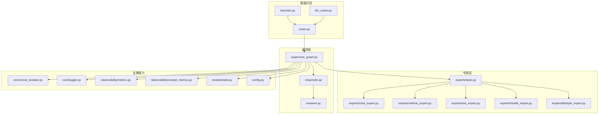
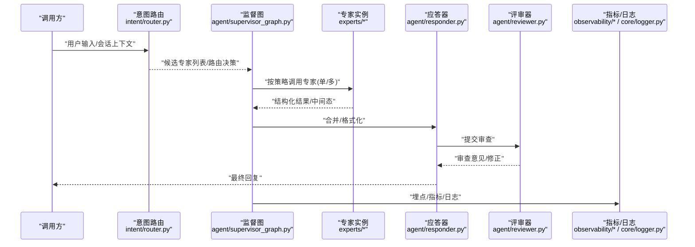
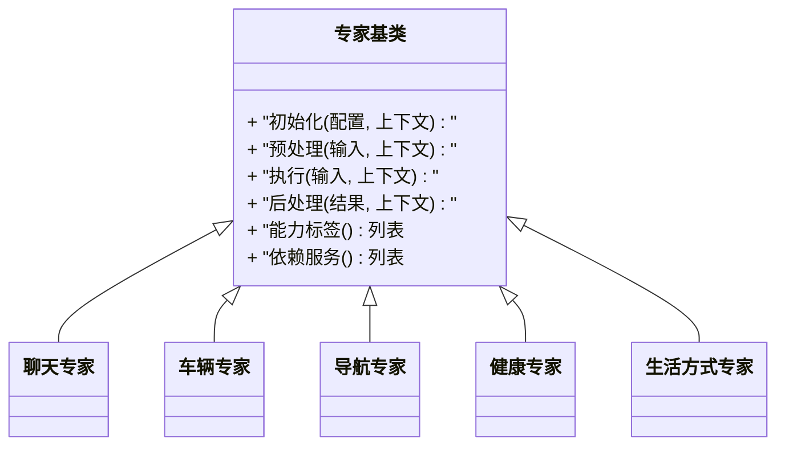
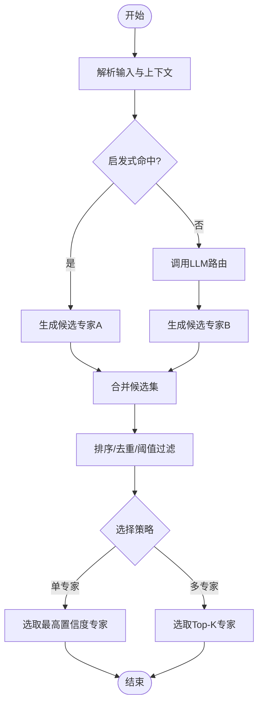
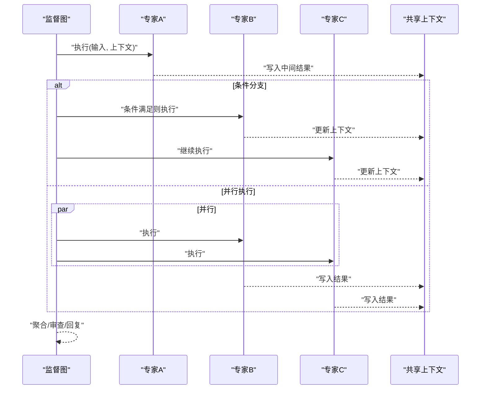
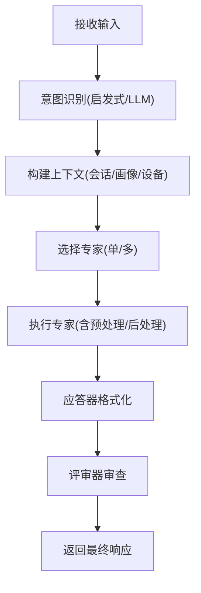
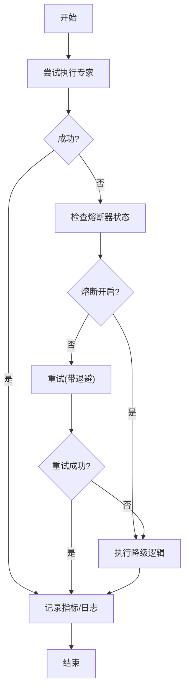
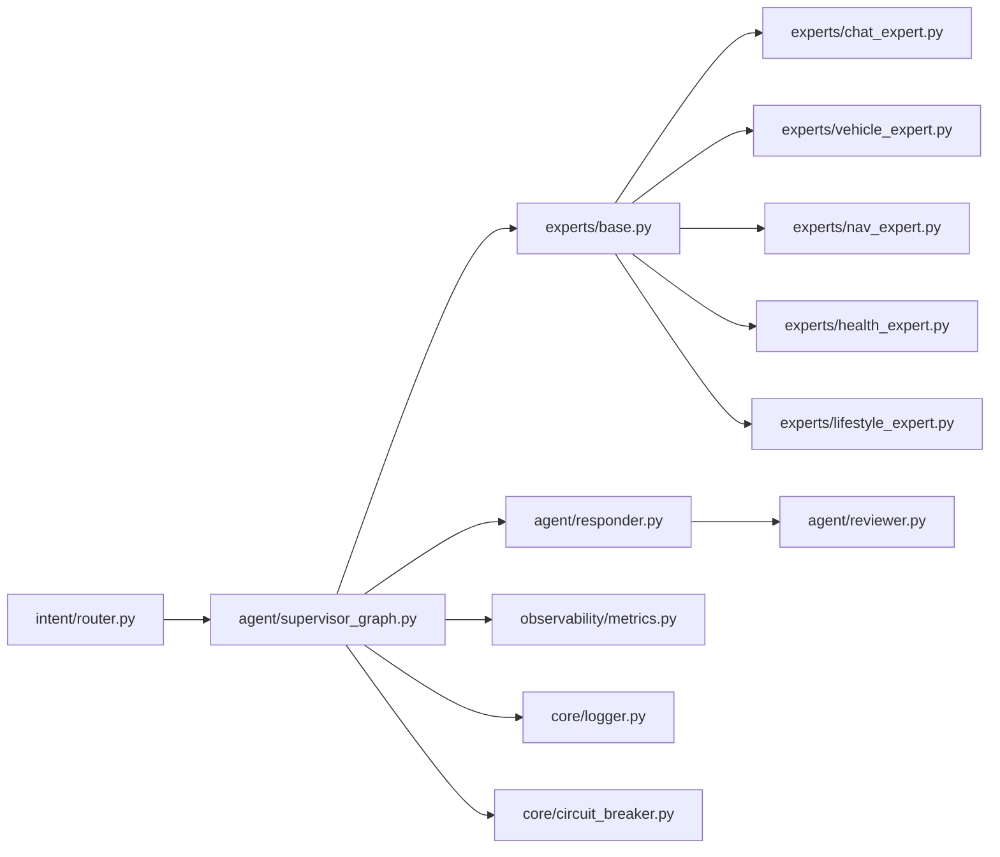

# 专家系统扩展

<cite>
**本文引用的文件**   
- [backend_design/nexus/agent/experts/base.py](file://backend_design/nexus/agent/experts/base.py)
- [backend_design/nexus/agent/experts/chat_expert.py](file://backend_design/nexus/agent/experts/chat_expert.py)
- [backend_design/nexus/agent/experts/health_expert.py](file://backend_design/nexus/agent/experts/health_expert.py)
- [backend_design/nexus/agent/experts/lifestyle_expert.py](file://backend_design/nexus/agent/experts/lifestyle_expert.py)
- [backend_design/nexus/agent/experts/nav_expert.py](file://backend_design/nexus/agent/experts/nav_expert.py)
- [backend_design/nexus/agent/experts/vehicle_expert.py](file://backend_design/nexus/agent/experts/vehicle_expert.py)
- [backend_design/nexus/intent/router.py](file://backend_design/nexus/intent/router.py)
- [backend_design/nexus/intent/heuristic.py](file://backend_design/nexus/intent/heuristic.py)
- [backend_design/nexus/intent/llm_router.py](file://backend_design/nexus/intent/llm_router.py)
- [backend_design/nexus/agent/responder.py](file://backend_design/nexus/agent/responder.py)
- [backend_design/nexus/agent/reviewer.py](file://backend_design/nexus/agent/reviewer.py)
- [backend_design/nexus/agent/supervisor_graph.py](file://backend_design/nexus/agent/supervisor_graph.py)
- [backend_design/nexus/core/circuit_breaker.py](file://backend_design/nexus/core/circuit熔断器.py)
- [backend_design/nexus/core/logger.py](file://backend_design/nexus/core/logger.py)
- [backend_design/nexus/observability/metrics.py](file://backend_design/nexus/observability/metrics.py)
- [backend_design/nexus/observability/cockpit_metrics.py](file://backend_design/nexus/observability/cockpit_metrics.py)
- [backend_design/nexus/models/state.py](file://backend_design/nexus/models/state.py)
- [backend_design/nexus/config.py](file://backend_design/nexus/config.py)
</cite>

## 目录
1. [简介](#简介)
2. [项目结构](#项目结构)
3. [核心组件](#核心组件)
4. [架构总览](#架构总览)
5. [详细组件分析](#详细组件分析)
6. [依赖关系分析](#依赖关系分析)
7. [性能考虑](#性能考虑)
8. [故障排查指南](#故障排查指南)
9. [结论](#结论)
10. [附录](#附录)

## 简介
本指南面向希望扩展“专家系统”的开发者，聚焦以下目标：
- 专家基类的架构设计与接口定义
- 多专家路由机制的工作原理与配置方法
- 自定义专家的完整开发流程（意图识别、上下文处理、响应生成）
- 专家之间的协作模式与通信协议
- 专家的性能监控与错误处理策略
- 实际开发示例与最佳实践建议

## 项目结构
专家系统位于后端模块中，围绕“意图识别—专家路由—专家执行—结果审查—统一回复”的主链路组织。关键目录与职责如下：
- agent/experts：专家实现与基类
- intent：意图识别与路由（启发式、LLM 路由）
- agent：编排与协调（应答器、评审器、监督图）
- core：通用能力（熔断器、日志等）
- observability：指标与可观测性
- models：状态模型
- config：配置入口

图表来源
- [backend_design/nexus/intent/router.py](file://backend_design/nexus/intent/router.py)
- [backend_design/nexus/intent/heuristic.py](file://backend_design/nexus/intent/heuristic.py)
- [backend_design/nexus/intent/llm_router.py](file://backend_design/nexus/intent/llm_router.py)
- [backend_design/nexus/agent/experts/base.py](file://backend_design/nexus/agent/experts/base.py)
- [backend_design/nexus/agent/experts/chat_expert.py](file://backend_design/nexus/agent/experts/chat_expert.py)
- [backend_design/nexus/agent/experts/vehicle_expert.py](file://backend_design/nexus/agent/experts/vehicle_expert.py)
- [backend_design/nexus/agent/experts/nav_expert.py](file://backend_design/nexus/agent/experts/nav_expert.py)
- [backend_design/nexus/agent/experts/health_expert.py](file://backend_design/nexus/agent/experts/health_expert.py)
- [backend_design/nexus/agent/experts/lifestyle_expert.py](file://backend_design/nexus/agent/experts/lifestyle_expert.py)
- [backend_design/nexus/agent/supervisor_graph.py](file://backend_design/nexus/agent/supervisor_graph.py)
- [backend_design/nexus/agent/responder.py](file://backend_design/nexus/agent/responder.py)
- [backend_design/nexus/agent/reviewer.py](file://backend_design/nexus/agent/reviewer.py)
- [backend_design/nexus/core/circuit_breaker.py](file://backend_design/nexus/core/circuit_breaker.py)
- [backend_design/nexus/core/logger.py](file://backend_design/nexus/core/logger.py)
- [backend_design/nexus/observability/metrics.py](file://backend_design/nexus/observability/metrics.py)
- [backend_design/nexus/observability/cockpit_metrics.py](file://backend_design/nexus/observability/cockpit_metrics.py)
- [backend_design/nexus/models/state.py](file://backend_design/nexus/models/state.py)
- [backend_design/nexus/config.py](file://backend_design/nexus/config.py)

章节来源
- [backend_design/nexus/agent/experts/base.py](file://backend_design/nexus/agent/experts/base.py)
- [backend_design/nexus/intent/router.py](file://backend_design/nexus/intent/router.py)
- [backend_design/nexus/agent/supervisor_graph.py](file://backend_design/nexus/agent/supervisor_graph.py)
- [backend_design/nexus/agent/responder.py](file://backend_design/nexus/agent/responder.py)
- [backend_design/nexus/agent/reviewer.py](file://backend_design/nexus/agent/reviewer.py)
- [backend_design/nexus/core/circuit_breaker.py](file://backend_design/nexus/core/circuit_breaker.py)
- [backend_design/nexus/core/logger.py](file://backend_design/nexus/core/logger.py)
- [backend_design/nexus/observability/metrics.py](file://backend_design/nexus/observability/metrics.py)
- [backend_design/nexus/observability/cockpit_metrics.py](file://backend_design/nexus/observability/cockpit_metrics.py)
- [backend_design/nexus/models/state.py](file://backend_design/nexus/models/state.py)
- [backend_design/nexus/config.py](file://backend_design/nexus/config.py)

## 核心组件
- 专家基类：定义统一的专家接口、生命周期钩子、上下文传递与元数据约定，确保所有专家具备一致的行为契约。
- 意图路由：提供启发式规则与 LLM 辅助两种路由方式，将用户输入映射到具体专家或专家组合。
- 编排器（监督图）：负责调用路由、调度专家、聚合结果、触发审查与最终回复。
- 应答器与评审器：对专家输出进行格式化、合规检查与质量把关。
- 可观测性与容错：通过熔断器保护外部依赖，通过指标与日志记录专家运行状态。

章节来源
- [backend_design/nexus/agent/experts/base.py](file://backend_design/nexus/agent/experts/base.py)
- [backend_design/nexus/intent/router.py](file://backend_design/nexus/intent/router.py)
- [backend_design/nexus/agent/supervisor_graph.py](file://backend_design/nexus/agent/supervisor_graph.py)
- [backend_design/nexus/agent/responder.py](file://backend_design/nexus/agent/responder.py)
- [backend_design/nexus/agent/reviewer.py](file://backend_design/nexus/agent/reviewer.py)
- [backend_design/nexus/core/circuit_breaker.py](file://backend_design/nexus/core/circuit_breaker.py)
- [backend_design/nexus/observability/metrics.py](file://backend_design/nexus/observability/metrics.py)

## 架构总览
下图展示了从请求进入、意图识别、专家路由、执行与审查到最终回复的端到端流程。

图表来源
- [backend_design/nexus/intent/router.py](file://backend_design/nexus/intent/router.py)
- [backend_design/nexus/agent/supervisor_graph.py](file://backend_design/nexus/agent/supervisor_graph.py)
- [backend_design/nexus/agent/experts/base.py](file://backend_design/nexus/agent/experts/base.py)
- [backend_design/nexus/agent/responder.py](file://backend_design/nexus/agent/responder.py)
- [backend_design/nexus/agent/reviewer.py](file://backend_design/nexus/agent/reviewer.py)
- [backend_design/nexus/observability/metrics.py](file://backend_design/nexus/observability/metrics.py)
- [backend_design/nexus/core/logger.py](file://backend_design/nexus/core/logger.py)

## 详细组件分析

### 专家基类与接口设计
- 统一接口：所有专家需实现一致的调用签名、上下文参数与返回结构，便于编排器无差别调度。
- 生命周期钩子：支持初始化、预处理、主处理、后处理等阶段，便于注入通用逻辑（如鉴权、限流、缓存）。
- 上下文传递：通过共享状态对象在专家间传递会话信息、用户画像、车辆状态等。
- 元数据约定：专家应暴露能力标签、版本、依赖等信息，用于路由与降级策略。

图表来源
- [backend_design/nexus/agent/experts/base.py](file://backend_design/nexus/agent/experts/base.py)
- [backend_design/nexus/agent/experts/chat_expert.py](file://backend_design/nexus/agent/experts/chat_expert.py)
- [backend_design/nexus/agent/experts/vehicle_expert.py](file://backend_design/nexus/agent/experts/vehicle_expert.py)
- [backend_design/nexus/agent/experts/nav_expert.py](file://backend_design/nexus/agent/experts/nav_expert.py)
- [backend_design/nexus/agent/experts/health_expert.py](file://backend_design/nexus/agent/experts/health_expert.py)
- [backend_design/nexus/agent/experts/lifestyle_expert.py](file://backend_design/nexus/agent/experts/lifestyle_expert.py)

章节来源
- [backend_design/nexus/agent/experts/base.py](file://backend_design/nexus/agent/experts/base.py)
- [backend_design/nexus/agent/experts/chat_expert.py](file://backend_design/nexus/agent/experts/chat_expert.py)
- [backend_design/nexus/agent/experts/vehicle_expert.py](file://backend_design/nexus/agent/experts/vehicle_expert.py)
- [backend_design/nexus/agent/experts/nav_expert.py](file://backend_design/nexus/agent/experts/nav_expert.py)
- [backend_design/nexus/agent/experts/health_expert.py](file://backend_design/nexus/agent/experts/health_expert.py)
- [backend_design/nexus/agent/experts/lifestyle_expert.py](file://backend_design/nexus/agent/experts/lifestyle_expert.py)

### 多专家路由机制
- 路由策略：
  - 启发式路由：基于关键词、正则、白名单/黑名单、领域词典快速匹配。
  - LLM 路由：借助大模型进行语义理解与分类，适合复杂或模糊意图。
- 路由输出：返回候选专家集合及置信度，供编排器选择单专家或多专家并行/串行执行。
- 配置项：可通过配置文件切换路由策略、阈值、超时、重试次数等。

图表来源
- [backend_design/nexus/intent/router.py](file://backend_design/nexus/intent/router.py)
- [backend_design/nexus/intent/heuristic.py](file://backend_design/nexus/intent/heuristic.py)
- [backend_design/nexus/intent/llm_router.py](file://backend_design/nexus/intent/llm_router.py)
- [backend_design/nexus/config.py](file://backend_design/nexus/config.py)

章节来源
- [backend_design/nexus/intent/router.py](file://backend_design/nexus/intent/router.py)
- [backend_design/nexus/intent/heuristic.py](file://backend_design/nexus/intent/heuristic.py)
- [backend_design/nexus/intent/llm_router.py](file://backend_design/nexus/intent/llm_router.py)
- [backend_design/nexus/config.py](file://backend_design/nexus/config.py)

### 编排器与协作模式
- 监督图：作为中枢，管理专家生命周期、并发控制、超时与重试、结果聚合与回退。
- 协作模式：
  - 串行：前一个专家的输出作为下一个专家的输入。
  - 并行：多个专家同时执行，最后由编排器合并结果。
  - 条件分支：根据中间结果动态决定后续专家。
- 通信协议：专家之间通过共享上下文对象与标准化消息体交互，避免紧耦合。

图表来源
- [backend_design/nexus/agent/supervisor_graph.py](file://backend_design/nexus/agent/supervisor_graph.py)
- [backend_design/nexus/models/state.py](file://backend_design/nexus/models/state.py)

章节来源
- [backend_design/nexus/agent/supervisor_graph.py](file://backend_design/nexus/agent/supervisor_graph.py)
- [backend_design/nexus/models/state.py](file://backend_design/nexus/models/state.py)

### 自定义专家开发流程
- 步骤概览：
  1) 继承专家基类并实现必要接口
  2) 注册能力标签与依赖服务
  3) 实现预处理（校验、提取上下文）、执行（业务逻辑）、后处理（格式化、埋点）
  4) 编写单元测试与集成测试
  5) 接入路由规则或启用 LLM 路由自动发现
  6) 上线灰度与监控告警
- 关键点：
  - 保持幂等与可重试
  - 明确异常边界与降级路径
  - 使用标准上下文对象传递数据，避免隐式全局变量
  - 为每个专家暴露最小必要权限与资源访问

章节来源
- [backend_design/nexus/agent/experts/base.py](file://backend_design/nexus/agent/experts/base.py)
- [backend_design/nexus/intent/router.py](file://backend_design/nexus/intent/router.py)
- [backend_design/nexus/models/state.py](file://backend_design/nexus/models/state.py)

### 意图识别、上下文处理与响应生成
- 意图识别：优先启发式，其次 LLM；支持多候选与置信度评分。
- 上下文处理：从会话、用户画像、设备/车辆状态中提取必要字段，注入专家输入。
- 响应生成：由应答器统一格式化，评审器进行内容安全与一致性检查。

图表来源
- [backend_design/nexus/intent/router.py](file://backend_design/nexus/intent/router.py)
- [backend_design/nexus/agent/responder.py](file://backend_design/nexus/agent/responder.py)
- [backend_design/nexus/agent/reviewer.py](file://backend_design/nexus/agent/reviewer.py)
- [backend_design/nexus/models/state.py](file://backend_design/nexus/models/state.py)

章节来源
- [backend_design/nexus/intent/router.py](file://backend_design/nexus/intent/router.py)
- [backend_design/nexus/agent/responder.py](file://backend_design/nexus/agent/responder.py)
- [backend_design/nexus/agent/reviewer.py](file://backend_design/nexus/agent/reviewer.py)
- [backend_design/nexus/models/state.py](file://backend_design/nexus/models/state.py)

### 专家间的协作模式与通信协议
- 协作模式：
  - 顺序协作：前一专家输出作为后一专家输入
  - 并行协作：多专家独立执行，结果合并
  - 条件协作：根据中间结果动态选择后续专家
- 通信协议：
  - 共享上下文对象：承载会话ID、用户ID、车辆状态、临时缓存等
  - 标准化消息体：包含类型、载荷、元数据、时间戳、追踪ID等

章节来源
- [backend_design/nexus/models/state.py](file://backend_design/nexus/models/state.py)
- [backend_design/nexus/agent/supervisor_graph.py](file://backend_design/nexus/agent/supervisor_graph.py)

### 性能监控与错误处理策略
- 监控指标：
  - 专家级：QPS、延迟分位、错误率、超时率、重试次数
  - 系统级：CPU/内存、线程池占用、外部依赖调用耗时
- 错误处理：
  - 熔断器：对外部依赖设置熔断阈值与恢复窗口
  - 重试与退避：对瞬时失败进行有限次重试与指数退避
  - 降级策略：当专家不可用时返回默认答案或提示
- 日志与追踪：
  - 结构化日志：包含请求ID、专家名、阶段、耗时、错误码
  - 分布式追踪：贯穿意图识别、专家执行、审查与回复全流程

图表来源
- [backend_design/nexus/core/circuit_breaker.py](file://backend_design/nexus/core/circuit_breaker.py)
- [backend_design/nexus/observability/metrics.py](file://backend_design/nexus/observability/metrics.py)
- [backend_design/nexus/observability/cockpit_metrics.py](file://backend_design/nexus/observability/cockpit_metrics.py)
- [backend_design/nexus/core/logger.py](file://backend_design/nexus/core/logger.py)

章节来源
- [backend_design/nexus/core/circuit_breaker.py](file://backend_design/nexus/core/circuit_breaker.py)
- [backend_design/nexus/observability/metrics.py](file://backend_design/nexus/observability/metrics.py)
- [backend_design/nexus/observability/cockpit_metrics.py](file://backend_design/nexus/observability/cockpit_metrics.py)
- [backend_design/nexus/core/logger.py](file://backend_design/nexus/core/logger.py)

## 依赖关系分析
- 低耦合高内聚：专家仅依赖基类与共享上下文，不直接耦合其他专家。
- 路由解耦：通过配置与工厂模式切换启发式/LLM路由。
- 可观测性内嵌：指标与日志在各层均有埋点，便于定位问题。

图表来源
- [backend_design/nexus/intent/router.py](file://backend_design/nexus/intent/router.py)
- [backend_design/nexus/agent/supervisor_graph.py](file://backend_design/nexus/agent/supervisor_graph.py)
- [backend_design/nexus/agent/experts/base.py](file://backend_design/nexus/agent/experts/base.py)
- [backend_design/nexus/agent/experts/chat_expert.py](file://backend_design/nexus/agent/experts/chat_expert.py)
- [backend_design/nexus/agent/experts/vehicle_expert.py](file://backend_design/nexus/agent/experts/vehicle_expert.py)
- [backend_design/nexus/agent/experts/nav_expert.py](file://backend_design/nexus/agent/experts/nav_expert.py)
- [backend_design/nexus/agent/experts/health_expert.py](file://backend_design/nexus/agent/experts/health_expert.py)
- [backend_design/nexus/agent/experts/lifestyle_expert.py](file://backend_design/nexus/agent/experts/lifestyle_expert.py)
- [backend_design/nexus/agent/responder.py](file://backend_design/nexus/agent/responder.py)
- [backend_design/nexus/agent/reviewer.py](file://backend_design/nexus/agent/reviewer.py)
- [backend_design/nexus/observability/metrics.py](file://backend_design/nexus/observability/metrics.py)
- [backend_design/nexus/core/logger.py](file://backend_design/nexus/core/logger.py)
- [backend_design/nexus/core/circuit_breaker.py](file://backend_design/nexus/core/circuit_breaker.py)

章节来源
- [backend_design/nexus/intent/router.py](file://backend_design/nexus/intent/router.py)
- [backend_design/nexus/agent/supervisor_graph.py](file://backend_design/nexus/agent/supervisor_graph.py)
- [backend_design/nexus/agent/experts/base.py](file://backend_design/nexus/agent/experts/base.py)
- [backend_design/nexus/agent/responder.py](file://backend_design/nexus/agent/responder.py)
- [backend_design/nexus/agent/reviewer.py](file://backend_design/nexus/agent/reviewer.py)
- [backend_design/nexus/observability/metrics.py](file://backend_design/nexus/observability/metrics.py)
- [backend_design/nexus/core/logger.py](file://backend_design/nexus/core/logger.py)
- [backend_design/nexus/core/circuit_breaker.py](file://backend_design/nexus/core/circuit_breaker.py)

## 性能考虑
- 路由优化：
  - 启发式规则尽量前置，减少 LLM 调用
  - 缓存高频意图与专家结果
- 专家执行：
  - 合理设置超时与并发度
  - 对长耗时操作采用异步与分页
- 外部依赖：
  - 使用熔断器与重试退避
  - 对慢依赖进行隔离与降级
- 监控与调优：
  - 关注 P95/P99 延迟与错误率
  - 结合日志与追踪定位热点与瓶颈

[本节为通用指导，无需特定文件引用]

## 故障排查指南
- 常见问题定位：
  - 路由未命中：检查启发式规则与 LLM 路由配置
  - 专家超时：查看熔断器状态与重试策略
  - 结果不一致：确认上下文是否被正确传递与会话隔离
- 诊断手段：
  - 查看结构化日志中的请求ID与专家阶段
  - 检查指标面板中的错误率与延迟分布
  - 使用追踪链路串联意图识别、专家执行与审查环节

章节来源
- [backend_design/nexus/core/logger.py](file://backend_design/nexus/core/logger.py)
- [backend_design/nexus/observability/metrics.py](file://backend_design/nexus/observability/metrics.py)
- [backend_design/nexus/observability/cockpit_metrics.py](file://backend_design/nexus/observability/cockpit_metrics.py)
- [backend_design/nexus/core/circuit_breaker.py](file://backend_design/nexus/core/circuit_breaker.py)

## 结论
通过统一的专家基类、灵活的路由机制与完善的编排、审查与可观测性体系，专家系统具备良好的可扩展性与稳定性。遵循本文的开发流程与最佳实践，可以快速实现高质量的新专家并融入现有生态。

[本节为总结性内容，无需特定文件引用]

## 附录
- 配置要点：
  - 路由策略开关、阈值、超时、重试次数
  - 专家能力标签与依赖声明
  - 指标上报与日志级别
- 最佳实践：
  - 小步快跑、持续集成与回归测试
  - 灰度发布与快速回滚
  - 文档化专家接口与变更影响面

[本节为补充说明，无需特定文件引用]