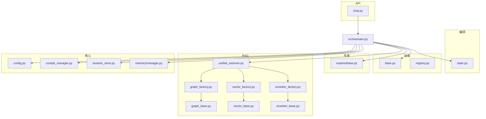
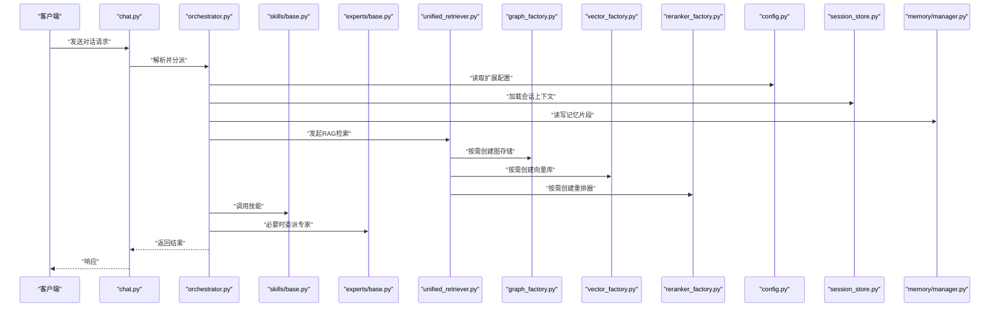
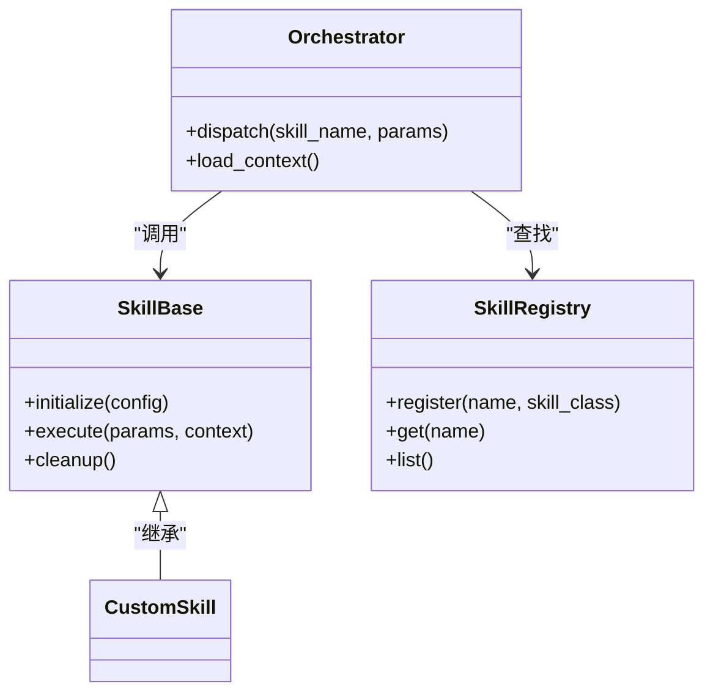
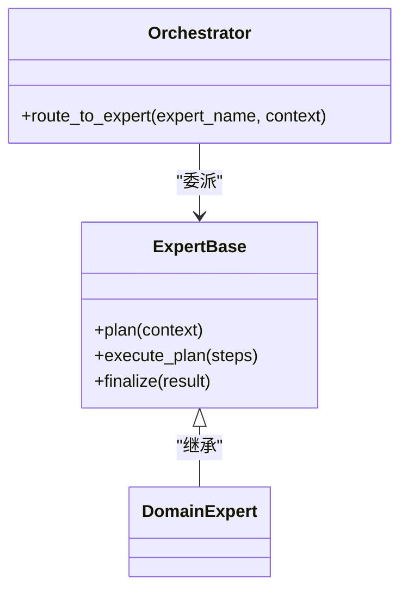
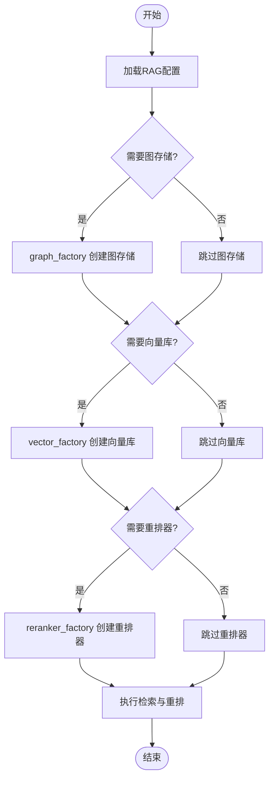
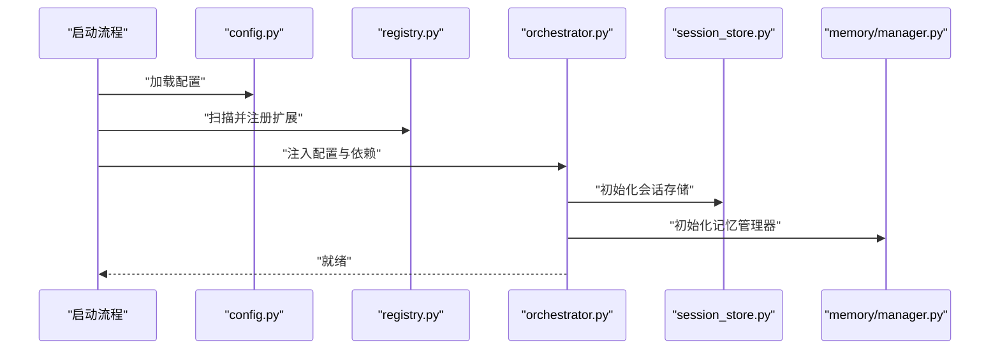
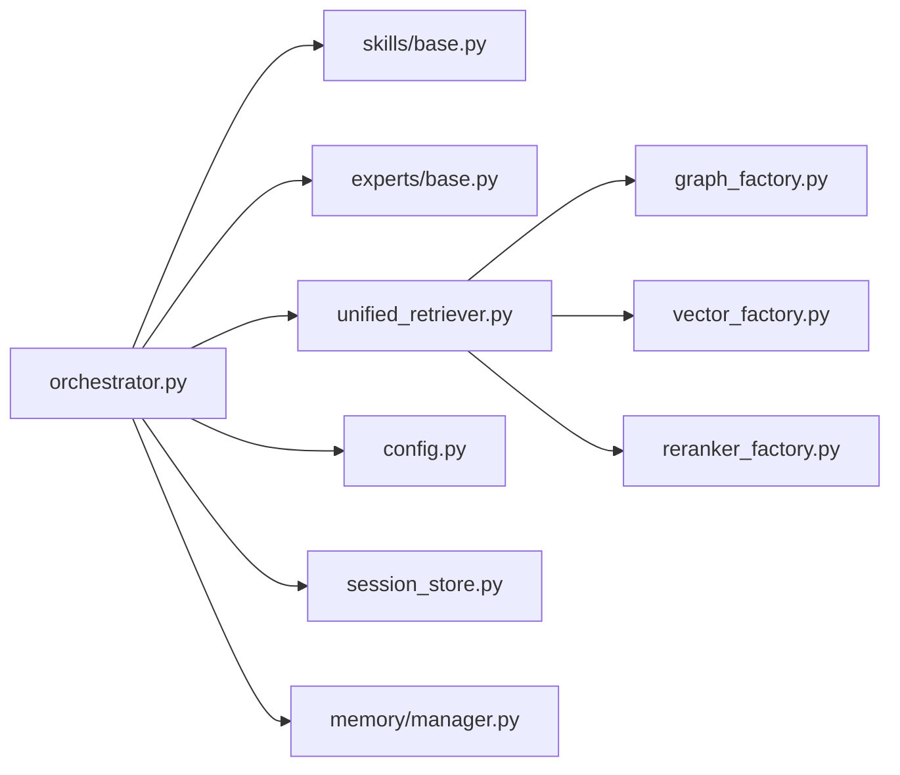

# 扩展开发指南

<cite>
**本文引用的文件**   
- [backend_design/nexus/skills/base.py](file://backend_design/nexus/skills/base.py)
- [backend_design/nexus/skills/registry.py](file://backend_design/nexus/skills/registry.py)
- [backend_design/nexus/skills/orchestrator.py](file://backend_design/nexus/skills/orchestrator.py)
- [backend_design/nexus/agent/experts/base.py](file://backend_design/nexus/agent/experts/base.py)
- [backend_design/nexus/rag/graph_base.py](file://backend_design/nexus/rag/graph_base.py)
- [backend_design/nexus/rag/vector_base.py](file://backend_design/nexus/rag/vector_base.py)
- [backend_design/nexus/rag/reranker_base.py](file://backend_design/nexus/rag/reranker_base.py)
- [backend_design/nexus/rag/graph_factory.py](file://backend_design/nexus/rag/graph_factory.py)
- [backend_design/nexus/rag/vector_factory.py](file://backend_design/nexus/rag/vector_factory.py)
- [backend_design/nexus/rag/reranker_factory.py](file://backend_design/nexus/rag/reranker_factory.py)
- [backend_design/nexus/rag/unified_retriever.py](file://backend_design/nexus/rag/unified_retriever.py)
- [backend_design/nexus/config.py](file://backend_design/nexus/config.py)
- [backend_design/nexus/core/cockpit_manager.py](file://backend_design/nexus/core/cockpit_manager.py)
- [backend_design/nexus/api/routes/chat.py](file://backend_design/nexus/api/routes/chat.py)
- [backend_design/nexus/middleware/session_store.py](file://backend_design/nexus/middleware/session_store.py)
- [backend_design/nexus/memory/manager.py](file://backend_design/nexus/memory/manager.py)
- [backend_design/nexus/models/state.py](file://backend_design/nexus/models/state.py)
</cite>

## 目录
1. [简介](#简介)
2. [项目结构](#项目结构)
3. [核心组件](#核心组件)
4. [架构总览](#架构总览)
5. [详细组件分析](#详细组件分析)
6. [依赖分析](#依赖分析)
7. [性能考虑](#性能考虑)
8. [故障排查指南](#故障排查指南)
9. [结论](#结论)
10. [附录](#附录)

## 简介
本指南面向希望在 NexusCockpit 系统中进行扩展开发的工程师，覆盖以下主题：
- 自定义技能（Skills）开发与注册
- 专家系统（Experts）扩展与编排
- 新的 RAG 后端实现（向量库、图存储、重排器）
- 第三方服务集成模式
- 插件规范、接口定义与注册机制
- 生命周期管理、依赖注入与配置管理
- 打包、分发与版本管理
- 调试技巧与性能优化建议

## 项目结构
NexusCockpit 的扩展点主要分布在以下模块：
- 技能层：skills 提供能力封装与编排
- 专家层：agent.experts 提供领域专家抽象与调度
- RAG 层：rag 提供检索增强生成的统一接口与工厂
- 核心与中间件：core、middleware、memory 提供运行时支撑
- API 路由：api.routes 暴露对外接口并串联内部流程

图表来源
- [backend_design/nexus/api/routes/chat.py](file://backend_design/nexus/api/routes/chat.py)
- [backend_design/nexus/skills/orchestrator.py](file://backend_design/nexus/skills/orchestrator.py)
- [backend_design/nexus/models/state.py](file://backend_design/nexus/models/state.py)
- [backend_design/nexus/skills/base.py](file://backend_design/nexus/skills/base.py)
- [backend_design/nexus/skills/registry.py](file://backend_design/nexus/skills/registry.py)
- [backend_design/nexus/agent/experts/base.py](file://backend_design/nexus/agent/experts/base.py)
- [backend_design/nexus/rag/unified_retriever.py](file://backend_design/nexus/rag/unified_retriever.py)
- [backend_design/nexus/rag/graph_factory.py](file://backend_design/nexus/rag/graph_factory.py)
- [backend_design/nexus/rag/vector_factory.py](file://backend_design/nexus/rag/vector_factory.py)
- [backend_design/nexus/rag/reranker_factory.py](file://backend_design/nexus/rag/reranker_factory.py)
- [backend_design/nexus/rag/graph_base.py](file://backend_design/nexus/rag/graph_base.py)
- [backend_design/nexus/rag/vector_base.py](file://backend_design/nexus/rag/vector_base.py)
- [backend_design/nexus/rag/reranker_base.py](file://backend_design/nexus/rag/reranker_base.py)
- [backend_design/nexus/config.py](file://backend_design/nexus/config.py)
- [backend_design/nexus/core/cockpit_manager.py](file://backend_design/nexus/core/cockpit_manager.py)
- [backend_design/nexus/middleware/session_store.py](file://backend_design/nexus/middleware/session_store.py)
- [backend_design/nexus/memory/manager.py](file://backend_design/nexus/memory/manager.py)

章节来源
- [backend_design/nexus/api/routes/chat.py](file://backend_design/nexus/api/routes/chat.py)
- [backend_design/nexus/skills/orchestrator.py](file://backend_design/nexus/skills/orchestrator.py)
- [backend_design/nexus/models/state.py](file://backend_design/nexus/models/state.py)
- [backend_design/nexus/skills/base.py](file://backend_design/nexus/skills/base.py)
- [backend_design/nexus/skills/registry.py](file://backend_design/nexus/skills/registry.py)
- [backend_design/nexus/agent/experts/base.py](file://backend_design/nexus/agent/experts/base.py)
- [backend_design/nexus/rag/unified_retriever.py](file://backend_design/nexus/rag/unified_retriever.py)
- [backend_design/nexus/rag/graph_factory.py](file://backend_design/nexus/rag/graph_factory.py)
- [backend_design/nexus/rag/vector_factory.py](file://backend_design/nexus/rag/vector_factory.py)
- [backend_design/nexus/rag/reranker_factory.py](file://backend_design/nexus/rag/reranker_factory.py)
- [backend_design/nexus/rag/graph_base.py](file://backend_design/nexus/rag/graph_base.py)
- [backend_design/nexus/rag/vector_base.py](file://backend_design/nexus/rag/vector_base.py)
- [backend_design/nexus/rag/reranker_base.py](file://backend_design/nexus/rag/reranker_base.py)
- [backend_design/nexus/config.py](file://backend_design/nexus/config.py)
- [backend_design/nexus/core/cockpit_manager.py](file://backend_design/nexus/core/cockpit_manager.py)
- [backend_design/nexus/middleware/session_store.py](file://backend_design/nexus/middleware/session_store.py)
- [backend_design/nexus/memory/manager.py](file://backend_design/nexus/memory/manager.py)

## 核心组件
- 技能基类与注册表
  - 技能基类定义了统一的执行入口、参数校验、上下文访问与结果返回约定。
  - 注册表负责技能的发现、命名空间管理与冲突检测。
- 编排器
  - 编排器根据会话状态与意图选择并调用合适的技能或专家，维护执行顺序与错误恢复。
- 专家基类
  - 专家用于复杂决策与推理任务，通常组合多个技能与外部工具。
- RAG 统一检索器与工厂
  - 统一检索器屏蔽底层差异，通过工厂按配置创建具体实现（向量库、图存储、重排器）。
- 配置与运行期上下文
  - 配置模块集中管理扩展开关、后端地址、超时等；会话与记忆中间件为扩展提供持久化上下文。

章节来源
- [backend_design/nexus/skills/base.py](file://backend_design/nexus/skills/base.py)
- [backend_design/nexus/skills/registry.py](file://backend_design/nexus/skills/registry.py)
- [backend_design/nexus/skills/orchestrator.py](file://backend_design/nexus/skills/orchestrator.py)
- [backend_design/nexus/agent/experts/base.py](file://backend_design/nexus/agent/experts/base.py)
- [backend_design/nexus/rag/unified_retriever.py](file://backend_design/nexus/rag/unified_retriever.py)
- [backend_design/nexus/rag/graph_factory.py](file://backend_design/nexus/rag/graph_factory.py)
- [backend_design/nexus/rag/vector_factory.py](file://backend_design/nexus/rag/vector_factory.py)
- [backend_design/nexus/rag/reranker_factory.py](file://backend_design/nexus/rag/reranker_factory.py)
- [backend_design/nexus/config.py](file://backend_design/nexus/config.py)
- [backend_design/nexus/middleware/session_store.py](file://backend_design/nexus/middleware/session_store.py)
- [backend_design/nexus/memory/manager.py](file://backend_design/nexus/memory/manager.py)

## 架构总览
下图展示了从 API 到编排、技能/专家、RAG 与配置的端到端调用关系。

图表来源
- [backend_design/nexus/api/routes/chat.py](file://backend_design/nexus/api/routes/chat.py)
- [backend_design/nexus/skills/orchestrator.py](file://backend_design/nexus/skills/orchestrator.py)
- [backend_design/nexus/skills/base.py](file://backend_design/nexus/skills/base.py)
- [backend_design/nexus/agent/experts/base.py](file://backend_design/nexus/agent/experts/base.py)
- [backend_design/nexus/rag/unified_retriever.py](file://backend_design/nexus/rag/unified_retriever.py)
- [backend_design/nexus/rag/graph_factory.py](file://backend_design/nexus/rag/graph_factory.py)
- [backend_design/nexus/rag/vector_factory.py](file://backend_design/nexus/rag/vector_factory.py)
- [backend_design/nexus/rag/reranker_factory.py](file://backend_design/nexus/rag/reranker_factory.py)
- [backend_design/nexus/config.py](file://backend_design/nexus/config.py)
- [backend_design/nexus/middleware/session_store.py](file://backend_design/nexus/middleware/session_store.py)
- [backend_design/nexus/memory/manager.py](file://backend_design/nexus/memory/manager.py)

## 详细组件分析

### 技能（Skills）扩展
- 设计要点
  - 继承技能基类，实现统一执行接口，确保输入输出契约一致。
  - 在注册表中以唯一名称注册，支持命名空间隔离与版本标识。
  - 使用编排器提供的上下文访问会话、记忆与配置。
- 生命周期
  - 初始化阶段：加载配置、建立连接、预热资源。
  - 运行阶段：接收参数、执行业务逻辑、返回结构化结果。
  - 销毁阶段：释放资源、关闭连接、清理缓存。
- 最佳实践
  - 幂等性：同一请求多次调用应得到相同结果。
  - 可观测性：记录关键指标与日志，便于追踪。
  - 容错：对上游失败进行降级与重试策略控制。

图表来源
- [backend_design/nexus/skills/base.py](file://backend_design/nexus/skills/base.py)
- [backend_design/nexus/skills/registry.py](file://backend_design/nexus/skills/registry.py)
- [backend_design/nexus/skills/orchestrator.py](file://backend_design/nexus/skills/orchestrator.py)

章节来源
- [backend_design/nexus/skills/base.py](file://backend_design/nexus/skills/base.py)
- [backend_design/nexus/skills/registry.py](file://backend_design/nexus/skills/registry.py)
- [backend_design/nexus/skills/orchestrator.py](file://backend_design/nexus/skills/orchestrator.py)

### 专家系统（Experts）扩展
- 设计要点
  - 专家基类定义推理与协作边界，适合多步骤规划、条件分支与工具组合。
  - 专家可调用多个技能，并通过编排器协调执行顺序与异常处理。
- 生命周期
  - 构建期：装配所需工具与子专家。
  - 运行期：基于上下文进行决策与执行。
  - 收尾期：汇总结果、更新记忆与状态。
- 最佳实践
  - 明确职责边界，避免专家过度耦合。
  - 使用状态机或图模型表达复杂流程。
  - 引入熔断与限流保护下游服务。

图表来源
- [backend_design/nexus/agent/experts/base.py](file://backend_design/nexus/agent/experts/base.py)
- [backend_design/nexus/skills/orchestrator.py](file://backend_design/nexus/skills/orchestrator.py)

章节来源
- [backend_design/nexus/agent/experts/base.py](file://backend_design/nexus/agent/experts/base.py)
- [backend_design/nexus/skills/orchestrator.py](file://backend_design/nexus/skills/orchestrator.py)

### RAG 后端扩展（向量库、图存储、重排器）
- 统一检索器
  - 屏蔽底层差异，提供一致的查询接口，支持多源融合与排序。
- 工厂模式
  - 图存储、向量库、重排器均通过工厂按配置动态创建实例，降低耦合度。
- 基类契约
  - 各后端需实现基类定义的接口，包括索引、检索、重排与元数据操作。
- 配置驱动
  - 通过配置项选择后端类型、连接参数与算法超参。

图表来源
- [backend_design/nexus/rag/unified_retriever.py](file://backend_design/nexus/rag/unified_retriever.py)
- [backend_design/nexus/rag/graph_factory.py](file://backend_design/nexus/rag/graph_factory.py)
- [backend_design/nexus/rag/vector_factory.py](file://backend_design/nexus/rag/vector_factory.py)
- [backend_design/nexus/rag/reranker_factory.py](file://backend_design/nexus/rag/reranker_factory.py)
- [backend_design/nexus/rag/graph_base.py](file://backend_design/nexus/rag/graph_base.py)
- [backend_design/nexus/rag/vector_base.py](file://backend_design/nexus/rag/vector_base.py)
- [backend_design/nexus/rag/reranker_base.py](file://backend_design/nexus/rag/reranker_base.py)

章节来源
- [backend_design/nexus/rag/unified_retriever.py](file://backend_design/nexus/rag/unified_retriever.py)
- [backend_design/nexus/rag/graph_factory.py](file://backend_design/nexus/rag/graph_factory.py)
- [backend_design/nexus/rag/vector_factory.py](file://backend_design/nexus/rag/vector_factory.py)
- [backend_design/nexus/rag/reranker_factory.py](file://backend_design/nexus/rag/reranker_factory.py)
- [backend_design/nexus/rag/graph_base.py](file://backend_design/nexus/rag/graph_base.py)
- [backend_design/nexus/rag/vector_base.py](file://backend_design/nexus/rag/vector_base.py)
- [backend_design/nexus/rag/reranker_base.py](file://backend_design/nexus/rag/reranker_base.py)

### 第三方服务集成
- 推荐模式
  - 将第三方服务封装为技能或专家，遵循统一接口与错误语义。
  - 使用配置管理敏感信息与连接参数，避免硬编码。
  - 引入熔断、重试与超时控制，保障稳定性。
- 示例路径
  - 参考现有技能与专家的实现方式，在注册表中声明新服务。

章节来源
- [backend_design/nexus/skills/base.py](file://backend_design/nexus/skills/base.py)
- [backend_design/nexus/skills/registry.py](file://backend_design/nexus/skills/registry.py)
- [backend_design/nexus/config.py](file://backend_design/nexus/config.py)

### 生命周期管理、依赖注入与配置管理
- 生命周期
  - 启动时完成扩展发现与初始化；运行中提供服务；关闭时释放资源。
- 依赖注入
  - 通过编排器或容器注入配置、会话、记忆与外部客户端。
- 配置管理
  - 集中式配置，支持热更新与多环境差异化。

图表来源
- [backend_design/nexus/config.py](file://backend_design/nexus/config.py)
- [backend_design/nexus/skills/registry.py](file://backend_design/nexus/skills/registry.py)
- [backend_design/nexus/skills/orchestrator.py](file://backend_design/nexus/skills/orchestrator.py)
- [backend_design/nexus/middleware/session_store.py](file://backend_design/nexus/middleware/session_store.py)
- [backend_design/nexus/memory/manager.py](file://backend_design/nexus/memory/manager.py)

章节来源
- [backend_design/nexus/config.py](file://backend_design/nexus/config.py)
- [backend_design/nexus/skills/registry.py](file://backend_design/nexus/skills/registry.py)
- [backend_design/nexus/skills/orchestrator.py](file://backend_design/nexus/skills/orchestrator.py)
- [backend_design/nexus/middleware/session_store.py](file://backend_design/nexus/middleware/session_store.py)
- [backend_design/nexus/memory/manager.py](file://backend_design/nexus/memory/manager.py)

### 打包、分发与版本管理
- 包结构
  - 包含扩展代码、配置文件、依赖清单与说明文档。
- 版本策略
  - 采用语义化版本，标注兼容性与变更影响。
- 分发渠道
  - 私有仓库或制品库，提供安装脚本与校验签名。
- 安装与启用
  - 通过配置项启用扩展，并在启动时自动发现与注册。

[本节为通用指导，不直接分析具体文件]

### 调试技巧与性能优化
- 调试技巧
  - 开启详细日志与链路追踪，定位慢调用与异常路径。
  - 使用单元测试与集成测试验证扩展行为。
- 性能优化
  - 合理设置超时与并发度，避免阻塞。
  - 利用缓存与批量操作减少网络开销。
  - 对热点路径进行异步化与惰性加载。

[本节为通用指导，不直接分析具体文件]

## 依赖分析
- 组件耦合
  - 编排器对技能与专家存在强依赖，但通过注册表与工厂解耦具体实现。
  - RAG 统一检索器对三类后端（图、向量、重排）通过工厂弱耦合。
- 外部依赖
  - 配置、会话与记忆中间件为横向依赖，贯穿各扩展。
- 潜在循环依赖
  - 应避免在基类中反向引用具体实现，保持单向依赖。

图表来源
- [backend_design/nexus/skills/orchestrator.py](file://backend_design/nexus/skills/orchestrator.py)
- [backend_design/nexus/skills/base.py](file://backend_design/nexus/skills/base.py)
- [backend_design/nexus/agent/experts/base.py](file://backend_design/nexus/agent/experts/base.py)
- [backend_design/nexus/rag/unified_retriever.py](file://backend_design/nexus/rag/unified_retriever.py)
- [backend_design/nexus/rag/graph_factory.py](file://backend_design/nexus/rag/graph_factory.py)
- [backend_design/nexus/rag/vector_factory.py](file://backend_design/nexus/rag/vector_factory.py)
- [backend_design/nexus/rag/reranker_factory.py](file://backend_design/nexus/rag/reranker_factory.py)
- [backend_design/nexus/config.py](file://backend_design/nexus/config.py)
- [backend_design/nexus/middleware/session_store.py](file://backend_design/nexus/middleware/session_store.py)
- [backend_design/nexus/memory/manager.py](file://backend_design/nexus/memory/manager.py)

章节来源
- [backend_design/nexus/skills/orchestrator.py](file://backend_design/nexus/skills/orchestrator.py)
- [backend_design/nexus/skills/base.py](file://backend_design/nexus/skills/base.py)
- [backend_design/nexus/agent/experts/base.py](file://backend_design/nexus/agent/experts/base.py)
- [backend_design/nexus/rag/unified_retriever.py](file://backend_design/nexus/rag/unified_retriever.py)
- [backend_design/nexus/rag/graph_factory.py](file://backend_design/nexus/rag/graph_factory.py)
- [backend_design/nexus/rag/vector_factory.py](file://backend_design/nexus/rag/vector_factory.py)
- [backend_design/nexus/rag/reranker_factory.py](file://backend_design/nexus/rag/reranker_factory.py)
- [backend_design/nexus/config.py](file://backend_design/nexus/config.py)
- [backend_design/nexus/middleware/session_store.py](file://backend_design/nexus/middleware/session_store.py)
- [backend_design/nexus/memory/manager.py](file://backend_design/nexus/memory/manager.py)

## 性能考虑
- 控制并发与批处理：在高吞吐场景下，合并小请求与限制并发度可降低资源竞争。
- 缓存策略：对频繁读的数据进行缓存，注意失效与一致性。
- 超时与重试：为外部调用设置合理的超时与退避重试，避免雪崩。
- 资源预热：在启动阶段预加载模型或连接池，缩短冷启动时间。
- 监控与告警：埋点关键指标，及时发现问题。

[本节为通用指导，不直接分析具体文件]

## 故障排查指南
- 常见问题
  - 扩展未注册：检查注册表与命名空间是否冲突。
  - 配置缺失：确认配置键名与默认值。
  - 连接失败：核对地址、认证与网络策略。
- 定位方法
  - 查看日志与链路追踪，关注异常堆栈与耗时分布。
  - 使用最小复现用例与断点调试。
- 恢复策略
  - 快速回滚至上一稳定版本。
  - 启用降级模式，保证核心功能可用。

章节来源
- [backend_design/nexus/skills/registry.py](file://backend_design/nexus/skills/registry.py)
- [backend_design/nexus/config.py](file://backend_design/nexus/config.py)
- [backend_design/nexus/skills/orchestrator.py](file://backend_design/nexus/skills/orchestrator.py)

## 结论
通过统一的基类与工厂模式，NexusCockpit 提供了清晰的扩展点与良好的解耦能力。开发者可以围绕技能、专家与 RAG 后端进行灵活扩展，结合配置与中间件实现稳定的运行期行为。遵循本文的最佳实践与调试建议，可有效提升扩展质量与系统可靠性。

[本节为总结性内容，不直接分析具体文件]

## 附录
- 术语
  - 技能：封装具体能力的可复用单元。
  - 专家：具备复杂推理与协作能力的智能体。
  - RAG：检索增强生成，结合知识库提升回答质量。
- 参考路径
  - 示例实现请参考对应模块中的现有代码，遵循相同接口与风格。

[本节为补充信息，不直接分析具体文件]