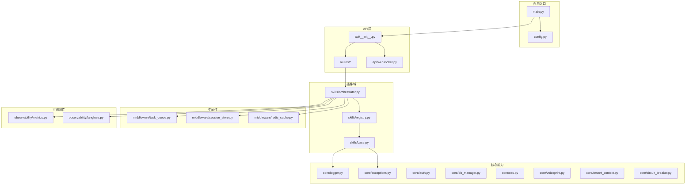
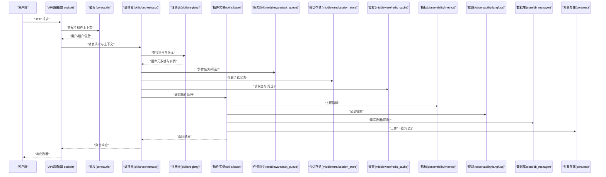
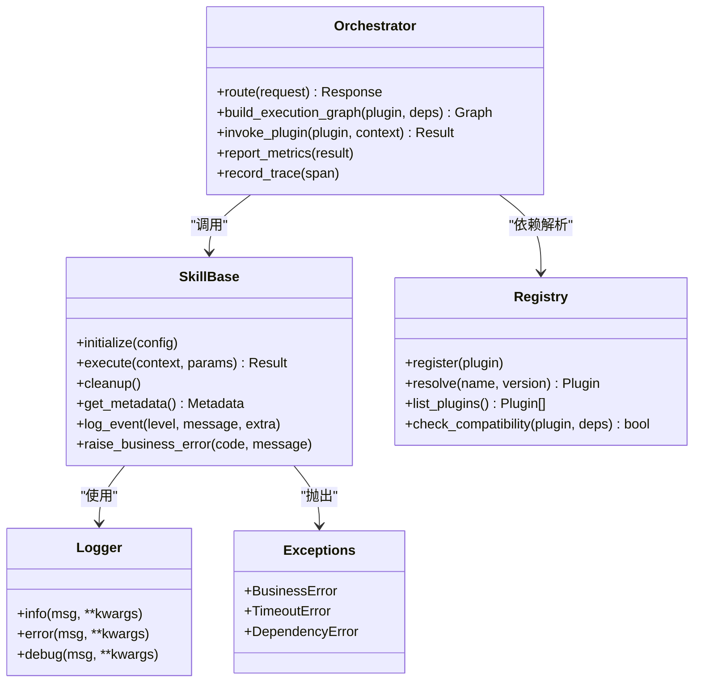
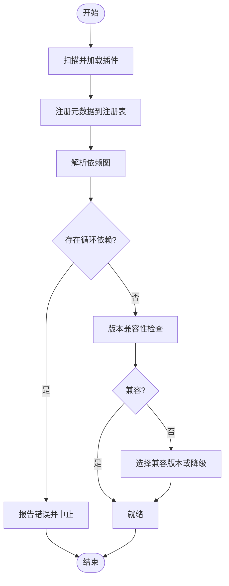
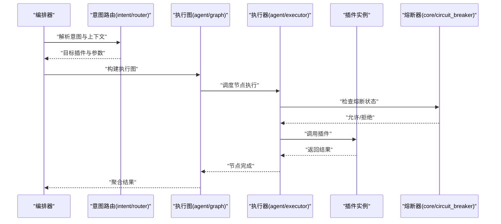
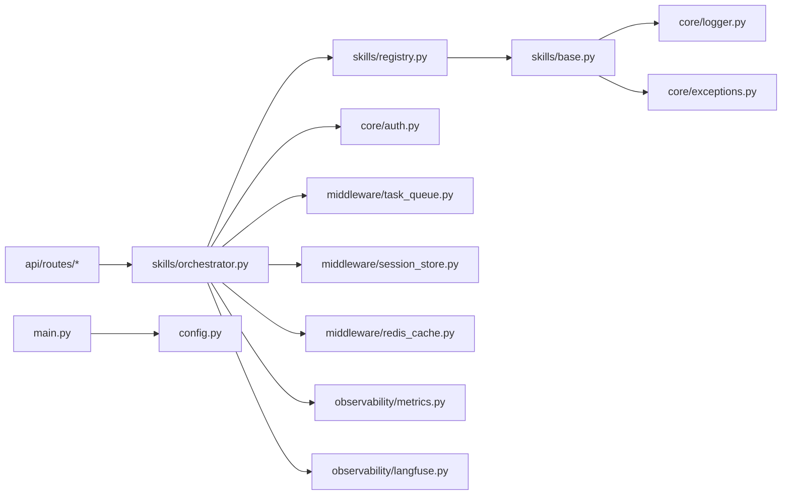

# 插件开发规范

<cite>
**本文引用的文件**   
- [backend_design/nexus/skills/base.py](file://backend_design/nexus/skills/base.py)
- [backend_design/nexus/skills/registry.py](file://backend_design/nexus/skills/registry.py)
- [backend_design/nexus/skills/orchestrator.py](file://backend_design/nexus/skills/orchestrator.py)
- [backend_design/nexus/core/logger.py](file://backend_design/nexus/core/logger.py)
- [backend_design/nexus/core/exceptions.py](file://backend_design/nexus/core/exceptions.py)
- [backend_design/nexus/config.py](file://backend_design/nexus/config.py)
- [backend_design/nexus/main.py](file://backend_design/nexus/main.py)
- [backend_design/nexus/api/routes/cockpit.py](file://backend_design/nexus/api/routes/cockpit.py)
- [backend_design/nexus/middleware/task_queue.py](file://backend_design/nexus/middleware/task_queue.py)
- [backend_design/nexus/observability/metrics.py](file://backend_design/nexus/observability/metrics.py)
- [backend_design/nexus/observability/langfuse.py](file://backend_design/nexus/observability/langfuse.py)
- [backend_design/nexus/models/state.py](file://backend_design/nexus/models/state.py)
- [backend_design/nexus/models/schemas.py](file://backend_design/nexus/models/schemas.py)
- [backend_design/nexus/intent/router.py](file://backend_design/nexus/intent/router.py)
- [backend_design/nexus/agent/graph.py](file://backend_design/nexus/agent/graph.py)
- [backend_design/nexus/agent/executor.py](file://backend_design/nexus/agent/executor.py)
- [backend_design/nexus/vehicle/factory.py](file://backend_design/nexus/vehicle/factory.py)
- [backend_design/nexus/rag/vector_factory.py](file://backend_design/nexus/rag/vector_factory.py)
- [backend_design/nexus/rag/reranker_factory.py](file://backend_design/nexus/rag/reranker_factory.py)
- [backend_design/nexus/rag/graph_factory.py](file://backend_design/nexus/rag/graph_factory.py)
- [backend_design/nexus/memory/manager.py](file://backend_design/nexus/memory/manager.py)
- [backend_design/nexus/middleware/session_store.py](file://backend_design/nexus/middleware/session_store.py)
- [backend_design/nexus/middleware/redis_cache.py](file://backend_design/nexus/middleware/redis_cache.py)
- [backend_design/nexus/core/auth.py](file://backend_design/nexus/core/auth.py)
- [backend_design/nexus/core/circuit_breaker.py](file://backend_design/nexus/core/circuit熔断器.py)
- [backend_design/nexus/core/db_manager.py](file://backend_design/nexus/core/db_manager.py)
- [backend_design/nexus/core/oss.py](file://backend_design/nexus/core/oss.py)
- [backend_design/nexus/core/voiceprint.py](file://backend_design/nexus/core/voiceprint.py)
- [backend_design/nexus/core/tenant_context.py](file://backend_design/nexus/core/tenant_context.py)
- [backend_design/nexus/asr/engine.py](file://backend_design/nexus/asr/engine.py)
- [backend_design/nexus/tts/engine.py](file://backend_design/nexus/tts/engine.py)
- [backend_design/nexus/mcp/gateway.py](file://backend_design/nexus/mcp/gateway.py)
- [backend_design/nexus/api/websocket.py](file://backend_design/nexus/api/websocket.py)
- [backend_design/nexus/api/routes/admin.py](file://backend_design/nexus/api/routes/admin.py)
- [backend_design/nexus/api/routes/settings.py](file://backend_design/nexus/api/routes/settings.py)
- [backend_design/nexus/api/routes/health.py](file://backend_design/nexus/api/routes/health.py)
- [backend_design/nexus/api/routes/dataplatform.py](file://backend_design/nexus/api/routes/dataplatform.py)
- [backend_design/nexus/api/routes/vehicle.py](file://backend_design/nexus/api/routes/vehicle.py)
- [backend_design/nexus/api/routes/chat.py](file://backend_design/nexus/api/routes/chat.py)
- [backend_design/nexus/api/routes/chat_sessions.py](file://backend_design/nexus/api/routes/chat_sessions.py)
- [backend_design/nexus/api/routes/auth.py](file://backend_design/nexus/api/routes/auth.py)
- [backend_design/nexus/api/routes/middleware_status.py](file://backend_design/nexus/api/routes/middleware_status.py)
- [backend_design/nexus/api/routes/asr.py](file://backend_design/nexus/api/routes/asr.py)
- [backend_design/nexus/api/__init__.py](file://backend_design/nexus/api/__init__.py)
- [backend_design/nexus/__init__.py](file://backend_design/nexus/__init__.py)
- [backend_design/pyproject.toml](file://backend_design/pyproject.toml)
- [backend_design/requirements.txt](file://backend_design/requirements.txt)
- [backend_design/Dockerfile](file://backend_design/Dockerfile)
- [docker-compose.yml](file://docker-compose.yml)
- [.pre-commit-config.yaml](file://.pre-commit-config.yaml)
- [.github/workflows/ci.yml](file://.github/workflows/ci.yml)
- [Makefile](file://Makefile)
- [README.md](file://README.md)
</cite>

## 目录
1. [引言](#引言)
2. [项目结构](#项目结构)
3. [核心组件](#核心组件)
4. [架构总览](#架构总览)
5. [详细组件分析](#详细组件分析)
6. [依赖分析](#依赖分析)
7. [性能考虑](#性能考虑)
8. [故障排查指南](#故障排查指南)
9. [结论](#结论)
10. [附录](#附录)

## 引言
本规范面向NexusCockpit系统的插件开发者，目标是建立统一的插件架构、接口约定与生命周期管理标准，明确注册机制、依赖解析与版本兼容性策略，并提供从模板到打包分发、质量检查、自动化测试、持续集成与安全权限控制的完整实践。文档以现有代码库中的技能（skills）子系统为核心参考，同时结合网关、API路由、中间件、可观测性与配置管理等模块，形成端到端的插件化体系。

## 项目结构
NexusCockpit后端采用分层与模块化组织：
- 领域能力通过“技能”抽象为可扩展的插件单元，位于 skills 子包下，提供基类、注册表与编排器。
- 通用能力集中在 core 子包，包括日志、异常、认证、数据库、对象存储、语音识别/声纹等。
- API 层在 api 子包中按功能域划分路由，并通过 websocket 暴露实时通道。
- 中间件提供任务队列、会话存储、缓存等横切能力。
- 可观测性模块统一度量与链路追踪。
- 配置由 config.py 集中管理，应用入口在 main.py。

图表来源
- [backend_design/nexus/main.py](file://backend_design/nexus/main.py)
- [backend_design/nexus/config.py](file://backend_design/nexus/config.py)
- [backend_design/nexus/api/__init__.py](file://backend_design/nexus/api/__init__.py)
- [backend_design/nexus/api/routes/cockpit.py](file://backend_design/nexus/api/routes/cockpit.py)
- [backend_design/nexus/api/websocket.py](file://backend_design/nexus/api/websocket.py)
- [backend_design/nexus/skills/base.py](file://backend_design/nexus/skills/base.py)
- [backend_design/nexus/skills/registry.py](file://backend_design/nexus/skills/registry.py)
- [backend_design/nexus/skills/orchestrator.py](file://backend_design/nexus/skills/orchestrator.py)
- [backend_design/nexus/core/logger.py](file://backend_design/nexus/core/logger.py)
- [backend_design/nexus/core/exceptions.py](file://backend_design/nexus/core/exceptions.py)
- [backend_design/nexus/middleware/task_queue.py](file://backend_design/nexus/middleware/task_queue.py)
- [backend_design/nexus/middleware/session_store.py](file://backend_design/nexus/middleware/session_store.py)
- [backend_design/nexus/middleware/redis_cache.py](file://backend_design/nexus/middleware/redis_cache.py)
- [backend_design/nexus/observability/metrics.py](file://backend_design/nexus/observability/metrics.py)
- [backend_design/nexus/observability/langfuse.py](file://backend_design/nexus/observability/langfuse.py)

章节来源
- [backend_design/nexus/main.py](file://backend_design/nexus/main.py)
- [backend_design/nexus/config.py](file://backend_design/nexus/config.py)
- [backend_design/nexus/api/__init__.py](file://backend_design/nexus/api/__init__.py)
- [backend_design/nexus/skills/base.py](file://backend_design/nexus/skills/base.py)
- [backend_design/nexus/skills/registry.py](file://backend_design/nexus/skills/registry.py)
- [backend_design/nexus/skills/orchestrator.py](file://backend_design/nexus/skills/orchestrator.py)

## 核心组件
本节聚焦插件化的三大基石：技能基类、注册表与编排器，并说明其与日志、异常、配置、中间件和可观测性的协作方式。

- 技能基类（Skills Base）
  - 职责：定义插件的统一抽象，包含初始化、执行、资源清理、配置读取、日志记录、错误上报等通用能力。
  - 约定：所有具体插件需继承该基类，实现必要方法；遵循命名与参数约定，确保可被注册表发现与编排器调度。
  - 依赖：使用 core/logger.py 进行结构化日志输出；使用 core/exceptions.py 抛出标准化异常；通过 config.py 获取运行时配置。

- 注册表（Registry）
  - 职责：维护插件元数据（名称、版本、依赖、能力标签、入口函数），提供注册、查询、卸载与版本校验。
  - 约定：插件需在启动阶段完成注册；支持声明式依赖描述，供依赖解析器处理。
  - 扩展点：支持多版本共存与灰度切换；提供健康检查与状态上报接口。

- 编排器（Orchestrator）
  - 职责：根据请求上下文与意图路由，选择合适插件实例，组装执行图，协调中间件（任务队列、会话、缓存）与可观测性（指标、链路）。
  - 流程：解析输入 -> 匹配插件 -> 解析依赖 -> 构建执行上下文 -> 调用插件 -> 聚合结果 -> 上报指标与日志。
  - 容错：结合 circuit breaker 与重试策略，保障系统稳定性。

章节来源
- [backend_design/nexus/skills/base.py](file://backend_design/nexus/skills/base.py)
- [backend_design/nexus/skills/registry.py](file://backend_design/nexus/skills/registry.py)
- [backend_design/nexus/skills/orchestrator.py](file://backend_design/nexus/skills/orchestrator.py)
- [backend_design/nexus/core/logger.py](file://backend_design/nexus/core/logger.py)
- [backend_design/nexus/core/exceptions.py](file://backend_design/nexus/core/exceptions.py)
- [backend_design/nexus/config.py](file://backend_design/nexus/config.py)
- [backend_design/nexus/middleware/task_queue.py](file://backend_design/nexus/middleware/task_queue.py)
- [backend_design/nexus/middleware/session_store.py](file://backend_design/nexus/middleware/session_store.py)
- [backend_design/nexus/middleware/redis_cache.py](file://backend_design/nexus/middleware/redis_cache.py)
- [backend_design/nexus/observability/metrics.py](file://backend_design/nexus/observability/metrics.py)
- [backend_design/nexus/observability/langfuse.py](file://backend_design/nexus/observability/langfuse.py)

## 架构总览
下图展示从API到插件执行的端到端流程，涵盖鉴权、中间件、编排、可观测性与持久化。

图表来源
- [backend_design/nexus/api/routes/cockpit.py](file://backend_design/nexus/api/routes/cockpit.py)
- [backend_design/nexus/core/auth.py](file://backend_design/nexus/core/auth.py)
- [backend_design/nexus/skills/orchestrator.py](file://backend_design/nexus/skills/orchestrator.py)
- [backend_design/nexus/skills/registry.py](file://backend_design/nexus/skills/registry.py)
- [backend_design/nexus/skills/base.py](file://backend_design/nexus/skills/base.py)
- [backend_design/nexus/middleware/task_queue.py](file://backend_design/nexus/middleware/task_queue.py)
- [backend_design/nexus/middleware/session_store.py](file://backend_design/nexus/middleware/session_store.py)
- [backend_design/nexus/middleware/redis_cache.py](file://backend_design/nexus/middleware/redis_cache.py)
- [backend_design/nexus/observability/metrics.py](file://backend_design/nexus/observability/metrics.py)
- [backend_design/nexus/observability/langfuse.py](file://backend_design/nexus/observability/langfuse.py)
- [backend_design/nexus/core/db_manager.py](file://backend_design/nexus/core/db_manager.py)
- [backend_design/nexus/core/oss.py](file://backend_design/nexus/core/oss.py)

## 详细组件分析

### 插件基类与生命周期
- 设计原则
  - 单一职责：每个插件聚焦一个业务能力，避免跨域耦合。
  - 显式依赖：通过注册表声明依赖，由编排器注入。
  - 幂等与可恢复：插件执行应支持重试与回滚。
  - 可观测性：内置指标与链路埋点。
- 生命周期
  - 初始化：读取配置、连接外部服务、预热资源。
  - 运行：接收上下文与参数，执行业务逻辑。
  - 清理：释放资源、关闭连接、上报最终状态。
- 错误处理
  - 使用 core/exceptions.py 定义业务异常类型。
  - 对超时、网络失败、数据不一致等场景进行分类处理。
- 配置管理
  - 通过 config.py 提供的配置模型读取键值，支持默认值与环境覆盖。
- 日志规范
  - 使用 core/logger.py 输出结构化日志，包含请求ID、租户ID、插件名、耗时与关键事件。

图表来源
- [backend_design/nexus/skills/base.py](file://backend_design/nexus/skills/base.py)
- [backend_design/nexus/skills/registry.py](file://backend_design/nexus/skills/registry.py)
- [backend_design/nexus/skills/orchestrator.py](file://backend_design/nexus/skills/orchestrator.py)
- [backend_design/nexus/core/logger.py](file://backend_design/nexus/core/logger.py)
- [backend_design/nexus/core/exceptions.py](file://backend_design/nexus/core/exceptions.py)

章节来源
- [backend_design/nexus/skills/base.py](file://backend_design/nexus/skills/base.py)
- [backend_design/nexus/skills/registry.py](file://backend_design/nexus/skills/registry.py)
- [backend_design/nexus/skills/orchestrator.py](file://backend_design/nexus/skills/orchestrator.py)
- [backend_design/nexus/core/logger.py](file://backend_design/nexus/core/logger.py)
- [backend_design/nexus/core/exceptions.py](file://backend_design/nexus/core/exceptions.py)

### 插件注册与依赖解析
- 注册机制
  - 插件在启动时向注册表登记元数据（名称、版本、能力标签、依赖列表）。
  - 支持热插拔：动态加载新插件并更新注册表。
- 依赖解析
  - 基于声明式依赖图进行拓扑排序，检测循环依赖。
  - 版本兼容：比较语义化版本，允许向后兼容范围。
- 冲突解决
  - 同名插件不同版本共存，按请求上下文或路由策略选择目标版本。
  - 降级策略：当依赖不可用时，返回优雅降级结果。

图表来源
- [backend_design/nexus/skills/registry.py](file://backend_design/nexus/skills/registry.py)
- [backend_design/nexus/skills/orchestrator.py](file://backend_design/nexus/skills/orchestrator.py)

章节来源
- [backend_design/nexus/skills/registry.py](file://backend_design/nexus/skills/registry.py)
- [backend_design/nexus/skills/orchestrator.py](file://backend_design/nexus/skills/orchestrator.py)

### 插件编排与执行图
- 编排流程
  - 解析请求上下文（用户、租户、会话、缓存键）。
  - 依据意图路由选择插件与版本。
  - 构建执行图（串行、并行、条件分支）。
  - 注入中间件（任务队列、会话、缓存）。
  - 执行插件并聚合结果。
- 执行图模式
  - 顺序执行：适用于强依赖步骤。
  - 并行执行：适用于独立步骤，提升吞吐。
  - 条件分支：根据上下文动态选择路径。
- 容错与重试
  - 结合 circuit breaker 控制熔断阈值与冷却时间。
  - 指数退避重试，限制最大重试次数。

图表来源
- [backend_design/nexus/skills/orchestrator.py](file://backend_design/nexus/skills/orchestrator.py)
- [backend_design/nexus/intent/router.py](file://backend_design/nexus/intent/router.py)
- [backend_design/nexus/agent/graph.py](file://backend_design/nexus/agent/graph.py)
- [backend_design/nexus/agent/executor.py](file://backend_design/nexus/agent/executor.py)
- [backend_design/nexus/core/circuit_breaker.py](file://backend_design/nexus/core/circuit_breaker.py)

章节来源
- [backend_design/nexus/skills/orchestrator.py](file://backend_design/nexus/skills/orchestrator.py)
- [backend_design/nexus/intent/router.py](file://backend_design/nexus/intent/router.py)
- [backend_design/nexus/agent/graph.py](file://backend_design/nexus/agent/graph.py)
- [backend_design/nexus/agent/executor.py](file://backend_design/nexus/agent/executor.py)
- [backend_design/nexus/core/circuit_breaker.py](file://backend_design/nexus/core/circuit_breaker.py)

### 插件配置管理与环境变量
- 配置来源
  - 配置文件（YAML/JSON）、环境变量、运行时参数。
- 配置模型
  - 使用 config.py 定义的模型进行类型校验与默认值填充。
- 插件配置
  - 每个插件提供独立的配置段，支持按需启用/禁用。
- 安全敏感配置
  - 密钥、令牌等通过环境变量注入，禁止硬编码。

章节来源
- [backend_design/nexus/config.py](file://backend_design/nexus/config.py)

### 插件日志与可观测性
- 日志规范
  - 使用 core/logger.py 输出结构化日志，包含请求ID、租户ID、插件名、耗时、错误码。
- 指标上报
  - 通过 observability/metrics.py 上报QPS、延迟、错误率、资源使用等。
- 链路追踪
  - 通过 observability/langfuse.py 记录跨服务调用链，便于定位问题。

章节来源
- [backend_design/nexus/core/logger.py](file://backend_design/nexus/core/logger.py)
- [backend_design/nexus/observability/metrics.py](file://backend_design/nexus/observability/metrics.py)
- [backend_design/nexus/observability/langfuse.py](file://backend_design/nexus/observability/langfuse.py)

### 插件错误处理与重试
- 错误分类
  - 业务错误：由插件抛出，携带错误码与消息。
  - 系统错误：网络、超时、资源不足等。
- 重试策略
  - 指数退避、最大重试次数、幂等性保证。
- 熔断与降级
  - 结合 circuit breaker 快速失败，保护下游服务。

章节来源
- [backend_design/nexus/core/exceptions.py](file://backend_design/nexus/core/exceptions.py)
- [backend_design/nexus/core/circuit_breaker.py](file://backend_design/nexus/core/circuit_breaker.py)

### 插件中间件集成
- 任务队列
  - 通过 middleware/task_queue.py 提交异步任务，解耦耗时操作。
- 会话存储
  - 通过 middleware/session_store.py 维护用户会话状态。
- 缓存
  - 通过 middleware/redis_cache.py 读写热点数据，降低数据库压力。

章节来源
- [backend_design/nexus/middleware/task_queue.py](file://backend_design/nexus/middleware/task_queue.py)
- [backend_design/nexus/middleware/session_store.py](file://backend_design/nexus/middleware/session_store.py)
- [backend_design/nexus/middleware/redis_cache.py](file://backend_design/nexus/middleware/redis_cache.py)

### 插件数据与模型
- 数据模型
  - 使用 models/schemas.py 定义输入输出Schema，确保一致性。
- 状态管理
  - 使用 models/state.py 维护插件内部状态，支持持久化与恢复。

章节来源
- [backend_design/nexus/models/schemas.py](file://backend_design/nexus/models/schemas.py)
- [backend_design/nexus/models/state.py](file://backend_design/nexus/models/state.py)

### 插件与其他子系统集成
- 车辆能力
  - 通过 vehicle/factory.py 工厂模式创建车辆相关插件实例。
- RAG检索
  - 通过 rag/vector_factory.py、rag/reranker_factory.py、rag/graph_factory.py 组合向量检索、重排与图谱查询。
- 记忆管理
  - 通过 memory/manager.py 统一管理短期与长期记忆。
- ASR/TTS
  - 通过 asr/engine.py 与 tts/engine.py 接入语音识别与合成。
- MCP网关
  - 通过 mcp/gateway.py 对接外部工具与服务。

章节来源
- [backend_design/nexus/vehicle/factory.py](file://backend_design/nexus/vehicle/factory.py)
- [backend_design/nexus/rag/vector_factory.py](file://backend_design/nexus/rag/vector_factory.py)
- [backend_design/nexus/rag/reranker_factory.py](file://backend_design/nexus/rag/reranker_factory.py)
- [backend_design/nexus/rag/graph_factory.py](file://backend_design/nexus/rag/graph_factory.py)
- [backend_design/nexus/memory/manager.py](file://backend_design/nexus/memory/manager.py)
- [backend_design/nexus/asr/engine.py](file://backend_design/nexus/asr/engine.py)
- [backend_design/nexus/tts/engine.py](file://backend_design/nexus/tts/engine.py)
- [backend_design/nexus/mcp/gateway.py](file://backend_design/nexus/mcp/gateway.py)

### 插件API与WebSocket
- REST API
  - 各功能域路由位于 api/routes/*，提供插件能力的HTTP访问入口。
- WebSocket
  - 通过 api/websocket.py 提供实时通信通道，用于流式结果推送。

章节来源
- [backend_design/nexus/api/routes/cockpit.py](file://backend_design/nexus/api/routes/cockpit.py)
- [backend_design/nexus/api/websocket.py](file://backend_design/nexus/api/websocket.py)
- [backend_design/nexus/api/routes/admin.py](file://backend_design/nexus/api/routes/admin.py)
- [backend_design/nexus/api/routes/settings.py](file://backend_design/nexus/api/routes/settings.py)
- [backend_design/nexus/api/routes/health.py](file://backend_design/nexus/api/routes/health.py)
- [backend_design/nexus/api/routes/dataplatform.py](file://backend_design/nexus/api/routes/dataplatform.py)
- [backend_design/nexus/api/routes/vehicle.py](file://backend_design/nexus/api/routes/vehicle.py)
- [backend_design/nexus/api/routes/chat.py](file://backend_design/nexus/api/routes/chat.py)
- [backend_design/nexus/api/routes/chat_sessions.py](file://backend_design/nexus/api/routes/chat_sessions.py)
- [backend_design/nexus/api/routes/auth.py](file://backend_design/nexus/api/routes/auth.py)
- [backend_design/nexus/api/routes/middleware_status.py](file://backend_design/nexus/api/routes/middleware_status.py)
- [backend_design/nexus/api/routes/asr.py](file://backend_design/nexus/api/routes/asr.py)
- [backend_design/nexus/api/__init__.py](file://backend_design/nexus/api/__init__.py)

### 插件安全与权限控制
- 鉴权
  - 通过 core/auth.py 实现JWT鉴权与租户隔离。
- 权限模型
  - 基于角色的访问控制（RBAC），细粒度到插件方法与资源。
- 安全最佳实践
  - 最小权限原则、输入校验、敏感信息脱敏、审计日志。

章节来源
- [backend_design/nexus/core/auth.py](file://backend_design/nexus/core/auth.py)

### 插件打包、分发与部署
- 打包
  - 使用 pyproject.toml 定义包元数据与依赖。
- 依赖管理
  - requirements.txt 锁定第三方依赖版本。
- 容器化
  - Dockerfile 定义镜像构建步骤，确保环境一致。
- 编排部署
  - docker-compose.yml 管理服务间依赖与端口映射。

章节来源
- [backend_design/pyproject.toml](file://backend_design/pyproject.toml)
- [backend_design/requirements.txt](file://backend_design/requirements.txt)
- [backend_design/Dockerfile](file://backend_design/Dockerfile)
- [docker-compose.yml](file://docker-compose.yml)

### 插件质量检查、自动化测试与CI
- 代码规范
  - .pre-commit-config.yaml 配置预提交钩子，统一格式与静态检查。
- 持续集成
  - .github/workflows/ci.yml 定义构建、测试、发布流水线。
- 本地脚本
  - Makefile 提供常用命令封装，简化开发与调试。

章节来源
- [.pre-commit-config.yaml](file://.pre-commit-config.yaml)
- [.github/workflows/ci.yml](file://.github/workflows/ci.yml)
- [Makefile](file://Makefile)

## 依赖分析
插件子系统与核心模块之间的依赖关系如下：

图表来源
- [backend_design/nexus/skills/base.py](file://backend_design/nexus/skills/base.py)
- [backend_design/nexus/skills/registry.py](file://backend_design/nexus/skills/registry.py)
- [backend_design/nexus/skills/orchestrator.py](file://backend_design/nexus/skills/orchestrator.py)
- [backend_design/nexus/core/logger.py](file://backend_design/nexus/core/logger.py)
- [backend_design/nexus/core/exceptions.py](file://backend_design/nexus/core/exceptions.py)
- [backend_design/nexus/core/auth.py](file://backend_design/nexus/core/auth.py)
- [backend_design/nexus/middleware/task_queue.py](file://backend_design/nexus/middleware/task_queue.py)
- [backend_design/nexus/middleware/session_store.py](file://backend_design/nexus/middleware/session_store.py)
- [backend_design/nexus/middleware/redis_cache.py](file://backend_design/nexus/middleware/redis_cache.py)
- [backend_design/nexus/observability/metrics.py](file://backend_design/nexus/observability/metrics.py)
- [backend_design/nexus/observability/langfuse.py](file://backend_design/nexus/observability/langfuse.py)
- [backend_design/nexus/api/routes/cockpit.py](file://backend_design/nexus/api/routes/cockpit.py)
- [backend_design/nexus/config.py](file://backend_design/nexus/config.py)
- [backend_design/nexus/main.py](file://backend_design/nexus/main.py)

章节来源
- [backend_design/nexus/skills/base.py](file://backend_design/nexus/skills/base.py)
- [backend_design/nexus/skills/registry.py](file://backend_design/nexus/skills/registry.py)
- [backend_design/nexus/skills/orchestrator.py](file://backend_design/nexus/skills/orchestrator.py)
- [backend_design/nexus/api/routes/cockpit.py](file://backend_design/nexus/api/routes/cockpit.py)
- [backend_design/nexus/config.py](file://backend_design/nexus/config.py)
- [backend_design/nexus/main.py](file://backend_design/nexus/main.py)

## 性能考虑
- 插件执行优化
  - 减少不必要的I/O，优先使用缓存与会话状态。
  - 并行执行独立步骤，注意锁竞争与一致性。
- 资源管理
  - 连接池复用（数据库、对象存储、Redis）。
  - 合理设置超时与熔断阈值，避免雪崩。
- 可观测性开销
  - 采样高频指标，避免过度埋点影响性能。
  - 链路追踪仅在关键路径开启。

[本节为通用指导，不直接分析具体文件]

## 故障排查指南
- 常见问题
  - 插件未注册：检查注册表初始化与加载顺序。
  - 依赖解析失败：确认依赖声明与版本兼容范围。
  - 执行超时：调整超时配置与重试策略。
  - 熔断触发：检查下游服务健康与容量。
- 诊断手段
  - 查看结构化日志，定位错误码与堆栈。
  - 通过指标面板观察QPS、延迟与错误率。
  - 使用链路追踪还原调用路径。

章节来源
- [backend_design/nexus/core/logger.py](file://backend_design/nexus/core/logger.py)
- [backend_design/nexus/observability/metrics.py](file://backend_design/nexus/observability/metrics.py)
- [backend_design/nexus/observability/langfuse.py](file://backend_design/nexus/observability/langfuse.py)
- [backend_design/nexus/core/circuit_breaker.py](file://backend_design/nexus/core/circuit_breaker.py)

## 结论
本规范围绕NexusCockpit的插件化体系，明确了插件基类、注册表与编排器的设计与协作方式，定义了注册机制、依赖解析与版本兼容性策略，提供了从模板到打包分发、质量检查、自动化测试、持续集成与安全权限控制的完整实践。遵循本规范将有助于构建高内聚、低耦合、可观测、可演进的插件生态。

[本节为总结性内容，不直接分析具体文件]

## 附录
- 插件开发模板建议
  - 目录结构：src/plugin_name/{__init__.py, plugin.py, config.py, tests/}
  - 元数据：名称、版本、依赖、能力标签、入口函数
  - 配置项：必填与可选字段、默认值、校验规则
  - 单元测试：覆盖正常路径、边界条件与错误场景
  - 集成测试：模拟下游服务与中间件行为
- 命名约定
  - 插件名：小写加下划线，如 vehicle_climate
  - 方法名：动词+名词，如 get_status、set_temperature
  - 配置键：层级清晰，如 plugin.vehicle_climate.timeout
- 最佳实践清单
  - 幂等性、可重试、可回滚
  - 结构化日志与指标埋点
  - 最小权限与输入校验
  - 容器化与可观测性就绪

[本节为概念性内容，不直接分析具体文件]