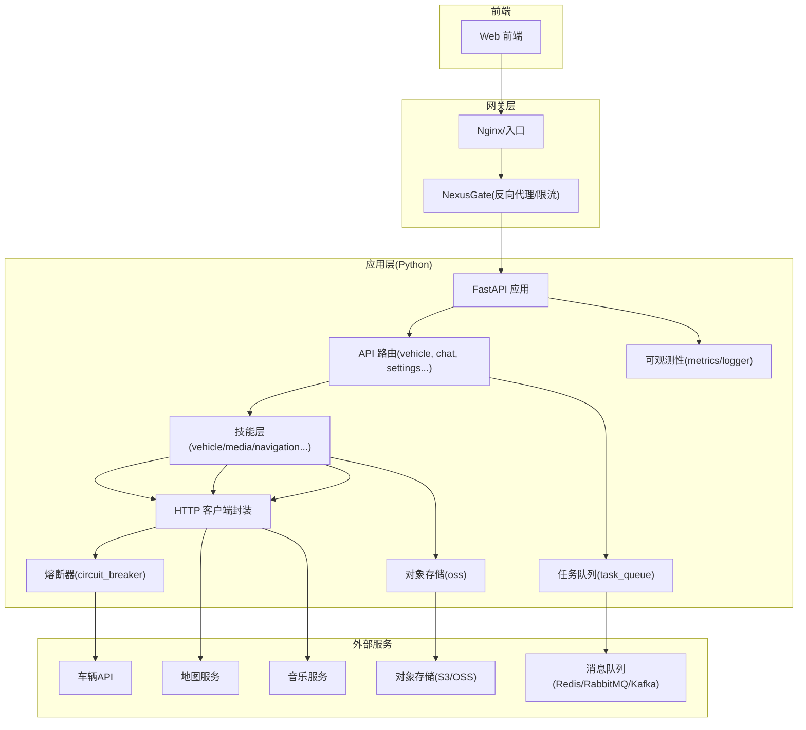
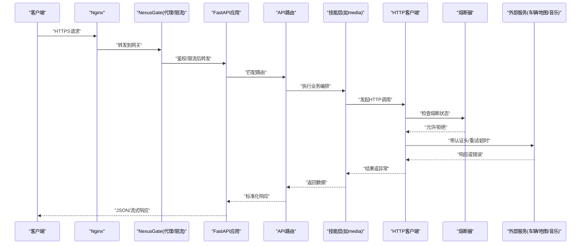
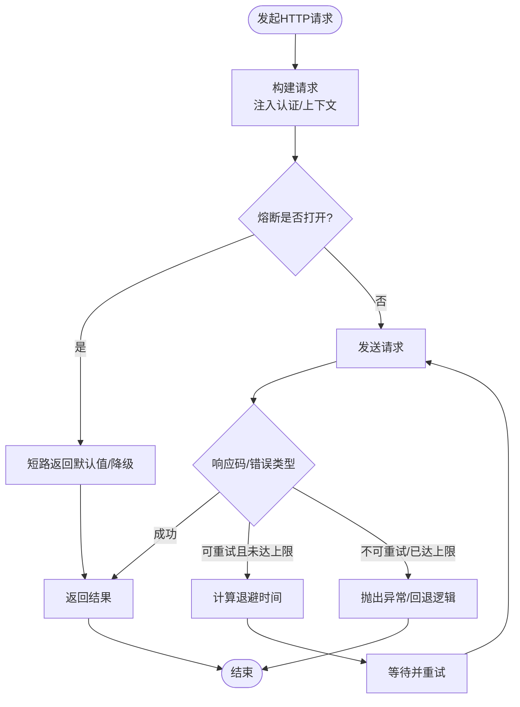
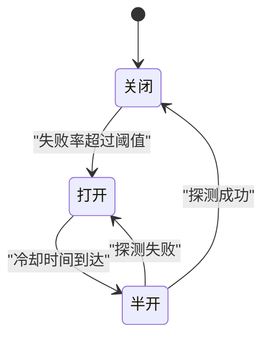
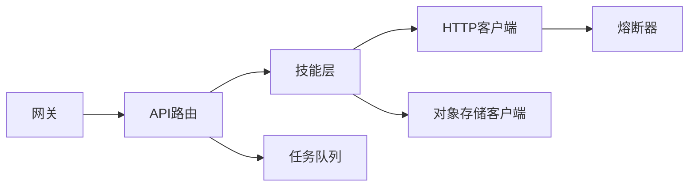

# 第三方服务集成

<cite>
**本文引用的文件**   
- [backend_design/nexus/vehicle/http.py](file://backend_design/nexus/vehicle/http.py)
- [backend_design/nexus/core/circuit_breaker.py](file://backend_design/nexus/core/circuit_breaker.py)
- [backend_design/nexus/core/oss.py](file://backend_design/nexus/core/oss.py)
- [backend_design/nexus/middleware/task_queue.py](file://backend_design/nexus/middleware/task_queue.py)
- [backend_design/nexus/api/routes/vehicle.py](file://backend_design/nexus/api/routes/vehicle.py)
- [backend_design/nexus/skills/vehicle/media.py](file://backend_design/nexus/skills/vehicle/media.py)
- [backend_design/nexus/config.py](file://backend_design/nexus/config.py)
- [backend_design/nexus/core/logger.py](file://backend_design/nexus/core/logger.py)
- [backend_design/nexus/observability/metrics.py](file://backend_design/nexus/observability/metrics.py)
- [backend_design/nexus_gate/internal/proxy/proxy.go](file://backend_design/nexus_gate/internal/proxy/proxy.go)
- [backend_design/nexus_gate/internal/ratelimit/ratelimit.go](file://backend_design/nexus_gate/internal/ratelimit/ratelimit.go)
- [config/prometheus/prometheus.yml](file://config/prometheus/prometheus.yml)
- [config/grafana/provisioning/dashboards/nexuscockpit-overview.json](file://config/grafana/provisioning/dashboards/nexuscockpit-overview.json)
</cite>

## 目录
1. [简介](#简介)
2. [项目结构](#项目结构)
3. [核心组件](#核心组件)
4. [架构总览](#架构总览)
5. [详细组件分析](#详细组件分析)
6. [依赖关系分析](#依赖关系分析)
7. [性能与可靠性](#性能与可靠性)
8. [配置与密钥管理](#配置与密钥管理)
9. [测试方法](#测试方法)
10. [监控与可观测性](#监控与可观测性)
11. [故障排查指南](#故障排查指南)
12. [结论](#结论)

## 简介
本指南面向NexusCockpit系统的第三方服务集成，覆盖外部API、消息队列、对象存储及微服务的接入方式。重点说明HTTP客户端封装、认证机制、错误重试策略、服务发现与负载均衡、熔断降级、配置与密钥管理、安全最佳实践，以及测试、监控与排障方法。文档同时提供车辆API、地图服务、音乐服务等常见场景的集成示例路径与要点。

## 项目结构
与第三方服务集成相关的核心代码主要分布在以下模块：
- HTTP客户端与重试/熔断：后端Python侧的HTTP封装与熔断器
- 对象存储：统一OSS客户端封装
- 任务队列：异步任务与消息队列中间件
- API路由：对外暴露的车辆控制等接口
- 技能层：业务编排（如媒体播放）
- 网关：Go实现的反向代理、限流与鉴权前置
- 可观测性：指标采集与Prometheus/Grafana配置

图表来源
- [backend_design/nexus/api/routes/vehicle.py](file://backend_design/nexus/api/routes/vehicle.py)
- [backend_design/nexus/skills/vehicle/media.py](file://backend_design/nexus/skills/vehicle/media.py)
- [backend_design/nexus/vehicle/http.py](file://backend_design/nexus/vehicle/http.py)
- [backend_design/nexus/core/circuit_breaker.py](file://backend_design/nexus/core/circuit_breaker.py)
- [backend_design/nexus/middleware/task_queue.py](file://backend_design/nexus/middleware/task_queue.py)
- [backend_design/nexus/core/oss.py](file://backend_design/nexus/core/oss.py)
- [backend_design/nexus_gate/internal/proxy/proxy.go](file://backend_design/nexus_gate/internal/proxy/proxy.go)
- [backend_design/nexus_gate/internal/ratelimit/ratelimit.go](file://backend_design/nexus_gate/internal/ratelimit/ratelimit.go)

章节来源
- [backend_design/nexus/api/routes/vehicle.py](file://backend_design/nexus/api/routes/vehicle.py)
- [backend_design/nexus/skills/vehicle/media.py](file://backend_design/nexus/skills/vehicle/media.py)
- [backend_design/nexus/vehicle/http.py](file://backend_design/nexus/vehicle/http.py)
- [backend_design/nexus/core/circuit_breaker.py](file://backend_design/nexus/core/circuit_breaker.py)
- [backend_design/nexus/middleware/task_queue.py](file://backend_design/nexus/middleware/task_queue.py)
- [backend_design/nexus/core/oss.py](file://backend_design/nexus/core/oss.py)
- [backend_design/nexus_gate/internal/proxy/proxy.go](file://backend_design/nexus_gate/internal/proxy/proxy.go)
- [backend_design/nexus_gate/internal/ratelimit/ratelimit.go](file://backend_design/nexus_gate/internal/ratelimit/ratelimit.go)

## 核心组件
- HTTP客户端封装：统一请求构造、超时、重试、退避、错误分类与上下文透传（租户、追踪ID）。
- 熔断器：基于失败率/延迟阈值快速失败与恢复，避免雪崩。
- 对象存储客户端：统一上传/下载/签名URL能力，适配多后端。
- 任务队列：将耗时操作异步化，支持重试与幂等。
- 网关：反向代理、限流、鉴权前置，屏蔽下游差异。
- 可观测性：指标埋点、结构化日志、链路追踪。

章节来源
- [backend_design/nexus/vehicle/http.py](file://backend_design/nexus/vehicle/http.py)
- [backend_design/nexus/core/circuit_breaker.py](file://backend_design/nexus/core/circuit_breaker.py)
- [backend_design/nexus/core/oss.py](file://backend_design/nexus/core/oss.py)
- [backend_design/nexus/middleware/task_queue.py](file://backend_design/nexus/middleware/task_queue.py)
- [backend_design/nexus_gate/internal/proxy/proxy.go](file://backend_design/nexus_gate/internal/proxy/proxy.go)
- [backend_design/nexus_gate/internal/ratelimit/ratelimit.go](file://backend_design/nexus_gate/internal/ratelimit/ratelimit.go)
- [backend_design/nexus/observability/metrics.py](file://backend_design/nexus/observability/metrics.py)
- [backend_design/nexus/core/logger.py](file://backend_design/nexus/core/logger.py)

## 架构总览
从请求进入至调用第三方服务的端到端流程如下：

图表来源
- [backend_design/nexus/api/routes/vehicle.py](file://backend_design/nexus/api/routes/vehicle.py)
- [backend_design/nexus/skills/vehicle/media.py](file://backend_design/nexus/skills/vehicle/media.py)
- [backend_design/nexus/vehicle/http.py](file://backend_design/nexus/vehicle/http.py)
- [backend_design/nexus/core/circuit_breaker.py](file://backend_design/nexus/core/circuit_breaker.py)
- [backend_design/nexus_gate/internal/proxy/proxy.go](file://backend_design/nexus_gate/internal/proxy/proxy.go)
- [backend_design/nexus_gate/internal/ratelimit/ratelimit.go](file://backend_design/nexus_gate/internal/ratelimit/ratelimit.go)

## 详细组件分析

### HTTP客户端封装与重试策略
- 职责：统一构建请求、注入认证头、设置超时、指数退避重试、错误分类与回退。
- 关键点：
  - 重试条件：仅对可重试错误（网络抖动、5xx、超时）进行有限次重试；幂等性需由上层保证。
  - 退避策略：固定/指数退避+抖动，避免惊群。
  - 上下文透传：租户ID、追踪ID、用户会话信息随请求传递。
  - 连接池与复用：合理设置最大连接数、空闲回收。
  - 熔断联动：在熔断开启时直接短路，减少下游压力。

图表来源
- [backend_design/nexus/vehicle/http.py](file://backend_design/nexus/vehicle/http.py)
- [backend_design/nexus/core/circuit_breaker.py](file://backend_design/nexus/core/circuit_breaker.py)

章节来源
- [backend_design/nexus/vehicle/http.py](file://backend_design/nexus/vehicle/http.py)
- [backend_design/nexus/core/circuit_breaker.py](file://backend_design/nexus/core/circuit_breaker.py)

### 熔断器设计与行为
- 目标：防止级联故障，保护系统稳定性。
- 关键参数：窗口大小、失败阈值、半开探测次数、冷却时间。
- 状态机：关闭→打开→半开→关闭/打开。
- 使用建议：对不稳定外部服务启用；对强一致读/写区分策略。

图表来源
- [backend_design/nexus/core/circuit_breaker.py](file://backend_design/nexus/core/circuit_breaker.py)

章节来源
- [backend_design/nexus/core/circuit_breaker.py](file://backend_design/nexus/core/circuit_breaker.py)

### 对象存储(OSS)集成
- 能力：上传、下载、生成临时访问URL、批量操作。
- 适配：通过抽象层对接不同后端（S3/OSS/MinIO），凭据与端点来自配置。
- 安全：最小权限原则、临时凭证、服务端加密可选。

章节来源
- [backend_design/nexus/core/oss.py](file://backend_design/nexus/core/oss.py)

### 任务队列与消息队列
- 用途：将耗时任务（如转码、大文件处理、批量同步）异步化。
- 特性：重试、死信队列、幂等键、优先级。
- 中间件：基于Redis或其他消息中间件实现。

章节来源
- [backend_design/nexus/middleware/task_queue.py](file://backend_design/nexus/middleware/task_queue.py)

### API路由与技能编排
- 路由层：接收请求、校验参数、编排技能、返回标准响应。
- 技能层：按领域组织（如媒体、导航、车辆状态），内部组合HTTP调用与本地逻辑。

章节来源
- [backend_design/nexus/api/routes/vehicle.py](file://backend_design/nexus/api/routes/vehicle.py)
- [backend_design/nexus/skills/vehicle/media.py](file://backend_design/nexus/skills/vehicle/media.py)

### 网关(NexusGate)：反向代理与限流
- 功能：统一入口、鉴权前置、限流、协议转换、健康检查。
- 限流：令牌桶/漏桶算法，按IP/用户/接口维度限制。
- 代理：透明转发至后端服务，支持动态路由与健康检查。

章节来源
- [backend_design/nexus_gate/internal/proxy/proxy.go](file://backend_design/nexus_gate/internal/proxy/proxy.go)
- [backend_design/nexus_gate/internal/ratelimit/ratelimit.go](file://backend_design/nexus_gate/internal/ratelimit/ratelimit.go)

## 依赖关系分析
- 耦合关系：
  - 技能层依赖HTTP客户端与熔断器。
  - 路由层依赖技能层与任务队列。
  - 网关独立于应用层，负责流量治理。
- 外部依赖：
  - 车辆API、地图服务、音乐服务为外部HTTP服务。
  - 对象存储为外部存储服务。
  - 消息队列用于异步任务。

图表来源
- [backend_design/nexus/api/routes/vehicle.py](file://backend_design/nexus/api/routes/vehicle.py)
- [backend_design/nexus/skills/vehicle/media.py](file://backend_design/nexus/skills/vehicle/media.py)
- [backend_design/nexus/vehicle/http.py](file://backend_design/nexus/vehicle/http.py)
- [backend_design/nexus/core/circuit_breaker.py](file://backend_design/nexus/core/circuit_breaker.py)
- [backend_design/nexus/core/oss.py](file://backend_design/nexus/core/oss.py)
- [backend_design/nexus/middleware/task_queue.py](file://backend_design/nexus/middleware/task_queue.py)
- [backend_design/nexus_gate/internal/proxy/proxy.go](file://backend_design/nexus_gate/internal/proxy/proxy.go)

## 性能与可靠性
- 连接与并发：
  - 调整HTTP连接池大小、超时与Keep-Alive策略。
  - 对热点外部服务采用缓存与预取。
- 重试与退避：
  - 仅对幂等请求重试；指数退避+随机抖动。
- 熔断与降级：
  - 针对不稳定服务启用熔断；提供降级响应或缓存数据。
- 限流与背压：
  - 网关层限流；应用层根据负载自适应降速。
- 资源隔离：
  - 对不同外部服务使用独立的线程池/连接池，避免相互影响。

[本节为通用指导，不直接分析具体文件]

## 配置与密钥管理
- 配置项：
  - 外部服务地址、超时、重试次数、退避策略、熔断阈值、队列参数、OSS端点与凭据。
- 密钥管理：
  - 使用环境变量或密钥管理服务注入；避免硬编码。
  - 定期轮换，最小权限。
- 安全最佳实践：
  - HTTPS强制、证书校验、敏感字段脱敏、审计日志。
  - 输入校验与输出过滤，防注入与越权。

章节来源
- [backend_design/nexus/config.py](file://backend_design/nexus/config.py)

## 测试方法
- 单元测试：
  - 对HTTP客户端封装、熔断器、OSS客户端进行Mock测试。
- 集成测试：
  - 使用Testcontainers或本地Mock服务模拟外部API与对象存储。
- 混沌与压测：
  - 注入延迟/错误，验证熔断与重试效果；压测限流与吞吐。
- 契约测试：
  - 与第三方服务提供方约定接口契约，自动化回归。

[本节为通用指导，不直接分析具体文件]

## 监控与可观测性
- 指标：
  - 外部服务调用成功率、延迟分布、错误码分布、熔断状态、队列积压、OSS吞吐。
- 日志：
  - 结构化日志，包含租户、追踪ID、外部服务标识。
- 链路追踪：
  - 跨网关、应用、外部调用的完整链路。
- Prometheus与Grafana：
  - 暴露指标端点，配置抓取与仪表盘。

章节来源
- [backend_design/nexus/observability/metrics.py](file://backend_design/nexus/observability/metrics.py)
- [backend_design/nexus/core/logger.py](file://backend_design/nexus/core/logger.py)
- [config/prometheus/prometheus.yml](file://config/prometheus/prometheus.yml)
- [config/grafana/provisioning/dashboards/nexuscockpit-overview.json](file://config/grafana/provisioning/dashboards/nexuscockpit-overview.json)

## 故障排查指南
- 常见问题：
  - 外部服务超时：检查网络连通、DNS解析、TLS握手、上游限流。
  - 熔断频繁打开：观察失败率与延迟，调整阈值与冷却时间。
  - 重试风暴：确认幂等性与退避策略，增加抖动。
  - 队列堆积：检查消费者处理能力、死信队列、重试策略。
  - OSS上传失败：检查凭据、权限、网络与分片策略。
- 定位步骤：
  - 查看结构化日志与链路追踪，定位失败节点。
  - 检查网关限流与应用层指标，识别瓶颈。
  - 复现问题并逐步缩小范围（单租户/单接口/单外部服务）。

章节来源
- [backend_design/nexus/core/logger.py](file://backend_design/nexus/core/logger.py)
- [backend_design/nexus/observability/metrics.py](file://backend_design/nexus/observability/metrics.py)
- [backend_design/nexus_gate/internal/ratelimit/ratelimit.go](file://backend_design/nexus_gate/internal/ratelimit/ratelimit.go)

## 结论
通过统一的HTTP客户端封装、熔断器、任务队列与对象存储抽象，结合网关的限流与鉴权，NexusCockpit能够稳定、安全地集成各类第三方服务。配合完善的配置与密钥管理、监控与排障体系，可在复杂生产环境中保持高可用与可维护性。建议在新增外部服务时遵循本文规范，确保一致性、可观测性与安全性。