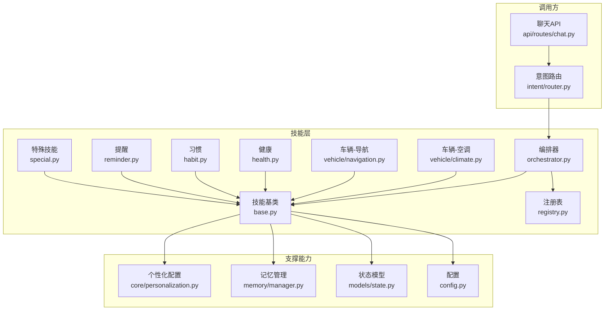
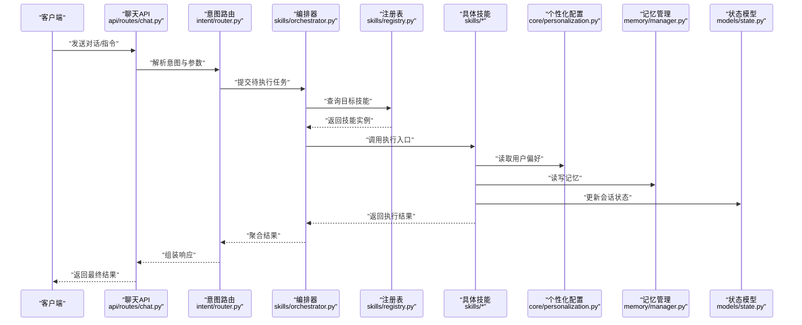
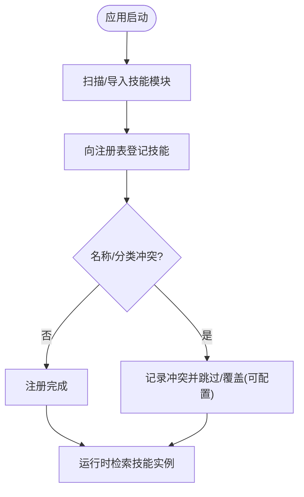
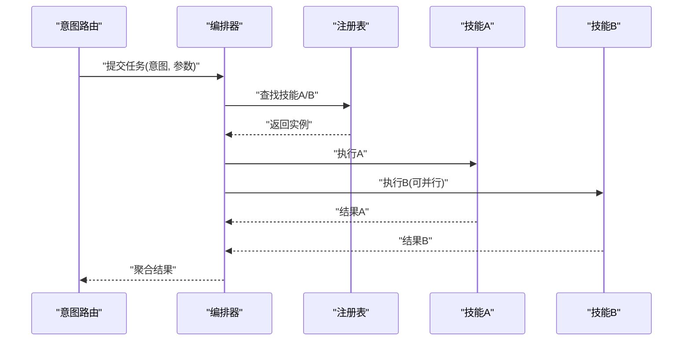
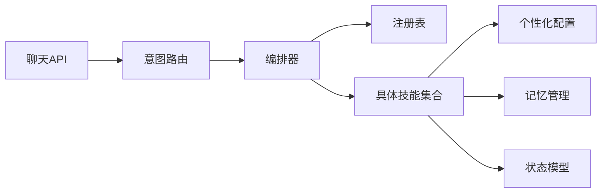

# 自定义技能开发

<cite>
**本文引用的文件**   
- [backend_design/nexus/skills/base.py](file://backend_design/nexus/skills/base.py)
- [backend_design/nexus/skills/registry.py](file://backend_design/nexus/skills/registry.py)
- [backend_design/nexus/skills/orchestrator.py](file://backend_design/nexus/skills/orchestrator.py)
- [backend_design/nexus/skills/__init__.py](file://backend_design/nexus/skills/__init__.py)
- [backend_design/nexus/skills/vehicle/climate.py](file://backend_design/nexus/skills/vehicle/climate.py)
- [backend_design/nexus/skills/vehicle/navigation.py](file://backend_design/nexus/skills/vehicle/navigation.py)
- [backend_design/nexus/skills/health.py](file://backend_design/nexus/skills/health.py)
- [backend_design/nexus/skills/habit.py](file://backend_design/nexus/skills/habit.py)
- [backend_design/nexus/skills/reminder.py](file://backend_design/nexus/skills/reminder.py)
- [backend_design/nexus/skills/special.py](file://backend_design/nexus/skills/special.py)
- [backend_design/nexus/intent/router.py](file://backend_design/nexus/intent/router.py)
- [backend_design/nexus/api/routes/chat.py](file://backend_design/nexus/api/routes/chat.py)
- [backend_design/nexus/core/personalization.py](file://backend_design/nexus/core/personalization.py)
- [backend_design/nexus/memory/manager.py](file://backend_design/nexus/memory/manager.py)
- [backend_design/nexus/models/state.py](file://backend_design/nexus/models/state.py)
- [backend_design/nexus/config.py](file://backend_design/nexus/config.py)
</cite>

## 目录
1. [简介](#简介)
2. [项目结构](#项目结构)
3. [核心组件](#核心组件)
4. [架构总览](#架构总览)
5. [详细组件分析](#详细组件分析)
6. [依赖关系分析](#依赖关系分析)
7. [性能考虑](#性能考虑)
8. [故障排查指南](#故障排查指南)
9. [结论](#结论)
10. [附录](#附录)

## 简介
本指南面向希望为系统扩展“自定义技能”的开发者，围绕技能基类设计、接口规范、注册机制、编排器集成、测试与调试、性能优化以及版本管理与发布流程进行系统化说明。文档以实际代码为依据，提供循序渐进的学习路径和可操作的实践建议，帮助快速构建车辆控制、健康管理、习惯学习等类型技能并稳定集成到系统中。

## 项目结构
技能相关代码集中在 backend_design/nexus/skills 目录下，包含：
- 基类与注册表：定义技能抽象、生命周期与全局注册机制
- 编排器：负责意图路由后的任务调度、执行顺序与结果聚合
- 领域技能：车辆（空调、导航等）、健康、习惯、提醒、特殊技能等
- 外部集成点：意图路由、API 入口、个性化配置、记忆管理等

图表来源
- [backend_design/nexus/skills/base.py](file://backend_design/nexus/skills/base.py)
- [backend_design/nexus/skills/registry.py](file://backend_design/nexus/skills/registry.py)
- [backend_design/nexus/skills/orchestrator.py](file://backend_design/nexus/skills/orchestrator.py)
- [backend_design/nexus/skills/vehicle/climate.py](file://backend_design/nexus/skills/vehicle/climate.py)
- [backend_design/nexus/skills/vehicle/navigation.py](file://backend_design/nexus/skills/vehicle/navigation.py)
- [backend_design/nexus/skills/health.py](file://backend_design/nexus/skills/health.py)
- [backend_design/nexus/skills/habit.py](file://backend_design/nexus/skills/habit.py)
- [backend_design/nexus/skills/reminder.py](file://backend_design/nexus/skills/reminder.py)
- [backend_design/nexus/skills/special.py](file://backend_design/nexus/skills/special.py)
- [backend_design/nexus/intent/router.py](file://backend_design/nexus/intent/router.py)
- [backend_design/nexus/api/routes/chat.py](file://backend_design/nexus/api/routes/chat.py)
- [backend_design/nexus/core/personalization.py](file://backend_design/nexus/core/personalization.py)
- [backend_design/nexus/memory/manager.py](file://backend_design/nexus/memory/manager.py)
- [backend_design/nexus/models/state.py](file://backend_design/nexus/models/state.py)
- [backend_design/nexus/config.py](file://backend_design/nexus/config.py)

章节来源
- [backend_design/nexus/skills/base.py](file://backend_design/nexus/skills/base.py)
- [backend_design/nexus/skills/registry.py](file://backend_design/nexus/skills/registry.py)
- [backend_design/nexus/skills/orchestrator.py](file://backend_design/nexus/skills/orchestrator.py)
- [backend_design/nexus/skills/vehicle/climate.py](file://backend_design/nexus/skills/vehicle/climate.py)
- [backend_design/nexus/skills/vehicle/navigation.py](file://backend_design/nexus/skills/vehicle/navigation.py)
- [backend_design/nexus/skills/health.py](file://backend_design/nexus/skills/health.py)
- [backend_design/nexus/skills/habit.py](file://backend_design/nexus/skills/habit.py)
- [backend_design/nexus/skills/reminder.py](file://backend_design/nexus/skills/reminder.py)
- [backend_design/nexus/skills/special.py](file://backend_design/nexus/skills/special.py)
- [backend_design/nexus/intent/router.py](file://backend_design/nexus/intent/router.py)
- [backend_design/nexus/api/routes/chat.py](file://backend_design/nexus/api/routes/chat.py)
- [backend_design/nexus/core/personalization.py](file://backend_design/nexus/core/personalization.py)
- [backend_design/nexus/memory/manager.py](file://backend_design/nexus/memory/manager.py)
- [backend_design/nexus/models/state.py](file://backend_design/nexus/models/state.py)
- [backend_design/nexus/config.py](file://backend_design/nexus/config.py)

## 核心组件
- 技能基类：定义技能的统一抽象，包括元数据、参数校验、执行入口、上下文访问、错误处理与日志记录等。
- 注册表：集中维护所有已加载的技能实例，支持按名称或类别检索，并提供插件式发现与自动注册能力。
- 编排器：根据意图识别结果选择并编排一个或多个技能执行，负责参数传递、并发控制、结果合并与异常降级。
- 领域技能：基于基类实现的具体业务逻辑，如车辆控制（空调、导航）、健康评估、习惯学习与提醒服务等。
- 集成点：通过 API 路由与意图路由接入；借助个性化配置、记忆管理与状态模型完成用户上下文与持久化。

章节来源
- [backend_design/nexus/skills/base.py](file://backend_design/nexus/skills/base.py)
- [backend_design/nexus/skills/registry.py](file://backend_design/nexus/skills/registry.py)
- [backend_design/nexus/skills/orchestrator.py](file://backend_design/nexus/skills/orchestrator.py)
- [backend_design/nexus/skills/vehicle/climate.py](file://backend_design/nexus/skills/vehicle/climate.py)
- [backend_design/nexus/skills/vehicle/navigation.py](file://backend_design/nexus/skills/vehicle/navigation.py)
- [backend_design/nexus/skills/health.py](file://backend_design/nexus/skills/health.py)
- [backend_design/nexus/skills/habit.py](file://backend_design/nexus/skills/habit.py)
- [backend_design/nexus/skills/reminder.py](file://backend_design/nexus/skills/reminder.py)
- [backend_design/nexus/skills/special.py](file://backend_design/nexus/skills/special.py)
- [backend_design/nexus/intent/router.py](file://backend_design/nexus/intent/router.py)
- [backend_design/nexus/api/routes/chat.py](file://backend_design/nexus/api/routes/chat.py)
- [backend_design/nexus/core/personalization.py](file://backend_design/nexus/core/personalization.py)
- [backend_design/nexus/memory/manager.py](file://backend_design/nexus/memory/manager.py)
- [backend_design/nexus/models/state.py](file://backend_design/nexus/models/state.py)
- [backend_design/nexus/config.py](file://backend_design/nexus/config.py)

## 架构总览
下图展示了从用户请求到技能执行的端到端流程，涵盖 API 入口、意图路由、编排器调度、具体技能执行与结果返回。

图表来源
- [backend_design/nexus/api/routes/chat.py](file://backend_design/nexus/api/routes/chat.py)
- [backend_design/nexus/intent/router.py](file://backend_design/nexus/intent/router.py)
- [backend_design/nexus/skills/orchestrator.py](file://backend_design/nexus/skills/orchestrator.py)
- [backend_design/nexus/skills/registry.py](file://backend_design/nexus/skills/registry.py)
- [backend_design/nexus/skills/vehicle/climate.py](file://backend_design/nexus/skills/vehicle/climate.py)
- [backend_design/nexus/skills/health.py](file://backend_design/nexus/skills/health.py)
- [backend_design/nexus/skills/habit.py](file://backend_design/nexus/skills/habit.py)
- [backend_design/nexus/core/personalization.py](file://backend_design/nexus/core/personalization.py)
- [backend_design/nexus/memory/manager.py](file://backend_design/nexus/memory/manager.py)
- [backend_design/nexus/models/state.py](file://backend_design/nexus/models/state.py)

## 详细组件分析

### 技能基类与接口规范
- 设计要点
  - 统一的元数据描述：名称、版本、分类、描述、参数模式等
  - 标准化执行入口：接收上下文与参数，返回结构化结果
  - 上下文访问：个性化配置、记忆、状态、日志、超时与重试策略
  - 错误与边界处理：参数校验失败、外部依赖异常、资源不可用等
  - 可选钩子：初始化、销毁、预热、健康检查、指标上报
- 必需方法
  - 执行入口：用于编排器调用的主方法
  - 参数校验：确保输入合法与安全
  - 上下文获取：读取用户偏好、记忆与当前状态
- 可选方法
  - 初始化/销毁：资源准备与清理
  - 健康检查：暴露可用性探针
  - 指标上报：埋点关键指标
- 最佳实践
  - 幂等性：对重复调用具备容错能力
  - 可观测性：记录必要日志与指标
  - 可配置性：通过配置开关控制行为
  - 可测试性：将外部依赖抽象为接口以便替换

章节来源
- [backend_design/nexus/skills/base.py](file://backend_design/nexus/skills/base.py)
- [backend_design/nexus/core/personalization.py](file://backend_design/nexus/core/personalization.py)
- [backend_design/nexus/memory/manager.py](file://backend_design/nexus/memory/manager.py)
- [backend_design/nexus/models/state.py](file://backend_design/nexus/models/state.py)
- [backend_design/nexus/config.py](file://backend_design/nexus/config.py)

### 技能注册机制
- 工作原理
  - 集中注册：在模块导入时向注册表登记技能实例
  - 动态发现：支持扫描包或显式导入触发注册
  - 冲突检测：同名或同分类覆盖策略与告警
  - 按需加载：延迟实例化以减少启动开销
- 配置方法
  - 启用/禁用特定技能
  - 指定默认版本与回退策略
  - 设置权限与可见范围（租户/用户）
- 使用方式
  - 通过名称或分类检索技能实例
  - 批量列出可用技能清单
  - 热重载与动态卸载（视平台能力）

图表来源
- [backend_design/nexus/skills/registry.py](file://backend_design/nexus/skills/registry.py)
- [backend_design/nexus/skills/__init__.py](file://backend_design/nexus/skills/__init__.py)

章节来源
- [backend_design/nexus/skills/registry.py](file://backend_design/nexus/skills/registry.py)
- [backend_design/nexus/skills/__init__.py](file://backend_design/nexus/skills/__init__.py)

### 编排器集成与执行流程
- 职责
  - 根据意图选择目标技能或组合多个技能
  - 参数注入与上下文装配
  - 并发控制、超时与重试
  - 结果聚合与降级策略
- 执行流程
  - 接收意图与参数
  - 查找并验证技能
  - 执行单个或并行多个技能
  - 收集结果、处理异常、生成最终响应
- 编排策略
  - 串行：严格顺序执行
  - 并行：独立任务并发执行
  - 条件分支：根据中间结果决定后续步骤

图表来源
- [backend_design/nexus/skills/orchestrator.py](file://backend_design/nexus/skills/orchestrator.py)
- [backend_design/nexus/skills/registry.py](file://backend_design/nexus/skills/registry.py)
- [backend_design/nexus/intent/router.py](file://backend_design/nexus/intent/router.py)

章节来源
- [backend_design/nexus/skills/orchestrator.py](file://backend_design/nexus/skills/orchestrator.py)
- [backend_design/nexus/skills/registry.py](file://backend_design/nexus/skills/registry.py)
- [backend_design/nexus/intent/router.py](file://backend_design/nexus/intent/router.py)

### 领域技能示例与模板

#### 车辆控制技能（空调）
- 功能要点
  - 温度设定、风量调节、出风模式、分区控制
  - 与车辆总线或 HTTP/MCP 网关交互
  - 安全限制与权限校验
- 典型流程
  - 参数校验 → 读取用户偏好 → 下发控制指令 → 确认状态 → 返回结果
- 参考实现
  - [backend_design/nexus/skills/vehicle/climate.py](file://backend_design/nexus/skills/vehicle/climate.py)

章节来源
- [backend_design/nexus/skills/vehicle/climate.py](file://backend_design/nexus/skills/vehicle/climate.py)

#### 车辆控制技能（导航）
- 功能要点
  - 目的地设置、路线规划、实时路况、语音播报
  - 与地图服务或车载导航系统对接
- 典型流程
  - 地址解析 → 路线计算 → 下发导航 → 跟踪进度 → 反馈结果
- 参考实现
  - [backend_design/nexus/skills/vehicle/navigation.py](file://backend_design/nexus/skills/vehicle/navigation.py)

章节来源
- [backend_design/nexus/skills/vehicle/navigation.py](file://backend_design/nexus/skills/vehicle/navigation.py)

#### 健康管理技能
- 功能要点
  - 健康数据采集、指标评估、风险提示、建议生成
  - 结合记忆与个性化配置提供长期趋势分析
- 典型流程
  - 读取健康数据 → 规则/模型评估 → 生成报告与建议 → 写入记忆
- 参考实现
  - [backend_design/nexus/skills/health.py](file://backend_design/nexus/skills/health.py)

章节来源
- [backend_design/nexus/skills/health.py](file://backend_design/nexus/skills/health.py)

#### 习惯学习技能
- 功能要点
  - 行为序列建模、偏好推断、场景化推荐
  - 增量学习与离线训练结合
- 典型流程
  - 采集行为事件 → 特征提取 → 模型推理 → 输出推荐策略
- 参考实现
  - [backend_design/nexus/skills/habit.py](file://backend_design/nexus/skills/habit.py)

章节来源
- [backend_design/nexus/skills/habit.py](file://backend_design/nexus/skills/habit.py)

#### 提醒与特殊技能
- 提醒技能
  - 定时任务、周期提醒、条件触发
  - 参考实现：[backend_design/nexus/skills/reminder.py](file://backend_design/nexus/skills/reminder.py)
- 特殊技能
  - 一次性或实验性功能，需明确版本与弃用策略
  - 参考实现：[backend_design/nexus/skills/special.py](file://backend_design/nexus/skills/special.py)

章节来源
- [backend_design/nexus/skills/reminder.py](file://backend_design/nexus/skills/reminder.py)
- [backend_design/nexus/skills/special.py](file://backend_design/nexus/skills/special.py)

### 技能开发模板与示例代码路径
- 新建技能步骤
  - 继承技能基类，实现必需方法与可选钩子
  - 在模块中向注册表登记实例
  - 编写单元测试与集成测试
  - 添加配置项与文档说明
- 模板位置与示例
  - 基类模板：[backend_design/nexus/skills/base.py](file://backend_design/nexus/skills/base.py)
  - 注册示例：[backend_design/nexus/skills/vehicle/climate.py](file://backend_design/nexus/skills/vehicle/climate.py)
  - 健康技能示例：[backend_design/nexus/skills/health.py](file://backend_design/nexus/skills/health.py)
  - 习惯学习示例：[backend_design/nexus/skills/habit.py](file://backend_design/nexus/skills/habit.py)
  - 提醒技能示例：[backend_design/nexus/skills/reminder.py](file://backend_design/nexus/skills/reminder.py)
  - 特殊技能示例：[backend_design/nexus/skills/special.py](file://backend_design/nexus/skills/special.py)

章节来源
- [backend_design/nexus/skills/base.py](file://backend_design/nexus/skills/base.py)
- [backend_design/nexus/skills/vehicle/climate.py](file://backend_design/nexus/skills/vehicle/climate.py)
- [backend_design/nexus/skills/health.py](file://backend_design/nexus/skills/health.py)
- [backend_design/nexus/skills/habit.py](file://backend_design/nexus/skills/habit.py)
- [backend_design/nexus/skills/reminder.py](file://backend_design/nexus/skills/reminder.py)
- [backend_design/nexus/skills/special.py](file://backend_design/nexus/skills/special.py)

## 依赖关系分析
- 组件耦合
  - 编排器依赖注册表与具体技能，低耦合高内聚
  - 技能依赖个性化配置、记忆与状态模型，便于横向扩展
- 外部集成点
  - API 路由作为入口，意图路由作为决策中心
  - 配置中心提供运行时开关与参数
- 潜在风险
  - 循环依赖：避免在基类中直接导入具体技能
  - 单点故障：编排器需具备降级与熔断策略

图表来源
- [backend_design/nexus/skills/orchestrator.py](file://backend_design/nexus/skills/orchestrator.py)
- [backend_design/nexus/skills/registry.py](file://backend_design/nexus/skills/registry.py)
- [backend_design/nexus/api/routes/chat.py](file://backend_design/nexus/api/routes/chat.py)
- [backend_design/nexus/intent/router.py](file://backend_design/nexus/intent/router.py)
- [backend_design/nexus/core/personalization.py](file://backend_design/nexus/core/personalization.py)
- [backend_design/nexus/memory/manager.py](file://backend_design/nexus/memory/manager.py)
- [backend_design/nexus/models/state.py](file://backend_design/nexus/models/state.py)

章节来源
- [backend_design/nexus/skills/orchestrator.py](file://backend_design/nexus/skills/orchestrator.py)
- [backend_design/nexus/skills/registry.py](file://backend_design/nexus/skills/registry.py)
- [backend_design/nexus/api/routes/chat.py](file://backend_design/nexus/api/routes/chat.py)
- [backend_design/nexus/intent/router.py](file://backend_design/nexus/intent/router.py)
- [backend_design/nexus/core/personalization.py](file://backend_design/nexus/core/personalization.py)
- [backend_design/nexus/memory/manager.py](file://backend_design/nexus/memory/manager.py)
- [backend_design/nexus/models/state.py](file://backend_design/nexus/models/state.py)

## 性能考虑
- 并发与批处理
  - 对无副作用且独立的技能采用并行执行
  - 合理设置并发度与队列长度，避免资源争用
- 缓存与预取
  - 对热点配置与静态数据进行缓存
  - 在空闲时段预取常用数据，降低首响时间
- 超时与重试
  - 为外部依赖设置超时与指数退避重试
  - 对幂等操作允许重试，非幂等操作需谨慎
- 资源隔离
  - 不同技能使用独立线程池或进程池
  - 限制内存与CPU配额，防止雪崩
- 可观测性
  - 记录关键指标：QPS、P95/P99延迟、错误率
  - 链路追踪贯穿 API→意图→编排→技能

## 故障排查指南
- 常见问题
  - 技能未注册：检查模块导入与注册表登记
  - 参数校验失败：核对参数模式与必填字段
  - 外部依赖异常：查看超时、重试与熔断配置
  - 结果不一致：检查幂等性与并发竞争
- 调试技巧
  - 开启详细日志与链路追踪
  - 使用沙箱环境模拟外部依赖
  - 逐步缩小范围：先单技能后编排
- 恢复策略
  - 快速回滚到上一稳定版本
  - 降级到基础功能或默认策略
  - 通知与告警联动

章节来源
- [backend_design/nexus/skills/registry.py](file://backend_design/nexus/skills/registry.py)
- [backend_design/nexus/skills/orchestrator.py](file://backend_design/nexus/skills/orchestrator.py)
- [backend_design/nexus/skills/base.py](file://backend_design/nexus/skills/base.py)

## 结论
通过统一的基类与注册机制，系统实现了技能的可插拔与可扩展。编排器将意图与执行解耦，使多技能协作成为可能。遵循本文档的接口规范、测试策略与性能优化建议，开发者可以快速构建高质量技能并稳定集成到生产环境中。

## 附录

### 版本管理与发布流程
- 版本策略
  - 语义化版本：主版本（不兼容变更）、次版本（向后兼容新增）、修订（缺陷修复）
  - 技能级版本：每个技能独立版本号，支持灰度与回滚
- 发布流程
  - 代码评审与自动化测试通过后进入候选版本
  - 灰度发布：小流量验证稳定性与效果
  - 全量发布：监控指标达标后逐步放量
  - 回滚预案：一键回滚至上一稳定版本
- 文档与变更日志
  - 变更记录：新增、废弃、破坏性变更说明
  - 升级指南：迁移步骤与兼容性提示

### 测试策略
- 单元测试
  - 覆盖参数校验、边界条件与异常路径
  - 使用桩对象替换外部依赖
- 集成测试
  - 端到端流程：API→意图→编排→技能
  - 模拟真实环境与数据
- 性能测试
  - 压测关键路径，关注延迟与吞吐
  - 容量规划与弹性伸缩验证
- 回归测试
  - 自动化用例库，持续集成
  - 变更影响面分析与最小化回归集